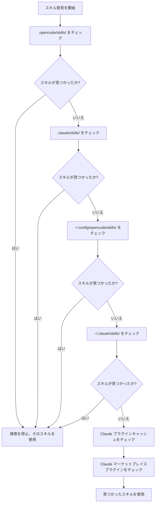

# スキル発見メカニズム詳解

## 本レッスンでできること

- プラグインがどの場所から自動的にスキルを発見するかを理解する
- スキル発見の優先順位ルールを習得する
- プロジェクトレベルスキルでユーザーレベルスキルを上書きする方法を知る
- Claude Code スキル互換メカニズムを理解する

## 現在の課題

スキルを作成したが、AI がずっと「スキルが見つからない」と言う。プラグインがどこでスキルを検索するか分からず、同名スキルがどうなるかも分からない。結果として、スキルを間違った場所に配置したり、他の場所のスキルに上書きされたりしている。

## この機能を使う場面

- 特定のスキルをプロジェクトで有効にしたい場合
- ユーザーレベルやプラグイン付属のスキルを上書きしたい場合
- Claude Code のスキルを再利用する場合

## 🎒 開始前の準備

::: warning 前提知識
先に [OpenCode Agent Skills のインストール](../../start/installation/) を完了してください。
:::

## 核心的なアプローチ

OpenCode Agent Skills は複数の場所から自動的にスキルを発見し、優先順位に従って検索します。**最初に見つかったスキルが有効になり、後続の同名スキルは無視されます**。これにより、プロジェクト内でユーザーレベルスキルを上書きしてカスタマイズを実現できます。

### 発見パスの概要



::: info スキル名の一意性
同名スキルは最初に見つかったもののみが保持され、後続のものは無視されます。これは、プロジェクトレベルの `git-helper` がユーザーレベルの `git-helper` を上書きすることを意味します。
:::

## ハンズオン

### ステップ 1: スキル発見ロジックを確認する

**なぜ必要か**
プラグインがどのようにスキルディレクトリをスキャンするかを理解すると、問題の特定に役立ちます。

ソースコード内の発見パス定義を確認します：

```typescript
// src/skills.ts:241-246
const discoveryPaths: DiscoveryPath[] = [
  { path: path.join(directory, '.opencode', 'skills'), label: 'project', maxDepth: 3 },
  { path: path.join(directory, '.claude', 'skills'), label: 'claude-project', maxDepth: 1 },
  { path: path.join(homedir(), '.config', 'opencode', 'skills'), label: 'user', maxDepth: 3 },
  { path: path.join(homedir(), '.claude', 'skills'), label: 'claude-user', maxDepth: 1 }
];
```

**確認できること**：
- 4 つのローカル発見パスで、それぞれに `label`（ソース識別子）と `maxDepth`（最大再帰深度）がある
- さらに 2 つの Claude プラグインパス（キャッシュとマーケットプレイスプラグイン）があり、`discoverPluginCacheSkills()` と `discoverMarketplaceSkills()` で発見される
- `directory` はプロジェクトルートディレクトリ、`homedir()` はユーザーホームディレクトリ

### ステップ 2: 再帰検索メカニズムを理解する

**なぜ必要か**
再帰深度の制限を理解すると、スキルを深すぎる場所に配置して見つからない問題を回避できます。

再帰検索関数はディレクトリツリーを走査して `SKILL.md` ファイルを検索します：

```typescript
// src/skills.ts:182-207
async function recurse(dir: string, depth: number, relPath: string) {
  if (depth > maxDepth) return;  // 深度制限を超えたら検索を停止

  const entries = await fs.readdir(dir, { withFileTypes: true });
  for (const entry of entries) {
    const fullPath = path.join(dir, entry.name);
    const stats = await fs.stat(fullPath);

    if (!stats.isDirectory()) continue;  // ファイルをスキップ

    const newRelPath = relPath ? `${relPath}/${entry.name}` : entry.name;
    const found = await findFile(fullPath, newRelPath, 'SKILL.md');

    if (found) {
      results.push({ ...found, label });  // スキルが見つかったら結果に追加
    } else {
      await recurse(fullPath, depth + 1, newRelPath);  // サブディレクトリを再帰検索
    }
  }
}
```

**確認できること**：
- 各ディレクトリの深度は 0 から開始し、`maxDepth` を超えると停止
- `SKILL.md` が見つかったら返却し、それ以外はサブディレクトリの検索を継続

**各場所の再帰深度**：

| 位置                | Label           | 最大深度 | 説明                       |
|--- | --- | --- | ---|
| `.opencode/skills/` | project         | 3        | ネストされたディレクトリ構造をサポート           |
| `.claude/skills/`   | claude-project  | 1        | 最初のレベルのみスキャン               |
| `~/.config/opencode/skills/` | user   | 3        | ネストされたディレクトリ構造をサポート           |
| `~/.claude/skills/` | claude-user     | 1        | 最初のレベルのみスキャン               |

### ステップ 3: 重複排除ルールを理解する

**なぜ必要か**
同名スキルは 1 つしか保持されないため、このルールを知っておくとスキルが上書きされる問題を回避できます。

重複排除ロジックは `discoverAllSkills` 関数にあります：

```typescript
// src/skills.ts:255-262
const skillsByName = new Map<string, Skill>();
for (const { filePath, relativePath, label } of allResults) {
  const skill = await parseSkillFile(filePath, relativePath, label);
  if (!skill || skillsByName.has(skill.name)) continue;  // 既存の同名スキルをスキップ
  skillsByName.set(skill.name, skill);
}
```

**確認できること**：
- `Map` を使用して `skill.name` で保存し、一意性を確保
- `skillsByName.has(skill.name)` ですでに同名スキルが存在するかをチェック
- 後続の同名スキルは無視される（`continue`）

**シナリオ例**：

```
プロジェクト構造：
.opencode/skills/git-helper/SKILL.md  ← 最初に発見、有効
~/.config/opencode/skills/git-helper/SKILL.md  ← 同名、無視
```

### ステップ 4: SKILL.md ファイルを解析する

**なぜ必要か**
SKILL.md の解析ルールを理解すると、フォーマットエラーを回避できます。

プラグインは SKILL.md の YAML frontmatter を解析します：

```typescript
// src/skills.ts:132-152
const frontmatterMatch = content.match(/^---\n([\s\S]*?)\n---\n([\s\S]*)$/);
if (!frontmatterMatch?.[1] || !frontmatterMatch?.[2]) {
  return null;  // フォーマットエラー、スキップ
}

const frontmatterText = frontmatterMatch[1];
const skillContent = frontmatterMatch[2].trim();

let frontmatterObj: unknown;
try {
  frontmatterObj = parseYamlFrontmatter(frontmatterText);
} catch {
  return null;  // YAML 解析失敗、スキップ
}

let frontmatter: SkillFrontmatter;
try {
  frontmatter = SkillFrontmatterSchema.parse(frontmatterObj);
} catch (error) {
  return null;  // 検証失敗、スキップ
}
```

**確認できること**：
- Frontmatter は `---` で囲まれている必要がある
- YAML コンテンツは Zod Schema 検証に準拠する必要がある
- 解析失敗のスキルは無視される（エラーを投げず、他のスキルの発見を継続）

**Frontmatter 検証ルール**：

```typescript
// src/skills.ts:106-114
const SkillFrontmatterSchema = z.object({
  name: z.string()
    .regex(/^[\p{Ll}\p{N}-]+$/u, { message: "Name must be lowercase alphanumeric with hyphens" })
    .min(1, { message: "Name cannot be empty" }),
  description: z.string()
    .min(1, { message: "Description cannot be empty" }),
  license: z.string().optional(),
  "allowed-tools": z.array(z.string()).optional(),
  metadata: z.record(z.string(), z.string()).optional()
});
```

**命名規則**：
- 小文字、数字、ハイフン（`-`）のみ許可
- スペース、大文字、アンダースコアは許可しない

| ❌ 間違ったスキル名  | ✅ 正しいスキル名 |
|--- | ---|
| `MySkill`        | `my-skill`       |
| `git_helper`     | `git-helper`     |
| `Git Helper`     | `git-helper`     |

### ステップ 5: 実行可能スクリプトを発見する

**なぜ必要か**
スキルは自動化スクリプトを含めることができ、スクリプト発見メカニズムを理解すると正しく設定できます。

プラグインはスキルディレクトリを再帰スキャンして実行可能ファイルを検索します：

```typescript
// src/skills.ts:61-93
const scripts: Script[] = [];
const skipDirs = new Set(['node_modules', '__pycache__', '.git', '.venv', 'venv', '.tox', '.nox']);

async function recurse(dir: string, depth: number, relPath: string) {
  if (depth > maxDepth) return;

  const entries = await fs.readdir(dir, { withFileTypes: true });
  for (const entry of entries) {
    if (entry.name.startsWith('.')) continue;  // 隠しディレクトリをスキップ
    if (skipDirs.has(entry.name)) continue;    // 依存ディレクトリをスキップ

    const fullPath = path.join(dir, entry.name);
    const stats = await fs.stat(fullPath);

    if (stats.isDirectory()) {
      await recurse(fullPath, depth + 1, newRelPath);
    } else if (stats.isFile()) {
      if (stats.mode & 0o111) {  // 実行可能ビットをチェック
        scripts.push({
          relativePath: newRelPath,
          absolutePath: fullPath
        });
      }
    }
  }
}
```

**確認できること**：
- 実行可能ビット（`0o111`）があるファイルのみスキャン
- 隠しディレクトリと一般的な依存ディレクトリを自動的にスキップ
- 最大再帰深度は 10 レベル

**スクリプト発見ルール**：

| ルール              | 説明                                    |
|--- | ---|
| 実行可能ビットチェック      | ファイルには実行権限がある必要がある（`chmod +x`）       |
| 隠しディレクトリのスキップ      | `.git`、`.venv` などのディレクトリをスキャンしない           |
| 依存ディレクトリのスキップ      | `node_modules`、`__pycache__` などをスキャンしない |
| 最大深度 10 レベル    | 10 レベルを超えるネストはスキャンされない              |

### ステップ 6: Claude Code プラグインと互換性を持つ

**なぜ必要か**
Claude Code プラグイン互換メカニズムを理解すると、既存のスキルを再利用できます。

プラグインは Claude Code のプラグインキャッシュとマーケットプレイスインストールディレクトリをスキャンします：

```typescript
// src/claude.ts:115-145
async function discoverMarketplaceSkills(): Promise<LabeledDiscoveryResult[]> {
  const claudeDir = path.join(homedir(), ".claude", "plugins");
  const installedPath = path.join(claudeDir, "installed_plugins.json");

  let installed: InstalledPlugins;
  try {
    const content = await fs.readFile(installedPath, "utf-8");
    installed = JSON.parse(content);
  } catch {
    return [];
  }

  const isV2 = installed.version === 2;

  for (const pluginKey of Object.keys(installed.plugins || {})) {
    const pluginData = installed.plugins[pluginKey];
    if (!pluginData) continue;

    if (isV2 || Array.isArray(pluginData)) {
      // v2 format: use installPath directly from each installation entry
      const installPaths = getPluginInstallPaths(pluginData);
      for (const installPath of installPaths) {
        const skills = await discoverSkillsFromPluginDir(installPath);
        results.push(...skills);
      }
    } else {
      // v1 format: use marketplace manifest to find skills
      // ...
    }
  }
}
```

**確認できること**：
- Claude Code の `installed_plugins.json` ファイルを読み取る
- v1 と v2 の 2 つのプラグインフォーマットをサポート
- プラグインインストールパスから `SKILL.md` ファイルをスキャン

**Claude Code プラグイン構造**：

キャッシュディレクトリ構造（プラグインキャッシュ）：

```
~/.claude/plugins/
├── cache/                    # プラグインキャッシュ
│   ├── plugin-name/         # v1 構造
│   │   └── skills/
│   │       └── skill-name/SKILL.md
│   └── marketplace-name/    # v2 構造
│       └── plugin-name/
│           └── version/
│               └── skills/
│                   └── skill-name/SKILL.md
└── installed_plugins.json   # プラグインインストールリスト
```

**マーケットプレイスプラグイン（v2）**：
- プラグインの実際のパスは `installed_plugins.json` の `installPath` フィールドから読み取られる
- パスは固定ではなく、`managed`、`user`、`project`、`local` スコープの任意の場所にある可能性がある
- 各プラグインディレクトリ下に `skills/` サブディレクトリがあり、各スキルが含まれる

## チェックポイント ✅

スキル発見メカニズムを習得したか確認しましょう：

- [ ] 6 つのスキル発見パスの優先順位を知っている
- [ ] 同名スキルは最初に見つかったもののみが保持されることを理解している
- [ ] 各場所の再帰深度制限を知っている
- [ ] SKILL.md の検証ルールを理解している
- [ ] プロジェクトレベルスキルでユーザーレベルスキルを上書きする方法を知っている

## よくある落とし穴

### ❌ スキルの配置ミス

**問題**: スキルを `~/.config/opencode/skills/` に配置したが、プロジェクトに同名スキルがあるため上書きされた。

**解決策**: プロジェクト固有のスキルは `.opencode/skills/` に配置し、最優先順位を確保する。

### ❌ スキル名が規則に違反している

**問題**: SKILL.md の `name` フィールドに大文字やスペースが含まれ、解析に失敗した。

**解決策**: スキル名が `lowercase-alphanumeric-with-hyphens` 規則に準拠していることを確認する。例：`git-helper`。

### ❌ スクリプトに実行権限がない

**問題**: スキルスクリプトが `run_skill_script` ツールで実行できない。

**解決策**: スクリプトに実行権限を追加する：
```bash
chmod +x tools/build.sh
```

### ❌ スキルが深すぎて見つからない

**問題**: スキルを `~/.config/opencode/skills/category/subcategory/skill/` に配置し、再帰深度制限を超えた。

**解決策**: スキルディレクトリの深度が対応する場所の `maxDepth` 制限を超えないようにする。

## 本レッスンのまとめ

OpenCode Agent Skills は複数の場所から自動的にスキルを発見し、優先順位に従って検索します：

1. **優先順位**（高→低）：`.opencode/skills/` → `.claude/skills/` → `~/.config/opencode/skills/` → `~/.claude/skills/` → Claude プラグインキャッシュ（`~/.claude/plugins/cache/`）→ Claude マーケットプレイスプラグイン（`installed_plugins.json` からインストールパスを読み取り）

2. **重複排除ルール**: 同名スキルは最初に見つかったもののみが保持され、プロジェクトレベルスキルはユーザーレベルスキルを上書きする。

3. **再帰深度**: 場所によって再帰深度が異なり、スキルを深すぎる場所に配置すると見つからない場合がある。

4. **フォーマット検証**: SKILL.md の frontmatter は Zod Schema 検証に準拠する必要があり、そうでなければ無視される。

5. **スクリプト発見**: 実行可能ビットがあるファイルのみがスクリプトとして認識される。

## 次のレッスンの予告

> 次のレッスンでは **[利用可能なスキルの照会と一覧表示](../listing-available-skills/)** を学習します。
>
> 以下の内容を学びます：
> - `get_available_skills` ツールを使用してすべての利用可能なスキルを確認する
> - スキル名前空間の使用方法を理解する
> - あいまい一致でスキルを検索する方法

---

## 付録: ソースコード参照

<details>
<summary><strong>展開してソースコードの場所を表示</strong></summary>

> 更新日時: 2026-01-24

| 機能           | ファイルパス                                                                                      | 行番号    |
|--- | --- | ---|
| 発見パス定義   | [`src/skills.ts`](https://github.com/joshuadavidthomas/opencode-agent-skills/blob/main/src/skills.ts#L241-L246)     | 241-246 |
| すべてのスキルの発見   | [`src/skills.ts`](https://github.com/joshuadavidthomas/opencode-agent-skills/blob/main/src/skills.ts#L240-L263)     | 240-263 |
| 再帰検索スキル   | [`src/skills.ts`](https://github.com/joshuadavidthomas/opencode-agent-skills/blob/main/src/skills.ts#L176-L218)     | 176-218 |
| SkillLabel 列挙型 | [`src/skills.ts`](https://github.com/joshuadavidthomas/opencode-agent-skills/blob/main/src/skills.ts#L30)              | 30      |
| 重複排除ロジック       | [`src/skills.ts`](https://github.com/joshuadavidthomas/opencode-agent-skills/blob/main/src/skills.ts#L255-L262)     | 255-262 |
| Frontmatter 解析 | [`src/skills.ts`](https://github.com/joshuadavidthomas/opencode-agent-skills/blob/main/src/skills.ts#L122-L167)      | 122-167 |
| Schema 検証    | [`src/skills.ts`](https://github.com/joshuadavidthomas/opencode-agent-skills/blob/main/src/skills.ts#L105-L114)     | 105-114 |
| スクリプト発見       | [`src/skills.ts`](https://github.com/joshuadavidthomas/opencode-agent-skills/blob/main/src/skills.ts#L59-L99)       | 59-99   |
| Claude マーケットプレイスプラグイン発見 | [`src/claude.ts`](https://github.com/joshuadavidthomas/opencode-agent-skills/blob/main/src/claude.ts#L115-L180)     | 115-180 |
| Claude キャッシュプラグイン発見 | [`src/claude.ts`](https://github.com/joshuadavidthomas/opencode-agent-skills/blob/main/src/claude.ts#L193-L253)     | 193-253 |

**主要な定数**：
- `maxDepth`（場所によって異なる値）：再帰深度制限

**主要な関数**：
- `discoverAllSkills()`: すべてのパスからスキルを発見
- `findSkillsRecursive()`: スキルディレクトリを再帰検索
- `parseSkillFile()`: SKILL.md ファイルを解析
- `discoverMarketplaceSkills()`: Claude マーケットプレイスプラグインを発見
- `discoverPluginCacheSkills()`: Claude キャッシュプラグインを発見

</details>
