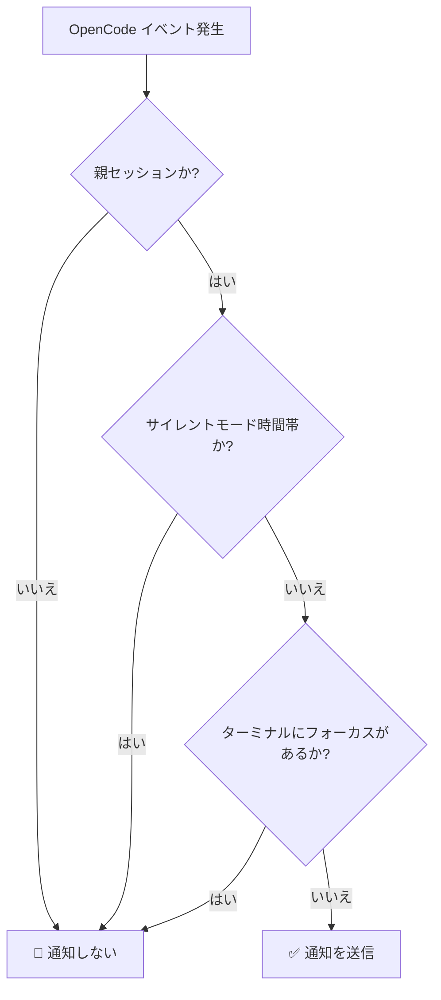

# サイレントモード完全解説：特定の時間帯の通知を停止する

## このレッスンでできること

- 設定ファイルでサイレントモードを有効にし、休息時間の通知を停止する
- サイレントモードの仕組みと時間計算ロジックを理解する
- 深夜をまたぐ時間帯（22:00 - 08:00 など）を設定する
- サイレントモードと他のスマートフィルタリング機能の優先順位を把握する

## 現在の悩み

こんな経験はありませんか？夜 10 時に AI にタスクを委託して休息に入ったところ、深夜 2 時に AI がタスクを完了し、「ピロン」という通知音で起こされてしまった。あるいは、昼休みに AI にファイル処理を任せたら、12:05 に通知が鳴って休息が中断されてしまった。

::: info サイレントモードとは
サイレントモードは時間帯を指定する設定機能です。この時間帯内では、opencode-notify はすべての通知の送信を停止し、邪魔されたくない時間に通知を受け取ることを防ぎます。
:::

## いつこの方法を使うか

- **夜間の休息**：22:00 - 08:00 を設定し、睡眠中の通知を防ぐ
- **昼休み**：12:00 - 13:00 を設定し、昼休み中の通知を防ぐ
- **集中作業時間**：09:00 - 12:00 を設定し、会議中の通知を防ぐ
- **週末の休暇**：週末全体をサイレントモードに設定する

サイレントモードは、休息時間や集中作業時間を守るのに最適です。AI にバックグラウンドでタスクを完了させ、準備ができたら結果を確認しましょう。

## コアコンセプト

サイレントモードの仕組みはシンプルです：

1. **時間チェック**：通知を送信する前に、プラグインは現在時刻が設定されたサイレントモード時間帯内かどうかをチェックします
2. **時間帯サポート**：深夜をまたぐ時間帯（22:00 - 08:00 など）を含む、任意の時間帯をサポートします
3. **中程度の優先順位**：サイレントモードのチェックは親セッションチェックより低く、ターミナルフォーカス検出より高い優先順位です。現在が子セッションで `notifyChildSessions` が false の場合、サイレントモードのチェックはスキップされます。

::: tip サイレントモード vs 一時的な無効化
サイレントモードは**定期的に繰り返される**時間設定です（例：毎日夜 10 時から朝 8 時まで）。**一時的に**通知を無効にしたい場合（例：次の 1 時間は通知が不要）は、設定ファイルで `"enabled": false` を設定するか、設定ファイルを削除してデフォルト値に戻すことができます。
:::

## 一緒にやってみよう

### ステップ 1：設定ファイルを開く

設定ファイルの場所：`~/.config/opencode/kdco-notify.json`

ファイルが存在しない場合は、まず作成します：

::: code-group

```bash [macOS/Linux]
vim ~/.config/opencode/kdco-notify.json
```

```powershell [Windows]
notepad $env:USERPROFILE\.config\opencode\kdco-notify.json
```

:::

設定ファイルの内容（存在する場合）、または空白のファイルが表示されるはずです。

### ステップ 2：サイレントモードの設定を追加する

設定ファイルに `quietHours` セクションを追加または変更します：

```json
{
  "quietHours": {
    "enabled": true,
    "start": "22:00",
    "end": "08:00"
  }
}
```

**設定項目の説明**：

| 設定項目 | 型 | デフォルト値 | 説明 |
| --- | --- | --- | --- |
| `enabled` | boolean | `false` | サイレントモードを有効にするかどうか |
| `start` | string | `"22:00"` | サイレントモード開始時刻、フォーマットは `"HH:MM"` |
| `end` | string | `"08:00"` | サイレントモード終了時刻、フォーマットは `"HH:MM"` |

### ステップ 3：設定ファイルを保存する

ファイルを保存してエディタを終了します。

**チェックポイント ✅**：以下のコマンドを実行して、設定ファイルのフォーマットが正しいか確認します：

```bash
cat ~/.config/opencode/kdco-notify.json | jq .
```

フォーマットされた JSON 内容が表示され、エラーメッセージがなければ OK です。

::: tip jq がインストールされていない場合
システムに `jq` コマンドがない場合は、このチェックをスキップするか、ブラウザで JSON 内容を [JSON バリデーター](https://jsonlint.com/) にコピーして確認できます。
:::

### ステップ 4：OpenCode を再起動する

設定ファイルを変更した後、OpenCode を再起動して変更を反映させる必要があります。

**チェックポイント ✅**：再起動後、OpenCode は自動的に設定を再読み込みします。

### ステップ 5：サイレントモードをテストする

サイレントモードが有効になっているか確認するには：

1. `start` と `end` を現在時刻の前後に設定します（例：現在 14:00 なら、13:55 - 14:05 に設定）
2. AI に簡単なタスクを委託します
3. タスクの完了を待ちます

**サイレントモード時間帯内では、通知を受け取らない**はずです。

**注意**：現在時刻がサイレントモード時間帯外の場合、または `enabled` が `false` の場合は、通常通り通知を受け取ります。

### ステップ 6：通常の設定に戻す

テスト完了後、設定を通常使用する時間帯（例：22:00 - 08:00）に戻します：

```json
{
  "quietHours": {
    "enabled": true,
    "start": "22:00",
    "end": "08:00"
  }
}
```

設定ファイルを保存し、OpenCode を再起動します。

## よくある落とし穴

### よくあるエラー 1：サイレントモードの有効化を忘れる

**問題**：`start` と `end` を設定したのに、まだ通知を受け取る。

**原因**：`enabled` フィールドが `false` または未設定。

**解決策**：`enabled` を `true` に設定します：

```json
{
  "quietHours": {
    "enabled": true,
    "start": "22:00",
    "end": "08:00"
  }
}
```

### よくあるエラー 2：時間フォーマットの誤り

**問題**：設定後に反映されない、または起動時にエラーが発生する。

**原因**：時間フォーマットが `"HH:MM"` 形式でない、または 12 時間制（AM/PM）を使用している。

**誤った例**：
```json
{
  "start": "10 PM",  // ❌ 誤り：AM/PM はサポートされていません
  "end": "8:00"      // ⚠️ 動作しますが、一貫性のため "08:00" を推奨
}
```

**正しい例**：
```json
{
  "start": "22:00",  // ✅ 正しい：24 時間制、先頭のゼロを推奨
  "end": "08:00"     // ✅ 正しい：24 時間制、先頭のゼロを推奨
}
```

### よくあるエラー 3：深夜をまたぐ時間帯の誤解

**問題**：22:00 - 08:00 を設定したのに、日中の一部の時間帯もサイレントになっている。

**原因**：`start` が `end` より小さくなければならないと誤解し、時間帯の計算が間違っている。

**正しい理解**：
- 22:00 - 08:00 は：**夜 10 時から翌朝 8 時まで**を意味します
- これは深夜をまたぐ時間帯で、プラグインは自動的に認識します
- 08:00 - 22:00 ではありません（この設定だと、日中全体がサイレントになります）

::: tip 深夜をまたぐ時間帯の検証
深夜をまたぐ時間帯が正しく設定されているか確認したい場合は、設定ファイルで短いテスト時間帯（例：10 分間）を設定し、期待する時間帯内で通知を受け取らないことを確認できます。
:::

### よくあるエラー 4：OpenCode を再起動していない

**問題**：設定ファイルを変更した後も、サイレントモードが古い設定で動作している。

**原因**：設定ファイルはプラグイン起動時に一度だけ読み込まれ、ファイルの変更をリアルタイムで監視しません。

**解決策**：設定ファイルを変更するたびに、OpenCode を再起動して変更を反映させる必要があります。

## サイレントモードと他のフィルタリング機能の関係

サイレントモードのスマートフィルタリング機能における位置：



**重要なポイント**：

1. **サイレントモードの優先順位は中程度**：親セッションチェックが最も高く、サイレントモードがその次です。現在が子セッションで `notifyChildSessions` が false の場合、サイレントモードのチェックはスキップされます。ただし、親セッションチェックを通過した後は、ターミナルにフォーカスがあるかどうかに関係なく、サイレントモード時間帯内であれば通知は送信されません。
2. **ターミナルフォーカス検出とは独立**：ターミナルにフォーカスがなくても、サイレントモード時間帯内では通知は送信されません
3. **実行順序**：親セッションチェックがサイレントモードより先に実行されます。親セッションチェックを通過した場合（つまり、現在が親セッションまたは `notifyChildSessions` が true の場合）のみ、サイレントモードのチェックが続行されます。

::: warning 特殊なケース：権限リクエストと質問
権限リクエスト（`permission.updated`）と質問（`tool.execute.before`）は、ソースコードでは**サイレントモードの制約を受けます**。つまり、サイレントモード時間帯内では、AI があなたの承認や回答を待ってブロックされていても、通知は送信されません。
:::

## よく使う設定例

### 例 1：夜間の休息

夜 10 時から朝 8 時までをサイレントモード時間帯に設定：

```json
{
  "quietHours": {
    "enabled": true,
    "start": "22:00",
    "end": "08:00"
  }
}
```

### 例 2：昼休み

正午 12 時から午後 1 時までをサイレントモード時間帯に設定：

```json
{
  "quietHours": {
    "enabled": true,
    "start": "12:00",
    "end": "13:00"
  }
}
```

### 例 3：集中作業時間

午前 9 時から正午 12 時までをサイレントモード時間帯に設定（例：会議中の通知を防ぐ）：

```json
{
  "quietHours": {
    "enabled": true,
    "start": "09:00",
    "end": "12:00"
  }
}
```

### 例 4：完全な設定

サイレントモードを他の設定項目と組み合わせて使用：

```json
{
  "enabled": true,
  "notifyChildSessions": false,
  "suppressWhenFocused": true,
  "sounds": {
    "idle": "Glass",
    "error": "Basso",
    "permission": "Submarine"
  },
  "quietHours": {
    "enabled": true,
    "start": "22:00",
    "end": "08:00"
  },
  "terminal": "ghostty"
}
```

## このレッスンのまとめ

サイレントモードは opencode-notify の重要な機能で、特定の時間帯の通知を停止するために使用します：

1. **設定方法**：`~/.config/opencode/kdco-notify.json` で `quietHours` セクションを設定
2. **時間フォーマット**：24 時間制の `"HH:MM"` フォーマットを使用（例：`"22:00"` と `"08:00"`）
3. **深夜またぎサポート**：深夜をまたぐ時間帯をサポート（例：`"22:00" - "08:00"` は夜 10 時から翌朝 8 時まで）
4. **実行順序**：親セッションチェック → サイレントモード → ターミナルフォーカス検出。サイレントモードは親セッションチェックを通過した後にのみ有効
5. **再起動が必要**：設定ファイルを変更した後は、OpenCode を再起動して変更を反映させる必要があります

サイレントモードを適切に設定することで、AI に休息時間や集中作業時間中にバックグラウンドでタスクを完了させ、準備ができたら結果を確認できます。

## 次のレッスン予告

> 次のレッスンでは **[ターミナル検出の仕組み](../terminal-detection/)** を学びます。
>
> 学べること：
> - opencode-notify が使用中のターミナルを自動検出する仕組み
> - サポートされている 37 種類以上のターミナルエミュレーターのリスト
> - ターミナルタイプを手動で指定する方法
> - macOS フォーカス検出の実装原理

---

## 付録：ソースコード参考

<details>
<summary><strong>クリックしてソースコードの位置を展開</strong></summary>

> 更新日時：2026-01-27

| 機能 | ファイルパス | 行番号 |
| --- | --- | --- |
| サイレントモードチェック | [`src/notify.ts`](https://github.com/kdcokenny/opencode-notify/blob/main/src/notify.ts#L181-L199) | 181-199 |
| 設定インターフェース定義 | [`src/notify.ts`](https://github.com/kdcokenny/opencode-notify/blob/main/src/notify.ts#L30-L48) | 30-48 |
| デフォルト設定 | [`src/notify.ts`](https://github.com/kdcokenny/opencode-notify/blob/main/src/notify.ts#L56-L68) | 56-68 |
| タスク完了処理でのサイレントチェック | [`src/notify.ts`](https://github.com/kdcokenny/opencode-notify/blob/main/src/notify.ts#L262) | 262 |
| エラー通知処理でのサイレントチェック | [`src/notify.ts`](https://github.com/kdcokenny/opencode-notify/blob/main/src/notify.ts#L300) | 300 |
| 権限リクエスト処理でのサイレントチェック | [`src/notify.ts`](https://github.com/kdcokenny/opencode-notify/blob/main/src/notify.ts#L323) | 323 |
| 質問処理でのサイレントチェック | [`src/notify.ts`](https://github.com/kdcokenny/opencode-notify/blob/main/src/notify.ts#L341) | 341 |

**主要な定数**：

- `DEFAULT_CONFIG.quietHours`：デフォルトのサイレントモード設定（63-67 行目）
  - `enabled: false`：デフォルトではサイレントモードは無効
  - `start: "22:00"`：デフォルトのサイレントモード開始時刻
  - `end: "08:00"`：デフォルトのサイレントモード終了時刻

**主要な関数**：

- `isQuietHours(config: NotifyConfig): boolean`：現在時刻がサイレントモード時間帯内かどうかをチェック（181-199 行目）
  - まず `config.quietHours.enabled` が `true` かどうかをチェック
  - 現在時刻を分単位に変換
  - 開始時刻と終了時刻を分単位に変換
  - 深夜をまたぐ時間帯を処理（`startMinutes > endMinutes`）
  - `true` を返すとサイレントモード時間帯内、`false` を返すと時間帯外

**ビジネスルール**：

- BR-1-3：サイレントモード時間帯内では通知を送信しない（`notify.ts:262`）
- BR-3-2：サイレントモードは深夜またぎをサポート（22:00-08:00 など）（`notify.ts:193-196`）
- BR-4-1：現在時刻がサイレントモード時間帯内の場合、通知を送信しない（`notify.ts:182-198`）
- BR-4-2：深夜をまたぐ時間帯をサポート（22:00-08:00 など）（`notify.ts:194-196`）

</details>
