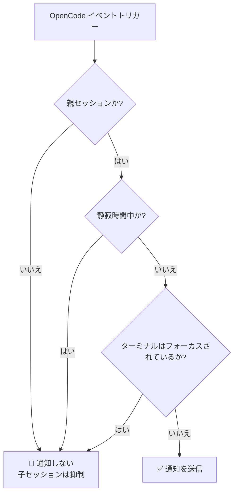
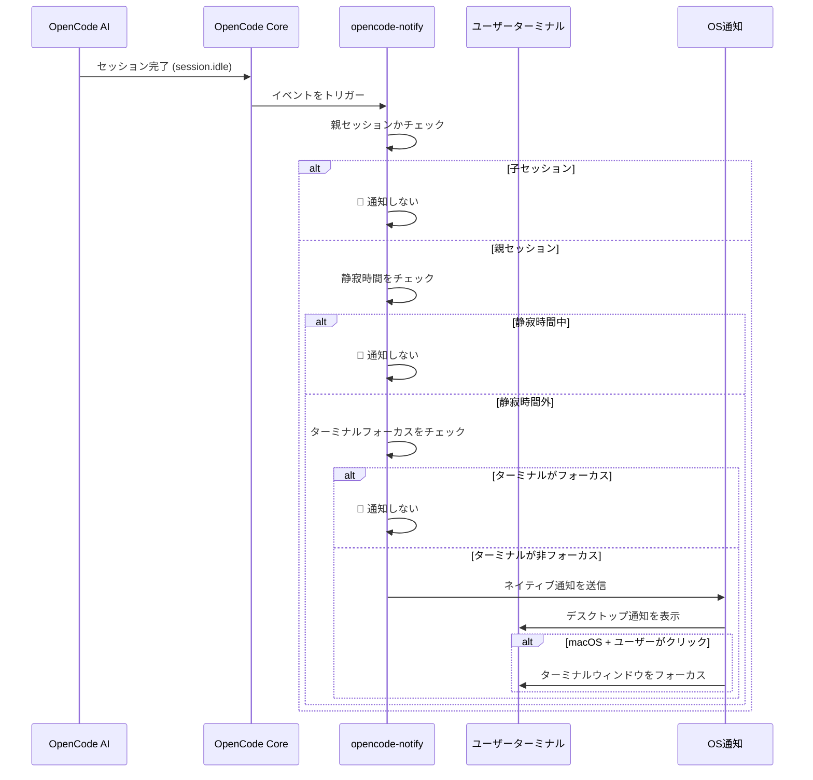

# 動作原理：通知、フィルタリングとトリガーメカニズム

## 学習終了時の到達目標

- opencode-notify の4つの通知タイプとそのトリガー条件を理解する
- スマートフィルタリングメカニズムの動作原理を掌握する（なぜ大量の通知を受けないのか）
- 通知がトリガーされて表示されるまでの完全なフローを理解する
- 設定を通じて通知動作を調整する方法を知る

## コアコンセプト

::: tip デザイン哲学
opencode-notify は、**「通知すべき時に通知し、些細な事柄ごとに通知しない」**というコア原則に従います。
:::

このプラグインの動作方式は、3つの主要なリンクに分解できます：

1. **リスニング** - 重要な OpenCode イベントを待機する
2. **フィルタリング** - そのイベントが通知を必要とするかどうかを決定する
3. **送信** - オペレーティングシステムのネイティブ通知を通じてあなたに通知する

このフローを理解すれば、プラグインがタイムリーなリマインダーを提供しながら、スパムのように頻繁に邪魔しない理由がわかります。

## 4つの通知タイプ

opencode-notify は、4つのカテゴリの OpenCode イベントをリッスンし、それぞれに明確なトリガーシナリオがあります：

### 1. タスク完了通知 (session.idle)

**トリガー条件**：AI セッションがアイドル状態になった時（タスク完了時）

| 項目 | 説明 |
| --- | ---|
| 通知タイトル | Ready for review |
| 通知内容 | セッションタイトル（最大50文字） |
| デフォルトサウンド | Glass (macOS) |

**重要な理由**：これは最もよく使用される通知で、AI がタスクを完了し、結果を確認する準備ができたことを知らせます。

### 2. エラー通知 (session.error)

**トリガー条件**：AI セッション実行でエラーが発生した時

| 項目 | 説明 |
| --- | ---|
| 通知タイトル | Something went wrong |
| 通知内容 | エラーサマリー（最大100文字） |
| デフォルトサウンド | Basso (macOS) |

**重要な理由**：エラーはタイムリーに処理する必要があり、そうしないと後続の操作が正常に実行できなくなる可能性があります。

### 3. 権限リクエスト通知 (permission.updated)

**トリガー条件**：AI がユーザーに操作の承認を必要とする時（例：ファイル読み取り、ネットワークアクセス）

| 項目 | 説明 |
| --- | ---|
| 通知タイトル | Waiting for you |
| 通知内容 | OpenCode needs your input |
| デフォルトサウンド | Submarine (macOS) |

**重要な理由**：AI がブロックされており、手動で承認しないと続行できません。処理しないとタスクが停止します。

### 4. 質問通知 (tool.execute.before)

**トリガー条件**：AI が `question` ツールを使用して質問をする時

| 項目 | 説明 |
| --- | ---|
| 通知タイトル | Question for you |
| 通知内容 | OpenCode needs your input |
| デフォルトサウンド | Submarine (macOS) |

**重要な理由**：AI は続行するために追加情報を必要としています。例えば、ある決定の確認や要件の明確化などです。

::: info 4つの通知の優先度
権限リクエストと質問の優先度が最も高く、これらのイベントでは AI が完全にブロックされています。エラー通知は次に高く、タスクが失敗したため注意が必要です。タスク完了通知は比較的低い優先度です。なぜなら、都合の良い時に確認すればよいからです。
:::

## スマートフィルタリングメカニズム

opencode-notify の最も輝かしい点は、マルチレイヤフィルタリングを通じて、真に注意が必要な通知のみを受け取るようにすることです。

### フィルタリング階層の概要



### 階層 1：親セッションチェック

**ルール**：デフォルトでは親セッション（ルートセッション）のみ通知し、子セッションは通知しません。

**原理**：OpenCode のタスクはネストされる可能性があります。例えば、AI に「コードベースを最適化する」と依頼したとします。これは複数の子タスクに分割される可能性があります：
- 親セッション：「コードベース全体を最適化」
- 子セッション 1：「src/components ディレクトリを最適化」
- 子セッション 2：「src/utils ディレクトリを最適化」

すべての子セッションが通知を行うと、多くの通知を受け取ることになります。opencode-notify は、親セッション完了時にのみ1回通知します。

::: tip 子セッション通知が必要な時は?
単一 AI の複数の並行タスクを監視している場合、設定で `notifyChildSessions: true` を設定して子セッション通知を有効にできます。
:::

**特殊例外**：
- **権限リクエスト通知**：常に通知され、親セッションチェックは行われません（権限問題は処理が必要なため）
- **質問通知**：常に通知され、親セッションチェックは行われません

### 階層 2：静寂時間チェック

**ルール**：設定された静寂時間帯内では、通知を送信しません。

**原理**：夜間や休憩時間に邪魔されないようにします。設定例：

```json
{
  "quietHours": {
    "enabled": true,
    "start": "22:00",
    "end": "08:00"
  }
}
```

**日またぎ対応**：静寂時間は日またぎに対応しています。例えば `22:00 - 08:00` は夜10時から翌朝8時までとして正しく認識されます。

::: info 静寂時間チェックの優先度
静寂時間は他のすべてのチェックより優先度が高いです。静寂時間内であっても、ターミナル非フォーカスや親セッションなどの条件があっても静寂時間をバイパスすることはできません。
:::

### 階層 3：ターミナルフォーカス検出

**ルール**：ターミナルウィンドウが現在のアクティブウィンドウの時、通知を送信しません。

**原理**：ターミナルを見ている時は、AI がタスクを完了すると画面に直接表示されるため、追加の通知は必要ありません。

**プラットフォームサポート**：
- ✅ **macOS**：完全対応、`osascript` 経由でフォアグラウンドアプリを検出
- ❌ **Windows**：非対応
- ❌ **Linux**：非対応

**検出メカニズム**（macOS）：
1. `detect-terminal` ライブラリを使用してターミナルを識別（37+ のターミナルエミュレータをサポート）
2. macOS にクエリして現在のフォアグラウンドアプリを取得
3. あなたのターミナルプロセス名と一致するか比較
4. 一致する場合は通知を抑制

**特殊例外**：
- **質問通知**：フォーカスチェックを行わない（tmux ワークフローをサポート）

::: tip tmux ワークフロー対応
複数のペインを持つ tmux を使用している場合、質問通知はフォーカス検出によって抑制されないため、他のペインで作業中でも通知を受け取ることができます。
:::

### macOS 特殊機能：通知クリックでターミナルフォーカス

macOS では、通知に追加機能があります：**通知をクリックすると、ターミナルウィンドウが自動的に最前面に表示される**。

**原理**：
1. プラグインは `osascript` 経由であなたのターミナル Bundle ID を取得（例：`com.ghostty.Ghostty`）
2. 通知を送信する際に `activate` オプションをその Bundle ID に設定
3. 通知をクリックすると、システムが自動的に対応するアプリにフォーカスする

**サポートされるターミナル**：Ghostty、Kitty、iTerm2、WezTerm、Alacritty、macOS Terminal、Hyper、Warp、VS Code 統合ターミナルなど。

::: info 自動ターミナル検出
プラグインはあなたが使用しているターミナルを自動的に検出し、手動設定は必要ありません。自動検出が失敗した場合は、設定ファイルで `terminal` フィールドを手動で指定できます。
:::

## 通知トリガーフロー

### 完全なフローチャート



### イベント処理の優先順位

複数のイベントが同時にトリガーされた場合、プラグインは以下の優先順位で処理します：

1. **最高優先度**：権限リクエスト（`permission.updated`）- AI がブロックされており、処理が必要
2. **次に高い優先度**：エラー通知（`session.error`）- タスクが失敗し、注目が必要
3. **低優先度**：タスク完了（`session.idle`）- 後で確認できる
4. **特殊**：質問（`tool.execute.before`）- 実際のニーズに応じて優先度を決定

::: tip バッチ通知処理
複数のタスクが同時に完了した場合、プラグインは個別の複数の通知を送信するのではなく、1つの通知のみを送信します（親セッションチェックに基づく）。これにより、通知の過剰供給を回避します。
:::

## 設定の影響

設定ファイルを通じて、フィルタリングメカニズムの各層を調整できます：

| 設定項目 | 影響する層 | デフォルト値 | 説明 |
| --- | --- | --- | ---|
| `notifyChildSessions` | 親セッションチェック | `false` | `true` に設定すると子セッション通知を有効化 |
| `quietHours.enabled` | 静寂時間チェック | `false` | `true` に設定して静寂時間を有効化 |
| `quietHours.start` | 静寂時間チェック | `"22:00"` | 静寂開始時間 |
| `quietHours.end` | 静寂時間チェック | `"08:00"` | 静寂終了時間 |
| `terminal` | ターミナル検出 | 未設定 | ターミナルタイプを手動指定（自動検出を上書き） |

::: details 設定例

```json
{
  "enabled": true,
  "notifyChildSessions": false,
  "sounds": {
    "idle": "Glass",
    "error": "Basso",
    "permission": "Submarine"
  },
  "quietHours": {
    "enabled": true,
    "start": "22:00",
    "end": "08:00"
  },
  "terminal": "ghostty"
}
```

:::

## レッスンサマリー

opencode-notify の動作原理は以下のようにまとめられます：

1. **4つの通知タイプ**：タスク完了、エラー、権限リクエスト、質問
2. **3層スマートフィルタリング**：親セッションチェック → 静寂時間チェック → ターミナルフォーカスチェック
3. **プラットフォーム差異**：macOS はフォーカス検出とクリックフォーカスをサポート、Windows/Linux は基本通知のみサポート
4. **柔軟な設定**：JSON 設定ファイルによるフィルタ層と動作の調整

この設計により、通知のタイムリー性と低干渉性が確保されます——本当にあなたを必要とする時にのみリマインドし、頻繁に確認する必要がある別の通知センターになることはありません。

## 次回予告

> 次回は **[macOS プラットフォームの機能](../../platforms/macos/)** を学習します。
>
> 学習内容：
> - macOS 特有のフォーカス検出メカニズム
> - クリック通知によるフォーカス機能の設定方法
> - カスタムサウンドエフェクトの完全リスト
> - macOS ネイティブシステムとの統合詳細

---

## 付録：ソースコードリファレンス

<details>
<summary><strong>ソースコード位置を表示するにはクリック</strong></summary>

> 更新日：2026-01-27

| 機能 | ファイルパス | 行番号 |
| --- | --- | ---|
| プラグインメインエントリ | [`src/notify.ts`](https://github.com/kdcokenny/opencode-notify/blob/main/src/notify.ts#L357-L406) | 357-406 |
| 設定の読み込み | [`src/notify.ts`](https://github.com/kdcokenny/opencode-notify/blob/main/src/notify.ts#L90-L114) | 90-114 |
| デフォルト設定 | [`src/notify.ts`](https://github.com/kdcokenny/opencode-notify/blob/main/src/notify.ts#L56-L68) | 56-68 |
| ターミナル検出 | [`src/notify.ts`](https://github.com/kdcokenny/opencode-notify/blob/main/src/notify.ts#L145-L164) | 145-164 |
| ターミナルフォーカス検出 | [`src/notify.ts`](https://github.com/kdcokenny/opencode-notify/blob/main/src/notify.ts#L166-L175) | 166-175 |
| 静寂時間チェック | [`src/notify.ts`](https://github.com/kdcokenny/opencode-notify/blob/main/src/notify.ts#L181-L199) | 181-199 |
| 親セッション検出 | [`src/notify.ts`](https://github.com/kdcokenny/opencode-notify/blob/main/src/notify.ts#L205-L214) | 205-214 |
| タスク完了処理 | [`src/notify.ts`](https://github.com/kdcokenny/opencode-notify/blob/main/src/notify.ts#L249-L284) | 249-284 |
| エラー通知処理 | [`src/notify.ts`](https://github.com/kdcokenny/opencode-notify/blob/main/src/notify.ts#L286-L313) | 286-313 |
| 権限リクエスト処理 | [`src/notify.ts`](https://github.com/kdcokenny/opencode-notify/blob/main/src/notify.ts#L315-L334) | 315-334 |
| 質問処理 | [`src/notify.ts`](https://github.com/kdcokenny/opencode-notify/blob/main/src/notify.ts#L336-L351) | 336-351 |
| 通知の送信 | [`src/notify.ts`](https://github.com/kdcokenny/opencode-notify/blob/main/src/notify.ts#L227-L243) | 227-243 |
| macOS フォアグラウンドアプリ検出 | [`src/notify.ts`](https://github.com/kdcokenny/opencode-notify/blob/main/src/notify.ts#L139-L143) | 139-143 |
| Bundle ID 取得 | [`src/notify.ts`](https://github.com/kdcokenny/opencode-notify/blob/main/src/notify.ts#L135-L137) | 135-137 |
| ターミナルプロセス名マッピング | [`src/notify.ts`](https://github.com/kdcokenny/opencode-notify/blob/main/src/notify.ts#L71-L84) | 71-84 |

**重要な定数**：

- `DEFAULT_CONFIG`：デフォルト設定（行 56-68）
  - `notifyChildSessions: false`：デフォルトで子セッションに通知しない
  - `sounds.idle: "Glass"`：タスク完了サウンド
  - `sounds.error: "Basso"`：エラーサウンド
  - `sounds.permission: "Submarine"`：権限リクエストサウンド
  - `quietHours.start: "22:00"`、`quietHours.end: "08:00"`：デフォルトの静寂時間

- `TERMINAL_PROCESS_NAMES`：ターミナル名から macOS プロセス名へのマッピング（行 71-84）

**重要な関数**：

- `loadConfig()`：設定ファイルとデフォルト設定の読み込みとマージ
- `detectTerminalInfo()`：ターミナル情報の検出（名前、Bundle ID、プロセス名）
- `isTerminalFocused()`：ターミナルが現在のフォアグラウンドアプリかチェック（macOS）
- `isQuietHours()`：現在時刻が静寂時間内かチェック
- `isParentSession()`：セッションが親セッションかチェック
- `sendNotification()`：ネイティブ通知の送信、macOS クリックフォーカス対応
- `handleSessionIdle()`：タスク完了イベントの処理
- `handleSessionError()`：エラーイベントの処理
- `handlePermissionUpdated()`：権限リクエストイベントの処理
- `handleQuestionAsked()`：質問イベントの処理

**ビジネスルール**：

- BR-1-1：デフォルトで親セッションのみ通知し、子セッションは通知しない（`notify.ts:256-259`）
- BR-1-2：ターミナルフォーカス時に通知を抑制（`notify.ts:265`）
- BR-1-3：静寂時間内に通知を送信しない（`notify.ts:262`）
- BR-1-4：権限リクエストは常に通知され、親セッションチェックは不要（`notify.ts:319`）
- BR-1-5：質問はフォーカスチェックを行わず、tmux ワークフローをサポート（`notify.ts:340`）
- BR-1-6：macOS はクリック通知でターミナルフォーカスをサポート（`notify.ts:238-240`）

</details>
