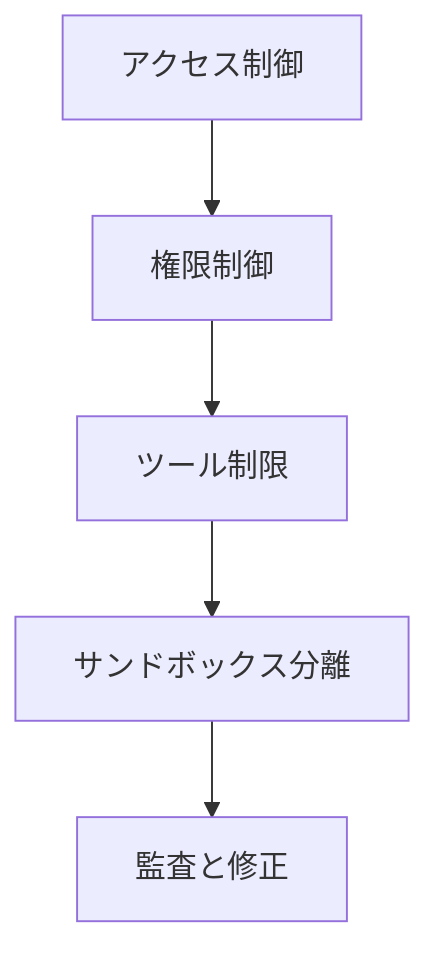

# セキュリティとサンドボックス分離：AI アシスタントを保護

## 学習後にできること

- アクセス制御からツール権限まで、多層セキュリティポリシーを設定する
- サンドボックス分離を使用して AI アシスタントのファイルシステムとネットワークアクセスを制限する
- セキュリティ監査を実行し、一般的なセキュリティリスクを発見・修正する
- 異なるシナリオ（個人/家庭/公開）に応じてセキュリティレベルを調整する

## 現在の課題

Clawdbot は AI アシスタントを強力にしますが、新たなセキュリティ課題ももたらします：

- **Shell アクセス**：AI が任意のコマンドを実行し、ファイルを読み書きできる
- **ネットワークアクセス**：AI が任意の URL とサービスにアクセスできる
- **メッセージ送信**：AI が誰にでもメッセージを送信できる（WhatsApp を設定した場合）
- **リモートコントロール**：ブラウザツール経由でローカルブラウザを制御できる
- **データ暴露**：すべての会話履歴がディスクに保存される

適切な保護がないと、操作された AI モデルが壊滅的な結果を引き起こす可能性があります。

## いつ使うべきか

- ✅ 自身のデバイスで AI アシスタントを実行し、セキュリティリスクを懸念している
- ✅ 複数のユーザー（家族、チーム）に AI アシスタントを公開したい
- ✅ AI による特定のファイルやディレクトリへのアクセスを制限したい
- ✅ 異なるユーザー/セッションのアクセス範囲を分離したい
- ✅ AI アシスタントを制限された環境（サンドボックス）で実行したい

::: info
**重要な概念**：セキュリティは「誰がアクセスできるか」から「何ができるか」、最後に「モデルのセキュリティ」へと層別化されています。
::

## 🎒 開始前の準備

### 事前チェック

- [x] [クイックスタート](../../start/getting-started/) を完了し、Gateway の起動方法を理解している
- [ ] 少なくとも 1 つの AI モデル（Anthropic、OpenAI、または Ollama）を設定済み
- [ ] 使用シナリオ（個人使用、家庭共有、公開サービス）を理解している
- [ ] Linux ファイル権限の概念（chmod）を理解している

### 推奨ツール

- コマンドラインツール：Terminal または SSH
- エディタ：好みのコードエディタ
- Docker：サンドボックスコンテナの実行用（オプション）

---

## コアコンセプト

Clawdbot のセキュリティモデルは、**アクセス制御優先、制限後のセキュリティ** というコア哲学に基づいています。

### セキュリティの階層化



1. **アクセス制御**：誰が AI アシスタントと対話できるかを決定
2. **権限制御**：AI アシスタントがどのツールを呼び出せるかを決定
3. **サンドボックス分離**：ツールがどの環境（ホストまたはコンテナ）で実行されるかを決定
4. **監査と修正**：セキュリティ設定の継続的なチェックと修正

この階層化された設計により、モデルが操作された場合でも、攻撃範囲は定義された境界内に制限されます。

### アクセス制御の 3 層保護

Clawdbot は 3 層のアクセス制御を提供します：

| 層級 | 保護対象 | 設定場所 |
|--- | --- | ---|
| **Gateway 認証** | WebSocket 接続 | `gateway.auth` |
| **DM ポリシー** | プライベートメッセージ | `channels.*.dmPolicy` |
| **Group ポリシー** | グループメッセージ | `channels.*.groupPolicy` / `channels.*.groups` |

各層は独立して設定でき、縦深的な防御を形成します。

---

## セキュリティ監査：リスクを発見

Clawdbot は一般的なセキュリティリスクを迅速に発見できる組み込みのセキュリティ監査ツールを提供します。

### 監査の実行

```bash
# 基礎監査
clawdbot security audit

# 深度監査（Gateway 探測を含む）
clawdbot security audit --deep

# セキュリティ提案の自動修正
clawdbot security audit --fix
```

### 監査チェック内容

監査ツールは以下の側面をチェックします：

| チェックカテゴリ | 具体的項目 | リスクレベル |
|--- | --- | ---|
| **インバウンドアクセス** | Gateway 認証、DM ポリシー、Group ポリシー | Critical / Warn |
| **ツールアクセス** | Elevated exec 許可リスト、ツール allow/deny | Critical / Warn |
| **ネットワーク暴露** | Gateway バインドモード、Tailscale Serve/Funnel | Critical / Info |
| **ブラウザ制御** | リモートブラウザ制御認証、URL プロトコル | Critical / Warn |
| **ファイル権限** | 設定ファイル権限、状態ディレクトリ権限 | Critical / Warn |
| **プラグイン信頼** | 明示的に許可されていないプラグイン | Warn |

### 監査出力の理解

監査レポートは重大度レベル別に分類されます：

- **Critical（赤）**：即時修正が必要、リモートコード実行やデータ漏洩につながる可能性がある
- **Warn（黄）**：修正推奨、セキュリティ境界を低下させる
- **Info（青）**：情報提供、セキュリティ上の問題ではない

### 自動修正

`--fix` フラグを使用すると、監査ツールは以下の修正を安全に適用します：

- `groupPolicy="open"` を `allowlist` に変更
- `logging.redactSensitive="off"` を `"tools"` に変更
- ファイル権限の修正（設定ファイル 600、ディレクトリ 700）

::: tip
**ベストプラクティス**：定期的に監査を実行してください。特に設定を変更したり Gateway を更新した後は必須です。
::

---

## アクセス制御：誰が AI アシスタントにアクセスできるか

アクセス制御は最初の防御ラインであり、誰が AI アシスタントと対話できるかを決定します。

### Gateway 認証

デフォルトでは、Gateway は認証が必要で WebSocket 接続を受け付けます。

#### 認証方式の設定

```json5
{
  "gateway": {
    "auth": {
      "mode": "token",  // または "password"
      "token": "your-long-random-token-please-change-me"
    }
  }
}
```

**認証モード**：

| モード | 用途 | 推奨シナリオ |
|--- | --- | ---|
| `token` | 共有 bearer token | ほとんどの場合、推奨 |
| `password` | パスワード認証 | ローカル開発、テストに便利 |
| Tailscale Identity | Tailscale Serve | Tailscale 経由のリモートアクセス |

::: warning
**重要**：`gateway.bind` が loopback 以外（`lan`、`tailnet` など）に設定されている場合、認証を設定する必要があります。設定されていない場合は接続が拒否されます。
::

### DM ポリシー：プライベートメッセージ保護

DM ポリシーは、不明なユーザーが直接 AI アシスタントと対話できるかを制御します。

| ポリシー | 挙動 | 推奨シナリオ |
|--- | --- | ---|
| `pairing`（デフォルト） | 不明な送信者はペアリングコードを受け取り、ペアリング前に処理しない | 個人使用、推奨 |
| `allowlist` | 不明な送信者は拒否される | 信頼できる複数ユーザー環境 |
| `open` | すべてのユーザーを許可 | 公開サービス（`allowFrom` に `"*"` が含まれる必要あり） |
| `disabled` | すべてのプライベートメッセージを無視 | グループ機能のみ使用 |

#### 設定例

```json5
{
  "channels": {
    "whatsapp": {
      "dmPolicy": "pairing"
    },
    "telegram": {
      "dmPolicy": "allowlist",
      "allowFrom": ["user123", "user456"]
    }
  }
}
```

#### ペアリング管理

```bash
# 承認待ちのペアリングリクエストを表示
clawdbot pairing list whatsapp

# ペアリングを承認
clawdbot pairing approve whatsapp <ペアリングコード>
```

::: tip
**ベストプラクティス**：デフォルトの `pairing` モードはユーザー体験とセキュリティの良好なバランスを提供します。すべてのユーザーを明示的に信頼している場合のみ、`allowlist` または `open` を使用してください。
::

### Group ポリシー：グループメッセージ制御

Group ポリシーは AI アシスタントがグループでメッセージに応答する方法を決定します。

| ポリシー | 挙動 | 設定場所 |
|--- | --- | ---|
| `allowlist` | ホワイトリスト内のグループのみを受け入れる | `channels.whatsapp.groups` |
| `disabled` | すべてのグループメッセージを無視する | `channels.telegram.groups` |
| `requireMention` | @ メンションまたはコマンドトリガーでのみ応答 | `channels.*.groups.*` |

#### 設定例

```json5
{
  "channels": {
    "whatsapp": {
      "groups": {
        "*": {
          "requireMention": true
        }
      }
    },
    "discord": {
      "guilds": {
        "your-guild-id": {
          "users": ["user1", "user2"]
        }
      }
    }
  }
}
```

::: tip
**ベストプラクティス**：パブリックグループで `requireMention` を有効にし、AI アシスタントが悪意のあるユーザーに操作されるのを防いでください。
::

### セッション分離：コンテキスト漏洩を防止

デフォルトでは、すべてのプライベートメッセージは同じメインセッションにルーティングされます。複数のユーザーが AI アシスタントにアクセスできる場合、コンテキスト漏洩につながる可能性があります。

```json5
{
  "session": {
    "dmScope": "per-channel-peer"  // 各チャンネル-送信者ごとに独立したセッションを作成
  }
}
```

---

## ツール権限制御：AI ができることを制限

ツール権限制御は 2 番目の防御ラインであり、AI アシスタントがどのツールを呼び出せるかを決定します。

### ツール Allow/Deny リスト

グローバルまたは各 Agent ごとにツールのホワイトリストとブラックリストを設定できます。

```json5
{
  "agents": {
    "defaults": {
      "tools": {
        "allow": ["read", "write", "web_search"],
        "deny": ["exec", "browser", "web_fetch"]
      }
    },
    "list": [
      {
        "id": "read-only",
        "tools": {
          "allow": ["read"],
          "deny": ["write", "edit", "apply_patch", "exec", "browser"]
        }
      }
    ]
  }
}
```

### 一般的なツール分類

| ツールカテゴリ | 具体的ツール | リスクレベル |
|--- | --- | ---|
| **ファイル操作** | `read`、`write`、`edit`、`apply_patch` | 中程度 |
| **Shell 実行** | `exec`、`process` | 高 |
| **ブラウザ制御** | `browser` | 高 |
| **ネットワークアクセス** | `web_search`、`web_fetch` | 中程度 |
| **Canvas 可視化** | `canvas` | 中程度 |
| **ノード操作** | `nodes_invoke` | 高 |
| **Cron 定期タスク** | `cron` | 中程度 |
| **メッセージ送信** | `message`、`sessions_*` | 低 |

### Elevated モード：ホスト実行の抜け道

Elevated exec は特殊な抜け道であり、ツールがサンドボックスを回避してホスト上で実行できるようにします。

```json5
{
  "tools": {
    "elevated": {
      "enabled": true,
      "allowFrom": {
        "whatsapp": ["your-trusted-user-id"]
      },
      "security": "allowlist",
      "ask": "on"  // 実行前に毎回確認を求める
    }
  }
}
```

::: danger
**重要警告**：Elevated exec はサンドボックス制限を回避します。許可するユーザーとシナリオを完全に信頼している場合にのみ有効にしてください。
::

::: tip
**ベストプラクティス**：ほとんどのシナリオでは elevated exec を無効にし、サンドボックス分離と厳格なツールホワイトリストに依存してください。
::

---

## サンドボックス分離：制限された環境で実行

サンドボックス分離はツールを Docker コンテナ内で実行し、ファイルシステムとネットワークアクセスを制限します。

### サンドボックスモード

| モード | 挙動 | 推奨シナリオ |
|--- | --- | ---|
| `off` | すべてのツールがホスト上で実行される | 信頼できる個人環境 |
| `non-main`（推奨） | メインセッションはホスト上、他のセッションはサンドボックス内 | パフォーマンスとセキュリティのバランス |
| `all` | すべてのセッションがサンドボックス内 | マルチユーザー環境、公開サービス |

```json5
{
  "agents": {
    "defaults": {
      "sandbox": {
        "mode": "non-main"
      }
    }
  }
}
```

### ワークスペースアクセス

ワークスペースアクセスは、サンドボックスコンテナがホストのどのディレクトリを確認できるかを決定します。

| アクセスレベル | 挙動 | 推奨シナリオ |
|--- | --- | ---|
| `none`（デフォルト） | サンドボックスワークスペース `~/.clawdbot/sandboxes` | 最大分離 |
| `ro` | エージェントワークスペースが `/agent` に読み取り専用でマウントされる | ファイルの読み取りのみ、書き込みは不要 |
| `rw` | エージェントワークスペースが `/workspace` に読み書きでマウントされる | ファイル書き込みが必要な Agent |

```json5
{
  "agents": {
    "defaults": {
      "sandbox": {
        "workspaceAccess": "none"
      }
    }
  }
}
```

### サンドボックススコープ

サンドボックススコープはコンテナ分離の粒度を決定します。

| スコープ | 挙動 | コンテナ数 |
|--- | --- | ---|
| `session`（デフォルト） | 各セッションごとに 1 つのコンテナ | コンテナ数が多い、より良い分離 |
| `agent` | 各 Agent ごとに 1 つのコンテナ | 分離とリソースのバランス |
| `shared` | すべてのセッションが 1 つのコンテナを共有 | リソース節約、分離性が最も低い |

### Docker 設定

```json5
{
  "agents": {
    "defaults": {
      "sandbox": {
        "docker": {
          "image": "clawdbot-sandbox:bookworm-slim",
          "containerPrefix": "clawdbot-sbx-"
        }
      }
    }
}
```

### カスタムマウント

ホストの追加ディレクトリをサンドボックスコンテナにマウントできます。

```json5
{
  "agents": {
    "defaults": {
      "sandbox": {
        "docker": {
          "binds": [
            "/home/user/source:/source:ro",
            "/var/run/docker.sock:/var/run/docker.sock"
          ]
        }
      }
    }
  }
}
```

::: warning
**セキュリティヒント**：マウントはサンドボックスファイルシステム分離を回避します。機密マウント（docker.sock など）は `:ro`（読み取り専用）モードを使用する必要があります。
::

### サンドボックス化ブラウザ

サンドボックス化ブラウザは Chrome インスタンスをコンテナ内で実行し、ブラウザ操作を分離します。

```json5
{
  "agents": {
    "defaults": {
      "sandbox": {
        "browser": {
          "enabled": true,
          "autoStart": true,
          "autoStartTimeoutMs": 10000
        }
      }
    }
  }
}
```

::: tip
**ベストプラクティス**：サンドボックス化ブラウザは、AI アシスタントが日常使用しているブラウザのログインセッションや機密データにアクセスするのを防ぎます。
::

---

## マルチ Agent セキュリティ設定

異なる Agent は異なるセキュリティ設定を持つことができます。

### シナリオ例

#### シナリオ 1：個人 Agent（完全信頼）

```json5
{
  "agents": {
    "list": [
      {
        "id": "personal",
        "sandbox": { "mode": "off" },
        "tools": {
          "allow": ["*"],
          "deny": []
        }
      }
    ]
  }
}
```

#### シナリオ 2：家庭 Agent（読み取り専用）

```json5
{
  "agents": {
    "list": [
      {
        "id": "family",
        "workspace": "~/clawd-family",
        "sandbox": {
          "mode": "all",
          "scope": "agent",
          "workspaceAccess": "ro"
        },
        "tools": {
          "allow": ["read"],
          "deny": ["write", "edit", "apply_patch", "exec", "browser"]
        }
      }
    ]
  }
}
```

#### シナリオ 3：公開 Agent（サンドボックス + 厳格な制限）

```json5
{
  "agents": {
    "list": [
      {
        "id": "public",
        "workspace": "~/clawd-public",
        "sandbox": {
          "mode": "all",
          "scope": "agent",
          "workspaceAccess": "none"
        },
        "tools": {
          "allow": ["web_search", "sessions_list"],
          "deny": ["read", "write", "edit", "apply_patch", "exec", "browser", "web_fetch", "canvas", "nodes", "cron", "gateway", "image"]
        }
      }
    ]
  }
}
```

---

## Docker 化：Gateway を完全に分離

ツールレベルのサンドボックスに加えて、Gateway 全体を Docker コンテナ内で実行することもできます。

### 完全 Docker 化の利点

- Gateway プロセスを完全に分離
- ホストへの依存インストールを回避
- デプロイと管理が容易
- 追加のセキュリティ境界を提供

::: tip
Docker 化 vs ツールサンドボックスの使い分け：
- **ツールサンドボックス**：ほとんどのシナリオ、パフォーマンスとセキュリティのバランス
- **Docker 化**：本番環境、マルチテナントデプロイ、完全分離が必要
::

### Docker インストール参考

詳細な Docker インストール手順については、[デプロイオプション](../../appendix/deployment/) を参照してください。

---

## トラブルシューティングのヒント

### よくあるエラー

#### ❌ Gateway 認証の設定忘れ

**誤った設定**：
```json5
{
  "gateway": {
    "bind": "lan"  // 危険！
    "auth": {}
  }
}
```

**結果**：あなたの LAN に接続できる誰もが AI アシスタントを制御できます。

**正しい設定**：
```json5
{
  "gateway": {
    "bind": "loopback",  // または強力な認証を設定
    "auth": {
      "mode": "token",
      "token": "your-secure-token"
    }
  }
}
```

#### ❌ `dmPolicy: "open"` の使用時に `allowFrom` を忘れる

**誤った設定**：
```json5
{
  "channels": {
    "whatsapp": {
      "dmPolicy": "open"  // 危険！
    }
  }
}
```

**結果**：誰でもあなたの AI アシスタントにメッセージを送信できます。

**正しい設定**：
```json5
{
  "channels": {
    "whatsapp": {
      "dmPolicy": "open",
      "allowFrom": ["*"]  // 明示的に許可が必要
    }
  }
}
```

#### ❌ Elevated exec を有効にしたが allowFrom を設定しない

**誤った設定**：
```json5
{
  "tools": {
    "elevated": {
      "enabled": true  // 危険！
    }
  }
}
```

**結果**：すべてのユーザーがホストコマンドを実行できます。

**正しい設定**：
```json5
{
  "tools": {
    "elevated": {
      "enabled": true,
      "allowFrom": {
        "discord": ["your-user-id"]  // 許可されたユーザーを制限
      },
      "security": "allowlist",
      "ask": "on"  // 確認を要求
    }
  }
}
```

#### ❌ 機密マウントに読み書きモードを使用

**誤った設定**：
```json5
{
  "agents": {
    "defaults": {
      "sandbox": {
        "docker": {
          "binds": [
            "/var/run/docker.sock:/var/run/docker.sock"  // 危険！
          ]
        }
      }
    }
  }
}
```

**結果**：サンドボックスが Docker デーモンを制御できます。

**正しい設定**：
```json5
{
  "agents": {
    "defaults": {
      "sandbox": {
        "docker": {
          "binds": [
            "/var/run/docker.sock:/var/run/docker.sock:ro"  // 読み取り専用
          ]
        }
      }
    }
}
```

### ベストプラクティスのまとめ

| プラクティス | 理由 |
|--- | ---|
| デフォルトで `pairing` モードを使用 | ユーザー体験とセキュリティのバランス |
| グループメッセージで `requireMention` を使用 | 操作を防ぐ |
| ツールブラックリストよりホワイトリストを使用 | 最小権限の原則 |
| サンドボックスを有効にし `workspaceAccess: "none"` を設定 | ワークスペースアクセスを分離 |
| 定期的にセキュリティ監査を実行 | 継続的なセキュリティ監視 |
| 機密キーを環境変数または設定ファイルに保存 | コード漏洩を回避 |

---

## この章のまとめ

この章では Clawdbot のセキュリティモデルとサンドボックス分離機能について学びました：

**コアポイント**：

1. **セキュリティの階層化**：アクセス制御 → 権限制御 → サンドボックス分離 → 監査と修正
2. **アクセス制御**：Gateway 認証、DM ポリシー、Group ポリシー
3. **ツール権限**：allow/deny リスト、Elevated モード
4. **サンドボックス分離**：モード、スコープ、ワークスペースアクセス、Docker 設定
5. **セキュリティ監査**：`clawdbot security audit` による問題の発見と修正

**セキュリティ第一の原則**：
- 最小権限から開始し、必要な場合のみ緩和する
- サンドボックス分離を使用して攻撃範囲を制限する
- 定期的に監査と設定更新を行う
- 機密機能（Elevated exec など）には慎重に対応する

---

## 次の章の予告

> 次の章では **[リモート Gateway と Tailscale](../remote-gateway/)** について学びます。
>
> 学習内容：
> - Tailscale Serve 経由で Gateway を Tailnet に公開
> - Tailscale Funnel 経由の公開アクセス（注意が必要）
> - SSH トンネルとリバースプロキシ設定
> - リモートアクセスのセキュリティベストプラクティス

---

## 付録：ソースコード参考

<details>
<summary><strong>クリックしてソースコードの場所を展開</strong></summary>

> 更新日：2026-01-27

| 機能 | ファイルパス | 行番号 |
|--- | --- | ---|
| セキュリティ監査 | [`src/security/audit.ts`](https://github.com/moltbot/moltbot/blob/main/src/security/audit.ts#L1-L910) | 1-910 |
| セキュリティ修正 | [`src/security/fix.ts`](https://github.com/moltbot/moltbot/blob/main/src/security/fix.ts#L1-L385) | 1-385 |
| ファイル権限チェック | [`src/security/audit-fs.ts`](https://github.com/moltbot/moltbot/blob/main/src/security/audit-fs.ts) | 全ファイル |
| Gateway 設定 Schema | [`src/config/zod-schema.core.ts`](https://github.com/moltbot/moltbot/blob/main/src/config/zod-schema.core.ts) | 全ファイル |
| Agent Defaults Schema | [`src/config/zod-schema.agent-defaults.ts`](https://github.com/moltbot/moltbot/blob/main/src/config/zod-schema.agent-defaults.ts) | 1-172 |
| Sandbox Schema | [`src/config/zod-schema.agent-runtime.ts`](https://github.com/moltbot/moltbot/blob/main/src/config/zod-schema.agent-runtime.ts) | 82-511 |
| サンドボックス管理 | [`src/agents/sandbox.ts`](https://github.com/moltbot/moltbot/blob/main/src/agents/sandbox.ts) | 全ファイル |
| サンドボックス設定解析 | [`src/agents/sandbox/config.js`](https://github.com/moltbot/moltbot/blob/main/src/agents/sandbox/config.js) | 全ファイル |
| Docker 設定 | [`src/agents/sandbox/docker.js`](https://github.com/moltbot/moltbot/blob/main/src/agents/sandbox/docker.js) | 全ファイル |
| セキュリティドキュメント | [`docs/gateway/security.md`](https://github.com/moltbot/moltbot/blob/main/docs/gateway/security.md) | 全ファイル |
| サンドボックスドキュメント | [`docs/gateway/sandboxing.md`](https://github.com/moltbot/moltbot/blob/main/docs/gateway/sandboxing.md) | 全ファイル |
| サンドボックス CLI | [`docs/cli/sandbox.md`](https://github.com/moltbot/moltbot/blob/main/docs/cli/sandbox.md) | 全ファイル |

**重要な設定フィールド**：

```typescript
// Sandbox 設定
sandbox: {
  mode: "off" | "non-main" | "all",  // サンドボックスモード
  workspaceAccess: "none" | "ro" | "rw",  // ワークスペースアクセス
  scope: "session" | "agent" | "shared",  // サンドボックススコープ
  docker: {
    image: string,  // Docker イメージ
    binds: string[],  // ホストマウント
    network: "bridge" | "none" | "custom"  // ネットワークモード
  },
  browser: {
    enabled: boolean,  // ブラウザをサンドボックス化するか
    autoStart: boolean,  // 自動起動
  },
  prune: {
    idleHours: number,  // アイドル後に自動削除
    maxAgeDays: number,  // 最大保存日数
  }
}

// ツール権限
tools: {
  allow: string[],  // 許可されたツール
  deny: string[],  // 拒否されたツール
  elevated: {
    enabled: boolean,  // ホスト実行を有効にするか
    allowFrom: {  // 各チャンネルの許可リスト
      [provider: string]: string[] | number[]
    },
    security: "deny" | "allowlist" | "full",  // セキュリティポリシー
    ask: "off" | "on-miss" | "always",  // 確認ポリシー
  }
}

// DM ポリシー
dmPolicy: "pairing" | "allowlist" | "open" | "disabled"

// Group ポリシー
groupPolicy: "allowlist" | "open" | "disabled"
```

**重要な定数**：

- `DEFAULT_SANDBOX_IMAGE`: `"clawdbot-sandbox:bookworm-slim"` - デフォルトサンドボックスイメージ
- `DEFAULT_SANDBOX_COMMON_IMAGE`: デフォルト汎用サンドボックスイメージ

**重要な関数**：

- `runSecurityAudit()`: セキュリティ監査を実行
- `fixSecurityFootguns()`: セキュリティ修正を適用
- `resolveSandboxConfigForAgent()`: Agent のサンドボックス設定を解析
- `buildSandboxCreateArgs()`: サンドボックスコンテナ作成パラメータを構築

</details>
