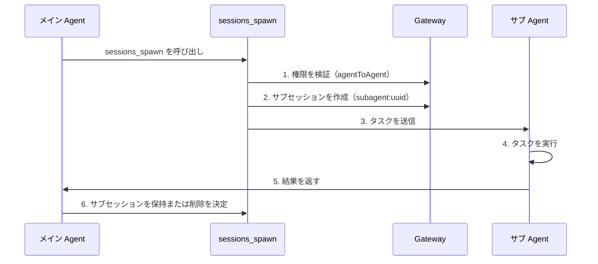

# セッション管理とマルチ Agent：セッション分離、サブ Agent 協調とコンテキスト圧縮

## 学習後にできること

- Clawdbot のセッションモデルとセッションキー構造を理解する
- 異なる Agent 間のセッション分離を設定する
- サブ Agent を使用して分離タスクを完了する
- コンテキストウィンドウを管理し、モデル制限を超えるのを防ぐ
- セッションリセットと圧縮のベストプラクティスを習得する

## 現在の課題

AI アシスタントが複数のユーザー、複数のチャネルに同時にサービスを提供する場合、次のような問題に遭遇する可能性があります：

- **セッションの混線**：異なるユーザーのメッセージが混ざり合い、AI がそれぞれの履歴を覚えられない
- **コンテキスト爆発**：長時間の会話後、モデルが「記憶喪失」に陥ったり、応答が遅くなったりする
- **サブタスクの混乱**：メイン Agent がサブタスクを呼び出す際、明確な分離境界がない
- **リソースの浪費**：すべての Agent が同じセッションセットを共有し、ストレージと計算リソースを有効活用できない

Clawdbot の**セッション管理システム**は、これらの問題を解決するために設計されています。

## コアコンセプト

**セッション**は Clawdbot のコア抽象単位です。各セッションは独立した対話履歴を表し、独自のメッセージ記録、メタデータ、ライフサイクルを持ちます。

Clawdbot は**セッションキー（session key）**を使用して、異なるセッションを識別し分離します。セッションキーは、異なる対話相手（ユーザー、グループ、チャネル）を区別するだけでなく、異なる Agent インスタンスも区別します。

::: info セッションキーとは？

セッションキーは、セッションを一意に識別するための文字列識別子です。形式の例：
- `agent:main:main`（メイン Agent のメインセッション）
- `agent:work:main`（ワーク Agent のメインセッション）
- `agent:main:whatsapp:group:123`（WhatsApp グループセッション）
- `cron:job-id`（定時タスクセッション）

Clawdbot はセッションキーに基づいてメッセージを正しい Agent にルーティングし、独立した対話履歴を維持します。
:::

## セッションモデル

### セッションキーの構成

Clawdbot は構造化されたセッションキーを使用して、異なる種類のセッションを識別します：

| セッション種類 | キー形式 | 例 | 説明 |
|--- | --- | --- | ---|
| **メインセッション** | `agent:<agentId>:<mainKey>` | `agent:main:main` | 各 Agent のデフォルトメインセッション |
| **ダイレクトメッセージ** | `agent:<agentId>:dm:<peerId>` | `agent:main:dm:+15551234567` | `dmScope` 設定で分離 |
| **グループ/チャネル** | `agent:<agentId>:<channel>:group:<id>` | `agent:main:whatsapp:group:123` | グループとチャネルは自動分離 |
| **サブ Agent** | `agent:<agentId>:subagent:<uuid>` | `agent:main:subagent:a1b2c3d4` | サブ Agent の分離セッション |
| **定時タスク** | `cron:<jobId>` | `cron:daily-report` | Cron タスク専用セッション |
| **Webhook** | `hook:<uuid>` | `hook:xyz789` | Webhook トリガーセッション |

### セッションストレージ

セッションデータは 2 つの場所に保存されます：

```bash
# セッションインデックス（メタデータ）
~/.clawdbot/agents/<agentId>/sessions/sessions.json

# メッセージ履歴（セッションごとに 1 ファイル）
~/.clawdbot/agents/<agentId>/sessions/<sessionId>.jsonl
```

**sessions.json** はマッピングテーブルであり、以下を記録します：
- セッションキー → セッションメタデータ（sessionId, updatedAt, model, tokens など）
- これらのエントリは削除しても安全で、必要に応じて自動的に再構築されます

**JSONL ファイル**は完全な対話履歴を保存し、行ごとに 1 つのメッセージ記録を含みます。

::: tip Gateway は単一の真実情報源

すべてのセッション状態は Gateway が所有します。UI クライアント（macOS アプリ、WebChat）は、ローカルファイルを直接読み取るのではなく、Gateway からセッションリストとトークンカウントをクエリする必要があります。

リモートモードでは、関心のあるセッションはリモート Gateway ホスト上に保存され、Mac 上には保存されません。
:::

## セッション分離メカニズム

### シングル Agent モード（デフォルト）

何も設定しない場合、Clawdbot は単一の Agent を実行します：
- `agentId` はデフォルトで `main`
- すべての DM セッションはメインセッションキー（`agent:main:main`）を共有します
- これは**同じユーザーが異なるチャネルから送信したメッセージが同じセッションに入る**ことを意味します

### マルチ Agent モード

**複数の Agent = 複数の分離されたブレイン**

各 Agent は独自に独立した以下を持っています：
- **Workspace**（ワークスペースファイル、AGENTS.md、SOUL.md）
- **State directory**（認証設定、モデルレジストリ）
- **Session store**（チャット履歴とルーティング状態）

#### なぜマルチ Agent が必要か？

| シナリオ | ソリューション |
|--- | ---|
| **複数ユーザーがサーバーを共有** | 各ユーザーが独立した Agent を持ち、セッションが完全に分離される |
| **異なるチャネルで異なる人格** | WhatsApp では日常 Agent、Telegram では集中作業 Agent を使用 |
| **権限分離** | 家庭 Agent はツールを制限、個人 Agent は完全アクセス |
| **異なる環境** | 開発 Agent、本番 Agent を完全に分離 |

#### マルチ Agent の設定

**ステップ 1：新しい Agent を追加**

```bash
clawdbot agents add work
```

これにより `~/.clawdbot/agents/work/` に新しい Agent ディレクトリが作成されます。

**ステップ 2：ルーティングルールを設定**

`~/.clawdbot/clawdbot.json` に `bindings` を追加します：

```json5
{
  agents: {
    list: [
      { id: "home", workspace: "~/clawd-home", name: "Home" },
      { id: "work", workspace: "~/clawd-work", name: "Work" }
    ]
  },
  bindings: [
    { agentId: "home", match: { channel: "whatsapp", accountId: "personal" } },
    { agentId: "work", match: { channel: "whatsapp", accountId: "biz" } }
  ]
}
```

**ステップ 3：設定を検証**

```bash
clawdbot agents list --bindings
```

#### ルーティングルール（決定性マッチング）

メッセージが到着すると、Clawdbot は**最も具体的なものを優先**する順序でルールをマッチングします：

1. **peer** マッチング（正確な DM/group/channel id）
2. **guildId**（Discord）
3. **teamId**（Slack）
4. **accountId** マッチング
5. チャネルレベルマッチング（`accountId: "*"`）
6. デフォルト Agent にフォールバック

::: warning バインディングの順序に注意

バインディングリスト内の順序が重要です！より具体的なルールを前に配置する必要があります。

例えば、特定の DM を `work` Agent にルーティングし、他の WhatsApp DM を `home` Agent にルーティングする場合、peer ルールを先に記述する必要があります：
```json5
{
  bindings: [
    { agentId: "work", match: { channel: "whatsapp", peer: { kind: "dm", id: "+15551234567" } } },
    { agentId: "home", match: { channel: "whatsapp" } }
  ]
}
```
:::

### DM スコープ制御

`session.dmScope` を使用して、ダイレクトメッセージがどのようにグループ化されるかを制御します：

| オプション | 動作 | 使用シナリオ |
|--- | --- | ---|
| `main`（デフォルト） | すべての DM がメインセッションを共有 | シングルユーザー、マルチチャネル |
| `per-peer` | 送信者 ID で分離 | マルチユーザー環境 |
| `per-channel-peer` | チャネル + 送信者で分離 | 共有受信トレイ |

設定例：

```json5
{
  session: {
    dmScope: "per-channel-peer"  // 各チャネルの各ユーザーが独立したセッション
  }
}
```

### アイデンティティリンク（Identity Links）

同じユーザーが複数のプラットフォーム（WhatsApp や Telegram など）を使用している場合、`session.identityLinks` を使用してセッションを共有させることができます：

```json5
{
  session: {
    identityLinks: {
      alice: ["telegram:123456789", "discord:987654321012345678"]
    }
  }
}
```

これにより、Alice が Telegram または Discord から送信したメッセージはすべて `agent:<agentId>:dm:alice` セッションに入ります。

## サブ Agent 協調

### サブ Agent とは

**サブ Agent**は、分離されたセッションで実行される Agent インスタンスであり、メインセッションのコンテキストに影響を与えずに特定のタスクを実行するために使用されます。

典型的な使用シナリオ：
- **コードレビュー**：サブ Agent がコードを分析し、要約を返す
- **データ抽出**：サブ Agent が長いドキュメントから情報を抽出する
- **並列タスク**：メイン Agent が待機している間、サブ Agent がバックグラウンドで実行
- **サンドボックス分離**：制限された環境で信頼できないタスクを実行

### sessions_spawn ツール

`sessions_spawn` ツールを使用してサブ Agent を作成します：

```json
{
  "task": "このドキュメントを分析して重要なポイントを抽出する",
  "label": "ドキュメント分析",
  "model": "anthropic/claude-opus-4-5",
  "thinking": "detailed",
  "runTimeoutSeconds": 300,
  "cleanup": "keep"
}
```

パラメータの説明：

| パラメータ | タイプ | 必須 | 説明 |
|--- | --- | --- | ---|
| `task` | string | ✅ | サブ Agent のタスク説明 |
| `label` | string | ❌ | 読みやすいタスクリベル（追跡用） |
| `agentId` | string | ❌ | ターゲット Agent ID（デフォルトは現在の Agent） |
| `model` | string | ❌ | モデルオーバーライド |
| `thinking` | string | ❌ | 思考レベル（`minimal`/`standard`/`detailed`） |
| `runTimeoutSeconds` | number | ❌ | タイムアウト時間（秒） |
| `cleanup` | string | ❌ | タスク完了後のクリーンアップ戦略（`keep`/`delete`） |

### サブ Agent のライフサイクル



**ライフサイクルステップ**：

1. **権限チェック**：Agent 間呼び出しの場合、`tools.agentToAgent.allow` 設定を検証
2. **サブセッション作成**：一意の `agent:<agentId>:subagent:<uuid>` キーを生成
3. **タスク実行**：サブ Agent が分離されたセッションでタスクを完了
4. **結果返却**：結果がストリーミングでメイン Agent に返される
5. **クリーンアップ戦略**：
   - `cleanup: "keep"`：後続の検査のためにサブセッションを保持
   - `cleanup: "delete"`：サブセッションを自動削除

### Agent 間通信の設定

デフォルトでは、Agent 間通信は無効になっています。明示的に有効にする必要があります：

```json5
{
  tools: {
    agentToAgent: {
      enabled: true,
      allow: ["home", "work", "family"]
    }
  }
}
```

権限の説明：
- `enabled: false`：Agent 間通信を完全に無効化
- `allow: ["*"]`：すべての Agent を許可
- `allow: ["home", "work"]`：特定の Agent のみ許可

::: danger セキュリティリマインダー

サブ Agent は親 Agent の一部のコンテキストを継承しますが、親セッション履歴全体は取得しません。これは機能（トークンの節約）でもあり、制限（サブ Agent は完全なコンテキストを知らない）でもあります。

機密操作の場合、サブ Agent を介さずにメインセッションで完了することを検討してください。
:::

## コンテキスト圧縮

### コンテキストウィンドウとは

各 AI モデルには**コンテキストウィンドウ（context window）**があります。これは、1 回の推論で見ることができる最大トークン数です。

長時間の会話はメッセージとツール結果を蓄積します。モデル制限に近づくと、Clawdbot はスペースを確保するために履歴を**圧縮（compact）**します。

### 自動圧縮

セッションがコンテキストウィンドウに近づく、または超えると、Clawdbot は自動的に圧縮をトリガーします：

- **圧縮前**：最初に**サイレントメモリリフレッシュ**を実行し、モデルが永続的なノートをディスクに書き込むように促します（ワークスペースが書き込み可能な場合）
- **圧縮プロセス**：古い対話を圧縮要約に要約し、最近のメッセージを保持
- **永続化**：圧縮結果を JSONL 履歴ファイルに書き込み
- **再試行**：圧縮されたコンテキストを使用して元の要求を再試行

以下が表示されます：
- `🧹 Auto-compaction complete`（詳細モードの場合）
- `/status` に `🧹 Compactions: <count>` が表示

### 手動圧縮

`/compact` コマンドを使用して手動で圧縮をトリガーします：

```
/compact
```

圧縮指示を追加できます：

```
/compact Focus on decisions and open questions
```

これにより、AI が要約時に特定の内容に注目するように指示できます。

### 圧縮 vs プルーニング

| 操作 | 目的 | 永続化 | 場所 |
|--- | --- | --- | ---|
| **圧縮（Compaction）** | 古い対話を要約 | ✅ | JSONL に書き込み |
| **プルーニング（Pruning）** | 古いツール結果を削除 | ❌ | メモリ内のみ |

::: tip 圧縮戦略の推奨事項

- **圧縮**：情報の要約を保存、履歴を確認する必要がある場合に適している
- **プルーニング**：一時的なクリーンアップ、単一リクエストのトークン使用量を削減する場合に適している
- **/new**：セッションを完全にクリア、新しいトピックを開始する場合

使用習慣に応じて適切な戦略を選択してください。
:::

### 圧縮の設定

`~/.clawdbot/clawdbot.json` で圧縮動作を設定します：

```json5
{
  agents: {
    defaults: {
      compaction: {
        enabled: true,
        threshold: 0.9,  // コンテキスト使用率 90% でトリガー
        trigger: "auto"  // auto/manual
      }
    }
  }
}
```

## いっしょにやろう：セッション管理の設定

実際のシナリオを使用してセッション管理を設定しましょう。

### シナリオ

WhatsApp 番号を持っていて、次のことを希望します：
1. 個人の連絡先は `home` Agent（日常会話）
2. ワークグループは `work` Agent（プロフェッショナルな応答）
3. 分離タスクのためにサブ Agent を有効化

### ステップ 1：2 つの Agent を追加

```bash
# ホーム Agent を追加
clawdbot agents add home

# ワーク Agent を追加
clawdbot agents add work
```

**以下が表示されます**：ワークスペースパスなどの情報を入力するよう求められます。

### ステップ 2：設定ファイルを編集

`~/.clawdbot/clawdbot.json` を開き、Agent リストとバインディングルールを追加します：

```json5
{
  agents: {
    list: [
      {
        id: "home",
        name: "Home",
        workspace: "~/clawd-home",
        model: "anthropic/claude-sonnet-4-5"
      },
      {
        id: "work",
        name: "Work",
        workspace: "~/clawd-work",
        model: "anthropic/claude-opus-4-5"
      }
    ]
  },
  bindings: [
    // 個人メッセージを home Agent にルーティング
    { agentId: "home", match: { channel: "whatsapp", peer: { kind: "dm", id: "+15551230001" } } },
    // ワークグループを work Agent にルーティング
    { agentId: "work", match: { channel: "whatsapp", peer: { kind: "group", id: "120363999999999999@g.us" } } },
    // 他の WhatsApp メッセージを home Agent にルーティング（デフォルト）
    { agentId: "home", match: { channel: "whatsapp" } }
  ],
  tools: {
    agentToAgent: {
      enabled: true,
      allow: ["home", "work"]
    }
  }
}
```

### ステップ 3：Gateway を再起動

```bash
clawdbot gateway restart
```

**以下が表示されます**：Gateway 起動ログ、読み込まれた Agent とバインディングルールが表示されます。

### ステップ 4：サブ Agent 呼び出しをテスト

`home` Agent のセッションで次を送信します：

```
サブ Agent を使用してこの PDF ドキュメントを分析し、重要な情報を抽出してください：/path/to/file.pdf
```

Agent は自動的に `sessions_spawn` ツールを呼び出し、次が表示されます：
- サブ Agent 作成通知
- タスク実行プロセス
- 結果返却

### ステップ 5：セッション状態を確認

チャットで次を送信します：

```
/status
```

**以下が表示されます**：
- 現在のセッションのトークン使用状況
- 圧縮回数
- モデル情報

## チェックポイント ✅

設定が完了したら、以下の点を確認します：

- [ ] `clawdbot agents list --bindings` が正しいバインディングルールを表示する
- [ ] 個人 DM が `home` Agent にルーティングされる
- [ ] ワークグループが `work` Agent にルーティングされる
- [ ] サブ Agent 呼び出しが正常に動作する
- [ ] `/status` が正しいセッション情報を表示する

## トラブルシューティング

### 一般的なエラー

| エラー | 原因 | 解決方法 |
|--- | --- | ---|
| **Agent 間呼び出しが禁止されている** | `tools.agentToAgent.enabled` が有効になっていないか、`allow` リストにターゲット Agent が含まれていない | 設定を確認し、有効になっていて許可リストが追加されていることを確認 |
| **サブ Agent 作成の失敗** | Agent 間呼び出し時、ターゲット Agent が許可リストにない | `tools.agentToAgent.allow` 設定を確認 |
| **セッションキーの競合** | バインディングルールの順序が間違っており、より具体的なルールが上書きされている | ピアルールをチャネルルールの前に配置 |
| **圧縮の失敗** | コンテキストが小さすぎるか、モデルが圧縮をサポートしていない | モデルのコンテキストウィンドウと圧縮設定を確認 |

### 設定の推奨事項

- **単純から始める**：最初に単一の Agent でテストし、機能が正常であることを確認してからマルチ Agent を追加
- **ラベルを使用**：サブ Agent タスクに明確な `label` を追加し、追跡を容易にする
- **トークン使用を監視**：定期的に `/status` を確認し、コンテキスト使用状況を把握する
- **設定をバックアップ**：`clawdbot.json` を変更する前にバックアップ

## レッスンのまとめ

このレッスンでは、Clawdbot のセッション管理システムについて学びました：

- **セッションモデル**：セッションキー、ストレージ場所、ライフサイクル
- **セッション分離**：マルチ Agent モード、DM スコープ制御、アイデンティティリンク
- **サブ Agent 協調**：`sessions_spawn` ツール、権限制御、クリーンアップ戦略
- **コンテキスト圧縮**：自動/手動圧縮、圧縮 vs プルーニング

適切なセッション管理設定により、Clawdbot は複数のユーザーとシナリオに同時にサービスを提供でき、それぞれが独自の分離されたコンテキストと履歴を持つことができます。

## 次のレッスンの予告

> 次のレッスンでは、**[ブラウザ自動化ツール](../tools-browser/)**を学習します。
>
> 以下を学習します：
> - ブラウザツールの設定と使用方法
> - ブラウザ自動化のセキュリティ制限
> - スクリーンショットとフォーム操作

---

## 付録：ソースコード参照

<details>
<summary><strong>クリックしてソースコードの場所を展開</strong></summary>

> 更新時間：2026-01-27

| 機能 | ファイルパス | 行番号 |
|--- | --- | ---|
| セッションキー解析 | [`src/routing/session-key.ts`](https://github.com/moltbot/moltbot/blob/main/src/routing/session-key.ts) | 1-100 |
| セッション設定 Schema | [`src/config/zod-schema.session.ts`](https://github.com/moltbot/moltbot/blob/main/src/config/zod-schema.session.ts) | 11-83 |
| サブ Agent 生成ツール | [`src/agents/tools/sessions-spawn-tool.ts`](https://github.com/moltbot/moltbot/blob/main/src/agents/tools/sessions-spawn-tool.ts) | 28-269 |
| セッションツールヘルパー関数 | [`src/agents/tools/sessions-helpers.ts`](https://github.com/moltbot/moltbot/blob/main/src/agents/tools/sessions-helpers.ts) | 1-328 |
| セッション管理ドキュメント | [`docs/concepts/session.md`](https://github.com/moltbot/moltbot/blob/main/docs/concepts/session.md) | 1-151 |
| マルチ Agent ルーティングドキュメント | [`docs/concepts/multi-agent.md`](https://github.com/moltbot/moltbot/blob/main/docs/concepts/multi-agent.md) | 1-355 |
| コンテキスト圧縮ドキュメント | [`docs/concepts/compaction.md`](https://github.com/moltbot/moltbot/blob/main/docs/concepts/compaction.md) | 1-50 |

**重要な定数**：
- `SESSION_ID_RE = /^[0-9a-f]{8}-[0-9a-f]{4}-[0-9a-f]{4}-[0-9a-f]{4}-[0-9a-f]{12}$/i`：セッション ID 正規表現（`sessions-helpers.ts:96`）

**重要な型**：
- `SessionKind = "main" | "group" | "cron" | "hook" | "node" | "other"`：セッション種類列挙型（`sessions-helpers.ts:11`）
- `SessionListRow`：セッションリスト行構造（`sessions-helpers.ts:19-41`）

**重要な関数**：
- `createSessionsSpawnTool()`：サブ Agent 生成ツールを作成（`sessions-spawn-tool.ts:60-269`）
- `resolveSessionReference()`：セッション参照を解決（`sessions-helpers.ts:215-253`）
- `classifySessionKind()`：セッション種類を分類（`sessions-helpers.ts:255-271`）
- `createAgentToAgentPolicy()`：Agent 間通信ポリシーを作成（`sessions-helpers.ts:72-94`）

</details>
