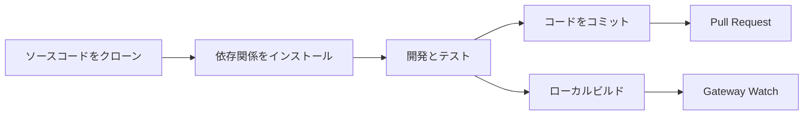

# 開発ガイド：ソースコードビルドから貢献まで

## 学習目標

- ソースコードから Clawdbot をビルドして実行する
- カスタムプラグイン（チャネル、ツール、RPC メソッド）を開発する
- ユニットテストとエンドツーエンドテストを実行する
- プロジェクトに Pull Request を提出してコードを貢献する
- プロジェクトアーキテクチャとプラグインシステムを理解する

## 現在の課題

あなたは開発者として、以下のことを実現したいと考えています：

- Clawdbot の機能をカスタマイズまたは拡張したい
- プロジェクトの内部動作メカニズムを理解したい
- オープンソースコミュニティにコードを貢献したい
- しかし、どこから始めればよいか分からない：ビルド、テスト、提出フロー？

## 活用シナリオ

- ソースコードを修正したり、新機能を追加する必要がある場合
- カスタムプラグインやチャネルを開発したい場合
- デバッグやバグ修正が必要な場合
- プロジェクトにコードを貢献したい場合

## 🎒 開始前の準備

::: warning 前提条件
本チュートリアルは、以下の条件を満たしていることを前提としています：
:::

- **Node.js ≥22** がインストール済み（プロジェクト要件）
- **pnpm** パッケージマネージャーがインストール済み（ソースコードビルドに推奨）
- **Git** の基本操作知識
- **TypeScript** の開発経験
- **ターミナル**のコマンドライン操作能力

推奨環境：
- macOS / Linux（主要開発プラットフォーム）
- Windows は WSL2 経由で利用可能

## コアコンセプト

### 開発フローの概要

Clawdbot の開発フローは、4つの主要フェーズに分かれています：



### 主要概念

- **ビルドシステム**：TypeScript コンパイルを使用、`dist/` ディレクトリに出力
- **プラグインアーキテクチャ**：ランタイムでロードされる TypeScript モジュール、機能拡張をサポート
- **Gateway デーモン**：シングルトンパターン、コントロールプレーンとメッセージルーティング
- **テストフレームワーク**：Vitest でユニットテスト、Docker でエンドツーエンドテスト

### プロジェクト構造のポイント

| ディレクトリ | 役割 |
| --- | --- |
| `src/` | すべてのソースコード（2475 個の TypeScript ファイル）|
| `src/gateway/` | Gateway WebSocket サーバー |
| `src/channels/` | チャネルプラグインシステム |
| `src/agents/` | AI Agent ランタイム |
| `src/plugin-sdk/` | プラグイン開発 SDK |
| `extensions/` | 内蔵プラグイン（voice-call など）|
| `tests/` | テストファイル |

## ステップバイステップ

### ステップ 1：ソースコードをクローンして依存関係をインストール

**理由**
最新のソースコードを取得し、すべての依存関係をインストールすることが開発の第一歩です。

```bash
## リポジトリをクローン
git clone https://github.com/clawdbot/clawdbot.git
cd clawdbot

## 依存関係をインストール（pnpm 推奨）
pnpm install
```

**期待される結果**：依存関係が正常にインストールされ、エラーメッセージが表示されないこと。

::: info Bun サポート
Bun を使用している場合、ビルドなしで TypeScript を直接実行できます（`tsx` を使用）。
:::

### ステップ 2：プロジェクトをビルド

**理由**
TypeScript を JavaScript にコンパイルし、配布可能な `dist/` ディレクトリを生成します。

```bash
## フルビルド
pnpm build
```

**期待される結果**：
```
src/cli/entry.ts → dist/cli/entry.js
src/gateway/server.ts → dist/gateway/server.js
...
Build completed in X seconds
```

::: tip UI ビルド
初回 `pnpm ui:build` 実行時に UI 依存関係が自動的にインストールされます。
:::

### ステップ 3：開発モードを起動

**理由**
開発モードは自動リロードをサポートし、手動での再ビルドが不要です。

```bash
## Gateway 開発モードを起動（自動リロード）
pnpm gateway:watch

## または CLI 開発モードを起動
CLAWDBOT_PROFILE=dev pnpm clawdbot --dev
```

**期待される結果**：
- Gateway が起動し、`ws://127.0.0.1:18789` でリッスン
- ファイル変更時に自動的に再コンパイルと再起動

::: tip チャネルロードをスキップ
開発時は `CLAWDBOT_SKIP_CHANNELS=1` を使用してチャネル初期化をスキップし、起動を高速化できます。
:::

**チェックポイント ✅**
- Gateway がポート 18789 で正常に起動してリッスンしている
- TypeScript ファイルを変更すると自動的に再コンパイルされる

### ステップ 4：テストを実行

**理由**
コード変更が既存の機能を壊していないことを確認します。

#### ユニットテスト

```bash
## すべてのテストを実行
pnpm test

## テストを実行して変更を監視
pnpm test:watch

## カバレッジレポートを生成
pnpm test:coverage
```

**期待される結果**：テスト合格率とカバレッジ統計が表示されます。

#### エンドツーエンドテスト

```bash
## Docker エンドツーエンドテストを実行
pnpm test:docker:all

## または単一のテストスイートを実行
pnpm test:docker:live-models
```

**期待される結果**：すべての Docker テストコンテナが正常に実行されて終了します。

::: warning テスト要件
エンドツーエンドテストには Docker がインストールされ、実行されている必要があります。
:::

**チェックポイント ✅**
- すべてのユニットテストが合格
- テストカバレッジが要件を満たしている（≥70%）
- エンドツーエンドテストが合格

### ステップ 5：コードチェックとフォーマット

**理由**
コードスタイルの一貫性と型安全性を維持します。

```bash
## linter を実行
pnpm lint

## コードをフォーマット
pnpm format:fix

## Swift linter を実行（macOS/iOS 開発）
pnpm lint:swift
```

**期待される結果**：lint エラーがなく、コードがフォーマットされていること。

::: tip 自動フォーマット
プロジェクトには pre-commit git hooks が設定されており、コミット前にステージングされたファイルを自動的にフォーマットします。
:::

### ステップ 6：プラグインを開発（オプション）

**理由**
Clawdbot の機能を拡張したり、外部サービスと統合します。

#### プラグインのクイック作成

1. プラグインディレクトリを作成：
```bash
mkdir extensions/my-plugin
cd extensions/my-plugin
```

2. `clawdbot.plugin.json` を作成：
```json
{
  "id": "my-plugin",
  "name": "My Plugin",
  "version": "1.0.0",
  "configSchema": {
    "type": "object",
    "properties": {
      "apiKey": { "type": "string" }
    }
  }
}
```

3. プラグインエントリ `index.ts` を作成：
```typescript
export default function (api) {
  console.log("My plugin loaded!");
  
  // ツールを登録
  api.registerTool({
    name: "my_tool",
    description: "My custom tool",
    execute: async (params) => {
      return { result: "Hello from my tool!" };
    }
  });
  
  // RPC メソッドを登録
  api.registerGatewayMethod("myplugin.status", ({ respond }) => {
    respond({ ok: true, status: "running" });
  });
}
```

4. インストールしてテスト：
```bash
## 開発モード：プラグインをリンク
clawdbot plugins install -l extensions/my-plugin

## Gateway を再起動
pnpm gateway:watch
```

::: details プラグインタイプ
Clawdbot は以下のプラグインタイプをサポートしています：

- **Agent Tools**：AI が呼び出せるツール
- **Channel Plugins**：新しいメッセージチャネル（WhatsApp、Telegram など）
- **Gateway RPC**：WebSocket エンドポイント
- **CLI Commands**：コマンドラインツール
- **Background Services**：バックグラウンドタスク
- **Auto-reply Commands**：AI 不要のクイックコマンド

詳細は [プラグインドキュメント](https://github.com/moltbot/moltbot/blob/main/docs/plugin.md) を参照してください。
:::

**チェックポイント ✅**
- プラグインが正常にロードされた
- CLI または Gateway 経由でプラグイン機能を呼び出せる
- プラグイン設定が正常に動作している

### ステップ 7：コードをコミットして Pull Request を作成

**理由**
あなたの貢献をコミュニティに提出します。

```bash
## 機能ブランチを作成
git checkout -b feature/my-feature

## 変更をコミット
git add .
git commit -m "feat: add my new feature"

## GitHub にプッシュ
git push origin feature/my-feature
```

その後、GitHub で Pull Request を作成します。

::: tip PR 規約
PR の説明には以下を記載してください：
- **何をしたか**：機能または修正の説明
- **なぜ**：どのような問題を解決するか
- **テスト状況**：untested / lightly tested / fully tested
- **AI 支援**：AI ツールを使用して開発を支援したかどうか
:::

**チェックポイント ✅**
- コードが GitHub にプッシュされた
- Pull Request が正常に作成された
- CI/CD チェックが合格（該当する場合）

## よくある落とし穴

### 一般的なエラー

| エラー | 原因 | 解決方法 |
| --- | --- | --- |
| `Cannot find module 'xxx'` | 依存関係がインストールされていない | `pnpm install` を実行 |
| `Port 18789 already in use` | Gateway がすでに実行中 | 古いインスタンスを確認して終了 |
| TypeScript コンパイルエラー | 型定義の問題 | `pnpm lint` を実行して確認 |
| テストタイムアウト | Docker が起動していないかネットワークの問題 | Docker の状態を確認 |

### 開発ベストプラクティス

- **小さなコミット**：各 PR は一つのことだけを行い、レビューを容易にする
- **テストを書く**：新機能には必ずテストカバレッジが必要
- **スタイルに従う**：プロジェクトで設定された linter と formatter を使用
- **ドキュメントを更新**：コードを変更する際は関連ドキュメントも同期して更新
- **AI 表記**：AI 支援開発を使用した場合は、PR に記載

## 本レッスンのまとめ

本チュートリアルでは、Clawdbot の完全な開発フローを解説しました：

✅ **ソースコードビルド**：`pnpm install` と `pnpm build` を使用
✅ **開発モード**：`pnpm gateway:watch` で自動リロードを実現
✅ **テストフレームワーク**：Vitest ユニットテスト + Docker エンドツーエンドテスト
✅ **プラグイン開発**：TypeScript ベースの拡張可能なプラグインシステム
✅ **貢献フロー**：Git ワークフローと Pull Request 規約

主要コマンドクイックリファレンス：

| タスク | コマンド |
| --- | --- |
| 依存関係をインストール | `pnpm install` |
| ビルド | `pnpm build` |
| 開発モード | `pnpm gateway:watch` |
| ユニットテスト | `pnpm test` |
| コードチェック | `pnpm lint` |
| フォーマット | `pnpm format:fix` |

## 次のレッスン

開発ガイドの学習、お疲れ様でした！これで以下の能力を身につけました：

- ソースコードから Clawdbot をビルドして実行する能力
- カスタムプラグイン開発の基礎
- テスト実行とコード貢献のフロー

次に、以下の内容を深く学ぶことをお勧めします：

- [設定リファレンス](../config-reference/) - 完全な設定項目ドキュメント
- [Gateway API プロトコル](../api-protocol/) - WebSocket プロトコル仕様
- [デプロイメントオプション](../deployment/) - Docker、Nix などのデプロイ方法

引き続き探索して、Clawdbot をあなたのために働かせましょう！

---

## 付録：ソースコードリファレンス

<details>
<summary><strong>クリックしてソースコードの場所を表示</strong></summary>

> 更新日：2026-01-27

| 機能 | ファイルパス | 行番号 |
| --- | --- | --- |
| ビルドスクリプト | [`package.json`](https://github.com/moltbot/moltbot/blob/main/package.json) | 77-44 |
| ソースからインストール | [`README.md`](https://github.com/moltbot/moltbot/blob/main/README.md) | 83-99 |
| プラグインドキュメント | [`docs/plugin.md`](https://github.com/moltbot/moltbot/blob/main/docs/plugin.md) | 1-639 |
| 貢献ガイド | [`CONTRIBUTING.md`](https://github.com/moltbot/moltbot/blob/main/CONTRIBUTING.md) | 1-53 |
| アーキテクチャドキュメント | [`docs/concepts/architecture.md`](https://github.com/moltbot/moltbot/blob/main/docs/concepts/architecture.md) | 1-123 |

**主要コマンド**：
- `pnpm build` - フルビルド（package.json:85）
- `pnpm gateway:watch` - 開発モード自動リロード（package.json:93）
- `pnpm test` - ユニットテストを実行（package.json:118）
- `pnpm lint` - コードチェック（package.json:110）

**主要ディレクトリ**：
- `src/` - ソースコードルートディレクトリ（2475 個の TypeScript ファイル）
- `src/plugin-sdk/` - プラグイン開発 SDK
- `extensions/` - 内蔵プラグイン
- `tests/` - テストファイル
- `dist/` - ビルド出力ディレクトリ

**プラグイン関連**：
- プラグイン manifest 形式：`clawdbot.plugin.json`（plugin.md:8-10）
- プラグイン API：`api.registerTool()`, `api.registerGatewayMethod()`（plugin.md:591-600）
- プラグイン設定 Schema：JSON Schema + `uiHints`（plugin.md:36-48）

</details>
