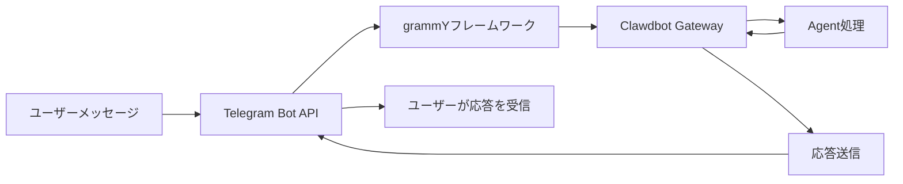

# Telegramチャンネルの設定と使用

## このチュートリアルでできること

- 🤖 TelegramでBotを作成し、Bot Tokenを取得する
- ⚙️ TelegramチャンネルをClawdbotに接続する
- 🔒 DMとグループのアクセス権限を制御する（ペアリングメカニズムとホワイトリスト）
- 📡 グループでのメンションルールと応答ポリシーを設定する
- 🔌 Webhookモードを設定する（オプション）
- 🎯 Telegram Bot APIの機能を使用する（インラインボタン、トピック、返信）

## 現在直面している問題

すでにTelegramでClawdbotを使用していますが、次のような問題に遭遇しています：

- ❌ Bot Tokenを正しく設定する方法が不明確
- ❌ 見知らぬ人がBotにメッセージを送っても応答がない
- ❌ グループで、Botがメンションされていないメッセージに応答しない
- ❌ 誰がBotにアクセスできるかを細かく制御したいが、設定方法がわからない
- ❌ WebhookとLong-pollingの違いを聞いたことがあるが、どちらを選ぶべきかわからない

このチュートリアルでは、これらの問題を一つずつ解決します。

## いつこの機能を使用するか

Telegramチャンネルの使用に適したシナリオ：

- ✅ すでにTelegramを使用しており、このプラットフォームでAIアシスタントと対話したい
- ✅ Botがグループで特定のユーザーやコマンドに応答する必要がある
- ✅ Telegram Bot APIの特殊機能（インラインボタン、Forumトピック）を使用したい
- ✅ サーバーのネットワーク環境がLong-pollingまたはWebhookに適している

**主にWhatsAppや他のチャンネルを使用する場合**：このレッスンをスキップして、使用しているチャンネルに集中してください。

## 🎒 開始前の準備

開始する前に、次のことを確認してください：

- [ ] [クイックスタート](../../start/getting-started/)チュートリアルを完了し、Clawdbotがインストールされ、起動できる状態であること
- [ ] Telegramアカウントがあること（プレミアムユーザーである必要はない）
- [ ] 基本的なTelegram Botの概念を理解していること（Bot、Token、プライバシーモード）

::: info 設定ファイルの場所
デフォルトでは、Clawdbotの設定ファイルは次の場所にあります：
- **Linux/macOS**: `~/.clawdbot/clawdbot.json`
- **Windows**: `%USERPROFILE%\.clawdbot\clawdbot.json`
:::

## 核心コンセプト

### Telegram Bot API vs 他のチャンネル

他のインスタントメッセージングプラットフォームとは異なり、Telegramは**Bot API**アーキテクチャを使用しています：

| 特性 | Telegram | WhatsApp | Slack |
|--- | --- | --- | ---|
| 接続方法 | Bot API（HTTP） | Web Client | Bot API + WebSocket |
| メッセージモード | プッシュ（Botからの能動的送信） | プル（Web Clientのリッスン） | プル（WebSocketのリッスン） |
| プライバシーモード | **対応**（Botが選択可能） | N/A | N/A |
| グループ対応 | SuperGroup + Forum | Groups | Channels + Workspace |
| 特殊機能 | Forumトピック、インラインボタン | - | - |

### Clawdbotの統合方法

Clawdbotは[grammY](https://grammy.dev/) Bot APIフレームワークを使用してTelegramを統合します：



**重要ポイント**：
- **Long-polling**：デフォルトモード。ClawdbotがTelegramの更新を能動的に取得
- **Webhook**：オプションモード。Telegramが更新をあなたのサーバーにプッシュ
- **DMペアリング**：デフォルトで有効。見知らぬ人はペアリングを承認する必要がある
- **グループメンション**：デフォルトで有効。Botは`@botname`または設定されたメンションパターンのみ応答

### アクセス制御メカニズム

Clawdbotは3層のアクセス制御を提供します：

1. **DMレベル**（`dmPolicy`）
   - `pairing`：見知らぬユーザーがペアリングコードを受け取り、承認が必要
   - `allowlist`：ホワイトリスト内のユーザーのみ許可
   - `open`：すべてのDMを許可（`allowFrom: ["*"]`を設定が必要）

2. **グループレベル**（`groups` + `groupPolicy`）
   - Botにアクセスできるグループをリスト化
   - 各グループの`requireMention`ルールを設定

3. **送信者レベル**（`allowFrom` + `groupAllowFrom`）
   - 許可されたDM/グループ内で、さらにメッセージを送信できるユーザーを制限

::: warning セキュリティのデフォルト
デフォルトのDMポリシーは`pairing`であり、これが最も安全なデフォルト値です。見知らぬ人からのメッセージは、ペアリングコードを承認するまで無視されます。
:::

## 実践チュートリアル

### ステップ1：Telegram Botを作成し、Tokenを取得する

**なぜ必要か**
Telegram BotはBot Tokenを使用してBot APIにアクセスし、メッセージを送信する必要があります。このTokenはBotの「認証情報」に相当します。

**手順**

1. Telegramで**@BotFather**を検索して開く
2. コマンド`/newbot`を送信する
3. 指示に従って操作：
   - Bot名を入力（例：`My Clawdbot Assistant`）
   - Botユーザー名を入力（`bot`で終わる必要があります。例：`my_clawdbot_bot`）
4. BotFatherがBot Tokenを返します。形式は次の通りです：`123456:ABC-DEF123456`

**表示される内容**：
```
Done! Congratulations on your new bot.

You can find it at t.me/my_clawdbot_bot. You can now add a description,
about section and profile picture for it, see /help for a list of commands.

Use this token to access the HTTP API:
123456:ABC-DEF1234567890

Keep your token secure and store it safely, it can be used by anyone
to control your bot.
```

::: tip セキュリティアドバイス
- 🔐 すぐにTokenをコピーして安全な場所（パスワードマネージャーなど）に保存してください
- ⚠️ Tokenを**絶対に**公開リポジトリ、ソーシャルメディア、または他の人と共有しないでください
- 🔄 Tokenが漏洩した場合は、@BotFatherで`/revoke`コマンドを使用して直ちに取り消してください
:::

**推奨されるBotFather設定**

1. グループ権限を設定：
   - `/setjoingroups` → Botがグループに追加されるかどうかを選択
   - `/setprivacy` → すべてのグループメッセージを表示するかどうかを制御

2. Bot情報を設定：
   - `/setdescription` → 説明を追加
   - `/setabouttext` → アバウトテキストを追加
   - `/setuserpic` → アバターをアップロード

### ステップ2：Telegramチャンネルを設定する

**なぜ必要か**
設定ファイルは、ClawdbotがTelegram Bot APIに接続する方法と、メッセージと権限を処理する方法を指示します。

**手順**

`~/.clawdbot/clawdbot.json`を作成または編集します：

```json5
{
  "channels": {
    "telegram": {
      "enabled": true,
      "botToken": "123456:ABC-DEF1234567890",
      "dmPolicy": "pairing"
    }
  }
}
```

**設定フィールドの説明**：

| フィールド | タイプ | デフォルト値 | 説明 |
|--- | --- | --- | ---|
| `enabled` | boolean | `true` | Telegramチャンネルを有効にするかどうか |
| `botToken` | string | - | Bot Token（必須） |
| `dmPolicy` | string | `"pairing"` | DMアクセスポリシー |
| `allowFrom` | array | `[]` | DMホワイトリスト（ユーザーIDまたは@ユーザー名） |
| `groupPolicy` | string | `"allowlist"` | グループアクセスポリシー |
| `groupAllowFrom` | array | `[]` | グループ送信者ホワイトリスト |
| `groups` | object | `{}` | グループ詳細設定 |

**環境変数の使用方法**（オプション）

環境変数も使用できます（デフォルトアカウントの場合）：

```bash
export TELEGRAM_BOT_TOKEN="123456:ABC-DEF1234567890"
```

::: tip 環境変数の優先順位
環境変数と設定ファイルの両方が設定されている場合：
- **設定ファイルが優先**（`channels.telegram.botToken`）
- 環境変数は**デフォルトアカウントのフォールバック**として機能
:::

### ステップ3：Gatewayを起動し、接続を確認する

**なぜ必要か**
Gatewayを起動すると、設定に基づいてTelegram Bot APIに接続し、メッセージのリッスンを開始します。

**手順**

1. ターミナルでGatewayを起動します：

```bash
# 方法1：直接起動
clawdbot gateway --verbose

# 方法2：デーモンを使用
clawdbot gateway --port 18789 --verbose
```

2. Gatewayの起動ログを観察し、Telegram関連の情報を探します

**表示される内容**：
```
[INFO] Starting Gateway...
[INFO] Loading config from ~/.clawdbot/clawdbot.json
[INFO] Starting channels...
[INFO] Starting Telegram channel...
[INFO] Telegram bot connected: @my_clawdbot_bot
[INFO] Listening for updates (long-polling)...
```

::: tip 詳細ログの表示
`--verbose`フラグを使用すると、より詳細なログを確認できます：
- 受信した各メッセージ
- セッションルーティングの決定
- 権限チェックの結果
:::

**チェックポイント ✅**

- [ ] Gatewayが正常に起動し、エラーがない
- [ ] ログに"Telegram bot connected"と表示されている
- [ ] "Authentication failed"または"Invalid token"エラーが表示されない

### ステップ4：TelegramでBotをテストする

**なぜ必要か**
最初のメッセージを送信して、Botが正しく接続されていること、設定が有効になっていること、メッセージを受信・返信できることを確認します。

**手順**

1. TelegramでBotのユーザー名（例：`@my_clawdbot_bot`）を検索
2. "Start"ボタンをクリックするか、`/start`コマンドを送信する
3. 初めてDMで連絡する場合、ペアリングコードを受け取るはずです

**表示される内容**：
```
👋 Hi! I'm your Clawdbot assistant.

To get started, please approve this pairing code:
CLAW-ABC123

Run this command in your terminal:
clawdbot pairing approve telegram CLAW-ABC123
```

**Botが応答しない場合**：

| 問題 | 可能な原因 | 解決方法 |
|--- | --- | ---|
| Botが応答しない | Bot Tokenが間違っている | `clawdbot.json`の`botToken`値を確認 |
| Botが応答しない | Gatewayが起動していない | `clawdbot gateway --verbose`を実行してエラーを確認 |
| Botが応答しない | ネットワークの問題 | サーバーが`api.telegram.org`にアクセスできるか確認 |
| Botが応答しない | Botがブロックされている | @BotFatherでBotの状態を確認 |

### ステップ5：DMペアリングを承認する（該当する場合）

**なぜ必要か**
デフォルトのDMポリシーは`pairing`であり、見知らぬ人は承認後にBotにメッセージを送信できます。これはセキュリティを保証します。

**手順**

1. ターミナルでペアリングコマンドを実行します：

```bash
# 承認待ちのペアリングを確認
clawdbot pairing list telegram

# ペアリングコードを承認
clawdbot pairing approve telegram CLAW-ABC123
```

2. ペアリングが成功すると、ユーザーはBotに正常にメッセージを送信できます

**表示される内容**：
```
✅ Pairing approved: telegram:user:123456789

User @username can now send messages to the bot.
```

::: tip ペアリングコードの有効期限
ペアリングコードは1時間後に期限切れになります。ユーザーは`/start`コマンドを再送信して新しいコードを取得する必要があります。
:::

## グループ設定

### グループChat IDを取得する

グループアクセス制御を設定するには、まずグループのChat IDを知る必要があります。

**方法1：サードパーティBotを使用する（高速ですが推奨されません）**

1. あなたのBotをグループに追加する
2. グループで任意のメッセージを`@userinfobot`に転送する
3. BotはChat IDを含むグループ情報を返します

**方法2：Gatewayログを使用する（推奨）**

1. グループでBotに任意のメッセージを送信する
2. 次を実行します：

```bash
clawdbot logs --follow
```

3. ログで`chat.id`フィールドを探します。グループIDは通常負の数です（例：`-1001234567890`）

**表示される内容**：
```
[INFO] Received message from chat: -1001234567890
```

### グループアクセスを設定する

**方法1：すべてのグループを許可する**

```json5
{
  "channels": {
    "telegram": {
      "groups": {
        "*": {
          "requireMention": true
        }
      }
    }
  }
}
```

**方法2：特定のグループのみを許可する**

```json5
{
  "channels": {
    "telegram": {
      "groups": {
        "-1001234567890": {
          "requireMention": false
        },
        "-1009876543210": {
          "requireMention": true
        }
      }
    }
  }
}
```

**方法3：グループで常に応答する（メンションを要求しない）**

```json5
{
  "channels": {
    "telegram": {
      "groups": {
        "-1001234567890": {
          "requireMention": false
        }
      }
    }
  }
}
```

### Telegramプライバシーモードの設定

グループでBotが**メンションされていないメッセージに応答しない**場合、プライバシーモードの制限の可能性があります。

**確認手順**：

1. @BotFatherで`/setprivacy`を実行します
2. **Disable**を選択します（プライバシーモードを無効にする）
3. **重要**：TelegramはBotをグループから削除して再追加することを要求します
4. Botをグループに再追加します

::: warning プライバシーモードの影響
- ✅ **プライバシーモードOFF**：Botはすべてのグループメッセージを表示できます（すべてのメッセージに応答するには`requireMention: false`が必要）
- ⚠️ **プライバシーモードON**：Botは@メンションまたはBotが返信されたメッセージのみ表示します（デフォルト）
- 🛡️ **Botが管理者の場合**：管理者Botはプライバシーモードに関係なくすべてのメッセージを表示できます
:::

### セッション内グループアクティベーション

コマンドを使用してグループの応答動作を動的に切り替えることもできます（セッションレベル、再起動後に失効）：

- `/activation always` — グループですべてのメッセージに応答
- `/activation mention` — メンションのみ応答（デフォルト）

::: tip 設定ファイルの使用を推奨
動作を永続化するには、コマンドに依存せず、`clawdbot.json`で`groups.requireMention`を設定することを推奨します。
:::

## 高度な設定

### Webhookモード（オプション）

デフォルトでは**Long-polling**（能動的な更新の取得）を使用します。パブリックサーバーがある場合は、Webhookモードを使用できます。

**Webhookの設定**：

```json5
{
  "channels": {
    "telegram": {
      "webhookUrl": "https://your-domain.com/telegram-webhook",
      "webhookSecret": "your-secret-token"
    }
  }
}
```

**Webhook vs Long-polling**：

| 特性 | Long-polling | Webhook |
|--- | --- | ---|
| ネットワーク要件 | `api.telegram.org`に能動的にアクセスする必要がある | パブリックHTTPSエンドポイントが必要 |
| 遅延 | 〜1-3秒のポーリング間隔 | ほぼリアルタイムのプッシュ |
| サーバーリソース | 比較的高い（継続的なポーリング） | 比較的低い（受動的な受信） |
| 適用シナリオ | ホームサーバー、パブリックIPなし | VPS、ドメインあり |

::: tip ローカルWebhookテスト
ローカルでWebhookをテストする場合：
- `ngrok`または`localtunnel`を使用して一時的なトンネルを作成
- トンネルURLを`webhookUrl`として設定
- Gatewayは`0.0.0.0:8787`で`/telegram-webhook`をリッスンします
:::

### メディアサイズ制限

Telegramで送受信するメディアファイルのサイズを制御します：

```json5
{
  "channels": {
    "telegram": {
      "mediaMaxMb": 10
    }
  }
}
```

- デフォルト：5MB
- 制限を超えるメディアは拒否されます

### メッセージ分割設定

Telegramは1つのメッセージのテキスト長に制限があります（約4096文字）。Clawdbotは長いメッセージを自動的に分割します。

```json5
{
  "channels": {
    "telegram": {
      "textChunkLimit": 4000,
      "chunkMode": "length"
    }
  }
}
```

**分割モード**：

- `"length"`：文字数で分割（デフォルト）
- `"newline"`：最初に空行で分割（段落を保持）、その後文字数で分割

### Forumトピックのサポート

Telegram Forumスーパーグループはトピックをサポートしています。Clawdbotは各トピックごとに独立したセッションを作成します。

```json5
{
  "channels": {
    "telegram": {
      "groups": {
        "-1001234567890": {
          "topics": {
            "12345": {
              "requireMention": false,
              "systemPrompt": "You are a specialist in this topic."
            }
          }
        }
      }
    }
  }
}
```

**トピックセッションキー形式**：
```
agent:main:telegram:group:-1001234567890:topic:12345
```

### インラインボタン

Telegramはインタラクティブなボタン（Inline Buttons）をサポートしています。

**ボタンを有効にする**：

```json5
{
  "channels": {
    "telegram": {
      "capabilities": {
        "inlineButtons": "allowlist"
      }
    }
  }
}
```

**ボタンスコープ**：

- `"off"`：ボタンを無効にする
- `"dm"`：DMでのみ許可
- `"group"`：グループでのみ許可
- `"all"`：DM + グループ
- `"allowlist"`：DM + グループ、ただし`allowFrom`内の送信者のみ許可

**Agentを使用してボタンを送信する**：

`telegram`ツールの`sendMessage`アクションを使用します：

```json5
{
  "action": "send",
  "channel": "telegram",
  "to": "123456789",
  "message": "Choose an option:",
  "buttons": [
    [
      {"text": "Yes", "callback_data": "yes"},
      {"text": "No", "callback_data": "no"}
    ],
    [
      {"text": "Cancel", "callback_data": "cancel"}
    ]
  ]
}
```

**ボタンコールバックの処理**：

ユーザーがボタンをクリックすると、Agentは`callback_data: value`形式のメッセージを受信します。

### リアクション通知

Agentがユーザーのメッセージに対するリアクション（emoji）を受信するかどうかを制御します。

```json5
{
  "channels": {
    "telegram": {
      "reactionNotifications": "all",
      "reactionLevel": "minimal"
    }
  }
}
```

**リアクション通知モード**：

- `"off"`：すべてのリアクションを無視
- `"own"`：Botのメッセージに対するユーザーのリアクションのみ通知（デフォルト）
- `"all"`：すべてのリアクションを通知

**Agentリアクションレベル**：

- `"off"`：Agentはリアクションを送信できません
- `"ack"`：処理中に確認リアクション👀を送信
- `"minimal"`：リアクションを慎重に使用（5〜10回の交換ごとに1回、デフォルト）
- `"extensive"`：リアクションを自由に使用

## よくある問題

### 一般的な設定エラー

| エラー | 症状 | 原因 | 解決方法 |
|--- | --- | --- | ---|
| Tokenのフォーマットエラー | "Invalid token"エラー | 不完全なTokenをコピーした | Tokenが完全かどうかを確認（コロンを含む） |
| 環境変数の競合 | Botが異なるTokenを使用している | 環境変数が設定ファイルを上書きしている | `channels.telegram.botToken`を優先的に使用 |
| グループが応答しない | Botがグループメッセージを処理しない | プライバシーモードが無効になっていない | @BotFatherで`/setprivacy`を実行 |
| Webhookの失敗 | "Webhook setup failed" | URLにアクセスできないか、HTTPSが正しくない | サーバーと証明書を確認 |

### ネットワークの問題

**IPv6ルーティングの問題**：

一部のサーバーは`api.telegram.org`の解決にIPv6を優先します。IPv6ネットワークに問題がある場合、リクエストが失敗する原因になります。

**症状**：
- Botが起動するがすぐに応答を停止する
- ログに"HttpError: Network request failed"と表示される

**解決方法**：

1. DNS解決を確認します：

```bash
dig +short api.telegram.org A    # IPv4
dig +short api.telegram.org AAAA # IPv6
```

2. IPv4を強制的に使用します（`/etc/hosts`に追加またはDNS設定を変更）

```bash
# /etc/hostsの例
123.45.67.89 api.telegram.org
```

3. Gatewayを再起動します

### プライバシーモードのトラップ

**問題**：
- プライバシーモードを無効にした後も、Botがグループメッセージを表示できない

**原因**：
- TelegramはBotをグループから**削除して再追加**することを要求します

**解決方法**：
1. グループからBotを削除する
2. Botをグループに再追加する
3. 30秒待ってからテストする

## まとめ

このレッスンで学んだこと：

- ✅ TelegramでBotを作成し、Tokenを取得する
- ✅ ClawdbotをTelegram Bot APIに接続する
- ✅ DMペアリングメカニズムを理解して使用する
- ✅ グループアクセス制御を設定する（ホワイトリスト + メンションルール）
- ✅ Webhook vs Long-pollingの違いを理解する
- ✅ 高度な機能を設定する（メディア制限、分割、Forumトピック、インラインボタン）
- ✅ 一般的なネットワークと設定の問題を処理する

**重要な設定フィールドの復習**：

| フィールド | 推奨値 | 説明 |
|--- | --- | ---|
| `dmPolicy` | `"pairing"` | 最も安全なデフォルトDMポリシー |
| `groups.*.requireMention` | `true` | グループデフォルトでメンションを要求 |
| `reactionNotifications` | `"own"` | Botメッセージのリアクションのみ応答 |
| `streamMode` | `"partial"` | ドラフトストリーミング更新を有効にする |

## 次のレッスンへの予告

> 次のレッスンでは**[Slackチャンネル](../../platforms/slack/)**を学習します。
>
> 学習内容：
> - Slack Appを作成し、Bot Tokenを取得する方法
> - Slack Bot TokenとApp Tokenを設定する方法
> - SlackのWorkspaceとChannelの概念を理解する
> - Slack固有の機能を設定する（スレッド、ショートカット、App Home）

---

## 付録：ソースコードリファレンス

<details>
<summary><strong>クリックしてソースコードの場所を表示</strong></summary>

> 更新日時：2026-01-27

| 機能 | ファイルパス | 行番号 |
|--- | --- | ---|
| Telegram Botの作成 | [`src/telegram/bot.ts`](https://github.com/moltbot/moltbot/blob/main/src/telegram/bot.ts) | 106-452 |
| 設定タイプ定義 | [`src/config/types.telegram.ts`](https://github.com/moltbot/moltbot/blob/main/src/config/types.telegram.ts) | 14-157 |
| Telegramドキュメント | [`docs/channels/telegram.md`](https://github.com/moltbot/moltbot/blob/main/docs/channels/telegram.md) | 1-547 |
| Botメッセージハンドラー | [`src/telegram/bot-message.ts`](https://github.com/moltbot/moltbot/blob/main/src/telegram/bot-message.ts) | 全ファイル |
| Botコマンドハンドラー | [`src/telegram/bot-handlers.ts`](https://github.com/moltbot/moltbot/blob/main/src/telegram/bot-handlers.ts) | 全ファイル |
| ネイティブコマンド登録 | [`src/telegram/bot-native-commands.ts`](https://github.com/moltbot/moltbot/blob/main/src/telegram/bot-native-commands.ts) | 全ファイル |

**重要な設定フィールド**：

- `dmPolicy`: DMアクセスポリシー（`"pairing"` | `"allowlist"` | `"open"` | `"disabled"`）
- `groupPolicy`: グループポリシー（`"open"` | `"allowlist"` | `"disabled"`）
- `requireMention`: グループでメンションを要求するかどうか（`boolean`）
- `reactionNotifications`: リアクション通知モード（`"off"` | `"own"` | `"all"`）
- `reactionLevel`: Agentリアクションレベル（`"off"` | `"ack"` | `"minimal"` | `"extensive"`）

**重要な関数**：

- `createTelegramBot()`: Telegram Botインスタンスを作成し、grammYフレームワークを設定
- `createTelegramWebhookCallback()`: Webhookコールバックハンドラーを作成
- `getTelegramSequentialKey()`: Forumトピックと通常のグループをサポートするセッションキーを生成

**依存ライブラリ**：

- [grammY](https://grammy.dev/): Telegram Bot APIフレームワーク
- @grammyjs/runner: 順序化された更新処理
- @grammyjs/transformer-throttler: APIスロットル制限

</details>
