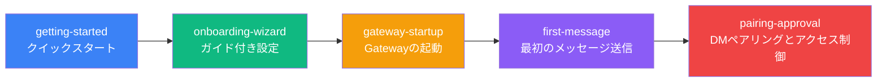

# クイックスタート: インストールから最初のメッセージまで

Clawdbotへようこそ！本章では、ゼロからClawdbotを使用するための完全なフローをご案内します。AIアシスタントを素早く体験したい方も、設定オプションを詳しく知りたい方も、ここに該当するチュートリアルがあります。

---

## 章の概要

本章には5つのチュートリアルが含まれており、Clawdbotの完全な導入フローをカバーしています：ソフトウェアのインストール、AIモデルと通信チャンネルの設定、Gatewayデーモンの起動、最初のメッセージの送信、そしてデフォルトのセキュリティ保護機能についての理解。本章を完了すると、正常に動作するパーソナルAIアシスタントが手に入ります。

---

## 推奨学習パス

以下の順序でチュートリアルを学習することをお勧めします：

**学習順序の説明**：

1. **クイックスタート**（必須）：基本的なインストールと設定を完了させ、これは後続のすべての学習の前提です
2. **ガイド付き設定**（推奨）：ウィザードの各オプションを深く理解し、細かい設定を行いたいユーザーに適しています
3. **Gatewayの起動**（必須）：Gatewayデーモンの起動と管理方法を学習します
4. **最初のメッセージ送信**（必須）：設定が正しいか確認し、AIアシスタントの使用を開始します
5. **DMペアリングとアクセス制御**（推奨）：デフォルトのセキュリティメカニズムを理解し、AIアシスタントを保護します

::: tip クイックチャンネル
素早く体験したいだけの場合は、「クイックスタート」と「Gatewayの起動」の2つのチュートリアルを学習するだけで、メッセージを直接送信できます。その他のチュートリアルは、必要に応じて後で学習できます。
:::

---

## 前提条件

本章を学習する前に、以下を確認してください：

- **Node.js**: ≥ 22.12.0（`node -v` で確認）
- **オペレーティングシステム**: macOS / Linux / Windows (WSL2)
- **パッケージマネージャー**: npm / pnpm / bun
- **AIモデルアカウント**（推奨）：
  - Anthropic Claudeアカウント（Pro/Maxサブスクリプション）、OAuthフロー対応
  - または、OpenAI / DeepSeek / OpenRouterなどのプロバイダーのAPI Keyを準備

::: warning Windowsユーザーへの注意
Windowsでは、**WSL2**の使用を強く推奨します。理由：
- 多くのチャンネルがローカルバイナリファイルに依存している
- デーモン（launchd/systemd）はWindowsでは利用不可
:::

---

## 子ページナビゲーション

### [1. クイックスタート](./getting-started/) ⭐ コアチュートリアル

**学習後にできること**：
- ✅ お使いのデバイスにClawdbotをインストール
- ✅ AIモデル認証を設定（Anthropic / OpenAI / その他プロバイダー）
- ✅ Gatewayデーモンを起動
- ✅ WebChatまたは設定したチャンネルから最初のメッセージを送信

**対象ユーザー**：すべてのユーザー、必読チュートリアル

**予想所要時間**：15-20分

**主な内容**：
- npm/pnpm/bunを使用したClawdbotのインストール
- onboardingウィザードを実行して基本的な設定を完了
- Gatewayを起動し、状態を確認
- CLIまたはチャンネルからテストメッセージを送信

**前提条件**：なし

---

### [2. ガイド付き設定](./onboarding-wizard/)

**学習後にできること**：
- ✅ インタラクティブウィザードを使用して完全な設定を完了
- ✅ QuickStartモードとManualモードの違いを理解
- ✅ Gatewayネットワーク、認証、Tailscaleを設定
- ✅ AIモデルプロバイダーを設定（setup-tokenとAPI Key）
- ✅ 通信チャンネルを有効化（WhatsApp、Telegramなど）
- ✅ スキルパッケージをインストールおよび管理

**対象ユーザー**：細かい設定を行いたいユーザー、高度なオプションを知りたい方

**予想所要時間**：20-30分

**主な内容**：
- QuickStart vs Manualモードの選択
- Gatewayネットワーク設定（ポート、バインディング、認証）
- AIモデル認証方式（setup-token推奨）
- 通信チャンネル設定フロー
- スキルシステムの紹介

**前提条件**：[クイックスタート](./getting-started/)

---

### [3. Gatewayの起動](./gateway-startup/) ⭐ コアチュートリアル

**学習後にできること**：
- ✅ コマンドラインを使用してGatewayフォアグラウンドプロセスを起動
- ✅ Gatewayをバックグラウンドデーモンとして設定（macOS LaunchAgent / Linux systemd / Windows Scheduled Task）
- ✅ 異なるバインディングモード（loopback / LAN / Tailnet）と認証方式を理解
- ✅ 開発モードと本番モードを切り替え
- ✅ `--force`を使用して占有されているポートを強制的に解放

**対象ユーザー**：すべてのユーザー、必読チュートリアル

**予想所要時間**：15-20分

**主な内容**：
- フォアグラウンドモード vs デーモンモード
- バインディングモードの選択（loopback / LAN / Tailnet / Auto）
- 認証方式の設定（Token / Password / Tailscale Identity）
- 開発モード（`--dev`）と本番モード
- サービス管理コマンド（install / start / stop / restart）
- ポート競合の処理（`--force`）

**前提条件**：[ガイド付き設定](./onboarding-wizard/)

---

### [4. 最初のメッセージ送信](./first-message/) ⭐ コアチュートリアル

**学習後にできること**：
- ✅ WebChatインターフェースを通じてメッセージを送信
- ✅ 設定済みのチャンネル（WhatsApp / Telegram / Slackなど）を通じてAIアシスタントと会話
- ✅ メッセージルーティングとレスポンスフローを理解
- ✅ AIアシスタントを使用して基本的なタスクを実行（クエリ、要約、コード生成など）

**対象ユーザー**：すべてのユーザー、必読チュートリアル

**予想所要時間**：10-15分

**主な内容**：
- WebChatインターフェースの使用
- 各チャンネルのメッセージ送信方法
- メッセージフォーマットと返信メカニズム
- 一般的なタスク例（情報クエリ、コード生成、テキスト要約）
- デバッグとトラブルシューティング

**前提条件**：[Gatewayの起動](./gateway-startup/)

---

### [5. DMペアリングとアクセス制御](./pairing-approval/)

**学習後にできること**：
- ✅ デフォルトのDMペアリング保護メカニズムについて理解
- ✅ 不明な送信者からのペアリングリクエストを承認または拒否
- ✅ ホワイトリストとブラックリストを設定
- ✅ アクセス制御ポリシーを設定
- ✅ ペアリングモードとセキュリティのベストプラクティスを理解

**対象ユーザー**：セキュリティを重視するユーザー、推奨学習

**予想所要時間**：10-15分

**主な内容**：
- DMペアリングメカニズムの原理
- ペアリングフローとユーザー体験
- ホワイトリストとブラックリストの設定
- アクセス制御ポリシーの設定
- セキュリティのベストプラクティス

**前提条件**：[最初のメッセージ送信](./first-message/)

---

## よくある質問

### Q: すべてのチュートリアルを学習する必要がありますか？

**A**: 必ずしもそうではありません。素早く導入したいだけの場合は、「クイックスタート」と「Gatewayの起動」の2つのコアチュートリアルを学習するだけで、Clawdbotの使用を開始できます。その他のチュートリアルは、必要に応じて随時学習できます。

### Q: 一部のチュートリアルをスキップすると影響がありますか？

**A**: ありません。各チュートリアルは独立していますが、「クイックスタート」はインストールと基本的な設定を含む基礎となるため、まず学習することをお勧めします。その他のチュートリアルは、ニーズに応じて選択的に学習できます。

### Q: AIアシスタントにすでに慣れているので、基礎チュートリアルをスキップできますか？

**A**: はい、可能です。すでに同様のAIアシスタントツールに慣れている場合は、「クイックスタート」をスキップして、「ガイド付き設定」と「Gatewayの起動」から直接学習し、Clawdbot特有の設定と起動方法を理解できます。

### Q: 本章を学習し終わった後、何ができますか？

**A**: 本章を完了すると、正常に動作するClawdbotシステムを持つことができ、以下が可能になります：
- WebChatまたは複数のチャンネルを通じてAIアシスタントと会話
- AIに基本的なタスクを実行させる（情報クエリ、コード生成、テキスト要約など）
- DMペアリングメカニズムを使用してセキュリティを保護
- 高度な機能（マルチチャンネル設定、ツールシステム、スキルプラットフォームなど）の学習を続ける

---

## 次のステップガイド

本章を完了した後は、以下の学習を続けることができます：

- **[マルチチャンネルシステム概要](../../platforms/channels-overview/)**: Clawdbotがサポートするすべての通信チャンネルとその特徴について
- **[WhatsAppチャンネル](../../platforms/whatsapp/)**: WhatsAppチャンネルの設定と使用について深く学習
- **[Telegramチャンネル](../../platforms/telegram/)**: Telegramチャンネルの設定と使用について深く学習
- **[WebChatインターフェース](../../platforms/webchat/)**: 内蔵のWebChatインターフェース機能について

::: tip ヒント
使用ニーズに応じて、対応するチャンネルを選択して深く学習してください。特定のチャンネル（WhatsAppやTelegramなど）を主に使用する場合は、そのチャンネルの専門チュートリアルを優先的に学習できます。
:::
