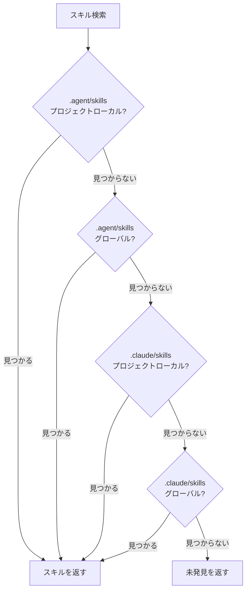

# Universal モード：マルチエージェント環境

## 学習後にできること

- Universal モードの中核的価値と設計目的を理解する
- `--universal` フラグの使用方法を習得する
- `.agent/skills` と `.claude/skills` の違いを理解する
- 4段階検索優先順位ルールを理解する
- マルチエージェント環境でスキルを統合管理し、競合を回避する
- Claude Code、Cursor、Windsurf、Aider など複数エージェントで同一スキルセットを共有する

::: info 前提知識

本チュートリアルは [グローバルインストール vs プロジェクトローカルインストール](../../platforms/global-vs-project/) と [スキルを AGENTS.md に同期](../../start/sync-to-agents/) を理解し、基本的なインストール場所と同期フローを知っていることを前提とします。

:::

---

## 現在の課題

インストールと同期の方法を学んでも：

- **複数エージェント間でスキルを共有するには？**：Claude Code と Cursor を同時に使用しているが、それぞれスキルをインストールするため管理が混乱する
- **Claude Code Marketplace の競合**：スキルをインストールすると、Claude Code ネイティブプラグインマーケットと競合が発生する
- **AGENTS.md 位置の不統一**：異なるエージェントが必要とする AGENTS.md のパスが異なり、メンテナンスが困難
- **スキルの重複インストール**：各エージェントでスキルをインストールする必要があり、ディスクスペースを浪費する

OpenSkills は Universal モードを提供し、マルチエージェント環境のスキル管理問題を解決する。

---

## いつこの方法を使うか

**Universal モードの適用シーン**：

| シーン | Universal モードが必要か | 例 |
| ------ | ------------------------ | ---- |
| **単一エージェント**（Claude Code のみ） | ❌ 不要 | Claude Code のみを使用する場合、デフォルトの `.claude/skills` を直接使用 |
| **マルチエージェント**（Claude Code + その他） | ✅ 必要 | Claude Code と Cursor/Windsurf/Aider を同時に使用 |
| **Marketplace の競合を回避** | ✅ 必要 | Claude Code ネイティブプラグインマーケットとの競合を避けたい |
| **AGENTS.md の統合管理** | ✅ 必要 | 複数エージェントが同じ AGENTS.md ファイルを共有 |

::: tip 推奨事項

- **単一エージェントはデフォルトモード**：Claude Code のみを使用する場合、デフォルトの `.claude/skills` を使用
- **マルチエージェントは Universal モード**：複数エージェントを同時に使用する場合、`--universal` で `.agent/skills` にインストール
- **チームコラボレーションの標準化**：チーム内でどのモードを使用するかを明確に約定し、混乱を防ぐ

:::

---

## コア概念：統合ディレクトリ、マルチエージェント共有

OpenSkills は 2 つのスキルディレクトリモードを提供：

**デフォルトモード（`.claude/skills`）**：
- Claude Code 専用に設計
- Claude Code Marketplace との互換性
- インストール場所：`./.claude/skills/` または `~/.claude/skills/`

**Universal モード（`.agent/skills`）**：
- マルチエージェント環境専用に設計
- Claude Code Marketplace の競合を回避
- インストール場所：`./.agent/skills/` または `~/.agent/skills/`

::: info 重要な概念

**Universal モード**：`--universal` フラグを使用してスキルを `.agent/skills/` ディレクトリにインストールし、複数の AI コーディングエージェント（Claude Code、Cursor、Windsurf、Aider など）が同じスキルセットを共有し、AGENTS.md を通じて統合管理する。

:::

**4 段階検索優先順位**（ソースコード `dirs.ts:18-24`）：

```typescript
export function getSearchDirs(): string[] {
  return [
    join(process.cwd(), '.agent/skills'),   // 1. プロジェクト Universal（最高優先度）
    join(homedir(), '.agent/skills'),        // 2. グローバル Universal
    join(process.cwd(), '.claude/skills'),  // 3. プロジェクト Claude
    join(homedir(), '.claude/skills'),       // 4. グローバル Claude
  ];
}
```

**優先順位の説明**：
1. **Project Universal**（最高）：`.agent/skills/` は `.claude/skills/` より優先される
2. **Global Universal**：次にグローバルの `.agent/skills/` を検索
3. **Project Claude**：次にプロジェクトローカルの `.claude/skills/`
4. **Global Claude**（最低）：最後にグローバルの `.claude/skills/`

---

## 実践ガイド

### ステップ 1：Universal モードでスキルをインストール

**理由**
`--universal` フラグを使用してスキルをインストールする方法を学ぶ。

ターミナルを開き、任意のプロジェクトで実行：

```bash
# Universal モードでスキルをインストール
npx openskills install anthropics/skills --universal -y

# スキルリストを表示
npx openskills list
```

**期待される結果**：スキルリストに `(project)` タグが付いている

```
  codebase-reviewer         (project)
    Review code changes for issues...

Summary: 3 project, 0 global (3 total)
```

**説明**：
- `--universal` フラグを使用すると、スキルは `./.agent/skills/` ディレクトリにインストールされる
- `list` コマンドは `(project)` または `(global)` タグを表示する
- `.agent/skills/` はデフォルトの `.claude/skills/` と競合しない

---

### ステップ 2：スキルインストール場所を確認

**理由**
スキルファイルの実際の格納場所を確認し、Universal モードのディレクトリ構造を理解する。

プロジェクトルートで実行：

```bash
# Universal モードのスキルディレクトリを表示
ls -la .agent/skills/

# スキルディレクトリの内容を表示
ls -la .agent/skills/codebase-reviewer/
```

**期待される結果**：

```
.agent/skills/
├── codebase-reviewer/
│   ├── SKILL.md
│   └── .openskills.json    # インストールメタデータ
├── file-writer/
│   ├── SKILL.md
│   └── .openskills.json
└── ...
```

**説明**：
- Universal モードのスキルは `.agent/skills/` ディレクトリにインストールされる
- 各スキルには独自のディレクトリとメタデータがある
- これはデフォルトの `.claude/skills/` 構造と完全に同じ

---

### ステップ 3：2 つのモードのディレクトリ構造を比較

**理由**
実際の比較を通じて `.claude/skills` と `.agent/skills` の違いを理解する。

以下のコマンドを実行：

```bash
# 2 つのモードのスキルディレクトリを表示
echo "=== .claude/skills (デフォルトモード) ==="
ls -la .claude/skills/ 2>/dev/null || echo "ディレクトリが存在しません"

echo "=== .agent/skills (Universal モード) ==="
ls -la .agent/skills/

# グローバルインストールのディレクトリを表示
echo "=== ~/.claude/skills (グローバルデフォルト) ==="
ls -la ~/.claude/skills/ 2>/dev/null || echo "ディレクトリが存在しません"

echo "=== ~/.agent/skills (グローバル Universal) ==="
ls -la ~/.agent/skills/ 2>/dev/null || echo "ディレクトリが存在しません"
```

**期待される結果**：

```
=== .claude/skills (デフォルトモード) ===
ディレクトリが存在しません

=== .agent/skills (Universal モード) ===
codebase-reviewer
file-writer

=== ~/.claude/skills (グローバルデフォルト) ===
git-helper
test-generator

=== ~/.agent/skills (グローバル Universal) ===
ディレクトリが存在しません
```

**説明**：
- `.claude/skills/` と `.agent/skills/` は 2 つの独立したディレクトリ
- 同時に存在でき、相互に干渉しない
- プロジェクトローカルとグローバルの両方のインストール方式をサポート

---

### ステップ 4：グローバル Universal インストール

**理由**
グローバルに Universal スキルをインストールする方法を理解し、すべてのプロジェクトに提供する。

実行：

```bash
# グローバル Universal インストール
npx openskills install anthropics/skills --universal --global -y

# スキルリストを表示
npx openskills list
```

**期待される結果**：

```
  codebase-reviewer         (project)
    Review code changes for issues...
  file-writer              (global)
    Write files with format...

Summary: 1 project, 2 global (3 total)
```

**説明**：
- `--universal` と `--global` は組み合わせて使用できる
- `~/.agent/skills/` ディレクトリにインストールされる
- すべてのプロジェクトでこれらのスキルを使用できる

---

### ステップ 5：4 段階検索優先順位を検証

**理由**
OpenSkills が 4 つのディレクトリでスキルを検索する方法を理解する。

実行：

```bash
# 4 つの位置に同名スキル（異なるバージョン）をインストール
# 1. Project Universal
npx openskills install anthropics/skills --universal -y
# 2. Global Universal
npx openskills install anthropics/skills --universal --global -y
# 3. Project Claude
npx openskills install anthropics/skills -y
# 4. Global Claude
npx openskills install anthropics/skills --global -y

# スキルを読み取り（Project Universal バージョンが優先される）
npx openskills read codebase-reviewer | head -5
```

**期待される結果**：`.agent/skills/`（Project Universal）バージョンのスキル内容が出力される。

**検索優先順位の可視化**：



**説明**：
- `.agent/skills/` は `.claude/skills/` より優先される
- プロジェクトローカルはグローバルより優先される
- 同名スキルが存在する場合、Project Universal バージョンが優先される
- これにより「Universal 優先」の柔軟な設定が実現される

---

### ステップ 6：Claude Code Marketplace の競合を回避

**理由**
Universal モードが Claude Code Marketplace の競合をどのように解決するかを理解する。

実行：

```bash
# Universal モードでスキルをインストール
npx openskills install anthropics/skills --universal -y

# AGENTS.md に同期
npx openskills sync

# AGENTS.md を確認
cat AGENTS.md
```

**期待される結果**：AGENTS.md にスキルリストが含まれ、Claude Code Marketplace と競合しない。

**説明**：
- Universal モードは `.agent/skills/` を使用し、Claude Code の `.claude/skills/` とは分離される
- OpenSkills でインストールしたスキルと Claude Code Marketplace プラグインの競合を回避
- 複数エージェントが同じ AGENTS.md を共有し、統合管理できる

---

## チェックポイント ✅

以下のチェックを完了し、本課の内容を習得したことを確認してください：

- [ ] `.claude/skills` と `.agent/skills` の 2 つのモードを区別できる
- [ ] `--universal` フラグの役割を知っている
- [ ] 4段階検索優先順位ルールを理解している
- [ ] シーンに応じて適切なインストールモードを選択できる
- [ ] マルチエージェント環境でスキルを統合管理する方法を知っている
- [ ] Universal モードが Marketplace の競合をどのように回避するかを理解している

---

## よくある落とし穴

### よくある間違い 1：単一エージェントで Universal モードを誤用

**間違ったシーン**：Claude Code のみを使用しているが、Universal モードを使用した

```bash
# ❌ 間違い：単一エージェントは Universal モードを必要としない
npx openskills install anthropics/skills --universal
```

**問題**：
- 不要な複雑さが増加する
- Claude Code Marketplace プラグインと連携できない
- AGENTS.md の位置が Claude Code の期待と一致しない可能性がある

**正しい方法**：

```bash
# ✅ 正しい：単一エージェントはデフォルトモードを使用
npx openskills install anthropics/skills
```

---

### よくある間違い 2：マルチエージェントで Universal モードを未使用

**間違ったシーン**：複数エージェントを同時に使用しているが、Universal モードを使用していない

```bash
# ❌ 間違い：各エージェントが独立してスキルをインストールし、管理が混乱
npx openskills install anthropics/skills  # Claude Code 用
npx openskills install anthropics/skills --global  # Cursor 用
```

**問題**：
- スキルが重複してインストールされ、ディスクスペースを浪費
- 異なるエージェントが使用するスキルバージョンが一致しない可能性がある
- AGENTS.md を個別にメンテナンスする必要がある

**正しい方法**：

```bash
# ✅ 正しい：マルチエージェントは Universal モードで統合管理
npx openskills install anthropics/skills --universal
# すべてのエージェントが同一スキルセットと AGENTS.md を共有
```

---

### よくある間違い 3：Universal モードの検索優先順位を忘れる

**間違ったシーン**：`.claude/skills` と `.agent/skills` の両方に同名スキルをインストールしたが、`.claude/skills` バージョンを使用したい

```bash
# .agent/skills と .claude/skills の両方に codebase-reviewer がある
# しかし .claude/skills バージョンを使用したい
npx openskills install anthropics/skills --universal  # .agent/skills に新版をインストール
npx openskills install anthropics/skills  # .claude/skills に旧版をインストール
npx openskills read codebase-reviewer  # ❌ 依然として .agent/skills バージョンを読み込む
```

**問題**：
- `.agent/skills` は `.claude/skills` より優先度が高い
- `.claude/skills` に新版がインストールされていても、依然として `.agent/skills` バージョンを読み込む

**正しい方法**：

```bash
# 方法 1：.agent/skills バージョンを削除
npx openskills remove codebase-reviewer  # .agent/skills バージョンを削除
npx openskills read codebase-reviewer  # ✅ 現在 .claude/skills バージョンを読み込む

# 方法 2：.agent/skills バージョンを更新
npx openskills update codebase-reviewer  # .agent/skills バージョンを更新
```

---

### よくある間違い 4：AGENTS.md パス構成エラー

**間違ったシーン**：複数エージェントが必要とする AGENTS.md パスが異なる

```bash
# Claude Code はルートディレクトリに AGENTS.md を期待
# Cursor は .cursor/ ディレクトリに AGENTS.md を期待
# Windsurf は .windsurf/ ディレクトリに AGENTS.md を期待
npx openskills sync  # 1 つの AGENTS.md のみを生成
```

**問題**：
- 異なるエージェントが AGENTS.md を見つけられない
- スキル読み込みに失敗する

**正しい方法**：

```bash
# 異なるエージェントのために異なる位置に AGENTS.md を生成
npx openskills sync -o AGENTS.md           # Claude Code
npx openskills sync -o .cursor/AGENTS.md    # Cursor
npx openskills sync -o .windsurf/AGENTS.md  # Windsurf
```

---

## 本課のまとめ

**コアポイント**：

1. **Universal モードはマルチエージェント環境用**：`--universal` で `.agent/skills/` にインストール
2. **4段階検索優先順位**：Project Universal > Global Universal > Project Claude > Global Claude
3. **Marketplace の競合を回避**：`.agent/skills/` は Claude Code の `.claude/skills/` から分離
4. **統合 AGENTS.md 管理**：複数エージェントが同じ AGENTS.md ファイルを共有
5. **推奨原則**：単一エージェントはデフォルトモード、マルチエージェントは Universal モード

**意思決定フロー**：

```
[スキルインストールが必要] → [複数エージェントを使用するか？]
                      ↓ はい
              [Universal モードを使用（--universal）]
                      ↓ いいえ
              [Claude Code のみを使用するか？]
                      ↓ はい
              [デフォルトモードを使用（.claude/skills）]
                      ↓ いいえ
              [具体的なエージェントドキュメントを参照し、適切なモードを選択]
```

**記憶のコツ**：

- **単一エージェント**：デフォルトモードが最もシンプル、Claude Code は `.claude` を使用
- **マルチエージェント**：Universal モードで統合管理、`.agent/skills` で競合を回避

---

## 次のレッスン予告

> 次のレッスンでは **[カスタム出力パス](../custom-output-path/)** を学習します。
>
> 学べること：
> - `--output/-o` フラグを使用して AGENTS.md 出力パスをカスタマイズする方法
> - 異なるエージェントのために異なる位置に AGENTS.md を生成する方法
> - CI/CD 環境でカスタム出力パスを使用する方法
> - 既存のドキュメントシステムへの統合方法

---

## 付録：ソースコード参照

<details>
<summary><strong>クリックしてソースコード位置を表示</strong></summary>

> 更新日時：2026-01-24

| 機能        | ファイルパス                                                                                          | 行号    |
|--- | --- | ---|
| ディレクトリパスツール | [`src/utils/dirs.ts`](https://github.com/numman-ali/openskills/blob/main/src/utils/dirs.ts#L7-L25)     | 7-25    |
| インストール位置判定 | [`src/commands/install.ts`](https://github.com/numman-ali/openskills/blob/main/src/commands/install.ts#L84-L92) | 84-92   |
| コマンドライン引数定義 | [`src/cli.ts`](https://github.com/numman-ali/openskills/blob/main/src/cli.ts#L48)                    | 48      |

**重要な定数**：
- `.claude/skills`：デフォルトスキルディレクトリ（Claude Code 互換）
- `.agent/skills`：汎用スキルディレクトリ（マルチエージェント環境）

**重要な関数**：
- `getSkillsDir(projectLocal, universal)`：フラグに基づいてスキルディレクトリパスを返す
- `getSearchDirs()`：スキル検索ディレクトリリストを返す（4段階優先順位）

**ビジネスルール**：
- Universal モードは `.agent/skills/` ディレクトリを使用
- 4段階検索優先順位：Project Universal > Global Universal > Project Claude > Global Claude
- `--universal` と `--global` は組み合わせて使用可能

</details>
