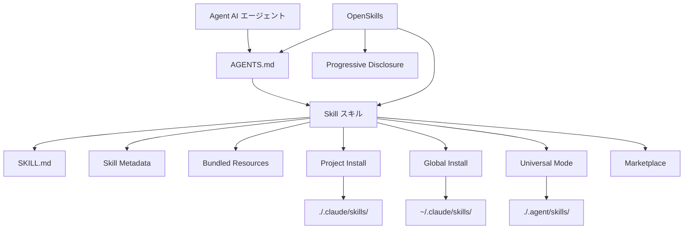

# 用語集

本用語集は OpenSkills と AI スキルシステムの重要なコンセプトを説明し、専門用語を素早く理解できるようにします。

::: info ヒント
本用語集はアルファベット順に並べられており、用語間の関連性は定義内に記載されています。
:::

---

## A

### Agent（AI エージェント）

**定義**：AI エージェントとは、コーディングタスクを実行できる AI ツールのことで、Claude Code、Cursor、Windsurf、Aider などがあります。

**特徴**：
- `AGENTS.md` 設定ファイルを読み取ることができます
- SKILL.md 形式のスキル読み込みをサポートします
- コマンドライン経由で外部ツールを呼び出すことができます（例：`npx openskills read`）

**OpenSkills での役割**：OpenSkills は、AGENTS.md の読み取りをサポートする任意のエージェントで Anthropic のスキル形式を使用できるようにします。

**関連用語**：[Skill](#skill)、[AGENTS.md](#agentsmd)

---

## B

### Base Directory（ベースディレクトリ）

**定義**：スキル内の相対パス参照を解決するための、スキルディレクトリの完全なパス。

**役割**：
- スキルディレクトリの絶対パスを提供します
- `references/`、`scripts/`、`assets/` などのバンドルリソースの相対パスを解決するために使用されます

**例**：
```
Base directory: /path/to/my-first-skill
```

スキルが `references/skill-format.md` を参照する場合、実際には以下のように解決されます：
```
/path/to/my-first-skill/references/skill-format.md
```

**関連用語**：[Skill](#skill)、[Bundled Resources](#bundled-resources)

---

### Bundled Resources（バンドルリソース）

**定義**：スキルディレクトリに付属するリソースファイルで、スキルの実行に必要な詳細情報やツールを提供します。

**タイプ**：
- **`references/`** - 参考ドキュメント、API ドキュメントなど
- **`scripts/`** - 実行可能なスクリプトファイル
- **`assets/`** - テンプレート、サンプルファイルなど

**用途**：
- 詳細なドキュメントを `references/` に移動し、SKILL.md を簡潔に保ちます
- 実行可能なコードを `scripts/` に配置し、呼び出しを容易にします
- テンプレートとサンプルを `assets/` に配置し、ユーザーが参照できるようにします

**例**：
```
my-skill/
├── SKILL.md
├── references/
│   └── api-docs.md
├── scripts/
│   └── helper.py
└── assets/
    └── template.json
```

**関連用語**：[Skill](#skill)、[SKILL.md](#skillmd)

---

## G

### Global Install（グローバルインストール）

**定義**：スキルをユーザーホームディレクトリの `.claude/skills` ディレクトリにインストールし、すべてのプロジェクトからそのスキルにアクセスできるようにします。

**コマンド例**：
```bash
npx openskills install anthropics/skills --global
```

**ターゲットパス**：
- macOS/Linux: `~/.claude/skills/`
- Windows: `%USERPROFILE%\.claude\skills\`

**適用シナリオ**：
- 複数のプロジェクトで同じスキルを使用したい場合
- スキルをプロジェクトリポジトリのバージョン管理に含めたくない場合

**優先度**：スキルを検索する際、グローバルインストールはプロジェクトローカルインストールよりも優先度が低くなります（[スキル検索優先度](#skill-検索優先度)を参照）。

**関連用語**：[Project Install](#project-install)、[スキル検索優先度](#skill-検索優先度)

---

## M

### Marketplace（マーケットプレイス）

**定義**：スキルを公開・発見するための GitHub リポジトリ。

**Anthropic Marketplace**：
- 公式スキルリポジトリ：`anthropics/skills`
- 公式が保守するスキル（pdf、git-workflow、skill-creator など）を提供しています

**サードパーティマーケットプレイス**：
- 任意の GitHub リポジトリをスキルソースとして使用できます
- プライベートリポジトリもサポートされています

**マーケットプレイスからインストール**：
```bash
# Anthropic 公式マーケットプレイスからインストール
npx openskills install anthropics/skills

# サードパーティリポジトリからインストール
npx openskills install your-org/your-skills

# プライベートリポジトリからインストール
npx openskills install git@github.com:your-org/private-skills.git
```

**関連用語**：[Skill](#skill)、[Global Install](#global-install)

---

## O

### OpenSkills

**定義**：OpenSkills は Anthropic スキルシステムのユニバーサルローダーであり、任意の AI コーディングエージェントが標準的な SKILL.md 形式のスキルを使用できるようにします。

**コアバリュー**：
- **統一された標準** - すべてのエージェントが同じスキル形式と AGENTS.md 記述を使用します
- **プログレッシブローディング** - 必要に応じてスキルを読み込み、コンテキストを簡潔に保ちます
- **マルチエージェントサポート** - 1セットのスキルで複数のエージェントにサービスを提供します
- **オープンソースフレンドリー** - ローカルパスとプライベート git リポジトリをサポートします
- **高い互換性** - Claude Code 形式と完全に互換性があります

**主なコマンド**：
- `install` - スキルをインストールします
- `list` - インストール済みスキルを一覧表示します
- `read` - スキル内容を読み込みます（AI エージェント向け）
- `sync` - AGENTS.md にスキルを同期します
- `update` - インストール済みスキルを更新します
- `manage` / `remove` - スキルを削除します

**公式リポジトリ**：https://github.com/numman-ali/openskills

**関連用語**：[Skill](#skill)、[SKILL.md](#skillmd)、[AGENTS.md](#agentsmd)

---

## P

### Progressive Disclosure（プログレッシブローディング）

**定義**：実際に必要な場合にのみスキルを読み込み、すべてのスキルを一度に読み込むことによるコンテキストの肥大化を回避します。

**動作原理**：
1. スキル情報は簡潔な説明として AGENTS.md に保存されます
2. ユーザーがタスクを要求すると、AI エージェントが一致するスキルがあるか確認します
3. 一致するスキルがある場合、`npx openskills read <skill-name>` 経由で完全なスキル内容を読み込みます
4. スキル内容は現在のタスクコンテキストでのみ有効です

**メリット**：
- AI エージェントのコンテキストを簡潔に保ちます
- Token 使用量を削減します
- レスポンス速度を向上させます

**例**：
```xml
<!-- AGENTS.md には簡潔な説明のみが含まれます -->
<available_skills>
  <skill>
    <name>pdf</name>
    <description>Comprehensive PDF manipulation toolkit...</description>
  </skill>
</available_skills>

<!-- ユーザーが PDF 処理を要求したときのみ完全な内容を読み込みます -->
npx openskills read pdf
```

**関連用語**：[AGENTS.md](#agentsmd)、[Skill](#skill)

---

### Project Install（プロジェクトローカルインストール）

**定義**：スキルをプロジェクトディレクトリの `.claude/skills` または `.agent/skills` ディレクトリにインストールし、スキルをプロジェクトリポジトリのバージョン管理に含めます。

**コマンド例**：
```bash
# プロジェクトローカルインストール（デフォルト）
npx openskills install anthropics/skills

# .agent/skills にプロジェクトローカルインストール（ユニバーサルモード）
npx openskills install anthropics/skills --universal
```

**ターゲットパス**：
- デフォルト：`./.claude/skills/`
- ユニバーサルモード：`./.agent/skills/`

**適用シナリオ**：
- プロジェクトで特定のスキルが必要な場合
- スキルをプロジェクトリポジトリのバージョン管理に含めたい場合
- チームコラボレーションでスキルバージョンを統一したい場合

**優先度**：スキルを検索する際、プロジェクトローカルインストールはグローバルインストールよりも優先度が高くなります（[スキル検索優先度](#skill-検索優先度)を参照）。

**関連用語**：[Global Install](#global-install)、[Universal Mode](#universal-mode)、[スキル検索優先度](#skill-検索優先度)

---

## S

### Skill（スキル）

**定義**：特定のタスク実行ガイダンスを AI エージェントに提供するドキュメントで、詳細な指示、ステップ、バンドルリソースが含まれます。

**コア特徴**：
- **静的指示** - テキストとリソースのみを含み、動的ロジックは含みません
- **コンポーザブル** - 複数のスキルを組み合わせて使用できます
- **バージョン管理可能** - プロジェクトリポジトリで管理できます

**スキル構成**：
```
skill-name/
├── SKILL.md              # スキルメインファイル
├── .openskills.json      # インストールメタデータ（自動生成）
├── references/           # 参考ドキュメント（オプション）
├── scripts/             # 実行可能スクリプト（オプション）
└── assets/              # テンプレートとサンプル（オプション）
```

**使用シナリオ**：
- ユーザーがタスクを要求すると、AI エージェントが一致するスキルがあるか確認します
- 一致するスキルがある場合、`npx openskills read <name>` 経由でスキルを読み込みます
- AI エージェントがスキル指示に従ってタスクを完了します

**スキルの例**：
- `pdf` - PDF 処理ツール
- `git-workflow` - Git ワークフロー
- `check-branch-first` - ブランチチェック

**関連用語**：[SKILL.md](#skillmd)、[Bundled Resources](#bundled-resources)、[Agent](#agent)

---

### Skill Metadata（スキルメタデータ）

**定義**：スキルのインストール元情報を記録する JSON ファイル（`.openskills.json`）で、スキル更新をサポートします。

**ファイルの場所**：スキルディレクトリ内の `.openskills.json`

**フィールドの説明**：
```json
{
  "source": "anthropics/skills",
  "sourceType": "github",
  "repoUrl": "https://github.com/anthropics/skills",
  "subpath": "skills/pdf",
  "installedAt": "2025-01-24T10:30:00.000Z"
}
```

**役割**：
- スキルのソース（GitHub、ローカルパスなど）を記録します
- `openskills update` コマンドでソースからスキルを更新できるようにします
- 更新が必要だがソースが記録されていないスキルを識別します

**関連用語**：[Skill](#skill)、[Global Install](#global-install)、[Project Install](#project-install)

---

### スキル検索優先度

**定義**：OpenSkills がスキルを検索する際、固定された優先度順序で複数のディレクトリを検索します。

**優先度順序**（高い順から低い順）：

| 優先度 | ディレクトリ           | インストール方式       | 適用シナリオ                   |
|--- | --- | --- | ---|
| 1     | `./.agent/skills/`   | `--universal`      | マルチエージェント環境、Claude Code との競合を回避 |
| 2     | `~/.agent/skills/`   | `--universal --global` | マルチエージェント環境のグローバルスキル         |
| 3     | `./.claude/skills/`  | デフォルト（プロジェクトローカル）   | プロジェクトローカルスキル（デフォルト選択）      |
| 4     | `~/.claude/skills/`   | `--global`         | グローバルスキル                     |

**検索ルール**：
- 優先度順序で検索します
- 最初に見つかった一致するスキルで停止します
- プロジェクトローカルスキルは同名のグローバルスキルを上書きします

**例**：
```bash
# "pdf" という名前のスキルを検索する
# 1. 最初に ./.agent/skills/pdf をチェック
# 2. 次に ~/.agent/skills/pdf をチェック
# 3. 次に ./.claude/skills/pdf をチェック
# 4. 最後に ~/.claude/skills/pdf をチェック
```

**関連用語**：[Project Install](#project-install)、[Global Install](#global-install)、[Universal Mode](#universal-mode)

---

### SKILL.md

**定義**：スキルの標準形式ファイルで、YAML frontmatter と Markdown コンテンツを使用してスキルのメタデータと指示を定義します。

**ファイル形式**：
```markdown
---
name: my-skill
description: When to use this skill
---

# Skill Instructions

Detailed instructions for the AI agent...

## Bundled Resources

See `references/skill-format.md` for details.
```

**必須フィールド**：
- `name` - スキル名（一意識別子）
- `description` - スキル説明（AGENTS.md に表示されます）

**オプションフィールド**：
- `context` - コンテキストヒント（AI エージェントがスキルを使用する方法をガイドします）

**ベストプラクティス**：
- 祈使句/不定詞を使用する：`"To do X, execute Y"`
- 第二人称を使用しない：`"You should..." と書かないでください`
- 5,000 文字以内に収める
- 詳細なコンテンツを `references/` ディレクトリに移動する

**関連用語**：[Skill](#skill)、[AGENTS.md](#agentsmd)、[Bundled Resources](#bundled-resources)

---

## U

### Universal Mode（ユニバーサルモード）

**定義**：マルチエージェント環境でのインストールモードで、スキルを `.agent/skills/` ディレクトリにインストールし、Claude Code の Marketplace との競合を回避します。

**コマンド例**：
```bash
npx openskills install anthropics/skills --universal
```

**ターゲットパス**：`./.agent/skills/` または `~/.agent/skills/`（`--global` と組み合わせ）

**適用シナリオ**：
- Claude Code と他の AI エージェント（Cursor、Windsurf など）を同時に使用する場合
- すべてのエージェントで同じスキルセットを共有したい場合
- スキルのインストール競合を回避したい場合

**検索優先度**：ユニバーサルモードでインストールされたスキルは優先度が最も高くなります（[スキル検索優先度](#skill-検索優先度)を参照）。

**関連用語**：[Project Install](#project-install)、[スキル検索優先度](#skill-検索優先度)

---

## A

### AGENTS.md

**定義**：AI エージェントが読み取る設定ファイルで、利用可能なスキルリストと使用説明が含まれ、XML 形式を使用します。

**ファイルの場所**：プロジェクトルートディレクトリまたはユーザー定義パス（デフォルトはプロジェクトルート）

**ファイル形式**：
```xml
<skills_system priority="1">

## Available Skills

<!-- SKILLS_TABLE_START -->
<usage>
When users ask you to perform tasks, check if any of the available skills below can help complete the task more effectively.

How to use skills:
- Invoke: `npx openskills read <skill-name>` (run in your shell)
- The skill content will load with detailed instructions
- Base directory provided in output for resolving bundled resources
</usage>

<available_skills>

<skill>
<name>pdf</name>
<description>Comprehensive PDF manipulation toolkit...</description>
<location>project</location>
</skill>

</available_skills>
<!-- SKILLS_TABLE_END -->

</skills_system>
```

**役割**：
- 利用可能なスキルリストを宣言します
- スキル使用説明を提供します
- スキル更新時にカスタムコンテンツを保持できます

**生成方法**：
```bash
npx openskills sync
```

**更新方法**：
```bash
# AGENTS.md を再生成（既存のコンテンツは上書きされます）
npx openskills sync -y

# カスタムファイルに出力
npx openskills sync -o custom-agents.md
```

**関連用語**：[OpenSkills](#openskills)、[Skill](#skill)、[Progressive Disclosure](#progressive-disclosure)

---

## 用語関係図

コア用語間の関連関係は以下の通りです：



---

## 次のレッスン予告

> 用語集は以上です。OpenSkills のコアコンセプトを理解しました。
>
> 次に以下のことができます：
> - [クイックスタート](../../start/quick-start/) に戻ってインストールと使用を実際に体験する
> - [CLI API リファレンス](../cli-api/) を参照して完全なコマンドを確認する
> - [トラブルシューティング](../../faq/troubleshooting/) を読んで一般的な問題を解決する

---

## 付録：ソースコード参照

<details>
<summary><strong>クリックしてソースコードの場所を展開</strong></summary>

> 更新日：2026-01-24

| 用語/機能            | ファイルパス                                                                 | 行番号    |
|--- | --- | ---|
| Skill タイプ定義       | [`src/types.ts`](https://github.com/numman-ali/openskills/blob/main/src/types.ts#L1-L6) | 1-6     |
| SkillLocation タイプ   | [`src/types.ts`](https://github.com/numman-ali/openskills/blob/main/src/types.ts#L8-L12) | 8-12    |
| InstallOptions タイプ  | [`src/types.ts`](https://github.com/numman-ali/openskills/blob/main/src/types.ts#L14-L18) | 14-18   |
| SkillMetadata タイプ   | [`src/types.ts`](https://github.com/numman-ali/openskills/blob/main/src/types.ts#L20-L24) | 20-24   |
| スキル検索ロジック        | [`src/utils/skills.ts`](https://github.com/numman-ali/openskills/blob/main/src/utils/skills.ts) | 全文    |
| ディレクトリパス計算        | [`src/utils/dirs.ts`](https://github.com/numman-ali/openskills/blob/main/src/utils/dirs.ts) | 全文    |
| AGENTS.md 生成       | [`src/utils/agents-md.ts`](https://github.com/numman-ali/openskills/blob/main/src/utils/agents-md.ts) | 全文    |
| Skill Metadata 读写  | [`src/utils/skill-metadata.ts`](https://github.com/numman-ali/openskills/blob/main/src/utils/skill-metadata.ts) | 全文    |

**重要な定数**：
- なし（ロジックはパラメータとディレクトリ計算に基づいています）

**重要な関数**：
- `findAllSkills()` - すべてのインストール済みスキルを検索します
- `findSkill(name)` - 指定されたスキルを検索します（優先度順）
- `getSkillsDir(options)` - スキルインストールディレクトリを計算します
- `generateSkillsXml(skills)` - AGENTS.md XML コンテンツを生成します

</details>
