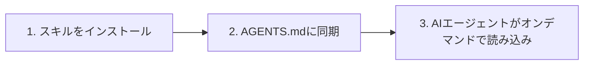

# OpenSkillsクイックスタート：5分でAIスキルシステムを始めよう

## 学習後の達成目標

このレッスンを完了すると、以下のことができるようになります：

- 5分以内にOpenSkillsのインストールと最初のスキルのデプロイを完了する
- `openskills install`と`openskills sync`コマンドを使用してスキルを管理する
- AIエージェント（Claude Code、Cursor、Windsurfなど）にインストールしたスキルを認識・使用させる
- OpenSkillsの核心的価値（統一されたスキルフォーマット、漸進的な読み込み、マルチエージェント対応）を理解する

## 現在の課題

以下の問題に直面したことはありませんか？

- **スキルがエージェント間で再利用できない**：Claude CodeのスキルをCursorやWindsurfで再利用できない
- **コンテキストの爆発**：スキルをロードしすぎるとAIエージェントのトークン消費が急増する
- **スキルフォーマットの混乱**：異なるエージェントが異なるスキル定義を使用しており、学習コストが高い
- **プライベートスキルが共有できない**：社内のスキルをチームメンバーに簡単に配布できない

OpenSkillsはこれらの問題を解決します。

## いつ使用すべきか

以下の状況で使用すると効果的です：

- AIコーディングエージェントに専用スキル（PDF処理、Gitワークフロー、コードレビューなど）をインストールする場合
- 複数のAIエージェント間でスキル管理を統一する場合
- プライベートまたはカスタムのスキルリポジトリを使用する場合
- AIがオンデマンドでスキルを読み込み、コンテキストを簡潔に保ちたい場合

## 🎒 開始前の準備

::: warning 事前チェック

開始前に、以下を確認してください：

1. **Node.js 20.6以降のバージョン**
   ```bash
   node --version
   ```
   出力に`v20.6.0`以降が表示される必要があります

2. **Gitがインストールされていること**（GitHubリポジトリからスキルをクローンするため）
   ```bash
   git --version
   ```

:::

## 核心概念

OpenSkillsの動作原理は以下の3ステップで概括できます：



### ステップ1：スキルをインストール

`openskills install`を使用して、GitHub、ローカルパス、またはプライベートリポジトリからスキルをインストールします。スキルはプロジェクトの`.claude/skills/`ディレクトリにコピーされます。

### ステップ2：AGENTS.mdに同期

`openskills sync`を使用してAGENTS.mdファイルを生成します。このファイルにはスキルリストのXMLマークアップが含まれ、AIエージェントが利用可能なスキルを把握するために読み取ります。

### ステップ3：AIエージェントがオンデマンドで読み込み

ユーザーが特定のタスクを要求すると、AIエージェントは`npx openskills read <skill-name>`を使用して対応するスキルコンテンツを動的に読み込みます。すべてのスキルを一度に読み込むわけではありません。

::: info なぜ「漸進的読み込み」なのか？

従来の方式：すべてのスキルを事前にコンテキストに読み込む → トークン消費が大きく、応答が遅い
OpenSkills：オンデマンドで読み込む → 必要なスキルのみを読み込む → コンテキストが簡潔で、応答が速い

:::

---

## 実践してみよう

では、インストールから使用までのフローをステップバイステップで進めていきましょう。

### ステップ1：プロジェクトディレクトリに移動

まず、開発中のプロジェクトディレクトリに移動します：

```bash
cd /path/to/your/project
```

**なぜこれが必要なのか**

OpenSkillsはデフォルトでスキルをプロジェクトの`.claude/skills/`ディレクトリにインストールします。これにより、スキルはプロジェクトのバージョン管理に含まれ、チームメンバーと共有できます。

**期待される状態**：

プロジェクトディレクトリには以下のいずれかが含まれている必要があります：

- `.git/`（Gitリポジトリ）
- `package.json`（Node.jsプロジェクト）
- その他のプロジェクトファイル

::: tip 推奨される方法

新しいプロジェクトでも、まずGitリポジトリを初期化することをお勧めします。これにより、スキルファイルをより適切に管理できます。

:::

---

### ステップ2：最初のスキルをインストール

以下のコマンドを使用して、Anthropic公式スキルリポジトリからスキルをインストールします：

```bash
npx openskills install anthropics/skills
```

**なぜこれが必要なのか**

`anthropics/skills`はAnthropicが公式にメンテナンスしているスキルリポジトリで、高品質なスキルの例が含まれており、初めての体験に最適です。

**期待される状態**：

コマンドを実行すると、対話的な選択画面が表示されます：

```
? Select skills to install: (Press <space> to select, <a> to toggle all, <i> to invert selection, and <enter> to proceed)
❯ ◉ pdf                 Comprehensive PDF manipulation toolkit for extracting text and tables...
  ◯ check-branch-first  Git workflow: Always check current branch before making changes...
  ◯ git-workflow        Git workflow: Best practices for commits, branches, and PRs...
  ◯ skill-creator       Guide for creating effective skills...
```

スペースキーを使用してインストールするスキルを選択し、Enterキーを押して確定します。

::: tip ヒント

初めは1〜2個のスキル（`pdf`や`git-workflow`など）だけを選択することをお勧めします。フローに慣れたら、さらにインストールしてください。

:::

**期待される状態**（インストール成功後）：

```
✓ Installed: pdf
✓ Installed: git-workflow

Skills installed to: /path/to/your/project/.claude/skills/

Next steps:
  Run: npx openskills sync
  This will update AGENTS.md with your installed skills
```

---

### ステップ3：スキルをAGENTS.mdに同期

次に、同期コマンドを実行します：

```bash
npx openskills sync
```

**なぜこれが必要なのか**

`sync`コマンドはAGENTS.mdファイルを生成します。このファイルにはスキルリストのXMLマークアップが含まれ、AIエージェントが利用可能なスキルを把握するために読み取ります。

**期待される状態**：

```
? Select skills to sync: (Press <space> to select, <a> to toggle all, <i> to invert selection, and <enter> to proceed)
❯ ◉ pdf                 [project]
  ◯ git-workflow        [project]
```

同じくスペースキーを使用して同期するスキルを選択し、Enterキーを押して確定します。

**期待される状態**（同期成功後）：

```
✓ Synced: pdf
✓ Synced: git-workflow

Updated: AGENTS.md
```

---

### ステップ4：AGENTS.mdファイルを確認

生成されたAGENTS.mdファイルを確認します：

```bash
cat AGENTS.md
```

**期待される状態**：

```xml
<skills_system priority="1">

## Available Skills

<!-- SKILLS_TABLE_START -->
<usage>
When users ask you to perform tasks, check if any of available skills below can help complete task more effectively.

How to use skills:
- Invoke: `npx openskills read <skill-name>` (run in your shell)
- The skill content will load with detailed instructions
- Base directory provided in output for resolving bundled resources

Usage notes:
- Only use skills listed in <available_skills> below
- Do not invoke a skill that is already loaded in your context
</usage>

<available_skills>

<skill>
<name>pdf</name>
<description>Comprehensive PDF manipulation toolkit for extracting text and tables...</description>
<location>project</location>
</skill>

<skill>
<name>git-workflow</name>
<description>Git workflow: Best practices for commits, branches, and PRs...</description>
<location>project</location>
</skill>

</available_skills>
<!-- SKILLS_TABLE_END -->

</skills_system>
```

---

### ステップ5：インストール済みのスキルを確認

`list`コマンドを使用して、インストール済みのスキルを確認します：

```bash
npx openskills list
```

**期待される状態**：

```
Installed Skills:

pdf              [project]
  Comprehensive PDF manipulation toolkit for extracting text and tables...

git-workflow     [project]
  Git workflow: Best practices for commits, branches, and PRs...

Total: 2 skills (project: 2, global: 0)
```

**期待される状態**（説明）：

- スキル名が左側に表示されます
- `[project]`タグはプロジェクトローカルにインストールされたスキルであることを示します
- スキルの説明が下部に表示されます

---

## チェックポイント ✅

上記の手順を完了したら、以下を確認してください：

- [ ] `.claude/skills/`ディレクトリが作成され、インストールしたスキルが含まれている
- [ ] `AGENTS.md`ファイルが生成され、スキルリストのXMLマークアップが含まれている
- [ ] `openskills list`を実行すると、インストール済みのスキルが表示される

すべてのチェックが通れば、おめでとうございます！OpenSkillsのインストールと設定が正常に完了しました。

---

## よくある問題

### 問題1：`npx`コマンドが見つからない

**エラーメッセージ**：

```
command not found: npx
```

**原因**：Node.jsがインストールされていないか、PATHに設定されていない

**解決方法**：

1. Node.jsを再インストールする（[nvm](https://github.com/nvm-sh/nvm)を使用してNode.jsバージョンを管理することを推奨）
2. インストール後にターミナルを再起動する

---

### 問題2：インストール時にネットワークタイムアウト

**エラーメッセージ**：

```
Error: git clone failed
```

**原因**：GitHubへのアクセスが制限されているか、ネットワークが不安定

**解決方法**：

1. ネットワーク接続を確認する
2. プロキシを設定する（必要な場合）：
   ```bash
   git config --global http.proxy http://proxy.example.com:8080
   ```
3. ミラーソースを使用する（利用可能な場合）

---

### 問題3：権限エラー

**エラーメッセージ**：

```
Error: EACCES: permission denied
```

**原因**：ターゲットディレクトリに書き込み権限がない

**解決方法**：

1. ディレクトリの権限を確認する：
   ```bash
   ls -la .claude/
   ```
2. ディレクトリが存在しない場合は、先に作成する：
   ```bash
   mkdir -p .claude/skills
   ```
3. 権限が不足している場合は、権限を変更する（慎重に使用してください）：
   ```bash
   chmod -R 755 .claude/
   ```

---

## まとめ

このレッスンでは、以下を学びました：

1. **OpenSkillsの核心的価値**：統一されたスキルフォーマット、漸進的な読み込み、マルチエージェント対応
2. **3ステップのワークフロー**：スキルをインストール → AGENTS.mdに同期 → AIエージェントがオンデマンドで読み込み
3. **基本コマンド**：
   - `npx openskills install <source>` - スキルをインストール
   - `npx openskills sync` - スキルをAGENTS.mdに同期
   - `npx openskills list` - インストール済みのスキルを表示
4. **一般的な問題のトラブルシューティング**：ネットワーク問題、権限問題など

これで、AIエージェントにこれらのスキルを使用させることができます。AIエージェントがPDF処理やGit操作を実行する必要がある場合、対応するスキルコンテンツを読み込むために`npx openskills read <skill-name>`を自動的に呼び出します。

---

## 次のレッスンの予告

> 次のレッスンでは**[OpenSkillsとは何ですか？](../what-is-openskills/)**を学びます。
>
> 学習内容：
> - OpenSkillsとClaude Codeの関係
> - スキルシステムの核心概念
> - MCPではなくCLIを選択した理由

---

## 付録：ソースコード参照

<details>
<summary><strong>クリックしてソースコードの場所を表示</strong></summary>

> 更新日時：2026-01-24

### コア機能

| 機能            | ファイルパス                                                                                     | 行号      |
|--- | --- | ---|
| スキルをインストール        | [`src/commands/install.ts`](https://github.com/numman-ali/openskills/blob/main/src/commands/install.ts) | 83-424    |
| AGENTS.mdに同期 | [`src/commands/sync.ts`](https://github.com/numman-ali/openskills/blob/main/src/commands/sync.ts)     | 18-109    |
| スキルを一覧表示        | [`src/commands/list.ts`](https://github.com/numman-ali/openskills/blob/main/src/commands/list.ts)     | 7-43      |
| すべてのスキルを検索    | [`src/utils/skills.ts`](https://github.com/numman-ali/openskills/blob/main/src/utils/skills.ts)     | 30-64     |
| XMLを生成        | [`src/utils/agents-md.ts`](https://github.com/numman-ali/openskills/blob/main/src/utils/agents-md.ts) | 23-93     |
| ディレクトリパスユーティリティ    | [`src/utils/dirs.ts`](https://github.com/numman-ali/openskills/blob/main/src/utils/dirs.ts)        | 18-25     |

### 重要な関数

**install.ts**
- `installSkill(source, options)` - メインのインストール関数。GitHub、ローカルパス、プライベートリポジトリをサポート
- `isLocalPath(source)` - ローカルパスかどうかを判定
- `isGitUrl(source)` - Git URLかどうかを判定
- `getRepoName(repoUrl)` - Git URLからリポジトリ名を抽出
- `isPathInside(targetPath, targetDir)` - パストラバルセキュリティチェック

**sync.ts**
- `syncAgentsMd(options)` - スキルをAGENTS.mdに同期。対話的な選択をサポート
- カスタム出力パス（`--output`フラグ）をサポート
- 現在のファイルで有効なスキルを事前選択

**agents-md.ts**
- `parseCurrentSkills(content)` - AGENTS.mdの現在のスキルを解析
- `generateSkillsXml(skills)` - Claude CodeフォーマットのXMLを生成
- `replaceSkillsSection(content, xml)` - ファイルのスキルセクションを置換

**skills.ts**
- `findAllSkills()` - すべてのインストール済みスキルを検索し、優先順位で重複を排除
- `findSkill(skillName)` - 指定したスキルを検索
- シンボリックリンクの検出と重複排除をサポート

**dirs.ts**
- `getSkillsDir(projectLocal, universal)` - スキルディレクトリパスを取得
- `getSearchDirs()` - 検索ディレクトリのリストを返す（優先順位：.agent プロジェクト → .agent グローバル → .claude プロジェクト → .claude グローバル）

### 重要な定数

- `.claude/skills/` - デフォルトのプロジェクトローカルインストールパス
- `.agent/skills/` - Universalモードのインストールパス
- `~/.claude/skills/` - グローバルインストールパス
- `AGENTS.md` - デフォルトの同期出力ファイル

</details>
