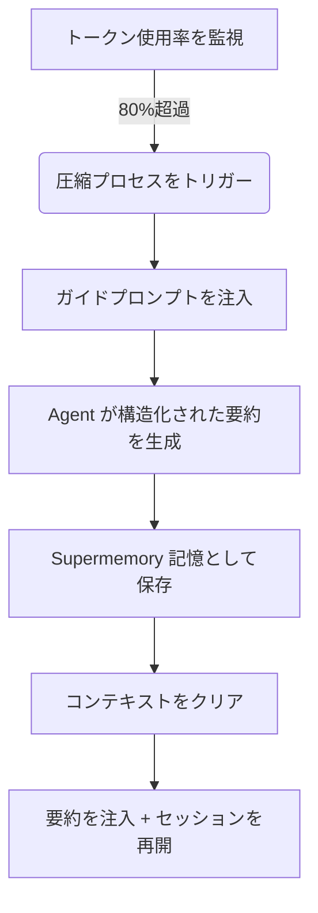

# 先制圧縮の原理：コンテキストの忘却を防ぐ

## この章で学べること

この章を完了すると、以下のことができるようになります：

1. **理解**：なぜ長いセッションで Agent が「愚か」になるのか、そして Supermemory がこの問題をどのように解決するのか。
2. **習得**：先制圧縮（Preemptive Compaction）のトリガー条件とワークフロー。
3. **設定**：プロジェクトに適した圧縮しきい値を設定し、コストと記憶品質のバランスを取る方法。
4. **確認**：圧縮が正常に動作しているか確認し、生成されたセッション要約を表示する方法。

## 今の課題

AI とペアプログラミングをしているとき、以下のような状況に遭遇したことはありませんか：

* **会話中に「忘れる」**：長いリファクタリングタスク中に、Agent が突然最初に合意した変数命名規則を忘れる。
* **再起動を強制される**：コンテキストウィンドウ（Context Window）がいっぱいになり、IDE が履歴をクリアする必要があると表示し、完了した作業のすべてのコンテキストを失う。
* **要約の品質が悪い**：通常の自動圧縮は単純な切り捨てやあいまいな要約であり、「次に何をすべきか」の重要な情報が失われる。

## いつこの方法を使うべきか

* **大規模なリファクタリング**や**複雑な機能開発**を行っていて、セッションが長く続くと予想される場合。
* 使用するモデルのコンテキストウィンドウが小さい（32k/128k など）場合、上限に達しやすい。
* コンテキストをクリアした後でも、Agent に「どこまで進んだか」を的確に記憶してほしい場合。

---

## 基本的な考え方：先制的 vs 受動的

従来のコンテキスト管理は多くの場合**受動的**でした：コンテキストが完全に満杯（100%）になってから、古いメッセージを破棄することを余儀なくされます。これはハードディスクがいっぱいになってからファイルを削除し始めるようなもので、整理する時間がありません。

Supermemory は**先制圧縮（Preemptive Compaction）**を採用しています：

1. **事前介入**：デフォルトで Token 使用率が **80%** に達したときにトリガーし、思考と要約のための十分なスペースを確保します。
2. **構造化されたガイド**：Agent に適当な要約を書かせるのではなく、特定のプロンプトを注入し、「目標-進捗-未実施タスク」の形式で要約することを強制します。
3. **記憶の永続化**：生成された要約は現在のセッションの復元に使用されるだけでなく、`conversation` タイプの記憶として保存され、将来の検索に利用できます。

### ワークフローの図解



---

## トリガーメカニズムの解説

Supermemory は各セッションの Token 使用状況をリアルタイムで監視します。圧縮プロセスは以下の 3 つの厳密な条件によって共同でトリガーされます。

### 1. トークン使用率のしきい値
デフォルトでは、総トークン数（入力 + 出力 + キャッシュ）がモデル上限の **80%** を超えるとトリガーされます。

* **設定項目**：`compactionThreshold`
* **デフォルト値**：`0.80`
* **ソースコードの根拠**：[`src/services/compaction.ts`](https://github.com/supermemoryai/opencode-supermemory/blob/main/src/services/compaction.ts#L11)

### 2. 最小トークン制限
短いセッションでの誤トリガーを防ぐため（モデルのコンテキストは大きいが、数回しかチャットしていない場合など）、システムはハードコードされた下限を設けています。使用量が **50,000 トークン**を超えた場合のみ、圧縮を考慮します。

* **定数**：`MIN_TOKENS_FOR_COMPACTION`
* **値**：`50,000`
* **ソースコードの根拠**：[`src/services/compaction.ts`](https://github.com/supermemoryai/opencode-supermemory/blob/main/src/services/compaction.ts#L12)

### 3. クールダウン時間
連続トリガーによる無限ループを防ぐため、2 回の圧縮の間は少なくとも **30 秒** 間隔をあける必要があります。

* **定数**：`COMPACTION_COOLDOWN_MS`
* **値**：`30,000` (ms)
* **ソースコードの根拠**：[`src/services/compaction.ts`](https://github.com/supermemoryai/opencode-supermemory/blob/main/src/services/compaction.ts#L13)

---

## 構造化された要約テンプレート

圧縮がトリガーされると、Supermemory は Agent に特別なシステムプロンプト（`[COMPACTION CONTEXT INJECTION]`）を注入し、要約に以下の 5 つの部分を含めることを強制します。

| セクション | 内容の説明 | 目的 |
|--- | --- | ---|
| **1. User Requests** | ユーザーの元のニーズ（そのまま保持） | ニーズのドリフトを防ぐ |
| **2. Final Goal** | 最終的に達成すべき目標 | 最終的な状態を明確にする |
| **3. Work Completed** | 完了した作業、変更したファイル | 繰り返し作業を避ける |
| **4. Remaining Tasks** | 残りの未実施タスク | 次のアクションを明確にする |
| **5. MUST NOT Do** | 明確に禁止されている事項、失敗した試み | 同じ失敗を繰り返さないようにする |

::: details 注入されたプロンプトのソースコードを表示するにはクリック
```typescript
// src/services/compaction.ts

return `[COMPACTION CONTEXT INJECTION]

When summarizing this session, you MUST include the following sections in your summary:

## 1. User Requests (As-Is)
- List all original user requests exactly as they were stated
...

## 2. Final Goal
...

## 3. Work Completed
...

## 4. Remaining Tasks
...

## 5. MUST NOT Do (Critical Constraints)
...
This context is critical for maintaining continuity after compaction.
`;
```
:::

---

## 実践：設定と確認

### ステップ 1：圧縮しきい値を調整する（オプション）

80% が早すぎるまたは遅すぎると感じる場合、`~/.config/opencode/supermemory.jsonc` で調整できます。

```jsonc
// ~/.config/opencode/supermemory.jsonc
{
  // ... その他の設定
  "compactionThreshold": 0.90
}
```

::: warning 競合の警告
`oh-my-opencode` や他のコンテキスト管理プラグインをインストールしている場合、それらが内蔵する圧縮機能（`context-window-limit-recovery` など）**を無効にする必要があります**。そうしないと、二重圧縮や論理競合が発生します。
:::

### ステップ 2：圧縮トリガーを観察

長いセッションでしきい値に達したとき、IDE の右下の Toast 通知に注意してください。

**期待される出力**：

1. **警告通知**：
    > "Preemptive Compaction: Context at 81% - compacting with Supermemory context..."
    
    この時、システムが要約を生成中です。

2. **完了通知**：
    > "Compaction Complete: Session compacted with Supermemory context. Resuming..."
    
    この時、コンテキストがクリアされ、新しい要約が注入されました。

### ステップ 3：記憶の保存を確認

圧縮完了後、生成された要約は自動的に Supermemory に保存されます。CLI で確認できます。

**操作**：
ターミナルで以下のコマンドを実行して、最近の記憶を確認します：

```bash
opencode run supermemory list --scope project --limit 1
```

**期待される出力**：
タイプが `conversation` の記憶が 1 つあり、その内容は先ほどの構造化された要約です。

```json
{
  "id": "mem_123abc",
  "content": "[Session Summary]\n## 1. User Requests\n...",
  "type": "conversation",
  "scope": "opencode_project_..."
}
```

---

## よくある質問 (FAQ)

### Q: セッションが長いのに圧縮がトリガーされないのはなぜですか？
**A**: 以下の点を確認してください：
1. **トークン総量**：50,000 トークンを超えていますか？（短いセッションでは、比率が高くてもトリガーされません）。
2. **モデルの制限**：OpenCode は現在のモデルのコンテキスト上限を正しく認識していますか？認識に失敗した場合、デフォルトの 200k にフォールバックし、比率の計算が低くなります。
3. **クールダウン時間**：前回の圧縮から 30 秒未満ですか？

### Q: 圧縮後の要約はどのくらいのトークンを消費しますか？
**A**: これは要約の詳細度によりますが、通常は 500-2000 トークンの間です。元の 100k+ のコンテキストに比べると、これは大幅な節約です。

### Q: 手動で圧縮をトリガーできますか？
**A**: 現在のバージョン（v1.0）では手動トリガーはサポートされておらず、完全にアルゴリズムによって自動管理されます。

---

## この章のまとめ

先制圧縮は Supermemory の「長距離走行の秘訣」です。**事前介入**と**構造化された要約**を通じて、線形の対話フローを精練された記憶スナップショットに変換します。これはコンテキストオーバーフローの問題を解決するだけでなく、より重要なことに、Agent が「記憶喪失」（コンテキストのクリア）後でも、スナップショットを読み取ることで、以前の作業をシームレスに継続できるようにします。

## 次の章の予告

> 次の章では **[詳細設定の解説](../configuration/index.md)** を学びます。
>
> 以下のことができるようになります：
> - 記憶の保存パスをカスタマイズする方法
> - 検索結果の数の制限を設定する方法
> - プライバシー フィルタリングのルールを調整する方法

---

## 付録：ソースコード参照

<details>
<summary><strong>クリックしてソースコードの場所を表示</strong></summary>

> 更新日：2026-01-23

| 機能 | ファイルパス | 行番号 |
|--- | --- | ---|
| しきい値定数の定義 | [`src/services/compaction.ts`](https://github.com/supermemoryai/opencode-supermemory/blob/main/src/services/compaction.ts#L11-L14) | 11-14 |
| ガイドプロンプトの生成 | [`src/services/compaction.ts`](https://github.com/supermemoryai/opencode-supermemory/blob/main/src/services/compaction.ts#L58-L98) | 58-98 |
| トリガー検出ロジック | [`src/services/compaction.ts`](https://github.com/supermemoryai/opencode-supermemory/blob/main/src/services/compaction.ts#L317-L358) | 317-358 |
| 要約保存ロジック | [`src/services/compaction.ts`](https://github.com/supermemoryai/opencode-supermemory/blob/main/src/services/compaction.ts#L294-L315) | 294-315 |
| 設定項目の定義 | [`src/config.ts`](https://github.com/supermemoryai/opencode-supermemory/blob/main/src/config.ts#L22) | 22 |

**重要な定数**：
- `DEFAULT_THRESHOLD = 0.80`：デフォルトのトリガーしきい値
- `MIN_TOKENS_FOR_COMPACTION = 50_000`：トリガーの最小トークン数
- `COMPACTION_COOLDOWN_MS = 30_000`：クールダウン時間（ミリ秒）

</details>
