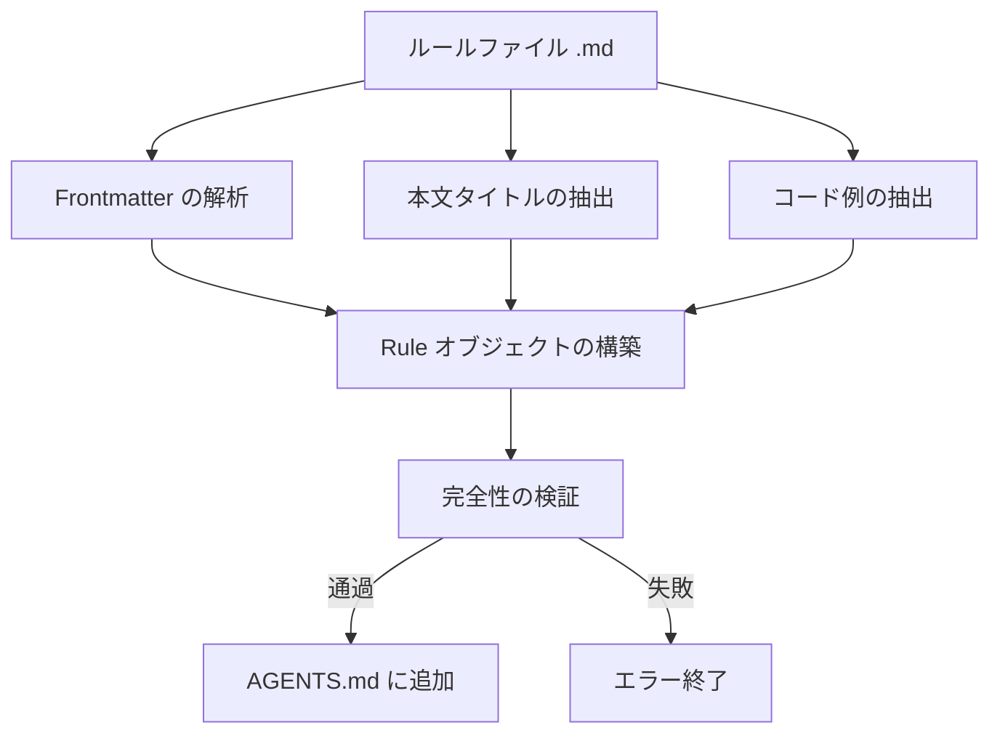

# React ベストプラクティスのルール作成

## 学習後の目標

- ゼロから Agent Skills 規格に準拠した React パフォーマンス最適化ルールを作成できる
- _template.md テンプレートを使用してルールファイルを素早く作成できる
- 影響レベル（CRITICAL/HIGH/MEDIUM）を適切に選択してルールを分類できる
- 明確で理解しやすい Incorrect/Correct コード比較例を作成できる
- `pnpm validate` でルールの完全性を検証できる

## 現在の課題

すでに Agent Skills の React パフォーマンス最適化ルールライブラリを使用してコード監査を行い、一部のパフォーマンス最適化パターンがカバーされていないことに気づきました。独自のルールを貢献したいが、以下の問題があります：

- ルールファイルで使用すべき形式がわからない
- 影響レベルをどのように選択すべきか不確か
- コード例が規格に準拠していないため、検証が失敗する
- ルールが拒否されたり、正しく解析されなかったりすることを心配している

## 使用タイミング

ルール作成に適したシナリオ：

- プロジェクトでパフォーマンス問題を発見し、それを再利用可能なルールとして固定化したい
- チーム独自の React 最適化パターンがあり、それを Agent に適用させたい
- React 公式ドキュメントや Vercel エンジニアリングチームから新しいテクニックを学び、コミュニティと共有したい

不適切なシナリオ：

- 単純なコードスタイルの問題（ESLint ルールを使用）
- パフォーマンスと無関係な機能的アドバイス（ドキュメントまたはコメントを使用）

## コアコンセプト

ルールファイルは Markdown 形式で、**3段階構造**に従います：

1. **Frontmatter**：ルールのメタデータ（title、impact、tags）
2. **本文タイトル**：ルールの表示名と impact の説明
3. **コード例**：`**Incorrect:**` と `**Correct:**` の比較表示



**重要な概念**：

::: info Impact Level（影響レベル）
Impact はルールがドキュメント内の並び順を決定します。レベルは高い順から：
- **CRITICAL**：重要なボトルネック（ウォーターフォールの解消、バンドル最適化）
- **HIGH**：重要な改善（サーバーサイドパフォーマンス）
- **MEDIUM-HIGH**：中高優先度（クライアント側データフェッチ）
- **MEDIUM**：中程度の改善（再レンダリング最適化）
- **LOW-MEDIUM**：低中優先度（JavaScript のマイクロ最適化）
- **LOW**：漸進的な改善（高度なパターン）
:::

::: info kebab-case 命名規則
ファイル名はハイフン区切りの小文字を使用する必要があります（例：`async-parallel.md`）。ファイル名のプレフィックス（最初の `-` の前の部分）が、ルールが属するセクションを決定します：
- `async-*` → 第1章（ウォーターフォールの解消）
- `bundle-*` → 第2章（バンドル最適化）
- `rerender-*` → 第5章（再レンダリング最適化）
:::

## 🎒 事前準備

::: warning 事前チェック
- [Agent Skills 入門](../../start/getting-started/) を完了済み
- React パフォーマンスの基本概念（再レンダリング、ウォーターフォール、バンドルなど）を理解済み
- リポジトリをクローン済み：`cd source/vercel-labs/agent-skills`
- 依存関係をインストール済み：`pnpm install`
:::

## ステップバイステップ

### ステップ 1：テンプレートファイルのコピー

**なぜ**
テンプレートを使用することで、形式が正しく、必須フィールドが漏れていないことを保証できます。

**操作**：

```bash
cd skills/react-best-practices/rules
cp _template.md my-new-rule.md
```

**期待される結果**：`my-new-rule.md` ファイルが作成され、テンプレートと同じ内容になります。

### ステップ 2：Frontmatter メタデータの作成

**なぜ**
Frontmatter はルールのタイトル、影響レベル、分類タグを定義し、パーサーの最初のゲートになります。

**`my-new-rule.md` の frontmatter 部分を編集**：

```yaml
---
title: Use React.lazy for Code Splitting
impact: CRITICAL
impactDescription: 50-70% reduction in initial bundle
tags: bundle, code-splitting, lazy-loading, performance
---
```

**フィールド説明**：

| フィールド | 必須 | 説明 | 例 |
|--- | --- | --- | ---|
| `title` | ✅ | ルールの短いタイトル | `Promise.all() for Independent Operations` |
| `impact` | ✅ | 影響レベル（6つの列挙値） | `CRITICAL` / `HIGH` / `MEDIUM` など |
| `impactDescription` | ⭕ | 影響の大きさの説明 | `2-10× improvement` |
| `tags` | ⭕ | カンマ区切りのタグ | `async, parallelization, promises` |

**期待される結果**：frontmatter が作成した内容に更新されます。

### ステップ 3：本文タイトルと説明の記入

**なぜ**
本文タイトルは最終ドキュメントに表示され、説明部分はユーザーがルールの意義を理解するのに役立ちます。

**frontmatter の後に本文を追加**

```markdown
## Use React.lazy for Code Splitting

**Impact: CRITICAL (50-70% reduction in initial bundle)**

Code split large components using `React.lazy()` to reduce the initial bundle size. Components are loaded on-demand when needed.
```

**作成のポイント**：

- H2 見出しは frontmatter の `title` を使用する
- **Impact:** 行は `**Impact: LEVEL (description)**` 形式を使用する
- ルールの目的とパフォーマンス上の利点を簡潔に説明する

### ステップ 4：Incorrect と Correct の例を作成

**なぜ**
比較例はルールの核心であり、「問題のあるコード」と「正しいアプローチ」を直接示します。

**本文の後にコード例を追加**

````markdown
**Incorrect (loads entire bundle on initial page):**

```typescript
import HeavyChart from './HeavyChart'

function Dashboard() {
  return <HeavyChart />
}
```

**Correct (loads on-demand when needed):**

```typescript
import { lazy, Suspense } from 'react'

const HeavyChart = lazy(() => import('./HeavyChart'))

function Dashboard() {
  return (
    <Suspense fallback={<LoadingSpinner />}>
      <HeavyChart />
    </Suspense>
  )
}
```
````

**例作成規格**：

| 要件 | 説明 |
|--- | ---|
| **ラベル形式** | `**Incorrect:**` または `**Incorrect (description):**`（括号はオプション） |
| **括号の内容** | オプション、なぜ間違っている/なぜ正しいかの短い説明 |
| **コードブロック** | `\`\`\`typescript` または `\`\`\`tsx` を使用する |
| **例の数** | 少なくとも 1 つの bad または good タイプの例を含める |

**期待される結果**：コードブロックが正しくレンダリングされ、シンタックスハイライトが表示されます。

### ステップ 5：参考文献の追加（オプション）

**なぜ**
参考文献はルールに権威あるソースを提供し、信頼性を高めます。

**ファイルの末尾に追加**

```markdown
Reference: [React.lazy and Suspense](https://react.dev/reference/react/lazy)
```

**対応形式**：

```markdown
Reference: [リンクテキスト](URL)

### 複数の参考文献
References:
- [React.lazy documentation](https://react.dev/reference/react/lazy)
- [Code splitting patterns](https://web.dev/code-splitting-suspense/)
```

### ステップ 6：ルールファイルの検証

**なぜ**
`pnpm validate` はルールの完全性をチェックし、正しく解析できることを保証します。

**検証コマンドを実行**

```bash
cd packages/react-best-practices-build
pnpm validate
```

**期待される結果**：

```bash
Validating rule files...
✓ All 58 rule files are valid
```

検証が失敗した場合、詳細なエラーメッセージが表示されます：

```bash
✗ Validation failed:

  my-new-rule.md: Missing or empty title
```

**一般的な検証エラー**：

| エラーメッセージ | 原因 | 修正方法 |
|--- | --- | ---|
| `Missing or empty title` | frontmatter に `title` フィールドがない | `title: Your Title` を追加する |
| `Missing examples (need at least one bad and one good example)` | examples 配列が空 | 少なくとも 1 つの例（コードブロック付き）を追加する |
| `Missing code examples` | ラベルはあるが実際のコードがない | ラベルの後にコードブロック（`\`\`\`typescript`）を追加する |
| `Missing bad/incorrect or good/correct examples` | ラベルに bad/good/incorrect/correct などのキーワードがない | `**Incorrect:**`、`**Correct:**`、`**Example:**` などの正当なラベルを使用する |
| `Invalid impact level: <value>...` | `impact` 値が列挙型にない | 大文字を使用する：`CRITICAL`/`HIGH`/`MEDIUM-HIGH`/`MEDIUM`/`LOW-MEDIUM`/`LOW` |
| `Failed to parse` | Markdown 形式エラー | frontmatter が `---` で囲まれているか確認する |

### ステップ 7：ビルドと結果の確認

**なぜ**
`pnpm build` はすべてのルールを `AGENTS.md` にコンパイルし、ドキュメントでのルールの表示効果を確認できます。

**ビルドコマンドを実行**

```bash
pnpm build
```

**期待される結果**：

```bash
Building rules...
Validating rule files...
✓ All 58 rule files are valid
✓ Built 8 sections with 58 rules
✓ Generated test-cases.json with 172 test cases
```

**生成されたドキュメントを確認**

```bash
cat skills/react-best-practices/AGENTS.md
```

**期待される結果**：新しいルールが対応するセクションに表示され、形式は以下の通り：

```markdown
### 2.1 Use React.lazy for Code Splitting

**Impact: CRITICAL (50-70% reduction in initial bundle)**

Code split large components using `React.lazy()` to reduce...
```

## チェックポイント ✅

以下の操作が完了したことを確認してください：

- [ ] `_template.md` をコピーし、`my-new-rule.md` に名前を変更した
- [ ] Frontmatter に `title`、`impact`、`impactDescription`、`tags` が含まれている
- [ ] 本文タイトルが frontmatter の `title` と一致している
- [ ] 少なくとも 1 つの Incorrect または Correct コード例が含まれている
- [ ] `pnpm validate` 検証に合格した
- [ ] `pnpm build` で AGENTS.md が正常に生成された

## よくある落とし穴

### よくあるエラー 1：Impact レベルのスペルミス

```yaml
# ❌ 誤り：小文字のため検証が失敗する
# impact: critical

# ✅ 正解：大文字を使用する（必ず大文字）
impact: CRITICAL
```

**原因**：`ImpactLevel` 型定義は大文字の列挙値のみを受け入れます（`types.ts:5`）。

### よくあるエラー 2：ファイル名プレフィックスの誤り

```bash
# ❌ 誤り：プレフィックスが sectionMap にないため推論が失敗する
# use-react-lazy.md  # プレフィックスは "use"、セクションを推論できない

# ✅ 正解：8つの標準プレフィックスを使用する
bundle-lazy-loading.md  # プレフィックスは "bundle"、第2章に属する
```

**原因**：パーサーはファイル名プレフィックスからセクションを推論します（`parser.ts:201-210`）。プレフィックスが `sectionMap` と一致しない場合、ルールは第0章に分類されます。

### よくあるエラー 3：Frontmatter が閉じていない

```markdown
---
title: My Rule
impact: MEDIUM
# ❌ 終了の --- がない

## My Rule
```

**原因**：Frontmatter は `---` で囲む必要があります（`parser.ts:42`）。

### よくあるエラー 4：例ラベルの形式が誤り

````markdown
# ❌ 誤り：コロンがない
# **Incorrect**

```typescript
const bad = code
```

# ✅ 正解：コロンが必要
# **Incorrect:**

```typescript
const bad = code
```

# ✅ 括号で説明を追加（推奨）
# **Incorrect (reason why it's wrong):**

```typescript
const bad = code
```
````

**原因**：パーサーは正規表現 `^\*\*([^:]+?):\*?\*?$` でラベルを一致させます（`parser.ts:125`）。コロンは必須ですが、括号の説明はオプションです。

## まとめ

ルールファイルの作成は**テンプレート駆動**の方式に従い、核心は以下の通りです：

1. **Frontmatter** でメタデータ（title、impact、tags）を定義する
2. **本文** にタイトル、impact の説明、コード例を含める
3. **例** は `**Incorrect:**` と `**Correct:**` ラベルを使用する
4. **検証** は `pnpm validate` で形式が正しいことを確認する

この5つのポイントを覚えておきましょう：

- ✅ `_template.md` を出発点として使用する
- ✅ impact レベルは大文字を使用する（CRITICAL/HIGH/MEDIUM）
- ✅ ファイル名プレフィックスがセクション所属を決定する（async-/bundle-/rerender- など）
- ✅ 例ラベル形式：`**Incorrect (description):**`
- ✅ 提交前に `pnpm validate` を実行する

## 次のレッスンの予告

> 次のレッスンでは **[ビルドツールチェーンの使用](../build-toolchain/)** を学びます。
>
> 学習内容：
> - `pnpm build` がルールドキュメントをコンパイルする方法
> - `pnpm extract-tests` がテストケースを抽出する方法
> - GitHub Actions で自動検証を設定する方法
> - LLM 自動評価の仕組み

---

## 付録：ソースコード参考

<details>
<summary><strong>クリックしてソースコードの場所を表示</strong></summary>

> 更新日：2026-01-25

| 機能 | ファイルパス | 行号 |
|--- | --- | ---|
| ルールテンプレートファイル | [`skills/react-best-practices/rules/_template.md`](https://github.com/vercel-labs/agent-skills/blob/main/skills/react-best-practices/rules/_template.md) | 1-29 |
| ルール型定義 | [`packages/react-best-practices-build/src/types.ts`](https://github.com/vercel-labs/agent-skills/blob/main/packages/react-best-practices-build/src/types.ts) | 5-26 |
| ルール検証ロジック | [`packages/react-best-practices-build/src/validate.ts`](https://github.com/vercel-labs/agent-skills/blob/main/packages/react-best-practices-build/src/validate.ts) | 21-66 |
| Frontmatter 解析 | [`packages/react-best-practices-build/src/parser.ts`](https://github.com/vercel-labs/agent-skills/blob/main/packages/react-best-practices-build/src/parser.ts) | 42-63 |
| セクションマッピング（section の推論） | [`packages/react-best-practices-build/src/parser.ts`](https://github.com/vercel-labs/agent-skills/blob/main/packages/react-best-practices-build/src/parser.ts) | 201-210 |
| コード例抽出 | [`packages/react-best-practices-build/src/parser.ts`](https://github.com/vercel-labs/agent-skills/blob/main/packages/react-best-practices-build/src/parser.ts) | 130-194 |
| セクション定義ファイル | [`skills/react-best-practices/rules/_sections.md`](https://github.com/vercel-labs/agent-skills/blob/main/skills/react-best-practices/rules/_sections.md) | 1-47 |

**重要な型定義**：

```typescript
export type ImpactLevel = 'CRITICAL' | 'HIGH' | 'MEDIUM-HIGH' | 'MEDIUM' | 'LOW-MEDIUM' | 'LOW'

export interface Rule {
  id: string
  title: string
  section: number // 1-8
  impact: ImpactLevel
  explanation: string
  examples: CodeExample[]
  references?: string[]
  tags?: string[]
}
```

**重要な検証ルール**：

- title が空でない（`validate.ts:26-28`）
- examples 数量 ≥ 1（`validate.ts:34-58`）
- impact が有効な列挙値（`validate.ts:60-63`）

**セクションマッピング**（ファイル名プレフィックス → セクション ID）：

```typescript
const sectionMap: Record<string, number> = {
  async: 1,      // ウォーターフォールの解消
  bundle: 2,     // バンドル最適化
  server: 3,     // サーバーサイドパフォーマンス
  client: 4,     // クライアント側データフェッチ
  rerender: 5,   // 再レンダリング最適化
  rendering: 6,  // レンダリングパフォーマンス
  js: 7,         // JavaScript パフォーマンス
  advanced: 8,   // 高度なパターン
}
```

</details>
