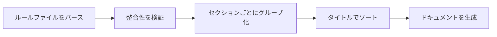

# アーキテクチャと実装の詳細

## 学習後、できること

- Agent Skills ビルドツールチェーンの動作原理を理解する
- ルールファイルパースの論理を習得する
- 型システムとデータフローの設計を理解する
- フレームワーク検出アルゴリズムの実装の詳細を学ぶ

## コアアーキテクチャ概要

Agent Skills は 3 つの主要な部分で構成されています：

**1. ビルドツールチェーン**（`packages/react-best-practices-build/`）
- ルールファイルのパース
- AGENTS.md の生成
- テストケースの抽出

**2. ルールファイル**（`skills/react-best-practices/rules/`）
- React パフォーマンス最適化ルール 57 件
- Markdown 形式、テンプレート仕様に準拠

**3. デプロイスクリプト**（`skills/claude.ai/vercel-deploy-claimable/`）
- Vercel へのワンクリックデプロイ
- 自動フレームワーク検出

::: info アーキテクチャを理解する必要があるのはなぜ？
単に Agent Skills を使用するだけであれば、これらの詳細を深く理解する必要はないかもしれません。しかし、以下を行う場合：
- カスタムスキルの開発
- 新しいパフォーマンス最適化ルールの作成
- ビルドやデプロイの問題のトラブルシューティング

アーキテクチャを理解することは非常に役立ちます。
:::

## ビルドプロセスの詳細

ビルドプロセスは、分散されたルールファイルを AIAgent が読み取れる AGENTS.md ドキュメントにコンパイルします。プロセスは 5 つのフェーズに分かれています：



### フェーズ 1：ルールファイルのパース（parse）

各ルールファイル（`.md`）は `parseRuleFile()` 関数によって `Rule` オブジェクトにパースされます。

**パース順序**（ソースコード位置：`parser.ts:18-238`）：

1. **Frontmatter の抽出**（存在する場合）
   - YAML 形式のメタデータをパース
   - サポートされるフィールド：`title`、`impact`、`tags`、`section`、`explanation`、`references`

2. **タイトルの抽出**
   - 最初の `##` または `###` 見出しを検索
   - Frontmatter に title がない場合、ここを使用

3. **Impact の抽出**
   - `**Impact:**` 行にマッチ
   - 形式：`**Impact:** CRITICAL (2-10× improvement)`
   - レベルと説明を抽出

4. **コード例の抽出**
   - `**Label:**` マーカーを検索（例：`**Incorrect:**`、`**Correct:**`）
   - 後続のコードブロックを収集
   - コードブロック後の補足説明をキャプチャ

5. **参考文献の抽出**
   - `Reference:` または `References:` 行を検索
   - Markdown リンク `[text](url)` をパース

6. **Section の推論**
   - ファイル名のプレフィックスから抽出（ソースコード位置：`parser.ts:201-210`）
   - マッピングテーブル：
     - `async-*` → Section 1（ウォーターフォールの排除）
     - `bundle-*` → Section 2（バンドル最適化）
     - `server-*` → Section 3（サーバーサイドのパフォーマンス）
     - `client-*` → Section 4（クライアントサイドのデータフェッチ）
     - `rerender-*` → Section 5（Re-render の最適化）
     - `rendering-*` → Section 6（レンダリングのパフォーマンス）
     - `js-*` → Section 7（JavaScript のパフォーマンス）
     - `advanced-*` → Section 8（高度なパターン）

### フェーズ 2：整合性の検証（validate）

検証ロジックは `validate.ts` に実装されており、ルールファイルが仕様に準拠していることを保証します。

**検証項目**：

| 検査項目       | 説明                                   | 失敗時の出力                       |
|--- | --- | ---|
| Title 非空   | タイトルが必要（Frontmatter または `##` 見出し） | `Missing or empty title`             |
| 少なくとも 1 つの例 | `examples` 配列が空ではない              | `At least one code example required` |
| Impact の正当性 | 有効な `ImpactLevel` 列挙値である必要がある      | `Invalid impact level`               |
| Code 非空    | 各例にはコード内容が必要                 | `Empty code block`                   |

### フェーズ 3：セクションごとのグループ化（group）

すべてのルールをセクションごとにグループ化し、各セクションには以下が含まれます：

- `number`：章番号（1-8）
- `title`：章のタイトル（`_sections.md` から読み取り）
- `impact`：全体的なインパクトレベル
- `introduction`：章の概要（オプション）
- `rules[]`：含まれるルールの配列

（ソースコード位置：`build.ts:156-169`）

### フェーズ 4：タイトルでソート（sort）

各セクション内のルールはタイトルのアルファベット順にソートされます。

**ソートルール**（ソースコード位置：`build.ts:172-175`）：
```typescript
section.rules.sort((a, b) =>
  a.title.localeCompare(b.title, 'en-US', { sensitivity: 'base' })
)
```

`en-US` ロケールを使用して、環境をまたいだ一貫したソートを保証します。

**ID の割り当て**（ソースコード位置：`build.ts:178-180）：
```typescript
section.rules.forEach((rule, index) => {
  rule.id = `${section.number}.${index + 1}`
  rule.subsection = index + 1
})
```

ソート後に ID を割り当てます（例：`1.1`、`1.2`...）。

### フェーズ 5：ドキュメントの生成（generate）

`generateMarkdown()` 関数は `Section[]` 配列を Markdown ドキュメントに変換します。

**出力構造**（ソースコード位置：`build.ts:29-126`）：

```markdown
# React Best Practices
**Version 1.0**
Vercel Engineering
January 25, 2026

## Abstract
...

## Table of Contents
1. ウォーターフォールの排除 - CRITICAL
   - 1.1 [並列リクエスト](#11-parallel-requests)
   - 1.2 [Defer Await](#12-defer-await)
...

## 1. ウォーターフォールの排除
**Impact: CRITICAL**

### 1.1 並列リクエスト
**Impact: CRITICAL**

**Incorrect:**
```typescript
// コード
```
```

## ルールパーサーの詳細

### Frontmatter のパース

Frontmatter は Markdown ファイルの先頭の YAML ブロックです：

```markdown
---
title: 並列リクエスト
impact: CRITICAL
impactDescription: 2-10× improvement
tags: async, waterfall
---
```

**パースロジック**（ソースコード位置：`parser.ts:28-41`）：
- `---` で始まり、2 番目の `---` で終わることを検出
- `:` でキーと値を分割
- 引用符を削除
- `frontmatter` オブジェクトに保存

### コード例のパース

各ルールには複数のコード例が含まれ、`**Label:**` でマークされます。

**パース状態マシン**（ソースコード位置：`parser.ts:66-188`）：

```
初期状態 → **Label:** を読み込む → currentExample.label = "ラベル"
         → ``` を読み込む → inCodeBlock = true、コードを収集
         → ``` を読み込む → inCodeBlock = false、currentExample.code = 収集したコード
         → テキストを読み込む → afterCodeBlock の場合、additionalText に保存
         → **Reference:** を読み込む → currentExample を examples[] にプッシュ
```

**サポートされるラベルタイプ**：
- `Incorrect`：誤った例
- `Correct`：正しい例
- `Example`：汎用の例
- `Usage`：使用法の例
- `Implementation`：実装例

**補足説明のキャプチャ**（ソースコード位置：`parser.ts:182-186`）：
```typescript
// コードブロック後のテキスト、またはコードブロックのないセクションのテキスト
// （例：箇条書きの代わりにコードを持たない "When NOT to use this pattern:"）
else if (currentExample && (afterCodeBlock || !hasCodeBlockForCurrentExample)) {
  additionalText.push(line)
}
```

これにより、コードブロック後に補足説明を追加したり、純粋なテキストの例（箇条書きなど）をサポートできます。

### 参考文献のパース

参考文献はファイルの末尾にあり、形式は以下の通りです：

```markdown
Reference: [React ドキュメント](https://react.dev), [Next.js ガイド](https://nextjs.org/docs)
```

**パースロジック**（ソースコード位置：`parser.ts:154-174`）：
- 正規表現で `[text](url)` パターンにマッチ
- すべての URL を `references[]` 配列に抽出

## 型システム

型定義は `types.ts` にあります（ソースコード位置：`types.ts:1-54`）。

### ImpactLevel 列挙

```typescript
export type ImpactLevel =
  | 'CRITICAL'
  | 'HIGH'
  | 'MEDIUM-HIGH'
  | 'MEDIUM'
  | 'LOW-MEDIUM'
  | 'LOW'
```

**レベルの説明**：

| レベル        | 影響               | 例ルール                     |
|--- | --- | ---|
| CRITICAL    | 重要なボトルネック、修正必須 | async-parallel               |
| HIGH        | 重要な改善、優先推奨 | server-cache-react           |
| MEDIUM-HIGH | 中～高優先度         | client-data-fetch            |
| MEDIUM      | 中程度の改善           | rerender-memo                |
| LOW-MEDIUM  | 低～中優先度         | js-use-memo                  |
| LOW         | 漸進的な改善、オプション     | advanced-suspense-boundaries |

### Rule インターフェース

```typescript
export interface Rule {
  id: string                    // 自動生成、例: "1.1"
  title: string                 // ルールのタイトル
  section: number              // 所属セクション（1-8）
  subsection?: number          // サブセクション番号
  impact: ImpactLevel          // インパクトレベル
  impactDescription?: string  // インパクト説明、例: "2-10× improvement"
  explanation: string          // ルールの説明
  examples: CodeExample[]      // コード例の配列
  references?: string[]        // 参照リンク
  tags?: string[]              // タグ
}
```

### CodeExample インターフェース

```typescript
export interface CodeExample {
  label: string              // "Incorrect", "Correct", "Example"
  description?: string       // ラベルの説明（オプション）
  code: string              // コード内容
  language?: string         // コード言語、デフォルトは typescript
  additionalText?: string   // コード後の補足説明
}
```

### Section インターフェース

```typescript
export interface Section {
  number: number              // セクション番号（1-8）
  title: string              // セクションタイトル
  impact: ImpactLevel        // 全体的なインパクトレベル
  impactDescription?: string // インパクト説明
  introduction?: string      // セクションの概要
  rules: Rule[]             // 含まれるルール
}
```

### GuidelinesDocument インターフェース

```typescript
export interface GuidelinesDocument {
  version: string          // バージョン、例: "1.0"
  organization: string     // 組織名
  date: string            // 日付
  abstract: string        // 要約
  sections: Section[]     // セクション
  references?: string[]   // グローバル参考文献
}
```

### TestCase インターフェース

LLM 自動評価用のテストケース。

```typescript
export interface TestCase {
  ruleId: string          // ルール ID、例: "1.1"
  ruleTitle: string       // ルールタイトル
  type: 'bad' | 'good'   // 例のタイプ
  code: string           // コード内容
  language: string       // コード言語
  description?: string   // 説明
}
```

## テストケース抽出メカニズム

テストケース抽出機能は、ルールのコード例を評価可能なテストケースに変換し、LLM によるルール遵守度の自動評価を可能にします。

### 抽出ロジック（ソースコード位置：`extract-tests.ts:15-38`）

```typescript
function extractTestCases(rule: Rule): TestCase[] {
  const testCases: TestCase[] = []

  rule.examples.forEach((example, index) => {
    const isBad = example.label.toLowerCase().includes('incorrect') ||
                  example.label.toLowerCase().includes('wrong') ||
                  example.label.toLowerCase().includes('bad')
    const isGood = example.label.toLowerCase().includes('correct') ||
                   example.label.toLowerCase().includes('good')

    if (isBad || isGood) {
      testCases.push({
        ruleId: rule.id,
        ruleTitle: rule.title,
        type: isBad ? 'bad' : 'good',
        code: example.code,
        language: example.language || 'typescript',
        description: example.description || `${example.label} example for ${rule.title}`
      })
    }
  })

  return testCases
}
```

**サポートされる例タイプ**：
- `Incorrect` / `Wrong` / `Bad` → type = 'bad'
- `Correct` / `Good` → type = 'good'

**出力ファイル**：`test-cases.json`

**データ構造**：
```json
[
  {
    "ruleId": "1.1",
    "ruleTitle": "並列リクエスト",
    "type": "bad",
    "code": "const data = await fetch(url);\nconst result = await process(data);",
    "language": "typescript",
    "description": "Incorrect example for 並列リクエスト"
  },
  {
    "ruleId": "1.1",
    "ruleTitle": "並列リクエスト",
    "type": "good",
    "code": "const [data, processed] = await Promise.all([\n  fetch(url),\n  process(data)\n]);",
    "language": "typescript",
    "description": "Correct example for 並列リクエスト"
  }
]
```

**統計データ**（ソースコード位置：`extract-tests.ts:68-70`）：
```bash
✓ Extracted 120 test cases to test-cases.json
  - Bad examples: 60
  - Good examples: 60
```

## デプロイスクリプトのフレームワーク検出

Vercel デプロイスクリプトは 40 以上のフレームワークの自動検出をサポートしています。

### 検出ロジック（ソースコード位置：`deploy.sh:12-156`）

```bash
detect_framework() {
    local pkg_json="$1"
    local content=$(cat "$pkg_json")

    has_dep() {
        echo "$content" | grep -q "\"$1\""
    }

    # 依存関係を優先度順にチェック
    if has_dep "blitz"; then echo "blitzjs"; return; fi
    if has_dep "next"; then echo "nextjs"; return; fi
    if has_dep "gatsby"; then echo "gatsby"; return; fi
    # ... その他のフレームワーク検出
}
```

**検出順序**：
- 特殊なものから一般的なものへ
- `dependencies` と `devDependencies` をチェック
- `grep -q` で高速マッチング

### サポートされるフレームワーク

| カテゴリ         | フレームワークリスト                                                      | 検出キーワード                    |
|--- | --- | ---|
| React        | Next.js, Gatsby, Create React App, Remix, React Router, Blitz | `next`, `gatsby`, `remix-run` |
| Vue          | Nuxt, Vitepress, Vuepress, Gridsome                           | `nuxt`, `vitepress`           |
| Svelte       | SvelteKit, Svelte, Sapper                                     | `@sveltejs/kit`, `svelte`     |
| Angular      | Angular, Ionic Angular                                        | `@angular/core`               |
| Node.js バックエンド | Express, Hono, Fastify, NestJS, Elysia, h3, Nitro             | `express`, `hono`, `nestjs`   |
| ビルドツール     | Vite, Parcel                                                  | `vite`, `parcel`              |
| 静的 HTML    | package.json なし                                               | `null` を返す                   |

### 静的 HTML プロジェクトの処理（ソースコード位置：`deploy.sh:192-206`）

静的 HTML プロジェクト（`package.json` なし）は特別な処理が必要です：

```bash
if [ ! -f "$PROJECT_PATH/package.json" ]; then
  # ルートディレクトリの HTML ファイルを検索
  HTML_FILES=$(find "$PROJECT_PATH" -maxdepth 1 -name "*.html" -type f)
  HTML_COUNT=$(echo "$HTML_FILES" | grep -c . || echo 0)

  # HTML ファイルが 1 つだけであり index.html でない場合、index.html にリネーム
  if [ "$HTML_COUNT" -eq 1 ]; then
    HTML_FILE=$(echo "$HTML_FILES" | head -1)
    BASENAME=$(basename "$HTML_FILE")
    if [ "$BASENAME" != "index.html" ]; then
      echo "Renaming $BASENAME to index.html..." >&2
      mv "$HTML_FILE" "$PROJECT_PATH/index.html"
    fi
  fi
fi
```

**なぜリネームが必要なのか？**
Vercel は静的サイトのエントリーファイルとしてデフォルトで `index.html` を検索します。

### デプロイフロー（ソースコード位置：`deploy.sh:158-249`）

```bash
# 1. 引数を解析
INPUT_PATH="${1:-.}"

# 2. 一時ディレクトリを作成
TEMP_DIR=$(mktemp -d)

# 3. フレームワークを検出
FRAMEWORK=$(detect_framework "$PROJECT_PATH/package.json")

# 4. tarball を作成（node_modules と .git を除外）
tar -czf "$TARBALL" -C "$PROJECT_PATH" --exclude='node_modules' --exclude='.git' .

# 5. API にアップロード
RESPONSE=$(curl -s -X POST "$DEPLOY_ENDPOINT" -F "file=@$TARBALL" -F "framework=$FRAMEWORK")

# 6. レスポンスを解析
PREVIEW_URL=$(echo "$RESPONSE" | grep -o '"previewUrl":"[^"]*"' | cut -d'"' -f4)
CLAIM_URL=$(echo "$RESPONSE" | grep -o '"claimUrl":"[^"]*"' | cut -d'"' -f4)

# 7. 結果を出力
echo "Preview URL: $PREVIEW_URL"
echo "Claim URL:   $CLAIM_URL"
echo "$RESPONSE"  # プログラム用に JSON 形式
```

**エラーハンドリング**（ソースコード位置：`deploy.sh:224-239`）：
```bash
if echo "$RESPONSE" | grep -q '"error"'; then
  ERROR_MSG=$(echo "$RESPONSE" | grep -o '"error":"[^"]*"' | cut -d'"' -f4)
  echo "Error: $ERROR_MSG" >&2
  exit 1
fi

if [ -z "$PREVIEW_URL" ]; then
  echo "Error: Could not extract preview URL from response" >&2
  exit 1
fi
```

## 次のステップ

アーキテクチャを理解した後、以下のことができます：

- [カスタムスキルの開発](../../advanced/skill-development/)
- [React ベストプラクティスルールの作成](../../advanced/rule-authoring/)
- [API とコマンドリファレンスの確認](../reference/)

## 付録：ソースコード参照

<details>
<summary><strong>クリックしてソースコードの場所を表示</strong></summary>

> 更新日時：2026-01-25

| 機能             | ファイルパス                                                                                                                                                                         | 行番号    |
|--- | --- | ---|
| 型システム         | [`packages/react-best-practices-build/src/types.ts`](https://github.com/vercel-labs/agent-skills/blob/main/packages/react-best-practices-build/src/types.ts)                     | 1-54    |
| パス設定         | [`packages/react-best-practices-build/src/config.ts`](https://github.com/vercel-labs/agent-skills/blob/main/packages/react-best-practices-build/src/config.ts)                   | 1-18    |
| ルールパーサー       | [`packages/react-best-practices-build/src/parser.ts`](https://github.com/vercel-labs/agent-skills/blob/main/packages/react-best-practices-build/src/parser.ts)                   | 18-238  |
| ビルドスクリプト         | [`packages/react-best-practices-build/src/build.ts`](https://github.com/vercel-labs/agent-skills/blob/main/packages/react-best-practices-build/src/build.ts)                     | 131-287 |
| テストケース抽出     | [`packages/react-best-practices-build/src/extract-tests.ts`](https://github.com/vercel-labs/agent-skills/blob/main/packages/react-best-practices-build/src/extract-tests.ts)     | 15-38   |
| デプロイスクリプトのフレームワーク検出 | [`skills/claude.ai/vercel-deploy-claimable/scripts/deploy.sh`](https://github.com/vercel-labs/agent-skills/blob/main/skills/claude.ai/vercel-deploy-claimable/scripts/deploy.sh) | 12-156  |

**重要な定数**：
- `ImpactLevel` 列挙値：CRITICAL, HIGH, MEDIUM-HIGH, MEDIUM, LOW-MEDIUM, LOW（`types.ts:5`）
- `SKILL_DIR`：スキルディレクトリパス（`config.ts:11`）
- `RULES_DIR`：ルールファイルディレクトリ（`config.ts:13`）
- `DEPLOY_ENDPOINT`：`https://claude-skills-deploy.vercel.com/api/deploy`（`deploy.sh:9`）

**重要な関数**：
- `parseRuleFile()`: Markdown ルールファイルを Rule オブジェクトにパース（`parser.ts:18`）
- `extractTestCases()`: ルールからテストケースを抽出（`extract-tests.ts:15`）
- `generateMarkdown()`: Section[] から Markdown ドキュメントを生成（`build.ts:29`）
- `detect_framework()`: プロジェクトフレームワークを検出（`deploy.sh:12`）

</details>
