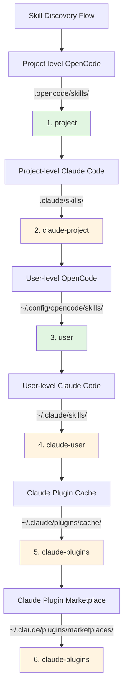

# Claude Code Skill Compatibility

## What You'll Learn

- Understand how plugins automatically support Claude Code skill format
- Master the tool mapping mechanism so Claude skills work correctly in OpenCode
- Learn the complete skill discovery priority rules
- Reuse existing skills from Claude plugin marketplace without rewriting

## Your Current Challenge

You already have some Claude Code skills, or want to use skills from the Claude plugin marketplace, but these skills are written for Claude Code. Using them directly in OpenCode will encounter problems:

- Tool calls in Claude skills (like `TodoWrite`, `Task`) don't exist in OpenCode
- Unclear how to make OpenCode find installed Claude plugin skills
- Worried about skill format incompatibility, requiring rewriting everything

## Core Concept

OpenCode Agent Skills plugin enables you to use Claude Code skills without modification through **three-layer compatibility mechanism**:

1. **Automatic Discovery** - Scan skills from Claude Code standard directories (`.claude/skills/`, `~/.claude/plugins/`)
2. **Tool Mapping** - Automatically inject tool mapping guide when loading skills, converting Claude tool names to OpenCode tool names
3. **Format Support** - Support both v1 and v2 installation formats for Claude plugins

::: info Key Concept
**Claude Code Skill Format** - Skill specification defined by Anthropic, using `SKILL.md` file to describe skills, containing YAML frontmatter (metadata) and Markdown content (instructions).
:::

### Tool Mapping Principle

When the plugin detects that a loaded skill is written for Claude Code, it automatically injects a tool mapping guide:

| Claude Code Tool | OpenCode Tool | Mapping Rule |
|--- | --- | ---|
| `TodoWrite/TodoRead` | `todowrite/todoread` | Lowercase |
| `Task` (sub-agent) | `task` (with subagent_type parameter) | Use parameter |
| `Skill` | `use_skill` | Replace tool name |
| `Read/Write/Edit/Bash/Glob/Grep/WebFetch` | `read/write/edit/bash/glob/grep/webfetch` | Lowercase |

**Mapping Method**: When loading skills, the plugin injects the mapping guide as XML into the session context, and AI will automatically call the correct tools according to the mapping.

::: tip Why is mapping needed?
Claude Code and OpenCode use different tool naming styles. Claude uses PascalCase (like `TodoWrite`), while OpenCode uses lowercase (like `todowrite`). Tool mapping lets AI know how to convert calls.
:::

### Skill Discovery Priority

The plugin discovers skills in the following order. **The first matched skill takes effect** (same-name skills are not duplicated):



**Priority Rules**:
- Project-level skills override user-level skills (convenient for project customization)
- OpenCode skills take priority over Claude skills (avoid confusion)
- Only the first discovered version is kept for same-name skills

::: details Example: Same-name Skill Override
Assuming you have a skill named `git-helper` in two locations:
- `.claude/skills/git-helper/SKILL.md` (Claude version)
- `.opencode/skills/git-helper/SKILL.md` (OpenCode version)

**Result**: OpenCode version takes effect (higher priority)
:::

## 🎒 Preparation Before Starting

- OpenCode Agent Skills plugin installed and configured
- Understand basic skill concepts (recommended to read [What is OpenCode Agent Skills?](../../start/what-is-opencode-agent-skills/))
- (Optional) Have Claude Code installed plugins or skills

## Follow Along

### Step 1: Check if Claude Skills Are Discovered

**Why**
Confirm that the plugin can correctly scan your Claude Code skill directories.

Call the tool in OpenCode:

```
get_available_skills()
```

**You should see**: The returned skill list includes skills from `.claude/skills/`, `~/.claude/skills/`, `~/.claude/plugins/`, with each skill's `source` field showing the source (like `claude-project`, `claude-user`, `claude-plugins`).

**Checkpoint ✅**: Confirm the list includes the expected Claude skills.

### Step 2: Load Claude Skills

**Why**
Verify that the tool mapping mechanism works correctly.

Call the tool to load a Claude skill:

```
use_skill(skill="your-skill-name")
```

**You should see**: Success message returned, like `Skill "xxx" loaded.`

**Checkpoint ✅**: AI can now use the skill's instructions.

### Step 3: Verify Tool Mapping Works

**Why**
Confirm that AI correctly calls OpenCode's tools instead of Claude's tools.

Give AI a task that requires the skill's tools, for example:

```
Please use the todo feature in the skill to help me create a task list.
```

**You should see**: AI correctly calls OpenCode's `todowrite` tool, not Claude's `TodoWrite` tool.

::: tip How to verify mapping works?
Check AI's tool call log (if debug mode is enabled), you'll see it calls `todowrite` not `TodoWrite`.
:::

**Checkpoint ✅**: Tool call successful, task completed.

## Common Pitfalls

### 1. Plugin Format Mismatch

**Problem**: Old Claude plugins use v1 format, new versions use v2 format, causing some skills not to be discovered.

**Reason**: v1 and v2 have different `installed_plugins.json` structures.

**Solution**: Plugin supports both formats simultaneously, no manual conversion needed. If skills still can't be discovered, check if `~/.claude/plugins/installed_plugins.json` exists and format is correct.

### 2. Tool Mapping Not Working

**Problem**: AI still calls Claude tool names, causing errors.

**Reason**: Skill content might bypass the tool mapping guide, or uses hardcoded tool calls.

**Solution**:
- Confirm skill is loaded before use, not directly calling tools
- If skill has code examples, manually change tool names to OpenCode format

### 3. Skill Naming Conflict

**Problem**: Same-name skills in different locations, loading the wrong version.

**Reason**: Override caused by skill discovery priority.

**Solution**:
- Check the skill's `source` field to confirm origin
- Use namespace format to explicitly specify source: `use_skill(skill="user:skill-name")` or `use_skill(skill="claude-plugins:skill-name")`

::: details Namespace Syntax
Plugin supports `namespace:skill-name` format:
- `project:skill-name` - Project-level OpenCode skill
- `claude-project:skill-name` - Project-level Claude skill
- `user:skill-name` - User-level OpenCode skill
- `claude-user:skill-name` - User-level Claude skill
- `claude-plugins:skill-name` - Claude plugin marketplace skill
:::

## Summary

OpenCode Agent Skills plugin lets you seamlessly reuse Claude Code skills through three-layer compatibility mechanism:

- **Automatic Discovery** - Scan skills from 6 locations, covering project-level, user-level, and plugin-level
- **Tool Mapping** - Automatically convert Claude tool names to OpenCode tool names
- **Format Support** - Support both v1 and v2 Claude plugin formats

No need to rewrite skills, install and use directly, the plugin automatically handles compatibility issues.

## Next Lesson Preview

> Next lesson we'll learn **[Superpowers Workflow Integration](../superpowers-integration/)**.
>
> You'll learn:
> - How to enable Superpowers mode
> - Automatic detection and loading of Superpowers skills
> - How strict workflows improve development efficiency

---

## Appendix: Source Code Reference

<details>
<summary><strong>Click to expand source code locations</strong></summary>

> Updated: 2026-01-24

| Function                | File Path                                                                                               | Line Number    |
|--- | --- | ---|
| Tool mapping definition        | [`src/claude.ts`](https://github.com/joshuadavidthomas/opencode-agent-skills/blob/main/src/claude.ts#L19-L25)       | 19-25   |
| v1/v2 format type definitions  | [`src/claude.ts`](https://github.com/joshuadavidthomas/opencode-agent-skills/blob/main/src/claude.ts#L35-L61)       | 35-61   |
| Plugin installation path extraction    | [`src/claude.ts`](https://github.com/joshuadavidthomas/opencode-agent-skills/blob/main/src/claude.ts#L68-L77)       | 68-77   |
| Discover plugin skills        | [`src/claude.ts`](https://github.com/joshuadavidthomas/opencode-agent-skills/blob/main/src/claude.ts#L82-L105)      | 82-105  |
| Discover marketplace skills        | [`src/claude.ts`](https://github.com/joshuadavidthomas/opencode-agent-skills/blob/main/src/claude.ts#L115-L180)      | 115-180 |
| Discover cache skills        | [`src/claude.ts`](https://github.com/joshuadavidthomas/opencode-agent-skills/blob/main/src/claude.ts#L193-L253)      | 193-253 |
| Skill discovery priority list  | [`src/skills.ts`](https://github.com/joshuadavidthomas/opencode-agent-skills/blob/main/src/skills.ts#L241-L254)      | 241-254 |
|--- | --- | ---|
| toolTranslation import | [`src/tools.ts`](https://github.com/joshuadavidthomas/opencode-agent-skills/blob/main/src/tools.ts#L15)       | 15   |
| Tool mapping injection        | [`src/tools.ts`](https://github.com/joshuadavidthomas/opencode-agent-skills/blob/main/src/tools.ts#L238-L249)      | 238-249 |

**Key Constants**:
- `toolTranslation`: Tool mapping guide XML string, injected into session context when loading skills. Defined in `src/claude.ts:19-25`, imported in `src/tools.ts:15`

**Key Functions**:
- `getPluginInstallPaths()`: Extract plugin installation paths from v1/v2 formats
- `discoverSkillsFromPluginDir()`: Scan skills/ subdirectory in plugin directory
- `discoverMarketplaceSkills()`: Discover skills from `~/.claude/plugins/marketplaces/` (priority)
- `discoverPluginCacheSkills()`: Discover skills from `~/.claude/plugins/cache/` (fallback)
- `findFile()`: Recursively find specified file name (utility function)

**Important Flows**:
1. When plugin initializes, call `discoverAllSkills()` → iterate through 6 discovery paths
2. When discovering Claude plugin skills, call `discoverMarketplaceSkills()` or `discoverPluginCacheSkills()`
3. When loading skills, `use_skill` tool inserts `toolTranslation` into XML content (line 244)

</details>
