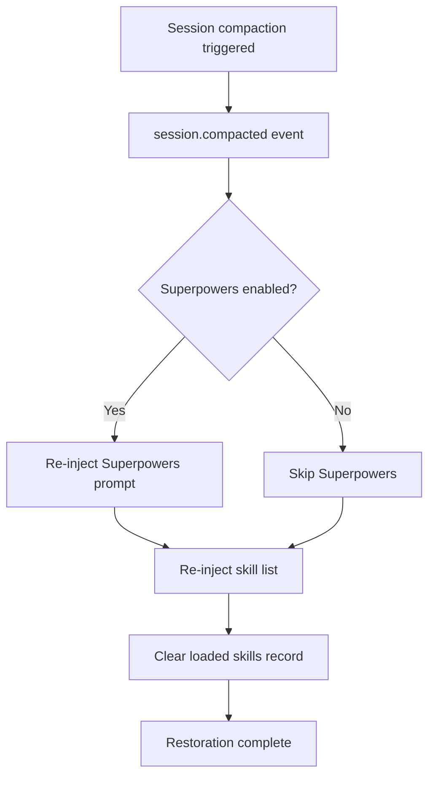

# Context Compaction Resilience

## What You'll Learn

- Understand how plugins keep skills available after session compaction
- Know when compaction restoration triggers and its execution flow
- Be able to verify that compaction restoration works correctly
- Understand the role of synthetic messages in the restoration mechanism

## Your Current Struggle

In long sessions, OpenCode performs **context compaction** to save tokens. The compacted session retains only recent messages, and early history (including previously injected skill content) is removed.

This creates a problem: if skill content is compacted away, the AI no longer knows which skills are available and cannot use loaded skills.

## When to Use This

The compaction restoration mechanism runs **automatically**—no manual intervention is needed. But understanding its principles helps you troubleshoot in these scenarios:

- AI suddenly "forgets" skills during a long session
- Need to debug skill availability after compaction
- Want to understand the plugin's session management strategy

## Core Concept

### What is Context Compaction?

OpenCode sessions grow longer as messages accumulate. When token usage approaches the limit, the system automatically performs **context compaction**:

```
[Session Start] → [Message 1] → [Message 2] → ... → [Message 50]
                          ↑ Compaction point: keep only last 10 messages
```

After compaction, early messages (including skill injection content) are removed, and the AI only sees recent message history.

### How Compaction Restoration Works

The plugin listens for the `session.compacted` event. Once compaction is detected, it immediately executes the following restoration steps:



**Key points**:
- Restoration is **automatic**—no manual trigger required
- The restored skill list includes **all discovered skills** (not just previously loaded ones)
- The loaded skills record is cleared, allowing the AI to re-evaluate which skills it needs

### The Role of Synthetic Messages

The plugin uses the **Synthetic Message Injection** mechanism to inject content:

| Property | Value | Meaning |
|----------|-------|---------|
| `noReply` | `true` | AI does not reply to the injected content itself |
| `synthetic` | `true` | Marked as system-generated content, not counted as user input, not shown in UI |

This means the content injected during compaction restoration:
- Is completely transparent to users (invisible)
- Does not consume user message quota
- But is read and understood by the AI

## 🎒 Before You Start

This tutorial requires:
- OpenCode Agent Skills plugin installed
- Understanding of skill loading basics
- A long session for testing compaction effects

::: tip
No special preparation needed—compaction restoration is a built-in plugin feature.
:::

## Follow Along: Verify Compaction Restoration

### Step 1: Start a New Session

**Why**
Verify that the skill list is injected correctly during session initialization

Start a new session and enter any message:

```
Hello
```

**You should see**: AI responds normally, and the skill list is automatically injected in the background (invisible to users)

### Step 2: Load a Skill

**Why**
Ensure skill content is injected into the context

Call the `use_skill` tool:

```
Use get_available_skills to view available skills, then use use_skill to load one of them
```

**You should see**: AI lists available skills, then loads the skill you selected

### Step 3: Trigger Context Compaction

**Why**
Simulate a long session scenario to trigger OpenCode's compaction mechanism

Continuously send messages to simulate a long conversation:

```
Message 1: Test content
Message 2: Continue testing
...
(Repeat 20-30 messages)
```

**You should see**:
- As messages increase, session history grows longer
- After reaching a certain length, OpenCode automatically performs compaction
- After compaction, early messages (including skill injection) are removed

### Step 4: Check Restoration Effect

**Why**
Verify that the skill list is re-injected after compaction

After compaction, ask the AI to use a skill again:

```
Help me use the git-helper skill to create a new branch (assuming you have the git-helper skill installed)
```

**You should see**:
- AI still knows which skills are available (proving the skill list has been restored)
- AI can normally load and use skills (proving skill functionality is unaffected by compaction)

### Step 5: Verify Synthetic Message Injection

**Why**
Confirm that the restoration mechanism uses synthetic messages and does not interfere with the conversation

If the plugin supports it, check the session message history (depending on OpenCode functionality):

```
Use debugging tools to view session message history
```

**You should see**:
- The restored skill list messages are marked as `synthetic: true`
- These messages do not appear in the normal conversation interface

## Checkpoint ✅

After completing the above steps, you should be able to confirm:

- [ ] AI can still access the skill list in long sessions
- [ ] Skill loading functionality works normally after compaction
- [ ] The restoration process is completely transparent to users

## Common Pitfalls

### Problem 1: AI says "skill not found" after compaction

**Possible causes**:
- Plugin is not correctly listening to the `session.compacted` event
- Skill directory path has changed

**Solutions**:

1. **Verify that compaction event is triggered**
   - Follow steps 3 and 4 in "Follow Along" to confirm that AI can still access the skill list after compaction
   - If AI can use skills normally, it means the compaction restoration mechanism is working

2. **Check that the plugin is correctly loaded**
   - Restart OpenCode
   - After starting a new session, ask the AI to list available skills (`get_available_skills`)
   - If you can see the skill list, the plugin is correctly loaded

### Problem 2: Restored skill list is empty

**Possible causes**:
- No skills in the skill discovery path
- Incorrect skill file format

**Solutions**:
```bash
# Manually query available skills
Use get_available_skills to view the skill list
```

If an empty list is returned, check the skill directory and file format.

### Problem 3: Loaded skill state is lost after compaction

**This is expected behavior**, not a bug. The restoration mechanism clears the `loadedSkillsPerSession` record, allowing the AI to re-evaluate which skills it needs.

**Solution**: The AI will automatically decide whether to reload skills based on context—no manual intervention needed.

## Summary

The compaction restoration mechanism ensures skill availability in long sessions through:

1. **Listening for compaction events**: Automatically detects `session.compacted` events
2. **Re-injecting the skill list**: Uses the `<available-skills>` tag to inject all skills
3. **Optional Superpowers restoration**: If enabled, restores Superpowers prompts simultaneously
4. **Using synthetic messages**: The restoration process is transparent to users and does not affect the conversation
5. **Resetting loaded records**: Clears the loaded skills collection to allow re-evaluation

This mechanism ensures:
- Skills remain available throughout long sessions
- The restoration process is automated and seamless
- The AI can decide which skills to use based on the latest context

## Preview: Next Lesson

> In the next lesson, we'll learn **[Troubleshooting](../../faq/troubleshooting/)**.
>
> You will learn:
> - Common error and exception handling methods
> - Troubleshooting techniques related to compaction restoration
> - Solutions to other usage issues

---

## Appendix: Source Code Reference

<details>
<summary><strong>Click to expand source code locations</strong></summary>

> Last updated: 2026-01-24

| Function | File Path | Line |
|----------|-----------|------|
| Compaction event listener | [`src/plugin.ts`](https://github.com/joshuadavidthomas/opencode-agent-skills/blob/main/src/plugin.ts#L144-L157) | 144-157 |
| First message initialization | [`src/plugin.ts`](https://github.com/joshuadavidthomas/opencode-agent-skills/blob/main/src/plugin.ts#L70-L105) | 70-105 |
| Skill list injection | [`src/skills.ts`](https://github.com/joshuadavidthomas/opencode-agent-skills/blob/main/src/skills.ts#L345-L370) | 345-370 |
| Synthetic message injection | [`src/utils.ts`](https://github.com/joshuadavidthomas/opencode-agent-skills/blob/main/src/utils.ts#L147-L162) | 147-162 |
| Session state management | [`src/plugin.ts`](https://github.com/joshuadavidthomas/opencode-agent-skills/blob/main/src/plugin.ts#L25-L35) | 25-35 |

**Key variables**:
- `setupCompleteSessions: Set<string>`: Records session IDs that have completed initialization
- `loadedSkillsPerSession: Map<string, Set<string>>`: Records the names of loaded skills for each session

**Key functions**:
- `injectSkillsList()`: Injects the available skills list into the session
- `injectSyntheticContent()`: Uses synthetic messages to inject content
- `getSessionContext()`: Gets the session's model and agent information

</details>
