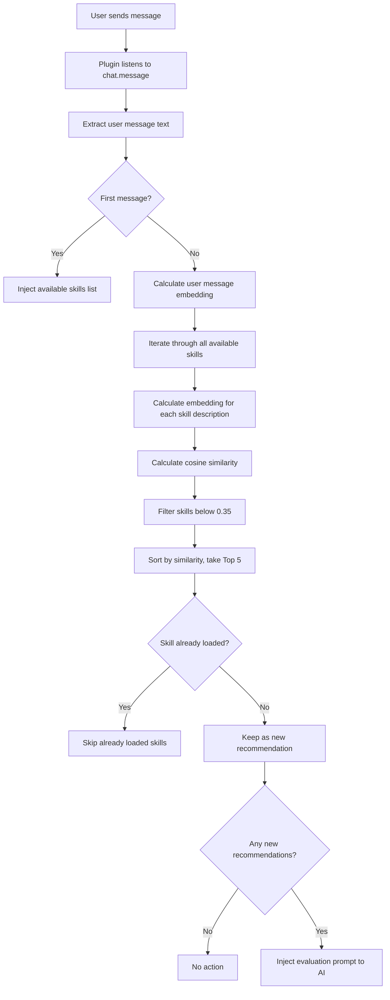

# Automatic Skill Recommendation: Semantic Matching Principles

## What You'll Learn

- Understand how plugins automatically identify skills you might need
- Master the basic principles of semantic similarity calculation
- Learn how to optimize skill descriptions for better recommendation results
- Understand how embedding caching mechanisms improve performance

## Your Current Challenge

OpenCode Agent Skills has many skills, but you:

- **Can't remember skill names** - Too many skills cause confusion
- **Don't know which one to use** - Hard to choose between similar-function skills
- **Worry about missing useful skills** - Uncertain if there's a more suitable tool

Each time, you must call `get_available_skills` to view the list, then manually load the appropriate skill—both tedious and disruptive to your workflow.

## When to Use This

Automatic skill recommendation is suitable for these scenarios:

- **Beginner stage** - Unfamiliar with the skill library, need AI to help identify
- **Feature development tasks** - Such as "create REST API," "implement authentication system," etc., usually correspond to specialized skills
- **Cross-domain work** - Occasionally touch unfamiliar domains, rely on AI recommendations
- **When the skill library is large** - With over 10 skills, manual search is inefficient

::: tip Pro Tip
Automatic recommendation doesn't force you to load skills—it just prompts AI to evaluate whether they're needed. You're free to accept or ignore suggestions.
:::

## Core Concept

### What Is Semantic Matching

Semantic matching is a technique that **understands user intent**, relying not on keyword matching but on calculating **semantic similarity** between texts.

For example:

| User Input                  | Skill Description                         | Keyword Match | Semantic Match |
| --------------------------- | ---------------------------------------- | ------------- | -------------- |
| "Create a database connection pool" | "Database connection management and optimization tool" | ❌ | ✅ |
| "Help me write API documentation" | "Automated API documentation generator" | ✅ | ✅ |
| "Project initialization scaffold" | "Quick project structure setup tool" | ❌ | ✅ |

Keyword matching only checks if words literally match, while semantic matching understands that "create," "generate," and "setup" represent the same type of action.

### Embedding: Converting Text to Numbers

To help computers understand semantics, the plugin uses an **embedding model** to convert text into **vectors** (a series of numbers).

```
Text: "Create a database connection pool"
    ↓ [Xenova/all-MiniLM-L6-v2 model]
Vector: [0.12, -0.34, 0.67, ...]  (384 dimensions, model output dimensions)
```

In this vector space:

- **Semantically similar texts** → Vectors are closer together
- **Semantically different texts** → Vectors are farther apart

::: info Why Choose all-MiniLM-L6-v2
This model has 3 advantages:
1. **Small size** - Model file is about 23MB (q8 quantization level), downloads quickly
2. **Fast speed** - Supports quantization, low inference latency
3. **High accuracy** - Performs excellently on semantic similarity tasks
:::

### Cosine Similarity: Measuring Vector Similarity

The plugin uses **cosine similarity** to calculate the similarity between two vectors.

Formula:
```
similarity = (A · B) / (|A| × |B|)
```

Where:
- `A · B` is the vector dot product
- `|A|` is the magnitude of vector A
- `|B|` is the magnitude of vector B

**Result range**: `-1` to `1`

| Similarity Range | Meaning                         | Recommended |
| ---------------- | ------------------------------- | ---------- |
| 0.7-1.0          | Very similar, almost identical | ✅ Strongly recommend |
| 0.35-0.7         | Some relevance, worth considering | ✅ Recommend |
| 0.0-0.35         | Low or no relevance             | ❌ Don't recommend |
| -1.0-0.0         | Opposite meaning                | ❌ Don't recommend |

::: warning Note
Current threshold is **0.35**—skills below this score won't appear in the recommendation list.
:::

## Automatic Recommendation Workflow

### Complete Workflow Diagram



### Phase 1: First Message - Inject Skill List

When the session receives a message for the first time, the plugin will:

1. Scan all skill directories
2. Inject the skill list into the session context
3. Format as follows:

```xml
<available-skills>
- git-helper: Git operations helper tool, providing common Git commands
- test-runner: Testing framework integration, automatically discover and run tests
- api-doc: API documentation generation tool
...
</available-skills>
```

**Purpose**: Let AI know what skills are available, avoiding repeated queries.

### Phase 2: Subsequent Messages - Semantic Matching

Starting from the second message, each user input triggers the matching process:

```typescript
// Source: src/plugin.ts:125-141
const matchedSkills = await matchSkills(userText, skills);
const loadedSkills = getLoadedSkills(sessionID);
const newSkills = matchedSkills.filter(s => !loadedSkills.has(s.name));
```

**Key points**:
- Only calculate similarity for **unloaded skills**
- Loaded skills are **automatically filtered**
- Avoid repeatedly recommending the same skill

### Phase 3: Inject Evaluation Prompt

When relevant skills are found, the plugin injects a **hidden prompt** to the AI:

```xml
<skill-evaluation-required>
SKILL EVALUATION PROCESS

The following skills may be relevant to your request:

- git-helper: Git operations helper tool
- test-runner: Testing framework integration

Step 1 - EVALUATE: Determine if these skills would genuinely help
Step 2 - DECIDE: Choose which skills (if any) are actually needed
Step 3 - ACTIVATE: Call use_skill("name") for each chosen skill

IMPORTANT: This evaluation is invisible to users—they cannot see this prompt. Do NOT announce your decision. Simply activate relevant skills or proceed directly with the request.
</skill-evaluation-required>
```

**AI's options**:
- **Accept recommendation** - Call `use_skill("skill-name")` to load the skill
- **Reject recommendation** - Process user request directly without loading skills
- **Partially accept** - Load only some of the relevant skills

::: tip Hidden Prompt
This evaluation prompt is a `synthetic: true` message—users cannot see it in the interface. AI processes it internally and decides automatically.
:::

## Follow Along: Optimize Skill Descriptions

If your skill isn't being automatically recommended, try optimizing the description.

### Check Current Skill Description

```bash
# List all skills
get_available_skills()
```

Find the skill you want to optimize and note its current description.

### View Examples: Good vs Bad Descriptions

| ❌ Bad Description                              | ✅ Good Description                                    |
| --------------------------------------------- | ----------------------------------------------------- |
| "Tool"                                        | "Automated testing framework integration, supports Jest and Vitest" |
| "Help"                                        | "Git operations assistant, providing common commands and workflow guidance" |
| "Documentation"                               | "Generate API documentation from code comments"       |
| "Database related"                            | "PostgreSQL database connection pool and query optimization tool" |

**Optimization principles**:

1. **Include keywords** - Technical terms users commonly use
2. **Explain purpose** - Clearly describe what problem it solves
3. **Avoid vague descriptions** - Don't just write "tool" or "assistant"
4. **Appropriate length** - 10-30 characters is best

### Update Skill Description

Edit the skill's `SKILL.md` file:

```markdown
---
name: test-runner
description: Automated testing framework integration, supports Jest and Vitest, automatically discover and run tests
---

# Test Runner

This skill helps you set up testing frameworks in your project...
```

**Auto-effective**: In the next session, the plugin will recalculate embeddings, and the new description takes effect immediately.

## Checklist ✅

### Verify Automatic Recommendation Works

1. **Create a test skill**:

```bash
# Create test skill in .opencode/skills/ directory
mkdir -p .opencode/skills/example-skill
cat > .opencode/skills/example-skill/SKILL.md << 'EOF'
---
name: example-skill
description: Help users create and configure TypeScript projects
---

# Example Skill

This is a test skill...
EOF
```

2. **Send a related message**:

In OpenCode, enter:

```
我要初始化一个 TypeScript 项目
```

3. **Check if recommendation is triggered**:

Open developer tools or check AI's tool call records:
- **Success** - AI called `use_skill("example-skill")`
- **Failure** - No relevant recommendation, check if description is too vague

### Verify Already Loaded Skills Aren't Repeatedly Recommended

1. **Manually load a skill**:

```bash
use_skill("example-skill")
```

2. **Send a related message again**:

```
我要初始化另一个 TypeScript 项目
```

3. **Confirm no recommendation**:

System should **not** inject evaluation prompt because the skill is already loaded.

## Common Pitfalls

### Pitfall 1: Recommended Skills Are Completely Unrelated

**Symptoms**:
- User says "how to deploy to AWS" but "local testing tool" is recommended
- Similarity score is high but semantics are completely wrong

**Causes**:
- Skill description is too vague, such as "cloud service tool"
- Embedding model has bias understanding certain technical terms

**Solutions**:

1. **Make description more specific**:

```markdown
# ❌ Bad
description: 云服务部署工具

# ✅ Good
description: AWS EC2 deployment tool, automatically configures load balancer and auto-scaling
```

2. **Include core technical keywords**:

```markdown
description: AWS S3 file upload and CDN distribution tool, supports CloudFront
```

### Pitfall 2: Useful Skills Not Recommended

**Symptoms**:
- Your input clearly matches a skill, but system didn't recommend it
- Need to manually call `get_available_skills()` to find it

**Causes**:
- Similarity is below threshold 0.35
- Large difference between skill description and user's habitual wording

**Solutions**:

1. **Lower threshold** (source code modification):

```typescript
// src/embeddings.ts:10
const SIMILARITY_THRESHOLD = 0.30; // Lower from 0.35 to 0.30
```

::: warning Caution in Production
Lowering the threshold increases false recommendations (unrelated skills). Test before adjusting.
:::

2. **Increase Top K**:

```typescript
// src/embeddings.ts:11
const TOP_K = 10; // Increase from 5 to 10
```

3. **Optimize skill description**, refer to the "Optimize Skill Description" section above.

### Pitfall 3: Slow First Load

**Symptoms**:
- First time use, skill recommendation takes 2-3 seconds
- Subsequent use is normal

**Causes**:
- Embedding model needs to be downloaded from network (23MB)
- First time requires calculating embeddings for all skills

**Solutions**:

The plugin has a **caching mechanism**, automatically optimized after first use:

```
Cache path: ~/.cache/opencode-agent-skills/embeddings/
```

**View cache files**:

```bash
ls -lh ~/.cache/opencode-agent-skills/embeddings/
```

You'll see `.bin` files—each file is an embedding cache (named by content SHA256).

**Manually warm up cache**:

```bash
# Restart OpenCode
# Plugin calls precomputeSkillEmbeddings() on startup
```

Source code location: `src/embeddings.ts:96-102`

```typescript
export async function precomputeSkillEmbeddings(skills: SkillSummary[]): Promise<void> {
  await Promise.all(
    skills.map(skill =>
      getEmbedding(skill.description).catch(() => { })
    )
  );
}
```

**No worries**: As long as you don't modify skill descriptions, cache is permanently valid.

## Lesson Summary

Automatic skill recommendation improves experience through:

| Technique          | Effect                          | User Experience Improvement          |
| ----------------- | ------------------------------- | ------------------------------------ |
| Embedding model   | Convert text to vectors         | Understand semantics, not just keywords |
| Cosine similarity | Calculate vector similarity     | Accurately match relevant skills     |
| Caching mechanism | Disk cache embeddings           | Faster response after first time     |
| Intelligent evaluation | Let AI decide if skill is needed | Non-intrusive, avoids disruption      |
| Loaded filtering  | Skip already loaded skills      | Avoid repeated recommendations        |

**Core advantages**:

- **No memorization needed** - No need to remember skill names
- **Intelligent identification** - AI automatically discovers tools you need
- **Non-intrusive** - Prompts are hidden, users don't feel interrupted

---

## Preview of Next Lesson

> In the next lesson, we'll learn **[Executing Skill Scripts](../executing-skill-scripts/)**.
>
> Skills aren't just documentation—they can also contain automation scripts. You'll learn:
> - How to organize executable scripts in skill directories
> - Use the `run_skill_script` tool to execute scripts
> - Script permissions and security restrictions
> - Common script use cases (build, test, deploy, etc.)


---

## Appendix: Source Reference

<details>
<summary><strong>Click to expand source code locations</strong></summary>

> Last updated: 2026-01-24

| Function              | File Path                                                                                                | Line Range |
| ------------------- | --------------------------------------------------------------------------------------------------- | ---------- |
| Semantic matching core function      | [`src/embeddings.ts`](https://github.com/joshuadavidthomas/opencode-agent-skills/blob/main/src/embeddings.ts#L108-L135)       | 108-135 |
| Generate text embedding   | [`src/embeddings.ts`](https://github.com/joshuadavidthomas/opencode-agent-skills/blob/main/src/embeddings.ts#L38-L66)         | 38-66   |
| Calculate cosine similarity      | [`src/embeddings.ts`](https://github.com/joshuadavidthomas/opencode-agent-skills/blob/main/src/embeddings.ts#L71-L90)         | 71-90   |
| Precompute skill embeddings | [`src/embeddings.ts`](https://github.com/joshuadavidthomas/opencode-agent-skills/blob/main/src/embeddings.ts#L96-L102)        | 96-102  |
| Format matched result prompt     | [`src/plugin.ts`](https://github.com/joshuadavidthomas/opencode-agent-skills/blob/main/src/plugin.ts#L37-L57)             | 37-57   |
| Automatic matching workflow logic      | [`src/plugin.ts`](https://github.com/joshuadavidthomas/opencode-agent-skills/blob/main/src/plugin.ts#L125-L141)            | 125-141 |
| Message listener event processing     | [`src/plugin.ts`](https://github.com/joshuadavidthomas/opencode-agent-skills/blob/main/src/plugin.ts#L66-L142)            | 66-142  |

**Key Constants**:

| Constant Name                  | Value                         | Description             | Source               |
| ------------------- | ------------------------ | -------------- | ---------------- |
| MODEL_NAME          | Xenova/all-MiniLM-L6-v2  | Embedding model used | `embeddings.ts:8`   |
| QUANTIZATION        | q8                       | Model quantization level        | `embeddings.ts:9`   |
| SIMILARITY_THRESHOLD | 0.35                     | Similarity recommendation threshold      | `embeddings.ts:10`  |
| TOP_K              | 5                        | Number of Top K skills returned  | `embeddings.ts:11`  |

**Key Functions**:

- `matchSkills()`: Calculate semantic similarity between user messages and skill descriptions, return most relevant skill list
- `getEmbedding()`: Generate embedding vector for text, supports disk caching
- `cosineSimilarity()`: Calculate cosine similarity between two vectors
- `precomputeSkillEmbeddings()`: Precompute embeddings for all skills on plugin startup, accelerate subsequent matching
- `formatMatchedSkillsInjection()`: Format matching results as evaluation prompt, inject to AI

**Caching Mechanism**:

Embedding cache path:
- Linux/macOS: `~/.cache/opencode-agent-skills/embeddings/`
- Customizable: Modify through `XDG_CACHE_HOME` environment variable

Cache files are named by content SHA256, such as `a1b2c3d4.bin`, each file contains a Float32Array vector.

</details>
