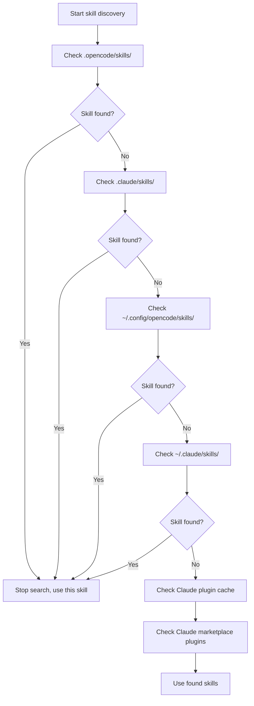

# Skill Discovery Mechanism Explained

## What You'll Learn

- Understand where the plugin automatically discovers skills from
- Master the priority rules for skill discovery
- Know how to make project-level skills override user-level skills
- Learn about Claude Code skill compatibility

## Your Current Challenge

You've created a skill, but the AI keeps saying "skill not found." You don't know where the plugin looks for skills, and you're unsure what happens with skills that share the same name. The result is skills in the wrong location, or being overridden by skills from other locations.

## When to Use This

- When you need a specific skill to take effect in your project
- When you want to override user-level or built-in skills
- When reusing Claude Code skills

## 🎒 Before You Begin

::: warning Prerequisite
Complete [Install OpenCode Agent Skills](../../start/installation/) first.
:::

## Core Concept

OpenCode Agent Skills automatically discovers skills from multiple locations, searching in priority order. **The first skill found takes effect; subsequent skills with the same name are ignored.** This lets you override user-level skills within your project for customization.

### Discovery Paths Overview



::: info Skill Name Uniqueness
Only the first discovered skill with a given name is retained; subsequent ones are ignored. This means a project-level `git-helper` overrides a user-level `git-helper`.
:::

## Follow Along

### Step 1: View Skill Discovery Logic

**Why**
Understanding how the plugin scans skill directories helps you troubleshoot issues.

View the discovery path definition in the source code:

```typescript
// src/skills.ts:241-246
const discoveryPaths: DiscoveryPath[] = [
  { path: path.join(directory, '.opencode', 'skills'), label: 'project', maxDepth: 3 },
  { path: path.join(directory, '.claude', 'skills'), label: 'claude-project', maxDepth: 1 },
  { path: path.join(homedir(), '.config', 'opencode', 'skills'), label: 'user', maxDepth: 3 },
  { path: path.join(homedir(), '.claude', 'skills'), label: 'claude-user', maxDepth: 1 }
];
```

**What you should see**:
- 4 local discovery paths, each with a `label` (source identifier) and `maxDepth` (maximum recursion depth)
- 2 additional Claude plugin paths (cache and marketplace plugins) discovered via `discoverPluginCacheSkills()` and `discoverMarketplaceSkills()`
- `directory` is the project root directory, `homedir()` is the user's home directory

### Step 2: Understand Recursive Search Mechanism

**Why**
Understanding recursion depth limits prevents you from placing skills too deep to be found.

The recursive search function traverses the directory tree looking for `SKILL.md` files:

```typescript
// src/skills.ts:182-207
async function recurse(dir: string, depth: number, relPath: string) {
  if (depth > maxDepth) return;  // Exceeds depth limit, stop searching

  const entries = await fs.readdir(dir, { withFileTypes: true });
  for (const entry of entries) {
    const fullPath = path.join(dir, entry.name);
    const stats = await fs.stat(fullPath);

    if (!stats.isDirectory()) continue;  // Skip files

    const newRelPath = relPath ? `${relPath}/${entry.name}` : entry.name;
    const found = await findFile(fullPath, newRelPath, 'SKILL.md');

    if (found) {
      results.push({ ...found, label });  // Found skill, add result
    } else {
      await recurse(fullPath, depth + 1, newRelPath);  // Recursively search subdirectories
    }
  }
}
```

**What you should see**:
- Each directory depth starts at 0; search stops when `maxDepth` is exceeded
- Returns when `SKILL.md` is found, otherwise continues searching subdirectories

**Recursion Depth by Location**:

| Location                    | Label          | Max Depth | Notes                       |
| --------------------------- | -------------- | --------- | --------------------------- |
| `.opencode/skills/`         | project        | 3         | Supports nested directories |
| `.claude/skills/`           | claude-project | 1         | Scans only the first level  |
| `~/.config/opencode/skills/` | user           | 3         | Supports nested directories |
| `~/.claude/skills/`         | claude-user    | 1         | Scans only the first level  |

### Step 3: Understand Deduplication Rules

**Why**
Only one skill with the same name is retained. Knowing this rule prevents your skills from being overridden.

Deduplication logic is in the `discoverAllSkills` function:

```typescript
// src/skills.ts:255-262
const skillsByName = new Map<string, Skill>();
for (const { filePath, relativePath, label } of allResults) {
  const skill = await parseSkillFile(filePath, relativePath, label);
  if (!skill || skillsByName.has(skill.name)) continue;  // Skip existing skill with same name
  skillsByName.set(skill.name, skill);
}
```

**What you should see**:
- Uses `Map` to store by `skill.name`, ensuring uniqueness
- `skillsByName.has(skill.name)` checks if a skill with the same name already exists
- Subsequent skills with the same name are ignored (`continue`)

**Scenario Example**:

```
Project structure:
.opencode/skills/git-helper/SKILL.md  ← First discovered, takes effect
~/.config/opencode/skills/git-helper/SKILL.md  ← Same name, ignored
```

### Step 4: Parse SKILL.md Files

**Why**
Understanding SKILL.md parsing rules helps you avoid format errors.

The plugin parses the YAML frontmatter of SKILL.md:

```typescript
// src/skills.ts:132-152
const frontmatterMatch = content.match(/^---\n([\s\S]*?)\n---\n([\s\S]*)$/);
if (!frontmatterMatch?.[1] || !frontmatterMatch?.[2]) {
  return null;  // Format error, skip
}

const frontmatterText = frontmatterMatch[1];
const skillContent = frontmatterMatch[2].trim();

let frontmatterObj: unknown;
try {
  frontmatterObj = parseYamlFrontmatter(frontmatterText);
} catch {
  return null;  // YAML parsing failed, skip
}

let frontmatter: SkillFrontmatter;
try {
  frontmatter = SkillFrontmatterSchema.parse(frontmatterObj);
} catch (error) {
  return null;  // Validation failed, skip
}
```

**What you should see**:
- Frontmatter must be wrapped with `---`
- YAML content must conform to Zod Schema validation
- Skills that fail to parse are ignored (no error is thrown; discovery continues for other skills)

**Frontmatter Validation Rules**:

```typescript
// src/skills.ts:106-114
const SkillFrontmatterSchema = z.object({
  name: z.string()
    .regex(/^[\p{Ll}\p{N}-]+$/u, { message: "Name must be lowercase alphanumeric with hyphens" })
    .min(1, { message: "Name cannot be empty" }),
  description: z.string()
    .min(1, { message: "Description cannot be empty" }),
  license: z.string().optional(),
  "allowed-tools": z.array(z.string()).optional(),
  metadata: z.record(z.string(), z.string()).optional()
});
```

**Name Conventions**:
- Only lowercase letters, numbers, and hyphens (`-`) are allowed
- Spaces, uppercase letters, and underscores are not allowed

| ❌ Incorrect Skill Name | ✅ Correct Skill Name |
| ----------------------- | --------------------- |
| `MySkill`               | `my-skill`            |
| `git_helper`            | `git-helper`          |
| `Git Helper`            | `git-helper`          |

### Step 5: Discover Executable Scripts

**Why**
Skills can include automation scripts. Understanding the script discovery mechanism helps you configure them correctly.

The plugin recursively scans the skill directory for executable files:

```typescript
// src/skills.ts:61-93
const scripts: Script[] = [];
const skipDirs = new Set(['node_modules', '__pycache__', '.git', '.venv', 'venv', '.tox', '.nox']);

async function recurse(dir: string, depth: number, relPath: string) {
  if (depth > maxDepth) return;

  const entries = await fs.readdir(dir, { withFileTypes: true });
  for (const entry of entries) {
    if (entry.name.startsWith('.')) continue;  // Skip hidden directories
    if (skipDirs.has(entry.name)) continue;    // Skip dependency directories

    const fullPath = path.join(dir, entry.name);
    const stats = await fs.stat(fullPath);

    if (stats.isDirectory()) {
      await recurse(fullPath, depth + 1, newRelPath);
    } else if (stats.isFile()) {
      if (stats.mode & 0o111) {  // Check executable bit
        scripts.push({
          relativePath: newRelPath,
          absolutePath: fullPath
        });
      }
    }
  }
}
```

**What you should see**:
- Only scans files with the executable bit (`0o111`) set
- Automatically skips hidden directories and common dependency directories
- Maximum recursion depth is 10 levels

**Script Discovery Rules**:

| Rule                  | Description                                          |
| --------------------- | ---------------------------------------------------- |
| Executable bit check  | Files must have execute permission (`chmod +x`)      |
| Skip hidden dirs      | Does not scan `.git`, `.venv`, etc.                  |
| Skip dependency dirs  | Does not scan `node_modules`, `__pycache__`, etc.    |
| Max depth 10 levels   | Nested directories deeper than 10 levels aren't scanned |

### Step 6: Claude Code Plugin Compatibility

**Why**
Understanding Claude Code plugin compatibility helps you reuse existing skills.

The plugin scans Claude Code's plugin cache and marketplace installation directory:

```typescript
// src/claude.ts:115-145
async function discoverMarketplaceSkills(): Promise<LabeledDiscoveryResult[]> {
  const claudeDir = path.join(homedir(), ".claude", "plugins");
  const installedPath = path.join(claudeDir, "installed_plugins.json");

  let installed: InstalledPlugins;
  try {
    const content = await fs.readFile(installedPath, "utf-8");
    installed = JSON.parse(content);
  } catch {
    return [];
  }

  const isV2 = installed.version === 2;

  for (const pluginKey of Object.keys(installed.plugins || {})) {
    const pluginData = installed.plugins[pluginKey];
    if (!pluginData) continue;

    if (isV2 || Array.isArray(pluginData)) {
      // v2 format: use installPath directly from each installation entry
      const installPaths = getPluginInstallPaths(pluginData);
      for (const installPath of installPaths) {
        const skills = await discoverSkillsFromPluginDir(installPath);
        results.push(...skills);
      }
    } else {
      // v1 format: use marketplace manifest to find skills
      // ...
    }
  }
}
```

**What you should see**:
- Reads Claude Code's `installed_plugins.json` file
- Supports both v1 and v2 plugin formats
- Scans for `SKILL.md` files from plugin installation paths

**Claude Code Plugin Structure**:

Cache directory structure (plugin cache):

```
~/.claude/plugins/
├── cache/                    # Plugin cache
│   ├── plugin-name/         # v1 structure
│   │   └── skills/
│   │       └── skill-name/SKILL.md
│   └── marketplace-name/    # v2 structure
│       └── plugin-name/
│           └── version/
│               └── skills/
│                   └── skill-name/SKILL.md
└── installed_plugins.json   # Plugin installation manifest
```

**Marketplace Plugins (v2)**:
- The actual plugin path is read from the `installPath` field in `installed_plugins.json`
- The path is not fixed; it can be in any scope: `managed`, `user`, `project`, or `local`
- Each plugin directory has a `skills/` subdirectory containing individual skills

## Checkpoint ✅

Verify you've mastered the skill discovery mechanism:

- [ ] Know the priority order of the 6 skill discovery paths
- [ ] Understand that only the first discovered skill with the same name is retained
- [ ] Know the recursion depth limits for different locations
- [ ] Understand SKILL.md validation rules
- [ ] Know how to make project-level skills override user-level skills

## Common Pitfalls

### ❌ Skills in the Wrong Location

**Problem**: Skill is placed in `~/.config/opencode/skills/`, but a skill with the same name exists in the project, causing it to be overridden.

**Solution**: Place project-specific skills in `.opencode/skills/` to ensure the highest priority.

### ❌ Invalid Skill Name

**Problem**: The `name` field in SKILL.md contains uppercase letters or spaces, causing parsing to fail.

**Solution**: Ensure the skill name follows the `lowercase-alphanumeric-with-hyphens` convention, such as `git-helper`.

### ❌ Scripts Without Execute Permission

**Problem**: Skill scripts cannot be executed by the `run_skill_script` tool.

**Solution**: Add execute permission to scripts:
```bash
chmod +x tools/build.sh
```

### ❌ Skills Too Deep to Be Found

**Problem**: Skill is placed in `~/.config/opencode/skills/category/subcategory/skill/`, exceeding the recursion depth limit.

**Solution**: Ensure the skill directory depth does not exceed the `maxDepth` limit for that location.

## Summary

OpenCode Agent Skills automatically discovers skills from multiple locations, searching in priority order:

1. **Priority Order** (high to low): `.opencode/skills/` → `.claude/skills/` → `~/.config/opencode/skills/` → `~/.claude/skills/` → Claude plugin cache (`~/.claude/plugins/cache/`) → Claude marketplace plugins (installation paths read from `installed_plugins.json`)

2. **Deduplication Rule**: Only the first discovered skill with a given name is retained; project-level skills override user-level skills.

3. **Recursion Depth**: Different locations have different recursion depths; placing skills too deep may prevent them from being found.

4. **Format Validation**: SKILL.md frontmatter must conform to Zod Schema validation, otherwise it's ignored.

5. **Script Discovery**: Only files with the executable bit set are recognized as scripts.

## Next Up

> In the next lesson, we'll learn **[Querying and Listing Available Skills](../listing-available-skills/)**.
>
> You'll learn:
> - Using the `get_available_skills` tool to view all available skills
> - Understanding how to use skill namespaces
> - How to find skills with fuzzy matching

---

## Appendix: Source Code Reference

<details>
<summary><strong>Click to expand source code locations</strong></summary>

> Last updated: 2026-01-24

| Feature                  | File Path                                                                                      | Lines   |
| ------------------------ | ---------------------------------------------------------------------------------------------- | ------- |
| Discovery paths          | [`src/skills.ts`](https://github.com/joshuadavidthomas/opencode-agent-skills/blob/main/src/skills.ts#L241-L246)     | 241-246 |
| Discover all skills      | [`src/skills.ts`](https://github.com/joshuadavidthomas/opencode-agent-skills/blob/main/src/skills.ts#L240-L263)     | 240-263 |
| Recursive search skills  | [`src/skills.ts`](https://github.com/joshuadavidthomas/opencode-agent-skills/blob/main/src/skills.ts#L176-L218)     | 176-218 |
| SkillLabel enum          | [`src/skills.ts`](https://github.com/joshuadavidthomas/opencode-agent-skills/blob/main/src/skills.ts#L30)              | 30      |
| Deduplication logic      | [`src/skills.ts`](https://github.com/joshuadavidthomas/opencode-agent-skills/blob/main/src/skills.ts#L255-L262)     | 255-262 |
| Frontmatter parsing      | [`src/skills.ts`](https://github.com/joshuadavidthomas/opencode-agent-skills/blob/main/src/skills.ts#L122-L167)      | 122-167 |
| Schema validation        | [`src/skills.ts`](https://github.com/joshuadavidthomas/opencode-agent-skills/blob/main/src/skills.ts#L105-L114)     | 105-114 |
| Script discovery         | [`src/skills.ts`](https://github.com/joshuadavidthomas/opencode-agent-skills/blob/main/src/skills.ts#L59-L99)       | 59-99   |
| Claude marketplace plugin discovery | [`src/claude.ts`](https://github.com/joshuadavidthomas/opencode-agent-skills/blob/main/src/claude.ts#L115-L180)     | 115-180 |
| Claude cache plugin discovery | [`src/claude.ts`](https://github.com/joshuadavidthomas/opencode-agent-skills/blob/main/src/claude.ts#L193-L253)     | 193-253 |

**Key Constants**:
- `maxDepth` (varies by location): Recursion depth limit

**Key Functions**:
- `discoverAllSkills()`: Discover skills from all paths
- `findSkillsRecursive()`: Recursively search skill directories
- `parseSkillFile()`: Parse SKILL.md file
- `discoverMarketplaceSkills()`: Discover Claude marketplace plugins
- `discoverPluginCacheSkills()`: Discover Claude cached plugins

</details>
