# Quiet Hours: Avoid Interruptions During Specific Time Periods

## What You'll Learn

- Enable quiet hours in your configuration file to avoid interruptions during rest periods
- Understand the working principles and time calculation logic of quiet hours
- Configure cross-midnight time ranges (e.g., 22:00 - 08:00)
- Learn the priority relationship between quiet hours and other intelligent filtering mechanisms

## Your Current Problem

You may have encountered this situation: You delegate a task to AI at 10 PM and go to rest. Then at 2 AM, AI completes the task, and a "ding" notification wakes you up. Or you let AI process some files during your lunch break, and at 12:05 a notification sounds, interrupting your rest.

::: info What Are Quiet Hours
Quiet hours is a time range configuration. During this time period, opencode-notify stops sending all notifications, avoiding interruptions during times when you don't want to be disturbed.
:::

## When to Use This

- **Nighttime Rest**: Set 22:00 - 08:00 to avoid being disturbed while sleeping
- **Lunch Break**: Set 12:00 - 13:00 to avoid interruptions during midday rest
- **Focused Work Time**: Set 09:00 - 12:00 to avoid being interrupted by notifications during meetings
- **No Work Weekends**: Set the entire weekend as quiet hours

Quiet hours are best used to protect your rest time or focused work time, letting AI complete tasks silently in the background until you're ready to check the results.

## Core Concept

The working principle of quiet hours is simple:

1. **Time Check**: Before sending a notification, the plugin checks if the current time is within the configured quiet hours
2. **Time Range Support**: Supports any time range, including cross-midnight time ranges (e.g., 22:00 - 08:00)
3. **Moderate Priority**: Quiet hours check has lower priority than parent session check, but higher than terminal focus detection. If it's currently a child session and `notifyChildSessions` is false, the quiet hours check is skipped directly.

::: tip Quiet Hours vs. Temporary Disabling
Quiet hours is a **recurring periodic** time configuration, such as 10 PM to 8 AM every day. If you want to **temporarily disable** notifications (e.g., no notifications for the next hour), you can set `"enabled": false` in the configuration file, or delete the configuration file to return to default values.
:::

## Follow Along

### Step 1: Open Configuration File

The configuration file is located at: `~/.config/opencode/kdco-notify.json`

If the file doesn't exist, you can create it first:

::: code-group

```bash [macOS/Linux]
vim ~/.config/opencode/kdco-notify.json
```

```powershell [Windows]
notepad $env:USERPROFILE\.config\opencode\kdco-notify.json
```

:::

You should see the configuration file content (if it exists), or a blank file.

### Step 2: Add Quiet Hours Configuration

Add or modify the `quietHours` section in the configuration file:

```json
{
  "quietHours": {
    "enabled": true,
    "start": "22:00",
    "end": "08:00"
  }
}
```

**Configuration Options**:

| Option | Type | Default | Description |
|--- | --- | --- | ---|
| `enabled` | boolean | `false` | Whether to enable quiet hours |
| `start` | string | `"22:00"` | Quiet hours start time, format is `"HH:MM"` |
| `end` | string | `"08:00"` | Quiet hours end time, format is `"HH:MM"` |

### Step 3: Save Configuration File

Save the file and exit the editor.

**Checkpoint ✅**: Run the following command to verify the configuration file format is correct:

```bash
cat ~/.config/opencode/kdco-notify.json | jq .
```

You should see formatted JSON content with no error messages.

::: tip No jq installed?
If your system doesn't have the `jq` command, you can skip this check, or copy the JSON content to [JSON Validator](https://jsonlint.com/) in your browser to check.
:::

### Step 4: Restart OpenCode

After modifying the configuration file, you need to restart OpenCode for changes to take effect.

**Checkpoint ✅**: After restart, OpenCode automatically reloads the configuration.

### Step 5: Test Quiet Hours

To verify that quiet hours are working, you can:

1. Set `start` and `end` to values near the current time (e.g., if it's 14:00, set 13:55 - 14:05)
2. Delegate a simple task to AI
3. Wait for the task to complete

You should see: **No notifications received during quiet hours**.

**Note**: If the current time is not within quiet hours, or `enabled` is `false`, you will receive notifications normally.

### Step 6: Restore Common Configuration

After testing, change the configuration back to your common time range (e.g., 22:00 - 08:00):

```json
{
  "quietHours": {
    "enabled": true,
    "start": "22:00",
    "end": "08:00"
  }
}
```

Save the configuration file and restart OpenCode.

## Common Pitfalls

### Common Error 1: Forgot to Enable Quiet Hours

**Problem**: Configured `start` and `end`, but still receiving notifications.

**Cause**: The `enabled` field is `false` or not set.

**Solution**: Ensure `enabled` is set to `true`:

```json
{
  "quietHours": {
    "enabled": true,
    "start": "22:00",
    "end": "08:00"
  }
}
```

### Common Error 2: Incorrect Time Format

**Problem**: Configuration doesn't take effect, or errors occur at startup.

**Cause**: Time format is not `"HH:MM"` format, or 12-hour format (AM/PM) is used.

**Incorrect Example**:
```json
{
  "start": "10 PM",  // ❌ Wrong: AM/PM not supported
  "end": "8:00"      // ⚠️ Works, but "08:00" recommended for consistency
}
```

**Correct Example**:
```json
{
  "start": "22:00",  // ✅ Correct: 24-hour format, leading zero recommended
  "end": "08:00"     // ✅ Correct: 24-hour format, leading zero recommended
}
```

### Common Error 3: Misunderstanding Cross-Midnight Time

**Problem**: Set 22:00 - 08:00, but find that certain daytime periods are also quiet.

**Cause**: Incorrectly assumed `start` must be less than `end`, leading to incorrect time range calculation.

**Correct Understanding**:
- 22:00 - 08:00 means: **10 PM to 8 AM the next day**
- This is a cross-midnight time range that the plugin automatically recognizes
- It is NOT 08:00 - 22:00 (if set that way, the entire daytime would be quiet)

::: tip Verifying Cross-Midnight Time Ranges
If you want to verify that cross-midnight time ranges are correctly configured, you can set a short test period (e.g., 10 minutes) in the configuration file, then observe whether you don't receive notifications during the expected time period.
:::

### Common Error 4: Didn't Restart OpenCode

**Problem**: After modifying the configuration file, quiet hours still work according to the old configuration.

**Cause**: The configuration file is loaded once when the plugin starts, and doesn't monitor file changes in real-time.

**Solution**: You must restart OpenCode after modifying the configuration file for changes to take effect.

## Relationship Between Quiet Hours and Other Filtering Mechanisms

The position of quiet hours in the intelligent filtering mechanism:

```mermaid
graph TD
    A[OpenCode Event Triggered] --> B{Is Parent Session?}
    B -->|No| C[🚫 No Notification]
    B -->|Yes| D{Is Quiet Hours?}
    D -->|Yes| C
    D -->|No| E{Is Terminal Focused?}
    E -->|Yes| C
    E -->|No| F[✅ Send Notification]
```



**Key Points**:

1. **Quiet Hours Have Moderate Priority**: Parent session check has the highest priority, followed by quiet hours. If it's currently a child session and `notifyChildSessions` is false, the quiet hours check is skipped directly. However, after passing the parent session check, regardless of whether the terminal is focused, no notifications will be sent as long as it's within quiet hours.
2. **Independent of Terminal Focus Detection**: Even if the terminal is not focused, no notifications will be sent during quiet hours
3. **Execution Order**: Parent session check executes before quiet hours check. Only if the parent session check passes (i.e., currently a parent session or `notifyChildSessions` is true) will the quiet hours check continue.

::: warning Special Cases: Permission Requests and Questions
Permission requests (`permission.updated`) and questions (`tool.execute.before`) in the source code **are also subject to quiet hours constraints**. This means that during quiet hours, even if AI is blocked waiting for your authorization or answer, no notifications will be sent.
:::

## Common Configuration Examples

### Example 1: Nighttime Rest

Configure 10 PM to 8 AM as quiet hours:

```json
{
  "quietHours": {
    "enabled": true,
    "start": "22:00",
    "end": "08:00"
  }
}
```

### Example 2: Lunch Break

Configure 12 PM to 1 PM as quiet hours:

```json
{
  "quietHours": {
    "enabled": true,
    "start": "12:00",
    "end": "13:00"
  }
}
```

### Example 3: Focused Work Time

Configure 9 AM to 12 PM as quiet hours (e.g., to avoid notification interruptions during meetings):

```json
{
  "quietHours": {
    "enabled": true,
    "start": "09:00",
    "end": "12:00"
  }
}
```

### Example 4: Complete Configuration

Using quiet hours together with other configuration items:

```json
{
  "enabled": true,
  "notifyChildSessions": false,
  "suppressWhenFocused": true,
  "sounds": {
    "idle": "Glass",
    "error": "Basso",
    "permission": "Submarine"
  },
  "quietHours": {
    "enabled": true,
    "start": "22:00",
    "end": "08:00"
  },
  "terminal": "ghostty"
}
```

## Summary

Quiet hours is an important feature of opencode-notify, used to avoid interruptions during specific time periods:

1. **Configuration Method**: Configure the `quietHours` section in `~/.config/opencode/kdco-notify.json`
2. **Time Format**: Use 24-hour format `"HH:MM"`, such as `"22:00"` and `"08:00"`
3. **Cross-Midnight Support**: Supports cross-midnight time ranges, such as `"22:00" - "08:00"` meaning 10 PM to 8 AM the next day
4. **Execution Order**: Parent session check → Quiet hours → Terminal focus detection. Quiet hours only take effect after passing the parent session check
5. **Restart Required**: Must restart OpenCode after modifying the configuration file for changes to take effect

By properly configuring quiet hours, you can let AI complete tasks silently during rest or focused work time, and check the results when you're ready.

## Next Lesson Preview

> In the next lesson, we'll learn **[Terminal Detection Principles](../terminal-detection/)**.
>
> You'll learn:
> - How opencode-notify automatically detects the terminal you use
> - List of 37+ supported terminal emulators
> - Methods for manually specifying terminal type
> - Implementation principles of macOS focus detection

---

## Appendix: Source Code Reference

<details>
<summary><strong>Click to expand source code locations</strong></summary>

> Last updated: 2026-01-27

| Feature | File Path | Lines |
|--- | --- | ---|
| Quiet Hours Check | [`src/notify.ts`](https://github.com/kdcokenny/opencode-notify/blob/main/src/notify.ts#L181-L199) | 181-199 |
| Configuration Interface Definition | [`src/notify.ts`](https://github.com/kdcokenny/opencode-notify/blob/main/src/notify.ts#L30-L48) | 30-48 |
| Default Configuration | [`src/notify.ts`](https://github.com/kdcokenny/opencode-notify/blob/main/src/notify.ts#L56-L68) | 56-68 |
| Quiet Check in Task Completion Handler | [`src/notify.ts`](https://github.com/kdcokenny/opencode-notify/blob/main/src/notify.ts#L262) | 262 |
| Quiet Check in Error Notification Handler | [`src/notify.ts`](https://github.com/kdcokenny/opencode-notify/blob/main/src/notify.ts#L300) | 300 |
| Quiet Check in Permission Request Handler | [`src/notify.ts`](https://github.com/kdcokenny/opencode-notify/blob/main/src/notify.ts#L323) | 323 |
| Quiet Check in Question Handler | [`src/notify.ts`](https://github.com/kdcokenny/opencode-notify/blob/main/src/notify.ts#L341) | 341 |

**Key Constants**:

- `DEFAULT_CONFIG.quietHours`: Default quiet hours configuration (lines 63-67)
  - `enabled: false`: Quiet hours not enabled by default
  - `start: "22:00"`: Default quiet hours start time
  - `end: "08:00"`: Default quiet hours end time

**Key Functions**:

- `isQuietHours(config: NotifyConfig): boolean`: Checks if current time is within quiet hours (lines 181-199)
  - First checks if `config.quietHours.enabled` is `true`
  - Converts current time to minutes
  - Converts start and end times to minutes
  - Handles cross-midnight time ranges (`startMinutes > endMinutes`)
  - Returns `true` if within quiet hours, `false` otherwise

**Business Rules**:

- BR-1-3: No notifications during quiet hours (`notify.ts:262`)
- BR-3-2: Quiet hours support cross-midnight (e.g., 22:00-08:00) (`notify.ts:193-196`)
- BR-4-1: No notifications when current time is in quiet hours (`notify.ts:182-198`)
- BR-4-2: Support cross-midnight time ranges (e.g., 22:00-08:00) (`notify.ts:194-196`)

</details>
