# Terminal Detection: Auto-Identification & macOS Focus Detection

## What You'll Learn

- Deep understanding of terminal auto-detection mechanism and implementation principles
- Master technical details of macOS focus detection and dynamic Bundle ID retrieval
- Learn manual terminal override to solve detection failures
- Understand detection differences across platforms (macOS/Windows/Linux)
- Read and understand terminal detection source code

## Your Current Problem

You know opencode-notify supports 37+ terminals and can manually specify terminal type. But you want to understand deeper:

- How is terminal detection implemented at the low level?
- What mechanism does macOS focus detection use?
- Why does macOS need Bundle ID while Windows/Linux doesn't?
- How does the plugin handle auto-detection failures?
- How are terminal multiplexers like tmux identified?

This lesson takes you into the source code to answer these technical details.

## Core Concept

Terminal detection implementation consists of three layers:

```
1. Auto-detection layer: detect-terminal library identifies terminal type
    ↓
2. Platform adaptation layer: macOS/Windows/Linux specific handling
    ↓
3. Feature enhancement layer: focus detection, click-to-focus, Bundle ID retrieval
```

**Key Design Principles**:

- **Detect once at startup**: Plugin detects terminal at startup, caches result for all subsequent notifications (performance optimization)
- **Config override first priority**: Manually specified `terminal` config takes precedence over auto-detection
- **Failure degradation**: Detection failure doesn't block notification sending, only disables smart filtering
- **Platform-specific adaptation**: macOS supports full features, Windows/Linux supports basic notifications

::: info Why detect at startup?
Terminal detection involves process scanning, osascript calls, and other operations. Detecting before every notification would incur significant performance overhead. Therefore, the plugin detects once at startup, caches the `TerminalInfo` object, and reuses it for all subsequent notifications.
:::

## Complete Terminal Detection Flow

### Source Code Analysis: detectTerminalInfo()

Let's analyze the core detection function line by line:

```typescript
// src/notify.ts:145-164
async function detectTerminalInfo(config: NotifyConfig): Promise<TerminalInfo> {
    // Use config override if provided
    const terminalName = config.terminal || detectTerminal() || null

    if (!terminalName) {
        return { name: null, bundleId: null, processName: null }
    }

    // Get process name for focus detection
    const processName = TERMINAL_PROCESS_NAMES[terminalName.toLowerCase()] || terminalName

    // Dynamically get bundle ID from macOS (no hardcoding!)
    const bundleId = await getBundleId(processName)

    return {
        name: terminalName,
        bundleId,
        processName,
    }
}
```

**Step-by-step breakdown**:

| Step | Code | Description |
|------|------|-------------|
| 1 | `config.terminal \|\| detectTerminal()` | Use config override if provided, otherwise auto-detect |
| 2 | `!terminalName ? return {...}` | Return empty object if detection fails |
| 3 | `TERMINAL_PROCESS_NAMES[...]` | Lookup mapping table to get macOS process name |
| 4 | `await getBundleId()` | macOS dynamically retrieve Bundle ID |
| 5 | `return { name, bundleId, processName }` | Return complete terminal info |

**Returned `TerminalInfo` structure**:

```typescript
interface TerminalInfo {
    name: string | null       // Terminal name, e.g., "ghostty"
    bundleId: string | null   // macOS Bundle ID, e.g., "com.mitchellh.ghostty"
    processName: string | null // macOS process name, e.g., "Ghostty"
}
```

::: details Why does macOS need three fields?
- **name**: Generic terminal name (from detect-terminal library)
- **processName**: Process name in macOS process manager (for focus detection)
- **bundleId**: macOS application unique identifier (for click-to-focus)

For example:
- `name = "ghostty"` (returned by detect-terminal)
- `processName = "Ghostty"` (mapping table lookup)
- `bundleId = "com.mitchellh.ghostty"` (osascript dynamic query)
:::

## How detect-terminal Library Works

### What is detect-terminal?

`detect-terminal` is a Node.js library specialized in identifying terminal emulators. It scans system processes to identify the currently running terminal.

**Detection methods**:

1. **Process scanning**: Checks parent process chain of current process
2. **Environment variable detection**: Checks `TERM`, `TERM_PROGRAM`, and other environment variables
3. **Known process name matching**: Compares with 37+ known terminal process names

**Supported detection approaches**:

```typescript
// detect-terminal internal logic (simplified)
function detect() {
    // 1. Check environment variables
    if (process.env.TERM_PROGRAM) {
        return process.env.TERM_PROGRAM
    }

    // 2. Scan parent process chain
    const parentProcess = getParentProcess()
    if (isKnownTerminal(parentProcess.name)) {
        return parentProcess.name
    }

    // 3. Check specific environment variables
    if (process.env.TMUX) return 'tmux'
    if (process.env.VSCODE_PID) return 'vscode'

    return null
}
```

**Supported terminal count**: 37+ (see [complete list](https://github.com/jonschlinkert/detect-terminal#supported-terminals))

## macOS Special Handling

### 1. Process Name Mapping Table

The source code defines a mapping of terminal names to macOS process names:

```typescript
// src/notify.ts:71-84
const TERMINAL_PROCESS_NAMES: Record<string, string> = {
    ghostty: "Ghostty",
    kitty: "kitty",
    iterm: "iTerm2",
    iterm2: "iTerm2",
    wezterm: "WezTerm",
    alacritty: "Alacritty",
    terminal: "Terminal",
    apple_terminal: "Terminal",
    hyper: "Hyper",
    warp: "Warp",
    vscode: "Code",
    "vscode-insiders": "Code - Insiders",
}
```

**Why is a mapping table needed?**

- detect-terminal may return lowercase or abbreviated terminal names (e.g., `"ghostty"`)
- Process names in macOS process manager may have case differences (e.g., `"Ghostty"`)
- Some terminals have multiple variations (e.g., both `"iterm"` and `"iterm2"` map to `"iTerm2"`)

**Mapping logic**:

```typescript
const processName = TERMINAL_PROCESS_NAMES[terminalName.toLowerCase()] || terminalName
```

- First convert terminal name to lowercase to lookup mapping table
- If found, use mapped process name
- If not found, use original terminal name

### 2. Dynamic Bundle ID Retrieval

**Source code implementation**:

```typescript
// src/notify.ts:135-137
async function getBundleId(appName: string): Promise<string | null> {
    return runOsascript(`id of application "${appName}"`)
}
```

**osascript command**:

```applescript
id of application "Ghostty"
-- returns: com.mitchellh.ghostty
```

**Why not hardcode Bundle ID?**

Hardcoding disadvantages:
- ❌ Bundle ID may change when terminal updates
- ❌ Need to manually maintain Bundle ID list for 37+ terminals
- ❌ Need to update code when new terminals are released

Dynamic retrieval advantages:
- ✅ Automatically adapts to terminal version changes
- ✅ Reduces maintenance cost
- ✅ Theoretically supports any macOS terminal

### 3. Focus Detection Implementation

**Source code implementation**:

```typescript
// src/notify.ts:139-143
async function getFrontmostApp(): Promise<string | null> {
    return runOsascript(
        'tell application "System Events" to get name of first application process whose frontmost is true',
    )
}

// src/notify.ts:166-175
async function isTerminalFocused(terminalInfo: TerminalInfo): Promise<boolean> {
    if (!terminalInfo.processName) return false
    if (process.platform !== "darwin") return false

    const frontmost = await getFrontmostApp()
    if (!frontmost) return false

    // Case-insensitive comparison
    return frontmost.toLowerCase() === terminalInfo.processName.toLowerCase()
}
```

**osascript command**:

```applescript
tell application "System Events" to get name of first application process whose frontmost is true
-- returns: Ghostty
```

**Detection flow**:

```
1. Check platform: non-macOS returns false immediately
    ↓
2. Check processName: return false if no process name
    ↓
3. Get frontmost app: query through osascript
    ↓
4. Compare process names: case-insensitive
    ↓
5. Return result: same means focused, different means not focused
```

**Usage in notification sending flow**:

```typescript
// src/notify.ts:264-265
// Check if terminal is focused (suppress notification if user is already looking)
if (await isTerminalFocused(terminalInfo)) return
```

When the terminal is in the foreground, the plugin suppresses notification sending to avoid duplicate alerts.

## Config Override Mechanism

### When do you need manual override?

**Applicable scenarios**:

1. **Auto-detection fails**: detect-terminal cannot recognize your terminal
2. **Nested terminal scenarios**: Using Alacritty in tmux, but want to identify as tmux
3. **Detection result inaccurate**: Incorrectly identified as another terminal

### Configuration Method

**Config file**: `~/.config/opencode/kdco-notify.json`

```json
{
  "terminal": "ghostty"
}
```

**Priority logic** (source code line 147):

```typescript
const terminalName = config.terminal || detectTerminal() || null
```

**Priority order**:

1. **Config override** (`config.terminal`): highest priority
2. **Auto-detection** (`detectTerminal()`): second priority
3. **Degradation** (`null`): use null when detection fails

::: tip Applicable scenarios for config override
If your terminal is correctly identified, manual override is **not recommended**. Config override is mainly for solving detection failures or special scenario issues.
:::

## Platform Differences Comparison

### macOS

| Feature | Support | Implementation |
|---------|---------|----------------|
| Native notifications | ✅ | node-notifier (NSUserNotificationCenter) |
| Terminal detection | ✅ | detect-terminal library |
| Focus detection | ✅ | osascript query frontmost app |
| Click-to-focus | ✅ | node-notifier activate parameter |
| Bundle ID retrieval | ✅ | osascript dynamic query |
| Custom sounds | ✅ | node-notifier sound parameter |

**Complete support flow**:


### Windows

| Feature | Support | Implementation |
|---------|---------|----------------|
| Native notifications | ✅ | node-notifier (SnoreToast) |
| Terminal detection | ✅ | detect-terminal library |
| Focus detection | ❌ | System limitation |
| Click-to-focus | ❌ | System limitation |
| Bundle ID retrieval | ❌ | No such concept in Windows |
| Custom sounds | ❌ | Use system default sound |

**Simplified flow**:

```mermaid
graph LR
    A[Detect terminal] --> B[Cache TerminalInfo]
    B --> C[Event triggered]
    C --> D{Quiet hours?}
    D -->|Yes| E[🚫 Suppress notification]
    D -->|No| F[Send notification]
    F --> G[Notification auto-dismiss]
```



### Linux

| Feature | Support | Implementation |
|---------|---------|----------------|
| Native notifications | ✅ | node-notifier (notify-send) |
| Terminal detection | ✅ | detect-terminal library |
| Focus detection | ❌ | System limitation |
| Click-to-focus | ❌ | System limitation |
| Bundle ID retrieval | ❌ | No such concept in Linux |
| Custom sounds | ❌ | Use desktop environment default sound |

**Flow is the same as Windows**, just uses `notify-send` for notification backend.

## Handling Detection Failures

### Source Code Logic

When detection fails, `detectTerminalInfo()` returns an empty object:

```typescript
if (!terminalName) {
    return { name: null, bundleId: null, processName: null }
}
```

### Impact on Notification Features

| Feature | Behavior after detection failure |
|---------|----------------------------------|
| Native notifications | ✅ **Works normally** (doesn't depend on terminal detection) |
| Focus detection | ❌ **Disabled** (`isTerminalFocused()` directly returns false) |
| Click-to-focus | ❌ **Disabled** (`bundleId` is null, doesn't set activate parameter) |
| Quiet hours | ✅ **Works normally** (independent of terminal detection) |
| Parent session check | ✅ **Works normally** (independent of terminal detection) |

**Example code**:

```typescript
// src/notify.ts:166-175
async function isTerminalFocused(terminalInfo: TerminalInfo): Promise<boolean> {
    if (!terminalInfo.processName) return false  // ← returns false immediately on detection failure
    if (process.platform !== "darwin") return false
    // ...
}

// src/notify.ts:238-240
if (process.platform === "darwin" && terminalInfo.bundleId) {
    notifyOptions.activate = terminalInfo.bundleId  // ← doesn't set when bundleId is null
}
```

### How to verify detection status?

**Temporary debug method** (requires modifying source code):

```typescript
// Add debug log at plugin export in notify.ts
export const NotifyPlugin: Plugin = async (ctx) => {
    const { client } = ctx
    const config = await loadConfig()
    const terminalInfo = await detectTerminalInfo(config)

    // 👇 Add debug log
    console.log("Terminal Info:", JSON.stringify(terminalInfo, null, 2))

    return {
        // ...
    }
}
```

**Normal output example**:

```json
{
  "name": "ghostty",
  "bundleId": "com.mitchellh.ghostty",
  "processName": "Ghostty"
}
```

**Detection failure example**:

```json
{
  "name": null,
  "bundleId": null,
  "processName": null
}
```

## Special Scenario: tmux Terminal

### tmux Speciality

tmux is a terminal multiplexer that allows creating multiple sessions and panes within a single terminal window.

**Detection method**:

```typescript
// detect-terminal library detects tmux through environment variable
if (process.env.TMUX) return 'tmux'
```

**Impact of tmux on workflow**:

As mentioned in `terminals/index.md`, focus detection is not performed in tmux workflow. This is because:

1. **Multi-window scenarios**: tmux may run in multiple terminal windows
2. **Ambiguous focus semantics**: Cannot determine which tmux pane the user is focusing on
3. **User experience consideration**: Avoid suppressing important notifications

**Source code evidence** (`handleQuestionAsked` function):

```typescript
// src/notify.ts:340-341
// Guard: quiet hours only (no focus check for questions - tmux workflow)
if (isQuietHours(config)) return
```

Note: For `question` type events, source code explicitly comments "no focus check for questions - tmux workflow".

## Best Practices for Manual Terminal Configuration

### Choosing the Right Terminal Name

**Principle**: Use standard names recognized by detect-terminal library.

**Common lookup table**:

| Your Terminal | Config Value | Detection Result (detect-terminal) |
|--------------|--------------|-------------------------------------|
| Ghostty | `"ghostty"` | ✅ |
| iTerm2 | `"iterm2"` or `"iterm"` | ✅ |
| Kitty | `"kitty"` | ✅ |
| WezTerm | `"wezterm"` | ✅ |
| Alacritty | `"alacritty"` | ✅ |
| macOS Terminal.app | `"terminal"` or `"apple_terminal"` | ✅ |
| Hyper | `"hyper"` | ✅ |
| Warp | `"warp"` | ✅ |
| VS Code Stable | `"vscode"` | ✅ |
| VS Code Insiders | `"vscode-insiders"` | ✅ |
| Windows Terminal | `"windows-terminal"` or `"Windows Terminal"` | ⚠️ May need to try both |

### Verifying Config Takes Effect

**Method 1: Check logs**

If debug logging is enabled (see above), you should see:

```json
{
  "name": "ghostty",  // ← should be your configured terminal name
  "bundleId": "com.mitchellh.ghostty",
  "processName": "Ghostty"
}
```

**Method 2: Functional test**

1. After configuring terminal type, restart OpenCode
2. Start an AI task
3. Switch to another window (let terminal lose focus)
4. Wait for task to complete

You should see: receive notification, and clicking notification (macOS) focuses to terminal window.

## Troubleshooting

### Common Issue 1: Detection still fails after configuration

**Symptom**: Set `"terminal": "ghostty"`, but notification functionality is abnormal.

**Troubleshooting steps**:

1. **Check JSON format**:

```bash
cat ~/.config/opencode/kdco-notify.json | jq .
```

2. **Check terminal name spelling**:

- Ensure lowercase (e.g., `"ghostty"` not `"Ghostty"`)
- Ensure it's a name supported by detect-terminal

3. **Check if OpenCode is restarted**:

Config file changes require restarting OpenCode to take effect.

### Common Issue 2: macOS focus detection inaccurate

**Symptom**: Notification pops up when terminal is in foreground, or notification doesn't pop up when terminal is in background.

**Possible causes**:

1. **Process name mismatch**:

Check if your terminal process name is in the mapping table:

```typescript
const TERMINAL_PROCESS_NAMES: Record<string, string> = {
    // ... check if your terminal is in the list
}
```

2. **osascript execution failure**:

Manually test in terminal:

```bash
osascript -e 'tell application "System Events" to get name of first application process whose frontmost is true'
```

Should return current frontmost app name (e.g., `Ghostty`).

3. **Case sensitivity**:

Source code uses case-insensitive comparison:

```typescript
return frontmost.toLowerCase() === terminalInfo.processName.toLowerCase()
```

Ensure process name in mapping table matches actual process name case.

### Common Issue 3: Manual config ineffective on Windows/Linux

**Symptom**: On Windows/Linux, configured `"terminal": "xxx"`, but detection still fails.

**Explanation**:

Windows/Linux terminal detection relies on detect-terminal library, and config override functionality is cross-platform in source code. If config is ineffective, possible reasons:

1. **Incorrect terminal name**: Ensure using name supported by detect-terminal
2. **Terminal not in supported list**: See [detect-terminal complete list](https://github.com/jonschlinkert/detect-terminal#supported-terminals)

**Note**: Windows/Linux don't support focus detection and click-to-focus. Even with correct config, it only affects terminal detection and won't enable these features.

### Common Issue 4: Nested terminal scenario detection error

**Scenario**: Using Alacritty in tmux, want to identify as tmux.

**Symptom**: Auto-detection identifies as `"alacritty"`, but you want to identify as `"tmux"`.

**Solution**:

Manually configure `"terminal": "tmux"`:

```json
{
  "terminal": "tmux"
}
```

**Note**: After this config, the plugin will assume you're using tmux and won't perform focus detection (consistent with tmux workflow).

## Summary

Terminal detection is the foundation of opencode-notify smart filtering feature:

1. **Detection flow**: Auto-identify terminal at startup via detect-terminal library, cache result
2. **macOS special handling**:
   - Process name mapping table (`TERMINAL_PROCESS_NAMES`)
   - Dynamic Bundle ID retrieval (via osascript)
   - Focus detection (query frontmost app process)
3. **Config override**: Manually specifying terminal type takes precedence over auto-detection
4. **Platform differences**:
   - macOS: Full features (notifications + focus detection + click-to-focus)
   - Windows/Linux: Basic notification features
5. **Failure handling**: Detection failure doesn't block notifications, only disables smart filtering
6. **Special scenarios**: tmux workflow doesn't support focus detection, avoiding suppressing important notifications

**Key source code locations**:

- `detectTerminalInfo()`: Terminal detection main function (lines 145-164)
- `TERMINAL_PROCESS_NAMES`: macOS process name mapping table (lines 71-84)
- `getBundleId()`: Dynamic Bundle ID retrieval (lines 135-137)
- `isTerminalFocused()`: Focus detection implementation (lines 166-175)

## Next Lesson Preview

> Next lesson we learn **[Advanced Usage](../advanced-usage/)**.
>
> You will learn:
> - Configuration tips and best practices
> - Multi-terminal environment configuration
> - Performance optimization suggestions
> - Collaborating with other OpenCode plugins

---

## Appendix: Source Code Reference

<details>
<summary><strong>Click to expand source code locations</strong></summary>

> Updated: 2026-01-27

| Feature | File Path | Line |
|---------|-----------|------|
| Terminal detection main function | [`src/notify.ts`](https://github.com/kdcokenny/opencode-notify/blob/main/src/notify.ts#L145-L164) | 145-164 |
| macOS process name mapping table | [`src/notify.ts`](https://github.com/kdcokenny/opencode-notify/blob/main/src/notify.ts#L71-L84) | 71-84 |
| macOS Bundle ID retrieval | [`src/notify.ts`](https://github.com/kdcokenny/opencode-notify/blob/main/src/notify.ts#L135-L137) | 135-137 |
| macOS frontmost app detection | [`src/notify.ts`](https://github.com/kdcokenny/opencode-notify/blob/main/src/notify.ts#L139-L143) | 139-143 |
| macOS focus detection | [`src/notify.ts`](https://github.com/kdcokenny/opencode-notify/blob/main/src/notify.ts#L166-L175) | 166-175 |
| osascript execution wrapper | [`src/notify.ts`](https://github.com/kdcokenny/opencode-notify/blob/main/src/notify.ts#L120-L133) | 120-133 |
| Config interface definition | [`src/notify.ts`](https://github.com/kdcokenny/opencode-notify/blob/main/src/notify.ts#L30-L54) | 30-54 |
| Focus detection in task completion handler | [`src/notify.ts`](https://github.com/kdcokenny/opencode-notify/blob/main/src/notify.ts#L265) | 265 |
| Focus detection in error notification handler | [`src/notify.ts`](https://github.com/kdcokenny/opencode-notify/blob/main/src/notify.ts#L303) | 303 |
| Focus detection in permission request handler | [`src/notify.ts`](https://github.com/kdcokenny/opencode-notify/blob/main/src/notify.ts#L326) | 326 |
| macOS click-to-focus setting | [`src/notify.ts`](https://github.com/kdcokenny/opencode-notify/blob/main/src/notify.ts#L238-L240) | 238-240 |
| Terminal detection at plugin startup | [`src/notify.ts`](https://github.com/kdcokenny/opencode-notify/blob/main/src/notify.ts#L364) | 364 |

**Key Constants**:

- `TERMINAL_PROCESS_NAMES`: Terminal name to macOS process name mapping table (lines 71-84)
  - `ghostty: "Ghostty"`
  - `kitty: "kitty"`
  - `iterm: "iTerm2"` / `iterm2: "iTerm2"`
  - `wezterm: "WezTerm"`
  - `alacritty: "Alacritty"`
  - `terminal: "Terminal"` / `apple_terminal: "Terminal"`
  - `hyper: "Hyper"`
  - `warp: "Warp"`
  - `vscode: "Code"` / `"vscode-insiders": "Code - Insiders"`

**Key Functions**:

- `detectTerminalInfo(config: NotifyConfig): Promise<TerminalInfo>`: Terminal detection main function (lines 145-164)
  - Use config override first (`config.terminal`)
  - Call detect-terminal library for auto-detection
  - Lookup process name mapping table
  - Dynamically retrieve Bundle ID (macOS)
  - Return complete terminal info object

- `isTerminalFocused(terminalInfo: TerminalInfo): Promise<boolean>`: Detect if terminal is focused (lines 166-175)
  - Check platform (macOS only)
  - Check if processName exists
  - Get current frontmost app (osascript)
  - Case-insensitive process name comparison
  - Return true means terminal is in foreground

- `getBundleId(appName: string): Promise<string | null>`: Dynamically retrieve macOS app Bundle ID (lines 135-137)
  - Use osascript to query app identifier
  - Returns format like `"com.mitchellh.ghostty"`

- `getFrontmostApp(): Promise<string | null>`: Get macOS frontmost app name (lines 139-143)
  - Use osascript to query System Events
  - Returns process name of frontmost app

- `runOsascript(script: string): Promise<string | null>`: Execute AppleScript commands (lines 120-133)
  - Platform check (macOS only)
  - Use Bun.spawn to execute osascript
  - Capture output and return
  - Exception handling returns null

**Business Rules**:

- BR-2-1: Use detect-terminal library to identify 37+ terminals (`notify.ts:147`)
- BR-2-2: Terminal name to macOS process name mapping table (`notify.ts:71-84`)
- BR-2-3: Bundle ID dynamic retrieval, no hardcoding (`notify.ts:135-137`)
- BR-2-4: Detect tmux sessions via TMUX environment variable (detection library implementation)
- BR-1-2: Suppress notifications when terminal is focused (`notify.ts:265`)
- BR-1-6: macOS supports clicking notification to focus terminal (`notify.ts:238-240`)

**External Dependencies**:

- [detect-terminal](https://github.com/jonschlinkert/detect-terminal): Terminal detection library, supports 37+ terminal emulators
- [node-notifier](https://github.com/mikaelbr/node-notifier): Cross-platform native notification library
- macOS osascript: System command-line tool for executing AppleScript

</details>
