# How It Works: Notifications, Filters, and Trigger Mechanisms

## What You'll Learn

- Understand the four notification types of opencode-notify and their trigger conditions
- Master the smart filtering mechanism (why you won't receive too many notifications)
- Learn the complete flow from notification trigger to display
- Know how to adjust notification behavior through configuration

## Core Philosophy

::: tip Design Philosophy
opencode-notify follows one core principle: **"Notify the user when it matters, not for every minor event."**
:::

This plugin's operation can be broken down into three key steps:

1. **Listen** - Wait for important events in OpenCode
2. **Filter** - Decide whether this event needs notification
3. **Send** - Remind you through native operating system notifications

Understanding this flow helps you understand why the plugin can provide timely alerts without frequently disturbing you like spam notifications.

## Four Notification Types

opencode-notify listens to four types of OpenCode events, each with clear trigger scenarios:

### 1. Task Completion Notification (session.idle)

**Trigger timing**: When the AI session becomes idle (task completed)

| Item | Description |
|-----|------|
| Notification title | Ready for review |
| Notification content | Session title (max 50 characters) |
| Default sound | Glass (macOS) |

**Why it's important**: This is the most commonly used notification, letting you know the AI has completed its task and you can come check the results.

### 2. Error Notification (session.error)

**Trigger timing**: When the AI session encounters an error

| Item | Description |
|-----|------|
| Notification title | Something went wrong |
| Notification content | Error summary (max 100 characters) |
| Default sound | Basso (macOS) |

**Why it's important**: Errors need timely handling, otherwise subsequent operations may not proceed normally.

### 3. Permission Request Notification (permission.updated)

**Trigger timing**: When AI needs your authorization to perform an operation (e.g., reading files, accessing network)

| Item | Description |
|-----|------|
| Notification title | Waiting for you |
| Notification content | OpenCode needs your input |
| Default sound | Submarine (macOS) |

**Why it's important**: The AI is blocked and needs your manual authorization to continue. Not handling this will cause the task to get stuck.

### 4. Question Notification (tool.execute.before)

**Trigger timing**: When the AI uses the `question` tool to ask you

| Item | Description |
|-----|------|
| Notification title | Question for you |
| Notification content | OpenCode needs your input |
| Default sound | Submarine (macOS) |

**Why it's important**: The AI needs more information to continue, such as confirming a decision or clarifying requirements.

::: info Priority of Four Notifications
Permission requests and questions have the highest priority because the AI is completely blocked in these events; error notifications are next because the task has failed; task completion notifications have relatively lower priority because you can check them when convenient.
:::

## Smart Filtering Mechanism

This is opencode-notify's biggest highlight—through multiple layers of filtering, ensuring you only receive notifications that truly need your attention.

### Filter Layer Overview

```mermaid
graph TD
    A[OpenCode Event Triggered] --> B{Parent Session?}
    B -->|No| C[🚫 No Notification<br/>Child session suppressed]
    B -->|Yes| D{Quiet Hours?}
    D -->|Yes| C
    D -->|No| E{Terminal Focused?}
    E -->|Yes| C
    E -->|No| F[✅ Send Notification]
```



### Layer 1: Parent Session Check

**Rule**: By default, only notify parent sessions (root sessions), not child sessions.

**Principle**: OpenCode tasks can be nested. For example, if you ask the AI to "optimize the codebase", it might split into multiple sub-tasks:
- Parent session: "Optimize entire codebase"
- Child session 1: "Optimize src/components directory"
- Child session 2: "Optimize src/utils directory"

If all child sessions notified, you'd receive a bunch of notifications. opencode-notify only notifies once when the parent session completes.

::: tip When do you need child session notifications?
If you're monitoring multiple concurrent tasks from a single AI, you can set `notifyChildSessions: true` in the configuration to enable child session notifications.
:::

**Special exceptions**:
- **Permission request notifications**: Always notify, no parent session check (because permission issues must be handled)
- **Question notifications**: Always notify, no parent session check

### Layer 2: Quiet Hours Check

**Rule**: Do not send any notifications during configured quiet hours.

**Principle**: Avoid being disturbed during nighttime or rest times. Configuration example:

```json
{
  "quietHours": {
    "enabled": true,
    "start": "22:00",
    "end": "08:00"
  }
}
```

**Cross-midnight support**: Quiet hours can span midnight, for example `22:00 - 08:00` will correctly identify as 10 PM to 8 AM the next day.

::: info Quiet hours check priority
Quiet hours priority is higher than all other checks. Even during quiet hours, conditions like terminal not focused or parent session won't bypass quiet hours.
:::

### Layer 3: Terminal Focus Detection

**Rule**: When the terminal window is the current active window, do not send notifications.

**Principle**: When you're looking at the terminal, AI task completion displays directly on the screen, no need for additional notification.

**Platform support**:
- ✅ **macOS**: Fully supported, checks foreground app via `osascript`
- ❌ **Windows**: Not supported
- ❌ **Linux**: Not supported

**Detection mechanism** (macOS):
1. Use `detect-terminal` library to identify your terminal (supports 37+ terminal emulators)
2. Query macOS for current foreground app
3. Compare whether it matches your terminal process name
4. If matched, suppress notification

**Special exceptions**:
- **Question notifications**: No focus check (supports tmux workflow)

::: tip tmux workflow support
If you use multiple panes in tmux, question notifications won't be suppressed by focus detection, ensuring you receive alerts while working in other panes.
:::

### macOS Special Feature: Click Notification to Focus Terminal

On macOS, notifications have an additional feature: **after clicking a notification, the terminal window automatically comes to the front**.

**Principle**:
1. Plugin gets your terminal Bundle ID via `osascript` (e.g., `com.ghostty.Ghostty`)
2. When sending notification, set `activate` option to that Bundle ID
3. When clicking notification, system automatically focuses to the corresponding app

**Supported terminals**: Ghostty, Kitty, iTerm2, WezTerm, Alacritty, macOS Terminal, Hyper, Warp, VS Code integrated terminal, etc.

::: info Automatic terminal detection
The plugin automatically detects the terminal you're using, no manual configuration needed. If auto-detection fails, you can manually specify the `terminal` field in the configuration file.
:::
## Notification Trigger Flow

### Complete Flow Chart

```mermaid
sequenceDiagram
    participant AI as OpenCode AI
    participant OC as OpenCode Core
    participant Plugin as opencode-notify
    participant User as User Terminal
    participant OS as OS Notification

    AI->>OC: Session complete (session.idle)
    OC->>Plugin: Trigger event
    Plugin->>Plugin: Check if parent session
    alt Child session
        Plugin->>Plugin: 🚫 No notification
    else Parent session
        Plugin->>Plugin: Check quiet hours
        alt In quiet hours
            Plugin->>Plugin: 🚫 No notification
        else Not in quiet hours
            Plugin->>Plugin: Check terminal focus
            alt Terminal focused
                Plugin->>Plugin: 🚫 No notification
            else Terminal not focused
                Plugin->>OS: Send native notification
                OS->>User: Show desktop notification
                alt macOS + user click
                    OS->>User: Focus terminal window
                end
            end
        end
    end
```



### Event Handling Priority

When multiple events trigger simultaneously, the plugin processes them in the following priority:

1. **Highest priority**: Permission request (`permission.updated`) - AI is blocked, must handle
2. **Second highest priority**: Error notification (`session.error`) - Task failed, needs attention
3. **Low priority**: Task completion (`session.idle`) - Can check later
4. **Special**: Question (`tool.execute.before`) - Priority determined by actual needs

::: tip Batch notification handling
If multiple tasks complete simultaneously, the plugin won't send multiple notifications separately, but only sends one notification (based on parent session check). This avoids notification bombardment.
:::

## Configuration Impact

Through the configuration file, you can adjust each layer of the filtering mechanism:

| Configuration | Affects Layer | Default | Description |
|-------|---------|--------|------|
| `notifyChildSessions` | Parent session check | `false` | Set to `true` to enable child session notifications |
| `quietHours.enabled` | Quiet hours check | `false` | Set to `true` to enable quiet hours |
| `quietHours.start` | Quiet hours check | `"22:00"` | Quiet hours start time |
| `quietHours.end` | Quiet hours check | `"08:00"` | Quiet hours end time |
| `terminal` | Terminal detection | Not set | Manually specify terminal type (override auto-detection) |

::: details Configuration Example

```json
{
  "enabled": true,
  "notifyChildSessions": false,
  "sounds": {
    "idle": "Glass",
    "error": "Basso",
    "permission": "Submarine"
  },
  "quietHours": {
    "enabled": true,
    "start": "22:00",
    "end": "08:00"
  },
  "terminal": "ghostty"
}
```

:::

## Lesson Summary

The working principle of opencode-notify can be summarized as:

1. **Four notification types**: Task completion, error, permission request, question
2. **Three-layer smart filtering**: Parent session check → Quiet hours check → Terminal focus check
3. **Platform differences**: macOS supports focus detection and click-to-focus, Windows/Linux only supports basic notifications
4. **Flexible configuration**: Adjust filter layers and behavior via JSON configuration file

This design ensures notification timeliness and low interference—reminding you only when truly needed, not becoming another notification center that requires frequent checking.

## Next Lesson Preview

> In the next lesson, we'll learn about **[macOS Platform Features](../../platforms/macos/)**.
>
> You'll learn:
> - macOS-exclusive focus detection mechanism
> - How to configure click-to-focus functionality
> - Complete list of custom sounds
> - Integration details with macOS native system
---

## Appendix: Source Code Reference

<details>
<summary><strong>Click to expand source code locations</strong></summary>

> Last updated: 2026-01-27

| Function | File Path | Line |
| --- | --- | --- |
| Plugin main entry | [`src/notify.ts`](https://github.com/kdcokenny/opencode-notify/blob/main/src/notify.ts#L357-L406) | 357-406 |
| Configuration loading | [`src/notify.ts`](https://github.com/kdcokenny/opencode-notify/blob/main/src/notify.ts#L90-L114) | 90-114 |
| Default configuration | [`src/notify.ts`](https://github.com/kdcokenny/opencode-notify/blob/main/src/notify.ts#L56-L68) | 56-68 |
| Terminal detection | [`src/notify.ts`](https://github.com/kdcokenny/opencode-notify/blob/main/src/notify.ts#L145-L164) | 145-164 |
| Terminal focus detection | [`src/notify.ts`](https://github.com/kdcokenny/opencode-notify/blob/main/src/notify.ts#L166-L175) | 166-175 |
| Quiet hours check | [`src/notify.ts`](https://github.com/kdcokenny/opencode-notify/blob/main/src/notify.ts#L181-L199) | 181-199 |
| Parent session detection | [`src/notify.ts`](https://github.com/kdcokenny/opencode-notify/blob/main/src/notify.ts#L205-L214) | 205-214 |
| Task completion handling | [`src/notify.ts`](https://github.com/kdcokenny/opencode-notify/blob/main/src/notify.ts#L249-L284) | 249-284 |
| Error notification handling | [`src/notify.ts`](https://github.com/kdcokenny/opencode-notify/blob/main/src/notify.ts#L286-L313) | 286-313 |
| Permission request handling | [`src/notify.ts`](https://github.com/kdcokenny/opencode-notify/blob/main/src/notify.ts#L315-L334) | 315-334 |
| Question handling | [`src/notify.ts`](https://github.com/kdcokenny/opencode-notify/blob/main/src/notify.ts#L336-L351) | 336-351 |
| Notification sending | [`src/notify.ts`](https://github.com/kdcokenny/opencode-notify/blob/main/src/notify.ts#L227-L243) | 227-243 |
| macOS foreground app detection | [`src/notify.ts`](https://github.com/kdcokenny/opencode-notify/blob/main/src/notify.ts#L139-L143) | 139-143 |
| Bundle ID retrieval | [`src/notify.ts`](https://github.com/kdcokenny/opencode-notify/blob/main/src/notify.ts#L135-L137) | 135-137 |
| Terminal process name mapping | [`src/notify.ts`](https://github.com/kdcokenny/opencode-notify/blob/main/src/notify.ts#L71-L84) | 71-84 |

**Key Constants**:

- `DEFAULT_CONFIG`: Default configuration (lines 56-68)
  - `notifyChildSessions: false`: By default, don't notify child sessions
  - `sounds.idle: "Glass"`: Task completion sound
  - `sounds.error: "Basso"`: Error sound
  - `sounds.permission: "Submarine"`: Permission request sound
  - `quietHours.start: "22:00"`, `quietHours.end: "08:00"`: Default quiet hours

- `TERMINAL_PROCESS_NAMES`: Mapping from terminal names to macOS process names (lines 71-84)

**Key Functions**:

- `loadConfig()`: Load and merge configuration file with default configuration
- `detectTerminalInfo()`: Detect terminal information (name, Bundle ID, process name)
- `isTerminalFocused()`: Check if terminal is current foreground app (macOS)
- `isQuietHours()`: Check if current time is within quiet hours
- `isParentSession()`: Check if session is a parent session
- `sendNotification()`: Send native notification, supports macOS click-to-focus
- `handleSessionIdle()`: Handle task completion event
- `handleSessionError()`: Handle error event
- `handlePermissionUpdated()`: Handle permission request event
- `handleQuestionAsked()`: Handle question event

**Business Rules**:

- BR-1-1: By default, only notify parent sessions, not child sessions (`notify.ts:256-259`)
- BR-1-2: Suppress notification when terminal is focused (`notify.ts:265`)
- BR-1-3: Do not send notifications during quiet hours (`notify.ts:262`)
- BR-1-4: Permission requests always notify, no parent session check needed (`notify.ts:319`)
- BR-1-5: Questions don't do focus check, supports tmux workflow (`notify.ts:340`)
- BR-1-6: macOS supports clicking notification to focus terminal (`notify.ts:238-240`)

</details>
