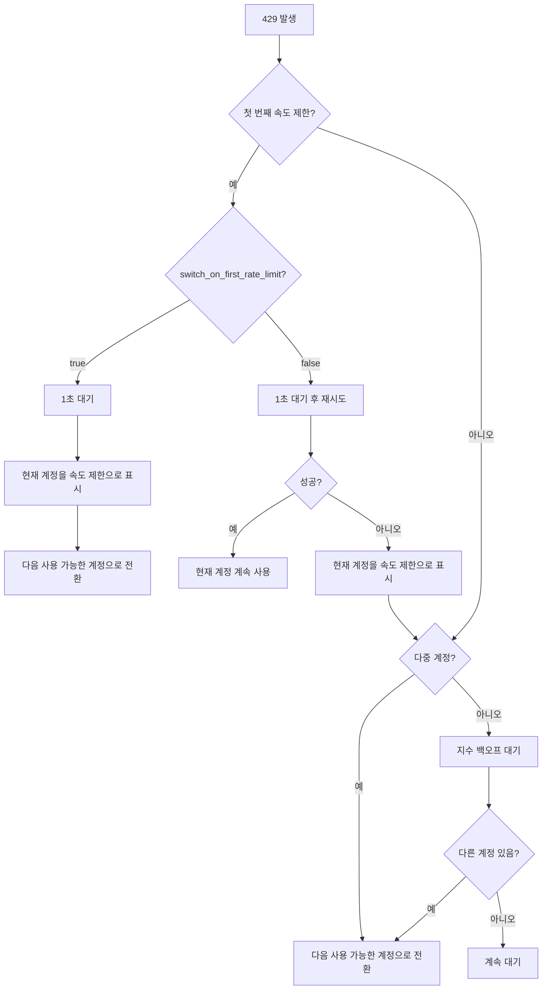

# 속도 제한 처리: 자동 재시도 및 계정 전환 메커니즘

## 학습 목표

Antigravity Auth의 지능형 속도 제한 처리 메커니즘을 이해하고 마스터합니다:
- 5가지 유형의 429 오류 구분 (할당량 소진, 속도 제한, 용량 소진 등)
- 자동 재시도의 지수 백오프 알고리즘 이해
- 다중 계정 시나리오에서의 자동 전환 로직 마스터
- 첫 번째 속도 제한 시 즉시 전환 또는 두 번 재시도 후 전환 설정
- Gemini 이중 할당량 풀 fallback을 사용하여 가용성 향상

"모든 계정이 속도 제한에 걸렸지만 할당량은 아직 남아있는" 문제에서 벗어나세요.

## 현재 겪고 있는 문제

여러 Google 계정 사용 시 다음과 같은 문제에 직면합니다:
- 429 속도 제한이 자주 발생하는데 재시도해야 할지 계정을 전환해야 할지 모르겠음
- 다양한 유형의 429 오류마다 대기 시간 차이가 크지만 얼마나 기다려야 할지 모르겠음
- 모든 계정이 속도 제한에 걸렸지만 실제 할당량은 남아있는 경우 발생 (부정확한 속도 제한 판단)
- Gemini의 이중 할당량 풀 전환 시점이 불명확하여 할당량 낭비

## 이 방법을 사용해야 할 때

다음과 같은 경우:
- 여러 계정을 설정했지만 429 오류가 자주 발생
- 다중 계정 시나리오에서 요청 성공률을 최적화하고 싶음
- 재시도 전략을 조정해야 함 (예: 첫 번째 속도 제한 시 즉시 전환)
- Gemini 모델을 사용하며 이중 할당량 풀을 활용하고 싶음

## 핵심 개념

### 속도 제한 처리란

Antigravity Auth 플러그인은 429 오류 발생 시 자동으로 다음 작업을 수행합니다:

1. **속도 제한 유형 감지**: 응답의 `reason` 또는 `message`를 파싱하여 5가지 속도 제한 유형 구분
2. **백오프 시간 계산**: 속도 제한 유형과 실패 횟수에 따라 지능적으로 대기 시간 계산
3. **전략 실행**:
   - **다중 계정**: 사용 가능한 계정으로 우선 전환
   - **단일 계정**: 지수 백오프 재시도
4. **상태 기록**: 계정의 속도 제한 상태를 업데이트하여 후속 요청에 참조

::: info 왜 지능형 처리가 필요한가요?
Google은 각 계정에 속도 제한을 적용합니다. 단순히 "429 발생 시 전환"하면 빈번한 전환으로 빠른 복구 계정을 놓칠 수 있고, 단순히 "대기 후 재시도"하면 다른 사용 가능한 계정의 할당량을 낭비할 수 있습니다. 지능형 처리는 "전환"과 "대기" 사이의 최적 균형점을 찾아야 합니다.
:::

### 5가지 속도 제한 유형

Antigravity Auth는 API 응답의 `reason` 필드 또는 `message` 내용에 따라 다음 5가지 속도 제한 유형을 구분합니다:

| 유형 | 원인 | 백오프 전략 | 일반적인 시나리오 |
| --- | --- | --- | --- |
| `QUOTA_EXHAUSTED` | 할당량 소진 (일일 또는 월간 할당량) | 점진적 백오프: 1분 → 5분 → 30분 → 120분 | 일일 할당량 소진 |
| `RATE_LIMIT_EXCEEDED` | 요청 속도 초과 (분당 제한) | 고정 30초 | 단시간 대량 요청 |
| `MODEL_CAPACITY_EXHAUSTED` | 모델 서버 용량 부족 | 고정 15초 | 피크 시간대 |
| `SERVER_ERROR` | 서버 내부 오류 (5xx) | 고정 20초 | 서비스 불안정 |
| `UNKNOWN` | 알 수 없는 원인 | 고정 60초 | 파싱 불가능한 오류 |

**백오프 시간 계산 공식** (accounts.ts:51-75):

```typescript
// QUOTA_EXHAUSTED: 점진적 백오프 (연속 실패 횟수 기반)
// 실패 1회: 1분 (60_000ms)
// 실패 2회: 5분 (300_000ms)
// 실패 3회: 30분 (1_800_000ms)
// 실패 4회 이상: 120분 (7_200_000ms)

// 기타 유형: 고정 백오프
// RATE_LIMIT_EXCEEDED: 30초
// MODEL_CAPACITY_EXHAUSTED: 15초
// SERVER_ERROR: 20초
// UNKNOWN: 60초
```

### 지수 백오프 알고리즘

Antigravity Auth는 **중복 제거가 포함된 지수 백오프** 알고리즘을 사용합니다:

**핵심 로직** (plugin.ts:509-567):

```typescript
// 1. 중복 제거 윈도우: 2초 내의 동시 429는 동일 이벤트로 간주
const RATE_LIMIT_DEDUP_WINDOW_MS = 2000;

// 2. 상태 리셋: 2분간 429 없으면 카운트 리셋
const RATE_LIMIT_STATE_RESET_MS = 120_000;

// 3. 지수 백오프: baseDelay * 2^(attempt-1), 최대 60초
const expBackoff = Math.min(baseDelay * Math.pow(2, attempt - 1), 60000);
```

**왜 중복 제거 윈도우가 필요한가요?**

3개의 동시 요청이 모두 429를 트리거한다고 가정:
- **중복 제거 없음**: 각 요청마다 카운터 +1, attempt=3이 되어 4초 백오프 (2^2 × 1초)
- **중복 제거 있음**: 동일 이벤트로 간주, attempt=1, 1초 백오프

중복 제거 윈도우는 동시 요청으로 인한 백오프 시간 과도한 증가를 방지합니다.

### 다중 계정 전환 로직

Antigravity Auth는 다중 계정 시나리오에서 **우선 전환, 재시도 백업** 전략을 채택합니다:

**의사결정 흐름**:



**주요 설정** (config/schema.ts:256-259):

| 설정 항목 | 기본값 | 설명 |
| --- | --- | --- |
| `switch_on_first_rate_limit` | `true` | 첫 번째 속도 제한 시 즉시 계정 전환 여부 (1초 대기 후) |
| `max_rate_limit_wait_seconds` | `300` | 모든 계정 속도 제한 시 최대 대기 시간 (5분) |

**권장 설정**:

- **다중 계정 (2개 이상)**: `switch_on_first_rate_limit: true`, 즉시 전환하여 할당량 낭비 방지
- **단일 계정**: 이 설정은 무효, 자동으로 지수 백오프 재시도 사용

### Gemini 이중 할당량 풀 Fallback

Gemini 모델은 두 개의 독립적인 할당량 풀을 지원합니다:
- **Antigravity 할당량 풀**: 우선 사용, 용량이 작음
- **Gemini CLI 할당량 풀**: 대체 사용, 용량이 큼

**Fallback 로직** (plugin.ts:1318-1345):

```
1. Antigravity 할당량 풀로 요청 발신
2. 429 속도 제한 발생
3. 다른 계정의 Antigravity 할당량 사용 가능 여부 확인
   - 있음: 계정 전환, Antigravity 계속 사용
   - 없음: quota_fallback=true인 경우 Gemini CLI 할당량 풀로 전환
```

**설정 옵션** (config/schema.ts:179):

```json
{
  "quota_fallback": true  // 기본값 false
}
```

**예시**:

2개 계정이 있고 모두 429 발생:

| 상태 | quota_fallback=false | quota_fallback=true |
| --- | --- | --- |
| 계정 1 (Antigravity) | 속도 제한 | 속도 제한 → Gemini CLI 시도 |
| 계정 2 (Antigravity) | 속도 제한 | 속도 제한 → Gemini CLI 시도 |
| 결과 | 5분 대기 후 재시도 | Gemini CLI로 전환, 대기 불필요 |

::: tip 이중 할당량 풀의 장점
Gemini CLI 할당량 풀은 일반적으로 더 크므로 fallback은 요청 성공률을 크게 향상시킬 수 있습니다. 단, 주의사항:
- 명시적으로 `:antigravity` 접미사를 사용한 모델은 fallback하지 않음
- 모든 계정의 Antigravity 할당량이 소진된 후에만 fallback
:::

### 단일 계정 재시도 로직

계정이 하나만 있는 경우 Antigravity Auth는 **지수 백오프 재시도**를 사용합니다:

**재시도 공식** (plugin.ts:1373-1375):

```typescript
// 첫 번째: 1초
// 두 번째: 2초 (1초 × 2^1)
// 세 번째: 4초 (1초 × 2^2)
// 네 번째: 8초 (1초 × 2^3)
// ...
// 최대: 60초
const expBackoffMs = Math.min(1000 * Math.pow(2, attempt - 1), 60000);
```

**재시도 흐름**:

```
첫 번째: 429 발생
  ↓ 1초 대기 후 재시도 (빠른 재시도)
두 번째: 여전히 429
  ↓ 2초 대기 후 재시도
세 번째: 여전히 429
  ↓ 4초 대기 후 재시도
...
```

**다중 계정과의 차이**:

| 시나리오 | 전략 | 대기 시간 |
| --- | --- | --- |
| 단일 계정 | 지수 백오프 재시도 | 1초 → 2초 → 4초 → 8초 → ... → 60초 |
| 다중 계정 | 계정 전환 | 1초 (첫 번째) 또는 5초 (두 번째) |

## 🎒 시작 전 준비

::: warning 사전 확인
다음을 완료했는지 확인하세요:
- [x] 다중 계정 설정 (최소 2개 Google 계정)
- [x] [계정 선택 전략](/ko/NoeFabris/opencode-antigravity-auth/advanced/account-selection-strategies/) 이해
- [x] [이중 할당량 시스템](/ko/NoeFabris/opencode-antigravity-auth/platforms/dual-quota-system/) 이해
:::

## 따라하기

### 1단계: 디버그 로그를 활성화하여 속도 제한 관찰

**왜 필요한가**
디버그 로그는 속도 제한의 상세 정보를 표시하여 플러그인의 작동 원리를 이해하는 데 도움이 됩니다.

**작업**

디버그 로그 활성화:

```bash
export OPENCODE_ANTIGRAVITY_DEBUG=1
```

속도 제한을 트리거하는 요청 발신:

```bash
# 여러 동시 요청 발신 (429 트리거 확인)
for i in {1..10}; do
  opencode run "Test $i" --model=google/antigravity-gemini-3-pro &
done
wait
```

**예상 결과**:

```
[RateLimit] 429 on Account 0 family=claude retryAfterMs=60000
  message: You have exceeded the quota for this request.
  quotaResetTime: 2026-01-23T12:00:00Z
  retryDelayMs: 60000
  reason: QUOTA_EXHAUSTED

Rate limited. Quick retry in 1s... (토스트 알림)
```

**로그 해석**:

- `429 on Account 0 family=claude`: 계정 0의 Claude 모델 속도 제한
- `retryAfterMs=60000`: 서버가 60초 대기 권장
- `reason: QUOTA_EXHAUSTED`: 할당량 소진 (백오프 시간 점진적 증가)

### 2단계: 첫 번째 속도 제한 시 즉시 전환 설정

**왜 필요한가**
여러 계정이 있는 경우 첫 번째 속도 제한 시 즉시 전환하면 할당량 활용률을 극대화하고 대기를 방지할 수 있습니다.

**작업**

설정 파일 수정:

```bash
cat > ~/.config/opencode/antigravity.json << 'EOF'
{
  "$schema": "https://raw.githubusercontent.com/NoeFabris/opencode-antigravity-auth/main/assets/antigravity.schema.json",
  "switch_on_first_rate_limit": true
}
EOF
```

**예상 결과**: 설정 파일이 업데이트되었습니다.

**설정 적용 확인**:

여러 요청을 발신하여 첫 번째 속도 제한 후 동작 관찰:

```bash
export OPENCODE_ANTIGRAVITY_DEBUG=1
for i in {1..5}; do
  opencode run "Test $i" --model=google/antigravity-gemini-3-pro &
done
wait
```

**예상 결과**:

```
[RateLimit] 429 on Account 0 family=gemini retryAfterMs=30000
Server at capacity. Switching account in 1s... (토스트 알림)
[AccountContext] Selected account: user2@gmail.com (index: 1)
```

**핵심 포인트**:
- 첫 번째 429 후 1초 대기
- 자동으로 다음 사용 가능한 계정으로 전환 (index: 1)
- 현재 계정 재시도 안 함

### 3단계: 첫 번째 속도 제한 시 즉시 전환 비활성화

**왜 필요한가**
현재 계정을 먼저 재시도하고 싶은 경우 (빈번한 전환 방지), 이 옵션을 비활성화할 수 있습니다.

**작업**

설정 파일 수정:

```bash
cat > ~/.config/opencode/antigravity.json << 'EOF'
{
  "$schema": "https://raw.githubusercontent.com/NoeFabris/opencode-antigravity-auth/main/assets/antigravity.schema.json",
  "switch_on_first_rate_limit": false
}
EOF
```

**예상 결과**: 설정 파일이 업데이트되었습니다.

**설정 적용 확인**:

여러 요청을 다시 발신:

```bash
export OPENCODE_ANTIGRAVITY_DEBUG=1
for i in {1..5}; do
  opencode run "Test $i" --model=google/antigravity-gemini-3-pro &
done
wait
```

**예상 결과**:

```
[RateLimit] 429 on Account 0 family=gemini retryAfterMs=30000
Rate limited. Quick retry in 1s... (토스트 알림)
[RateLimit] 429 on Account 0 family=gemini retryAfterMs=30000
Rate limited again. Switching account in 5s... (토스트 알림)
[AccountContext] Selected account: user2@gmail.com (index: 1)
```

**핵심 포인트**:
- 첫 번째 429: 1초 대기 후 **현재 계정 재시도**
- 두 번째 429: 5초 대기 후 **계정 전환**
- 재시도 성공 시 현재 계정 계속 사용

### 4단계: Gemini 이중 할당량 풀 Fallback 활성화

**왜 필요한가**
Gemini 모델은 이중 할당량 풀을 지원하며, fallback을 활성화하면 요청 성공률을 크게 향상시킬 수 있습니다.

**작업**

설정 파일 수정:

```bash
cat > ~/.config/opencode/antigravity.json << 'EOF'
{
  "$schema": "https://raw.githubusercontent.com/NoeFabris/opencode-antigravity-auth/main/assets/antigravity.schema.json",
  "quota_fallback": true
}
EOF
```

**예상 결과**: 설정 파일이 업데이트되었습니다.

**설정 적용 확인**:

Gemini 요청 발신 (Antigravity 할당량 풀 속도 제한 트리거 확인):

```bash
export OPENCODE_ANTIGRAVITY_DEBUG=1
for i in {1..5}; do
  opencode run "Test $i" --model=google/antigravity-gemini-3-pro &
done
wait
```

**예상 결과**:

```
[RateLimit] 429 on Account 0 family=gemini retryAfterMs=30000
Antigravity quota exhausted for gemini-3-pro. Switching to Gemini CLI quota... (토스트 알림)
[DEBUG] quota fallback: gemini-cli
```

**핵심 포인트**:
- 모든 계정의 Antigravity 할당량 소진 후
- 자동으로 Gemini CLI 할당량 풀로 전환
- 대기 불필요, 즉시 재시도

**Antigravity 할당량 강제 사용** (fallback 안 함):

```bash
# 명시적 접미사 :antigravity 사용
opencode run "Test" --model=google/antigravity-gemini-3-pro:antigravity
```

### 5단계: 최대 대기 시간 설정

**왜 필요한가**
모든 계정이 속도 제한에 걸린 경우 플러그인은 가장 짧은 리셋 시간을 기다립니다. 최대 대기 시간을 설정하여 무한 대기를 방지할 수 있습니다.

**작업**

설정 파일 수정:

```bash
cat > ~/.config/opencode/antigravity.json << 'EOF'
{
  "$schema": "https://raw.githubusercontent.com/NoeFabris/opencode-antigravity-auth/main/assets/antigravity.schema.json",
  "max_rate_limit_wait_seconds": 60
}
EOF
```

**예상 결과**: 설정 파일이 업데이트되었습니다.

**설정 적용 확인**:

모든 계정 속도 제한 트리거:

```bash
export OPENCODE_ANTIGRAVITY_DEBUG=1
for i in {1..20}; do
  opencode run "Test $i" --model=google/antigravity-claude-opus-4.5 &
done
wait
```

**예상 결과**:

```
[RateLimit] 429 on Account 0 family=claude retryAfterMs=60000
[RateLimit] 429 on Account 1 family=claude retryAfterMs=60000
[DEBUG] All accounts rate limited. Min wait time: 60s, max wait: 60s
Rate limited. Retrying in 60s... (토스트 알림)
```

**핵심 포인트**:
- 모든 계정 속도 제한 시 가장 짧은 리셋 시간 대기
- 가장 짧은 리셋 시간 > `max_rate_limit_wait_seconds`인 경우 최대값 사용
- 기본 최대 대기 시간 300초 (5분)

## 체크포인트 ✅

::: tip 설정 적용 확인 방법
1. 설정 파일에서 설정 항목 확인
2. 디버그 로그 활성화: `OPENCODE_ANTIGRAVITY_DEBUG=1`
3. 로그에서 `[RateLimit]` 이벤트 관찰
4. 계정 전환 동작 관찰 (`AccountContext` 로그)
5. 토스트 알림이 예상대로 표시되는지 확인
:::

## 주의사항

### ❌ 중복 제거 윈도우 무시, 백오프 시간 오해

**잘못된 행동**:
- 10개의 동시 요청 발신, 모두 429 발생
- 백오프 시간이 2^10 × 1초 = 1024초라고 생각
- 실제로는 1초 (중복 제거 윈도우 때문)

**올바른 방법**: 2초 중복 제거 윈도우를 이해하고, 동시 요청은 중복 카운트되지 않음을 인지합니다.

### ❌ `switch_on_first_rate_limit`와 단일 계정 혼용

**잘못된 행동**:
- 계정이 1개뿐인데 `switch_on_first_rate_limit: true` 설정
- 계정이 전환될 것으로 예상하지만 실제로는 전환할 다른 계정이 없음

**올바른 방법**: 단일 계정 시나리오에서는 이 설정이 무효이며, 자동으로 지수 백오프 재시도를 사용합니다.

### ❌ Gemini 명시적 접미사가 fallback 차단

**잘못된 행동**:
- `google/antigravity-gemini-3-pro:antigravity` 사용
- `quota_fallback: true` 설정
- 하지만 429 발생 시 Gemini CLI로 fallback하지 않음

**올바른 방법**: 명시적 접미사는 지정된 할당량 풀을 강제 사용하므로, fallback이 필요하면 접미사를 사용하지 마세요.

### ❌ 모든 계정 속도 제한 후 대기 시간 과다

**잘못된 행동**:
- `max_rate_limit_wait_seconds: 600` (10분) 설정
- 모든 계정이 60초 속도 제한이지만 10분 대기

**올바른 방법**: `max_rate_limit_wait_seconds`는 **최대값**이며, 실제 대기 시간은 가장 짧은 리셋 시간이고 최대값을 초과하지 않습니다.

## 이번 강의 요약

| 메커니즘 | 핵심 특징 | 적용 시나리오 |
| --- | --- | --- |
| **속도 제한 감지** | 5가지 유형 구분 (QUOTA_EXHAUSTED, RATE_LIMIT_EXCEEDED 등) | 모든 시나리오 |
| **지수 백오프** | 실패 횟수가 많을수록 대기 시간 증가 (1초 → 2초 → 4초 → ... → 60초) | 단일 계정 |
| **계정 전환** | 다중 계정은 우선 전환, 단일 계정은 백오프 재시도 | 다중 계정 |
| **중복 제거 윈도우** | 2초 내의 동시 429는 동일 이벤트로 간주 | 동시 시나리오 |
| **이중 할당량 풀 fallback** | Antigravity 속도 제한 후 Gemini CLI 시도 | Gemini 모델 |

**주요 설정**:

| 설정 항목 | 기본값 | 권장값 | 설명 |
| --- | --- | --- | --- |
| `switch_on_first_rate_limit` | `true` | `true` (다중 계정) | 첫 번째 속도 제한 시 즉시 전환 |
| `quota_fallback` | `false` | `true` (Gemini) | 이중 할당량 풀 fallback 활성화 |
| `max_rate_limit_wait_seconds` | `300` | `300` | 최대 대기 시간 (초) |

**디버그 방법**:

- 디버그 로그 활성화: `OPENCODE_ANTIGRAVITY_DEBUG=1`
- `[RateLimit]` 이벤트 확인: 속도 제한 유형과 백오프 시간 파악
- `[AccountContext]` 로그 확인: 계정 전환 동작 관찰

## 다음 강의 예고

> 다음 강의에서는 **[세션 복구](/ko/NoeFabris/opencode-antigravity-auth/advanced/session-recovery/)**를 학습합니다.
>
> 배울 내용:
> - 중단된 도구 호출을 자동으로 복구하는 방법
> - Thinking 모델의 세션 복구 메커니즘
> - Synthetic tool_result 주입 원리

---

## 부록: 소스 코드 참조

<details>
<summary><strong>클릭하여 소스 코드 위치 보기</strong></summary>

> 업데이트 시간: 2026-01-23

| 기능 | 파일 경로 | 라인 번호 |
| --- | --- | --- |
| 속도 제한 유형 정의 | [`src/plugin/accounts.ts`](https://github.com/NoeFabris/opencode-antigravity-auth/blob/main/src/plugin/accounts.ts#L10-L20) | 10-20 |
| 속도 제한 원인 파싱 | [`src/plugin/accounts.ts`](https://github.com/NoeFabris/opencode-antigravity-auth/blob/main/src/plugin/accounts.ts#L29-L49) | 29-49 |
| 백오프 시간 계산 | [`src/plugin/accounts.ts`](https://github.com/NoeFabris/opencode-antigravity-auth/blob/main/src/plugin/accounts.ts#L51-L75) | 51-75 |
| 지수 백오프 알고리즘 | [`src/plugin.ts`](https://github.com/NoeFabris/opencode-antigravity-auth/blob/main/src/plugin.ts#L532-L567) | 532-567 |
| 계정 속도 제한 표시 | [`src/plugin/accounts.ts`](https://github.com/NoeFabris/opencode-antigravity-auth/blob/main/src/plugin/accounts.ts#L434-L461) | 434-461 |
| 계정 속도 제한 여부 확인 | [`src/plugin/accounts.ts`](https://github.com/NoeFabris/opencode-antigravity-auth/blob/main/src/plugin/accounts.ts#L134-L152) | 134-152 |
| 429 오류 처리 | [`src/plugin.ts`](https://github.com/NoeFabris/opencode-antigravity-auth/blob/main/src/plugin.ts#L1260-L1396) | 1260-1396 |
| Gemini 이중 할당량 풀 fallback | [`src/plugin.ts`](https://github.com/NoeFabris/opencode-antigravity-auth/blob/main/src/plugin.ts#L1318-L1345) | 1318-1345 |
| 속도 제한 로그 | [`src/plugin/debug.ts`](https://github.com/NoeFabris/opencode-antigravity-auth/blob/main/src/plugin/debug.ts#L354-L396) | 354-396 |
| 설정 Schema | [`src/plugin/config/schema.ts`](https://github.com/NoeFabris/opencode-antigravity-auth/blob/main/src/plugin/config/schema.ts#L256-L221) | 256-221 |

**주요 상수**:

- `QUOTA_EXHAUSTED_BACKOFFS = [60_000, 300_000, 1_800_000, 7_200_000]`: 할당량 소진 점진적 백오프 시간 (accounts.ts:22)
- `RATE_LIMIT_EXCEEDED_BACKOFF = 30_000`: 속도 제한 고정 백오프 30초 (accounts.ts:23)
- `MODEL_CAPACITY_EXHAUSTED_BACKOFF = 15_000`: 용량 소진 고정 백오프 15초 (accounts.ts:24)
- `SERVER_ERROR_BACKOFF = 20_000`: 서버 오류 고정 백오프 20초 (accounts.ts:25)
- `RATE_LIMIT_DEDUP_WINDOW_MS = 2000`: 중복 제거 윈도우 2초 (plugin.ts:509)
- `RATE_LIMIT_STATE_RESET_MS = 120_000`: 상태 리셋 2분 (plugin.ts:510)
- `FIRST_RETRY_DELAY_MS = 1000`: 첫 번째 빠른 재시도 1초 (plugin.ts:1304)

**주요 함수**:

- `parseRateLimitReason(reason?, message?)`: 속도 제한 원인 파싱 (accounts.ts:29)
- `calculateBackoffMs(reason, consecutiveFailures, retryAfterMs?)`: 백오프 시간 계산 (accounts.ts:51)
- `markRateLimitedWithReason(account, family, headerStyle, model, reason, retryAfterMs?)`: 계정 속도 제한 표시 (accounts.ts:445)
- `isRateLimitedForHeaderStyle(account, family, headerStyle, model?)`: 계정 속도 제한 여부 확인 (accounts.ts:536)
- `getRateLimitBackoff(accountIndex, quotaKey, serverRetryAfterMs)`: 중복 제거 후 백오프 시간 가져오기 (plugin.ts:532)
- `resetRateLimitState(accountIndex, quotaKey)`: 속도 제한 상태 리셋 (plugin.ts:573)

</details>
