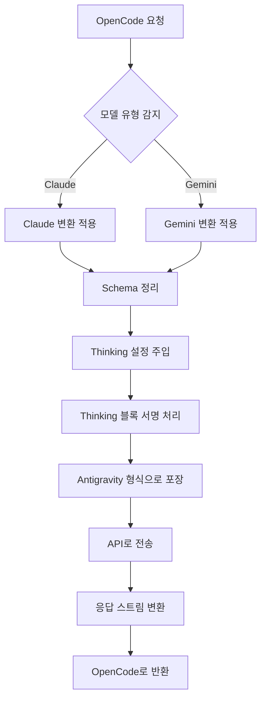

# 요청 변환 메커니즘: 다중 모델 프로토콜 호환성

## 학습 후 할 수 있는 것

- 플러그인이 OpenCode와 Antigravity API 간에 요청 형식을 변환하는 방식 이해
- Claude와 Gemini 모델의 프로토콜 차이점 및 변환 규칙 습득
- Schema 호환성 문제로 인한 400 오류 해결
- Thinking 설정을 최적화하여 최고의 성능 얻기

## 현재의 어려움

다음과 같은 문제를 겪고 있을 수 있습니다:

- ❌ MCP 서버가 `400 Unknown name 'parameters'` 오류 반환
- ❌ Gemini 모델 사용 시 `400 Unknown name 'const'` 오류 발생
- ❌ Thinking 모델의 Thinking 블록이 올바른 형식으로 표시되지 않음
- ❌ 도구 호출 실패, 서명 검증 오류 메시지
- ❌ 플러그인이 Claude와 Gemini를 동시에 지원하는 이유 이해 불가

## 언제 사용해야 하는가

다음과 같은 상황에서 필요합니다:

| 시나리오 | 변환 메커니즘을 이해해야 하는 이유 |
|---|---|
| 사용자 정의 MCP 서버 개발 | 도구 Schema가 Antigravity API와 호환되는지 확인 |
| 400/500 오류 해결 | Schema 문제인지 변환 로직 문제인지 판단 |
| Thinking 성능 최적화 | Thinking 블록 서명 및 캐싱 메커니즘 이해 |
| 도구 호출 실패 디버깅 | 도구 ID 할당 및 매개변수 서명 확인 |

::: warning 사전 확인
본 튜토리얼을 시작하기 전에 다음이 확인되어야 합니다:
- ✅ opencode-antigravity-auth 플러그인 설치
- ✅ 사용 가능한 모델 및 변형 이해
- ✅ Thinking 모델의 기본 개념 이해

[모델 목록 튜토리얼](../../platforms/available-models/) | [Thinking 모델 튜토리얼](../../platforms/thinking-models/)
:::

## 핵심 개념

요청 변환은 플러그인의 핵심 메커니즘으로, 세 가지 작업을 수행합니다:

1. **OpenCode 요청 가로채기** — `fetch(generativeLanguage.googleapis.com)` 호출 가로채기
2. **모델 변환 적용** — 모델 유형(Claude/Gemini)에 따라 형식 변환
3. **포장 및 전송** — Antigravity 형식으로 포장하여 API 호출
4. **응답 변환** — 응답을 OpenCode가 인식할 수 있는 형식으로 변환

**변환 흐름도**:



**주요 변환 지점**:

| 변환 유형 | 목적 | 소스 위치 |
|---|---|---|
| Schema 정리 | Antigravity API가 지원하지 않는 필드 제거 | `src/plugin/request-helpers.ts` |
| Thinking 설정 | 모델군에 맞는 올바른 Thinking 설정 주입 | `src/plugin/transform/claude.ts`, `src/plugin/transform/gemini.ts` |
| Thinking 블록 처리 | 기존 Thinking 블록 분리 및 서명 주입 | `src/plugin/request.ts` |
| 응답 스트림 변환 | SSE 이벤트를 OpenCode 형식으로 변환 | `src/plugin/core/streaming.ts` |

## 따라하기

### 1단계: Claude 변환 규칙 이해

**이유**
Claude 모델은 다른 프로토콜 형식(snake_case, VALIDATED 모드)을 사용하므로 특별한 처리가 필요합니다.

**주요 변환 규칙**

| 원본 형식 | 변환 후 형식 | 설명 |
|---|---|---|
| `toolConfig.functionCallingConfig.mode` | `"VALIDATED"` | 도구 호출 검증 강제 활성화 |
| `thinkingConfig.includeThoughts` | `include_thoughts` | snake_case 형식 |
| `thinkingConfig.thinkingBudget` | `thinking_budget` | snake_case 형식 |
| `maxOutputTokens` | 자동 조정 - 64,000 | Thinking 모델에 더 큰 출력 공간 필요 |

**코드 위치**: [`src/plugin/transform/claude.ts:43-56`](https://github.com/NoeFabris/opencode-antigravity-auth/blob/main/src/plugin/transform/claude.ts#L43-L56)

**예시**

```typescript
// 변환 전 (OpenCode 형식)
{
  "toolConfig": {
    "functionCallingConfig": {
      "mode": "AUTO"
    }
  },
  "thinkingConfig": {
    "includeThoughts": true,
    "thinkingBudget": 32000
  }
}

// 변환 후 (Antigravity 형식)
{
  "toolConfig": {
    "functionCallingConfig": {
      "mode": "VALIDATED"  // VALIDATED 강제 적용
    }
  },
  "thinkingConfig": {
    "include_thoughts": true,  // snake_case
    "thinking_budget": 32000   // snake_case
  },
  "generationConfig": {
    "maxOutputTokens": 64000   // Thinking 모델 자동 조정
  }
}
```

**확인해야 할 것**:
- Claude 모델의 모든 변환은 snake_case 명명 규칙을 따름
- `maxOutputTokens`는 충분히 큰 값(`CLAUDE_THINKING_MAX_OUTPUT_TOKENS = 64,000`)으로 자동 조정됨

### 2단계: Gemini 변환 규칙 이해

**이유**
Gemini 모델은 camelCase 형식을 사용하며, JSON Schema에 엄격한 요구사항(type 대문자)이 있습니다.

**주요 변환 규칙**

| 원본 형식 | 변환 후 형식 | 설명 |
|---|---|---|
| JSON Schema `type: "object"` | `type: "OBJECT"` | 유형은 반드시 대문자 |
| `additionalProperties: false` | 제거 | Gemini API는 지원하지 않음 |
| `$ref: "#/$defs/Foo"` | `description: "See: Foo"`로 변환 | 참조를 설명으로 변환 |
| `const: "foo"` | `enum: ["foo"]` | const를 enum으로 변환 |
| `enum: ["a", "b"]` | 설명 힌트 `(Allowed: a, b)` 추가 | 2-10개 항목 자동 힌트 추가 |

**코드 위치**: [`src/plugin/transform/gemini.ts:52-124`](https://github.com/NoeFabris/opencode-antigravity-auth/blob/main/src/plugin/transform/gemini.ts#L52-L124)

**예시**

```json
// 변환 전 (OpenCode 형식)
{
  "parameters": {
    "type": "object",
    "properties": {
      "status": {
        "type": "string",
        "const": "active",
        "enum": ["active", "inactive"]
      }
    }
  }
}

// 변환 후 (Gemini 형식)
{
  "parameters": {
    "type": "OBJECT",  // 대문자
    "properties": {
      "status": {
        "type": "STRING",  // 대문자
        "enum": ["active", "inactive"],  // const 제거됨
        "description": "(Allowed: active, inactive)"  // 자동 힌트 추가
      }
    }
  }
}
```

**확인해야 할 것**:
- Gemini Schema의 모든 유형은 대문자로 변환됨(`STRING`, `OBJECT`, `ARRAY`)
- `const` 필드는 제거되고 `enum`으로 변환됨
- 지원되지 않는 필드(`$ref`, `additionalProperties`)는 제거됨

### 3단계: Schema 정리 프로세스 이해

**이유**
Antigravity API는 엄격한 protobuf 기반 검증을 사용하며, 표준 JSON Schema의 모든 필드를 지원하지 않습니다.

**4단계 정리 프로세스**

1. **Phase 1a: $ref를 설명으로 변환**
   - `$ref: "#/$defs/Foo"` → `{ description: "See: Foo" }`

2. **Phase 1b: const를 enum으로 변환**
   - `const: "foo"` → `enum: ["foo"]`

3. **Phase 1c: enum 힌트 추가**
   - `enum: ["a", "b"]` → 설명에 `(Allowed: a, b)` 추가

4. **Phase 1d: 지원되지 않는 필드 제거**
   - 삭제: `$schema`, `$defs`, `additionalProperties`, `pattern`, `minLength`, `maxLength` 등

**코드 위치**: [`src/plugin/request-helpers.ts:20-280`](https://github.com/NoeFabris/opencode-antigravity-auth/blob/main/src/plugin/request-helpers.ts#L20-L280)

**지원되지 않는 필드 목록**:

| 필드 | 지원되지 않는 이유 | 대체 방법 |
|---|---|---|
| `$ref` | 참조 허용 안 됨 | 설명 힌트로 변환 |
| `const` | 상수 허용 안 됨 | `enum` 사용 |
| `additionalProperties` | 추가 속성 검증 안 됨 | 설명에 명시 |
| `$schema`, `$defs` | JSON Draft 사용 안 됨 | 제거 |
| `pattern`, `minLength`, `maxLength` | 문자열 제약은 서버측에서 처리 | 제거 |
| `minItems`, `maxItems` | 배열 제약은 서버측에서 처리 | 제거 |

**확인해야 할 것**:
- MCP 서버의 Schema가 Antigravity 호환 형식으로 정리됨
- 400 오류 감소, 더 명확한 오류 메시지

### 4단계: Thinking 블록 처리 메커니즘 이해

**이유**
Claude와 Gemini 3 모델은 안정적인 Thinking 블록 서명이 필요하며, 그렇지 않으면 서명 검증 오류가 발생합니다.

**3단계 처리 프로세스**

1. **이전 Thinking 블록 분리**
   - 모든 이전 `thinking` 블록을 재귀적으로 제거(서명 충돌 방지)
   - 캐시를 사용하여 서명 유효성 검증

2. **새 Thinking 서명 주입**
   - 새 Thinking 블록에 안정적인 서명 생성
   - 다중 턴 대화를 위해 서명 캐싱

3. **Thinking 블록 순서 보장**
   - Claude: thinking은 tool_use 이전에 있어야 함
   - Gemini: thinking은 어떤 위치에서든 가능

**코드 위치**:
- [`src/plugin/request.ts:711-724`](https://github.com/NoeFabris/opencode-antigravity-auth/blob/main/src/plugin/request.ts#L711-L724)

**Thinking 블록 서명 예시**:

```typescript
// Claude Thinking 블록 형식
{
  "type": "thinking",
  "text": "사용자 요구 분석 필요...",
  "signature": "sig-abc123",  // 플러그인 주입 서명
  "cache_control": { "type": "ephemeral" }  // 캐시 제어
}

// 이전 Thinking 블록(분리됨)
{
  "type": "thinking",
  "text": "이전 분석...",  // 제거됨
  "signature": "sig-old456"  // 서명 무효
}
```

**확인해야 할 것**:
- 다중 턴 대화에서 이전 Thinking 블록이 중복 표시되지 않음
- 새 Thinking 블록에 올바른 서명이 있음
- 도구 호출 전에 완전한 Thinking 프로세스가 있음

### 5단계: 응답 스트리밍 변환 이해

**이유**
Antigravity API는 SSE(Server-Sent Events) 스트림을 반환하며, 이를 OpenCode가 인식할 수 있는 형식으로 변환해야 합니다.

**주요 변환 규칙**

| 원본 형식 | 변환 후 형식 | 설명 |
|---|---|---|
| `thought: true` | `type: "reasoning"` | Thinking 블록 형식 변환 |
| `text` | 그대로 유지 | 텍스트 콘텐츠 |
| `tool_use` | 그대로 유지 | 도구 호출 |
| `tool_result` | 그대로 유지 | 도구 결과 |

**코드 위치**: [`src/plugin/core/streaming.ts`](https://github.com/NoeFabris/opencode-antigravity-auth/blob/main/src/plugin/core/streaming.ts)

**SSE 이벤트 예시**:

```
// Antigravity API 반환
data: {"type": "thinking", "text": "분석 중...", "thought": true}

// 변환 후
data: {"type": "reasoning", "text": "분석 중..."}

// 텍스트 이벤트
data: {"type": "text", "text": "안녕하세요"}

// 도구 호출 이벤트
data: {"type": "tool_use", "id": "tool-123", "name": "my_function"}
```

**확인해야 할 것**:
- Thinking 블록이 인터페이스에서 `reasoning` 유형으로 올바르게 표시됨
- 스트리밍 응답에 지연 없이 한 줄씩 변환됨
- 도구 호출 이벤트 형식이 올바름

## 체크포인트 ✅

위 단계를 완료한 후 다음 질문에 답할 수 있어야 합니다:

- [ ] Claude 모델의 `toolConfig.mode`가 무엇으로 설정되는가?
- [ ] Gemini Schema의 `type: "string"`이 무엇으로 변환되는가?
- [ ] 왜 이전 Thinking 블록을 분리해야 하는가?
- [ ] `const` 필드가 어떤 형식으로 변환되는가?
- [ ] Thinking 블록의 서명은 무슨 역할을 하는가?

## 함정 주의

### 함정 1: MCP Schema에 $ref가 있어 400 오류 발생

**오류 메시지**: `400 Unknown name 'parameters'`

**원인**: MCP 서버가 JSON Schema의 `$ref` 참조를 사용했으며, Antigravity API는 이를 지원하지 않습니다.

**해결 방법**:
- MCP 서버의 Schema 정의 확인
- `$ref` 제거하고 객체 구조 직접 펼치기
- 또는 MCP 서버 코드 수정

**예시**:

```json
// ❌ 오류: $ref 사용
{
  "properties": {
    "data": { "$ref": "#/$defs/DataModel" }
  },
  "$defs": {
    "DataModel": { "type": "string" }
  }
}

// ✅ 올바름: 직접 펼치기
{
  "properties": {
    "data": { "type": "string" }
  }
}
```

### 함정 2: const 필드로 인해 Gemini 모델 400 오류 발생

**오류 메시지**: `400 Unknown name 'const'`

**원인**: Antigravity API의 Gemini 엔드포인트가 `const` 필드를 지원하지 않습니다.

**해결 방법**:
- 수동으로 `const`를 `enum`으로 변환
- 또는 플러그인의 자동 변환에 의존(이미 구현됨)

**예시**:

```json
// ❌ 오류: const 사용
{
  "properties": {
    "status": { "type": "string", "const": "active" }
  }
}

// ✅ 올바름: enum 사용
{
  "properties": {
    "status": { "type": "string", "enum": ["active"] }
  }
}
```

### 함정 3: Thinking 모델이 깨진 문자로 표시

**오류 메시지**: Thinking 블록이 `[object Object]`로 표시되거나 형식이 올바르지 않음

**원인**: 응답 변환 로직에 버그가 있거나 서명 캐시가 만료됨.

**해결 방법**:
1. 디버그 로그 확인: `opencode --debug`
2. 서명 캐시 지우기: `~/.config/opencode/antigravity-accounts.json`의 캐시 필드 삭제
3. OpenCode 재시작

### 함정 4: 도구 호출 실패, 서명 오류 표시

**오류 메시지**: `tool_result_missing` 또는 서명 검증 실패

**원인**:
- Thinking 블록 순서 오류(thinking은 tool_use 이전에 있어야 함)
- 서명 캐시 불일치
- 도구 ID 할당 오류

**해결 방법**:
- 플러그인이 자동으로 재시도함(세션 복구 메커니즘)
- 디버그 모드 활성화하여 자세한 오류 확인
- 도구 정의가 올바른지 확인

## 본 과정 요약

요청 변환 메커니즘의 핵심 요점:

1. **모델군이 변환 규칙 결정** — Claude(snake_case, VALIDATED) vs Gemini(camelCase, Schema 대문자)
2. **Schema 정리는 필수** — `$ref`, `const`, `additionalProperties` 등 지원되지 않는 필드 제거
3. **Thinking 블록 서명이 핵심** — 안정적인 서명이 다중 턴 대화의 일관성 보장
4. **응답 스트리밍 변환** — SSE 이벤트를 OpenCode 형식으로 실시간 변환

**주요 소스 위치**:
- 메인 요청 변환: [`src/plugin/request.ts:585`](https://github.com/NoeFabris/opencode-antigravity-auth/blob/main/src/plugin/request.ts#L585)
- Claude 변환: [`src/plugin/transform/claude.ts`](https://github.com/NoeFabris/opencode-antigravity-auth/blob/main/src/plugin/transform/claude.ts)
- Gemini 변환: [`src/plugin/transform/gemini.ts`](https://github.com/NoeFabris/opencode-antigravity-auth/blob/main/src/plugin/transform/gemini.ts)
- Schema 정리: [`src/plugin/request-helpers.ts`](https://github.com/NoeFabris/opencode-antigravity-auth/blob/main/src/plugin/request-helpers.ts)
- 스트리밍 변환: [`src/plugin/core/streaming.ts`](https://github.com/NoeFabris/opencode-antigravity-auth/blob/main/src/plugin/core/streaming.ts)

## 다음 과정 예고

> 다음 과정에서는 **[세션 복구 메커니즘](../session-recovery/)**을 배웁니다.
>
> 배울 내용:
> - 세션 복구의 작동 원리
> - 도구 호출 실패 자동 처리 방법
> - 손상된 Thinking 블록 순서 복구 방법

---

## 부록: 소스 참조

<details>
<summary><strong>소스 위치 보기</strong></summary>

> 업데이트: 2026-01-23

| 기능 | 파일 경로 | 줄 번호 |
|---|---|---|
| 메인 요청 변환 진입점 | [`src/plugin/request.ts`](https://github.com/NoeFabris/opencode-antigravity-auth/blob/main/src/plugin/request.ts#L585) | 585-1443 |
| 응답 변환 진입점 | [`src/plugin/request.ts`](https://github.com/NoeFabris/opencode-antigravity-auth/blob/main/src/plugin/request.ts#L1445) | 1445-1663 |
| Claude 모델 감지 | [`src/plugin/transform/claude.ts`](https://github.com/NoeFabris/opencode-antigravity-auth/blob/main/src/plugin/transform/claude.ts#L27) | 27-29 |
| Claude Thinking 설정 | [`src/plugin/transform/claude.ts`](https://github.com/NoeFabris/opencode-antigravity-auth/blob/main/src/plugin/transform/claude.ts#L62) | 62-72 |
| Claude 도구 설정 | [`src/plugin/transform/claude.ts`](https://github.com/NoeFabris/opencode-antigravity-auth/blob/main/src/plugin/transform/claude.ts#L43) | 43-57 |
| Gemini 모델 감지 | [`src/plugin/transform/gemini.ts`](https://github.com/NoeFabris/opencode-antigravity-auth/blob/main/src/plugin/transform/gemini.ts#L129) | 129-132 |
| Gemini 3 Thinking 설정 | [`src/plugin/transform/gemini.ts`](https://github.com/NoeFabris/opencode-antigravity-auth/blob/main/src/plugin/transform/gemini.ts) | `buildGemini3ThinkingConfig` 찾기 |
| Gemini Schema 변환 | [`src/plugin/transform/gemini.ts`](https://github.com/NoeFabris/opencode-antigravity-auth/blob/main/src/plugin/transform/gemini.ts#L52) | 52-124 |
|---|---|---|
|---|---|---|
|---|---|---|
| Thinking 블록 분리 | [`src/plugin/request-helpers.ts`](https://github.com/NoeFabris/opencode-antigravity-auth/blob/main/src/plugin/request-helpers.ts) | `deepFilterThinkingBlocks` 찾기 |
| Thinking 블록 서명 주입 | [`src/plugin/request.ts`](https://github.com/NoeFabris/opencode-antigravity-auth/blob/main/src/plugin/request.ts#L715) | 715-720 |
| 스트리밍 응답 변환 | [`src/plugin/core/streaming.ts`](https://github.com/NoeFabris/opencode-antigravity-auth/blob/main/src/plugin/core/streaming.ts) | 전체 파일 |

**주요 상수**:
- `CLAUDE_THINKING_MAX_OUTPUT_TOKENS = 64_000` ([`src/plugin/transform/claude.ts:18`](https://github.com/NoeFabris/opencode-antigravity-auth/blob/main/src/plugin/transform/claude.ts#L18)): Claude Thinking 모델의 최대 출력 토큰 제한
- `UNSUPPORTED_SCHEMA_FIELDS` ([`src/plugin/transform/gemini.ts:27`](https://github.com/NoeFabris/opencode-antigravity-auth/blob/main/src/plugin/transform/gemini.ts#L27)): Gemini API가 지원하지 않는 Schema 필드 세트

**주요 함수**:
- `prepareAntigravityRequest()` ([`src/plugin/request.ts:585`](https://github.com/NoeFabris/opencode-antigravity-auth/blob/main/src/plugin/request.ts#L585)): Antigravity API 요청을 준비하는 메인 함수
- `transformAntigravityResponse()` ([`src/plugin/request.ts:1445`](https://github.com/NoeFabris/opencode-antigravity-auth/blob/main/src/plugin/request.ts#L1445)): Antigravity API 응답을 변환하는 메인 함수
- `toGeminiSchema()` ([`src/plugin/transform/gemini.ts:52`](https://github.com/NoeFabris/opencode-antigravity-auth/blob/main/src/plugin/transform/gemini.ts#L52)): JSON Schema를 Gemini 호환 형식으로 변환
- `cleanJSONSchemaForAntigravity()` ([`src/plugin/request-helpers.ts`](https://github.com/NoeFabris/opencode-antigravity-auth/blob/main/src/plugin/request-helpers.ts)): 4단계 Schema 정리
- `createStreamingTransformer()` ([`src/plugin/core/streaming.ts`](https://github.com/NoeFabris/opencode-antigravity-auth/blob/main/src/plugin/core/streaming.ts)): SSE 스트리밍 변환기 생성

</details>
