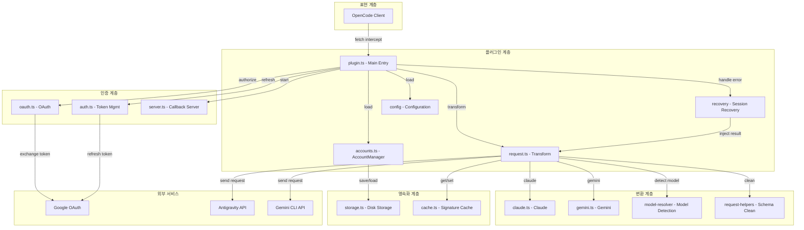
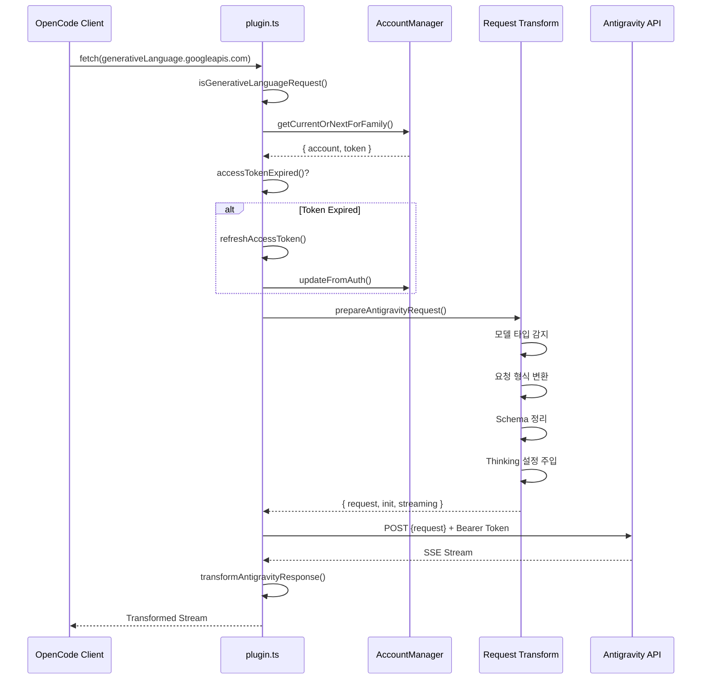
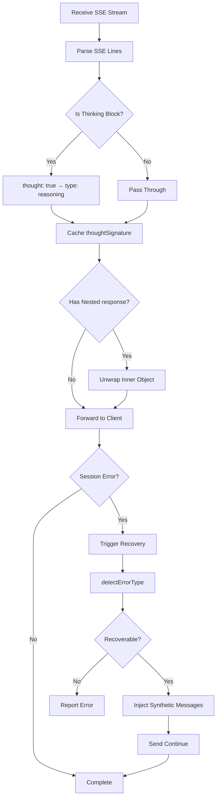
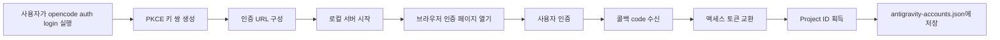

# 플러그인 아키텍처 개요: OpenCode Antigravity Auth의 내부 설계 이해하기

## 학습 목표

이 과정에서는 Antigravity Auth 플러그인의 아키텍처 설계와 내부 작동 원리를 심층적으로 이해합니다. 학습을 완료하면 다음을 할 수 있습니다:

- 플러그인의 모듈 구조와 각 모듈의 역할 이해
- OpenCode에서 Antigravity API까지의 완전한 요청 처리 흐름 파악
- 다중 계정 관리의 로드 밸런싱 메커니즘 이해
- 세션 복구의 작동 원리 이해
- 요청 형식 변환의 기술적 세부 사항 파악

## 플러그인의 핵심 가치

Antigravity Auth 플러그인의 핵심 역할은 OpenCode와 Antigravity API 사이에 '번역 브릿지'를 구축하는 것입니다:

1. **프로토콜 변환** - OpenCode의 요청 형식을 Antigravity API가 요구하는 형식으로 변환
2. **인증 관리** - Google OAuth 2.0 PKCE를 통해 액세스 토큰을 안전하게 획득 및 갱신
3. **로드 밸런싱** - 다중 계정 풀링, 속도 제한을 피하기 위한 자동 순환
4. **오류 복구** - 세션 중단 문제 자동 감지 및 복구

::: info 아키텍처 이해가 필요한 이유
플러그인 아키텍처를 이해하면 다음에 도움이 됩니다:
- 문제가 있는 모듈을 빠르게 찾기
- 설정 항목의 적용 범위 이해
- 다중 계정 사용 전략 최적화
- 플러그인 개발 및 디버깅 참여
:::

## 모듈 구조 개요

플러그인은 계층형 아키텍처를 채택하며, 각 모듈의 역할이 명확합니다:



### 각 모듈의 역할

| 모듈 | 파일 | 역할 |
| --- | --- | --- |
| **메인 엔트리** | `plugin.ts` | fetch 인터셉터, 플러그인 초기화, 이벤트 처리 |
| **계정 관리** | `accounts.ts` | 다중 계정 풀, 로드 밸런싱 전략, 속도 제한 추적 |
| **요청 변환** | `request.ts` | 요청 형식 변환, 응답 스트리밍 처리 |
| **모델 변환** | `transform/` | Claude/Gemini 특정 변환 로직 |
| **OAuth 인증** | `antigravity/oauth.ts` | PKCE 인증 흐름, 토큰 교환 |
| **세션 복구** | `recovery/` | 오류 감지, 중단된 세션 자동 복구 |
| **설정 관리** | `config/` | 설정 로드, Schema 검증 |
| **저장소 계층** | `storage.ts` | 계정 영속화 (JSON 파일) |
| **캐시 계층** | `cache.ts` | 서명 캐시, 중복 계산 감소 |
| **디버그 로그** | `debug.ts` | 구조화된 로그, 문제 해결 |

## 요청 처리 흐름

OpenCode에서 모델 요청이 발생하면, 플러그인은 완전한 처리 체인을 거칩니다:



### 단계별 상세 설명

**1단계: 요청 인터셉트**
- 플러그인은 `fetch` 인터셉터를 통해 `generativelanguage.googleapis.com`으로의 모든 요청을 캡처
- `isGenerativeLanguageRequest()`를 사용하여 Antigravity 관련 요청인지 판단
- 대상이 아닌 요청은 직접 통과시켜 다른 기능에 영향을 주지 않음

**2단계: 계정 선택**
- 계정 풀에서 사용 가능한 계정 선택 (설정된 전략에 따라: sticky/round-robin/hybrid)
- 토큰 만료 여부 확인, 만료 시 자동 갱신
- PID 오프셋 적용 (활성화된 경우), 다중 에이전트 시나리오에서 계정 분포 균등화

**3단계: 요청 변환** (`request.ts`)
- **모델 감지**: Claude인지 Gemini 모델인지 식별
- **Thinking 처리**:
  - Claude: 모든 이전 thinking 블록 제거, 서명 충돌 방지
  - Gemini: `thinkingConfig` 설정 추가
- **Tool 변환**: OpenCode tools를 `functionDeclarations` 형식으로 변환
- **Schema 정리**: 지원되지 않는 JSON Schema 필드 제거 (`const`, `$ref`, `$defs` 등)
- **요청 래핑**: `{ project, model, request: {...} }` 형식으로 캡슐화

**4단계: 요청 전송**
- Antigravity 전용 headers 추가 (User-Agent, Client-Metadata)
- Bearer Token 인증 사용
- endpoint fallback 지원 (daily → autopush → prod)

**5단계: 응답 변환**
- SSE 스트리밍 수신, 라인별 변환
- `thought: true`를 `type: "reasoning"`으로 변환
- 후속 요청을 위한 thinking 서명 캐시
- 내부 `response` 객체 언래핑, 형식 일관성 유지

## 응답 처리 흐름

응답 처리는 주로 스트리밍 변환과 세션 복구를 포함합니다:



### 핵심 처리 메커니즘

**1. Thinking 블록 변환**

Antigravity API가 반환하는 thinking 블록 형식:
```json
{ "thought": true, "text": "사고 내용" }
```

플러그인이 OpenCode 호환 형식으로 변환:
```json
{ "type": "reasoning", "reasoning": "사고 내용" }
```

**2. 서명 캐시**

Claude와 Gemini 3 모델은 다중 턴 대화에서 thinking 블록 서명 매칭이 필요합니다:
- 응답에서 `thoughtSignature` 추출
- `cacheSignature()`를 사용하여 메모리와 디스크에 저장
- 다음 요청 시 `getCachedSignature()`로 가져와 주입

::: tip 서명 캐시가 필요한 이유
Claude와 Gemini 3 API는 도구 호출 전 thinking 블록에 올바른 서명이 있어야 합니다. 서명 캐시를 통해:
- 서명 오류로 인한 요청 실패 방지
- 동일한 사고 내용의 중복 생성 감소
- 다중 턴 대화의 연속성 향상
:::

**3. 세션 복구**

세션 오류 감지 시:
1. `session.error` 이벤트로 오류 캡처
2. `detectErrorType()` 호출하여 복구 가능 여부 판단
3. `tool_result_missing` 오류의 경우:
   - 실패한 `tool_use` ID 추출
   - synthetic `tool_result` 메시지 주입
   - 자동으로 "continue" 전송 (활성화된 경우)
4. thinking 블록 순서 오류의 경우:
   - 대화 상태 분석
   - 손상된 turn 종료
   - 새 turn 시작하여 모델이 다시 생성하도록 함

## 핵심 메커니즘 상세 설명

### OAuth 인증 메커니즘

플러그인은 OAuth 2.0 with PKCE (Proof Key for Code Exchange) 흐름을 사용합니다:



**PKCE 보안성**:
- 랜덤 `code_verifier`와 `code_challenge` 생성
- 인증 URL에 `code_challenge` 포함, 중간자 공격 방지
- 토큰 교환 시 `code_verifier` 검증, 동일 클라이언트의 요청임을 확인

**토큰 관리**:
- Access Token: 기본 1시간 만료, 만료 30분 전 자동 갱신
- Refresh Token: 장기 유효, 새 Access Token 획득에 사용
- `~/.config/opencode/antigravity-accounts.json`에 영속화

### 다중 계정 관리 메커니즘

다중 계정 관리는 플러그인의 핵심 기능 중 하나로, 다음 주요 구성 요소를 포함합니다:

**1. 계정 풀 구조**

```typescript
interface AccountPool {
  version: 3;
  accounts: Account[];
  activeIndex: number;
  activeIndexByFamily: {
    claude: number;
    gemini: number;
  };
}
```

**2. 계정 선택 전략**

| 전략 | 설명 | 적용 시나리오 |
| --- | --- | --- |
| **sticky** | 속도 제한까지 현재 계정 유지 | 단일 세션 사용, 프롬프트 캐시 유지 |
| **round-robin** | 매 요청마다 다음 계정으로 순환 | 다중 세션 병렬, 처리량 최대화 |
| **hybrid** | 건강 점수 + Token bucket + LRU 종합 결정 | 기본 전략, 성능과 안정성 균형 |

**3. 속도 제한 추적**

각 계정은 모델 패밀리별로 독립 추적:
- `claude`: Claude 모델 쿼터
- `gemini-antigravity`: Gemini Antigravity 쿼터
- `gemini-cli`: Gemini CLI 쿼터

속도 제한 상태 포함:
- `rateLimitResetTimes`: 각 쿼터의 리셋 시간
- `cooldownEndAt`: 계정 쿨다운 종료 시간
- `consecutiveFailures`: 연속 실패 횟수

**4. 이중 쿼터 풀 (Gemini 전용)**

Gemini 모델은 두 개의 독립 쿼터 풀 지원:
- **Antigravity 쿼터**: 일일 샌드박스 환경
- **Gemini CLI 쿼터**: 프로덕션 환경

`quota_fallback` 설정을 통해:
- 선호 쿼터 우선 사용 (모델 접미사로 결정)
- 선호 쿼터 소진 시 백업 쿼터 시도
- 양쪽 풀 모두 소진 시 다음 계정으로 전환

**5. PID 오프셋 최적화**

`pid_offset_enabled` 활성화 시:
- 다른 프로세스(PID)의 에이전트가 다른 계정에서 시작
- 모든 에이전트가 동일 계정을 경쟁하는 것 방지
- 다중 에이전트 병렬 시나리오에 적합

### 요청 변환 메커니즘

요청 변환은 플러그인에서 가장 복잡한 부분으로, 다양한 모델의 프로토콜 차이를 처리해야 합니다:

**Claude 모델 변환 핵심 사항**:

1. **Thinking 블록 처리**
   ```typescript
   // 모든 이전 thinking 블록 제거 (서명 충돌 방지)
   const filteredContents = deepFilterThinkingBlocks(contents);

   // 새로운 thinkingConfig 구성
   const thinkingConfig = {
     budgetTokens: variantThinkingConfig?.budget || DEFAULT_THINKING_BUDGET,
   };
   ```

2. **Tool Schema 정리**
   - 화이트리스트 유지: `type`, `properties`, `required`, `description`, `enum`, `items`
   - 제거 필드: `const`, `$ref`, `$defs`, `default`, `examples`, `additionalProperties`, `$schema`, `title`
   - 특수 변환: `const: "value"` → `enum: ["value"]`

3. **도구 주입 파라미터 서명**
   ```typescript
   injectParameterSignatures(tool, signature) {
     tool.description += `\n\nParameters: ${signature}`;
   }
   ```

**Gemini 모델 변환 핵심 사항**:

1. **Thinking 설정**
   ```typescript
   // Gemini 3 Pro/Flash
   if (isGemini3Model(model)) {
     request.thinkingConfig = {
       thinkingLevel: "high" | "medium" | "low" | "minimal",
     };
   }

   // Gemini 2.5
   else if (isGemini2Model(model)) {
     request.thinkingConfig = {
       thinkingLevel: "high" | "medium" | "low",
     };
   }
   ```

2. **Google Search Grounding**
   ```typescript
   if (webSearchConfig) {
     request.generationConfig = {
       ...request.generationConfig,
       dynamicRetrievalConfig: {
         mode: webSearchConfig.mode, // "auto" | "off"
         dynamicRetrievalConfig: {
           scoreThreshold: webSearchConfig.threshold, // 0.0 - 1.0
         },
       },
     };
   }
   ```

3. **이미지 생성 설정**
   ```typescript
   if (isImageGenerationModel(model)) {
     request.generationConfig = {
       ...request.generationConfig,
       responseModalities: ["IMAGE", "TEXT"],
     };
   }
   ```

### 세션 복구 메커니즘

세션 복구 메커니즘은 예기치 않은 중단 후에도 대화를 계속할 수 있도록 보장합니다:

**1. 오류 감지**

```typescript
function detectErrorType(error: unknown): RecoverableError | null {
  if (errorString.includes("tool_use ids were found without tool_result")) {
    return { type: "tool_result_missing" };
  }
  if (errorString.includes("Expected thinking but found text")) {
    return { type: "thinking_order_error" };
  }
  return null;
}
```

**2. Turn 경계 감지**

```typescript
// Turn 경계 = 사용자 메시지 후 첫 번째 assistant 메시지
function analyzeConversationState(messages: Message[]): ConversationState {
  const lastUserMessage = findLastMessageByRole(messages, "user");
  const firstAssistantAfterUser = messages.find(m =>
    m.role === "assistant" && m.timestamp > lastUserMessage.timestamp
  );

  return {
    isTurnStart: true,
    turnAssistantMessage: firstAssistantAfterUser,
  };
}
```

**3. Synthetic 메시지 주입**

```typescript
// synthetic tool_result 주입
function createSyntheticErrorResponse(toolUseIds: string[]): Message[] {
  return toolUseIds.map(id => ({
    type: "tool_result",
    tool_use_id: id,
    content: "Operation cancelled",
    isSynthetic: true,
  }));
}

// 손상된 turn 종료
function closeToolLoopForThinking(sessionId: string): Message[] {
  return [
    {
      type: "text",
      text: "[Conversation turn closed due to error]",
      isSynthetic: true,
    },
  ];
}
```

**4. Auto-Resume**

`auto_resume` 활성화 시, 복구 프로세스가 자동으로 계속 명령을 전송합니다:
```typescript
await client.session.prompt({
  path: { id: sessionID },
  body: { parts: [{ type: "text", text: config.resume_text }] },
  query: { directory },
});
```

## 이번 과정 요약

이 과정에서는 Antigravity Auth 플러그인의 아키텍처 설계를 심층 분석했습니다:

**핵심 아키텍처**:
- 계층형 모듈 설계, 명확한 역할 분담
- 플러그인 계층, 인증 계층, 변환 계층, 영속화 계층이 각자의 역할 수행
- `plugin.ts`를 통합 진입점으로 각 모듈 조율

**요청 흐름**:
- 인터셉트 → 계정 선택 → 토큰 갱신 → 요청 변환 → 요청 전송 → 응답 변환
- 각 단계마다 상세한 오류 처리 및 재시도 메커니즘 포함

**핵심 메커니즘**:
- **OAuth 2.0 PKCE**: 안전한 인증 흐름
- **다중 계정 관리**: 로드 밸런싱, 속도 제한 추적, 이중 쿼터 풀
- **요청 변환**: 프로토콜 호환, Schema 정리, Thinking 처리
- **세션 복구**: 자동 오류 감지, synthetic 메시지 주입, Auto-Resume

이러한 메커니즘을 이해하면 플러그인 설정을 더 잘 사용하고 최적화할 수 있으며, 플러그인 개발 및 디버깅에도 참여할 수 있습니다.

## 다음 과정 예고

> 다음 과정에서는 **[Antigravity API 내부 사양](../api-spec/)**을 학습합니다.
>
> 배우게 될 내용:
> - Antigravity API의 요청 및 응답 형식
> - 각 엔드포인트의 기능과 파라미터
> - 오류 코드 및 상태 코드의 의미
> - 고급 기능 및 실험적 기능

---

## 부록: 소스 코드 참조

<details>
<summary><strong>소스 코드 위치 보기</strong></summary>

> 업데이트 시간: 2026-01-23

| 기능 | 파일 경로 | 라인 번호 |
| --- | --- | --- |
| 플러그인 메인 엔트리, fetch 인터셉터 | [`src/plugin.ts`](https://github.com/NoeFabris/opencode-antigravity-auth/blob/main/src/plugin.ts) | 654-1334 |
| 계정 관리자, 로드 밸런싱 | [`src/plugin/accounts.ts`](https://github.com/NoeFabris/opencode-antigravity-auth/blob/main/src/plugin/accounts.ts) | 1-715 |
| 요청 변환, 응답 스트리밍 | [`src/plugin/request.ts`](https://github.com/NoeFabris/opencode-antigravity-auth/blob/main/src/plugin/request.ts) | 1-1664 |
| Claude 모델 변환 | [`src/plugin/transform/claude.ts`](https://github.com/NoeFabris/opencode-antigravity-auth/blob/main/src/plugin/transform/claude.ts) | 전체 |
| Gemini 모델 변환 | [`src/plugin/transform/gemini.ts`](https://github.com/NoeFabris/opencode-antigravity-auth/blob/main/src/plugin/transform/gemini.ts) | 전체 |
| 세션 복구 | [`src/plugin/recovery/index.ts`](https://github.com/NoeFabris/opencode-antigravity-auth/blob/main/src/plugin/recovery/index.ts) | 전체 |
| Thinking 블록 복구 | [`src/plugin/recovery/thinking-recovery.ts`](https://github.com/NoeFabris/opencode-antigravity-auth/blob/main/src/plugin/recovery/thinking-recovery.ts) | 전체 |
| OAuth 인증 | [`src/antigravity/oauth.ts`](https://github.com/NoeFabris/opencode-antigravity-auth/blob/main/src/antigravity/oauth.ts) | 1-271 |
| 토큰 관리 | [`src/plugin/token.ts`](https://github.com/NoeFabris/opencode-antigravity-auth/blob/main/src/plugin/token.ts) | 전체 |
| 설정 Schema | [`src/plugin/config/schema.ts`](https://github.com/NoeFabris/opencode-antigravity-auth/blob/main/src/plugin/config/schema.ts) | 1-373 |
| 계정 저장소 | [`src/plugin/storage.ts`](https://github.com/NoeFabris/opencode-antigravity-auth/blob/main/src/plugin/storage.ts) | 전체 |
| 서명 캐시 | [`src/plugin/cache.ts`](https://github.com/NoeFabris/opencode-antigravity-auth/blob/main/src/plugin/cache.ts) | 전체 |
| 디버그 로그 | [`src/plugin/debug.ts`](https://github.com/NoeFabris/opencode-antigravity-auth/blob/main/src/plugin/debug.ts) | 전체 |

**주요 상수**:
- `MAX_OAUTH_ACCOUNTS = 10`: 최대 계정 수
- `RATE_LIMIT_DEDUP_WINDOW_MS = 2000`: 속도 제한 중복 제거 윈도우 (2초)
- `RATE_LIMIT_STATE_RESET_MS = 120000`: 속도 제한 상태 리셋 시간 (2분)
- `FAILURE_COOLDOWN_MS = 30000`: 계정 쿨다운 시간 (30초)

**주요 함수**:
- `createAntigravityPlugin()`: 플러그인 메인 엔트리 함수
- `prepareAntigravityRequest()`: 요청 변환 메인 함수
- `transformAntigravityResponse()`: 응답 스트리밍 변환 함수
- `AccountManager.getCurrentOrNextForFamily()`: 계정 선택 함수
- `handleSessionRecovery()`: 세션 복구 처리 함수
- `refreshAccessToken()`: 토큰 갱신 함수

</details>
