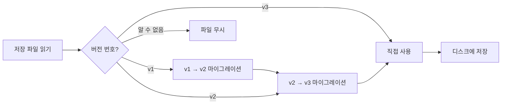

# 계정 저장 형식 및 버전 관리

## 배우면 할 수 있는 것

- 계정 저장 파일의 구조와 각 필드의 의미 이해
- 저장 파일 수동 편집 (필요한 경우에만)
- 버전 마이그레이션 메커니즘 및 호환성 이해
- 크로스 머신 계정 구성 마이그레이션

## 현재의 어려움

다음과 같은 상황에 직면할 수 있습니다:

- 계정을 다른 머신으로 백업하거나 마이그레이션하고 싶음
- `projectId`를 수동으로 수정하거나 유효하지 않은 계정 삭제
- 버전 경고 또는 마이그레이션 로그를 보고 무슨 일이 일어났는지 알고 싶음
- 여러 머신 간 계정 상태 동기화

## 파일 위치

계정 저장 파일 위치:

| 운영 체제 | 경로 |
| --- | --- |
| macOS/Linux | `~/.config/opencode/antigravity-accounts.json` |
| Windows | `%APPDATA%\opencode\antigravity-accounts.json` |

::: warning 보안 알림
이 파일에는 **OAuth refresh tokens**가 포함되어 있으며, 비밀번호 파일과 동일합니다. 다른 사람과 공유하거나 Git 저장소에 커밋하지 마세요.
:::

## 저장 형식 버전

저장 형식에는 버전 제어가 있으며, 현재 버전은 **v3**입니다. 플러그인은 버전 마이그레이션을 자동으로 처리하므로 수동 개입이 필요하지 않습니다.

### v3 형식 (현재 버전)

```json
{
  "version": 3,
  "accounts": [
    {
      "email": "user1@gmail.com",
      "refreshToken": "1//0abc...",
      "projectId": "my-gcp-project",
      "managedProjectId": "managed-project-123",
      "addedAt": 1737600000000,
      "lastUsed": 1737603600000,
      "lastSwitchReason": "initial",
      "rateLimitResetTimes": {
        "claude": 1737607200000,
        "gemini-antigravity": 1737607200000,
        "gemini-cli": 1737607200000
      },
      "coolingDownUntil": 1737600000000,
      "cooldownReason": "auth-failure"
    }
  ],
  "activeIndex": 0,
  "activeIndexByFamily": {
    "claude": 0,
    "gemini": 0
  }
}
```

**필드 설명**:

| 필드 | 타입 | 필수 | 설명 |
| --- | --- | --- | --- |
| `version` | number | Y | 저장 형식 버전 (고정값 3) |
| `accounts` | array | Y | 계정 목록 |
| `activeIndex` | number | Y | 현재 활성 계정 인덱스 (0부터 시작) |
| `activeIndexByFamily` | object | N | 모델 패밀리별 활성 계정 추적 (`claude`/`gemini`) |

**계정 객체 필드**:

| 필드 | 타입 | 필수 | 설명 |
| --- | --- | --- | --- |
| `email` | string | N | Google 계정 이메일 |
| `refreshToken` | string | Y | OAuth refresh 토큰 (고유 식별자) |
| `projectId` | string | N | GCP 프로젝트 ID (Gemini CLI 모델 필요) |
| `managedProjectId` | string | N | 관리 프로젝트 ID |
| `addedAt` | number | Y | 추가 타임스탬프 (Unix 밀리초) |
| `lastUsed` | number | Y | 마지막 사용 타임스탬프 |
| `lastSwitchReason` | string | N | 전환 이유: `"rate-limit"` / `"initial"` / `"rotation"` |
| `rateLimitResetTimes` | object | N | 속도 제한 리셋 시간 (할당량 풀별 추적) |
| `coolingDownUntil` | number | N | 계정 쿨다운 종료 타임스탬프 |
| `cooldownReason` | string | N | 쿨다운 이유: `"auth-failure"` / `"network-error"` / `"project-error"` |

### v2 형식 (이전 버전)

v2 형식은 v3와 유사하지만 다음과 같은 차이점이 있습니다:

- `rateLimitResetTimes`에 `claude`와 `gemini` 두 필드만 있음
- `coolingDownUntil` 및 `cooldownReason` 없음
- `activeIndexByFamily` 없음 (모든 모델이 하나의 활성 계정 공유)

마이그레이션 시 `gemini` 필드는 `gemini-antigravity`로 매핑되고, `gemini-cli` 할당량 풀은 빈 값으로 초기화됩니다.

### v1 형식 (이전 버전)

v1 형식은 부울 플래그와 단일 타임스탬프를 사용합니다:

```json
{
  "version": 1,
  "accounts": [
    {
      "email": "user1@gmail.com",
      "refreshToken": "1//0abc...",
      "isRateLimited": true,
      "rateLimitResetTime": 1737607200000
    }
  ],
  "activeIndex": 0
}
```

마이그레이션 시 `isRateLimited`가 `true`이고 `rateLimitResetTime`이 만료되지 않은 경우, `claude`와 `gemini`의 리셋 시간이 모두 설정됩니다.

## 버전 마이그레이션 메커니즘

플러그인은 저장 파일을 로드할 때 버전을 자동으로 감지하고 마이그레이션을 실행합니다:



**마이그레이션 규칙**:

1. **자동 마이그레이션**: 마이그레이션 후 새 형식을 디스크에 자동 저장
2. **데이터 보존**: 만료되지 않은 속도 제한 상태 보존
3. **실패 폴백**: 저장 실패 시 메모리에서 마이그레이션된 데이터 계속 사용
4. **전방 호환성**: 새 버전 플러그인은 이전 형식 파일 읽기 가능

## 저장 메커니즘 세부 사항

### 파일 잠금

`proper-lockfile`을 사용하여 다중 프로세스 안전 액세스 보장:

- **잠금 메커니즘**: 쓰기 시 잠금 파일 생성 (`.antigravity-accounts.json.lock`)
- **타임아웃 설정**: 잠금 파일 10초 후 만료 (데드락 방지)
- **재시도 전략**: 최대 5회 재시도, 백오프 시간 100ms → 1000ms
- **원자적 쓰기**: 먼저 임시 파일 (`.tmp`)에 쓰고, 대상 파일로 이름 변경

### 계정 병합

여러 프로세스가 동시에 저장 파일에 쓸 때 병합 전략 실행:

```typescript
// 병합 로직
function mergeAccountStorage(existing, incoming) {
  // refreshToken을 키로 계정 병합
  // 수동 구성된 projectId/managedProjectId 보존
  // rateLimitResetTimes 병합
  // 더 큰 lastUsed 보존
}
```

### 중복 제거 메커니즘

`email` 기반 중복 제거, 각 이메일의 최신 계정 보존 (`lastUsed` 기준, 그 다음 `addedAt`):

```typescript
// 중복 제거 규칙
1. email 없는 계정 → 보존 (중복 제거 불가)
2. 동일 email 계정 → lastUsed가 가장 큰 것 보존
3. lastUsed 동일 → addedAt이 가장 큰 것 보존
```

## 수동 편집 가이드

::: danger 수동 편집 위험
저장 파일을 편집할 때 플러그인 프로세스가 실행 중이면 안 됩니다. 그렇지 않으면 덮어쓸 수 있습니다. 편집 전에 OpenCode를 중지하는 것이 좋습니다.
:::

### 계정 추가

계정을 수동으로 추가할 때 최소한 `refreshToken`을 제공해야 합니다:

```json
{
  "accounts": [
    {
      "refreshToken": "다른 머신에서 복사하거나 OAuth 플로우에서 가져옴",
      "email": "user@example.com",
      "addedAt": Date.now(),
      "lastUsed": Date.now()
    }
  ]
}
```

### 계정 삭제

`accounts` 배열에서 해당 항목을 삭제한 다음 `activeIndex`를 조정합니다:

```json
{
  "accounts": [
    { "email": "user1@gmail.com", "refreshToken": "..." },  // 보존
    // { "email": "user2@gmail.com", "refreshToken": "..." },  // 삭제
    { "email": "user3@gmail.com", "refreshToken": "..." }   // 보존
  ],
  "activeIndex": 0  // 인덱스가 유효한 범위 내에 있는지 확인
}
```

### projectId 수정

계정에 `projectId`를 추가하거나 수정합니다:

```json
{
  "accounts": [
    {
      "email": "user@gmail.com",
      "refreshToken": "1//0abc...",
      "projectId": "your-gcp-project-id"  // 추가 또는 수정
    }
  ]
}
```

### 속도 제한 상태 지우기

속도 제한 플래그를 수동으로 지웁니다:

```json
{
  "accounts": [
    {
      "email": "user@gmail.com",
      "refreshToken": "1//0abc...",
      "rateLimitResetTimes": {}  // 비우거나 이 필드 삭제
    }
  ]
}
```

## 크로스 머신 마이그레이션

### 간단한 마이그레이션

저장 파일을 대상 머신의 구성 디렉토리로 직접 복사합니다:

```bash
# macOS/Linux
cp ~/.config/opencode/antigravity-accounts.json /path/to/backup/

# Windows
copy %APPDATA%\opencode\antigravity-accounts.json backup\
```

### 계정 병합

대상 머신에 이미 계정이 있는 경우 플러그인이 자동으로 병합합니다 (`refreshToken` 기반 중복 제거).

**수동 병합 단계**:

1. 두 머신의 저장 파일 백업
2. 두 파일을 열고 대상 계정 배열을 소스 파일로 복사
3. `activeIndex` 및 `activeIndexByFamily` 조정
4. 저장 후 플러그인 재시작

## 일반적인 문제

### 마이그레이션 실패 시 해결 방법

마이그레이션이 실패하면 플러그인이 로그에 경고를 기록합니다:

```
Failed to persist migrated storage: { error: "..." }
```

**해결 방법**:

1. 파일 권한 확인
2. 디스크 공간 충분한지 확인
3. 이전 파일을 수동으로 백업한 후 삭제하고 계정 다시 추가

### 버전 비호환 오류

"Unknown storage version" 오류가 표시되는 경우:

```json
{
  "version": 99  // 알 수 없는 버전
}
```

**해결 방법**:

1. 현재 파일 백업
2. `version`을 수동으로 `2` 또는 `3`으로 변경
3. 플러그인 재시작하여 마이그레이션 트리거
4. 마이그레이션 실패 시 파일 삭제 후 계정 다시 추가

### 계정 중복 제거 손실

중복 계정이 삭제된 경우:

**원인**: 플러그인이 `email` 기반으로 중복 제거하여 가장 최근에 사용된 계정을 보존합니다.

**해결 방법**: 동일한 이메일의 두 계정을 보존해야 하는 경우 (드문 시나리오), 파일을 수동으로 편집하여 `email` 필드가 비어 있거나 다른지 확인합니다.

## 이번 강의 요약

- 저장 파일 위치: `~/.config/opencode/antigravity-accounts.json`
- 현재 버전: v3, 이중 할당량 풀 및 쿨다운 메커니즘 지원
- 자동 마이그레이션: v1/v2는 자동으로 v3로 업그레이드
- 파일 잠금: `proper-lockfile`을 사용하여 동시성 안전 보장
- 수동 편집: 플러그인 중지 후 편집하여 덮어쓰기 방지 권장

## 다음 강의 예고

> 다음 강의에서는 **[모든 구성 옵션](../all-config-options/)**을 학습합니다.
>
> 배울 내용:
> - 완전한 구성 옵션 목록
> - 각 옵션의 기본값 및 범위
> - 고급 구성 팁

---

## 부록: 소스 코드 참조

<details>
<summary><strong>클릭하여 소스 코드 위치 보기</strong></summary>

> 업데이트 시간: 2026-01-23

| 기능 | 파일 경로 | 줄 번호 |
| --- | --- | --- |
| 저장 형식 정의 | [`src/plugin/storage.ts`](https://github.com/NoeFabris/opencode-antigravity-auth/blob/main/src/plugin/storage.ts) | 128-198 |
| v1 → v2 마이그레이션 | [`src/plugin/storage.ts`](https://github.com/NoeFabris/opencode-antigravity-auth/blob/main/src/plugin/storage.ts) | 366-395 |
| v2 → v3 마이그레이션 | [`src/plugin/storage.ts`](https://github.com/NoeFabris/opencode-antigravity-auth/blob/main/src/plugin/storage.ts) | 397-431 |
| 계정 로드 | [`src/plugin/storage.ts`](https://github.com/NoeFabris/opencode-antigravity-auth/blob/main/src/plugin/storage.ts) | 433-518 |
| 계정 저장 | [`src/plugin/storage.ts`](https://github.com/NoeFabris/opencode-antigravity-auth/blob/main/src/plugin/storage.ts) | 520-536 |
| 파일 잠금 메커니즘 | [`src/plugin/storage.ts`](https://github.com/NoeFabris/opencode-antigravity-auth/blob/main/src/plugin/storage.ts) | 219-257 |
| 계정 병합 | [`src/plugin/storage.ts`](https://github.com/NoeFabris/opencode-antigravity-auth/blob/main/src/plugin/storage.ts) | 259-299 |
| 중복 제거 메커니즘 | [`src/plugin/storage.ts`](https://github.com/NoeFabris/opencode-antigravity-auth/blob/main/src/plugin/storage.ts) | 301-364 |

**주요 타입 정의**:

- `AccountStorageV1`: v1 저장 형식
- `AccountStorageV2`: v2 저장 형식
- `AccountStorageV3`: v3 저장 형식 (현재)
- `RateLimitStateV3`: v3 속도 제한 상태 (다중 할당량 풀 지원)

**주요 함수**:

- `loadAccounts()`: 계정 로드 및 마이그레이션 실행
- `saveAccounts()`: 계정 저장 (파일 잠금 및 병합 포함)
- `migrateV1ToV2()`: v1 → v2 마이그레이션
- `migrateV2ToV3()`: v2 → v3 마이그레이션
- `mergeAccountStorage()`: 두 저장 객체 병합
- `deduplicateAccountsByEmail()`: email 기반 중복 제거

</details>
