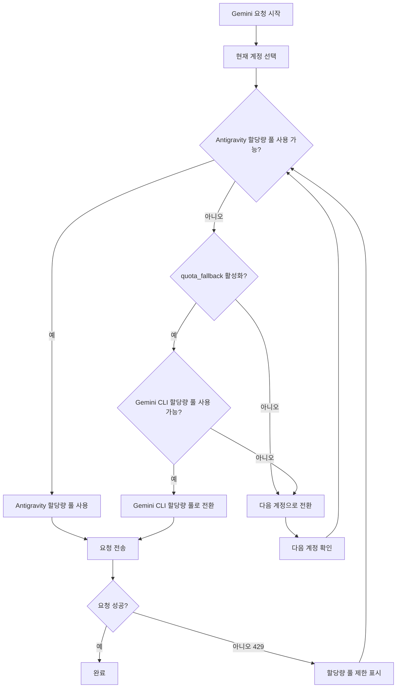

# 이중 할당량 시스템: Antigravity와 Gemini CLI 할당량 풀 이해하기

## 학습 목표

- 각 계정이 두 개의 독립적인 Gemini 할당량 풀을 가지는 방식 이해하기
- Antigravity와 Gemini CLI 할당량 풀 간 자동 fallback 활성화하기
- 특정 할당량 풀을 명시적으로 지정하여 모델 사용하기
- 이중 할당량 시스템을 통해 할당량 활용률 극대화하기

---

## 현재 겪고 있는 문제

Antigravity Auth 플러그인으로 Gemini 모델을 호출하면서 자주 할당량 제한에 걸리지만, **이중 할당량 시스템**에 대해 잘 모를 수 있습니다:

- 요청이 속도 제한에 걸리면 할당량이 리셋될 때까지 기다려야 함
- 여러 계정을 설정했지만 각 계정의 Gemini 할당량이 여전히 부족함
- 왜 어떤 모델은 요청이 되고 어떤 모델은 자주 429 오류가 나는지 모름

**핵심 문제**: 각 계정에 Gemini 할당량 풀이 하나만 있다고 생각하지만, 실제로 각 계정은 **두 개의 독립적인** 할당량 풀을 가지고 있어서 올바르게 설정하면 Gemini 할당량을 두 배로 늘릴 수 있습니다.

---

## 핵심 개념

### 이중 할당량 시스템이란?

**이중 할당량 시스템**은 Antigravity Auth 플러그인이 각 계정에 대해 두 개의 독립적인 Gemini 할당량 풀을 유지하는 메커니즘입니다. Antigravity와 Gemini CLI 할당량 풀은 속도 제한 상태를 독립적으로 추적하며, Antigravity가 제한되면 CLI 할당량 풀로 전환하여 할당량을 두 배로 늘릴 수 있습니다.

Antigravity Auth 플러그인은 각 Google 계정에 대해 **두 개의 독립적인 Gemini 할당량 풀**을 유지합니다:

| 할당량 풀 | 유형 | 우선순위 | 리셋 규칙 |
| --- | --- | --- | --- |
| **Antigravity** | 주요 할당량 풀 | 우선 사용 | 서버에서 반환된 리셋 시간을 기반으로 동적 계산 |
| **Gemini CLI** | 백업 할당량 풀 | fallback 사용 | 서버에서 반환된 리셋 시간을 기반으로 동적 계산 |

각 할당량 풀의 속도 제한 상태는 독립적으로 추적되며 서로 영향을 주지 않습니다. 이는 다음을 의미합니다:

- Antigravity 할당량 풀이 제한되어도 Gemini CLI 할당량 풀이 사용 가능하면 자동으로 전환 가능
- 각 계정의 Gemini 할당량이 **두 배**가 되는 효과

### 명시적 지정 vs 자동 fallback

이중 할당량 시스템을 사용하는 두 가지 방법이 있습니다:

1. **명시적 지정**: 모델 이름 뒤에 `:antigravity` 또는 `:gemini-cli` 접미사를 추가하여 특정 할당량 풀을 강제로 사용
2. **자동 fallback**: `quota_fallback` 설정을 활성화하여 플러그인이 두 할당량 풀 사이를 자동으로 전환

**기본 동작**: 자동 fallback이 비활성화되어 있으며, Antigravity 할당량 풀만 사용

---

## 따라하기

### 1단계: 자동 fallback 활성화

`~/.config/opencode/antigravity.json` 설정 파일을 엽니다:

```bash
cat ~/.config/opencode/antigravity.json
```

`quota_fallback` 설정을 추가하거나 수정합니다:

```json
{
  "quota_fallback": true
}
```

**이유**: 기본적으로 `quota_fallback`은 `false`이며, 플러그인은 Antigravity 할당량 풀만 사용합니다. 활성화하면 Antigravity가 제한될 때 자동으로 Gemini CLI 할당량 풀을 시도합니다.

설정 파일이 업데이트된 것을 확인할 수 있습니다.

---

### 2단계: 자동 fallback 동작 확인

Gemini 모델 요청을 보냅니다 (예: Gemini 3 Flash 사용):

```bash
opencode run "양자 컴퓨팅이 무엇인지 설명해줘" --model=google/antigravity-gemini-3-flash
```

Antigravity 할당량 풀이 제한되면 다음과 같은 자동 fallback 동작을 볼 수 있습니다:

```
[Toast 알림] Antigravity quota exhausted, using Gemini CLI quota
```

플러그인은 다음을 수행합니다:

1. Antigravity 할당량 풀 제한 감지 (429 응답)
2. Gemini CLI 할당량 풀로 전환 시도 (제한되지 않은 경우)
3. 새 할당량 풀을 사용하여 요청 재전송
4. 전환 동작을 알리는 toast 알림 표시

**이유**: 이것이 자동 fallback의 핵심 로직입니다—다음 계정으로 즉시 전환하는 대신 동일 계정의 두 할당량 풀 사이를 전환합니다.

할당량 제한으로 실패하는 대신 요청이 성공적으로 완료되는 것을 확인할 수 있습니다.

---

### 3단계: 할당량 풀 명시적 지정

특정 할당량 풀을 강제로 사용하려면 모델 이름 뒤에 접미사를 추가합니다:

**Antigravity 할당량 풀 사용** (`antigravity-` 접두사 사용):

```bash
opencode run "양자 컴퓨팅이 무엇인지 설명해줘" --model=google/antigravity-gemini-3-flash
```

**Gemini CLI 할당량 풀 사용** (`antigravity-` 접두사 없이):

```bash
opencode run "양자 컴퓨팅이 무엇인지 설명해줘" --model=google/gemini-3-flash-preview
```

**이유**: `antigravity-` 접두사를 통해 Antigravity 할당량 풀 사용을 명시적으로 지정할 수 있고, 접두사가 없으면 Gemini CLI 할당량 풀을 사용합니다. 이 경우 플러그인은 `quota_fallback` 설정을 무시하며, 지정된 할당량 풀이 제한되면 다른 할당량 풀을 시도하지 않고 즉시 다음 계정으로 전환합니다.

요청이 지정된 할당량 풀로 라우팅되는 것을 확인할 수 있습니다.

---

### 4단계: 할당량 상태 확인 (디버그 모드)

각 할당량 풀의 속도 제한 상태를 확인하려면 디버그 모드를 활성화합니다:

`~/.config/opencode/antigravity.json` 편집:

```json
{
  "quota_fallback": true,
  "debug": true
}
```

요청을 보낸 후 로그 파일을 확인합니다:

```bash
tail -f ~/.config/opencode/antigravity-logs/*.log
```

다음과 같은 로그를 볼 수 있습니다:

```
[DEBUG] headerStyle=antigravity explicit=false
[DEBUG] quota fallback: gemini-cli
[INFO] rate-limit triggered for account 0, family gemini, quota: gemini-antigravity
```

**이유**: 디버그 로그를 통해 플러그인이 어떤 할당량 풀을 선택했는지, 언제 fallback이 트리거되었는지 명확하게 확인할 수 있습니다. 할당량 문제를 해결하는 데 매우 유용합니다.

상세한 할당량 전환 로그를 확인할 수 있습니다.

---

## 체크포인트 ✅

### 자동 fallback 활성화 확인

```bash
cat ~/.config/opencode/antigravity.json | grep quota_fallback
```

다음을 확인할 수 있습니다:

```json
"quota_fallback": true
```

### 명시적 지정 접미사 확인

접미사가 포함된 모델 이름을 사용하여 오류가 발생하지 않는지 확인합니다:

```bash
opencode run "테스트" --model=google/antigravity-gemini-3-flash:gemini-cli
```

요청이 성공적으로 완료되는 것을 확인할 수 있습니다.

### 디버그 로그 확인

```bash
ls -la ~/.config/opencode/antigravity-logs/
```

로그 파일이 존재하고 할당량 전환 관련 정보가 포함되어 있는 것을 확인할 수 있습니다.

---

## 주의사항

### 함정 1: 명시적 지정 접미사 사용 시 fallback이 작동하지 않음

**문제**: 모델 이름 뒤에 `:antigravity` 또는 `:gemini-cli` 접미사를 추가했는데 `quota_fallback`이 작동하지 않는 것 같습니다.

**원인**: 명시적 지정 접미사를 사용하면 플러그인은 `quota_fallback` 설정을 무시하고 지정된 할당량 풀을 강제로 사용합니다. 해당 할당량 풀이 제한되면 다른 할당량 풀을 시도하지 않고 즉시 다음 계정으로 전환합니다.

**해결 방법**:
- 자동 fallback을 사용하려면 모델 이름 뒤에 접미사를 추가하지 마세요
- 특정 할당량 풀을 강제로 사용하려면 접미사를 추가하세요

### 함정 2: Claude 모델에는 이중 할당량 시스템이 없음

**문제**: `quota_fallback`을 활성화했는데 Claude 모델에서는 fallback 동작이 없는 것 같습니다.

**원인**: 이중 할당량 시스템은 **Gemini 모델에만 적용**됩니다. Claude 모델은 Antigravity 할당량 풀만 사용하며 Gemini CLI 할당량 풀이 없습니다.

**해결 방법**:
- Claude 모델은 이중 할당량 시스템 설정이 필요 없습니다
- 다중 계정 로테이션만이 Claude 할당량을 늘릴 수 있습니다

### 함정 3: 디버그 로그가 너무 많아 성능에 영향

**문제**: `debug: true`를 활성화했는데 로그 파일이 너무 빠르게 증가합니다.

**원인**: 디버그 모드는 할당량 전환, 계정 선택 등 모든 요청 세부 정보를 기록합니다.

**해결 방법**:
- 디버깅이 완료되면 `debug` 설정을 비활성화하세요
- 또는 정기적으로 로그 파일을 정리하세요: `rm ~/.config/opencode/antigravity-logs/*.log`

---

## 이중 할당량 시스템 워크플로우 다이어그램

다음은 자동 fallback의 워크플로우입니다:



---

## 이중 할당량 풀의 독립적 추적 메커니즘

### 할당량 키 정의

플러그인은 다음 할당량 키를 사용하여 속도 제한을 추적합니다 (소스 코드: `accounts.ts:77`):

| 할당량 키 | 의미 |
| --- | --- |
| `claude` | Claude 모델 할당량 |
| `gemini-antigravity` | Gemini Antigravity 할당량 풀 |
| `gemini-cli` | Gemini CLI 할당량 풀 |

각 계정의 `rateLimitResetTimes` 객체는 이러한 할당량 키의 리셋 타임스탬프를 저장합니다:

```json
{
  "rateLimitResetTimes": {
    "claude": 1234567890,
    "gemini-antigravity": 1234567890,
    "gemini-cli": 1234567890
  }
}
```

### 사용 가능한 할당량 풀 확인

할당량 풀을 선택할 때 플러그인은 다음 순서로 확인합니다 (소스 코드: `accounts.ts:545-557`):

1. **Antigravity 할당량 풀**: 제한되지 않으면 바로 사용
2. **Gemini CLI 할당량 풀**: Antigravity가 제한되고 이 풀이 사용 가능하면 이 풀 사용
3. **null 반환**: 두 풀 모두 제한되면 계정 전환 트리거

---

## 할당량 풀 전환 트리거 조건

자동 fallback은 다음 조건이 모두 충족될 때 트리거됩니다:

| 조건 | 설명 | 소스 코드 위치 |
| --- | --- | --- |
| `quota_fallback = true` | 자동 fallback 설정 활성화 | `config/schema.ts:234` |
| 현재 계정의 Antigravity 할당량 풀 제한 | 429 응답 수신 | `plugin.ts:1149` |
| 모델이 할당량 풀을 명시적으로 지정하지 않음 | 모델 이름에 `:antigravity` 또는 `:gemini-cli` 접미사 없음 | `plugin.ts:1151` |
| 현재 계정의 Gemini CLI 할당량 풀 사용 가능 | 제한되지 않음 | `accounts.ts:553` |

조건 중 하나라도 충족되지 않으면 플러그인은 fallback을 시도하지 않고 즉시 다음 계정으로 전환합니다.

---

## 이번 강의 요약

이번 강의에서는 Antigravity Auth 플러그인의 이중 할당량 시스템을 학습했습니다:

- **이중 할당량 풀**: 각 계정은 Antigravity와 Gemini CLI 두 개의 독립적인 Gemini 할당량 풀을 가짐
- **자동 fallback**: `quota_fallback` 활성화 후 Antigravity가 제한되면 자동으로 Gemini CLI 할당량 풀 시도
- **명시적 지정**: `:antigravity` 또는 `:gemini-cli` 접미사를 사용하여 특정 할당량 풀 강제 사용
- **독립적 추적**: 각 할당량 풀의 속도 제한 상태는 독립적으로 저장 및 확인
- **Gemini 전용**: 이중 할당량 시스템은 Gemini 모델에만 적용되며, Claude 모델은 Antigravity 할당량 풀만 있음

이중 할당량 시스템을 적절히 활용하면 각 계정의 Gemini 할당량을 두 배로 늘려 할당량 제한으로 인한 요청 실패를 줄일 수 있습니다.

---

## 다음 강의 예고

> 다음 강의에서는 **[다중 계정 설정: 로드 밸런싱으로 할당량 늘리기](../../advanced/multi-account-setup/)**를 학습합니다.
>
> 배울 내용:
> - 여러 Google 계정 추가 방법
> - 다양한 계정 선택 전략 설정 모범 사례
> - 다중 계정 시나리오에서의 할당량 풀 활용 팁

---

## 부록: 소스 코드 참조

<details>
<summary><strong>소스 코드 위치 보기</strong></summary>

> 업데이트 시간: 2026-01-23

| 기능 | 파일 경로 | 라인 번호 |
| --- | --- | --- |
| 할당량 키 정의 (BaseQuotaKey) | [`src/plugin/accounts.ts`](https://github.com/NoeFabris/opencode-antigravity-auth/blob/main/src/plugin/accounts.ts#L77-L78) | 77-78 |
| 할당량 키 가져오기 (getQuotaKey) | [`src/plugin/accounts.ts`](https://github.com/NoeFabris/opencode-antigravity-auth/blob/main/src/plugin/accounts.ts#L107-L116) | 107-116 |
| 할당량 풀 제한 상태 확인 | [`src/plugin/accounts.ts`](https://github.com/NoeFabris/opencode-antigravity-auth/blob/main/src/plugin/accounts.ts#L134-L152) | 134-152 |
| 사용 가능한 할당량 풀 가져오기 | [`src/plugin/accounts.ts`](https://github.com/NoeFabris/opencode-antigravity-auth/blob/main/src/plugin/accounts.ts#L545-L557) | 545-557 |
| quota_fallback 설정 정의 | [`src/plugin/config/schema.ts`](https://github.com/NoeFabris/opencode-antigravity-auth/blob/main/src/plugin/config/schema.ts#L224-L234) | 224-234 |
| 자동 fallback 로직 | [`src/plugin/plugin.ts`](https://github.com/NoeFabris/opencode-antigravity-auth/blob/main/src/plugin/plugin.ts#L1151-L1163) | 1151-1163 |
| 이중 할당량 시스템 문서 | [`docs/MULTI-ACCOUNT.md`](https://github.com/NoeFabris/opencode-antigravity-auth/blob/main/docs/MULTI-ACCOUNT.md#L21-L31) | 21-31 |

**주요 상수**:
- `BaseQuotaKey = "claude" | "gemini-antigravity" | "gemini-cli"`: 할당량 키 타입 정의

**주요 함수**:
- `getAvailableHeaderStyle()`: 현재 계정의 할당량 풀 상태에 따라 사용 가능한 할당량 풀 반환
- `isRateLimitedForHeaderStyle()`: 지정된 할당량 풀이 제한되었는지 확인
- `getQuotaKey()`: 모델 패밀리와 headerStyle에 따라 할당량 키 생성

</details>
