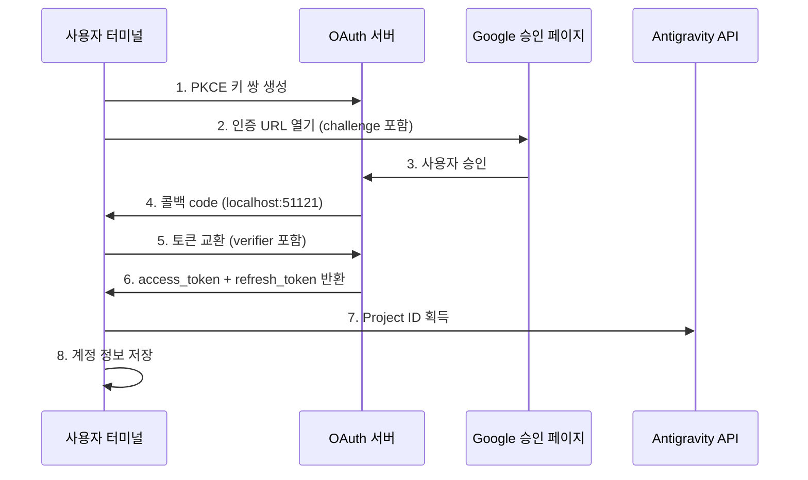

# OAuth 2.0 PKCE 인증: 첫 로그인 완료

## 학습 후 할 수 있는 것

- OAuth 2.0 PKCE 인증 흐름의 보안 메커니즘 이해
- 플러그인의 첫 로그인 완료, Antigravity API 접근 권한 획득
- Project ID의 자동 획득 및 저장 메커니즘 이해
- 토큰 갱신의 자동화 처리 이해

## 현재 문제점

이미 플러그인을 설치하고 모델 정의를 구성했지만, 아직 사용해보지 않았습니다. 매번 `opencode run`을 실행할 때마다 "인증이 필요합니다"라는 메시지가 표시되지만 다음을 알지 못합니다:

- OAuth란 무엇인가? 왜 이렇게 복잡한 인증 방식을 사용해야 할까?
- 인증 과정에서 정확히 무엇이 일어나는가? 안전한가?
- 첫 로그인을 위해 무엇을 준비해야 하는가? 어떤 선택이 있는가?
- 토큰이 만료되면 어떻게 하나? 다시 로그인해야 하나?

## 언제 이 방법을 사용하는가

- **플러그인을 처음 설치한 후**: 사용 전에 반드시 인증을 완료해야 함
- **새 계정을 추가할 때**: 다중 계정 로테이션을 설정하려면 각각 인증 필요
- **토큰이 만료된 후**: 계정이 취소되거나 비밀번호가 변경된 경우 다시 인증 필요
- **새 기기로 전환할 때**: 계정 마이그레이션 시 새 기기에서 다시 로그인 필요

## 🎒 시작 전 준비

::: warning 사전 점검

다음 단계를 완료했는지 확인하세요:

1. **플러그인 설치 완료**: [빠른 설치](/ko/NoeFabris/opencode-antigravity-auth/start/quick-install/) 참조
2. **모델 구성 완료**: 모델 정의를 `~/.config/opencode/opencode.json`에 추가했는지 확인
3. **사용 가능한 Google 계정 보유**: 신뢰가 구축된 계정 사용 권장, 새로 만든 계정은 피할 것

:::

## 핵심 개념

### OAuth 2.0 PKCE란 무엇인가?

**OAuth 2.0**(Open Authorization 2.0)은 제3자 애플리케이션(본 플러그인)이 사용자 비밀번호를 직접 얻지 않고 Google API에 대한 접근 권한을 얻을 수 있게 하는 인증 프로토콜입니다.

**PKCE**(Proof Key for Code Exchange)는 OAuth 2.0의 보안 확장으로, 공개 클라이언트(예: CLI 도구)를 위해 설계되었습니다. 다음 메커니즘을 통해 인증 코드 가로채기 공격을 방지합니다:

```
┌─────────────────────────────────────────────────────────────────┐
│  PKCE 보호 메커니즘                                           │
├─────────────────────────────────────────────────────────────────┤
│  1. 클라이언트가 키 쌍 생성:                                 │
│     - code_verifier (임의 문자열, 비공개)                      │
│     - code_challenge (verifier의 해시값, 공개)                 │
│  2. 인증 URL에 code_challenge 포함                            │
│  3. 콜백 서버가 code를 수신한 후 code_verifier로 검증         │
│  4. 공격자가 code를 가로채도 verifier 없이는 토큰 교환 불가     │
└─────────────────────────────────────────────────────────────────┘
```

::: info

**PKCE vs 기존 OAuth**

기존 OAuth는 `client_secret`로 신원을 검증하지만, 이는 클라이언트가 키를 안전하게 저장할 수 있어야 합니다. CLI 도구는 이를 할 수 없으므로, PKCE는 정적 키 대신 동적으로 생성된 `verifier`를 사용하여 동일한 수준의 보안을 제공하면서 미리 저장된 비밀에 의존하지 않습니다.

:::

### 인증 흐름 개요



## 따라해 보세요

### 1단계: OAuth 로그인 시작

**이유**

`opencode auth login` 명령은 로컬 OAuth 서버를 시작하고, 인증 URL을 생성하며, Google의 콜백을 대기합니다.

**명령 실행**:

```bash
opencode auth login
```

**다음을 확인해야 합니다**:

```
🔑 Initializing Antigravity OAuth...
📋 Starting local OAuth server on http://127.0.0.1:51121
🌐 Opening browser for authorization...

If the browser doesn't open, visit this URL manually:
https://accounts.google.com/o/oauth2/v2/auth?client_id=...&code_challenge=...
```

::: tip

**환경 감지**

플러그인은 실행 환경을 자동으로 감지합니다:

| 환경 | 바인딩 주소 | 이유 |
|--- | --- | ---|
| 로컬 macOS/Linux/Windows | `127.0.0.1` | 가장 안전, 로컬 연결만 허용 |
| WSL / Docker / SSH 원격 | `0.0.0.0` | 호스트 머신의 브라우저에서 접근 허용 |

환경 변수 `OPENCODE_ANTIGRAVITY_OAUTH_BIND`로 기본 설정을 덮어쓸 수 있습니다.

:::

### 2단계: 브라우저에서 승인

**이유**

Google 승인 페이지는 플러그인이 요청하는 권한(Scope)을 표시하며, 사용자가 명시적으로 동의해야 합니다.

**다음을 볼 수 있습니다**:

Google OAuth 승인 페이지에 다음이 표시됩니다:
- 요청자: Antigravity Auth Plugin
- 요청된 권한:
  - 이메일 주소 보기
  - 개인정보 보기
  - Cloud Platform 프로젝트에 접근
  - Google Cloud 로그 및 실험 구성에 접근

**작업**:

1. 요청된 권한이 예상대로인지 확인(범위를 벗어나는 민감한 권한 없는지)
2. "허용" 또는 "승인" 버튼 클릭
3. 페이지가 `http://localhost:51121/oauth-callback`으로 리디렉션될 때까지 대기

**다음을 확인해야 합니다**:

```html
<!DOCTYPE html>
<html>
  <!-- ... -->
  <h1>All set!</h1>
  <p>You've successfully authenticated with Antigravity.</p>
  <!-- ... -->
</html>
```

::: warning

**승인 페이지 닫기 문제**

승인 성공 후 브라우저가 자동으로 닫히지 않으면 탭을 수동으로 닫으세요. 이는 브라우저의 보안 제한이며, 인증 결과에 영향을 주지 않습니다.

:::

### 3단계: 자동 토큰 교환 및 Project ID 획득

**이유**

인증 코드는 임시 자격 증명이므로, 장기적으로 유효한 `refresh_token`으로 교환해야 하며 동시에 Antigravity 프로젝트에 필요한 `Project ID`를 획득해야 합니다.

**백그라운드 자동 수행**:

플러그인은 사용자의 개입 없이 다음 작업을 자동으로 수행합니다:

1. **PKCE 검증**: `code_verifier`로 인증 코드의 유효성 검증
2. **토큰 교환**: `oauth2.googleapis.com/token`으로 POST 요청 전송

   ```typescript
   // 소스코드: src/antigravity/oauth.ts:209
   POST https://oauth2.googleapis.com/token
   Content-Type: application/x-www-form-urlencoded

   {
     client_id: "...",
     client_secret: "...",
     code: "인증 코드",
     grant_type: "authorization_code",
     redirect_uri: "http://localhost:51121/oauth-callback",
     code_verifier: "PKCE verifier"
   }
   ```

3. **사용자 정보 획득**: 이메일 주소 검증

   ```typescript
   // 소스코드: src/antigravity/oauth.ts:231
   GET https://www.googleapis.com/oauth2/v1/userinfo?alt=json
   Authorization: Bearer {access_token}
   ```

4. **자동 Project ID 획득**: Antigravity API에서 프로젝트 ID 획득 시도

   ```typescript
   // 소스코드: src/antigravity/oauth.ts:131
   // 우선순위대로 여러 엔드포인트 시도
   - https://cloudcode-pa.googleapis.com/v1internal:loadCodeAssist (prod)
   - https://daily-cloudcode-pa.sandbox.googleapis.com/v1internal:loadCodeAssist (daily)
   - https://autopush-cloudcode-pa.sandbox.googleapis.com/v1internal:loadCodeAssist (autopush)
   ```

5. **계정 정보 저장**: `~/.config/opencode/antigravity-accounts.json`에 저장

   ```json
   {
     "version": 3,
     "accounts": [
       {
         "email": "your.email@gmail.com",
         "refreshToken": "1//0g...|rising-fact-p41fc",
         "projectId": "rising-fact-p41fc",
         "addedAt": 1737609600000,
         "lastUsed": 1737609600000
       }
     ]
   }
   ```

::: details

**Project ID의 역할**

Project ID는 Google Cloud 프로젝트의 고유 식별자로, API 호출이 어떤 프로젝트에 속하는지 결정하는 데 사용됩니다. Antigravity는 Project ID에 따라 할당량 사용 현황을 추적합니다.

- **자동 획득 성공**: 실제 Project ID 사용(권장)
- **자동 획득 실패**: 기본 Project ID 사용(`rising-fact-p41fc`)

:::

**다음을 확인해야 합니다**:

```
✅ Authentication successful
📧 Account: your.email@gmail.com
🆔 Project ID: rising-fact-p41fc
💾 Saved to: ~/.config/opencode/antigravity-accounts.json
```

### 체크포인트 ✅

**계정이 올바르게 저장되었는지 확인**:

```bash
cat ~/.config/opencode/antigravity-accounts.json
```

**예상 출력**:

```json
{
  "version": 3,
  "accounts": [
    {
      "email": "your.email@gmail.com",
      "refreshToken": "1//0g...|rising-fact-p41fc",
      "projectId": "rising-fact-p41fc",
      "addedAt": 1737609600000,
      "lastUsed": 1737609600000
    }
  ]
}
```

::: tip

**계정 저장 형식**

`refreshToken` 필드의 형식은 `{refresh_token}|{project_id}`입니다. 이 설계는 단일 필드에 토큰과 프로젝트 ID를 저장할 수 있게 하여 저장 로직을 단순화합니다.

:::

## 주의할 점

### 문제 1: 포트 사용 중

**오류 메시지**:

```
❌ Port 51121 is already in use.
Another process is occupying this port.
```

**원인**: 다른 OpenCode 프로세스가 실행 중이거나 다른 프로그램이 포트를 사용 중입니다.

**해결 방법**:

1. 포트를 사용 중인 프로세스 확인 및 종료:

   ```bash
   # macOS/Linux
   lsof -ti:51121 | xargs kill -9

   # Windows
   netstat -ano | findstr :51121
   taskkill /PID <PID> /F
   ```

2. `opencode auth login` 다시 실행

### 문제 2: 브라우저가 자동으로 열리지 않음

**원인**: WSL, Docker 또는 원격 환경에서 `localhost`가 호스트 머신 주소와 다릅니다.

**해결 방법**:

플러그인은 환경을 자동으로 감지하고 수동 접근 URL을 표시합니다:

```
🌐 Opening browser for authorization...

If the browser doesn't open, visit this URL manually:
https://accounts.google.com/o/oauth2/v2/auth?...
```

URL을 복사하여 호스트 머신의 브라우저에서 방문하면 됩니다.

### 문제 3: Project ID 획득 실패

**경고 메시지**:

```
⚠️ Failed to resolve Antigravity project via loadCodeAssist
Using default project ID: rising-fact-p41fc
```

**원인**: 일부 기업 계정이나 특수 권한 구성에서 `loadCodeAssist` API에 접근할 수 없습니다.

**해결 방법**:

1. Antigravity 모델만 사용하는 경우(`:antigravity` 접미사 포함) 기본 Project ID를 사용할 수 있음
2. Gemini CLI 모델을 사용해야 하는 경우(예: `gemini-2.5-pro`), Project ID를 수동으로 구성:

   ```json
   // ~/.config/opencode/antigravity-accounts.json 편집
   {
     "accounts": [
       {
         "email": "your.email@gmail.com",
         "refreshToken": "1//0g...|your-custom-project-id",
         "projectId": "your-custom-project-id"
       }
     ]
   }
   ```

   Project ID 획득 단계:
   - [Google Cloud Console](https://console.cloud.google.com/) 방문
   - 프로젝트 생성 또는 선택
   - **Gemini for Google Cloud API** 활성화
   - 프로젝트 ID 복사(형식: `rising-fact-p41fc`)

### 문제 4: invalid_grant 오류

**오류 메시지**:

```
❌ Token exchange failed: invalid_grant
```

**원인**:
- 인증 코드가 만료됨(유효기간 보통 10분)
- 사용자가 승인 후 애플리케이션 접근 권한을 취소함
- 계정 비밀번호 변경 또는 보안 이벤트 발생

**해결 방법**: `opencode auth login` 다시 실행

## 토큰 갱신 메커니즘

**자동 갱신**: 토큰 만료 문제에 대해 걱정할 필요가 없습니다.

플러그인은 다음 경우에 자동으로 갱신합니다:

| 트리거 조건 | 동작 | 소스코드 위치 |
|--- | --- | ---|
| 토큰 만료 60초 전 | 자동 갱신 | `src/plugin/auth.ts:33` |
| 401 Unauthorized 수신 | 갱신 시도 | `src/plugin/auth.ts:33` |
| 갱신 실패 | 사용자에게 다시 로그인 요청 | `src/plugin.ts:995` |

**갱신 로직**:

```typescript
// 소스코드: src/plugin/auth.ts:33
export function accessTokenExpired(auth: OAuthAuthDetails): boolean {
  // 60초 전에 갱신(클럭 드리프트 예상)
  return auth.expires <= Date.now() + 60 * 1000;
}
```

## 이번 수업 요약

OAuth 2.0 PKCE 인증 흐름의 핵심 요점:

1. **PKCE 보안 메커니즘**: 정적 키 대신 동적 `verifier`를 사용하여 인증 코드 가로채기 방지
2. **로컬 콜백 서버**: `localhost:51121`에서 수신 대기, Google 승인 콜백 수신
3. **토큰 교환**: 인증 코드로 `access_token` 및 `refresh_token` 교환
4. **자동 Project ID**: Antigravity API에서 획득 시도, 실패 시 기본값 사용
5. **자동 갱신**: 토큰 만료 60초 전 자동 갱신, 수동 개입 불필요
6. **계정 저장**: 모든 정보는 `~/.config/opencode/antigravity-accounts.json`에 저장

이제 첫 번째 모델 요청을 보낼 수 있습니다!

## 다음 수업 미리보기

> 다음 수업에서는 **[첫 번째 모델 요청](/ko/NoeFabris/opencode-antigravity-auth/start/first-request/)**을 배웁니다.
>
> 학습 내용:
> - `opencode run`으로 요청 보내는 방법
> - 인증 성공 여부 확인
> - 모델 변형 구성 방법 이해

---

## 부록: 소스코드 참조

<details>
<summary><strong>클릭하여 소스코드 위치 보기</strong></summary>

> 업데이트 날짜: 2026-01-23

| 기능        | 파일 경로                                                                                               | 줄 번호    |
|--- | --- | ---|
| PKCE 키 생성 | [`src/antigravity/oauth.ts`](https://github.com/NoeFabris/opencode-antigravity-auth/blob/main/src/antigravity/oauth.ts#L91-L113)         | 91-113  |
| 인증 URL 빌드   | [`src/antigravity/oauth.ts`](https://github.com/NoeFabris/opencode-antigravity-auth/blob/main/src/antigravity/oauth.ts#L91-L113)         | 91-113  |
| 토큰 교환     | [`src/antigravity/oauth.ts`](https://github.com/NoeFabris/opencode-antigravity-auth/blob/main/src/antigravity/oauth.ts#L201-L270)         | 201-270 |
| 사용자 정보 획득   | [`src/antigravity/oauth.ts`](https://github.com/NoeFabris/opencode-antigravity-auth/blob/main/src/antigravity/oauth.ts#L231-L242)         | 231-242 |
| 자동 Project ID 획득 | [`src/antigravity/oauth.ts`](https://github.com/NoeFabris/opencode-antigravity-auth/blob/main/src/antigravity/oauth.ts#L131-L196)      | 131-196 |
| 환경 감지       | [`src/plugin/server.ts`](https://github.com/NoeFabris/opencode-antigravity-auth/blob/main/src/plugin/server.ts#L31-L134)           | 31-134  |
| OAuth 콜백 서버 | [`src/plugin/server.ts`](https://github.com/NoeFabris/opencode-antigravity-auth/blob/main/src/plugin/server.ts#L140-L366)           | 140-366 |
| 토큰 만료 확인   | [`src/plugin/auth.ts`](https://github.com/NoeFabris/opencode-antigravity-auth/blob/main/src/plugin/auth.ts#L33-L38)               | 33-38   |
| 토큰 만료 시간 계산   | [`src/plugin/auth.ts`](https://github.com/NoeFabris/opencode-antigravity-auth/blob/main/src/plugin/auth.ts#L45-L52)               | 45-52   |

**핵심 상수**:
- `ANTIGRAVITY_CLIENT_ID`: OAuth 클라이언트 ID(`constants.ts:4`)
- `ANTIGRAVITY_CLIENT_SECRET`: OAuth 클라이언트 시크릿(`constants.ts:9`)
- `ANTIGRAVITY_REDIRECT_URI`: OAuth 콜백 주소 `http://localhost:51121/oauth-callback`(`constants.ts:25`)
- `ANTIGRAVITY_SCOPES`: 요청된 권한 목록(`constants.ts:14-20`)
- `ANTIGRAVITY_DEFAULT_PROJECT_ID`: 기본 프로젝트 ID `rising-fact-p41fc`(`constants.ts:71`)

**핵심 함수**:
- `authorizeAntigravity()`: PKCE 키 쌍 및 인증 URL 생성(`oauth.ts:91`)
- `exchangeAntigravity()`: 인증 코드를 액세스 토큰으로 교환(`oauth.ts:201`)
- `fetchProjectID()`: Antigravity API에서 프로젝트 ID 획득(`oauth.ts:131`)
- `startOAuthListener()`: 로컬 OAuth 서버 시작(`server.ts:140`)
- `accessTokenExpired()`: 토큰 만료 여부 확인(`auth.ts:33`)

**중요한 비즈니스 규칙**:
- PKCE는 S256 해시 알고리즘 사용(`oauth.ts:100`)
- 토큰 만료 60초 전 자동 갱신(`auth.ts:3`)
- 오프라인 접근 지원(`access_type=offline`)(`oauth.ts:105`)
- Project ID 엔드포인트 폴백 순서: prod → daily → autopush(`oauth.ts:141-143`)

</details>
