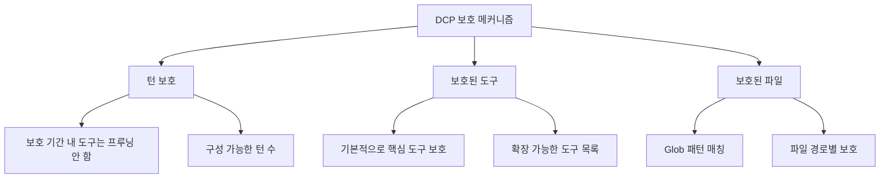

# 보호 메커니즘: 주요 콘텐츠 잘못된 프루닝 방지

## 배운 후 할 수 있는 것

- 턴 보호를 구성하여 AI가 최근 도구 출력을 참조할 시간을 확보
- 보호된 도구 목록을 확장하여 중요한 작업이 프루닝되는 것을 방지
- 보호된 파일 패턴을 구성하여 특정 파일이 실수로 프루닝되는 것을 보호
- 서브에이전트 보호 메커니즘을 이해하여 요약 동작에 영향 주지 않음

## 현재 겪는困境

DCP는 대화 기록에서冗餘한 도구 호출을 자동으로 프루닝하여 토큰을 절약하지만, 때때로 문제가 발생합니다:

- AI가 방금 파일을 읽어서 내용을 기반으로 분석하려는데 DCP가 프루닝해버림
- `write` 도구로 구성 파일을 작성했는데, 나중에 다시 읽어야 하는데 프루닝 후 경로를找不到
- AI가 "위의 코드에 따르면"라고 말하지만 코드가 이미 컨텍스트에 없음

이러한 상황들은 모두 **일부 콘텐츠는 반드시 보호되어야 하며, 프루닝되어서는 안 됨**을 보여줍니다.

## 언제 사용해야 하는가

- AI가 이전에 읽은 파일 내용을 참조해야 할 때
- 중요한 작업(예: 구성 작성, 작업 계획)을 보호해야 할 때
- 특정 파일 경로(예: 시크릿, 키)를 특별히 보호해야 할 때
- 서브에이전트 기능을 개발할 때(DCP가 자동으로 건너뜀)

## 핵심思路

DCP는**3층 보호 메커니즘**을 제공하여 다양한 차원에서 주요 콘텐츠가 잘못 프루닝되는 것을 방지합니다:



**보호 레벨**:
1. **턴 보호**（시간 차원）: 최근 N턴의 도구가 자동으로 보호됨
2. **도구 보호**（도구 차원）: 특정 도구가 절대 프루닝되지 않음
3. **파일 보호**（경로 차원）: 특정 파일을 조작하는 도구가 프루닝되지 않음

세 가지를 조합하여 다층적인 보호망을 형성할 수 있습니다.

---

## 턴 보호

### 턴 보호란 무엇인가

턴 보호（Turn Protection）는 DCP가 제공하는**시간 창 보호 메커니즘**입니다. 활성화하면, 보호 기간 내 도구 호출이 프루닝 캐시에 추가되지 않으며, 어떤 정책으로도 프루닝되지 않습니다.

**역할**: AI가 최근 도구 출력을 참조할 시간을 확보하여 "방금 말했는데 삭제됨"의尴尬을 방지합니다.

### 턴 보호 구성

구성 파일에 추가:

```jsonc
{
  "turnProtection": {
    "enabled": true,
    "turns": 4
  }
}
```

**매개변수 설명**:
- `enabled`: 턴 보호 활성화 여부（기본값 `false`）
- `turns`: 보호 턴 수（기본값 `4`）, 최근 4턴의 도구가 프루닝되지 않음

### 턴 보호의 작동 원리

DCP가 도구 캐치를 동기화할 때（AI가 메시지를 보내기 전마다）, 각 도구의 턴 수를 계산합니다:

```typescript
// 현재 턴 - 도구 생성 턴 < 보호 턴 수
// 이면 해당 도구는 프루닝되지 않음
state.currentTurn - turnCounter < turnProtectionTurns
```

**예시**:
- 현재 턴: 10
- 도구 생성 턴: 8
- 보호 턴 수: 4
- 결과: 10 - 8 = 2 < 4 → **보호됨, 프루닝 안 함**

**효과**:
- 보호 기간 동안 도구가 `<prunable-tools>` 목록에 나타나지 않음
- 자동 정책（중복 제거, 덮어쓰기, 오류 제거）의 영향을 받지 않음
- AI가 `discard`/`extract` 도구로 프루닝할 수 없음

### 권장 구성

| 시나리오 | 권장 턴 수 | 설명 |
| --- | --- | --- |
| 긴 대화（10+ 턴） | 4-6 | AI가 역사 내용을 충분히 참조할 수 있도록 |
| 짧은 대화（< 5 턴） | 2-3 | 너무 긴 보호 기간 필요 없음 |
| 컨텍스트에 크게 의존하는 작업 | 6-8 | 코드 리팩토링, 긴 문서 분석 등 |
| 기본값（컨텍스트에 의존 안 함） | 0-2 | 비활성화 또는 최소값 사용 |

::: tip 注意
턴 보호는 컨텍스트 크기를 증가시키며, 더 많은 도구 출력이 보존되기 때문입니다. 토큰 사용량이 눈에 띄게 증가하면, 보호 턴 수를 적절히 줄이세요.
:::

---

## 보호된 도구

### 기본 보호된 도구

DCP는 다음 도구를 기본적으로 보호하며,**절대** 프루닝되지 않습니다:

| 도구명 | 설명 |
| --- | --- |
| `task` | 작업 관리 도구 |
| `todowrite` | 할 일 목록 작성 |
| `todoread` | 할 일 목록 읽기 |
| `discard` | DCP의 폐기 도구（프루닝 작업 자체） |
| `extract` | DCP의 추출 도구（프루닝 작업 자체） |
| `batch` | 배치 작업 도구 |
| `write` | 파일 작성 도구 |
| `edit` | 파일 편집 도구 |
| `plan_enter` | 계획 진입 마커 |
| `plan_exit` | 계획 종료 마커 |

**이러한 도구가 보호되는 이유**:
- `task`, `todowrite`, `todoread`: 작업 관리는 세션 상태의 핵심이며, 삭제하면 컨텍스트 손실 발생
- `discard`, `extract`: 이들은 DCP 자신의 프루닝 도구이며, 자신을 프루닝할 수 없음
- `batch`, `write`, `edit`: 파일 작업은 AI가 사용자 코드와 상호작용하는 핵심
- `plan_enter`, `plan_exit`: 계획 마커는 세션 구조 이해에 도움

### 보호된 도구 목록 확장

더 많은 도구를 보호해야 하는 경우, 구성에서 확장할 수 있습니다:

```jsonc
{
  "tools": {
    "settings": {
      "protectedTools": [
        "task",
        "todowrite",
        "todoread",
        "discard",
        "extract",
        "batch",
        "write",
        "edit",
        "plan_enter",
        "plan_exit",
        // 보호해야 하는 도구 추가
        "read",
        "filesearch"
      ]
    }
  }
}
```

**전역 도구 보호**:
- `tools.settings.protectedTools`의 도구는 모든 정책에서 보호됨
- 어떤 정책으로도 프루닝되지 않아야 하는 도구에 적합

### 정책 수준의 도구 보호

특정 정책에 대해 보호된 도구를 설정할 수도 있습니다:

```jsonc
{
  "strategies": {
    "deduplication": {
      "enabled": true,
      "protectedTools": [
        "read",  // 중복 제거 시 read 도구 보호
        "filesearch"
      ]
    },
    "purgeErrors": {
      "enabled": true,
      "turns": 4,
      "protectedTools": [
        "write"  // 오류 제거 시 write 도구 보호
      ]
    }
  }
}
```

**사용 시나리오**:
- 특정 정책에서만 도구를 보호하고, 다른 정책에서는 프루닝 허용
- 예: `read`의 중복 제거 프루닝은 허용하되, `write`의 오류 제거 정책은 프루닝 불가

::: info 도구 보호와 턴 보호의 차이점
- **도구 보호**: 도구가 어느 턴에 생성되었든, 보호 목록에 있으면 절대 프루닝되지 않음
- **턴 보호**: 모든 도구（보호된 도구 제외）가 보호 기간 동안 프루닝되지 않지만, 보호 기간이 지나면 프루닝될 수 있음
:::

---

## 보호된 파일 패턴

### 보호된 파일 패턴이란 무엇인가

보호된 파일 패턴을 사용하면 Glob 패턴을 통해**특정 파일 경로의 작업이 프루닝되지 않도록 보호**할 수 있습니다.

**적용 시나리오**:
- 키 파일 보호（`.env`, `secrets.json`）
- 구성 파일 보호（중요한 구성 손실 불가）
- 프로젝트 핵심 파일 보호（入口 파일, 핵심 라이브러리）
- 민감한 디렉터리 보호（예: `src/api/`, `tests/fixtures/`）

### 보호된 파일 패턴 구성

구성 파일에 추가:

```jsonc
{
  "protectedFilePatterns": [
    "**/.env*",
    "**/secrets.json",
    "**/config/*.json",
    "src/core/**/*.ts",
    "tests/fixtures/**/*"
  ]
}
```

### Glob 패턴 설명

DCP는 표준 Glob 패턴을 지원합니다:

| 패턴 | 설명 | 예제 매칭 경로 |
| --- | --- | --- |
| `**` | 모든 레벨의 디렉터리 매칭 | `src/`, `src/components/`, `a/b/c/` |
| `*` | 단일 레벨 디렉터리 아래 모든 파일 매칭 | `src/*.ts`는 `src/index.ts` 매칭 |
| `?` | 단일 문자 매칭 | `file?.txt`는 `file1.txt`, `file2.txt` 매칭 |
| `*.json` | 특정 확장자 매칭 | `config.json`, `data.json` |
| `**/*.json` | 모든 레벨의 JSON 파일 매칭 | `a/b/c.json`, `d.json` |

**주의사항**:
- `*`와 `?`는 `/`（디렉터리 구분자）를 매칭하지 않음
- 매칭은 전체 파일 경로를 대상으로 수행
- 경로 구분자는 통일하여 `/` 사용（Windows에서도）

### 실전 케이스

#### 케이스 1: 환경 변수 파일 보호

```jsonc
{
  "protectedFilePatterns": [
    "**/.env",
    "**/.env.local",
    "**/.env.production"
  ]
}
```

**효과**: `.env` 파일을 조작하는 모든 도구가 프루닝되지 않습니다.

#### 케이스 2: 프로젝트 핵심 파일 보호

```jsonc
{
  "protectedFilePatterns": [
    "src/index.ts",
    "src/core/**/*.ts",
    "src/api/**/*.ts"
  ]
}
```

**효과**: 핵심 모듈과 API를 조작하는 도구 출력이 보존되어, AI가 항상 프로젝트 구조를 볼 수 있습니다.

#### 케이스 3: 테스트 픽스처 데이터 보호

```jsonc
{
  "protectedFilePatterns": [
    "tests/fixtures/**/*",
    "tests/mocks/**/*.json"
  ]
}
```

**효과**: 테스트용 모의 데이터와 고정 입력이 프루닝되지 않아, 테스트 결과 불일치를 방지합니다.

---

## 서브에이전트 보호

### 서브에이전트란 무엇인가

서브에이전트（Subagent）는 OpenCode의 메커니즘으로, 메인 에이전트가 특정 작업（파일 검색, 코드 분석）을 처리하기 위해 서브에이전트를 생성할 수 있습니다. 서브에이전트는 결과를 요약하여 메인 에이전트에게 반환합니다.

### DCP의 서브에이전트 보호

DCP는 서브에이전트 세션을 자동으로 감지하고,**모든 프루닝 작업을 건너뜁니다**.

**구현 원리**:
```typescript
// lib/state/utils.ts
export async function isSubAgentSession(client: any, sessionID: string): Promise<boolean> {
    const result = await client.session.get({ path: { id: sessionID } })
    return !!result.data?.parentID  // parentID가 있으면 서브에이전트임
}
```

**보호가 필요한 이유**:
- 서브에이전트 출력은 메인 에이전트가 보는 요약임
- 서브에이전트 도구 출력을 프루닝하면, 메인 에이전트가 컨텍스트를 이해하지 못할 수 있음
- 서브에이전트 작업은 "효율적 실행"이지 "토큰 절약"이 아님

::: info 사용자 인지
서브에이전트 보호는 자동이며, 아무 것도 구성할 필요가 없습니다. DCP는 로그에 감지된 서브에이전트 세션을 기록합니다.
:::

---

## 따라 하기: 보호 메커니즘 구성

### 第 1 단계: 구성 파일 편집

전역 구성 파일（或 프로젝트 구성 파일）을 열:

```bash
# macOS/Linux
code ~/.config/opencode/dcp.jsonc

# Windows
code $env:APPDATA\opencode\dcp.jsonc
```

### 第 2 단계: 보호 구성 추가

```jsonc
{
  "$schema": "https://raw.githubusercontent.com/Opencode-DCP/opencode-dynamic-context-pruning/main/dcp.schema.json",
  "enabled": true,
  "debug": false,

  // 턴 보호
  "turnProtection": {
    "enabled": true,
    "turns": 4
  },

  // 보호된 파일 패턴
  "protectedFilePatterns": [
    "**/.env*",
    "**/secrets.json"
  ],

  // 확장된 보호된 도구
  "tools": {
    "settings": {
      "nudgeEnabled": true,
      "nudgeFrequency": 10,
      "protectedTools": [
        "task",
        "todowrite",
        "todoread",
        "discard",
        "extract",
        "batch",
        "write",
        "edit",
        "plan_enter",
        "plan_exit",
        "read"
      ]
    },
    "discard": {
      "enabled": true
    },
    "extract": {
      "enabled": true,
      "showDistillation": false
    }
  },

  // 정책 수준의 보호
  "strategies": {
    "deduplication": {
      "enabled": true,
      "protectedTools": ["filesearch"]
    },
    "supersedeWrites": {
      "enabled": false
    },
    "purgeErrors": {
      "enabled": true,
      "turns": 4,
      "protectedTools": ["write"]
    }
  }
}
```

### 第 3 단계: OpenCode 재시작

구성을 수정한 후, 구성이 적용되도록 OpenCode를 재시작:

- macOS/Linux: Dock의 OpenCode 아이콘을 오른쪽 클릭 → 종료 → 다시 열기
- Windows: 작업 표시줄에서 OpenCode를 오른쪽 클릭 → 창 닫기 → 다시 열기

### 第 4 단계: 보호 메커니즘 검증

OpenCode 대화에서 `/dcp context`를 입력하여 현재 컨텍스트 분석을 확인:

```
Session Context Breakdown:
─────────────────────────────────────────────────────────

System         15.2% │████████████████▒▒▒▒▒▒▒▒▒▒▒▒▒▒▒▒▒▒▒▒▒▒▒│  25.1K tokens
User            5.1% │████▒▒▒▒▒▒▒▒▒▒▒▒▒▒▒▒▒▒▒▒▒▒▒▒▒▒▒▒▒▒▒▒▒▒▒▒▒▒│   8.4K tokens
Assistant       35.8% │██████████████████████████████████████▒▒▒▒▒▒▒│  59.2K tokens
Tools (45)      43.9% │████████████████████████████████████████████████│  72.6K tokens

─────────────────────────────────────────────────────────

Summary:
  Pruned:          12 tools (~15.2K tokens)
  Current context: ~165.3K tokens
  Without DCP:     ~180.5K tokens
```

**확인해야 할 내용**:
- `Pruned` 수가 줄어들 수 있음（보호된 도구는 프루닝되지 않기 때문）
- `Current context`가 커질 수 있음（턴 보호가 더 많은 내용을 보존하기 때문）

---

## 함정 경고

### ❌ 오해 1: 과도한 보호로 인한 토큰 낭비

**문제**: 너무 긴 보호 턴 수를 설정하거나 너무 많은 보호된 도구를 추가하여, 컨텍스트가 항상 큼.

**해결**:
- 턴 보호는 일반적으로 2-4턴만 설정
- 정말 중요한 도구만 보호（예: `task`, `write`）
- 정기적으로 `/dcp context`를 확인하여 컨텍스트 크기 모니터링

### ❌ 오해 2: Glob 패턴 매칭 실패

**문제**: `*.json`을 설정했지만, 일부 JSON 파일이 여전히 프루닝됨.

**原因**: `*`는 `/`를 매칭하지 않으므로, `a/b/c.json`이 매칭되지 않음.

**해결**: `**/*.json`을 사용하여 모든 레벨의 JSON 파일을 매칭.

### ❌ 오해 3: OpenCode 재시작을 깜빡함

**문제**: 구성을 수정한 후, 보호 메커니즘이 작동하지 않음.

**原因**: DCP는 시작할 때만 구성 파일을 로드함.

**해결**: 구성을 수정한 후 반드시 OpenCode를 재시작해야 함.

### ❌ 오해 4: 보호된 도구가 프루닝 목록에 나타남

**문제**: 보호된 도구를 설정했는데, `<prunable-tools>` 목록에 나타남.

**原因**: 보호된 도구는 프루닝되지 않지만, 보호 기간 외에 있으면 `<prunable-tools>` 목록에 나타날 수 있음（AI가 참조하기 위해）, 다만 AI가 프루닝을 시도하면 실패함.

**해결**: 이것은 정상적인 동작입니다. AI가 보호된 도구를 프루닝하려고 하면, DCP가 작업을 거부하고 오류를 반환합니다.

---

## 본 수업 요약

DCP의 보호 메커니즘은 3층을 포함합니다:

1. **턴 보호**: 보호 기간 내 도구는 프루닝되지 않아, AI가 역사 내용을 참조할 시간을 줌
2. **보호된 도구**: 특정 도구（예: `task`, `write`）가 절대 프루닝되지 않으며, 사용자 정의 목록으로 확장 가능
3. **보호된 파일 패턴**: Glob 패턴을 통해 특정 파일 경로의 작업 보호
4. **서브에이전트 보호**: DCP가 서브에이전트 세션을 자동으로 감지하고 프루닝 작업을 건너뜀

**권장 구성 전략**:
- 개발 단계: 턴 보호 활성화（2-4턴）, 구성 파일과 핵심 모듈 보호
- 프로덕션 단계: 실제 요구에 따라 조정하여 토큰 절약과 컨텍스트 완전성 균형
- 중요한 작업: 모든 보호 메커니즘 활성화하여 중요한 콘텐츠 손실 방지

---

## 다음 수업 예고

> 다음 수업에서는 **[상태 지속성](../state-persistence/)**을 학습합니다.
>
> 배우게 될 내용:
> - DCP가 세션을 넘어 프루닝 상태와 통계를 어떻게 유지하는지
> - 지속성 파일의 위치와 형식
> - 누적 토큰 절약 효과를 확인하는 방법
> - 지속성 데이터를 정리하는 방법

---

## 부록: 소스 참고

<details>
<summary><strong>클릭하여 소스 위치 보기</strong></summary>

> 업데이트 시간: 2026-01-23

| 기능 | 파일 경로 | 행 번호 |
| --- | --- | --- |
| 턴 보호 로직 | [`lib/state/tool-cache.ts`](https://github.com/Opencode-DCP/opencode-dynamic-context-pruning/blob/main/lib/state/tool-cache.ts#L39-L44) | 39-44 |
| 기본 보호된 도구 | [`lib/config.ts`](https://github.com/Opencode-DCP/opencode-dynamic-context-pruning/blob/main/lib/config.ts#L68-L79) | 68-79 |
| 보호된 파일 매칭 | [`lib/protected-file-patterns.ts`](https://github.com/Opencode-DCP/opencode-dynamic-context-pruning/blob/main/lib/protected-file-patterns.ts#L77-L82) | 77-82 |
| 서브에이전트 감지 | [`lib/state/utils.ts`](https://github.com/Opencode-DCP/opencode-dynamic-context-pruning/blob/main/lib/state/utils.ts#L1-L8) | 1-8 |
| 중복 제거 정책 보호 확인 | [`lib/strategies/deduplication.ts`](https://github.com/Opencode-DCP/opencode-dynamic-context-pruning/blob/main/lib/strategies/deduplication.ts#L49-L57) | 49-57 |
| Discard 도구 보호 확인 | [`lib/strategies/tools.ts`](https://github.com/Opencode-DCP/opencode-dynamic-context-pruning/blob/main/lib/strategies/tools.ts#L89-L112) | 89-112 |

**핵심 상수**:
- `DEFAULT_PROTECTED_TOOLS = ["task", "todowrite", "todoread", "discard", "extract", "batch", "write", "edit", "plan_enter", "plan_exit"]`: 기본 보호된 도구 목록

**핵심 함수**:
- `isProtectedFilePath(filePath, patterns)`: 파일 경로가 보호 패턴과 매칭하는지 확인
- `isSubAgentSession(client, sessionID)`: 세션이 서브에이전트인지 감지

</details>
