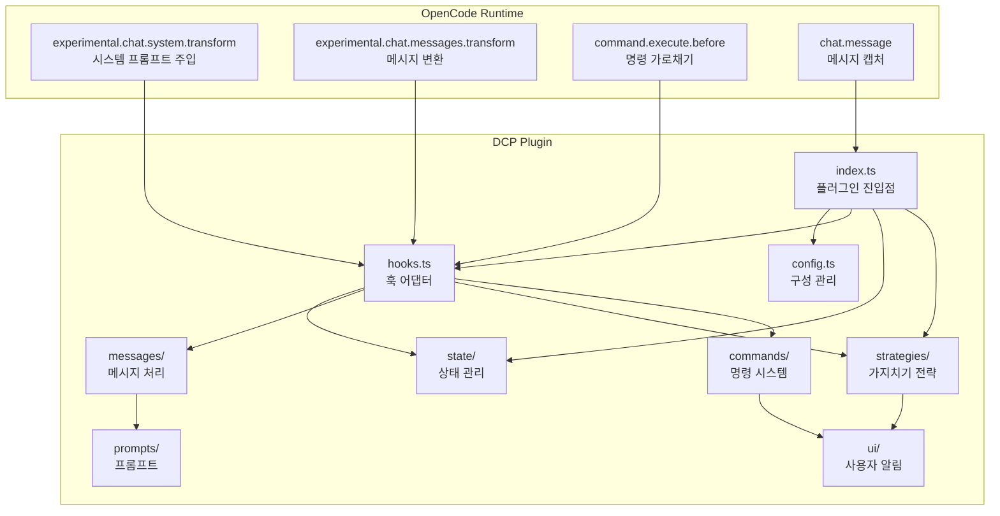
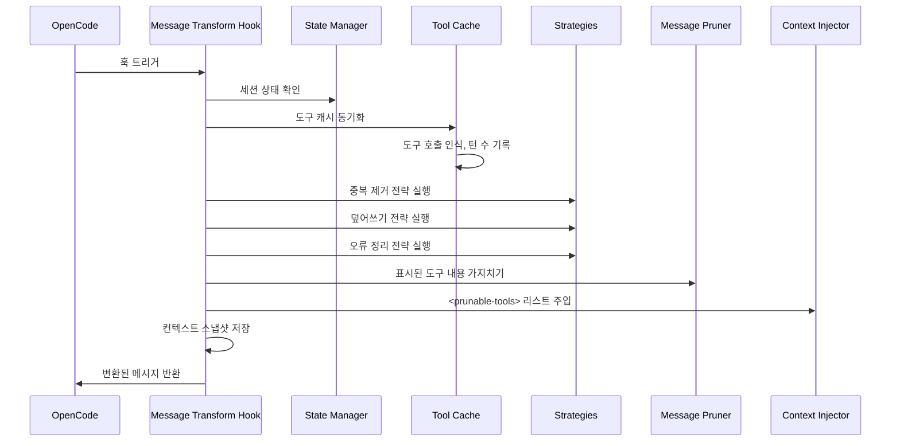
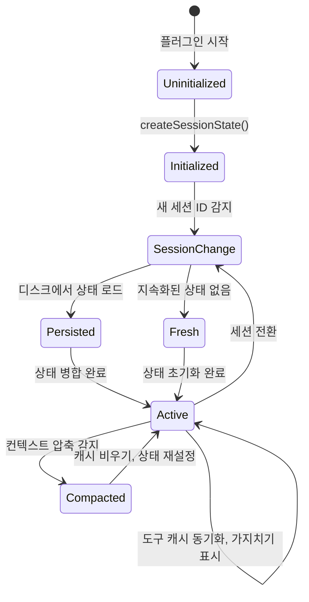
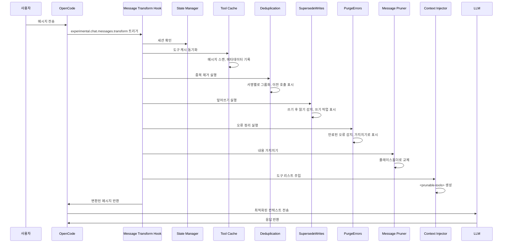
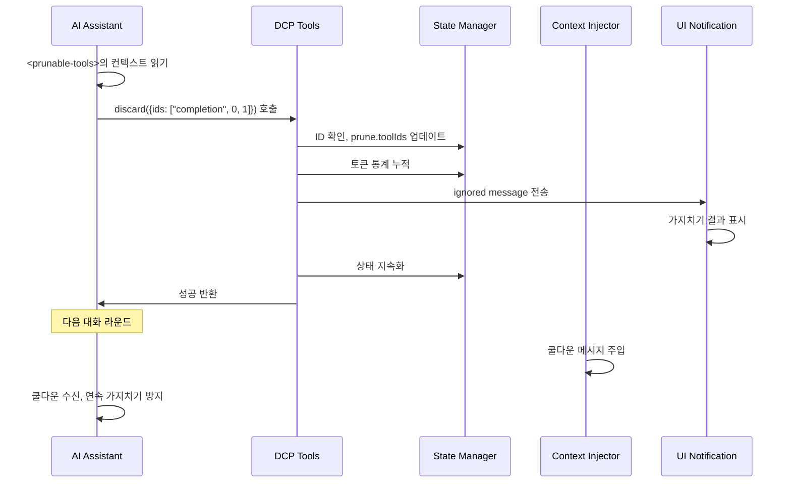

# 아키텍처 개요: DCP 내부 작동 원리

## 배움内容

이 섹션은实际操作이 포함되어 있지 않으며, DCP의 내부 설계를 깊이 있게 이해하는 데 도움이 됩니다. 학습을 마치면 다음을 수행할 수 있습니다:
- DCP가 OpenCode 훅 시스템을 통해 대화 흐름과 어떻게 통합되는지 이해
- 각 모듈의 책임 경계와 상호작용 방식 파악
- 메시지 수신에서 가지치기 완료까지의 전체 호출 체인 이해
- 상태 관리, 메시지 처리, 가지치기 전략의 설계 아이디어 파악

## 핵심 컨셉

DCP는 OpenCode Plugin SDK 기반의 플러그인으로, 훅과 도구를 등록하여 OpenCode의 대화 기능을 확장합니다. 전체 시스템은 "메시지 변환(message transform)"이라는 핵심 컨셉을 중심으로 구성됩니다. AI가 사용자에게 응답하기 전에 매번 DCP가 대화 기록을 스캔, 분석, 가지치기한 후 최적화된 컨텍스트를 LLM에 전송합니다.

::: info 왜 "메시지 변환"인가?

OpenCode는 `experimental.chat.messages.transform` 훅을 제공하여 플러그인이 LLM에 메시지를 보내기 전에 수정할 수 있게 합니다. 이것이 바로 DCP에 필요한 기능입니다. LLM이 컨텍스트를 보기 전에冗余한 도구 호출을 제거합니다.

:::

시스템은 모듈식 설계를 채택하여 각 모듈의 책임이 명확합니다:
- **config**: 다중 레벨 지원을 포함한 구성 관리
- **state**: 세션 수준의 런타임 상태 관리
- **messages**: 실제 가지치기 및 주입 작업 실행
- **strategies**: 자동 정리 규칙 정의
- **commands**: 수동 제어 및 통계 조회 제공
- **hooks**: OpenCode와 DCP 모듈 연결
- **ui**: 가지치기 결과 및 통계 정보 표시

## 모듈 아키텍처 다이어그램



## 플러그인 진입점과 초기화

플러그인 진입점은 `index.ts`에 정의되어 있으며, DCP와 OpenCode Plugin API의 유일한 연결 지점입니다.

### 플러그인 등록 흐름

```typescript
const plugin: Plugin = (async (ctx) => {
    const config = getConfig(ctx)
    if (!config.enabled) {
        return {}
    }

    const logger = new Logger(config.debug)
    const state = createSessionState()

    return {
        "experimental.chat.system.transform": createSystemPromptHandler(...),
        "experimental.chat.messages.transform": createChatMessageTransformHandler(...),
        "chat.message": async (input, _output) => { /* variant 캐시 */ },
        "command.execute.before": createCommandExecuteHandler(...),
        tool: {
            discard: createDiscardTool(...),
            extract: createExtractTool(...),
        },
        config: async (opencodeConfig) => { /* OpenCode 구성 수정 */ },
    }
}) satisfies Plugin
```

**초기화 단계**:
1. 구성 로드 (다중 레벨 병합 지원: 기본값 → 전역 → 환경 변수 → 프로젝트)
2. 플러그인이 비활성화된 경우 즉시 빈 객체 반환
3. 로깅 시스템 및 세션 상태 객체 생성
4. 네 개의 훅과 두 개의 도구 등록

**구성 수정 단계**:
- `config` 훅을 통해 `discard`와 `extract` 도구를 `experimental.primary_tools`에 추가
- `/dcp` 명령 등록

## 훅 시스템과 메시지 변환

`hooks.ts`는 OpenCode의 훅 이벤트를 DCP 내부 모듈 호출로 변환합니다. 이것이 DCP의 핵심 디스패치 레이어입니다.

### 시스템 프롬프트 주입 훅

```typescript
createSystemPromptHandler(state, logger, config)
```

**호출 타이밍**: 시스템 프롬프트를 구축할 때마다

**주요 책임**:
1. 하위 에이전트 세션 감지 (하위 에이전트인 경우 주입 건너뛰기)
2. 내부 에이전트 감지 (대화 요약 생성기 등, 주입 건너뛰기)
3. 구성에 따라 적절한 프롬프트 템플릿 선택:
   - discard와 extract를 동시에 활성화: `system/system-prompt-both`
   - discard만 활성화: `system/system-prompt-discard`
   - extract만 활성화: `system/system-prompt-extract`
4. 도구 설명을 시스템 프롬프트에 주입

**왜 시스템 프롬프트 주입이 필요한가?**

AI는 `discard`와 `extract` 도구를 사용하여 컨텍스트를 최적화할 수 있어야 합니다. 시스템 프롬프트에서 이러한 도구의 용도를 설명함으로써 AI가 언제 호출할지 스스로 결정할 수 있습니다.

### 메시지 변환 훅

```typescript
createChatMessageTransformHandler(ctx.client, state, logger, config)
```

**호출 타이밍**: AI가 응답 메시지를 준비할 때마다 (LLM에 보내기 전)

**처리 흐름**:



**핵심 단계**:

1. **세션 확인** (`checkSession`)
   - 세션 ID 변경 감지
   - 새 세션인 경우 디스크에서 지속화된 상태 로드
   - 컨텍스트 압축 감지 (OpenCode의 summary 메커니즘), 압축 감지 시 도구 캐시 비우기

2. **도구 캐시 동기화** (`syncToolCache`)
   - 모든 메시지의 도구 호출 스캔
   - 각 도구의 `callID`, 도구명, 매개변수, 상태, 턴 수 기록
   - 보호된 도구와 턴 보호 기간 내의 도구 건너뛰기
   - `nudgeCounter` (가지치기되지 않은 도구 카운터) 유지

3. **자동 전략 실행**
   - `deduplicate`: 중복 제거, 최신 호출 유지
   - `supersedeWrites`: 이미 읽기によって 덮어쓰여진 쓰기 작업 정리
   - `purgeErrors`: 만료된 오류 도구의 입력 정리

4. **내용 가지치기** (`prune`)
   - 표시된 도구의 `output`을 플레이스홀더로 교체
   - 오류 도구의 `input`을 플레이스홀더로 교체

5. **도구 리스트 주입** (`insertPruneToolContext`)
   - `<prunable-tools>` 리스트 생성 (숫자 ID, 도구명, 매개변수 요약 포함)
   - 필요에 따라 리마인더 메시지 주입 (nudge)
   - 이전 작업이 가지치기인 경우 쿨다운 메시지 주입

6. **컨텍스트 스냅샷 저장**
   - 변환된 메시지를 로그 디렉토리에 저장하여 디버깅 용이하게 함

### 명령 가로채기 훅

```typescript
createCommandExecuteHandler(ctx.client, state, logger, config, ctx.directory)
```

**호출 타이밍**: 사용자가 명령을 실행할 때

**주요 책임**:
- `/dcp`로 시작하는 명령 가로채기
- 해당 명령 핸들러로分发:
  - `/dcp` → 도움말 표시
  - `/dcp context` → 토큰 사용 분석 표시
  - `/dcp stats` → 누적 가지치기 통계 표시
  - `/dcp sweep [n]` → 도구 수동 가지치기
- 특수 오류 (`__DCP_*_HANDLED__`)를 발생시켜 OpenCode가 기본 명령 처리 수행阻止

## 상태 관리

`state/` 모듈은 세션 수준의 런타임 상태와 지속화를 담당합니다.

### 핵심 데이터 구조

**SessionState** (메모리 상태):
```typescript
{
    sessionId: string | null,           // 현재 세션 ID
    isSubAgent: boolean,               // 하위 에이전트 세션 여부
    prune: { toolIds: string[] },       // 이미 표시된 가지치기 도구 ID 리스트
    stats: {
        pruneTokenCounter: number,      // 현재 세션 가지치기 토큰 수
        totalPruneTokens: number,       // 이력 누적 가지치기 토큰 수
    },
    toolParameters: Map<string, ToolParameterEntry>,  // 도구 호출 캐시
    nudgeCounter: number,               // 가지치기되지 않은 도구 카운터 (리마인더 트리거용)
    lastToolPrune: boolean,             // 이전 작업이 도구 가지치기였는지 여부
    lastCompaction: number,             // 마지막 컨텍스트 압축 타임스탬프
    currentTurn: number,                // 현재 턴 수
    variant: string | undefined,       // 모델 변체 (예: claude-3.5-sonnet)
}
```

**ToolParameterEntry** (도구 메타데이터):
```typescript
{
    tool: string,                       // 도구 이름
    parameters: any,                    // 도구 매개변수
    status: ToolStatus | undefined,     // 실행 상태
    error: string | undefined,          // 오류 정보
    turn: number,                       // 해당 호출을 생성한 턴 수
}
```

### 상태 생명주기



**주요 상태 전환**:

1. **세션 초기화** (`ensureSessionInitialized`)
   - `sessionID` 변경 감지
   - 하위 에이전트 여부 감지 (`session.parentID`를 통해)
   - 디스크에서 `PersistedSessionState` 로드
   - 턴 카운터 및 압축 타임스탬프 초기화

2. **컨텍스트 압축 처리**
   - OpenCode의 `summary` 메시지 감지 (`msg.info.summary === true`)
   - 도구 캐시 및 가지치기 리스트 비우기
   - 압축 타임스탬프 기록, 중복 정리 방지

3. **지속화**
   - 가지치기 작업 완료 후 비동기로 `~/.local/share/opencode/storage/plugin/dcp/{sessionId}.json`에 저장
   - 세션 이름, 가지치기 리스트, 통계 데이터, 마지막 업데이트 시간 포함

## 메시지 처리 모듈

`messages/` 모듈은 실제 가지치기 및 주입 작업을 담당합니다.

### 가지치기 작업 (prune.ts)

**핵심 함수**: `prune(state, logger, config, messages)`

**세 개의 하위 함수**:

1. **`pruneToolOutputs`**
   - 표시된 도구의 `output`을 플레이스홀더로 교체
   - `completed` 상태인 도구만 처리
   - `question` 도구 건너뛰기 (질문 도구의 특수 처리)

2. **`pruneToolInputs`**
   - `question` 도구만 처리
   - `questions` 필드를 플레이스홀더로 교체 (사용자 답변 유지)

3. **`pruneToolErrors`**
   - 오류 도구의 입력 매개변수 정리
   - 오류 메시지는 유지, 문자열 입력만 제거 (매개변수가 큰 경우)

**플레이스홀더 설계**:
```
[Output removed to save context - information superseded or no longer needed]
[input removed due to failed tool call]
[questions removed - see output for user's answers]
```

### 컨텍스트 주입 (inject.ts)

**핵심 함수**: `insertPruneToolContext(state, config, logger, messages)`

**흐름**:

1. **도구 리스트 생성** (`buildPrunableToolsList`)
   - 도구 캐시 순회, 제외:
     - 이미 가지치기된 도구
     - 보호된 도구 (`task`, `write`, `edit` 등)
     - 보호된 파일 경로 (`protectedFilePatterns`와 일치하는 경우)
   - 각 도구에 대한 설명 생성: `{numericId}: {toolName}, {paramKey}`
   - 예시: `3: read, src/config.ts`

2. **`<prunable-tools>` 태그로 래핑**
   ```html
   <prunable-tools>
   The following tools have been invoked and are available for pruning. This list does not mandate immediate action. Consider your current goals and resources you need before discarding valuable tool inputs or outputs. Consolidate your prunes for efficiency; it is rarely worth pruning a single tiny tool output. Keep your context free of noise.
   0: read, src/config.ts
   1: read, src/config.ts
   2: read, src/utils.ts
   </prunable-tools>
   ```

3. **쿨다운 상태 처리**
   - 이전 작업이 `discard` 또는 `extract`인 경우 쿨다운 메시지 주입:
   ```html
   <prunable-tools>
   Context management was just performed. Do not use discard or extract tools again. A fresh list will be available after your next tool use.
   </prunable-tools>
   ```

4. **리마인더 메시지 주입**
   - `nudgeCounter >= nudgeFrequency`인 경우 리마인더 텍스트 추가
   - 리마인더 형식: `"You have not used context pruning in a while. Consider using discard/extract tools to reduce token usage."`

5. **메시지 삽입 위치 선택**
   - 마지막 메시지가 사용자 메시지인 경우 합성 사용자 메시지 삽입
   - 그렇지 않으면 합성 어시스턴트 메시지 삽입
   - `variant`를 사용하여 다양한 모델과 호환되는 메시지 형식 보장

## 가지치기 전략 모듈

`strategies/` 모듈은 자동 정리 규칙을 정의합니다.

### 중복 제거 전략 (deduplication.ts)

**핵심 함수**: `deduplicate(state, logger, config, messages)`

**알고리즘**:
1. 모든 도구 ID의 시간순 리스트 구축
2. 각 도구에 대해 "서명" 계산: `tool::normalizedParameters`
   - 매개변수 정규화: `null`/`undefined` 제거
   - 키 순서 정렬: `{"b":1,"a":2}`와 `{"a":2,"b":1}`가 동일한 서명 생성
3. 서명별로 그룹화
4. 각 그룹에서 마지막(최신)만 유지, 다른 것은 가지치기로 표시

**예시**:
```typescript
// 원본 도구 호출
Tool Call 1: read({filePath: "src/config.ts"})
Tool Call 2: read({filePath: "src/config.ts"})
Tool Call 3: read({filePath: "src/utils.ts"})

// 서명 그룹화
Signature 1: "read::{\"filePath\":\"src/config.ts\"}" → [Tool Call 1, Tool Call 2]
Signature 2: "read::{\"filePath\":\"src/utils.ts\"}" → [Tool Call 3]

// 가지치기 결과
표시된 가지치기: [Tool Call 1]  // Tool Call 2 유지 (최신)
유지: [Tool Call 2, Tool Call 3]
```

### 덮어쓰기 전략 (supersede-writes.ts)

**핵심 함수**: `supersedeWrites(state, logger, config, messages)`

**알고리즘**:
1. 모든 도구 호출 시간순 스캔
2. 파일 추적 테이블 유지:
   ```typescript
   {
       "src/config.ts": {
           lastWrite: callId,
           lastWriteTime: timestamp,
           lastRead: callId,
           lastReadTime: timestamp,
       }
   }
   ```
3. 패턴 감지:
   - 파일의 `lastWriteTime < lastReadTime`인 경우 쓰기 작업이 읽기로 덮어쓰여진 것
   - 해당 쓰기 작업의 `input`을 가지치기로 표시

**시나리오**:
```typescript
// 타임라인
Turn 1: write({filePath: "src/config.ts", content: "..."})  // lastWrite = call1
Turn 2: read({filePath: "src/config.ts"})                 // lastRead = call2 (쓰기 작업 덮어쓰기)
Turn 3: read({filePath: "src/config.ts"})                 // 최신 읽기 유지

// 가지치기 결과
표시된 가지치기: [Turn 1의 write 호출]
```

### 오류 정리 전략 (purge-errors.ts)

**핵심 함수**: `purgeErrors(state, logger, config, messages)`

**알고리즘**:
1. `error` 상태인 모든 도구 스캔
2. 현재 턴 수와 도구 생성 턴의 차이 확인
3. 차이가 > `strategies.purgeErrors.turns` (기본값 4)인 경우 가지치기로 표시

**보호 메커니즘**:
- 오류 메시지 유지 (`part.state.error`)
- 입력 매개변수만 제거 (`part.state.input`), 오류 입력이 클 수 있기 때문

**시나리오**:
```typescript
Turn 1: read({filePath: "nonexistent.txt"}) → error
Turn 2-5: 다른 작업
Turn 6: 사용자가 대화 계속

// purgeErrors.turns = 4인 경우
// Turn 6 - Turn 1 = 5 > 4
// Turn 1의 오류 입력 가지치기로 표시
```

### LLM驱动 도구 (tools.ts)

**Discard 도구**:
```typescript
{
    name: "discard",
    description: "Remove completed task or noise tool outputs",
    parameters: {
        ids: ["completion", 0, 1, 2]  // 첫 번째 요소가 원인: 'completion' 또는 'noise'
    }
}
```

**Extract 도구**:
```typescript
{
    name: "extract",
    description: "Extract key findings then remove original tool outputs",
    parameters: {
        ids: [0, 1, 2],
        distillation: ["key finding 1", "key finding 2", "key finding 3"]
    }
}
```

**처리 흐름**:
1. AI가 숫자 ID 리스트와 함께 도구 호출
2. 숫자 ID를 실제 `callID`로 매핑
3. 도구가 보호 목록에 없는지 확인
4. `prune.toolIds` 업데이트
5. `ignored message`를 통해 가지치기 결과 표시
6. 상태 지속화

## 명령 시스템

`commands/` 모듈은 수동 제어 및 통계 조회를 제공합니다.

### Context 명령

```bash
/dcp context
```

**출력**: 토큰 사용 분석 (막대 그래프 포함)
```
╭───────────────────────────────────────────────────────────╮
│                  DCP Context Analysis                     │
╰───────────────────────────────────────────────────────────╯

Session Context Breakdown:
──────────────────────────────────────────────────────────

System         15.2% │████████████████▒▒▒▒▒▒▒▒▒▒▒▒▒▒▒▒▒▒▒▒▒▒▒│  25.1K tokens
User            5.1% │████▒▒▒▒▒▒▒▒▒▒▒▒▒▒▒▒▒▒▒▒▒▒▒▒▒▒▒▒▒▒▒▒▒▒▒▒▒▒│   8.4K tokens
Assistant       35.8% │██████████████████████████████████████▒▒▒▒▒▒▒│  59.2K tokens
Tools (45)      43.9% │████████████████████████████████████████████████│  72.6K tokens

──────────────────────────────────────────────────────────

Summary:
  Pruned:          12 tools (~15.2K tokens)
  Current context: ~165.3K tokens
  Without DCP:     ~180.5K tokens
```

**계산 로직**:
- System: `firstAssistant.input + cache.read - tokenizer(firstUserMessage)`
- User: `tokenizer(all user messages)`
- Tools: `tokenizer(toolInputs + toolOutputs) - prunedTokens`
- Assistant: 잔차 계산

### Stats 명령

```bash
/dcp stats
```

**출력**: 누적 가지치기 통계
```
╭───────────────────────────────────────────────────────────╮
│                      DCP Statistics                      │
╰───────────────────────────────────────────────────────────╯

Session Pruning:
  Tools pruned: 12
  Tokens saved: ~15.2K
  Last prune:   discard (2 turns ago)

Lifetime Statistics:
  Total tokens saved: ~145.8K
```

### Sweep 명령

```bash
/dcp sweep [n]
```

**두 가지 모드**:
1. 기본값: 마지막 사용자 메시지 이후의 모든 도구 가지치기
2. 지정: `/dcp sweep 5`, 마지막 5개 도구 가지치기

**처리 흐름**:
1. 마지막 사용자 메시지 위치 찾기
2. 후속 도구 호출 추출
3. 보호된 도구 및 보호된 파일 필터링
4. 가지치기로 표시
5. 결과 및 토큰 절약 표시

## 구성 시스템

`config.ts`는 구성 로드 및 검증을 담당합니다.

### 구성 우선순위

```
기본값 (1) < 전역 (2) < 환경 변수 (3) < 프로젝트 (4)
```

**구성 경로**:
- 전역: `~/.config/opencode/dcp.jsonc`
- 환경 변수: `$OPENCODE_CONFIG_DIR/dcp.jsonc`
- 프로젝트: `<project>/.opencode/dcp.jsonc`

### 구성 병합 흐름

```typescript
const defaultConfig = { /* 하드코딩된 기본값 */ }
const globalConfig = loadConfig(globalPath) || {}
const envConfig = loadConfig(envPath) || {}
const projectConfig = loadConfig(projectPath) || {}

const finalConfig = {
    ...defaultConfig,
    ...globalConfig,
    ...envConfig,
    ...projectConfig,
}
```

### 검증 메커니즘

- Zod 스키마를 사용하여 구성 구조 정의
- 구성が無效한 경우 Toast 경고 표시 및 기본값으로 폴백
- 구성 파일이 없을 경우 기본 구성 자동 생성

## 모듈 종속 관계

| 모듈        | 책임                | 종속 모듈                              | 종속받는 모듈                  |
| --- | --- | --- | --- |
| config      | 구성 관리           | -                                     | index, hooks, strategies, commands |
| hooks       | 훅 어댑터           | config, state, logger, messages, strategies, commands | index |
| state       | 상태 관리           | logger                                | index, hooks, strategies    |
| messages    | 메시지 처리           | state, logger, prompts, ui, protected-file-patterns | hooks |
| strategies   | 가지치기 전략           | state, logger, messages, ui, protected-file-patterns | hooks |
| commands     | 명령 처리           | state, logger, messages, ui, strategies | hooks |
| ui          | 사용자 알림           | state, logger, prompts                | strategies, commands        |
| prompts     | 프롬프트 관리         | -                                     | hooks, messages, strategies |
| logger      | 로깅 시스템           | -                                     | index, config, hooks, strategies, state, ui, commands |

## 전체 호출 체인

### 자동 가지치기 흐름



### LLM驱动 가지치기 흐름



## 성능 고려 사항

### 도구 캐시 제한

- 최대 용량: 1000개 (`MAX_TOOL_CACHE_SIZE`)
- 정리 전략: FIFO (선입선출)
- 트리거 조건: 동기화 후 크기 확인마다

### 로깅 시스템

- 디버그 로그: `~/.config/opencode/logs/dcp/daily/YYYY-MM-DD.log`
- 컨텍스트 스냅샷: `~/.config/opencode/logs/dcp/context/{sessionId}/`
- 로그 레벨: 구성 가능 (`config.debug`)

### 하위 에이전트 감지

- 감지 방식: `session.parentID` 존재 여부
- 처리 전략: 모든 가지치기 작업 건너뛰기 (중복 가지치기 방지)

## 이 수업小结

DCP의 아키텍처 설계는 "메시지 변환"이라는 핵심을 중심으로 하며, OpenCode의 훅 시스템을 통해 대화 흐름과 원활하게 통합됩니다. 시스템은 모듈식 설계를 채택하여 각 모듈의 책임이 명확합니다:

- **플러그인 진입점** (`index.ts`)은 훅과 도구 등록 담당
- **훅 시스템** (`hooks.ts`)은 이벤트分发 및调度 담당
- **상태 관리** (`state/`)는 세션 수준 상태 및 지속화 담당
- **메시지 처리** (`messages/`)는 실제 가지치기 및 주입 담당
- **가지치기 전략** (`strategies/`)은 자동 정리 규칙 정의
- **명령 시스템** (`commands/`)은 수동 제어 제공
- **구성 시스템** (`config.ts`)은 다중 레벨 구성 지원

전체 프로세스는 `experimental.chat.messages.transform` 훅에서 완료됩니다: 도구 캐시 동기화 → 자동 전략 실행 → 내용 가지치기 → 도구 리스트 주입. 이러한 설계는 LLM이 컨텍스트를 보기 전에 DCP가 최적화를 완료하면서도 플러그인의 유지 관리성과 확장성을 보장합니다.

---

## 부록: 소스 코드 참고

<details>
<summary><strong>클릭하여 소스 위치 보기</strong></summary>

> 업데이트 시간: 2026-01-23

| 기능        | 파일 경로                                                                                    | 행 번호    |
| --- | --- | --- |
| 플러그인 진입점 및 훅 등록 | [`index.ts`](https://github.com/Opencode-DCP/opencode-dynamic-context-pruning/blob/main/index.ts) | 12-102 |
| 시스템 프롬프트 주입 훅 | [`lib/hooks.ts`](https://github.com/Opencode-DCP/opencode-dynamic-context-pruning/blob/main/lib/hooks.ts) | 20-53 |
| 메시지 변환 훅 | [`lib/hooks.ts`](https://github.com/Opencode-DCP/opencode-dynamic-context-pruning/blob/main/lib/hooks.ts) | 55-82 |
| 명령 가로채기 훅 | [`lib/hooks.ts`](https://github.com/Opencode-DCP/opencode-dynamic-context-pruning/blob/main/lib/hooks.ts) | 84-156 |
| 세션 상태 관리 | [`lib/state/state.ts`](https://github.com/Opencode-DCP/opencode-dynamic-context-pruning/blob/main/lib/state/state.ts) | 7-143 |
| 도구 캐시 동기화 | [`lib/state/tool-cache.ts`](https://github.com/Opencode-DCP/opencode-dynamic-context-pruning/blob/main/lib/state/tool-cache.ts) | 11-86 |
| 상태 지속화 | [`lib/state/persistence.ts`](https://github.com/Opencode-DCP/opencode-dynamic-context-pruning/blob/main/lib/state/persistence.ts) | - |
| 메시지 가지치기 | [`lib/messages/prune.ts`](https://github.com/Opencode-DCP/opencode-dynamic-context-pruning/blob/main/lib/messages/prune.ts) | 11-106 |
| 컨텍스트 주입 | [`lib/messages/inject.ts`](https://github.com/Opencode-DCP/opencode-dynamic-context-pruning/blob/main/lib/messages/inject.ts) | 102-157 |
| 중복 제거 전략 | [`lib/strategies/deduplication.ts`](https://github.com/Opencode-DCP/opencode-dynamic-context-pruning/blob/main/lib/strategies/deduplication.ts) | 13-83 |
| 덮어쓰기 전략 | [`lib/strategies/supersede-writes.ts`](https://github.com/Opencode-DCP/opencode-dynamic-context-pruning/blob/main/lib/strategies/supersede-writes.ts) | - |
| 오류 정리 전략 | [`lib/strategies/purge-errors.ts`](https://github.com/Opencode-DCP/opencode-dynamic-context-pruning/blob/main/lib/strategies/purge-errors.ts) | - |
| LLM驱动 도구 | [`lib/strategies/tools.ts`](https://github.com/Opencode-DCP/opencode-dynamic-context-pruning/blob/main/lib/strategies/tools.ts) | - |
| Context 명령 | [`lib/commands/context.ts`](https://github.com/Opencode-DCP/opencode-dynamic-context-pruning/blob/main/lib/commands/context.ts) | - |
| Stats 명령 | [`lib/commands/stats.ts`](https://github.com/Opencode-DCP/opencode-dynamic-context-pruning/blob/main/lib/commands/stats.ts) | - |
| Sweep 명령 | [`lib/commands/sweep.ts`](https://github.com/Opencode-DCP/opencode-dynamic-context-pruning/blob/main/lib/commands/sweep.ts) | - |
| 구성 관리 | [`lib/config.ts`](https://github.com/Opencode-DCP/opencode-dynamic-context-pruning/blob/main/lib/config.ts) | - |
| 로깅 시스템 | [`lib/logger.ts`](https://github.com/Opencode-DCP/opencode-dynamic-context-pruning/blob/main/lib/logger.ts) | - |

**주요 상수**:
- `MAX_TOOL_CACHE_SIZE = 1000`: 도구 캐시 최대 용량, 메모리 무한 증가 방지 (`lib/state/tool-cache.ts:6`)

**주요 함수**:
- `createSystemPromptHandler()`: 시스템 프롬프트 주입 훅 생성, AI에게 사용 가능한 가지치기 도구 설명 (`lib/hooks.ts:20-53`)
- `createChatMessageTransformHandler()`: 메시지 변환 훅 생성, DCP의 핵심 디스패치러, 상태 관리, 전략 실행, 메시지 가지치기, 컨텍스트 주입 조정 (`lib/hooks.ts:55-82`)
- `syncToolCache()`: 도구 매개변수 캐시 동기화, 각 도구 호출의 메타데이터 기록 (callID, 매개변수, 상태, 턴 수), 후속 가지치기 전략에 사용 (`lib/state/tool-cache.ts:11-86`)
- `deduplicate()`: 서명 매칭을 통해 중복 도구 호출 식별, 최신 것 유지 (`lib/strategies/deduplication.ts:13-83`)
- `supersedeWrites()`: 후속 읽기로 덮어쓰여진 쓰기 작업 입력 정리 (`lib/strategies/supersede-writes.ts`)
- `purgeErrors()`: 만료된 오류 도구의 입력 매개변수 정리 (`lib/strategies/purge-errors.ts`)
- `prune()`: 메시지 가지치기 주 함수, 세 개의 하위 함수를 호출하여 도구 출력, 도구 입력, 오류 입력 각각 가지치기 (`lib/messages/prune.ts:11-20`)
- `insertPruneToolContext()`: `<prunable-tools>` 리스트를 컨텍스트에 주입, AI가 가지치기 가능한 도구 인식 제공 (`lib/messages/inject.ts:102-157`)
- `createDiscardTool()`: 완료된 작업 또는 노이즈 도구 출력을 제거할 수 있는 discard 도구 스펙 생성 (`lib/strategies/tools.ts`)
- `createExtractTool()`: 핵심 발견 추출 후 원본 도구 출력을 제거할 수 있는 extract 도구 스펙 생성 (`lib/strategies/tools.ts`)
- `createSessionState()`: 새로운 세션 상태 객체 생성, 모든 상태 필드 초기화 (`lib/state/state.ts:42-60`)
- `ensureSessionInitialized()`: 세션 초기화 보장, 세션 전환, 하위 에이전트 감지, 상태 로드 처리 (`lib/state/state.ts:80-116`)

**주요 데이터 구조**:
- `SessionState`: 세션 수준의 런타임 상태, sessionId, 가지치기 리스트, 통계 데이터, 도구 캐시, 턴 카운터 등 포함 (`lib/state/types.ts:27-38`)
- `ToolParameterEntry`: 단일 도구 호출의 메타데이터 캐시, 도구명, 매개변수, 상태, 오류 정보, 턴 수 포함 (`lib/state/types.ts:10-16`)
- `Prune`: 가지치기 상태, 표시된 가지치기 도구 호출 ID 리스트 기록 (`lib/state/types.ts:23-25`)
- `SessionStats`: 세션 통계 데이터, 현재 세션 가지치기 토큰 수 및 이력 누적 가지치기 토큰 수 포함 (`lib/state/types.ts:18-21`)

**주요 타입 정의**:
- `ToolStatus`: 도구 실행 상태 열거형, pending(대기 중), running(실행 중), completed(완료), error(실패) 포함 (`lib/state/types.ts:8`)

</details>

---

## 다음 수업 예고

> 다음 수업에서는 **[토큰 계산 원리](../token-calculation/)**를 학습합니다.
>
> 다음을 배우게 됩니다:
> - DCP가 토큰 사용량을 정확히 계산하는 방법
> - 다양한 메시지 타입(System, User, Assistant, Tools)의 계산 방식
> - 토큰 절약 통계의 누적 메커니즘
> - 토큰 계산 문제 디버깅 방법
