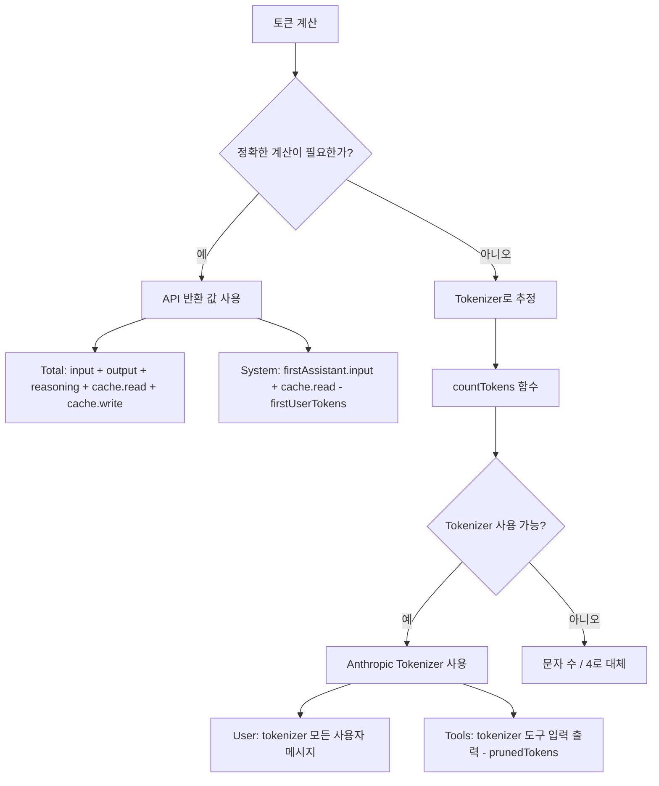

# 토큰 계산 원리

## 학습 후 달성할 수 있는 것

- DCP의 토큰 계산 전략 이해 (API 값 vs 추정 값)
- `/dcp context` 출력의 토큰 분포 이해
- 토큰 추정의 오차 범위와 최적화 방법 파악
- DCP의 절감 효과 정확하게 평가

## 현재 겪고 있는 문제

`/dcp context` 출력에서 숫자와 백분율이 나오지만 어떻게 계산되는지 알 수 없습니다:

```
Session Context Breakdown:
────────────────────────────────────────────────────────

System         15.2% │████████████████▒▒▒▒▒▒▒▒▒▒▒▒▒▒▒▒▒▒▒▒▒│  25.1K tokens
User            5.1% │████▒▒▒▒▒▒▒▒▒▒▒▒▒▒▒▒▒▒▒▒▒▒▒▒▒▒▒▒▒▒▒▒▒▒▒▒▒▒▒▒▒│   8.4K tokens
Assistant       35.8% │██████████████████████████████████████▒▒▒▒▒▒│  59.2K tokens
Tools (45)      43.9% │████████████████████████████████████████████████│  72.6K tokens
────────────────────────────────────────────────────────

Summary:
  Pruned:          12 tools (~15.2K tokens)
  Current context: ~165.3K tokens
  Without DCP:     ~180.5K tokens
```

이 숫자들은 어디서 오는 걸까요? 왜 Assistant는 "잔차 계산"인가요? prunedTokens는 어떻게 계산되나요?

## 언제 이 기술을 사용해야 할까요

- DCP의 절감 효과를 정확하게 평가해야 할 때
- 토큰 소비 구조를 분석해야 할 때 (어떤 부분이 가장 많이 차지하는지)
- 토큰 계산에 오차가 있다고 의심되어 정확성을 검증해야 할 때
- 팀에 DCP의 최적화 성과를 보고해야 할 때

## 핵심 아이디어

DCP의 토큰 계산은 **혼합 전략**을 사용합니다: **우선적으로 API가 반환하는 정확한 값을 사용하고, 필요할 때는 추정 값을 사용합니다**.



**핵심 원칙**:
1. **API 값 우선**: Total과 System은 API 정확 반환 값 사용
2. **추정 값으로 보완**: User와 Tools는 tokenizer로 추정 (API가 이 값들을 제공하지 않음)
3. **잔차 계산**: Assistant는 Total - System - User - Tools로 계산

---

## 토큰 계산 전략

### API가 반환하는 정확한 값

OpenCode API는 모든 AI 응답에 대해 정확한 토큰 통계를 반환합니다:

| 필드                | 설명                                     | 출처                  |
|--- | --- | ---|
| `tokens.input`       | 이번 요청의 입력 토큰 수                   | API 정확한 값           |
| `tokens.output`      | 이번 요청에서 생성된 출력 토큰 수               | API 정확한 값           |
| `tokens.reasoning`   | 추론 토큰 수 (Claude 3.5 사고체인 등) | API 정확한 값 (해당 시) |
| `tokens.cache.read`  | 캐시에서 읽은 토큰 수                     | API 정확한 값           |
| `tokens.cache.write` | 캐시에 쓴 토큰 수                     | API 정확한 값           |

**이 값들은 정확합니다**, 왜냐하면 LLM 공급자의 청구 시스템에서 직접 오기 때문입니다.

### 추정 값 계산 방법

API가 제공하지 않는 값(예: 사용자 메시지, 도구 호출)에 대해 DCP는 **Anthropic Tokenizer**를 사용해 추정합니다.

**구현 코드**(`lib/strategies/utils.ts:36-43`):

```typescript
export function countTokens(text: string): number {
    if (!text) return 0
    try {
        // 우선적으로 Anthropic Tokenizer 사용
        return anthropicCountTokens(text)
    } catch {
        // 실패 시 문자 수 / 4로 대체
        return Math.round(text.length / 4)
    }
}
```

**왜 문자 수/4를 백업으로 사용하는가**:
- 영어 텍스트의 평균 토큰 비율은 약 4문자 = 1토큰
- 이것은 대략적인 추정치로, 오차가 있을 수 있습니다
- Tokenizer를 사용할 수 없을 때만 사용합니다 (예: 네트워크 문제, 라이브러리 로드 실패)

---

## 카테고리별 토큰 계산 로직

### Total(총 토큰 수)

**계산 공식**:

```typescript
total = input + output + reasoning + cache.read + cache.write
```

**구현 코드**(`lib/commands/context.ts:103-108`):

```typescript
const apiInput = lastAssistant?.tokens?.input || 0
const apiOutput = lastAssistant?.tokens?.output || 0
const apiReasoning = lastAssistant?.tokens?.reasoning || 0
const apiCacheRead = lastAssistant?.tokens?.cache?.read || 0
const apiCacheWrite = lastAssistant?.tokens?.cache?.write || 0
breakdown.total = apiInput + apiOutput + apiReasoning + apiCacheRead + apiCacheWrite
```

**설명**:
- 마지막 Assistant 응답의 토큰 통계 사용
- API가 반환하는 모든 값 포함
- OpenCode UI에 표시되는 총 토큰 수와 일치

### System(시스템 프롬프트 토큰)

**계산 공식**:

```typescript
system = firstAssistant.input + firstAssistant.cache.read - firstUserTokens
```

**구현 코드**(`lib/commands/context.ts:161-165`):

```typescript
if (firstAssistant) {
    const firstInput =
        (firstAssistant.tokens?.input || 0) + (firstAssistant.tokens?.cache?.read || 0)
    breakdown.system = Math.max(0, firstInput - firstUserTokens)
}
```

**원리**:
1. **첫 번째 Assistant 응답의 input**은 시스템 프롬프트 + 첫 번째 사용자 메시지를 포함
2. **첫 번째 사용자 메시지의 토큰 수 빼기**(tokenizer로 추정)로 순수 시스템 프롬프트의 토큰 수를 얻음
3. **cache.read 더하기**(캐시 읽기도 시스템 토큰으로 간주)

::: info 왜 잔차 계산인가요?
API는 "시스템 프롬프트"의 토큰 수를 직접 제공하지 않아, "첫 번째 응답의 입력 - 첫 번째 사용자 메시지"로 추산해야 합니다. 이것은 표준 추정 방법입니다.
:::

### User(사용자 메시지 토큰)

**계산 공식**:

```typescript
user = tokenizer(모든 사용자 메시지)
```

**구현 코드**(`lib/commands/context.ts:110-157`):

```typescript
const userTextParts: string[] = []

for (const msg of messages) {
    if (isMessageCompacted(state, msg)) continue
    if (msg.info.role === "user" && isIgnoredUserMessage(msg)) continue

    const parts = Array.isArray(msg.parts) ? msg.parts : []
    for (const part of parts) {
        if (part.type === "text" && msg.info.role === "user") {
            const textPart = part as TextPart
            const text = textPart.text || ""
            userTextParts.push(text)
        }
    }
}

breakdown.user = countTokens(userTextParts.join("\n"))
```

**설명**:
- tokenizer로 모든 사용자 메시지의 토큰 수 계산
- 이미 압축된 메시지 건너뛰기(`isMessageCompacted`)
- ignored 메시지 건너뛰기(시스템 내부 메시지)

### Tools(도구 호출 토큰)

**계산 공식**:

```typescript
tools = tokenizer(도구 입력 + 도구 출력) - prunedTokens
```

**구현 코드**(`lib/commands/context.ts:110-167`):

```typescript
const toolInputParts: string[] = []
const toolOutputParts: string[] = []

for (const msg of messages) {
    if (isMessageCompacted(state, msg)) continue

    const parts = Array.isArray(msg.parts) ? msg.parts : []
    for (const part of parts) {
        if (part.type === "tool") {
            const toolPart = part as ToolPart
            breakdown.toolCount++

            // 도구 입력 추출
            if (toolPart.state?.input) {
                const inputStr =
                    typeof toolPart.state.input === "string"
                        ? toolPart.state.input
                        : JSON.stringify(toolPart.state.input)
                toolInputParts.push(inputStr)
            }

            // 도구 출력 추출(완료된 상태만)
            if (toolPart.state?.status === "completed" && toolPart.state?.output) {
                const outputStr =
                    typeof toolPart.state.output === "string"
                        ? toolPart.state.output
                        : JSON.stringify(toolPart.state.output)
                toolOutputParts.push(outputStr)
            }
        }
    }
}

const toolInputTokens = countTokens(toolInputParts.join("\n"))
const toolOutputTokens = countTokens(toolOutputParts.join("\n"))
breakdown.tools = Math.max(0, toolInputTokens + toolOutputTokens - breakdown.prunedTokens)
```

**설명**:
- 모든 도구의 입력과 출력 토큰 계산
- 이미 트리밍된 도구의 토큰 빼기(`prunedTokens`)
- `status === "completed"`인 도구 출력만 통계

### Assistant(어시스턴트 메시지 토큰)

**계산 공식**:

```typescript
assistant = total - system - user - tools
```

**구현 코드**(`lib/commands/context.ts:168-171`):

```typescript
breakdown.assistant = Math.max(
    0,
    breakdown.total - breakdown.system - breakdown.user - breakdown.tools,
)
```

**원리**:
- Assistant는 **잔차 계산**(Residual Calculation)
- Total에서 System, User, Tools를 빼면 남은 것이 Assistant

::: info 왜 Assistant에 추론 토큰이 포함되나요?
모델이 추론 토큰(reasoning)을 컨텍스트에 유지하면, 이들은 "Assistant가 생성한 내용"에 속하므로 Assistant 카테고리로 분류됩니다. 이것은 합리적입니다, 추론은 어시스턴트가 "생각하는" 것이기 때문입니다.
:::

---

## 토큰 절감 계산

### prunedTokens의 계산

**함수 서명**(`lib/strategies/utils.ts:49-94`):

```typescript
export const calculateTokensSaved = (
    state: SessionState,
    messages: WithParts[],
    pruneToolIds: string[],
): number
```

**계산 로직**:

1. 모든 메시지 순회
2. 트리밍된 도구 찾기(`pruneToolIds`로 `part.callID` 일치)
3. 도구의 입력과 출력 내용 추출
4. `countTokens`로 토큰 수 계산
5. 모든 트리밍된 도구의 토큰 수 누적

**구현 코드**:

```typescript
export const calculateTokensSaved = (
    state: SessionState,
    messages: WithParts[],
    pruneToolIds: string[],
): number => {
    try {
        const contents: string[] = []
        for (const msg of messages) {
            if (isMessageCompacted(state, msg)) {
                continue
            }
            const parts = Array.isArray(msg.parts) ? msg.parts : []
            for (const part of parts) {
                if (part.type !== "tool" || !pruneToolIds.includes(part.callID)) {
                    continue
                }
                // question 도구의 특수 처리
                if (part.tool === "question") {
                    const questions = part.state.input?.questions
                    if (questions !== undefined) {
                        const content =
                            typeof questions === "string" ? questions : JSON.stringify(questions)
                        contents.push(content)
                    }
                    continue
                }
                // 완료된 도구의 출력 추출
                if (part.state.status === "completed") {
                    const content =
                        typeof part.state.output === "string"
                            ? part.state.output
                            : JSON.stringify(part.state.output)
                    contents.push(content)
                } else if (part.state.status === "error") {
                    // 오류 도구의 오류 정보 추출
                    const content =
                        typeof part.state.error === "string"
                            ? part.state.error
                            : JSON.stringify(part.state.error)
                    contents.push(content)
                }
            }
        }
        const tokenCounts: number[] = estimateTokensBatch(contents)
        return tokenCounts.reduce((sum, count) => sum + count, 0)
    } catch (error: any) {
        return 0
    }
}
```

**설명**:
- 트리밍된 도구의 토큰 수만 계산
- 완료된 도구의 경우 출력 계산
- 오류 도구의 경우 오류 정보 계산
- 계산 실패 시(예외) 0 반환

---

## 토큰 계산의 오차 범위

### 추정 오차 출처

| 카테고리       | 정확도 | 오차 출처                                  | 영향         |
|--- | --- | --- | ---|
| Total      | 100%     | API 정확한 값, 오차 없음                         | 없음           |
| System     | 95-98%   | 첫 번째 사용자 메시지의 토큰 추정에 약간의 오차         | 매우 작음         |
| User       | 90-95%   | Tokenizer와 실제 모델의 토큰화에 차이가 있을 수 있습니다           | 중간         |
| Tools      | 90-95%   | Tokenizer + 도구 매개변수 직렬화 형식의 영향         | 중간         |
| Assistant  | 90-95%   | User와 Tools의 오차 전달                   | 중간         |

### 오차 제어

**DCP는 여러 방법으로 오차를 제어합니다**:

1. **Anthropic Tokenizer 사용**:
   - Claude의 실제 토큰화 로직에 가장 가깝습니다
   - OpenAI, Gemini의 경우 약간의 차이가 있을 수 있습니다

2. **시스템 내부 메시지 건너뛰기**:
   - `isIgnoredUserMessage`로 OpenCode 내부 메시지 필터링
   - 관련 없는 토큰 계산 방지

3. **Math.max(0, ...)**:
   - 결과가 음수가 되지 않도록 보장
   - 예외 상황 방지

::: tip 실제 오차 관찰
테스트에서 DCP의 토큰 추정과 OpenCode UI 표시의 차이는 일반적으로 ±5% 이내입니다. 토큰 절감 효과를 추정하는 데 이 정도 정확도로 충분합니다.
:::

---

## /dcp context 출력 해석

### 토큰 분포도

```
System         15.2% │████████████████▒▒▒▒▒▒▒▒▒▒▒▒▒▒▒▒▒▒▒▒▒│  25.1K tokens
User            5.1% │████▒▒▒▒▒▒▒▒▒▒▒▒▒▒▒▒▒▒▒▒▒▒▒▒▒▒▒▒▒▒▒▒▒▒▒▒▒▒▒▒▒│   8.4K tokens
Assistant       35.8% │██████████████████████████████████████▒▒▒▒▒▒│  59.2K tokens
Tools (45)      43.9% │████████████████████████████████████████████████│  72.6K tokens
```

**각 항목 의미**:

| 항목        | 설명                                   | 정상 비율 범위 |
|--- | --- | ---|
| System      | 시스템 프롬프트 토큰                       | 10-20%       |
| User        | 모든 사용자 메시지 토큰                     | 3-8%         |
| Assistant   | 어시스턴트 텍스트 출력 + 추론 토큰           | 30-40%       |
| Tools (n)   | 도구 호출 토큰(n = 컨텍스트의 도구 수) | 40-50%       |

### Summary 해석

```
Summary:
  Pruned:          12 tools (~15.2K tokens)
  Current context: ~165.3K tokens
  Without DCP:     ~180.5K tokens
```

**각 항목 의미**:

| 항목            | 계산 방식                                          | 설명                               |
|--- | --- | ---|
| Pruned          | `state.prune.toolIds.length` 도구 수 + `prunedTokens` | 트리밍된 도구 수와 절감된 토큰 수   |
| Current context | `breakdown.total`(API 정확한 값)                  | 현재 컨텍스트의 실제 토큰 수             |
| Without DCP     | `total + prunedTokens`                               | DCP가 없을 때의 이론적 토큰 수     |

**절감율 계산**:

```
절감율 = prunedTokens / Without DCP
      = 15.2K / 180.5K
      ≈ 8.4%
```

::: tip 절감율 참고
- 가벼운 사용: 5-10%(가끔 파일을 반복해서 읽음)
- 중간 사용: 10-20%(자주 중복 제거, 덮어쓰기 트리밍)
- 무거운 사용: 20-30%(많은 도구 호출, AI 능동적 트리밍)
:::

---

## 실전: 토큰 분포 분석

### 시나리오 1: 도구 호출 과다

**문제**: `Tools` 비율이 60%를 초과하고 컨텍스트가 큽니다.

```
Tools (120)     65.2% │████████████████████████████████████████████████│  120.5K tokens
```

**가능한 원인**:
- 대화에서 많은 도구를 호출함(예: 여러 번 파일 읽기, 검색)
- 도구 출력 내용이 큼(예: 긴 파일 읽기)

**최적화 제안**:
- **중복 제거 전략** 활성화(`strategies.deduplication.enabled: true`)
- **덮어쓰기 전략** 활성화(`strategies.supersedeWrites.enabled: true`)
- `/dcp sweep`로 수동으로 오래된 도구 정리

### 시나리오 2: Assistant 비율 과도

**문제**: `Assistant` 비율이 50%를 초과, 추론 토큰일 가능성.

```
Assistant       52.3% │██████████████████████████████████████████████▒▒▒▒▒▒│  95.2K tokens
```

**가능한 원인**:
- 추론 기능이 있는 모델 사용(Claude 3.5 등)
- 어시스턴트가 많은 텍스트 출력

**최적화 제안**:
- 추론 토큰은 트리밍할 수 없습니다(어시스턴트 생성 내용에 속함)
- 어시스턴트 출력 단축(AI를 더 간결하게)으로 줄일 수 있습니다
- 중복 도구 호출 확인(중복 제거 트리밍)

### 시나리오 3: 절감율 낮음

**문제**: `Pruned`가 작고 절감율 < 5%.

```
Summary:
  Pruned:          2 tools (~1.2K tokens)
  Current context: ~165.3K tokens
  Without DCP:     ~166.5K tokens
```

**가능한 원인**:
- 대화에 중복 도구 호출이 거의 없음
- 자동 전략 비활성화(중복 제거, 덮어쓰기, 오류 삭제)
- AI가 `discard`/`extract` 도구를 능동적으로 호출하지 않음

**최적화 제안**:
- 모든 자동 전략 활성화:
  ```jsonc
  {
    "strategies": {
      "deduplication": { "enabled": true },
      "supersedeWrites": { "enabled": true },
      "purgeErrors": { "enabled": true }
    }
  }
  ```
- **알림 기능** 활성화(`tools.settings.nudgeEnabled: true`)로 AI 능동적 트리밍 유도

---

## 주의사항

### ❌ 오해 1: 100% 정확성 기대

**문제**: 토큰 계산과 API 청구가 완전히 일치하기를 기대합니다.

**현실**: DCP의 계산은 **추정 값**으로 ±5%의 오차가 있습니다.

**해결**:
- DCP 통계를 **상대적 참조**(예: 절감율)로 사용
- 정확한 청구 감사용으로 사용하지 않음
- API 청구가 유일한 정확한 소비 기록

### ❌ 오해 2: 추론 토큰 무시

**문제**: 추론 토큰이 Assistant로 분류되지만, 사용자는 빠졌다고 생각합니다.

**현실**: 추론 토큰은 Assistant 생성의 일부로, 분류가 합리적입니다.

**해결**:
- 추론 토큰은 트리밍할 수 없습니다(어떤 도구에도 속하지 않음)
- 추론 토큰 비율이 너무 높으면(> 30%), 다음을 시도할 수 있습니다:
  - 추론이 없는 모델 사용
  - 작업 간소화, 추론 요구 감소

### ❌ 오해 3: 캐시 토큰 Total에 미포함

**문제**: `cache.read`가 `Total`에 포함되지 않는다고 생각해 오해 발생.

**현실**: `cache.read`는 `Total`에 포함되지만, 실제 비용은 발생하지 않습니다(이미 캐시됨).

**해결**:
- `Total`은 **컨텍스트 크기**가 아닌 **실제 비용**
- 캐시 적중 토큰은 여전히 컨텍스트 공간을 차지
- 비용 최적화 필요 시 `/dcp stats`의 누적 절감 확인

### ❌ 오해 4: 도구 입력 트리밍 후 토큰 감소 안 함

**문제**: DCP가 도구 입력을 트리밍했지만 `/dcp context`의 `Current context`가 변하지 않음.

**현실**: `Current context`는 **LLM에 보낸 토큰**을 표시하며, 트리밍된 내용은 포함되지 않습니다.

**해결**:
- `Current context` = `Without DCP` - `prunedTokens`
- `prunedTokens`가 증가하면 트리밍이 적용된 것
- `Current context`가 감소하지 않으면 `prunedTokens`가 너무 작거나 새 메시지가 토큰을 추가한 것

---

## 이번 강의 요약

DCP의 토큰 계산은 혼합 전략을 사용합니다:

1. **API 정확한 값**: Total, System은 API 반환 정확한 값 사용
2. **Tokenizer 추정**: User, Tools는 Anthropic Tokenizer로 추정
3. **잔차 계산**: Assistant는 Total - System - User - Tools로 계산

**핵심 함수**:
- `countTokens()`: 텍스트 토큰 수 계산(우선적으로 Anthropic Tokenizer 사용)
- `calculateTokensSaved()`: 트리밍된 도구의 절감 토큰 수 계산
- `analyzeTokens()`: 컨텍스트 토큰 분포 분석

**오차 범위**:
- Total: 100% 정확(API 값)
- 기타 카테고리: 90-98%(추정 값)
- 전체 오차: ±5%

**사용 시나리오**:
- `/dcp context`로 토큰 분포 확인
- 분포 상황에 따라 전략 구성 최적화
- `/dcp stats`로 누적 절감 효과 확인

---

## 다음 강의 예고

> 다음 강의에서 우리는 **[API 참고](../api-reference/)**를 학습합니다.
>
> 학습할 내용:
> - DCP 플러그인의 API 인터페이스 문서
> - 구성 항목의 완전한 설명
> - 상태 관리 인터페이스
> - 플러그인 개발자를 위한 확장점

---

## 부록: 소스 코드 참고

<details>
<summary><strong>소스 코드 위치 보기</strong></summary>

> 업데이트 시간: 2026-01-23

| 기능              | 파일 경로                                                                                                        | 행호     |
|--- | --- | ---|
| countTokens 함수   | [`lib/strategies/utils.ts`](https://github.com/Opencode-DCP/opencode-dynamic-context-pruning/blob/main/lib/strategies/utils.ts#L36-L43)       | 36-43    |
| calculateTokensSaved | [`lib/strategies/utils.ts`](https://github.com/Opencode-DCP/opencode-dynamic-context-pruning/blob/main/lib/strategies/utils.ts#L49-L94) | 49-94    |
| analyzeTokens 함수 | [`lib/commands/context.ts`](https://github.com/Opencode-DCP/opencode-dynamic-context-pruning/blob/main/lib/commands/context.ts#L68-L174)   | 68-174   |
| 토큰 계산 전략 주석 | [`lib/commands/context.ts`](https://github.com/Opencode-DCP/opencode-dynamic-context-pruning/blob/main/lib/commands/context.ts#L5-L38)    | 5-38     |
| handleContextCommand | [`lib/commands/context.ts`](https://github.com/Opencode-DCP/opencode-dynamic-context-pruning/blob/main/lib/commands/context.ts#L238-L247) | 238-247  |

**핵심 함수**:
- `countTokens(text: string): number`: 텍스트 토큰 수 계산, Anthropic Tokenizer 또는 문자 수/4로 대체
- `calculateTokensSaved(state, messages, pruneToolIds): number`: 트리밍된 도구의 절감 토큰 수 계산
- `analyzeTokens(state, messages): TokenBreakdown`: 컨텍스트 토큰 분포 분석

**핵심 인터페이스**:
- `TokenBreakdown`: 토큰 분포 분석 결과
  ```typescript
  interface TokenBreakdown {
      system: number
      user: number
      assistant: number
      tools: number
      toolCount: number
      prunedTokens: number
      prunedCount: number
      total: number
  }
  ```

</details>
