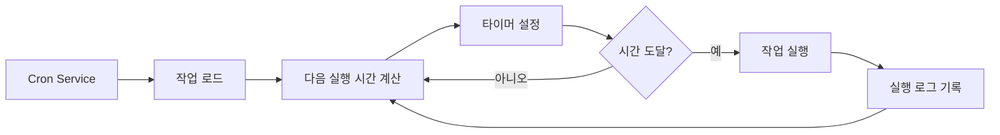

# Cron 예약 작업과 Webhook

## 학습 후 할 수 있는 것

이 레슨을 학습하면 다음을 할 수 있습니다:

- 지정된 시간 또는 주기에 따라 AI 작업을 자동으로 실행하는 Cron 예약 작업 생성
- 세 가지 스케줄링 방법(at, every, cron)의 사용 시나리오 이해
- 외부 이벤트 트리거를 수신하는 Webhook 구성
- 이메일 트리거로 AI 응답을 구현하는 Gmail Pub/Sub 통합 구성
- 작업 실행 기록 및 로그 관리

## 현재 문제점

다음 상황에 직면했을 수 있습니다:

- 특정 시간에 자신에게 상황을 알리려는 필요
- 정기적으로 작업 진행 상황을 요약하거나 보고서를 생성해야 함
- 특정 이메일을 받을 때 자동으로 AI 분석을 트리거해야 함
- 매번 수동으로 AI에 메시지를 보내고 싶지 않음

## 언제 사용해야 하는가

**Cron 예약 작업**은 다음 시나리오에 적합합니다:

| 시나리오 | 예시 | 스케줄링 방법 |
|---------|-----|--------------|
| 일회성 알림 | "내일 오전 9시에 회의 알림" | at |
| 정기 검사 | "30분마다 시스템 상태 확인" | every |
| 시간 지정 실행 | "매일 오후 5시에 일일 보고서 생성" | cron |
| 복잡한 주기 | "월요일부터 금요일까지 오전 9시" | cron |

**Webhook**은 다음 시나리오에 적합합니다:

- GitHub, GitLab의 푸시 알림 수신
- Stripe 결제 성공 알림 수신
- Twilio 수신 전화 알림 수신
- HTTP POST를 보낼 수 있는 서비스

**Gmail Pub/Sub**은 다음 시나리오에 적합합니다:

- 중요한 이메일을 받을 때 자동 분석
- 이메일 분류 및 자동 응답
- 이메일 콘텐츠 추출 및 보관

---

## 핵심 개념

### Cron 작업의 워크플로우



### 세 가지 스케줄링 방법 비교

| 방법 | 사용 시나리오 | 예시 | 정확도 |
|------|-------------|-----|--------|
| `at` | 일회성 작업 | 2026-01-27 09:00:00 | 밀리초 단위 |
| `every` | 고정 간격 | 30분마다 | 밀리초 단위 |
| `cron` | 복잡한 주기 | 매일 오전 9시 | 분 단위 |

### 두 가지 세션 대상

| 세션 대상 | Payload 유형 | 설명 |
|---------|-------------|------|
| `main` | `systemEvent` | 메인 세션에 시스템 이벤트 주입 |
| `isolated` | `agentTurn` | 격리된 세션에서 Agent 실행 |

**핵심 제약**:
- `sessionTarget="main"`은 `payload.kind="systemEvent"`를 사용해야 함
- `sessionTarget="isolated"`은 `payload.kind="agentTurn"`을 사용해야 함

---

## 🎒 시작 전 준비

시작하기 전에 다음을 확인하세요:

::: warning 사전 확인
- [ ] Gateway가 실행 중임（[Gateway 시작](../../start/gateway-startup/)）
- [ ] AI 모델이 구성됨（[AI 모델 구성](../models-auth/)）
- [ ] 기본 Cron 표현식 구문 이해（cron 스케줄링 사용 시）
:::

---

## 따라 해보세요

### 1단계: Cron 서비스 상태 확인

**왜**: Cron 서비스가 활성화되어 실행 중인지 확인하기 위함

```bash
## CLI로 Cron 상태 확인
clawdbot cron status
```

**다음과 같이 표시됩니다**:

```
✓ Cron enabled
  Store: ~/.clawdbot/cron.json
  Jobs: 0
  Next wake: null
```

`disabled`로 표시되면 구성 파일에서 활성화해야 합니다:

```json
{
  "cron": {
    "enabled": true,
    "store": "~/.clawdbot/cron.json",
    "maxConcurrentRuns": 5
  }
}
```

---

### 2단계: 일회성 예약 작업 생성

**왜**: 가장 기본적인 `at` 스케줄링 방법 학습

cron 도구를 사용하여 1분 후에 실행되는 작업을 추가합니다:

```json
{
  "action": "add",
  "job": {
    "name": "테스트 알림",
    "enabled": true,
    "schedule": {
      "kind": "at",
      "atMs": 1738000000000
    },
    "sessionTarget": "main",
    "wakeMode": "next-heartbeat",
    "payload": {
      "kind": "systemEvent",
      "text": "이것은 테스트 알림입니다: 작업 진행 상황 확인"
    }
  }
}
```

**다음과 같이 표시됩니다**:

```
✓ Job added: job_xxx
  Name: 테스트 알림
  Next run: 2026-01-27 10:00:00
```

**팁**: `atMs`는 Unix 타임스탬프(밀리초)입니다. JavaScript로 계산할 수 있습니다:

```javascript
Date.now() + 60 * 1000  // 1분 후
```

---

### 3단계: 반복 간격 작업 생성

**왜**: 정기 검사에 적합한 `every` 스케줄링 방법 학습

30분마다 실행되는 작업을 생성합니다:

```json
{
  "action": "add",
  "job": {
    "name": "30분마다 시스템 확인",
    "enabled": true,
    "schedule": {
      "kind": "every",
      "everyMs": 1800000
    },
    "sessionTarget": "main",
    "wakeMode": "next-heartbeat",
    "payload": {
      "kind": "systemEvent",
      "text": "시스템 상태 확인: CPU, 메모리, 디스크"
    }
  }
}
```

**다음과 같이 표시됩니다**:

```
✓ Job added: job_xxx
  Name: 30분마다 시스템 확인
  Interval: 30 minutes
  Next run: 2026-01-27 10:00:00
```

**매개변수 설명**:
- `everyMs`: 간격 시간(밀리초)
  - 1분 = 60,000 ms
  - 5분 = 300,000 ms
  - 30분 = 1,800,000 ms
  - 1시간 = 3,600,000 ms
- `anchorMs`(선택 사항): 첫 번째 실행의 시작 시간

---

### 4단계: Cron 표현식 작업 생성

**왜**: 복잡한 주기에 적합한 `cron` 스케줄링 방법 학습

매일 오전 9시에 실행되는 작업을 생성합니다:

```json
{
  "action": "add",
  "job": {
    "name": "매일 오전9시 일일 보고서",
    "enabled": true,
    "schedule": {
      "kind": "cron",
      "expr": "0 9 * * *",
      "tz": "Asia/Shanghai"
    },
    "sessionTarget": "main",
    "wakeMode": "next-heartbeat",
    "payload": {
      "kind": "systemEvent",
      "text": "오늘의 작업 일일 보고서 생성"
    }
  }
}
```

**다음과 같이 표시됩니다**:

```
✓ Job added: job_xxx
  Name: 매일 오전9시 일일 보고서
  Schedule: 0 9 * * * (Asia/Shanghai)
  Next run: 2026-01-27 09:00:00
```

**Cron 표현식 형식**:

```
┌───────────── 분 (0 - 59)
│ ┌─────────── 시 (0 - 23)
│ │ ┌───────── 일 (1 - 31)
│ │ │ ┌─────── 월 (1 - 12)
│ │ │ │ ┌───── 요일 (0 - 7, 0과 7은 일요일)
│ │ │ │ │
* * * * *
```

**일반적으로 사용되는 표현식**:

| 표현식 | 설명 |
|--------|------|
| `0 9 * * *` | 매일 오전 9시 |
| `0 9 * * 1-5` | 월요일부터 금요일까지 오전 9시 |
| `0 */6 * * *` | 6시간마다 |
| `0 0 * * 0` | 매주 일요일 자정 |
| `0 9,17 * * *` | 매일 9시와 17시 |

::: info 시간대 설정
Cron 표현식은 기본적으로 UTC 시간대를 사용합니다. `tz` 필드로 시간대를 지정하면(예: `"Asia/Shanghai"`) 작업이 예상하는 시간에 실행됩니다.
:::

---

### 5단계: 격리 세션에서 작업 실행

**왜**: 격리된 환경에서 AI 작업을 실행하여 메인 세션 간섭 방지

격리된 세션에서 실행되는 작업을 생성합니다:

```json
{
  "action": "add",
  "job": {
    "name": "매일 요약",
    "enabled": true,
    "schedule": {
      "kind": "cron",
      "expr": "0 18 * * *",
      "tz": "Asia/Shanghai"
    },
    "sessionTarget": "isolated",
    "wakeMode": "next-heartbeat",
    "payload": {
      "kind": "agentTurn",
      "message": "오늘의 작업 요약: 1. 완료된 작업 2. 발생한 문제 3. 내일 계획",
      "model": "anthropic/claude-sonnet-4-20250514",
      "thinking": "low"
    }
  }
}
```

**다음과 같이 표시됩니다**:

```
✓ Job added: job_xxx
  Name: 매일 요약
  Session: isolated
  Next run: 2026-01-27 18:00:00
```

**`agentTurn` Payload 매개변수**:

| 매개변수 | 유형 | 설명 |
|---------|------|------|
| `message` | string | Agent로 보내는 프롬프트 |
| `model` | string | 사용할 모델 재정의(선택 사항) |
| `thinking` | string | 생각 수준: "off" \| "minimal" \| "low" \| "medium" \| "high" |
| `timeoutSeconds` | number | 타임아웃 시간(초) |
| `deliver` | boolean | 결과를 채널로 전송할지 여부 |
| `channel` | string | 대상 채널(예: `"whatsapp"`, `"telegram"`) |
| `to` | string | 수신자 식별자 |
| `bestEffortDeliver` | boolean | 지정된 채널로 전송할 수 없을 때 다른 채널 시도 여부 |

**격리 세션 구성**(선택 사항):

```json
{
  "isolation": {
    "postToMainPrefix": "📊 매일 요약:",
    "postToMainMode": "summary",
    "postToMainMaxChars": 8000
  }
}
```

| 매개변수 | 설명 |
|---------|------|
| `postToMainPrefix` | 메인 세션에 결과를 전송할 때 접두사 |
| `postToMainMode` | "summary"(요약) 또는 "full"(전체 텍스트) |
| `postToMainMaxChars` | `postToMainMode="full"`일 때 최대 문자 수 |

---

### 6단계: 작업 목록 표시 및 관리

**왜**: 모든 작업을 표시하고 상태 관리

**모든 작업 표시**:

```bash
clawdbot cron list
```

**다음과 같이 표시됩니다**:

```
Jobs: 3
  ✓ job_xxx: 테스트 알림 (enabled, next: 2026-01-27 10:00:00)
  ✓ job_yyy: 30분마다 시스템 확인 (enabled, next: 2026-01-27 10:00:00)
  ✓ job_zzz: 매일 오전9시 일일 보고서 (enabled, next: 2026-01-27 09:00:00)
```

**비활성화된 작업 포함**:

```bash
clawdbot cron list --include-disabled
```

**작업 비활성화**:

```json
{
  "action": "update",
  "jobId": "job_xxx",
  "patch": {
    "enabled": false
  }
}
```

**작업 활성화**:

```json
{
  "action": "update",
  "jobId": "job_xxx",
  "patch": {
    "enabled": true
  }
}
```

**작업 삭제**:

```json
{
  "action": "remove",
  "jobId": "job_xxx"
}
```

---

### 7단계: 작업 즉시 실행

**왜**: 작업이 정상 작동하는지 테스트, 스케줄링 대기 불필요

```json
{
  "action": "run",
  "jobId": "job_xxx"
}
```

**다음과 같이 표시됩니다**:

```
✓ Job ran: job_xxx
  Status: ok
  Duration: 1234ms
```

**실행 기록 표시**:

```json
{
  "action": "runs",
  "jobId": "job_xxx",
  "limit": 10
}
```

**다음과 같이 표시됩니다**:

```
Runs for job_xxx (10 most recent):
  2026-01-27 10:00:00 - ok - 1234ms
  2026-01-26 10:00:00 - ok - 1189ms
  2026-01-25 10:00:00 - ok - 1245ms
```

---

### 8단계: 알림 작업에 컨텍스트 추가

**왜**: AI가 최근 대화 컨텍스트를 이해하게 하여 관련성 높은 알림 제공

`contextMessages` 매개변수를 사용하여 최근 메시지 기록 추가:

```json
{
  "action": "add",
  "job": {
    "name": "작업 후속 알림",
    "enabled": true,
    "schedule": {
      "kind": "cron",
      "expr": "0 10,16 * * *",
      "tz": "Asia/Shanghai"
    },
    "sessionTarget": "main",
    "wakeMode": "next-heartbeat",
    "payload": {
      "kind": "systemEvent",
      "text": "작업 진행 상황 후속: 1. 할 일 목록 확인 2. 프로젝트 상태 업데이트"
    },
    "contextMessages": 5
  }
}
```

**컨텍스트 메시지 제한**:
- 최대 메시지 수: 10개
- 각 메시지 최대 문자 수: 220
- 총 문자 수 제한: 700
- 형식: `- User: ...\n- Assistant: ...`

**자동 추가되는 컨텍스트**:

```
작업 진행 상황 후속: 1. 할 일 목록 확인 2. 프로젝트 상태 업데이트

Recent context:
- User: 오늘 보고서를 완료해야 합니다
- Assistant: 알겠습니다. 어떤 유형의 보고서입니까?
- User: 주간 보고서로, 이번 주 작업 요약 포함
```

---

## Webhook 구성

### Webhook 개요

Webhook은 외부 서비스가 HTTP POST 요청을 통해 Clawdbot의 내부 이벤트를 트리거할 수 있게 합니다. 일반적인 용도:

- **GitHub/GitLab**: 푸시 알림으로 CI/CD 프로세스 트리거
- **Stripe**: 결제 성공 알림으로 주문 처리 트리거
- **Twilio**: 수신 전화 알림으로 AI 음성 응답 트리거
- **Jira**: 티켓 생성 알림으로 자동 응답 트리거

### Webhook 구성

**Hooks 시스템 활성화**:

```json
{
  "hooks": {
    "enabled": true,
    "path": "/hooks",
    "token": "your-secret-token-here"
  }
}
```

**매핑 규칙 구성**:

```json
{
  "hooks": {
    "enabled": true,
    "token": "your-secret-token-here",
    "mappings": [
      {
        "id": "github-push",
        "match": {
          "path": "/hooks/github"
        },
        "action": "wake",
        "wakeMode": "now",
        "sessionKey": "main",
        "messageTemplate": "GitHub 푸시 알림: {{ repository }} - {{ ref }}"
      }
    ]
  }
}
```

**매핑 구성 매개변수**:

| 매개변수 | 설명 |
|---------|------|
| `match.path` | 일치하는 URL 경로 |
| `match.source` | 일치하는 요청 소스 헤더 |
| `action` | `"wake"` 또는 `"agent"` |
| `wakeMode` | `"now"` 또는 `"next-heartbeat"` |
| `sessionKey` | 대상 세션 키(예: `"main"`) |
| `messageTemplate` | Mustache 구문을 사용하는 메시지 템플릿 |
| `deliver` | 채널로 전송할지 여부 |
| `channel` | 대상 채널(예: `"whatsapp"`) |
| `to` | 수신자 식별자 |
| `transform` | 변환 모듈(요청 본문 처리) |

---

## Gmail Pub/Sub 통합

### Gmail Pub/Sub 개요

Gmail Pub/Sub은 새 이메일을 받을 때 실시간으로 Clawdbot을 트리거하여 이메일 기반 AI 응답을 구현합니다.

### Gmail Pub/Sub 구성

**기본 구성**:

```json
{
  "hooks": {
    "enabled": true,
    "token": "your-hook-token",
    "gmail": {
      "account": "your-email@gmail.com",
      "label": "INBOX",
      "topic": "projects/your-project-id/topics/gmail-topic",
      "subscription": "gmail-subscription",
      "pushToken": "your-push-token",
      "hookUrl": "http://127.0.0.1:18789/hooks/gmail",
      "includeBody": true,
      "maxBytes": 20000,
      "renewEveryMinutes": 720
    }
  }
}
```

**구성 매개변수 설명**:

| 매개변수 | 설명 | 기본값 |
|---------|------|--------|
| `account` | Gmail 계정 주소 | - |
| `label` | 모니터링할 Gmail 라벨 | `INBOX` |
| `topic` | Google Cloud Pub/Sub 토픽 경로 | - |
| `subscription` | Pub/Sub 구독 이름 | `gmail-subscription` |
| `pushToken` | Gmail 푸시 토큰 | - |
| `hookUrl` | Webhook 수신 URL | 자동 생성 |
| `includeBody` | 이메일 본문 포함 여부 | `true` |
| `maxBytes` | 최대 이메일 바이트 수 | `20000` |
| `renewEveryMinutes` | 구독 갱신 간격(분) | `720`(12시간) |

### Tailscale 통합(선택 사항)

**Tailscale Serve를 사용하여 Webhook 노출**:

```json
{
  "hooks": {
    "gmail": {
      "tailscale": {
        "mode": "serve",
        "path": "/gmail-pubsub",
        "target": "10000"
      }
    }
  }
}
```

**Tailscale Funnel 사용**:

```json
{
  "hooks": {
    "gmail": {
      "tailscale": {
        "mode": "funnel",
        "path": "/gmail-pubsub"
      }
    }
  }
}
```

| 모드 | 설명 |
|------|------|
| `off` | Tailscale 사용 안 함 |
| `serve` | Tailscale Serve를 통해 로컬 서비스 노출 |
| `funnel` | Tailscale Funnel을 통해 인터넷에서 액세스 |

### Gmail Watcher 시작

**Gmail Watcher 서비스 시작**:

```bash
clawdbot hooks gmail-watch
```

**다음과 같이 표시됩니다**:

```
✓ Gmail watcher started
  Account: your-email@gmail.com
  Label: INBOX
  Watching...
```

**Gmail Watcher는 다음을 수행합니다**:
1. Gmail 라벨 변경 구독
2. 새 이메일 푸시 수신
3. 이메일 정보를 Webhook으로 전송
4. Clawdbot 내부 이벤트 트리거

---

## 체크포인트 ✅

**마스터한 내용 확인**:

- [ ] 세 가지 유형의 Cron 작업(at, every, cron) 생성 가능
- [ ] `main`과 `isolated` 세션 대상의 차이 이해
- [ ] 작업 목록 표시, 활성화, 비활성화, 삭제 가능
- [ ] 작업 실행 기록 표시 가능
- [ ] Webhook 구성 및 작동 원리 이해
- [ ] Gmail Pub/Sub 통합 구성 가능

---

## 문제 해결

### 작업이 실행되지 않음

**문제**: 작업이 추가되었지만 실행되지 않음

**가능한 원인**:

| 원인 | 해결 방법 |
|------|---------|
| Cron 서비스가 활성화되지 않음 | `cron.enabled` 구성 확인 |
| 시간이 도달하지 않음 | `clawdbot cron list`로 다음 실행 시간 확인 |
| 시간대가 잘못됨 | `tz` 필드가 올바른지 확인 |
| 작업이 비활성화됨 | `--include-disabled`로 작업 상태 확인 |

### Cron 표현식 오류

**문제**: 작업이 잘못된 시간에 실행됨

**일반적인 오류**:

| 오류 | 올바른 것 | 설명 |
|------|-----------|------|
| `9 * * *` | `0 9 * * *` | 분 필드 누락 |
| `0 9 * * * *` | `0 9 * * *` | 필드가 하나 더 많음 |
| `0 9 1-5 * *` | `0 9 * * 1-5` | 요일 필드 위치가 잘못됨 |

**검증 도구**: [crontab.guru](https://crontab.guru/)를 사용하여 Cron 표현식 검증.

### Gmail Pub/Sub이 작동하지 않음

**문제**: 이메일을 받았지만 트리거되지 않음

**체크리스트**:

- [ ] Gmail Watcher 서비스가 실행 중인지
- [ ] `hookUrl`에 액세스할 수 있는지(curl로 테스트)
- [ ] `token`이 올바르게 구성되었는지
- [ ] Pub/Sub 토픽과 구독이 올바르게 생성되었는지
- [ ] 네트워크 연결이 정상인지(Tailscale 사용 시)

### 격리 세션이 응답하지 않음

**문제**: `sessionTarget="isolated"` 작업이 출력하지 않음

**가능한 원인**:

- `model` 필드가 누락되어 기본 모델을 사용하지만 구성되지 않음
- `message` 프롬프트가 명확하지 않음
- `timeoutSeconds`가 너무 짧아 작업 타임아웃
- `deliver=false`이지만 `postToMainMode`가 구성되지 않음

**해결 방법**:

1. 로그 상세도 증가
2. Gateway 로그 확인
3. `bestEffortDeliver=true`를 사용하여 결과가 적어도 메인 세션으로 전송되도록 함

---

## 레슨 요약

Cron과 Webhook은 Clawdbot의 강력한 자동화 도구입니다:

**Cron 시스템**:
- 세 가지 스케줄링 방법: `at`(일회성), `every`(간격), `cron`(복잡한 주기)
- 두 가지 세션 대상: `main`(시스템 이벤트 주입), `isolated`(Agent 실행)
- 작업 기록 및 실행 로그 지원
- 관련성 높은 알림을 제공하기 위해 컨텍스트 메시지 추가 가능

**Webhook 시스템**:
- 외부 HTTP POST 요청 수신
- 매핑 규칙 및 메시지 템플릿 지원
- 인터넷 공개용 Tailscale 구성 가능

**Gmail Pub/Sub**:
- 새 이메일 실시간 모니터링
- 라벨 필터링 지원
- Tailscale Serve/Funnel 통합

이러한 기능을 적절히 구성하면 완전히 자동화된 AI 어시스턴트를 구축하고 적절한 시간에 응답하게 할 수 있습니다.

---

## 다음 레슨 미리보기

> 다음 레슨에서는 **[메모리 시스템과 벡터 검색](../memory-system/)**을 학습합니다.
>
> 다음을 할 수 있습니다:
> - 메모리 시스템의 파일 구조 및 인덱싱 메커니즘
> - 벡터 검색 제공자 구성(OpenAI, Gemini, 로컬)
> - 하이브리드 검색(BM25 + 벡터)을 사용하여 검색 정확도 향상
> - CLI로 메모리 인덱스 및 검색 관리

---

## 부록: 소스 코드 참조

<details>
<summary><strong>클릭하여 소스 코드 위치 표시</strong></summary>

> 업데이트 시간: 2026-01-27

| 기능 | 파일 경로 | 행 번호 |
|------|-----------|--------|
| Cron 구성 유형 정의 | [`src/config/types.cron.ts`](https://github.com/clawdbot/clawdbot/blob/main/src/config/types.cron.ts#L1-L6) | 1-6 |
| Cron 핵심 유형 정의 | [`src/cron/types.ts`](https://github.com/clawdbot/clawdbot/blob/main/src/cron/types.ts#L1-L95) | 1-95 |
| Cron Service | [`src/cron/service.ts`](https://github.com/clawdbot/clawdbot/blob/main/src/cron/service.ts#L1-L49) | 1-49 |
| Cron 작업 구현 | [`src/cron/service/ops.ts`](https://github.com/clawdbot/clawdbot/blob/main/src/cron/service/ops.ts#L1-L141) | 1-141 |
| Cron 도구 구현 | [`src/agents/tools/cron-tool.ts`](https://github.com/clawdbot/clawdbot/blob/main/src/agents/tools/cron-tool.ts#L1-L291) | 1-291 |
| Gateway Cron 메서드 | [`src/gateway/server-methods/cron.ts`](https://github.com/clawdbot/clawdbot/blob/main/src/gateway/server-methods/cron.ts#L1-L205) | 1-205 |
| Hooks 구성 유형 정의 | [`src/config/types.hooks.ts`](https://github.com/clawdbot/clawdbot/blob/main/src/config/types.hooks.ts#L1-L125) | 1-125 |
| Hooks Gmail 도구 | [`src/hooks/gmail.ts`](https://github.com/clawdbot/clawdbot/blob/main/src/hooks/gmail.ts#L1-L267) | 1-267 |
| Hooks 내부 이벤트 | [`src/hooks/hooks.ts`](https://github.com/clawdbot/clawdbot/blob/main/src/hooks/hooks.ts#L1-L15) | 1-15 |
| Hooks CLI 명령 | [`src/cli/hooks-cli.ts`](https://github.com/clawdbot/clawdbot/blob/main/src/cli/hooks-cli.ts#L1-L839) | 1-839 |

**핵심 상수**:
- `DEFAULT_GMAIL_LABEL = "INBOX"`: Gmail 기본 라벨
- `DEFAULT_GMAIL_TOPIC = "gog-gmail-watch"`: Gmail 기본 토픽 이름
- `DEFAULT_GMAIL_SUBSCRIPTION = "gog-gmail-watch-push"`: Gmail 기본 구독 이름
- `DEFAULT_GMAIL_MAX_BYTES = 20000`: Gmail 기본 최대 이메일 바이트 수
- `DEFAULT_GMAIL_RENEW_MINUTES = 720`: Gmail 기본 갱신 간격(12시간)

**핵심 함수**:
- `CronService.start()`: Cron 서비스 시작
- `CronService.add()`: 예약 작업 추가
- `CronService.update()`: 작업 업데이트
- `CronService.remove()`: 작업 삭제
- `CronService.run()`: 작업 즉시 실행
- `createCronTool()`: Cron 도구 생성
- `resolveGmailHookRuntimeConfig()`: Gmail Hook 구성 분석
- `buildGogWatchStartArgs()`: Gmail Watch 시작 매개변수 구축
- `buildGogWatchServeArgs()`: Gmail Watch 서비스 매개변수 구축

</details>
