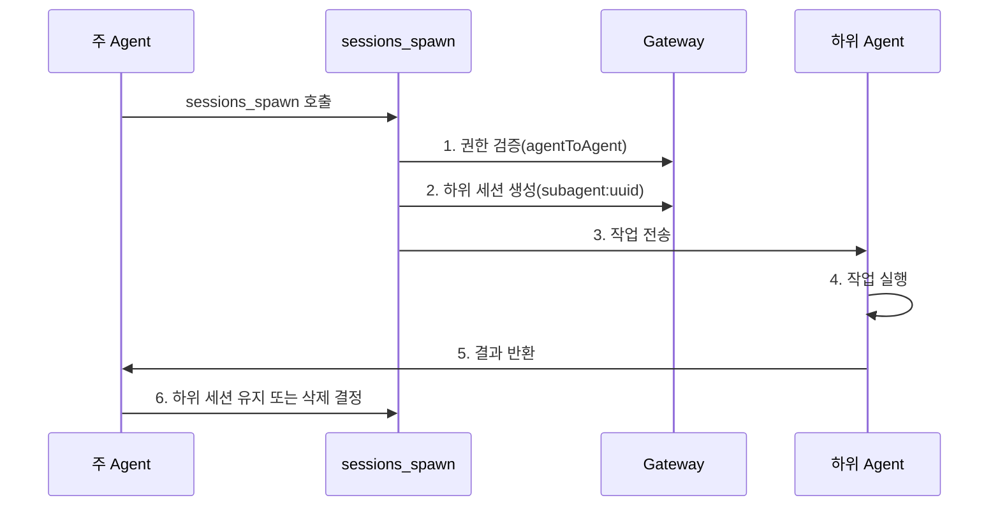

# 세션 관리 및 다중 Agent: 세션 격리, 하위 Agent 협업 및 컨텍스트 압축

## 학습 후 할 수 있는 것

- Clawdbot의 세션 모델과 세션 키 구조 이해
- 다른 Agent 간의 세션 격리 구성
- 하위 Agent를 사용하여 격리 작업 완료
- 컨텍스트 윈도우 관리로 모델 제한 초과 방지
- 세션 재설정 및 압축의 모범 사례 마스터

## 현재 문제점

AI 어시스턴트가 동시에 여러 사용자와 여러 채널에 서비스를 제공할 때 다음과 같은 문제에 직면할 수 있습니다:

- **세션 혼선**: 다른 사용자의 메시지가 섞여서 AI가 각자의 기록을 기억하지 못함
- **컨텍스트 폭발**: 장시간 대화 후 모델이 "기억 상실" 또는 응답 속도 저하 발생
- **하위 작업 혼란**: 주 Agent가 하위 작업을 호출할 때 명확한 격리 경계가 없음
- **자원 낭비**: 모든 Agent가 동일한 세션 세트를 공유하여 저장소 및 연산 자원이 효율적으로 활용되지 않음

Clawdbot의 **세션 관리 시스템**은 이러한 문제를 해결하기 위해 설계되었습니다.

## 핵심 개념

**세션**은 Clawdbot의 핵심 추상 단위입니다. 각 세션은 독립적인 대화 기록을 나타내며, 고유한 메시지 기록, 메타데이터 및 수명 주기를 가집니다.

Clawdbot은 **세션 키(session key)**를 사용하여 다른 세션을 식별하고 격리합니다. 세션 키는 다른 대화 상대(사용자, 그룹, 채널)뿐만 아니라 다른 Agent 인스턴스도 구분합니다.

::: info 세션 키란?

세션 키는 세션을 고유하게 식별하는 문자열 식별자입니다. 형식 예시:
- `agent:main:main`(주 Agent의 주 세션)
- `agent:work:main`(업무 Agent의 주 세션)
- `agent:main:whatsapp:group:123`(WhatsApp 그룹 세션)
- `cron:job-id`(정기 작업 세션)

Clawdbot은 세션 키를 기반으로 메시지를 올바른 Agent로 라우팅하고 독립적인 대화 기록을 유지합니다.
:::

## 세션 모델

### 세션 키 구성

Clawdbot은 구조화된 세션 키를 사용하여 다른 유형의 세션을 식별합니다:

| 세션 유형 | 키 형식 | 예시 | 설명 |
|---------|---------|-------|------|
| **주 세션** | `agent:<agentId>:<mainKey>` | `agent:main:main` | 각 Agent의 기본 주 세션 |
| **직접 메시지** | `agent:<agentId>:dm:<peerId>` | `agent:main:dm:+15551234567` | `dmScope` 구성으로 격리 |
| **그룹/채널** | `agent:<agentId>:<channel>:group:<id>` | `agent:main:whatsapp:group:123` | 그룹과 채널 자동 격리 |
| **하위 Agent** | `agent:<agentId>:subagent:<uuid>` | `agent:main:subagent:a1b2c3d4` | 하위 Agent의 격리 세션 |
| **정기 작업** | `cron:<jobId>` | `cron:daily-report` | Cron 작업 전용 세션 |
| **Webhook** | `hook:<uuid>` | `hook:xyz789` | Webhook 트리거 세션 |

### 세션 저장소

세션 데이터는 두 위치에 저장됩니다:

```bash
# 세션 인덱스(메타데이터)
~/.clawdbot/agents/<agentId>/sessions/sessions.json

# 메시지 기록(세션당 하나의 파일)
~/.clawdbot/agents/<agentId>/sessions/<sessionId>.jsonl
```

**sessions.json**은 매핑 테이블이며 다음을 기록합니다:
- 세션 키 → 세션 메타데이터(sessionId, updatedAt, model, tokens 등)
- 이러한 항목 삭제는 안전하며 필요 시 자동으로 재구성됩니다

**JSONL 파일**은 완전한 대화 기록을 저장하며 행당 하나의 메시지 기록을 포함합니다.

::: tip Gateway는 단일 진실 정보 소스

모든 세션 상태는 Gateway가 소유합니다. UI 클라이언트(macOS 앱, WebChat)는 로컬 파일을 직접 읽는 대신 Gateway에서 세션 목록과 토큰 수를 쿼리해야 합니다.

원격 모드에서는 관심 있는 세션이 원격 Gateway 호스트에 저장되며 Mac에는 저장되지 않습니다.
:::

## 세션 격리 메커니즘

### 단일 Agent 모드(기본값)

아무 구성도 하지 않으면 Clawdbot은 단일 Agent를 실행합니다:
- `agentId`는 기본적으로 `main`
- 모든 DM 세션이 주 세션 키(`agent:main:main`)를 공유
- 이는 **동일한 사용자가 다른 채널에서 보낸 메시지가 동일한 세션에 들어감**을 의미합니다

### 다중 Agent 모드

**여러 Agent = 여러 개의 격리된 브레인**

각 Agent는 독립적으로 다음을 가집니다:
- **Workspace**(작업 공간 파일, AGENTS.md, SOUL.md)
- **State directory**(인증 구성, 모델 레지스트리)
- **Session store**(채팅 기록 및 라우팅 상태)

#### 왜 다중 Agent가 필요한가요?

| 시나리오 | 솔루션 |
|--------|---------|
| **다중 사용자가 서버 공유** | 각 사용자가 독립 Agent를 가지며 세션이 완전히 격리됨 |
| **다른 채널에서 다른 페르소나** | WhatsApp에서 일상 Agent, Telegram에서 심층 업무 Agent 사용 |
| **권한 분리** | 가족 Agent는 도구 제한, 개인 Agent는 완전 액세스 |
| **다른 환경** | 개발 Agent, 프로덕션 Agent 완전 격리 |

#### 다중 Agent 구성

**1단계: 새 Agent 추가**

```bash
clawdbot agents add work
```

이렇게 하면 `~/.clawdbot/agents/work/`에 새 Agent 디렉터리가 생성됩니다.

**2단계: 라우팅 규칙 구성**

`~/.clawdbot/clawdbot.json`에 `bindings`를 추가합니다:

```json5
{
  agents: {
    list: [
      { id: "home", workspace: "~/clawd-home", name: "Home" },
      { id: "work", workspace: "~/clawd-work", name: "Work" }
    ]
  },
  bindings: [
    { agentId: "home", match: { channel: "whatsapp", accountId: "personal" } },
    { agentId: "work", match: { channel: "whatsapp", accountId: "biz" } }
  ]
}
```

**3단계: 구성 검증**

```bash
clawdbot agents list --bindings
```

#### 라우팅 규칙(결정론적 매칭)

메시지가 도착하면 Clawdbot은 **가장 구체적인 것 우선** 순서로 규칙을 매칭합니다:

1. **peer** 매칭(정확한 DM/group/channel id)
2. **guildId**(Discord)
3. **teamId**(Slack)
4. **accountId** 매칭
5. 채널 수준 매칭(`accountId: "*"`)
6. 기본 Agent로 폴백

::: warning 바인딩 순서 주의

바인딩 목록의 순서가 중요합니다! 더 구체적인 규칙을 앞에 배치해야 합니다.

예를 들어 특정 DM을 `work` Agent로 라우팅하고 다른 WhatsApp DM을 `home` Agent로 라우팅하려면 peer 규칙을 먼저 작성해야 합니다:
```json5
{
  bindings: [
    { agentId: "work", match: { channel: "whatsapp", peer: { kind: "dm", id: "+15551234567" } } },
    { agentId: "home", match: { channel: "whatsapp" } }
  ]
}
```
:::

### DM 범위 제어

`session.dmScope`를 사용하여 직접 메시지가 그룹화되는 방식을 제어합니다:

| 옵션 | 동작 | 사용 시나리오 |
|------|-------|---------|
| `main`(기본값) | 모든 DM이 주 세션 공유 | 단일 사용자 다중 채널 |
| `per-peer` | 발신자 ID로 격리 | 다중 사용자 환경 |
| `per-channel-peer` | 채널 + 발신자로 격리 | 공유 수신함 |

구성 예시:

```json5
{
  session: {
    dmScope: "per-channel-peer"  // 각 채널의 각 사용자가 독립 세션
  }
}
```

### 아이덴티티 링크(Identity Links)

동일한 사용자가 여러 플랫폼(WhatsApp 및 Telegram 등)을 사용하는 경우 `session.identityLinks`를 사용하여 세션을 공유하게 할 수 있습니다:

```json5
{
  session: {
    identityLinks: {
      alice: ["telegram:123456789", "discord:987654321012345678"]
    }
  }
}
```

이렇게 하면 Alice가 Telegram 또는 Discord에서 보낸 메시지는 모두 `agent:<agentId>:dm:alice` 세션에 들어갑니다.

## 하위 Agent 협업

### 하위 Agent란 무엇인가요?

**하위 Agent**는 격리된 세션에서 실행되는 Agent 인스턴스로, 주 세션의 컨텍스트에 영향을 주지 않고 특정 작업을 실행하는 데 사용됩니다.

일반적인 사용 시나리오:
- **코드 검토**: 하위 Agent가 코드를 분석하고 요약 반환
- **데이터 추출**: 하위 Agent가 긴 문서에서 정보 추출
- **병렬 작업**: 주 Agent가 대기하는 동안 하위 Agent가 백그라운드에서 실행
- **샌드박스 격리**: 제한된 환경에서 신뢰하지 않는 작업 실행

### sessions_spawn 도구

`sessions_spawn` 도구를 사용하여 하위 Agent를 생성합니다:

```json
{
  "task": "이 문서를 분석하고 핵심 포인트를 추출하세요",
  "label": "문서 분석",
  "model": "anthropic/claude-opus-4-5",
  "thinking": "detailed",
  "runTimeoutSeconds": 300,
  "cleanup": "keep"
}
```

매개변수 설명:

| 매개변수 | 유형 | 필수 | 설명 |
|------|------|-------|------|
| `task` | string | ✅ | 하위 Agent의 작업 설명 |
| `label` | string | ❌ | 읽기 쉬운 작업 레이블(추적용) |
| `agentId` | string | ❌ | 대상 Agent ID(기본값은 현재 Agent) |
| `model` | string | ❌ | 모델 재정의 |
| `thinking` | string | ❌ | 사고 수준(`minimal`/`standard`/`detailed`) |
| `runTimeoutSeconds` | number | ❌ | 제한 시간(초) |
| `cleanup` | string | ❌ | 작업 완료 후 정리 전략(`keep`/`delete`) |

### 하위 Agent 수명 주기



**수명 주기 단계**:

1. **권한 검사**: Agent 간 호출인 경우 `tools.agentToAgent.allow` 구성 검증
2. **하위 세션 생성**: 고유한 `agent:<agentId>:subagent:<uuid>` 키 생성
3. **작업 실행**: 하위 Agent가 격리된 세션에서 작업 완료
4. **결과 반환**: 결과가 스트리밍으로 주 Agent에 반환됨
5. **정리 전략**:
   - `cleanup: "keep"`: 후속 검사를 위해 하위 세션 유지
   - `cleanup: "delete"`: 하위 세션 자동 삭제

### Agent 간 통신 구성

기본적으로 Agent 간 통신은 비활성화되어 있습니다. 명시적으로 활성화해야 합니다:

```json5
{
  tools: {
    agentToAgent: {
      enabled: true,
      allow: ["home", "work", "family"]
    }
  }
}
```

권한 설명:
- `enabled: false`: Agent 간 통신 완전 비활성화
- `allow: ["*"]`: 모든 Agent 허용
- `allow: ["home", "work"]`: 특정 Agent만 허용

::: danger 보안 알림

하위 Agent는 상위 Agent의 일부 컨텍스트를 상속하지만 **전체 상위 세션 기록은 얻지 않습니다**. 이는 기능(토큰 절약)이기도 하고 제한(하위 Agent가 전체 컨텍스트를 모름)이기도 합니다.

민감한 작업의 경우 하위 Agent를 통하지 않고 주 세션에서 완료하는 것을 고려하세요.
:::

## 컨텍스트 압축

### 컨텍스트 윈도우란 무엇인가요?

각 AI 모델에는 **컨텍스트 윈도우(context window)**가 있습니다. 이는 단일 추론에서 볼 수 있는 최대 토큰 수입니다.

장시간 대화는 메시지와 도구 결과를 누적합니다. 모델 제한에 가까워지면 Clawdbot은 공간을 확보하기 위해 기록을 **압축(compact)**합니다.

### 자동 압축

세션이 컨텍스트 윈도우에 가까워지거나 초과하면 Clawdbot이 자동으로 압축을 트리거합니다:

- **압축 전**: 먼저 **무음 메모리 새로고침**을 실행하여 모델이 영구 메모를 디스크에 쓰도록 프롬프트(작업 공간이 쓰기 가능한 경우)
- **압축 프로세스**: 이전 대화를 압축 요약으로 요약하고 최근 메시지 유지
- **영구 저장**: 압축 결과를 JSONL 기록 파일에 기록
- **재시도**: 압축된 컨텍스트를 사용하여 원래 요청 재시도

다음이 표시됩니다:
- `🧹 Auto-compaction complete`(상세 모드의 경우)
- `/status`에 `🧹 Compactions: <count>` 표시

### 수동 압축

`/compact` 명령을 사용하여 수동으로 압축을 트리거합니다:

```
/compact
```

압축 지침을 추가할 수 있습니다:

```
/compact Focus on decisions and open questions
```

이렇게 하면 AI가 요약할 때 특정 콘텐츠에 집중하도록 지시할 수 있습니다.

### 압축 vs 가지치기

| 작업 | 목적 | 영구 저장 | 위치 |
|------|-------|---------|------|
| **압축(Compaction)** | 이전 대화 요약 | ✅ | JSONL에 기록 |
| **가지치기(Pruning)** | 이전 도구 결과 제거 | ❌ | 메모리 내만 |

::: tip 압축 전략 권장 사항

- **압축**: 정보 요약 저장, 기록을 검토해야 하는 경우 적합
- **가지치기**: 임시 정리, 단일 요청의 토큰 사용량 줄이는 데 적합
- **/new**: 세션 완전 지우기, 새 주제 시작용

사용 습관에 따라 적절한 전략을 선택하세요.
:::

### 압축 구성

`~/.clawdbot/clawdbot.json`에서 압축 동작을 구성합니다:

```json5
{
  agents: {
    defaults: {
      compaction: {
        enabled: true,
        threshold: 0.9,  // 컨텍스트 사용량 90%에서 트리거
        trigger: "auto"  // auto/manual
      }
    }
  }
}
```

## 함께 해보기: 세션 관리 구성

실제 시나리오를 사용하여 세션 관리를 구성해 보겠습니다.

### 시나리오

WhatsApp 번호가 있으며 다음을 원합니다:
1. 개인 연락처는 `home` Agent(일상 대화)
2. 업무 그룹은 `work` Agent(전문 응답)
3. 격리 작업을 위해 하위 Agent 활성화

### 1단계: 두 개의 Agent 추가

```bash
# 홈 Agent 추가
clawdbot agents add home

# 워크 Agent 추가
clawdbot agents add work
```

**다음이 표시됩니다**: 작업 공간 경로 등의 정보를 입력하라는 프롬프트가 표시됩니다.

### 2단계: 구성 파일 편집

`~/.clawdbot/clawdbot.json`을 열고 Agent 목록과 바인딩 규칙을 추가합니다:

```json5
{
  agents: {
    list: [
      {
        id: "home",
        name: "Home",
        workspace: "~/clawd-home",
        model: "anthropic/claude-sonnet-4-5"
      },
      {
        id: "work",
        name: "Work",
        workspace: "~/clawd-work",
        model: "anthropic/claude-opus-4-5"
      }
    ]
  },
  bindings: [
    // 개인 메시지를 home Agent로 라우팅
    { agentId: "home", match: { channel: "whatsapp", peer: { kind: "dm", id: "+15551230001" } } },
    // 업무 그룹을 work Agent로 라우팅
    { agentId: "work", match: { channel: "whatsapp", peer: { kind: "group", id: "120363999999999999@g.us" } } },
    // 다른 WhatsApp 메시지를 home Agent로 라우팅(기본값)
    { agentId: "home", match: { channel: "whatsapp" } }
  ],
  tools: {
    agentToAgent: {
      enabled: true,
      allow: ["home", "work"]
    }
  }
}
```

### 3단계: Gateway 재시작

```bash
clawdbot gateway restart
```

**다음이 표시됩니다**: Gateway 시작 로그, 로드된 Agent와 바인딩 규칙이 표시됩니다.

### 4단계: 하위 Agent 호출 테스트

`home` Agent 세션에서 다음을 보냅니다:

```
하위 Agent를 사용하여 이 PDF 문서를 분석하고 핵심 정보를 추출하세요: /path/to/file.pdf
```

Agent는 자동으로 `sessions_spawn` 도구를 호출하고 다음을 볼 수 있습니다:
- 하위 Agent 생성 알림
- 작업 실행 프로세스
- 결과 반환

### 5단계: 세션 상태 확인

채팅에서 다음을 보냅니다:

```
/status
```

**다음이 표시됩니다**:
- 현재 세션의 토큰 사용 현황
- 압축 횟수
- 모델 정보

## 체크포인트 ✅

구성을 완료한 후 다음 사항을 확인하세요:

- [ ] `clawdbot agents list --bindings`가 올바른 바인딩 규칙을 표시
- [ ] 개인 DM이 `home` Agent로 라우팅됨
- [ ] 업무 그룹이 `work` Agent로 라우팅됨
- [ ] 하위 Agent 호출이 정상적으로 작동
- [ ] `/status`가 올바른 세션 정보를 표시

## 문제 해결

### 일반적인 오류

| 오류 | 원인 | 해결 방법 |
|------|------|---------|
| **Agent 간 호출이 거부됨** | `tools.agentToAgent.enabled`가 활성화되지 않았거나 `allow` 목록에 대상 Agent가 포함되지 않음 | 구성을 확인하고 활성화되어 있으며 허용 목록이 추가되었는지 확인 |
| **하위 Agent 생성 실패** | Agent 간 호출 시 대상 Agent가 허용 목록에 없음 | `tools.agentToAgent.allow` 구성 확인 |
| **세션 키 충돌** | 바인딩 규칙 순서가 잘못되어 더 구체적인 규칙이 덮어씌워짐 | peer 규칙을 채널 규칙 앞에 배치 |
| **압축 실패** | 컨텍스트가 너무 작거나 모델이 압축을 지원하지 않음 | 모델 컨텍스트 윈도우와 압축 구성 확인 |

### 구성 권장 사항

- **간단하게 시작**: 먼저 단일 Agent로 테스트하고 기능이 정상인지 확인한 후 다중 Agent 추가
- **레이블 사용**: 하위 Agent 작업에 명확한 `label`을 추가하여 추踪 용이하게
- **토큰 사용 모니터링**: 정기적으로 `/status`를 확인하여 컨텍스트 사용 현황 파악
- **구성 백업**: `clawdbot.json`을 수정하기 전에 백업

## 레슨 요약

이 레슨에서는 Clawdbot의 세션 관리 시스템을 학습했습니다:

- **세션 모델**: 세션 키, 저장 위치, 수명 주기
- **세션 격리**: 다중 Agent 모드, DM 범위 제어, 아이덴티티 링크
- **하위 Agent 협업**: `sessions_spawn` 도구, 권한 제어, 정리 전략
- **컨텍스트 압축**: 자동/수동 압축, 압축 vs 가지치기

적절한 세션 관리 구성을 통해 Clawdbot은 여러 사용자와 시나리오에 동시에 서비스를 제공할 수 있으며 각각 고유한 격리된 컨텍스트와 기록을 가질 수 있습니다.

## 다음 레슨 미리보기

> 다음 레슨에서는 **[브라우저 자동화 도구](../tools-browser/)**를 학습합니다.
>
> 다음을 학습합니다:
> - 브라우저 도구 구성 및 사용 방법
> - 브라우저 자동화 보안 제한
> - 스크린샷 및 양식 작업

---

## 부록: 소스 코드 참조

<details>
<summary><strong>클릭하여 소스 코드 위치 펼치기</strong></summary>

> 업데이트 시간: 2026-01-27

| 기능 | 파일 경로 | 행 번호 |
|------|---------|------|
| 세션 키 구문 분석 | [`src/routing/session-key.ts`](https://github.com/clawdbot/clawdbot/blob/main/src/routing/session-key.ts) | 1-100 |
| 세션 구성 스키마 | [`src/config/zod-schema.session.ts`](https://github.com/clawdbot/clawdbot/blob/main/src/config/zod-schema.session.ts) | 11-83 |
| 하위 Agent 생성 도구 | [`src/agents/tools/sessions-spawn-tool.ts`](https://github.com/clawdbot/clawdbot/blob/main/src/agents/tools/sessions-spawn-tool.ts) | 28-269 |
| 세션 도구 헬퍼 함수 | [`src/agents/tools/sessions-helpers.ts`](https://github.com/clawdbot/clawdbot/blob/main/src/agents/tools/sessions-helpers.ts) | 1-328 |
| 세션 관리 문서 | [`docs/concepts/session.md`](https://github.com/clawdbot/clawdbot/blob/main/docs/concepts/session.md) | 1-151 |
| 다중 Agent 라우팅 문서 | [`docs/concepts/multi-agent.md`](https://github.com/clawdbot/clawdbot/blob/main/docs/concepts/multi-agent.md) | 1-355 |
| 컨텍스트 압축 문서 | [`docs/concepts/compaction.md`](https://github.com/clawdbot/clawdbot/blob/main/docs/concepts/compaction.md) | 1-50 |

**중요한 상수**:
- `SESSION_ID_RE = /^[0-9a-f]{8}-[0-9a-f]{4}-[0-9a-f]{4}-[0-9a-f]{4}-[0-9a-f]{12}$/i`: 세션 ID 정규식(`sessions-helpers.ts:96`)

**중요한 유형**:
- `SessionKind = "main" | "group" | "cron" | "hook" | "node" | "other"`: 세션 유형 열거형(`sessions-helpers.ts:11`)
- `SessionListRow`: 세션 목록 행 구조(`sessions-helpers.ts:19-41`)

**중요한 함수**:
- `createSessionsSpawnTool()`: 하위 Agent 생성 도구 생성(`sessions-spawn-tool.ts:60-269`)
- `resolveSessionReference()`: 세션 참조 구문 분석(`sessions-helpers.ts:215-253`)
- `classifySessionKind()`: 세션 유형 분류(`sessions-helpers.ts:255-271`)
- `createAgentToAgentPolicy()`: Agent 간 통신 정책 생성(`sessions-helpers.ts:72-94`)

</details>
