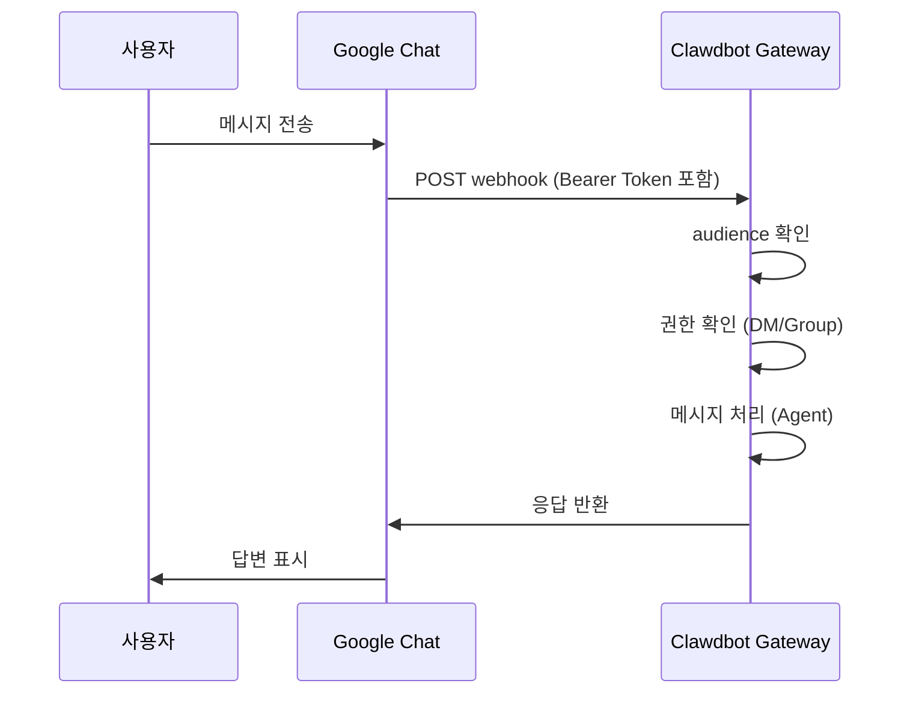

# Google Chat 채널 설정

## 학습 후 할 수 있는 것

- Google Chat에서 AI 어시스턴트와 1:1 개인 채팅
- Google Chat 스페이스에서 @언급으로 AI 어시스턴트 트리거
- Service Account 인증 및 Webhook 설정 방법 습득
- Tailscale Funnel로 공개 URL을 안전하게 노출하는 방법 학습

## 현재 겪고 있는 문제

회사나 팀에서 Google Chat을 통해 AI 어시스턴트를 사용하고 싶지만 다음을 모르는 경우:

- Google Cloud 프로젝트 생성 및 설정
- Service Account 인증 설정
- Google Chat이 Gateway에 연결할 수 있도록 Webhook 설정
- Gateway를 공개 인터넷에 안전하게 노출

## 언제 이 방법을 사용해야 할까

**Google Chat 채널 사용에 적합한 시나리오**:

- 팀이 주로 Google Chat을 사용하여 소통
- Google Workspace 환경에서 AI 어시스턴트 사용 필요
- Google Chat Spaces를 통한 협업 원함
- 공개 Webhook을 통해 Google Chat 메시지 수신 필요

**적합하지 않은 시나리오**:

- 개인 사용 (WebChat, Telegram, WhatsApp 권장)
- OAuth 사용자 권한 필요 (Google Chat은 Service Account만 지원)

## 핵심 개념

Google Chat 채널의 작동 흐름:



**핵심 개념**:

| 개념 | 설명 |
| ------ | ------ |
| **Service Account** | 봇 인증을 위한 Google Cloud 인증 방식 |
| **Webhook** | Google Chat이 Gateway로 POST 메시지를 보내는 HTTP 엔드포인트 |
| **Audience** | webhook 요청을 검증하는 대상(app-url 또는 project-number) |
| **DM 페어링** | 기본 보안 메커니즘, 알 수 없는 발신자는 승인 필요 |

::: tip
Google Chat 채널은 Service Account 인증만 지원하며, OAuth 사용자 권한은 지원하지 않습니다. 사용자 수준 권한이 필요한 경우 다른 채널을 고려하세요.
:::

## 🎒 시작 전 준비

다음이 완료되었는지 확인하세요:

- ✅ [빠른 시작](../../start/getting-started/)을 완료하고 Clawdbot 설치
- ✅ Gateway 실행 중 (`clawdbot gateway --port 18789`)
- ✅ Google Cloud 계정 액세스 권한 보유
- ✅ 기본 터미널 명령어 사용 이해

::: warning
Google Chat Webhook은 공개 HTTPS 엔드포인트가 필요합니다. 이 튜토리얼에서는 Tailscale Funnel 또는 역방향 프록시를 사용하여 서비스를 안전하게 노출하는 방법을 설명합니다.
:::

## 따라하기

### 1단계: Google Cloud 프로젝트 생성 및 Chat API 활성화

**이유**
Chat 앱과 Service Account를 호스팅할 Google Cloud 프로젝트가 필요합니다.

1. [Google Chat API Credentials](https://console.cloud.google.com/apis/api/chat.googleapis.com/credentials) 방문
2. API가 활성화되지 않은 경우 **Enable API** 클릭

**다음이 표시되어야 합니다**:
- Chat API가 활성화되고 "API enabled"로 표시
- Credentials 관리 페이지로 진입

### 2단계: Service Account 생성

**이유**
Service Account는 webhook 요청을 인증하는 봇의 신원입니다.

1. Credentials 페이지에서 **Create Credentials** > **Service Account** 클릭
2. 이름 입력 (예: `clawdbot-chat`)
3. **Continue** 클릭 (권한 설정 건너뛰기)
4. 액세스 제어를 비워두고 **Done** 클릭

**다음이 표시되어야 합니다**:
- 새로 생성된 Service Account가 목록에 나타남

### 3단계: JSON Key 생성 및 다운로드

**이유**
JSON Key는 인증 자격 증명을 포함하며, Clawdbot이 Google Chat 요청을 검증하는 데 필요합니다.

1. 방금 생성한 Service Account 클릭
2. **Keys** 탭으로 이동
3. **Add Key** > **Create new key** 클릭
4. **JSON** 형식을 선택하고 **Create** 클릭
5. 다운로드된 JSON 파일이 자동으로 저장됨

**다음이 표시되어야 합니다**:
- 브라우저가 `.json` 파일을 다운로드

::: warning
⚠️ 중요: 이 JSON Key는 한 번만 다운로드됩니다. 안전하게 보관하세요! 분실 시 다시 생성해야 합니다.
:::

### 4단계: Service Account 파일 저장

**이유**
Clawdbot이 Key 파일을 읽어 Google Chat 요청을 검증할 수 있어야 합니다.

1. 다운로드된 JSON 파일을 안전한 위치로 이동:
    ```bash
    mv ~/Downloads/*.json ~/.clawdbot/googlechat-service-account.json
    ```
2. 파일 권한 설정 (선택 사항이지만 권장):
    ```bash
    chmod 600 ~/.clawdbot/googlechat-service-account.json
    ```

**다음이 표시되어야 합니다**:
- 파일이 `~/.clawdbot/` 디렉토리에 저장됨
- 권한이 소유자만 읽기/쓰기 가능으로 설정됨

### 5단계: Google Chat 앱 생성

**이유**
Chat App은 봇의 모양, 동작 및 webhook URL을 정의합니다.

1. [Google Cloud Console Chat Configuration](https://console.cloud.google.com/apis/api/chat.googleapis.com/hangouts-chat) 방문
2. **Application info** 작성:
    - **App name**: `Clawdbot` (또는 다른 이름)
    - **Avatar URL**: `https://clawd.bot/logo.png` (선택 사항)
    - **Description**: `Personal AI Assistant` (선택 사항)
3. **Interactive features** 활성화
4. **Functionality**에서 **Join spaces and group conversations** 체크
5. **Connection settings**에서 **HTTP endpoint URL** 선택
6. **Visibility**에서 **Make this Chat app available to specific people and groups in &lt;Your Domain&gt;** 선택
7. Google Workspace 이메일 입력 (예: `user@example.com`)
8. 페이지 하단의 **Save** 클릭

**다음이 표시되어야 합니다**:
- 앱 구성이 저장됨
- "App status" 섹션이 표시됨

### 6단계: Webhook Triggers 구성

**이유**
Triggers는 Google Chat이 언제 Gateway로 메시지를 보낼지 정의합니다.

1. 저장 후 페이지 새로고침
2. **App status** 섹션 찾기 (일반적으로 상단 또는 하단)
3. 상태를 **Live - available to users**로 변경
4. 다시 **Save** 클릭

**다음이 표시되어야 합니다**:
- App status가 "Live - available to users"로 표시됨

::: info
💡 팁: Webhook URL은 7단계에서 구성합니다. 확실하지 않다면 임시로 `https://example.com/googlechat`을 사용하고 나중에 업데이트할 수 있습니다.
:::

### 7단계: Gateway의 공개 URL 가져오기

**이유**
Google Chat은 webhook 요청을 보낼 공개 HTTPS URL이 필요합니다.

다음 명령어를 실행하여 Gateway의 공개 URL 확인:

```bash
clawdbot status
```

**다음이 표시되어야 합니다**:
- 출력에 공개 URL이 포함됨 (예: `https://your-node.tailnet.ts.net`)

::: warning
Gateway가 Tailscale 또는 역방향 프록시로 구성되지 않은 경우 공개 액세스를 먼저 설정해야 합니다 (다음 단계 참조).
:::

### 8단계: Webhook 엔드포인트 공개 (하나 선택)

::: tip
Tailscale Funnel 사용을 권장합니다. `/googlechat` 경로만 노출하여 다른 엔드포인트는 비공개로 유지할 수 있습니다.
:::

#### 옵션 A: Tailscale Funnel (권장)

**Tailscale Funnel을 사용하는 이유**
- 특정 경로만 노출하여 보안 강화
- 내부 Gateway는 비공개로 유지하되 Webhook만 액세스 가능
- 도메인 구매 및 SSL 설정 불필요

1. **Gateway 바인딩 주소 확인**:
    ```bash
    ss -tlnp | grep 18789
    ```
    IP 주소 기록 (예: `127.0.0.1`, `0.0.0.0` 또는 Tailscale IP인 `100.x.x.x`)

2. **tailnet에만 제어판 노출** (포트 8443):
    ```bash
    # localhost에 바인딩된 경우 (127.0.0.1 또는 0.0.0.0):
    tailscale serve --bg --https 8443 http://127.0.0.1:18789
    
    # Tailscale IP에 바인딩된 경우 (예: 100.106.161.80):
    tailscale serve --bg --https 8443 http://100.106.161.80:18789
    ```

3. **Webhook 경로 공개**:
    ```bash
    # localhost에 바인딩된 경우 (127.0.0.1 또는 0.0.0.0):
    tailscale funnel --bg --set-path /googlechat http://127.0.0.1:18789/googlechat
    
    # Tailscale IP에 바인딩된 경우 (예: 100.106.161.80):
    tailscale funnel --bg --set-path /googlechat http://100.106.161.80:18789/googlechat
    ```

4. **Funnel 액세스 권한 부여** (메시지가 표시되는 경우):
    - 출력에 표시된 권한 부여 URL 방문
    - Tailscale 관리 패널에서 해당 노드에 Funnel 활성화

5. **구성 확인**:
    ```bash
    tailscale serve status
    tailscale funnel status
    ```

**다음이 표시되어야 합니다**:
- Serve 및 Funnel이 모두 실행 중
- 공개 Webhook URL: `https://<node-name>.<tailnet>.ts.net/googlechat`
- 비공개 제어판: `https://<node-name>.<tailnet>.ts.net:8443/`

#### 옵션 B: Caddy 역방향 프록시

**Caddy를 사용하는 이유**
- 자동 HTTPS 지원
- 유연한 경로 라우팅 구성

1. Caddyfile 생성:
    ```txt
    your-domain.com {
        reverse_proxy /googlechat* localhost:18789
    }
    ```

2. Caddy 시작:
    ```bash
    caddy run --config Caddyfile
    ```

**다음이 표시되어야 합니다**:
- Caddy가 시작되고 443 포트에서 수신 대기 중
- `your-domain.com/googlechat` 경로만 Gateway로 라우팅됨

#### 옵션 C: Cloudflare Tunnel

**Cloudflare Tunnel을 사용하는 이유**
- 무료 글로벌 CDN
- 간단한 경로 규칙 구성

1. 터널 수신 규칙 구성:
    - **Path**: `/googlechat` -> `http://localhost:18789/googlechat`
    - **Default Rule**: HTTP 404 (Not Found)

### 9단계: Google Chat Webhook URL 업데이트

**이유**
이제 공개 URL이 있으므로 Chat App 구성을 올바른 엔드포인트로 업데이트합니다.

1. Google Cloud Console Chat Configuration 페이지로 돌아가기
2. **Triggers** 섹션에서:
    - **Use a common HTTP endpoint URL for all triggers** 선택
    - 다음으로 설정: `<당신의 공개 URL>/googlechat`
    - 예: `https://your-node.tailnet.ts.net/googlechat`
3. **Save** 클릭

**다음이 표시되어야 합니다**:
- Triggers가 업데이트되고 저장됨

### 10단계: Clawdbot 구성

**이유**
Clawdbot에 사용할 Service Account와 Webhook 경로를 알립니다.

**방법 A: 환경 변수**

```bash
export GOOGLE_CHAT_SERVICE_ACCOUNT_FILE="/path/to/service-account.json"
clawdbot gateway restart
```

**방법 B: 구성 파일**

`~/.clawdbot/clawdbot.json` 편집:

```json5
{
  channels: {
    googlechat: {
      enabled: true,
      serviceAccountFile: "/Users/yourname/.clawdbot/googlechat-service-account.json",
      audienceType: "app-url",
      audience: "https://your-node.tailnet.ts.net/googlechat",
      webhookPath: "/googlechat",
      dm: {
        policy: "pairing",
        allowFrom: ["users/1234567890", "your-email@example.com"]
      },
      groupPolicy: "allowlist",
      groups: {
        "spaces/AAAA": {
          allow: true,
          requireMention: true,
          users: ["users/1234567890"],
          systemPrompt: "Short answers only."
        }
      }
    }
  }
}
```

**Gateway 재시작**:

```bash
clawdbot gateway restart
```

**다음이 표시되어야 합니다**:
- Gateway가 시작되고 "Google Chat default: enabled, configured, ..." 표시
- 오류 로그 없음

### 11단계: Bot을 Google Chat에 추가

**이유**
마지막 단계로 Google Chat에서 봇을 찾고 추가합니다.

1. [Google Chat](https://chat.google.com/) 방문
2. **+** (더하기) 아이콘 클릭, **Direct Messages** 옆에 있음
3. 검색 상자 (일반적으로 연락처를 추가하는 곳)에 **App name** 입력 (5단계에서 구성한 이름)
    - **참고**: 봇은 "Marketplace" 브라우저 목록에 표시되지 않습니다. 비공개 앱이기 때문입니다. 이름으로 검색해야 합니다.
4. 결과에서 봇 선택
5. **Add** 또는 **Chat** 클릭하여 1:1 대화 시작

**다음이 표시되어야 합니다**:
- 봇이 연락처 목록에 나타남
- 채팅 창이 열림

### 12단계: 테스트 메시지 전송

**이유**
구성이 올바른지 메시지가 정상적으로 전달되는지 확인합니다.

채팅 창에 다음을 입력:

```
Hello
```

**다음이 표시되어야 합니다**:
- 봇이 인사 또는 확인 메시지로 응답
- Gateway 로그에 메시지 수신 및 처리 표시

## 체크포인트 ✅

구성 성공 여부 확인:

```bash
# 채널 상태 확인
clawdbot channels status

# 다음이 표시되어야 함:
# Google Chat default: enabled, configured, webhook listening
```

::: info
오류가 표시되면 `clawdbot channels status --probe`를 실행하여 자세한 진단 정보를 확인하세요.
:::

## 구성 상세 설명

### Service Account 인증

| 구성 항목 | 유형 | 기본값 | 설명 |
| -------- | ------ | -------- | ------ |
| `serviceAccountFile` | string | - | Service Account JSON 파일 경로 |
| `serviceAccount` | string\|object | - | 인라인 JSON 자격 증명 (파일 경로 대신 사용) |
| `audienceType` | "app-url"\|"project-number" | "app-url" | 검증 유형: URL 또는 프로젝트 번호 |
| `audience` | string | - | Audience 값 (URL 또는 프로젝트 번호) |

### DM 정책

기본적으로 알 수 없는 발신자는 페어링이 필요합니다:

| 구성 항목 | 유형 | 기본값 | 설명 |
| -------- | ------ | -------- | ------ |
| `dm.enabled` | boolean | 정의되지 않음 | DM 수신 활성화 여부 |
| `dm.policy` | "pairing"|"open" | "pairing" | 액세스 정책: 페어링 또는 공개 |
| `dm.allowFrom` | array | [] | 허용된 발신자 목록 (user IDs 또는 emails) |

**새 발신자 페어링**:

```bash
clawdbot pairing approve googlechat <페어링 코드>
```

### 그룹 정책

| 구성 항목 | 유형 | 기본값 | 설명 |
| -------- | ------ | -------- | ------ |
| `groupPolicy` | "allowlist"|"disabled" | "allowlist" | 그룹 정책: 허용 목록 또는 비활성화 |
| `requireMention` | boolean | true | @언급 트리거 필요 여부 |
| `groups` | object | {} | 공간 ID별 구성 |

**특정 그룹 허용**:

```json5
{
  channels: {
    googlechat: {
      groups: {
        "spaces/AAAA": {
          allow: true,
          requireMention: true,
          users: ["users/1234567890"],
          systemPrompt: "Short answers only."
        }
      }
    }
  }
}
```

### 기타 구성

| 구성 항목 | 유형 | 기본값 | 설명 |
| -------- | ------ | -------- | ------ |
| `webhookPath` | string | "/googlechat" | Webhook 경로 |
| `botUser` | string | - | 봇 사용자 리소스 이름 (언급 감지용) |
| `typingIndicator` | "none"|"message"|"reaction" | "message" | 입력 표시기 모드 |
| `actions.reactions` | boolean | false | 이모지 반응 지원 여부 |
| `mediaMaxMb` | number | 정의되지 않음 | 최대 미디어 파일 크기 (MB) |

## 문제 해결 팁

### 405 Method Not Allowed

**증상**: Google Cloud Logs Explorer에 `405 Method Not Allowed` 표시

**원인**: Webhook 처리기가 등록되지 않음

**해결 방법**:

1. 구성에 `channels.googlechat` 섹션이 있는지 확인:
    ```bash
    clawdbot config get channels.googlechat
    ```

2. 플러그인 상태 확인:
    ```bash
    clawdbot plugins list | grep googlechat
    ```

3. "disabled"로 표시되면 구성 추가:
    ```json5
    {
      plugins: {
        entries: {
          googlechat: {
            enabled: true
          }
        }
      }
    }
    ```

4. Gateway 재시작:
    ```bash
    clawdbot gateway restart
    ```

### 메시지 수신 안됨

**증상**: 메시지 전송 후 응답 없음

**해결 단계**:

1. `clawdbot logs --follow` 실행 후 테스트 메시지 전송
2. Chat App의 Webhook URL 및 이벤트 구독 확인
3. `audience` 구성이 올바른지 확인
4. 언급 gating이 응답을 차단하는 경우 `botUser`를 설정하고 `requireMention` 확인

### Tailscale Funnel 시작 실패

**증상**: `tailscale funnel` 오류

**원인**: 비밀번호 인증이 설정되지 않음

**해결 방법**:

`~/.clawdbot/clawdbot.json`에 다음 추가:

```json5
{
  gateway: {
    auth: {
      mode: "password"
    }
  }
}
```

## 이번 과정 요약

- Google Cloud 프로젝트 및 Service Account 생성
- Google Chat App 및 Webhook 구성
- Tailscale Funnel 또는 역방향 프록시로 엔드포인트 공개
- Clawdbot이 Service Account 인증을 사용하도록 구성
- DM 페어링 및 그룹 @언급 메커니즘 학습
- 1:1 및 그룹 메시지 테스트 완료

## 다음 과정 예고

> 다음 과정에서는 **[Signal 채널](../signal/)**을 학습합니다.
>
> 학습할 내용:
> - signal-cli 설치 및 구성 방법
> - Signal 채널의 권한 및 액세스 제어
> - Google Chat과의 구성 차이점

---

## 부록: 소스 코드 참조

<details>
<summary><strong>클릭하여 소스 코드 위치 펼치기</strong></summary>

> 업데이트 시간: 2026-01-27

| 기능 | 파일 경로 | 줄 번호 |
| ------ | --------- | ---- |
| Google Chat 구성 유형 정의 | [`src/config/types.googlechat.ts`](https://github.com/clawdbot/clawdbot/blob/main/src/config/types.googlechat.ts) | 1-109 |
| Google Chat Zod Schema | [`src/config/zod-schema.providers-core.ts`](https://github.com/clawdbot/clawdbot/blob/main/src/config/zod-schema.providers-core.ts) | 273-341 |
| 채널 레지스트리 | [`src/channels/registry.ts`](https://github.com/clawdbot/clawdbot/blob/main/src/channels/registry.ts) | 61-67 |
| 그룹 언급 파싱 | [`src/channels/plugins/group-mentions.ts`](https://github.com/clawdbot/clawdbot/blob/main/src/channels/plugins/group-mentions.ts) | 158-175 |
| Google Chat 문서 | [`docs/channels/googlechat.md`](https://github.com/clawdbot/clawdbot/blob/main/docs/channels/googlechat.md) | 1-221 |

**핵심 유형**:
- `GoogleChatConfig`: 전체 Google Chat 구성 인터페이스
- `GoogleChatDmConfig`: DM 액세스 정책 구성
- `GoogleChatGroupConfig`: 그룹 공간 구성
- `GoogleChatActionConfig`: 액션 (이모지 반응 등) 구성

**핵심 구성 필드**:
- `audienceType`: "app-url" 또는 "project-number", webhook 요청 검증용
- `audience`: Webhook URL 또는 프로젝트 번호, `audienceType`과 쌍을 이룸
- `dm.policy`: 기본 "pairing", 알 수 없는 DM 액세스 제어
- `groupPolicy`: 그룹 액세스 정책, "allowlist" 또는 "disabled"

**인증 메커니즘**:
- Google Service Account JSON 자격 증명 사용
- Webhook 요청은 `Authorization: Bearer <token>` 헤더로 검증
- Token이 `audience` 구성 항목과 비교되어 요청이 합법적인 출처에서 온지 확인

</details>
