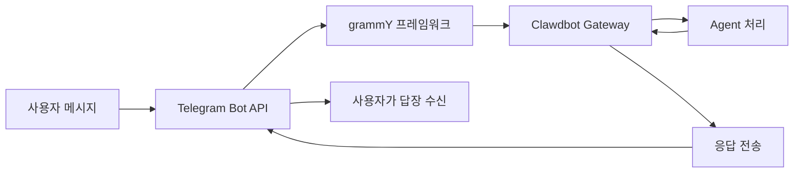

# Telegram 채널 구성 및 사용

## 학습 후 할 수 있는 것

- 🤖 Telegram에서 Bot을 생성하고 Bot Token 가져오기
- ⚙️ Telegram 채널을 Clawdbot에 연결 구성
- 🔒 DM 및 그룹 액세스 권한 제어(페어링 메커니즘 및 화이트리스트)
- 📡 그룹 멘션 규칙 및 응답 전략 설정
- 🔌 Webhook 모드 구성(선택 사항)
- 🎯 Telegram Bot API 기능 사용(인라인 버튼, 토픽, 답장)

## 현재 겪고 있는 문제점

이미 Telegram에서 Clawdbot을 사용 중이지만 다음 문제가 발생하고 있습니다:

- ❌ Bot Token을 올바르게 구성하는 방법을 모름
- ❌ 낯선 사용자가 Bot에 메시지를 보내도 응답하지 않음
- ❌ 그룹에서 Bot이 멘션 메시지에만 응답
- ❌ Bot에 액세스할 수 있는 사용자를 세밀하게 제어하고 싶지만 구성 방법을 모름
- ❌ Webhook과 Long-polling의 차이를 들었지만 어느 것을 선택해야 할지 모름

이 튜토리얼에서 이러한 문제를 단계별로 해결해 드립니다.

## 언제 사용하는가

Telegram 채널을 사용하기에 적합한 시나리오:

- ✅ 이미 Telegram을 사용 중이며 이 플랫폼에서 AI 어시스턴트와 대화하고 싶음
- ✅ 그룹에서 특정 사용자나 명령에 Bot이 응답하도록 필요
- ✅ Telegram Bot API의 특수 기능(인라인 버튼, Forum 토픽)을 사용하고 싶음
- ✅ 서버 네트워크 환경이 Long-polling 또는 Webhook 사용에 적합함

**WhatsApp 또는 다른 채널을 주로 사용하는 경우**: 이 수업을 건너뛰고 사용하는 채널에 집중할 수 있습니다.

## 🎒 시작 전 준비

시작하기 전에 다음을 확인해주세요:

- [ ] [빠른 시작](../../start/getting-started/) 튜토리얼을 완료했으며 Clawdbot이 설치되어 시작할 수 있음
- [ ] Telegram 계정이 있음(Premium 사용자일 필요 없음)
- [ ] 기본 Telegram Bot 개념(Bot, Token, 프라이버시 모드)을 이해함

::: info 구성 파일 위치
기본적으로 Clawdbot의 구성 파일은 다음 위치에 있습니다:
- **Linux/macOS**: `~/.clawdbot/clawdbot.json`
- **Windows**: `%USERPROFILE%\.clawdbot\clawdbot.json`
:::

## 핵심 개념

### Telegram Bot API vs 다른 채널

다른 인스턴트 메시징 플랫폼과 달리 Telegram은 **Bot API** 아키텍처를 사용합니다:

| 기능 | Telegram | WhatsApp | Slack |
|--- | --- | --- | ---|
| 연결 방식 | Bot API(HTTP) | Web Client | Bot API + WebSocket |
| 메시지 모드 | 푸시(Bot이 능동적으로 전송) | 풀(Web Client 수신) | 풀(WebSocket 수신) |
| 프라이버시 모드 | **지원**(Bot 선택 가능) | N/A | N/A |
| 그룹 지원 | SuperGroup + Forum | Groups | Channels + Workspace |
| 특수 기능 | Forum 토픽, 인라인 버튼 | - | - |

### Clawdbot의 통합 방식

Clawdbot은 [grammY](https://grammy.dev/) Bot API 프레임워크를 사용하여 Telegram을 통합합니다:



**핵심 포인트**:
- **Long-polling**: 기본 모드, Clawdbot이 Telegram 업데이트를 능동적으로 가져옴
- **Webhook**: 선택 사항 모드, Telegram이 업데이트를 서버로 푸시
- **DM 페어링**: 기본적으로 활성화, 낯선 사용자는 메시지를 보내기 전에 먼저 페어링을 승인해야 함
- **그룹 멘션**: 기본적으로 활성화, Bot은 `@botname` 또는 구성된 멘션 패턴에만 응답

### 액세스 제어 메커니즘

Clawdbot은 세 계층의 액세스 제어를 제공합니다:

1. **DM 레벨**(`dmPolicy`)
   - `pairing`: 낯선 사용자가 페어링 코드를 수신하며 먼저 승인해야 함
   - `allowlist`: 화이트리스트의 사용자만 허용
   - `open`: 모든 DM 허용(`allowFrom: ["*"]` 구성 필요)

2. **그룹 레벨**(`groups` + `groupPolicy`)
   - 어떤 그룹이 Bot에 액세스할 수 있는지 나열
   - 각 그룹의 `requireMention` 규칙 설정

3. **발신자 레벨**(`allowFrom` + `groupAllowFrom`)
   - 허용된 DM/그룹에서 메시지를 보낼 수 있는 사용자를 추가로 제한

::: warning 보안 기본값
기본 DM 정책은 `pairing`이며, 이는 가장 안전한 기본값입니다. 낯선 사용자가 보낸 메시지는 페어링 코드를 승인할 때까지 무시됩니다.
:::

## 함께 따라하기

### 1단계: Telegram Bot 생성 및 Token 가져오기

**이유**
Telegram Bot은 Bot API를 통해 메시지에 액세스하고 보내려면 Bot Token이 필요합니다. 이 Token은 Bot의 "신원 증명"에 해당합니다.

**작업**

1. Telegram에서 **@BotFather**를 검색하여 엽니다
2. `/newbot` 명령을 보냅니다
3. 프롬프트에 따라 작업:
   - Bot 이름 입력(예: `My Clawdbot Assistant`)
   - Bot 사용자명 입력(반드시 `bot`으로 끝나야 함, 예: `my_clawdbot_bot`)
4. BotFather가 Bot Token을 반환합니다. 형식: `123456:ABC-DEF123456`

**다음이 표시되어야 합니다**:
```
Done! Congratulations on your new bot.

You can find it at t.me/my_clawdbot_bot. You can now add a description,
about section and profile picture for it, see /help for a list of commands.

Use this token to access the HTTP API:
123456:ABC-DEF1234567890

Keep your token secure and store it safely, it can be used by anyone
to control your bot.
```

::: tip 보안 권장 사항
- 🔐 Token을 즉시 복사하여 안전한 곳(예: 비밀번호 관리자)에 저장하세요
- ⚠️ 공개 저장소, 소셜 미디어 또는 타인과 Token을 **절대 공유하지 마세요**
- 🔄 Token이 유출된 경우 @BotFather에서 `/revoke` 명령을 사용하여 즉시 철회하세요
:::

**선택 사항 BotFather 구성**(권장)

1. 그룹 권한 설정:
   - `/setjoingroups` → Bot이 그룹에 추가되는지 여부 선택
   - `/setprivacy` → 모든 그룹 메시지를 볼지 여부 제어

2. Bot 정보 설정:
   - `/setdescription` → 설명 추가
   - `/setabouttext` → 텍스트 추가
   - `/setuserpic` → 아바타 업로드

### 2단계: Telegram 채널 구성

**이유**
구성 파일은 Clawdbot이 Telegram Bot API에 연결하는 방법과 메시지 및 권한을 처리하는 방법을 알려줍니다.

**작업**

`~/.clawdbot/clawdbot.json`을 생성하거나 편집합니다:

```json5
{
  "channels": {
    "telegram": {
      "enabled": true,
      "botToken": "123456:ABC-DEF1234567890",
      "dmPolicy": "pairing"
    }
  }
}
```

**구성 필드 설명**:

| 필드 | 타입 | 기본값 | 설명 |
|--- | --- | --- | ---|
| `enabled` | boolean | `true` | Telegram 채널 시작 여부 |
| `botToken` | string | - | Bot Token(필수) |
| `dmPolicy` | string | `"pairing"` | DM 액세스 정책 |
| `allowFrom` | array | `[]` | DM 화이트리스트(사용자 ID 또는 @사용자명) |
| `groupPolicy` | string | `"allowlist"` | 그룹 액세스 정책 |
| `groupAllowFrom` | array | `[]` | 그룹 발신자 화이트리스트 |
| `groups` | object | `{}` | 그룹 상세 구성 |

**환경 변수 방식**(선택 사항)

환경 변수도 사용할 수 있습니다(기본 계정에 적용):

```bash
export TELEGRAM_BOT_TOKEN="123456:ABC-DEF1234567890"
```

::: tip 환경 변수 우선순위
환경 변수와 구성 파일을 모두 구성한 경우:
- **구성 파일이 우선**(`channels.telegram.botToken`)
- 환경 변수는 **기본 계정의 백업**으로 작동
:::

### 3단계: Gateway 시작 및 연결 확인

**이유**
Gateway가 구성에 따라 Telegram Bot API에 연결하고 메시지 수신을 시작하도록 합니다.

**작업**

1. 터미널에서 Gateway를 시작합니다:

```bash
# 방식 1: 직접 시작
clawdbot gateway --verbose

# 방식 2: 데몬 프로세스 사용
clawdbot gateway --port 18789 --verbose
```

2. Gateway 시작 로그를 관찰하고 Telegram 관련 정보를 찾습니다

**다음이 표시되어야 합니다**:
```
[INFO] Starting Gateway...
[INFO] Loading config from ~/.clawdbot/clawdbot.json
[INFO] Starting channels...
[INFO] Starting Telegram channel...
[INFO] Telegram bot connected: @my_clawdbot_bot
[INFO] Listening for updates (long-polling)...
```

::: tip 자세한 로그 보기
`--verbose` 플래그를 사용하면 다음을 포함한 더 자세한 로그를 볼 수 있습니다:
- 수신된 각 메시지
- 세션 라우팅 결정
- 권한 확인 결과
:::

**확인점 ✅**

- [ ] Gateway가 오류 없이 성공적으로 시작됨
- [ ] 로그에 "Telegram bot connected"가 표시됨
- [ ] "Authentication failed" 또는 "Invalid token" 오류가 발생하지 않음

### 4단계: Telegram에서 Bot 테스트

**이유**
첫 번째 메시지를 보내 Bot이 올바르게 연결되고 구성이 적용되며 메시지를 수신하고 응답할 수 있는지 확인합니다.

**작업**

1. Telegram에서 Bot 사용자명 검색(예: `@my_clawdbot_bot`)
2. "Start" 버튼을 클릭하거나 `/start` 명령을 보냅니다
3. 첫 번째 DM 연락인 경우 페어링 코드를 받아야 합니다

**다음이 표시되어야 합니다**:
```
👋 Hi! I'm your Clawdbot assistant.

To get started, please approve this pairing code:
CLAW-ABC123

Run this command in your terminal:
clawdbot pairing approve telegram CLAW-ABC123
```

**Bot이 응답하지 않는 경우**:

| 문제 | 가능한 원인 | 해결 방법 |
|--- | --- | ---|
| Bot 응답 없음 | Bot Token 오류 | `clawdbot.json`의 `botToken` 값 확인 |
| Bot 응답 없음 | Gateway 시작 안 됨 | `clawdbot gateway --verbose` 실행하여 오류 확인 |
| Bot 응답 없음 | 네트워크 문제 | 서버가 `api.telegram.org`에 액세스할 수 있는지 확인 |
| Bot 응답 없음 | Bot 차단됨 | @BotFather에서 Bot 상태 확인 |

### 5단계: DM 페어링 승인(해당하는 경우)

**이유**
기본 DM 정책은 `pairing`이며, 낯선 사용자는 승인 후 Bot에 메시지를 보낼 수 있습니다. 이는 보안을 보장합니다.

**작업**

1. 터미널에서 페어링 명령을 실행합니다:

```bash
# 승인 대기 중인 페어링 보기
clawdbot pairing list telegram

# 페어링 코드 승인
clawdbot pairing approve telegram CLAW-ABC123
```

2. 페어링이 성공하면 사용자가 Bot에 정상적으로 메시지를 보낼 수 있습니다

**다음이 표시되어야 합니다**:
```
✅ Pairing approved: telegram:user:123456789

User @username can now send messages to the bot.
```

::: tip 페어링 코드 만료
페어링 코드는 1시간 후 만료됩니다. 사용자는 새 코드를 얻으려면 `/start` 명령을 다시 보내야 합니다.
:::

## 그룹 구성

### 그룹 Chat ID 가져오기

그룹 액세스 제어를 구성하려면 먼저 그룹의 Chat ID를 알아야 합니다.

**방법 1: 타사 Bot 사용(빠르지만 권장하지 않음)**

1. Bot을 그룹에 추가
2. 그룹에서 임의의 메시지를 `@userinfobot`으로 전달
3. Bot이 Chat ID를 포함한 그룹 정보를 반환

**방법 2: Gateway 로그 사용(권장)**

1. 그룹에서 Bot에 임의의 메시지를 보냅니다
2. 다음을 실행합니다:

```bash
clawdbot logs --follow
```

3. 로그에서 `chat.id` 필드를 찾습니다. 그룹 ID는 일반적으로 음수입니다(예: `-1001234567890`)

**다음이 표시되어야 합니다**:
```
[INFO] Received message from chat: -1001234567890
```

### 그룹 액세스 구성

**방법 1: 모든 그룹 허용**

```json5
{
  "channels": {
    "telegram": {
      "groups": {
        "*": {
          "requireMention": true
        }
      }
    }
  }
}
```

**방법 2: 특정 그룹만 허용**

```json5
{
  "channels": {
    "telegram": {
      "groups": {
        "-1001234567890": {
          "requireMention": false
        },
        "-1009876543210": {
          "requireMention": true
        }
      }
    }
  }
}
```

**방법 3: 그룹에서 항상 응답(멘션 요구 안 함)**

```json5
{
  "channels": {
    "telegram": {
      "groups": {
        "-1001234567890": {
          "requireMention": false
        }
      }
    }
  }
}
```

### Telegram 프라이버시 모드 설정

그룹에서 Bot이 **멘션하지 않은 메시지에 응답하지 않는** 경우 프라이버시 모드 제한일 수 있습니다.

**확인 단계**:

1. @BotFather에서 `/setprivacy`를 실행합니다
2. **Disable**(프라이버시 모드 끄기)를 선택합니다
3. **중요**: 설정을 적용하려면 Telegram이 그룹에서 Bot을 제거하고 다시 추가해야 합니다
4. Bot을 다시 그룹에 추가합니다

::: warning 프라이버시 모드 영향
- ✅ **프라이버시 모드 OFF**: Bot이 모든 그룹 메시지를 볼 수 있음(모든 메시지에 응답하려면 `requireMention: false` 필요)
- ⚠️ **프라이버시 모드 ON**: Bot은 @멘션 또는 Bot이 답장된 메시지만 볼 수 있음(기본값)
- 🛡️ **Bot이 관리자**: 관리자 Bot은 프라이버시 모드에 관계없이 모든 메시지를 볼 수 있음
:::

### 세션 내 그룹 활성화

명령을 사용하여 그룹 응답 동작을 동적으로 전환할 수도 있습니다(세션 수준, 재시작 후 손실):

- `/activation always` — 그룹에서 모든 메시지에 응답
- `/activation mention` — 멘션에만 응답(기본값)

::: tip 구성 사용 권장
지속성 동작을 위해 명령 대신 `clawdbot.json`에서 `groups.requireMention`을 구성하는 것이 좋습니다.
:::

## 고급 구성

### Webhook 모드(선택 사항)

기본적으로 **Long-polling**(능동적으로 업데이트 가져오기)을 사용합니다. 공용 서버가 있는 경우 Webhook 모드를 사용할 수 있습니다.

**Webhook 구성**:

```json5
{
  "channels": {
    "telegram": {
      "webhookUrl": "https://your-domain.com/telegram-webhook",
      "webhookSecret": "your-secret-token"
    }
  }
}
```

**Webhook vs Long-polling**:

| 기능 | Long-polling | Webhook |
|--- | --- | ---|
| 네트워크 요구사항 | `api.telegram.org`에 능동적으로 액세스 필요 | 공용 HTTPS 엔드포인트 필요 |
| 지연 | ~1-3초 폴링 간격 | 거의 실시간 푸시 |
| 서버 리소스 | 높음(지속적인 폴링) | 낮음(수동 수신) |
| 적합한 시나리오 | 홈 서버, 공용 IP 없음 | VPS, 도메인 있음 |

::: tip 로컬 Webhook 테스트
로컬에서 Webhook을 테스트하려면:
- `ngrok` 또는 `localtunnel`을 사용하여 임시 터널 생성
- 터널 URL을 `webhookUrl`로 구성
- Gateway는 `0.0.0.0:8787`에서 `/telegram-webhook`을 수신
:::

### 미디어 크기 제한

Telegram에서 전송하고 수신하는 미디어 파일 크기를 제어합니다:

```json5
{
  "channels": {
    "telegram": {
      "mediaMaxMb": 10
    }
  }
}
```

- 기본값: 5MB
- 제한을 초과하는 미디어는 거부됨

### 메시지 분할 구성

Telegram은 단일 메시지의 텍스트 길이에 제한이 있습니다(약 4096자). Clawdbot은 긴 메시지를 자동으로 분할합니다.

```json5
{
  "channels": {
    "telegram": {
      "textChunkLimit": 4000,
      "chunkMode": "length"
    }
  }
}
```

**분할 모드**:

- `"length"`: 문자 수로 분할(기본값)
- `"newline"`: 먼저 빈 줄로 분할(단락 유지), 그 다음 길이로 분할

### Forum 토픽 지원

Telegram Forum 슈퍼그룹은 토픽을 지원합니다. Clawdbot은 각 토픽에 대해 독립적인 세션을 생성합니다.

```json5
{
  "channels": {
    "telegram": {
      "groups": {
        "-1001234567890": {
          "topics": {
            "12345": {
              "requireMention": false,
              "systemPrompt": "You are a specialist in this topic."
            }
          }
        }
      }
    }
  }
}
```

**토픽 세션 키 형식**:
```
agent:main:telegram:group:-1001234567890:topic:12345
```

### 인라인 버튼

Telegram은 대화형 버튼(Inline Buttons)을 지원합니다.

**버튼 활성화**:

```json5
{
  "channels": {
    "telegram": {
      "capabilities": {
        "inlineButtons": "allowlist"
      }
    }
  }
}
```

**버튼 범위**:

- `"off"`: 버튼 비활성화
- `"dm"`: DM에서만 허용
- `"group"`: 그룹에서만 허용
- `"all"`: DM + 그룹
- `"allowlist"`: DM + 그룹이지만 `allowFrom`의 발신자만 허용

**Agent를 통해 버튼 보내기**:

`telegram` 도구의 `sendMessage` 작업을 사용합니다:

```json5
{
  "action": "send",
  "channel": "telegram",
  "to": "123456789",
  "message": "Choose an option:",
  "buttons": [
    [
      {"text": "Yes", "callback_data": "yes"},
      {"text": "No", "callback_data": "no"}
    ],
    [
      {"text": "Cancel", "callback_data": "cancel"}
    ]
  ]
}
```

**버튼 콜백 처리**:

사용자가 버튼을 클릭하면 Agent는 `callback_data: value` 형식의 메시지를 받습니다.

### 반응 알림

Agent가 사용자의 메시지 반응(emoji)을 수신할지 여부를 제어합니다.

```json5
{
  "channels": {
    "telegram": {
      "reactionNotifications": "all",
      "reactionLevel": "minimal"
    }
  }
}
```

**반응 알림 모드**:

- `"off"`: 모든 반응 무시
- `"own"`: Bot 메시지에 대한 사용자 반응만 알림(기본값)
- `"all"`: 모든 반응 알림

**Agent 반응 레벨**:

- `"off"`: Agent가 반응을 보낼 수 없음
- `"ack"`: 처리 시 확인 반응 👀 전송
- `"minimal"`: 반응을 신중하게 사용(5-10회 교환당 1회, 기본값)
- `"extensive"`: 반응을 자유롭게 사용

## 주의 사항

### 일반적인 구성 오류

| 오류 | 증상 | 원인 | 해결 방법 |
|--- | --- | --- | ---|
| Token 형식 오류 | "Invalid token" 오류 | 불완전한 Token 복사 | Token이 완전한지 확인(콜론 포함) |
| 환경 변수 충돌 | Bot이 다른 Token 사용 | 환경 변수가 구성 파일을 덮어씀 | `channels.telegram.botToken`을 우선 사용 |
| 그룹 응답 없음 | Bot이 그룹 메시지 처리 안 함 | 프라이버시 모드 꺼지지 않음 | @BotFather에서 `/setprivacy` 실행 |
| Webhook 실패 | "Webhook setup failed" | URL에 액세스할 수 없거나 HTTPS가 올바르지 않음 | 서버 및 인증서 확인 |

### 네트워크 문제

**IPv6 라우팅 문제**:

일부 서버는 `api.telegram.org`를 확인하기 위해 IPv6를 우선 사용하며, IPv6 네트워크에 문제가 있으면 요청이 실패할 수 있습니다.

**증상**:
- Bot이 시작되지만 곧 응답을 중지
- 로그에 "HttpError: Network request failed" 표시

**해결 방법**:

1. DNS 확인:

```bash
dig +short api.telegram.org A    # IPv4
dig +short api.telegram.org AAAA # IPv6
```

2. IPv4 강제 사용(`/etc/hosts`에 추가하거나 DNS 구성 수정)

```bash
# /etc/hosts 예시
123.45.67.89 api.telegram.org
```

3. Gateway 재시작

### 프라이버시 모드 함정

**문제**:
- 프라이버시 모드를 끈 후에도 Bot이 그룹 메시지를 볼 수 없음

**원인**:
- Telegram이 그룹에서 Bot을 **제거하고 다시 추가**하도록 요구함

**해결 방법**:
1. 그룹에서 Bot 제거
2. Bot을 다시 그룹에 추가
3. 30초 기다린 후 테스트

## 요약

이 수업에서 다음을 배웠습니다:

- ✅ Telegram에서 Bot 생성 및 Token 가져오기
- ✅ Clawdbot을 Telegram Bot API에 연결 구성
- ✅ DM 페어링 메커니즘 이해 및 사용
- ✅ 그룹 액세스 제어 구성(화이트리스트 + 멘션 규칙)
- ✅ Webhook vs Long-polling의 차이 이해
- ✅ 고급 기능 구성(미디어 제한, 분할, Forum 토픽, 인라인 버튼)
- ✅ 일반적인 네트워크 및 구성 문제 처리

**핵심 구성 필드 요약**:

| 필드 | 권장 값 | 설명 |
|--- | --- | ---|
| `dmPolicy` | `"pairing"` | 가장 안전한 기본 DM 정책 |
| `groups.*.requireMention` | `true` | 그룹 기본 멘션 요구 |
| `reactionNotifications` | `"own"` | Bot 메시지 반응에만 응답 |
| `streamMode` | `"partial"` | 초안 스트리밍 업데이트 활성화 |

## 다음 수업 예고

> 다음 수업에서는 **[Slack 채널](../../platforms/slack/)**을 학습합니다.
>
> 다음을 배우게 됩니다:
> - Slack App 생성 및 Bot Token 가져오기 방법
> - Slack Bot Token 및 App Token 구성
> - Slack의 Workspace 및 Channel 개념 이해
> - Slack 특정 기능 설정(스레드, 바로가기, App Home)

---

## 부록: 소스 코드 참조

<details>
<summary><strong>클릭하여 소스 코드 위치 보기</strong></summary>

> 업데이트 날짜: 2026-01-27

| 기능 | 파일 경로 | 행 번호 |
|--- | --- | ---|
| Telegram Bot 생성 | [`src/telegram/bot.ts`](https://github.com/clawdbot/clawdbot/blob/main/src/telegram/bot.ts) | 106-452 |
| 구성 타입 정의 | [`src/config/types.telegram.ts`](https://github.com/clawdbot/clawdbot/blob/main/src/config/types.telegram.ts) | 14-157 |
| Telegram 문서 | [`docs/channels/telegram.md`](https://github.com/clawdbot/clawdbot/blob/main/docs/channels/telegram.md) | 1-547 |
| Bot 메시지 처리기 | [`src/telegram/bot-message.ts`](https://github.com/clawdbot/clawdbot/blob/main/src/telegram/bot-message.ts) | 전체 파일 |
| Bot 명령 처리기 | [`src/telegram/bot-handlers.ts`](https://github.com/clawdbot/clawdbot/blob/main/src/telegram/bot-handlers.ts) | 전체 파일 |
| 네이티브 명령 등록 | [`src/telegram/bot-native-commands.ts`](https://github.com/clawdbot/clawdbot/blob/main/src/telegram/bot-native-commands.ts) | 전체 파일 |

**핵심 구성 필드**:

- `dmPolicy`: DM 액세스 정책(`"pairing"` | `"allowlist"` | `"open"` | `"disabled"`)
- `groupPolicy`: 그룹 정책(`"open"` | `"allowlist"` | `"disabled"`)
- `requireMention`: 그룹 멘션 요구 여부(`boolean`)
- `reactionNotifications`: 반응 알림 모드(`"off"` | `"own"` | `"all"`)
- `reactionLevel`: Agent 반응 레벨(`"off"` | `"ack"` | `"minimal"` | `"extensive"`)

**핵심 함수**:

- `createTelegramBot()`: Telegram Bot 인스턴스 생성 및 grammY 프레임워크 구성
- `createTelegramWebhookCallback()`: Webhook 콜백 처리기 생성
- `getTelegramSequentialKey()`: Forum 토픽 및 일반 그룹을 지원하는 세션 키 생성

**종속 라이브러리**:

- [grammY](https://grammy.dev/): Telegram Bot API 프레임워크
- @grammyjs/runner: 순차적 업데이트 처리
- @grammyjs/transformer-throttler: API 스로틀링 제한

</details>
