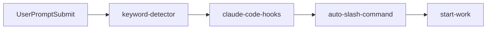
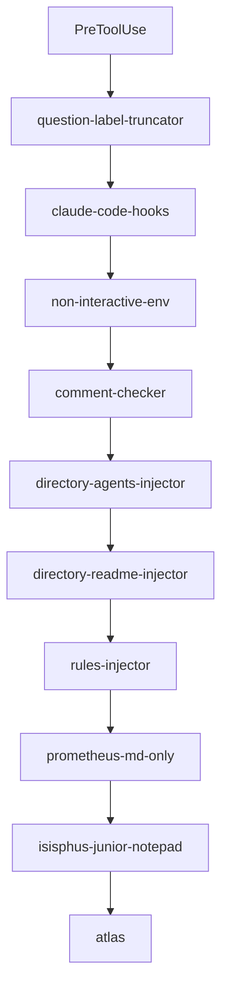
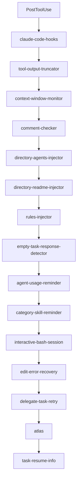
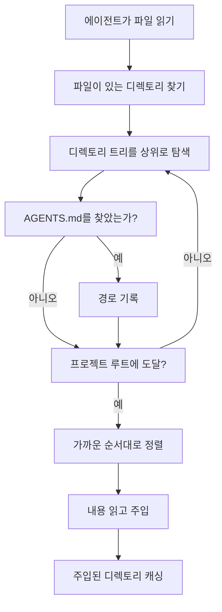
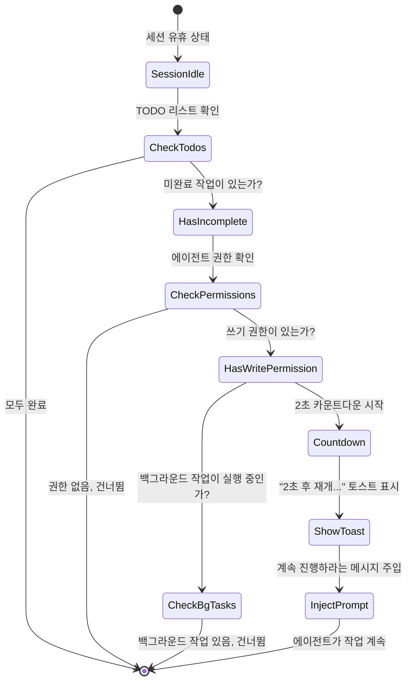
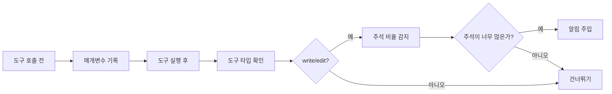

# Lifecycle Hooks: Automated Context & Quality Control

## 학습 목표

- AI 에이전트에 프로젝트 컨텍스트를 자동으로 주입 (AGENTS.md, README.md)
- 에이전트가 작업을 중간에 멈추지 않고 TODO 리스트를 완료하도록 강제
- 과도하게 큰 도구 출력을 자동으로 잘라내어 컨텍스트 윈도우 오버플로우 방지
- Ultrawork 모드를 활성화하여 전문 에이전트를 한 번에 모두 활성화
- 커스텀 hook 설정을 통해 불필요한 기능을 비활성화

## 현재 직면한 문제

다음과 같은 문제를 경험한 적이 있습니까?

- AI 에이전트가 프로젝트 규칙을 잊고 같은 실수를 반복함
- 에이전트가 작업의 절반에서 멈추고 TODO 리스트를 완료하지 않음
- 코드베이스 검색 출력이 너무 커서 컨텍스트 윈도우가 꽉 참
- 매번 수동으로 에이전트에 어떤 모드로 작업할지 알려줘야 함

## 사용 시기

Lifecycle hooks는 다음 시나리오에 적합합니다:

::: tip 대표적인 사용 시나리오
- **프로젝트 컨텍스트 관리**: AGENTS.md와 README.md를 자동으로 주입
- **품질 제어**: 코드 주석을 확인하고, 사고 블록을 검증
- **작업 연속성**: 에이전트가 모든 TODO 작업을 완료하도록 강제
- **성능 최적화**: 동적으로 출력을 자르고, 컨텍스트 윈도우를 관리
- **워크플로우 자동화**: 키워드로 모드를 트리거하고, 명령을 자동으로 실행
:::

## 핵심 개념

### Lifecycle Hook이란 무엇인가?

**Lifecycle Hook**은 에이전트 작업의 핵심 시점에 커스텀 로직을 삽입할 수 있게 하는 이벤트 기반 메커니즘입니다. 예를 들어 프로젝트 문서를 자동으로 주입하거나, TODO 작업 완료를 강제하거나, 과도하게 큰 출력을 자르는 등의 작업이 가능합니다. 이러한 hook은 4가지 이벤트 타입을 감지합니다: 도구 실행 전, 도구 실행 후, 사용자가 프롬프트를 제출할 때, 세션이 유휴 상태일 때. 적절한 설정을 통해 AI 에이전트를 더 지능적이고 사용자의 작업 스타일에 맞게 조정할 수 있습니다.

::: info Hook vs Middleware
Hook과 웹 프레임워크의 middleware는 비슷합니다. 둘 다 "특정 시점에 특정 작업을 수행"하는 메커니즘입니다. 차이점은 다음과 같습니다:
- **Middleware**: 선형적으로 실행되며, 요청을 중단할 수 있음
- **Hook**: 이벤트 기반이며, 중단할 수 없고 데이터만 수정할 수 있음
:::

### 32개 Hook, 7가지 카테고리

oh-my-opencode는 32개의 내장 hook을 7가지 카테고리로 제공합니다:

| 카테고리 | Hook 수 | 주요 역할 |
|--- | --- | ---|
| **컨텍스트 주입** | 4 | 프로젝트 문서와 규칙을 자동으로 주입 |
| **생산성과 제어** | 6 | 키워드 감지, 모드 전환, 루프 관리 |
| **품질과 보안** | 4 | 코드 주석 확인, 사고 블록 검증 |
| **복구와 안정성** | 3 | 세션 복구, 오류 처리 |
| **자르기와 컨텍스트 관리** | 2 | 출력 자르기, 윈도우 모니터링 |
| **알림과 UX** | 3 | 버전 업데이트, 백그라운드 작업 알림, 유휴 알림 |
| **작업 관리** | 2 | 작업 복구, 위임 재시도 |

## Hook 이벤트 타입

Hook은 다음 4가지 이벤트를 감지합니다:

### 1. PreToolUse (도구 실행 전)

**트리거 시점**: 에이전트가 도구를 호출하기 전

**할 수 있는 일**:
- 도구 실행 중단
- 도구 매개변수 수정
- 컨텍스트 주입

**예시 Hook**: `comment-checker`, `directory-agents-injector`

### 2. PostToolUse (도구 실행 후)

**트리거 시점**: 도구 실행 완료 후

**할 수 있는 일**:
- 도구 출력 수정
- 경고 정보 추가
- 후속 지령 주입

**예시 Hook**: `tool-output-truncator`, `directory-readme-injector`

### 3. UserPromptSubmit (사용자가 프롬프트를 제출할 때)

**트리거 시점**: 사용자가 세션에 메시지를 보낼 때

**할 수 있는 일**:
- 제출 중단 (드문 경우)
- 프롬프트 내용 수정
- 시스템 메시지 주입
- 작업 모드 활성화

**예시 Hook**: `keyword-detector`, `auto-slash-command`

### 4. Stop (세션이 유휴 상태일 때)

**트리거 시점**: 에이전트가 작업을 멈추고 세션이 유휴 상태가 될 때

**할 수 있는 일**:
- 후속 프롬프트 주입
- 알림 보내기
- 작업 상태 확인

**예시 Hook**: `todo-continuation-enforcer`, `session-notification`

## Hook 실행 순서

Hook은 고정된 순서로 실행되어 논리적 정확성을 보장합니다:

### UserPromptSubmit 이벤트



**순서 설명**:
1. `keyword-detector`: 키워드 감지 (ultrawork, search, analyze)
2. `claude-code-hooks`: Claude Code 호환성 레이어 hook 실행
3. `auto-slash-command`: 슬래시 명령 자동 실행
4. `start-work`: `/start-work` 명령 처리

### PreToolUse 이벤트



**순서 설명**:
1. `question-label-truncator`: 도구 레이블 자르기
2. `claude-code-hooks`: Claude Code 호환성 레이어
3. `non-interactive-env`: 비대화형 환경 처리
4. `comment-checker`: 코드 주석 확인
5. `directory-agents-injector`: AGENTS.md 주입
6. `directory-readme-injector`: README.md 주입
7. `rules-injector`: 프로젝트 규칙 주입
8. `prometheus-md-only`: Prometheus가 Markdown만 출력하도록 강제
9. `sisyphus-junior-notepad`: Sisyphus Junior에 노트 주입
10. `atlas`: Atlas 메인 오케스트레이션 로직

### PostToolUse 이벤트



**순서 설명**:
1. `claude-code-hooks`: Claude Code 호환성 레이어
2. `tool-output-truncator`: 도구 출력 자르기
3. `context-window-monitor`: 컨텍스트 윈도우 모니터링
4. `comment-checker`: 코드 주석 확인
5. `directory-agents-injector`: AGENTS.md 주입
6. `directory-readme-injector`: README.md 주입
7. `rules-injector`: 프로젝트 규칙 주입
8. `empty-task-response-detector`: 빈 응답 감지
9. `agent-usage-reminder`: 전문 에이전트 사용 알림
10. `category-skill-reminder`: Category/Skill 사용 알림
11. `interactive-bash-session`: 대화형 Bash 세션 관리
12. `edit-error-recovery`: 편집 오류 복구
13. `delegate-task-retry`: 실패한 위임 작업 재시도
14. `atlas`: Atlas 메인 오케스트레이션 로직
15. `task-resume-info`: 작업 재개 정보 제공

## 핵심 Hook 상세 설명

### 1. directory-agents-injector (AGENTS.md 주입)

**트리거 이벤트**: PostToolUse

**기능**: 에이전트가 파일을 읽을 때, 파일이 있는 디렉토리에서 프로젝트 루트까지 상위 디렉토리를 거슬러 올라가며 경로상의 모든 `AGENTS.md` 파일을 수집하고 에이전트의 컨텍스트에 주입합니다.

**작업 흐름**:



**예시**:

프로젝트 구조:
```
project/
├── AGENTS.md              # 프로젝트 레벨 컨텍스트
├── src/
│   ├── AGENTS.md          # src 레벨 컨텍스트
│   └── components/
│       ├── AGENTS.md      # components 레벨 컨텍스트
│       └── Button.tsx
```

에이전트가 `Button.tsx`를 읽을 때, 자동으로 다음을 주입합니다:
1. `components/AGENTS.md` (가장 먼저 주입)
2. `src/AGENTS.md`
3. `AGENTS.md` (프로젝트 루트)

::: tip 모범 사례
- 각 주요 디렉토리에 `AGENTS.md`를 생성하여 해당 디렉토리의 책임과 규칙을 설명
- AGENTS.md는 "가까운 것부터 먼 것까지" 원칙을 따름, 가장 가까운 것이 가장 높은 우선순위
- 이미 주입된 디렉토리는 캐시되어 반복 주입을 방지
:::

**소스 코드 위치**: `src/hooks/directory-agents-injector/index.ts` (183줄)

### 2. todo-continuation-enforcer (TODO 강제 재개)

**트리거 이벤트**: Stop

**기능**: 에이전트의 TODO 리스트를 감지하고, 완료되지 않은 TODO가 있으면 에이전트가 작업을 계속하도록 강제하여 중간에 작업을 포기하지 않도록 합니다.

**작업 흐름**:



**카운트다운 메커니즘**:
- 기본 카운트다운 2초
- 토스트 표시: "2초 후 재개... (남은 작업 X개)"
- 사용자는 카운트다운 중 수동으로 취소 가능

**건너뛰는 조건**:
1. 에이전트에 쓰기 권한 없음 (읽기 전용 에이전트)
2. 에이전트가 건너뛰기 목록에 있음 (prometheus, compaction)
3. 백그라운드 작업이 실행 중
4. 세션이 복구 중

**소스 코드 위치**: `src/hooks/todo-continuation-enforcer.ts` (490줄)

### 3. keyword-detector (키워드 감지)

**트리거 이벤트**: UserPromptSubmit

**기능**: 사용자 프롬프트의 키워드를 감지하여 해당 모드를 자동으로 활성화합니다:

| 키워드 | 활성화 모드 | 설명 |
|--- | --- | ---|
| `ultrawork` / `ulw` | **최대 성능 모드** | 모든 전문 에이전트와 병렬 작업 활성화 |
| `search` / `find` | **병렬 탐색 모드** | explore/librarian을 병렬로 시작 |
| `analyze` / `investigate` | **심층 분석 모드** | 심층 탐색과 분석 활성화 |

**사용 예시**:

```
사용자 입력:
ultrawork 인증과 권한 부여가 포함된 REST API 개발

시스템 응답:
[✅ Ultrawork Mode Activated]
Maximum precision engaged. All agents at your disposal.
```

**구현 세부 사항**:
- 키워드 감지는 변형을 지원 (ultrawork = ulw)
- 메인 세션과 비메인 세션의 처리가 다름
- 모드 설정은 `message.variant`를 통해 에이전트에 전달
- 백그라운드 작업 세션은 키워드 감지를 수행하지 않음

**소스 코드 위치**: `src/hooks/keyword-detector/index.ts` (101줄)

### 4. tool-output-truncator (도구 출력 자르기)

**트리거 이벤트**: PostToolUse

**기능**: 과도하게 큰 도구 출력을 동적으로 자르고, 50%의 컨텍스트 윈도우 headroom을 유지하며, 최대 50k 토큰까지 자릅니다.

**지원하는 도구**:

```typescript
const TRUNCATABLE_TOOLS = [
  "grep", "Grep", "safe_grep",
  "glob", "Glob", "safe_glob",
  "lsp_diagnostics",
  "ast_grep_search",
  "interactive_bash", "Interactive_bash",
  "skill_mcp",
  "webfetch", "WebFetch",
]
```

**특수 제한**:
- `webfetch` 최대 10k 토큰 (웹 페이지 콘텐츠는 더 공격적으로 잘라내야 함)
- 다른 도구는 최대 50k 토큰

**자르기 전략**:
1. 남은 컨텍스트 윈도우에 따라 동적으로 자르기 지점 계산
2. 출력 헤드와 테일을 유지하고, 중간은 생략 부호로 대체
3. 자르기 힌트 추가: `[Note: Content was truncated to save context window space. For full context, please read file directly: {path}]`

::: warning 더 공격적인 자르기 활성화
`oh-my-opencode.json`에서 설정:
```json
{
  "experimental": {
    "truncate_all_tool_outputs": true
  }
}
```
이는 TRUNCATABLE_TOOLS 목록에 있는 도구뿐만 아니라 모든 도구 출력을 자릅니다.
:::

**소스 코드 위치**: `src/hooks/tool-output-truncator.ts` (62줄)

### 5. comment-checker (코드 주석 확인)

**트리거 이벤트**: PreToolUse / PostToolUse

**기능**: 에이전트가 너무 많은 주석을 작성하는지 확인하고, BDD, 지령, docstring을 지능적으로 무시합니다.

**작업 흐름**:



**지능적인 무시 규칙**:
- BDD (Behavior-Driven Development) 주석
- 지령 주석 (예: `// TODO`, `// FIXME`)
- Docstrings

**설정 방법**:

```json
{
  "comment_checker": {
    "custom_prompt": "사용자 정의 프롬프트"
  }
}
```

**소스 코드 위치**: `src/hooks/comment-checker/index.ts` (172줄)

## Hook 설정

### Hook 활성화/비활성화

`oh-my-opencode.json`에서 설정:

```json
{
  "disabled_hooks": [
    "comment-checker",
    "auto-update-checker",
    "keyword-detector"
  ]
}
```

### 일반적인 설정 시나리오

#### 시나리오 1: 주석 확인 비활성화

```json
{
  "disabled_hooks": ["comment-checker"]
}
```

#### 시나리오 2: 키워드 감지 비활성화

```json
{
  "disabled_hooks": ["keyword-detector"]
}
```

#### 시나리오 3: TODO 강제 재개 비활성화

```json
{
  "disabled_hooks": ["todo-continuation-enforcer"]
}
```

#### 시나리오 4: 공격적인 출력 자르기 활성화

```json
{
  "experimental": {
    "truncate_all_tool_outputs": true
  }
}
```

## 수업 요약

이 수업에서는 oh-my-opencode의 32개 lifecycle hook을 소개했습니다:

**핵심 개념**:
- Hook은 이벤트 기반 인터셉션 메커니즘
- 4가지 이벤트 타입: PreToolUse, PostToolUse, UserPromptSubmit, Stop
- 고정된 순서로 실행되어 논리적 정확성 보장

**일반적인 Hook**:
- `directory-agents-injector`: AGENTS.md 자동 주입
- `todo-continuation-enforcer`: TODO 리스트 강제 완료
- `keyword-detector`: 키워드 감지로 모드 활성화
- `tool-output-truncator`: 동적으로 출력 자르기
- `comment-checker`: 코드 주석 확인

**설정 방법**:
- `disabled_hooks` 배열을 통해 불필요한 Hook 비활성화
- `experimental` 설정을 통해 실험적 기능 활성화

## 다음 수업 예고

> 다음 수업에서는 **[슬래시 명령: 사전 설정된 워크플로우](../slash-commands/)**를 학습합니다.
>
> 학습 내용:
> - 6개의 내장 슬래시 명령어 사용법
>> - `/ralph-loop`로 작업 자동 완료
> - `/refactor`로 지능적 리팩토링
> - `/start-work`로 Prometheus 계획 실행
> - 사용자 정의 슬래시 명령어 생성 방법

---

## 부록: 소스 코드 참조

<details>
<summary><strong>클릭하여 소스 코드 위치 보기</strong></summary>

> 업데이트 시간: 2026-01-26

| 기능 | 파일 경로 | 줄 수 |
|--- | --- | ---|
|--- | --- | ---|
|--- | --- | ---|
|--- | --- | ---|
|--- | --- | ---|
|--- | --- | ---|
|--- | --- | ---|
|--- | --- | ---|
|--- | --- | ---|

**핵심 상수**:
- `AGENTS_FILENAME = "AGENTS.md"`: 에이전트 컨텍스트 파일 이름 (`src/hooks/directory-agents-injector/constants.ts`)
- `DEFAULT_MAX_TOKENS = 50_000`: 기본 최대 자르기 토큰 수 (`src/hooks/tool-output-truncator.ts`)
- `WEBFETCH_MAX_TOKENS = 10_000`: webfetch 최대 자르기 토큰 수 (`src/hooks/tool-output-truncator.ts`)
- `COUNTDOWN_SECONDS = 2`: TODO 재개 카운트다운 초 (`src/hooks/todo-continuation-enforcer.ts`)

**핵심 함수**:
- `createDirectoryAgentsInjectorHook(ctx)`: AGENTS.md 주입 hook 생성
- `createTodoContinuationEnforcer(ctx, options)`: TODO 강제 재개 hook 생성
- `createKeywordDetectorHook(ctx, collector)`: 키워드 감지 hook 생성
- `createToolOutputTruncatorHook(ctx, options)`: 도구 출력 자르기 hook 생성
- `createCommentCheckerHooks(config)`: 코드 주석 확인 hook 생성

</details>
