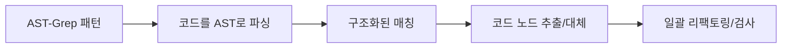

# LSP와 AST-Grep: IDE 수준의 코드 분석 및 조작 기능

## 학습 후 할 수 있는 것

- LSP 도구를 사용하여 코드베이스 내 이동, 기호 찾기, 진단 정보 가져오기
- AST-Grep을 사용하여 정확한 코드 패턴 검색 및 대체
- LSP와 AST-Grep의 차이 및 적용 시나리오 이해
- 에이전트에 IDE 수준의 코드 이해 및 조작 기능 부여

## 현재 겪고 있는 문제

전통적인 코드 검색 및 리팩토링 도구에는 명확한 한계가 있습니다:

| 문제 | 전통 방식 | 실제 요구사항 |
|--- | --- | ---|
| **기호 이동 부정확** | 단순 문자열 매칭 | 코드 의미를 이해하고 실제 정의로 이동 필요 |
| **참조 검색 누락** | 정규표현식 검색 | 파일 간, 범위 간 정확한 참조 추적 필요 |
| **리팩토링 불안전** | 수동 대체 + grep | 코드 구조 이해, 파괴적 수정 방지 필요 |
| **패턴 매칭 부자연스러움** | 정규표현식 | AST 기반 구조화된 패턴 매칭 필요 |

::: info 핵심 개념
**LSP (Language Server Protocol)**는 IDE와 언어 서버 간의 표준 프로토콜로, 통합 인터페이스를 통해 코드 완성, 정의로 이동, 참조 찾기, 기호 이름 변경, 진단 정보 가져오기, 기호 개요 등의 기능을 제공하여 편집기에 강력한 코드 이해 능력을 부여하고 타입 정보, 상속 관계 등 고급 기능을 지원합니다. **AST-Grep**는 추상 구문 트리 기반의 코드 패턴 매칭 도구로, 단순 텍스트가 아닌 코드 구조를 이해하고 메타 변수(예: `$VAR`는 단일 노드, `$$$`는 여러 노드)를 사용하여 유연한 패턴 매칭과 일괄 리팩토링을 지원하며, 25개 프로그래밍 언어(TypeScript, Python, Go, Rust 등 포함)를 다루는 코드 리팩토링, 규칙 검사, 구조화된 검색의 강력한 도구입니다.
:::

## 언제 사용하는가

| 도구 | 적용 시나리오 | 예시 |
|--- | --- | ---|
| **LSP 도구** | IDE 기능이 필요할 때 | 정의로 이동, 모든 참조 찾기, 오류 목록 가져오기, 기호 이름 변경 |
| **AST-Grep** | 코드 패턴 매칭이 필요할 때 | 특정 코드 구조 검색, 일괄 리팩토링, 코드 규칙 검사 |
| **Grep/Glob** | 단순 텍스트 검색 | 함수명 찾기, 파일명 매칭 |

## 🎒 시작 전 준비

LSP 및 AST-Grep 도구를 사용하기 전에 다음을 확인하세요:

1. **Language Server 설치 완료**
   - TypeScript/JavaScript: `npm install -g typescript-language-server`
   - Python: `pip install basedpyright` 또는 `pip install ruff`
   - Go: `go install golang.org/x/tools/gopls@latest`
   - Rust: `rustup component add rust-analyzer`

2. **AST-Grep CLI 설치 완료**
   ```bash
   bun add -D @ast-grep/cli
   ```

3. **LSP 서버 구성 완료**
   - LSP 서버 구성은 OpenCode의 `opencode.json`에 있습니다
   - oh-my-opencode는 이러한 구성을 자동으로 읽어 사용합니다

::: tip 환경 확인
다음 명령으로 환경을 확인하세요:
```bash
# LSP 서버 확인
oh-my-opencode doctor

# AST-Grep 확인
which sg
```
:::

## 핵심 아이디어

### LSP 도구: IDE 수준의 코드 이해

LSP 도구는 AI 에이전트에 IDE와 동일한 코드 이해 능력을 제공합니다:


**핵심 장점**:
- ✅ 의미 이해, 단순 문자열 매칭 아님
- ✅ 파일 간, 범위 간 정확한 추적
- ✅ 타입 정보, 상속 관계 등 고급 기능 지원
- ✅ 프로젝트 구성과 완전히 일치(동일한 LSP 서버 사용)

### AST-Grep: 구조화된 코드 패턴 매칭

AST-Grep은 AI 에이전트가 정확한 코드 구조 매칭을 수행할 수 있게 합니다:



**핵심 장점**:
- ✅ 코드 구조 기반, 텍스트 기반 아님
- ✅ 메타 변수(`$VAR`, `$$$`) 지원 패턴 매칭
- ✅ 여러 언어 지원(25개)
- ✅ 리팩토링, 검사, 코드 규칙 검증에 활용 가능

## 따라해 보세요

### 1단계: LSP를 사용하여 정의로 이동

**이유**
특정 기호의 정의 위치를 확인해야 할 때, LSP의 `goto_definition` 도구는 문자열 검색보다 더 정확한 이동을 제공합니다.

OpenCode에서 에이전트는 자동으로 호출할 수 있습니다:

```typescript
// 에이전트가 자동으로 호출
lsp_goto_definition({
  filePath: "src/utils.ts",
  line: 15,
  character: 10
})
```

**예상 결과**:
```
→ 정의 발견:
  파일: src/types.ts
  라인: 45
  텍스트: export interface UserConfig {
```

::: tip 실제 사용
이러한 도구를 직접 호출할 필요가 없습니다. AI 에이전트가 자동으로 사용하여 코드를 이해합니다. "이 함수의 정의로 이동해" 또는 "이 변수는 어디에 정의되어 있어?"라고 직접 물어볼 수 있습니다.
:::

### 2단계: 모든 참조 찾기

**이유**
특정 기호를 수정해야 할 때, 먼저 모든 참조를 찾으면 수정이 다른 곳의 사용을 망가뜨리지 않도록 보장할 수 있습니다.

에이전트가 호출할 수 있습니다:

```typescript
lsp_find_references({
  filePath: "src/api.ts",
  line: 10,
  character: 5,
  includeDeclaration: true  // 정의 자체 포함 여부
})
```

**예상 결과**:
```
15개 참조 발견 (처음 200개 표시):
  src/api.ts:10:5  - [정의] fetchData
  src/components/List.tsx:23:12 - [사용] fetchData()
  src/pages/Home.tsx:45:8 - [사용] fetchData()
  ...
```

### 3단계: 파일 기호 및 워크스페이스 기호 가져오기

**이유**
파일 구조를 이해하거나 전체 프로젝트에서 특정 기호 유형을 검색할 때 `lsp_symbols` 도구가 매우 유용합니다.

**파일 개요**(scope="document"):

```typescript
lsp_symbols({
  filePath: "src/app.tsx",
  scope: "document"
})
```

**예상 결과**:
```
12개 기호 발견:
  [컴포넌트] App (라인: 10-150)
    [함수] useEffect (라인: 25-35)
    [함수] handleClick (라인: 40-55)
    [변수] count (라인: 15)
  ...
```

**워크스페이스 검색**(scope="workspace"):

```typescript
lsp_symbols({
  filePath: "src/app.tsx",
  scope: "workspace",
  query: "fetchData"
})
```

### 4단계: 진단 정보 가져오기

**이유**
코드를 실행하기 전에 LSP의 진단 도구로 오류, 경고, 힌트를 미리 발견할 수 있습니다.

```typescript
lsp_diagnostics({
  filePath: "src/utils.ts",
  severity: "error"  // 선택: "error", "warning", "information", "hint", "all"
})
```

**예상 결과**:
```
3개 진단 발견:
  [오류] src/utils.ts:23:5 - 'result'가 할당되기 전에 사용됨
  [경고] src/utils.ts:45:12 - 사용되지 않는 변수 'temp'
  [힌트] src/utils.ts:67:8 - 이를 const x = value로 단순화할 수 있음
```

::: tip 사전 검사
AI 에이전트가 코드를 작성하기 전에 `lsp_diagnostics`를 사용하여 잠재적인 문제를 확인하면 반복적인 수정을 피할 수 있습니다.
:::

### 5단계: 안전하게 기호 이름 변경

**이유**
기호 이름 변경은 일반적인 리팩토링 작업이지만 수동 대체는 오류가 발생하기 쉽습니다. LSP의 `lsp_rename` 도구는 전체 워크스페이스에서 기호를 안전하게 이름 변경할 수 있습니다.

**1단계: 이름 변경 확인**

```typescript
lsp_prepare_rename({
  filePath: "src/api.ts",
  line: 10,
  character: 5
})
```

**예상 결과**:
```
이름 변경 검증:
  현재 이름: fetchData
  플레이스홀더 범위: 라인 10, 컬럼 5-14
  상태: ✅ 유효함
```

**2단계: 이름 변경 실행**

```typescript
lsp_rename({
  filePath: "src/api.ts",
  line: 10,
  character: 5,
  newName: "fetchUserData"
})
```

**예상 결과**:
```
15개 파일에 이름 변경 적용:
  src/api.ts:10:5 - fetchData → fetchUserData
  src/components/List.tsx:23:12 - fetchData() → fetchUserData()
  src/pages/Home.tsx:45:8 - fetchData → fetchUserData()
  ...
```

### 6단계: AST-Grep을 사용하여 코드 패턴 검색

**이유**
특정 코드 구조(예: `console.log`를 사용하는 모든 곳)를 찾아야 할 때, AST-Grep은 grep보다 더 정확합니다.

**기본 패턴 검색**:

```typescript
ast_grep_search({
  pattern: "console.log($MSG)",
  lang: "typescript",
  paths: ["src"],
  context: 2  // 매칭 전후의 컨텍스트 라인 수 표시
})
```

**예상 결과**:
```
src/utils.ts:15:
  13 | function debug(message) {
  14 |   console.log(message)
  15 |   console.log("Debug mode")
  16 | }
  17 | }

src/components/App.tsx:23:
  21 | useEffect(() => {
  22 |   console.log("Component mounted")
  23 | }, [])
```

**메타 변수 사용**:

```typescript
// 모든 함수 호출 매칭
ast_grep_search({
  pattern: "$FUNC($$$)",
  lang: "typescript",
  paths: ["src"]
})
```

```typescript
// 모든 비동기 함수 매칭
ast_grep_search({
  pattern: "async function $NAME($$$) { $$$ }",
  lang: "typescript",
  paths: ["src"]
})
```

::: warning 중요: 패턴은 완전한 AST 노드여야 함
❌ 오류: `export async function $NAME`
✅ 정확: `export async function $NAME($$$) { $$$ }`

패턴은 유효한 코드 조각이어야 하며, 완전한 함수 서명과 함수 본문을 포함해야 합니다.
:::

### 7단계: AST-Grep을 사용하여 일괄 대체

**이유**
코드를 일괄 리팩토링해야 할 때(예: 모든 `console.log`를 `logger.info`로 변경), AST-Grep의 대체 기능이 매우 강력합니다.

**대체 미리보기**(dry-run):

```typescript
ast_grep_replace({
  pattern: "console.log($MSG)",
  rewrite: "logger.info($MSG)",
  lang: "typescript",
  paths: ["src"],
  dryRun: true  // 기본값 true, 미리보기만 하고 수정하지 않음
})
```

**예상 결과**:
```
변경 미리보기 (dry-run):
  src/utils.ts:15:2 - console.log("Debug mode")
                  → logger.info("Debug mode")
  src/components/App.tsx:23:4 - console.log("Component mounted")
                               → logger.info("Component mounted")

총: 2개 변경
```

**대체 적용**:

```typescript
ast_grep_replace({
  pattern: "console.log($MSG)",
  rewrite: "logger.info($MSG)",
  lang: "typescript",
  paths: ["src"],
  dryRun: false  // false로 설정하여 변경 적용
})
```

**예상 결과**:
```
2개 변경 적용:
  src/utils.ts:15:2 - console.log("Debug mode")
                  → logger.info("Debug mode")
  src/components/App.tsx:23:4 - console.log("Component mounted")
                               → logger.info("Component mounted")
```

::: danger 파괴적 작업
`ast_grep_replace`의 `dryRun: false`는 파일을 직접 수정합니다. 다음을 권장합니다:
1. 먼저 `dryRun: true`로 미리보기
2. 확인 후 적용
3. 프로젝트가 Git을 사용하는 경우 현재 상태를 먼저 커밋
:::

## 체크포인트 ✅

**LSP 도구 확인**:
- [ ] 기호 정의로 이동할 수 있나요?
- [ ] 모든 참조를 찾을 수 있나요?
- [ ] 진단 정보를 가져올 수 있나요?
- [ ] 안전하게 기호 이름을 변경할 수 있나요?

**AST-Grep 도구 확인**:
- [ ] 코드 패턴을 검색할 수 있나요?
- [ ] 메타 변수 매칭을 사용할 수 있나요?
- [ ] 대체를 미리보기하고 실행할 수 있나요?

## 주의 사항

### LSP 도구 일반적인 문제

| 문제 | 원인 | 해결 방법 |
|--- | --- | ---|
| **정의를 찾을 수 없음** | LSP 서버가 시작되지 않았거나 구성 오류 | `opencode.json`의 LSP 구성 확인 |
| **참조 목록 불완전** | 코드에 오류가 있어 LSP 서버가 완전히 분석하지 못함 | 코드의 오류를 먼저 수정 |
| **이름 변경 실패** | 새 이름이 기존 기호와 충돌 | 더 구체적인 이름 사용 |

### AST-Grep 일반적인 문제

| 문제 | 원인 | 해결 방법 |
|--- | --- | ---|
| **패턴 매칭 안됨** | 패턴 불완전 또는 구문 오류 | 패턴이 완전한 AST 노드인지 확인 |
| **Python 패턴 뒤따르는 콜론** | Python의 `def`와 `class`는 콜론이 필요 없음 | ❌ `def func():` → ✅ `def func($$$):` |
| **과도한 매칭** | 패턴이 너무 광범위함 | 더 구체적인 컨텍스트 사용 또는 경로 제한 |

### 성능 최적화 제안

```typescript
// ✅ 좋음: 검색 범위 제한
ast_grep_search({
  pattern: "$FUNC($$$)",
  lang: "typescript",
  paths: ["src/api"],  // 특정 디렉토리만 검색
  globs: ["*.ts"]      // 특정 파일만 매칭
})

// ❌ 나쁨: 전체 프로젝트 검색
ast_grep_search({
  pattern: "$FUNC($$$)",
  lang: "typescript",
  paths: ["./"]  // 모든 파일 검색
})
```

## LSP 도구 전체 목록

| 도구 | 기능 | 매개변수 |
|--- | --- | ---|
| `lsp_goto_definition` | 기호 정의로 이동 | `filePath`, `line`, `character` |
| `lsp_find_references` | 모든 참조 찾기 | `filePath`, `line`, `character`, `includeDeclaration?` |
| `lsp_symbols` | 파일 개요 또는 워크스페이스 기호 가져오기 | `filePath`, `scope`, `query?`, `limit?` |
| `lsp_diagnostics` | 오류 및 경고 가져오기 | `filePath`, `severity?` |
| `lsp_prepare_rename` | 이름 변경 작업 확인 | `filePath`, `line`, `character` |
| `lsp_rename` | 이름 변경 작업 실행 | `filePath`, `line`, `character`, `newName` |

**제한**:
- 최대 200개 기호, 참조 또는 진단 반환(구성 가능)
- LSP 서버가 구성되어 실행되어야 함

## AST-Grep 도구 전체 목록

| 도구 | 기능 | 매개변수 |
|--- | --- | ---|
| `ast_grep_search` | AST 패턴 검색 | `pattern`, `lang`, `paths?`, `globs?`, `context?` |
| `ast_grep_replace` | AST 패턴 대체 | `pattern`, `rewrite`, `lang`, `paths?`, `globs?`, `dryRun?` |

**지원 언어**(25개):
`bash`, `c`, `cpp`, `csharp`, `css`, `elixir`, `go`, `haskell`, `html`, `java`, `javascript`, `json`, `kotlin`, `lua`, `nix`, `php`, `python`, `ruby`, `rust`, `scala`, `solidity`, `swift`, `typescript`, `tsx`, `yaml`

**메타 변수**:
- `$VAR` - 단일 노드 매칭
- `$$$` - 여러 노드 매칭

## 실전 사례

### 사례 1: API 호출 리팩토링

**시나리오**: 모든 `fetch` 호출에 오류 처리 추가

**AST-Grep을 사용한 패턴 찾기**:

```typescript
ast_grep_search({
  pattern: "fetch($URL).then($RES => $BODY)",
  lang: "typescript",
  paths: ["src/api"]
})
```

**AST-Grep을 사용한 대체**:

```typescript
ast_grep_replace({
  pattern: "fetch($URL).then($RES => $BODY)",
  rewrite: "fetch($URL).then($RES => $BODY).catch(err => handleError(err))",
  lang: "typescript",
  paths: ["src/api"],
  dryRun: true  // 먼저 미리보기
})
```

### 사례 2: 사용되지 않는 가져오기 찾기

**LSP를 사용한 참조 찾기**:

```typescript
// 각 가져오기마다
lsp_find_references({
  filePath: "src/utils.ts",
  line: 1,  // import가 있는 라인
  character: 10
})

// 1개 참조만 반환(가져오기 자체)하면 사용되지 않음
```

### 사례 3: 구성 변수 이름 변경

**1단계: 이름 변경 확인**

```typescript
lsp_prepare_rename({
  filePath: "src/config.ts",
  line: 10,
  character: 4
})
```

**2단계: 이름 변경 실행**

```typescript
lsp_rename({
  filePath: "src/config.ts",
  line: 10,
  character: 4,
  newName: "API_BASE_URL"
})
```

## 이 과정 요약

이 과정에서는 oh-my-opencode의 LSP 도구와 AST-Grep 도구를 소개했습니다:

**LSP 도구**:
- IDE 수준의 코드 이해 및 조작 기능 제공
- 정의로 이동, 참조 찾기, 진단 가져오기, 기호 이름 변경 지원
- 프로젝트 구성된 LSP 서버 사용, IDE 동작과 일치

**AST-Grep 도구**:
- AST 기반 구조화된 코드 패턴 매칭
- 메타 변수를 사용한 유연한 매칭 지원
- 일괄 대체 및 리팩토링 지원

**모범 사례**:
- 의미 이해가 필요한 시나리오에 LSP 사용
- 구조화된 코드 리팩토링에 AST-Grep 사용
- 대체 전에 dryRun으로 미리보기

## 다음 과정 예고

> 다음 과정에서는 **[Categories와 Skills: 동적 에이전트 조합](../categories-skills/)**을 학습합니다.
>
> 학습할 내용:
> - Categories를 사용하여 최적 모델 자동 선택 방법
> - 다른 Skills를 조합하여 전문 에이전트 생성 방법
> - v3.0 새로운 기능의 실제 적용 시나리오

---

## 부록: 소스 코드 참조

<details>
<summary><strong>클릭하여 소스 코드 위치 펼치기</strong></summary>

> 업데이트: 2026-01-26

### LSP 도구

| 기능 | 파일 경로 | 라인 |
|--- | --- | ---|
| LSP 도구 정의 | [`src/tools/lsp/tools.ts`](https://github.com/code-yeongyu/oh-my-opencode/blob/main/src/tools/lsp/tools.ts) | 29-261 |
| LSP 클라이언트 구현 | [`src/tools/lsp/client.ts`](https://github.com/code-yeongyu/oh-my-opencode/blob/main/src/tools/lsp/client.ts) | 1-596 |
| LSP 상수 정의 | [`src/tools/lsp/constants.ts`](https://github.com/code-yeongyu/oh-my-opencode/blob/main/src/tools/lsp/constants.ts) | 1-391 |
| LSP 타입 정의 | [`src/tools/lsp/types.ts`](https://github.com/code-yeongyu/oh-my-opencode/blob/main/src/tools/lsp/types.ts) | 1-246 |

### AST-Grep 도구

| 기능 | 파일 경로 | 라인 |
|--- | --- | ---|
|--- | --- | ---|
|--- | --- | ---|
|--- | --- | ---|
|--- | --- | ---|

**핵심 상수**:
- `DEFAULT_MAX_REFERENCES = 200` - 최대 반환 참조 수
- `DEFAULT_MAX_SYMBOLS = 200` - 최대 반환 기호 수
- `DEFAULT_MAX_DIAGNOSTICS = 200` - 최대 반환 진단 수
- `CLI_LANGUAGES` - 25개 지원 언어 목록
- `DEFAULT_MAX_MATCHES = 500` - AST-Grep 최대 매칭 수

**핵심 도구 함수**:
- `withLspClient()` - LSP 클라이언트 가져오기 및 작업 실행
- `runSg()` - AST-Grep CLI 명령 실행
- `formatLocation()` - 위치 정보 포맷팅
- `formatDiagnostic()` - 진단 정보 포맷팅

**지원 LSP 서버**(일부):
- TypeScript: `typescript-language-server`
- Python: `basedpyright`, `pyright`, `ty`, `ruff`
- Go: `gopls`
- Rust: `rust-analyzer`
- C/C++: `clangd`

</details>
