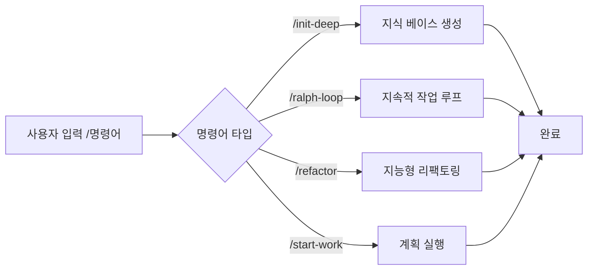

# 슬래시 명령어: 사전 설정 워크플로우, 원클릭 복잡한 작업 실행

## 학습 후 할 수 있는 것

- `/init-deep`을 사용하여 원클릭으로 프로젝트 지식 베이스 생성
- `/ralph-loop`로 에이전트가 작업 완료까지 지속적으로 작업하도록 설정
- `/refactor`를 통해 지능형 리팩토링 실행, 각 단계 자동 검증
- `/start-work`로 Prometheus 계획에서 체계적인 개발 시작

## 현재의 어려움

동일한 복잡한 작업을 반복 실행할 때마다 긴 명령어를 입력해야 합니다:

```
"이 프로젝트의 구조를 분석하고, 모든 핵심 모듈을 찾아내고, 각 디렉토리에 AGENTS.md를 생성한 다음, 코드베이스 패턴을 병렬로 탐색해주세요..."
```

이러한 긴 명령어는 시간을 낭비할 뿐만 아니라 단계를 누락하기 쉽습니다.

## 언제 이 방법을 사용할까

**슬래시 명령어**는 원클릭으로 실행되는 사전 설정 워크플로우 템플릿입니다. 이러한 명령어는 일반적인 개발 시나리오를 다룹니다:

| 시나리오 | 사용 명령어 |
| --- | --- |
| 프로젝트 지식 베이스 초기화 | `/init-deep` |
| AI가 지속적으로 작업하도록 설정 | `/ralph-loop` |
| 지능형 코드 리팩토링 | `/refactor` |
| 계획에서 작업 시작 | `/start-work` |

## 핵심 개념

**슬래시 명령어**(Slash Commands)는 사전 정의된 워크플로우 템플릿으로, `/`로 시작하는 트리거 단어를 통해 복잡한 작업을 빠르게 실행합니다.

**작동 원리**:



oh-my-opencode는 6가지 슬래시 명령어를 내장하고 있습니다:

| 명령어 | 기능 | 복잡도 |
| --- | --- | --- |
| `/init-deep` | 계층적 AGENTS.md 파일 생성 | 중 |
| `/ralph-loop` | 자기 참조 개발 루프 | 높음 |
| `/ulw-loop` | Ultrawork 버전의 ralph-loop | 높음 |
| `/cancel-ralph` | 활성 Ralph Loop 취소 | 낮음 |
| `/refactor` | 지능형 리팩토링, 완전한 도구 체인 | 높음 |
| `/start-work` | Prometheus 계획에서 작업 시작 | 중 |

::: info 사용자 정의 명령어
내장 명령어 외에도 `.opencode/command/` 또는 `.claude/commands/` 디렉토리에 사용자 정의 명령어(Markdown 파일)를 생성할 수 있습니다.
:::

## 🎒 시작 전 준비

- ✅ oh-my-opencode 설치 완료
- ✅ 최소 하나의 AI Provider 설정 완료
- ✅ 기본 에이전트 사용법 이해 (「Sisyphus 소개: 메인 오케스트레이터」 학습 권장)

## 따라하기

### 1단계: 프로젝트 지식 베이스 생성

**이유**
AI 에이전트는 효율적으로 작업하기 위해 프로젝트 구조와 규칙을 이해해야 합니다. `/init-deep` 명령어는 프로젝트를 자동으로 분석하고 계층적 AGENTS.md 파일을 생성합니다.

**OpenCode에 입력**:

```
/init-deep
```

**보게 될 것**: 에이전트가 프로젝트 구조를 병렬로 분석하고, 코드 패턴을 탐색하며, AGENTS.md 파일을 생성하기 시작합니다.

**고급 사용법**:

```bash
# 모든 파일 재생성 (기존 파일 삭제)
/init-deep --create-new

# 생성 깊이 제한
/init-deep --max-depth=2
```

**출력 예시**:

```
=== init-deep Complete ===

Mode: update

Files:
  [OK] ./AGENTS.md (root, 120 lines)
  [OK] ./src/hooks/AGENTS.md (45 lines)
  [OK] ./src/agents/AGENTS.md (38 lines)

Dirs Analyzed: 12
AGENTS.md Created: 3
```

### 2단계: AI가 지속적으로 작업하도록 설정

**이유**
일부 작업은 완료하기 위해 여러 번의 반복이 필요합니다(예: 복잡한 버그 수정). `/ralph-loop` 명령어는 에이전트가 중간에 멈추지 않고 작업이 완료될 때까지 지속적으로 작업하도록 합니다.

**OpenCode에 입력**:

```
/ralph-loop "로그인 페이지의 인증 문제를 수정하고, 모든 오류 상황이 처리되도록 보장"
```

**보게 될 것**: 에이전트가 작업을 시작하고, 완료 후 자동으로 계속하며, 완료 마커를 출력할 때까지 진행합니다.

**고급 사용법**:

```bash
# 사용자 정의 완료 마커
/ralph-loop "단위 테스트 작성" --completion-promise="TESTS_DONE"

# 최대 반복 횟수 제한
/ralph-loop "성능 최적화" --max-iterations=50
```

**Ultrawork 버전**(모든 전문 에이전트 활성화):

```bash
/ulw-loop "인증, 권한 부여, 속도 제한 기능을 포함한 REST API 개발"
```

**체크포인트** ✅

- 에이전트가 각 반복 후 자동으로 계속하나요?
- 완료 후 "Ralph Loop Complete!" 메시지가 표시되나요?

### 3단계: 루프 취소

**이유**
작업 방향이 잘못되었거나 수동으로 개입하고 싶을 때 루프를 취소해야 합니다.

**OpenCode에 입력**:

```
/cancel-ralph
```

**보게 될 것**: 루프가 중지되고 상태 파일이 정리됩니다.

### 4단계: 지능형 리팩토링

**이유**
코드를 리팩토링할 때 무분별한 수정은 버그를 유발할 수 있습니다. `/refactor` 명령어는 완전한 도구 체인(LSP, AST-Grep, 테스트 검증)을 사용하여 안전한 리팩토링을 보장합니다.

**OpenCode에 입력**:

```bash
# 심볼 이름 변경
/refactor "AuthService 클래스를 UserService로 리팩토링"

# 모듈 리팩토링
/refactor src/auth --scope=module --strategy=safe

# 패턴 매칭 리팩토링
/refactor "deprecated API를 사용하는 모든 곳을 새 API로 마이그레이션"
```

**보게 될 것**: 에이전트가 6단계 리팩토링 프로세스를 실행합니다:

1. **의도 게이트웨이** - 리팩토링 목표 확인
2. **코드베이스 분석** - 종속성 관계 병렬 탐색
3. **Codemap 구축** - 영향 범위 매핑
4. **테스트 평가** - 테스트 커버리지 확인
5. **계획 생성** - 상세한 리팩토링 계획 생성
6. **리팩토링 실행** - 단계별 실행 및 검증

**고급 사용법**:

```bash
# 공격적 전략 (더 큰 변경 허용)
/refactor "아키텍처 리팩토링" --strategy=aggressive

# 파일 범위
/refactor "utils.ts의 함수 최적화" --scope=file
```

::: warning 테스트 커버리지 요구사항
대상 코드의 테스트 커버리지가 50% 미만인 경우 `/refactor`는 공격적 전략 실행을 거부합니다. 먼저 테스트를 추가하는 것이 좋습니다.
:::

### 5단계: 계획에서 작업 시작

**이유**
Prometheus로 계획을 수립한 후 계획의 작업을 체계적으로 실행해야 합니다. `/start-work` 명령어는 자동으로 계획을 로드하고 Atlas 에이전트를 사용하여 실행합니다.

**OpenCode에 입력**:

```bash
# 단일 계획 자동 선택
/start-work

# 특정 계획 선택
/start-work "auth-api-plan"
```

**보게 될 것**:

- 계획이 하나만 있는 경우: 자동으로 선택하고 실행 시작
- 여러 계획이 있는 경우: 모든 계획을 나열하여 선택 가능

**출력 예시**:

```
Available Work Plans

Current Time: 2026-01-26T10:30:00Z
Session ID: abc123

1. [auth-api-plan.md] - Modified: 2026-01-25 - Progress: 3/10 tasks
2. [migration-plan.md] - Modified: 2026-01-26 - Progress: 0/5 tasks

Which plan would you like to work on? (Enter number or plan name)
```

**체크포인트** ✅

- 계획이 올바르게 로드되었나요?
- 작업이 순서대로 실행되나요?
- 완료된 작업이 표시되나요?

## 주의사항

### 1. `/init-deep`이 기존 파일을 무시함

**문제**: 기본 모드에서 `/init-deep`은 기존 AGENTS.md를 유지하고 누락된 부분만 업데이트하거나 생성합니다.

**해결**: `--create-new` 매개변수를 사용하여 모든 파일을 재생성합니다.

### 2. `/ralph-loop` 무한 루프

**문제**: 에이전트가 작업을 완료할 수 없으면 루프가 최대 반복 횟수(기본값 100)까지 계속됩니다.

**해결**:
- 합리적인 `--max-iterations` 설정 (예: 20-30)
- `/cancel-ralph`를 사용하여 수동으로 취소
- 더 명확한 작업 설명 제공

### 3. `/refactor` 테스트 커버리지 낮음

**문제**: 대상 코드에 테스트가 없으면 리팩토링이 실패합니다.

**해결**:
```bash
# 에이전트가 먼저 테스트를 추가하도록 요청
"AuthService에 대한 완전한 단위 테스트를 추가하고, 모든 경계 조건을 커버하세요"

# 그런 다음 리팩토링
/refactor "AuthService 클래스 리팩토링"
```

### 4. `/start-work`가 계획을 찾을 수 없음

**문제**: Prometheus가 생성한 계획이 `.sisyphus/plans/` 디렉토리에 저장되지 않았습니다.

**해결**:
- Prometheus 출력에 계획 파일 경로가 포함되어 있는지 확인
- 계획 파일 확장자가 `.md`인지 확인

### 5. 명령어 매개변수 형식 오류

**문제**: 매개변수 위치 또는 형식이 올바르지 않습니다.

**해결**:
```bash
# ✅ 올바름
/ralph-loop "작업 설명" --completion-promise=DONE

# ❌ 잘못됨
/ralph-loop --completion-promise=DONE "작업 설명"
```

## 본 강의 요약

| 명령어 | 핵심 기능 | 사용 빈도 |
| --- | --- | --- |
| `/init-deep` | 프로젝트 지식 베이스 자동 생성 | 초기 설정 |
| `/ralph-loop` | 지속적 작업 루프 | 높음 |
| `/ulw-loop` | Ultrawork 버전 루프 | 중간 |
| `/cancel-ralph` | 루프 취소 | 낮음 |
| `/refactor` | 안전한 지능형 리팩토링 | 높음 |
| `/start-work` | Prometheus 계획 실행 | 중간 |

**모범 사례**:
- 새 프로젝트에서 처음 `/init-deep`을 사용하여 지식 베이스 구축
- 복잡한 작업에 `/ralph-loop`을 사용하여 AI가 지속적으로 작업하도록 설정
- 코드 리팩토링 시 `/refactor`를 우선 사용하여 안전성 보장
- Prometheus와 함께 `/start-work`를 사용하여 체계적인 개발

## 다음 강의 예고

다음 강의에서는 **[고급 설정 심층 커스터마이징](../advanced-configuration/)**을 학습합니다.

배울 내용:
- 에이전트의 기본 모델과 프롬프트를 재정의하는 방법
- 권한 및 보안 제한을 설정하는 방법
- Categories와 Skills를 사용자 정의하는 방법
- 백그라운드 작업 동시성 제어를 조정하는 방법

---

## 부록: 소스 코드 참조

<details>
<summary><strong>소스 코드 위치 보기</strong></summary>

> 업데이트 시간: 2026-01-26

| 기능 | 파일 경로 | 라인 번호 |
| --- | --- | --- |
| 명령어 정의 | [`src/features/builtin-commands/commands.ts`](https://github.com/code-yeongyu/oh-my-opencode/blob/main/src/features/builtin-commands/commands.ts) | 8-73 |
| 명령어 로더 | [`src/features/builtin-commands/index.ts`](https://github.com/code-yeongyu/oh-my-opencode/blob/main/src/features/builtin-commands/index.ts) | 75-89 |
| init-deep 템플릿 | [`src/features/builtin-commands/templates/init-deep.ts`](https://github.com/code-yeongyu/oh-my-opencode/blob/main/src/features/builtin-commands/templates/init-deep.ts) | 전체 |
| ralph-loop 템플릿 | [`src/features/builtin-commands/templates/ralph-loop.ts`](https://github.com/code-yeongyu/oh-my-opencode/blob/main/src/features/builtin-commands/templates/ralph-loop.ts) | 전체 |
| refactor 템플릿 | [`src/features/builtin-commands/templates/refactor.ts`](https://github.com/code-yeongyu/oh-my-opencode/blob/main/src/features/builtin-commands/templates/refactor.ts) | 전체 |
| start-work 템플릿 | [`src/features/builtin-commands/templates/start-work.ts`](https://github.com/code-yeongyu/oh-my-opencode/blob/main/src/features/builtin-commands/templates/start-work.ts) | 전체 |
| Ralph Loop Hook 구현 | [`src/hooks/ralph-loop/index.ts`](https://github.com/code-yeongyu/oh-my-opencode/blob/main/src/hooks/ralph-loop/index.ts) | 전체 |
| 명령어 타입 정의 | [`src/features/builtin-commands/types.ts`](https://github.com/code-yeongyu/oh-my-opencode/blob/main/src/features/builtin-commands/types.ts) | 전체 |

**핵심 함수**:
- `loadBuiltinCommands()`: 내장 명령어 정의 로드, 특정 명령어 비활성화 지원
- `createRalphLoopHook()`: Ralph Loop 라이프사이클 훅 생성
- `startLoop()`: 루프 시작, 상태 및 매개변수 설정
- `cancelLoop()`: 활성 루프 취소, 상태 파일 정리

**핵심 상수**:
- `DEFAULT_MAX_ITERATIONS = 100`: 기본 최대 반복 횟수
- `DEFAULT_COMPLETION_PROMISE = "DONE"`: 기본 완료 마커

**설정 위치**:
- 명령어 비활성화: `oh-my-opencode.json`의 `disabled_commands` 필드
- 루프 설정: `oh-my-opencode.json`의 `ralph_loop` 객체

</details>
