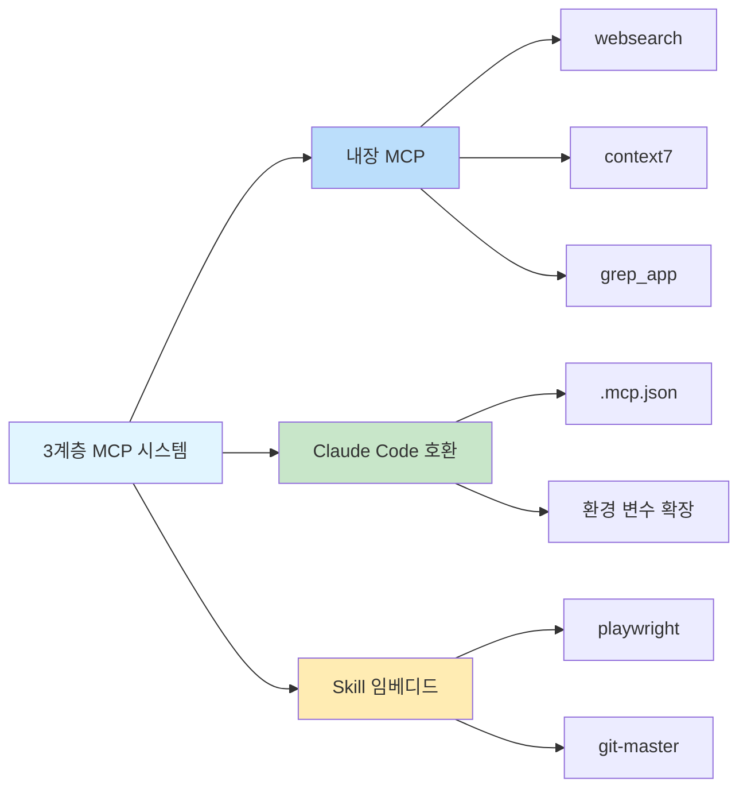

# 내장 MCP 서버: 웹 검색, 문서 조회, 코드 검색

## 학습 내용

- ✅ 3개의 내장 MCP 서버와 사용 사례 이해
- ✅ Exa Websearch API 키 설정 방법
- ✅ 불필요한 MCP 서비스 비활성화 방법
- ✅ 3계층 MCP 시스템의 아키텍처와 작동 원리 이해

## 현재 과제

AI 에이전트는 로컬 파일과 네트워크 요청만 가능하며, 전문 검색과 문서 조회 능력이 부족합니다. 에이전트가 다음 작업을 수행할 수 있기를 원합니다:
- 최신 정보를 위한 실시간 웹 검색
- 정확한 API 설명을 위한 공식 문서 조회
- 구현 예제를 위한 GitHub 저장소 검색

하지만 이러한 기능을 직접 구현하면 개발 복잡도가 증가합니다.

## 사용 시기

AI 에이전트 기능을 확장해야 할 때 사용합니다:

| 시나리오 | 권장 MCP |
|----------|----------------|
| 최신 기술 정보, 뉴스, 산업 동향 필요 | **websearch** (Exa) |
| 라이브러리나 프레임워크의 공식 API 문서 조회 | **context7** |
| GitHub 저장소에서 구현 예제 찾기 | **grep_app** (Grep.app) |

## 핵심 개념: MCP란 무엇인가요?

**MCP (Model Context Protocol)**은 AI 에이전트가 외부 도구와 데이터 소스에에 접근할 수 있게 하는 표준 프로토콜입니다. 간단히 말해:

::: info MCP란 무엇인가요?
MCP는 AI 에이전트에게 다양한 전문 도구(검색, 데이터베이스, API 등)가 담긴 "도구 상자"를 장착하는 것과 같습니다. 에이전트는 필요에 따라 이 도구를 호출하여 로컬에서 사용할 수 없는 기능에 접근할 수 있습니다.
:::

Oh-My-OpenCode는 **3계층 MCP 시스템**을 제공합니다:



**이 단원에서는 첫 번째 계층인 내장 MCP 서버에 집중합니다.**

---

## 3개의 내장 MCP 서버

Oh-My-OpenCode는 3개의 원격 MCP 서버를 포함하며, 즉시 사용 가능합니다(일부는 API 키 설정이 필요함).

### 1. websearch (Exa AI)

**기능**: [Exa AI](https://exa.ai) 기반 실시간 웹 검색

**사용 사례**:
- 최신 기술 문서와 뉴스 검색
- 특정 문제에 대한 해결책 찾기
- 산업 동향과 모범 사례 파악

**설정 요구사항**:

`EXA_API_KEY` 환경 변수를 설정해야 합니다:

::: code-group

```bash [macOS/Linux]
export EXA_API_KEY="your-api-key-here"
```

```powershell [Windows]
setx EXA_API_KEY "your-api-key-here"
```

:::

::: tip Exa API 키 얻기
1. [Exa AI](https://exa.ai) 방문
2. 계정 가입
3. 대시보드에서 API 키 생성
4. 환경 변수에 키 추가
:::

**소스 위치**: `src/mcp/websearch.ts` (1-11줄)

---

### 2. context7

**기능**: 공식 문서 조회, 모든 프로그래밍 라이브러리 또는 프레임워크 지원

**사용 사례**:
- React, Vue, Next.js 등의 API 문서 조회
- Node.js, Python 같은 런타임의 공식 문서 확인
- 오픈 소스 프로젝트 사용 가이드 참조

**설정 요구사항**: 설정 불필요, 즉시 사용 가능

**소스 위치**: `src/mcp/context7.ts` (1-7줄)

---

### 3. grep_app (Grep.app)

**기능**: 구현 예제를 찾기 위한 초고속 GitHub 코드 검색

**사용 사례**:
- 오픈 소스 프로젝트에서 특정 패턴 구현 찾기
- 다른 개발자들의 코딩 방식 학습
- 특정 문제 해결을 위한 코드 조각 검색

**설정 요구사항**: 설정 불필요, 즉시 사용 가능

**소스 위치**: `src/mcp/grep-app.ts` (1-7줄)

---

## MCP 설정 및 비활성화

### 기본 동작

모든 내장 MCP 서버는 **기본적으로 활성화**되어 있습니다. Oh-My-OpenCode는 시작 시 이러한 서비스를 자동으로 등록합니다.

### 불필요한 MCP 비활성화

특정 MCP 서비스가 필요하지 않은 경우, 설정 파일에서 비활성화할 수 있습니다:

```jsonc
// ~/.config/opencode/oh-my-opencode.json 또는 .opencode/oh-my-opencode.json
{
  "$schema": "./assets/oh-my-opencode.schema.json",

  // 불필요한 MCP 서버 비활성화
  "disabled_mcps": [
    "websearch",    // 웹 검색 비활성화 (Exa API 키가 없는 경우)
    "grep_app"      // GitHub 코드 검색 비활성화
  ]
}
```

::: warning MCP 비활성화 이유
불필요한 MCP 비활성화의 장점:
1. **리소스 절약**: 불필요한 연결과 요청 감소
2. **설정 단순화**: 설정되지 않은 API 키에 대한 프롬프트 방지
3. **안정성 향상**: 잠재적 네트워크 실패 지점 감소
:::

### 설정 우선순위

내장 MCP의 비활성화 설정 우선순위:

| 설정 위치 | 우선순위 |
|------------------------|----------|
| 사용자 설정 `~/.config/opencode/oh-my-opencode.json` | 높음 (프로젝트 설정 우선) |
| 프로젝트 설정 `.opencode/oh-my-opencode.json` | 중간 |
| 코드 기본값 | 낮음 (모두 활성화) |

---

## 작동 원리: 원격 MCP 설정

모든 내장 MCP 서버는 **원격(remote) 모드**를 사용하며, HTTP/SSE 프로토콜을 통해 외부 서비스에 연결합니다.

**설정 모드** (소스 코드 정의):

```typescript
// src/mcp/websearch.ts
export const websearch = {
  type: "remote" as const,        // "remote"로 고정
  url: "https://mcp.exa.ai/mcp?tools=web_search_exa",  // MCP 서버 주소
  enabled: true,                   // 활성화 상태 (disabled_mcps로 우선 적용)
  headers: process.env.EXA_API_KEY  // 선택적 요청 헤더 (API 키)
    ? { "x-api-key": process.env.EXA_API_KEY }
    : undefined,
  oauth: false as const,            // OAuth 자동 감지 비활성화
}
```

**설정 필드 설명**:

| 필드 | 타입 | 설명 |
|-------|------|-------------|
| `type` | `"remote"` | 고정값, 원격 MCP를 나타냄 |
| `url` | `string` | MCP 서버의 HTTP 주소 |
| `enabled` | `boolean` | 활성화 여부 (코드에서 `true`로 고정, `disabled_mcps`로 제어) |
| `headers` | `object` | 선택적 HTTP 요청 헤더 (인증용) |
| `oauth` | `false` | OAuth 자동 감지 비활성화 (Exa는 API 키 사용) |

---

## 일반적인 실수

### 실수 1: websearch에 API 키 필요

**증상**: 에이전트가 websearch 사용 시도 시 실패하고, 누락된 API 키를 요구합니다.

**해결책**:

```bash
# 환경 변수 설정 여부 확인
echo $EXA_API_KEY

# 비어있는 경우, API 키 설정
export EXA_API_KEY="your-actual-api-key"

# 또는 셸 설정(~/.bashrc, ~/.zshrc 등)에 영구 추가
echo 'export EXA_API_KEY="your-actual-api-key"' >> ~/.zshrc
```

::: tip API 키 확인
설정 후, OpenCode를 재시작하거나 진단 명령을 실행하여 확인:
```bash
oh-my-opencode doctor --verbose
```
:::

### 실수 2: 비활성화 후에도 MCP 프롬프트

**증상**: MCP를 비활성화해도 에이전트가 여전히 사용을 시도합니다.

**해결책**:

1. 설정 파일 경로가 올바른지 확인:
   - 사용자 설정: `~/.config/opencode/oh-my-opencode.json`
   - 프로젝트 설정: `.opencode/oh-my-opencode.json`

2. JSON 형식이 올바른지 확인 (쉼표와 따옴표 주의):

```jsonc
{
  "disabled_mcps": ["websearch"]  // ✅ 올바름
  // "disabled_mcps": ["websearch"],  // ❌ 오류: 후행 쉼표 허용 안 됨
}
```

3. 설정 적용을 위해 OpenCode 재시작.

### 실수 3: Grep.app 결과 부정확

**증상**: grep_app가 기대와 다른 결과를 반환합니다.

**가능한 원인**:
- 검색 키워드가 너무 일반적
- 대상 저장소 비활성 또는 삭제됨
- 잘못된 검색 문법

**해결책**:
- 더 구체적인 검색어 사용
- 검색 시 파일 유형 또는 언어 지정
- [Grep.app](https://grep.app) 직접 방문하여 수동 확인

---

## 요약

이 단원에서는 Oh-My-OpenCode의 3개 내장 MCP 서버를 소개했습니다:

| MCP | 기능 | 설정 요구사항 | 주요 용도 |
|-----|----------|---------------------------|----------|
| **websearch** | 실시간 웹 검색 | EXA_API_KEY | 최신 정보 확보 |
| **context7** | 공식 문서 조회 | 없음 | API 문서 참조 |
| **grep_app** | GitHub 코드 검색 | 없음 | 구현 예제 찾기 |

**핵심 사항**:

1. **3계층 MCP 시스템**: 내장 → Claude Code 호환 → Skill 임베디드
2. **기본 활성화**: 모든 내장 MCP는 기본적으로 활성화되며 `disabled_mcps`로 비활성화 가능
3. **원격 모드**: 모든 내장 MCP는 HTTP/SSE 프로토콜을 사용하여 외부 서비스에 연결
4. **Exa에 키 필요**: websearch는 `EXA_API_KEY` 환경 변수 필요

이러한 MCP 서버는 AI 에이전트 기능을 크게 확장하여, 실시간 정보와 전문 지식 베이스에 접근할 수 있게 합니다.

---

## 부록: 소스 코드 참조

<details>
<summary><strong>소스 코드 위치 펼치기</strong></summary>

> 업데이트: 2026-01-26

| 기능 | 파일 경로 | 줄 번호 |
|----------|-----------|--------------|
| MCP 팩토리 함수 | [`src/mcp/index.ts`](https://github.com/code-yeongyu/oh-my-opencode/blob/main/src/mcp/index.ts) | 22-32 |
| websearch 설정 | [`src/mcp/websearch.ts`](https://github.com/code-yeongyu/oh-my-opencode/blob/main/src/mcp/websearch.ts) | 1-11 |
| context7 설정 | [`src/mcp/context7.ts`](https://github.com/code-yeongyu/oh-my-opencode/blob/main/src/mcp/context7.ts) | 1-7 |
| grep_app 설정 | [`src/mcp/grep-app.ts`](https://github.com/code-yeongyu/oh-my-opencode/blob/main/src/mcp/grep-app.ts) | 1-7 |
| McpNameSchema | [`src/mcp/types.ts`](https://github.com/code-yeongyu/oh-my-opencode/blob/main/src/mcp/types.ts) | 1-10 |
| disabled_mcps 필드 | [`src/config/schema.ts`](https://github.com/code-yeongyu/oh-my-opencode/blob/main/src/config/schema.ts) | 331 |

**핵심 상수**:
- `allBuiltinMcps`: 내장 MCP 설정 객체, websearch, context7, grep_app 포함 (`src/mcp/index.ts:16-20`)

**핵심 함수**:
- `createBuiltinMcps(disabledMcps)`: 활성화된 MCP 목록 생성, 비활성화된 MCP 필터링 (`src/mcp/index.ts:22-32`)

</details>
