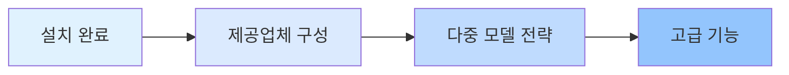

# 플랫폼 및 통합

이 장에서는 여러 AI 제공업체(Anthropic, OpenAI, Google, GitHub Copilot 등)를 구성하고 관리하는 방법과 oh-my-opencode의 다중 모델 자동 장애 조치(fallback) 메커니즘을 소개합니다.

이 장을 완료하면 작업 유형과 사용 가능한 모델에 따라 시스템이 가장 적합한 AI 모델을 지능적으로 선택하도록 하는 방법을 마스터하고, 효율적이고 신뢰할 수 있는 다중 모델 오케스트레이션 워크플로우를 구축할 수 있습니다.

## 이 장에서 다루는 내용

이 장은 두 부분으로 나뉩니다.

### 1. [제공업체 구성](provider-setup/)

다양한 AI 제공업체를 구성하는 방법을 배웁니다.
- Anthropic Claude (주요 오케스트레이터의 1순위 선택)
- OpenAI ChatGPT (아키텍처 리뷰 전용)
- Google Gemini (프론트엔드 및 미디어 분석)
- GitHub Copilot (백업 제공업체)
- Z.ai 코딩 계획 및 OpenCode Zen (선택적 서비스)

**학습 내용**:
- ✅ 6개 주요 AI 제공업체 구성
- ✅ 빠른 설정을 위한 대화형 설치 프로그램 사용
- ✅ 다양한 에이전트에 가장 적합한 모델 지정
- ✅ 구성 문제 진단을 위한 `doctor` 명령어 사용

**예상 소요 시간**: 25-30분

### 2. [다중 모델 전략](model-resolution/)

모델 해결 시스템의 3단계 우선순위 메커니즘을 심층적으로 다룹니다.
- 사용자 재정의 (정밀 제어)
- 제공업체 장애 조치 (자동 장애 허용)
- 시스템 기본값 (대체 솔루션)

**학습 내용**:
- ✅ 모델 해결의 전체 워크플로우 이해
- ✅ 작업 요구사항에 따라 모델 수동 지정
- ✅ 제공업체 장애 조치를 활용한 시스템 견고성 향상
- ✅ 모델 해결 문제 진단 및 해결

**예상 소요 시간**: 30-35분

## 권장 학습 경로

이 장을 학습할 때 다음 순서를 따르는 것을 권장합니다.

**이 순서의 이유는?**

1. **먼저 구성, 나중에 이해**: 각 제공업체를 구성하는 방법을 먼저 배운 다음, 기본 해결 메커니즘을 이해하세요
2. **단순에서 복잡으로**: 제공업체 구성은 기본 작업이고, 다중 모델 전략은 고급 개념입니다
3. **실습으로 이론 검증**: 제공업체를 구성한 후 `doctor` 명령어를 사용하여 다중 모델 전략의 효과를 검증할 수 있습니다

::: tip 빠른 시작 경로
빠르게 시작하고 싶다면 [제공업체 구성](provider-setup/)의 1-4단계(기본 제공업체 구성)만 완료하고, 나중에 필요에 따라 다른 내용을 학습할 수 있습니다.
:::

## 사전 요구사항

이 장을 학습하기 전에 다음을 확인하세요.

- ✅ [설치 및 초기 구성](../installation/) 완료
- ✅ OpenCode 설치 (버전 >= 1.0.150)
- ✅ 기본 JSON/JSONC 구성 파일 형식 이해
- ✅ 최소 하나의 AI 제공업체 계정 구독 (Anthropic Claude 권장)

::: warning 제공업체 계정이 없다면?
실제로 제공업체에 연결하지 않고 구성 단계를 먼저 학습할 수 있습니다. 시스템은 OpenCode의 기본 모델을 대체 솔루션으로 사용합니다.
:::

## 자주 묻는 질문

<strong>모든 제공업체를 구성해야 하나요?</strong>

아니요. 가장 많이 사용하는 제공업체만 구성할 수 있습니다(예: Anthropic Claude만). oh-my-opencode의 제공업체 장애 조치 메커니즘이 사용 가능한 제공업체를 자동으로 사용합니다.

하지만 다중 모델 오케스트레이션의 장점을 완전히 활용하려면 최소 2-3개 제공업체를 구성하는 것을 권장합니다. 그러면 시스템이 작업 유형에 따라 가장 적합한 모델을 자동으로 선택할 수 있습니다.

<strong>제공업체 구성과 모델 해결의 차이는 무엇인가요?</strong>

- **제공업체 구성**: "설치 단계"로, 시스템에 사용 가능한 AI 서비스를 알려주는 것
- **모델 해결**: "결정 로직"으로, 시스템이 각 에이전트에 어떤 제공업체를 사용할지 선택하는 방법

비유: 제공업체 구성은 "팀원 채용", 모델 해결은 "작업 배정"입니다.

<strong>구성을 언제든 수정할 수 있나요?</strong>

언제든 구성 파일을 수정할 수 있습니다.
- 사용자 구성: `~/.config/opencode/oh-my-opencode.json`
- 프로젝트 구성: `.opencode/oh-my-opencode.json`

변경 사항은 다음에 에이전트를 사용할 때 자동으로 적용됩니다. 제공업체 인증을 수정한 경우 `opencode auth login`을 실행하여 재인증해야 합니다.

## 다음 단계

이 장을 완료한 후 다음을 수행할 수 있습니다.

### 권장 경로: AI 에이전트 팀 학습

[AI 에이전트 팀: 10명 전문가 개요](../../advanced/ai-agents-overview/)를 계속 학습하여 전문화된 작업에 다양한 에이전트를 사용하는 방법을 이해하세요.

### 고급 경로: 심층 사용자 정의

기본 구성에 이미 익숙하다면 [구성 심층 분석: 에이전트 및 권한 관리](../../advanced/advanced-configuration/)로 건너뛰어 다음을 학습할 수 있습니다.
- 에이전트 프롬프트 사용자 정의 방법
- 에이전트 권한 및 액세스 범위 설정 방법
- 사용자 정의 에이전트 및 카테고리 생성 방법

### 실용 경로: 프로메테우스 계획 사용

[프로메테우스 계획: 인터뷰 스타일 요구사항 수집](../../advanced/prometheus-planning/)을 사용하여 실제 에이전트 협업을 통해 다중 모델 오케스트레이션의 힘을 경험하세요.

---

**시작하기**: [제공업체 구성](provider-setup/)으로 다중 모델 오케스트레이션 여정을 시작하세요!
