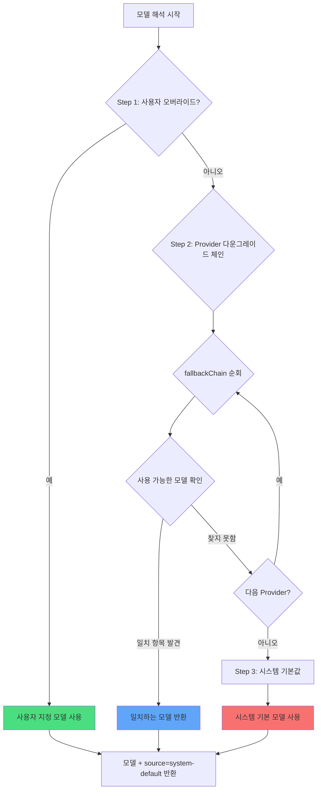

# 다중 모델 전략: 자동 다운그레이드와 우선순위

## 학습 완료 후 할 수 있는 것

- oh-my-opencode이 각 에이전트에 대해 가장 적합한 AI 모델을 자동으로 선택하는 방법 이해
- 3단계 모델 해석 메커니즘(사용자 오버라이드 → Provider 다운그레이드 → 시스템 기본값) 마스터
- 에이전트와 Category의 모델 오버라이드 구성 방법 학습
- `doctor` 명령어를 사용하여 모델 해석 결과 검증
- 작업 요구사항에 따라 수동으로 모델 지정하여 비용과 성능 최적화

## 현재 겪고 있는 어려움

여러 AI Provider(Anthropic, OpenAI, Google 등)를 구성한 후, 다음과 같은 혼란을 경험할 수 있습니다:

- **모델 선택 불명확**: Sisyphus, Oracle, Librarian 등의 에이전트가 실제로 어떤 모델을 사용하는지?
- **수동 구성 번거로움**: 각 에이전트마다 모델을 개별 지정하고, Provider 변경 시 모두 수정해야 함
- **비용 통제 불가**: 어떤 작업이 고비용 모델(예: Claude Opus)을 사용하는지 알 수 없음
- **Provider 장애 영향**: 특정 Provider API가 다운되면 전체 시스템이 작동 중지
- **다중 모델 협업 불투명**: 병렬 작업에서 각 에이전트가 어떤 모델을 사용하는지 불분명

이 모든 것들이 다중 모델 오케스트레이션의 진정한 힘을 발휘하는 것을 방해합니다.

## 핵심 아이디어

**모델 해석 시스템**은 oh-my-opencode의 "스마트 모델 선택기"입니다. 이는 구성과 사용 가능한 모델에 따라 각 에이전트와 Category에 사용할 모델을 동적으로 결정합니다.

::: info 모델 해석이란?
모델 해석(Model Resolution)은 런타임에 각 에이전트 또는 Category에 대해 특정 AI 모델을 선택하는 프로세스입니다. 이는 하드코딩되지 않고, 구성, 사용 가능한 Provider, 모델 이름 등을 기반으로 동적으로 계산된 결과입니다.
:::

### 3단계 해석 프로세스

모델 해석은 세 가지 우선순위 단계를 통해 구현됩니다:



**Step 1: User Override(사용자 오버라이드)**
- `oh-my-opencode.json`에서 에이전트 또는 Category에 대해 명시적으로 `model`을 지정한 경우, 시스템은 해당 모델을 직접 사용합니다
- Provider 다운그레이드 체인을 건너뜁니다
- 이것이 가장 높은 우선순위입니다

**Step 2: Provider Fallback(Provider 다운그레이드)**
- 사용자 오버라이드가 없는 경우, 시스템은 사전 정의된 Provider 우선순위 체인에 따라 시도합니다
- 각 에이전트 또는 Category에는 선호하는 Provider 순서를 정의하는 `fallbackChain`이 있습니다
- 시스템은 사용 가능한 모델을 찾을 때까지 각 Provider를 순차적으로 시도합니다

**Step 3: System Default(시스템 기본값)**
- 모든 Provider에 사용 가능한 모델이 없는 경우, OpenCode의 기본 모델을 사용합니다
- 이것은 마지막 안전망입니다

### 에이전트의 Provider 우선순위 체인

각 에이전트에는 작업 유형과 필요한 능력에 따라 자체 선호하는 Provider 순서가 있습니다:

| 에이전트 | 추천 모델(접두사 없음) | Provider 우선순위 체인 | 변형 |
| --- | --- | --- | ---|
| **Sisyphus** | `claude-opus-4-5` | anthropic → github-copilot → opencode → zai-coding-plan | max |
| **Oracle** | `gpt-5.2` | openai → anthropic → google | high |
| **Librarian** | `big-pickle` | zai-coding-plan → opencode → anthropic | - |
| **Explore** | `claude-haiku-4-5` | anthropic → opencode → github-copilot | - |
| **Multimodal Looker** | `gemini-3-flash` | google → openai → zai-coding-plan → anthropic → opencode | - |
| **Prometheus** | `claude-opus-4-5` | anthropic → github-copilot → opencode → google | max |
| **Metis** | `claude-opus-4-5` | anthropic → github-copilot → opencode → google | max |
| **Momus** | `gpt-5.2` | openai → anthropic → google | medium |
| **Atlas** | `claude-sonnet-4-5` | anthropic → github-copilot → opencode → google | - |

::: tip Sisyphus가 Anthropic을 선호하는 이유는?
Sisyphus는 주 오케스트레이터로서 강력한 추론 능력이 필요합니다. Claude Opus는 복잡한 오케스트레이션 작업에 가장 적합한 모델이므로 Anthropic이 그 우선순위 체인에서 1위입니다. Anthropic 할당량이 부족한 경우, 시스템이 자동으로 다른 Provider로 다운그레이드됩니다.
:::

### Category의 Provider 우선순위 체인

Categories도 동일한 해석 로직을 따릅니다:

| Category | 추천 모델(접두사 없음) | Provider 우선순위 체인 | 변형 |
| --- | --- | --- | ---|
| **visual-engineering** | `gemini-3-pro` | google → anthropic → openai | - |
| **ultrabrain** | `gpt-5.2-codex` | openai → anthropic → google | xhigh |
| **artistry** | `gemini-3-pro` | google → anthropic → openai | max |
| **quick** | `claude-haiku-4-5` | anthropic → google → opencode | - |
| **unspecified-low** | `claude-sonnet-4-5` | anthropic → openai → google | - |
| **unspecified-high** | `claude-opus-4-5` | anthropic → openai → google | max |
| **writing** | `gemini-3-flash` | google → anthropic → zai-coding-plan → openai | - |

::: tip Category의 장점
`delegate_task(category="quick", ...)`로 작업을 위임할 때, 시스템이 자동으로 quick Category의 Provider 우선순위 체인을 사용합니다. 이는 각 에이전트의 구성을 기억할 필요 없이 작업 유형에 따라 적절한 Category만 선택하면 됨을 의미합니다.
:::

## 따라 해보기

### Step 1: 현재 모델 해석 상태 확인

`doctor` 명령어를 사용하여 각 에이전트와 Category의 모델 해석 결과를 확인합니다:

```bash
bunx oh-my-opencode doctor --verbose
```

**이와 유사한 출력을 확인해야 합니다**:

```
✅ Model Resolution Check
━━━━━━━━━━━━━━━━━━━━━━━━━━━━━━━━━━━━━━━━━━━━━━━━━━━

Agent: sisyphus
  Requirement: claude-opus-4-5 (variant: max)
  Fallback Chain: anthropic → github-copilot → opencode → zai-coding-plan → openai → google
  User Override: (none)
  Resolved Model: anthropic/claude-opus-4-5
  Source: provider-fallback
  Variant: max

Agent: oracle
  Requirement: gpt-5.2 (variant: high)
  Fallback Chain: openai → anthropic → google
  User Override: (none)
  Resolved Model: openai/gpt-5.2
  Source: provider-fallback
  Variant: high

Category: quick
  Requirement: claude-haiku-4-5
  Fallback Chain: anthropic → google → opencode
  User Override: (none)
  Resolved Model: anthropic/claude-haiku-4-5
  Source: provider-fallback
```

이 출력은 다음을 보여줍니다:
- 각 에이전트/Category의 모델 요구사항
- Provider 우선순위 체인의 순서
- 사용자 오버라이드 구성이 있는지 여부
- 최종 해석된 모델과 소스(override/provider-fallback/system-default)

### Step 2: 에이전트 모델 수동 오버라이드

Oracle이 기본 GPT-5.2 대신 OpenAI의 최신 모델을 사용하도록 하고 싶다고 가정해 보겠습니다:

`~/.config/opencode/oh-my-opencode.json` 또는 `.opencode/oh-my-opencode.json`을 편집합니다:

```jsonc
{
  "$schema": "https://raw.githubusercontent.com/code-yeongyu/oh-my-opencode/master/assets/oh-my-opencode.schema.json",

  "agents": {
    "oracle": {
      "model": "openai/o3"  // o3 모델로 오버라이드
    },
    "explore": {
      "model": "opencode/gpt-5-nano"  // 무료 모델 사용
    }
  }
}
```

::: info Step 1 우선순위
`agents.oracle.model`을 설정하면 시스템이 Step 1에서 이 모델을 직접 사용하고 Provider 다운그레이드 체인을 건너뜁니다. Anthropic의 Claude Opus를 사용할 수 있더라도 Oracle은 지정한 OpenAI o3을 사용합니다.
:::

**확인해야 할 사항**: `doctor` 명령어를 다시 실행할 때 Oracle의 해석 결과가 다음과 같이 변경됩니다:

```
Agent: oracle
  Requirement: gpt-5.2 (variant: high)
  Fallback Chain: openai → anthropic → google
  User Override: openai/o3  // ← 사용자 오버라이드 적용
  Resolved Model: openai/o3
  Source: override  // ← 소스가 override로 변경
  Variant: high
```

### Step 3: Category 모델 수동 오버라이드

`quick` Category가 무료 GPT-5 Nano를 사용하도록 하고 싶다고 가정해 보겠습니다:

```jsonc
{
  "$schema": "https://raw.githubusercontent.com/code-yeongyu/oh-my-opencode/master/assets/oh-my-opencode.schema.json",

  "categories": {
    "quick": {
      "model": "opencode/gpt-5-nano"  // 무료 모델로 오버라이드
    },
    "visual-engineering": {
      "model": "anthropic/claude-opus-4-5"  // Opus 강제 사용
    }
  }
}
```

**확인해야 할 사항**: `delegate_task(category="quick", ...)`를 사용할 때 시스템은 `opencode/gpt-5-nano`를 사용하며, Anthropic의 Haiku를 사용할 수 있더라도 마찬가지입니다.

### Step 4: Provider 장애 시뮬레이션

Provider 다운그레이드 메커니즘을 이해하는 가장 좋은 방법은 장애 시나리오를 시뮬레이션하는 것입니다.

OpenAI만 구성했지만 Sisyphus(Anthropic 선호)가 어떤 모델을 사용하는지 보고 싶다고 가정해 보겠습니다:

**현재 구성**:
```jsonc
{
  // oh-my-opencode.json
  // openai provider만 구성
}
```

**doctor 실행**:

```
Agent: sisyphus
  Requirement: claude-opus-4-5 (variant: max)
  Fallback Chain: anthropic → github-copilot → opencode → zai-coding-plan → openai → google
  User Override: (none)
  
  // 라운드 1 시도: anthropic/claude-opus-4-5
  // 결과: 사용 불가(구성되지 않음)
  
  // 라운드 2 시도: github-copilot/claude-opus-4-5
  // 결과: 사용 불가(구성되지 않음)
  
  // 라운드 3 시도: opencode/claude-opus-4-5
  // 결과: 사용 불가(구성되지 않음)
  
  // 라운드 4 시도: zai-coding-plan/glm-4.7
  // 결과: 사용 불가(구성되지 않음)
  
  // 라운드 5 시도: openai/gpt-5.2-codex (fallbackChain의 5번째 항목)
  // 결과: 찾음!
  
  Resolved Model: openai/gpt-5.2-codex
  Source: provider-fallback
  Variant: medium
```

**확인해야 할 사항**: Sisyphus가 Claude Opus를 선호하지만 Anthropic을 사용할 수 없기 때문에 시스템이 OpenAI의 GPT-5.2 Codex로 다운그레이드되었습니다.

::: tip 자동 다운그레이드의 장점
Provider 다운그레이드 메커니즘은 시스템의 견고성을 보장합니다. Provider가 장애가 발생하거나 할당량이 소진되더라도 시스템이 자동으로 백업 Provider로 전환되며 수동 개입이 필요하지 않습니다.
:::

### Step 5: 시스템 기본값 대비 검증

Provider를 하나도 구성하지 않았거나 모든 Provider가 장애인 경우를 가정해 보겠습니다:

**doctor 실행**:

```
Agent: sisyphus
  Requirement: claude-opus-4-5
  Fallback Chain: anthropic → github-copilot → ...
  
  // 모든 Provider 시도가 실패
  
  Resolved Model: anthropic/claude-opus-4-5  // 시스템 기본값 사용
  Source: system-default  // ← 소스가 system-default
  Variant: max
```

**확인해야 할 사항**: 시스템이 OpenCode 구성의 기본 모델을 사용합니다. 이것이 마지막 안전망입니다.

## 체크포인트 ✅

위의 단계를 완료한 후 다음을 확인하세요:

- [ ] `doctor --verbose` 실행 시 모든 에이전트와 Category의 모델 해석 결과 표시
- [ ] 에이전트 모델 수동 오버라이드 후 `Source`가 `override`로 변경
- [ ] Category 모델 수동 오버라이드 후 `delegate_task`가 지정된 모델 사용
- [ ] Provider 장애 시뮬레이션 시 시스템이 다음 사용 가능한 Provider로 정확히 다운그레이드
- [ ] 모든 Provider를 사용할 수 없을 때 시스템이 `system-default` 사용

항목 중 하나라도 통과하지 못하면 다음을 확인하세요:
- 구성 파일 경로가 올바른지(`~/.config/opencode/oh-my-opencode.json` 또는 `.opencode/oh-my-opencode.json`)
- Provider가 올바르게 구성되었는지(API Key, 환경 변수 등)
- 모델 이름이 올바른지(Provider 접두사 포함, 예: `anthropic/claude-opus-4-5`)

## 이 기술을 언제 사용할지

| 시나리오 | 수동 모델 오버라이드 | Provider 다운그레이드 사용 |
|--- | --- | ---|
| **비용 민감 작업** | ✅ 저렴한 모델 지정 | ❌ 비싼 모델을 선택할 수 있음 |
| **성능 민감 작업** | ✅ 가장 강력한 모델 지정 | ❌ 약한 모델로 다운그레이드될 수 있음 |
| **새 모델 테스트** | ✅ 실험적 모델 지정 | ❌ 자동으로 선택하지 않음 |
| **일상 개발** | ❌ 과도한 구성 | ✅ 자동으로 최적 선택 |
| **Provider 장애** | ❌ 수동 수정 필요 | ✅ 자동 다운그레이드 |
| **다중 Provider 환경** | ❌ 과도한 구성 | ✅ 자동 로드 밸런싱 |

**경험 법칙**:
- 정밀한 모델 제어가 필요할 때만 수동 오버라이드 사용
- 다른 경우에는 시스템이 자동으로 선택하도록 하여 Provider 다운그레이드의 견고성 활용
- 비용 민감 작업의 경우 `quick` Category로 오버라이드하거나 저렴한 모델 지정
- 최고 성능이 필요한 작업의 경우 `claude-opus-4-5` 또는 `gpt-5.2`로 오버라이드

## 주의사항

::: warning 일반적인 실수

**1. Provider 접두사 없는 모델 이름**

```jsonc
// ❌ 잘못됨: Provider 접두사 없음
{
  "agents": {
    "oracle": {
      "model": "gpt-5.2"  // openai/ 접두사 없음
    }
  }
}

// ✅ 올바름: 전체 경로 포함
{
  "agents": {
    "oracle": {
      "model": "openai/gpt-5.2"  // 전체 모델 경로
    }
  }
}
```

**2. 존재하지 않는 모델 오버라이드**

```jsonc
// ❌ 잘못됨: 모델 이름 오타
{
  "agents": {
    "oracle": {
      "model": "openai/gpt-6"  // GPT-6은 존재하지 않음
    }
  }
}

// ✅ 올바름: 실제 모델 사용
{
  "agents": {
    "oracle": {
      "model": "openai/gpt-5.2"  // 실제 모델
    }
  }
}
```

**3. Variant 구성 무시**

일부 에이전트와 Category에는 `max`, `high`, `medium`과 같은 권장 Variant가 있으며, 이는 모델의 추론 능력에 영향을 줍니다. 수동 오버라이드 시 주의:

```jsonc
// ✅ 권장: 기본 Variant 유지
{
  "agents": {
    "oracle": {
      "model": "openai/gpt-5.2"
      // Variant는 fallbackChain에서 상속: high
    }
  }
}

// ✅ 선택적: Variant 수동 지정
{
  "agents": {
    "oracle": {
      "model": "openai/gpt-5.2",
      "variant": "max"  // 기본값 덮어쓰기
    }
  }
}
```

**4. 시스템 기본값에 의존하되 Provider 구성 없음**

시스템 기본 모델은 OpenCode 구성에서 가져옵니다. Provider를 하나도 구성하지 않은 경우, OpenCode도 기본 모델을 사용할 수 있지만, 이는 원하는 모델이 아닐 수 있습니다.

**권장 사항**:
- 최소한 하나의 Provider 구성(Anthropic, OpenAI, Google 등)
- `doctor` 명령어를 정기적으로 실행하여 모델 해석 결과 확인
:::

## 수업 요약

모델 해석 시스템은 3단계 우선순위 메커니즘을 통해 스마트한 모델 선택을 구현합니다:

- **Step 1: User Override**: 지정한 모델이 최고 우선순위로, 완전히 제어 가능
- **Step 2: Provider Fallback**: 사전 정의된 우선순위 체인에 따라 자동 다운그레이드하여 견고성 보장
- **Step 3: System Default**: 마지막 대안으로, 시스템이 항상 사용할 수 있는 모델 보장

각 에이전트와 Category는 에이전트의 작업 유형과 필요한 능력을 기반으로 자체 Provider 우선순위 체인을 가지고 있습니다. Sisyphus는 Anthropic을 선호(복잡한 추론), Oracle은 OpenAI를 선호(전략 컨설팅), Librarian은 zai-coding-plan을 선호(다중 저장소 연구)합니다.

기억하세요:
- **일상 개발**: 시스템이 자동으로 선택하도록 하여 Provider 다운그레이드 활용
- **정밀 제어**: 수동으로 모델을 오버라이드하여 비용과 성능 최적화
- **장애 복구**: Provider 다운그레이드가 자동으로 처리하며 수동 개입 불필요
- **검증 도구**: `doctor` 명령어를 사용하여 모델 해석 결과 확인

## 다음 수업 예고

> 다음 수업에서는 **[AI 에이전트 팀: 10명의 전문가 소개](../../advanced/ai-agents-overview/)**를 학습합니다.
>
> 학습 내용:
> - 10개 내장 에이전트의 기능, 사용 사례 및 권한 구성
> - 작업 유형에 따라 적절한 에이전트 선택 방법
> - 에이전트 간 협업 패턴과 모범 사례

---

## 부록: 소스 코드 참조

<details>
<summary><strong>소스 코드 위치 보기</strong></summary>

> 업데이트 시간: 2026-01-26

| 기능 | 파일 경로 | 행 번호 |
|--- | --- | ---|
| 모델 해석 핵심 함수 | [`src/shared/model-resolver.ts`](https://github.com/code-yeongyu/oh-my-opencode/blob/main/src/shared/model-resolver.ts) | 43-98 |
| 에이전트 모델 요구사항 정의 | [`src/shared/model-requirements.ts`](https://github.com/code-yeongyu/oh-my-opencode/blob/main/src/shared/model-requirements.ts) | 12-79 |
| Category 모델 요구사항 정의 | [`src/shared/model-requirements.ts`](https://github.com/code-yeongyu/oh-my-opencode/blob/main/src/shared/model-requirements.ts) | 81-133 |
| 에이전트 생성 시 모델 해석 | [`src/agents/utils.ts`](https://github.com/code-yeongyu/oh-my-opencode/blob/main/src/agents/utils.ts) | 203-208, 245-250, 284-289 |
| Category 위임 시 모델 해석 | [`src/tools/delegate-task/tools.ts`](https://github.com/code-yeongyu/oh-my-opencode/blob/main/src/tools/delegate-task/tools.ts) | 532-540 |
| doctor 명령어의 모델 해석 검사 | [`src/cli/doctor/checks/model-resolution.ts`](https://github.com/code-yeongyu/oh-my-opencode/blob/main/src/cli/doctor/checks/model-resolution.ts) | 130-160 |

**핵심 타입 정의**:
- `ModelResolutionInput`: 모델 해석 입력 매개변수(`src/shared/model-resolver.ts:6-10`)
- `ExtendedModelResolutionInput`: fallbackChain과 availableModels를 포함한 확장 모델 해석 입력(`src/shared/model-resolver.ts:23-28`)
- `ModelResolutionResult`: model, source, variant를 포함한 모델 해석 결과(`src/shared/model-resolver.ts:17-21`)
- `ModelSource`: 모델 소스 열거형(`override`/`provider-fallback`/`system-default`)(`src/shared/model-resolver.ts:12-16`)
- `FallbackEntry`: Provider 다운그레이드 체인 항목, providers, model, variant 포함(`src/shared/model-requirements.ts:1-5`)
- `ModelRequirement`: 모델 요구사항 정의, fallbackChain과 기본 variant 포함(`src/shared/model-requirements.ts:7-10`)

**핵심 상수**:
- `AGENT_MODEL_REQUIREMENTS`: 모든 에이전트의 모델 요구사항 정의, fallbackChain 포함(`src/shared/model-requirements.ts:12-79`)
- `CATEGORY_MODEL_REQUIREMENTS`: 모든 Category의 모델 요구사항 정의(`src/shared/model-requirements.ts:81-133`)

**핵심 함수**:
- `resolveModelWithFallback()`: 핵심 모델 해석 함수, 3단계 우선순위 메커니즘 구현(`src/shared/model-resolver.ts:43-98`)
- `resolveModel()`: fallbackChain이 없는 경우 사용되는 단순 모델 해석(`src/shared/model-resolver.ts:35-41`)
- `normalizeModel()`: 모델 이름 정규화, 앞뒤 공백 제거(`src/shared/model-resolver.ts:30-33`)
- `createBuiltinAgents()`: 모든 내장 에이전트 생성 시 모델 해석기를 호출하여 모델 결정(`src/agents/utils.ts:143-313`)

**비즈니스 규칙**:
| 규칙ID | 규칙 설명 | 표시 |
|--- | --- | ---|
| BR-4.1-7 | 모델 해석 우선순위: 사용자 오버라이드 > Provider 다운그레이드 > 시스템 기본값 | 【사실】 |
| BR-4.1-7-1 | 사용자 오버라이드 시 Provider 다운그레이드 체인을 건너뛰고 바로 반환 | 【사실】 |
| BR-4.1-7-2 | Provider 다운그레이드 시 fallbackChain 순서에 따라 각 Provider 시도 | 【사실】 |
| BR-4.1-7-3 | Provider 다운그레이드 시 availableModels 캐시 확인, 비어 있으면 connectedProviders 확인 | 【사실】 |
| BR-4.1-7-4 | 모든 Provider를 사용할 수 없는 경우 systemDefaultModel 사용 | 【사실】 |
| BR-4.1-7-5 | Sisyphus의 fallbackChain: anthropic → github-copilot → opencode → zai-coding-plan → openai → google | 【사실】 |
| BR-4.1-7-6 | Oracle의 fallbackChain: openai → anthropic → google | 【사실】 |
| BR-4.1-7-7 | Librarian의 fallbackChain: zai-coding-plan → opencode → anthropic | 【사실】 |
| BR-4.1-7-8 | Explore의 fallbackChain: anthropic → opencode → github-copilot | 【사실】 |
| BR-4.1-7-9 | Multimodal Looker의 fallbackChain: google → openai → zai-coding-plan → anthropic → opencode | 【사실】 |

</details>
