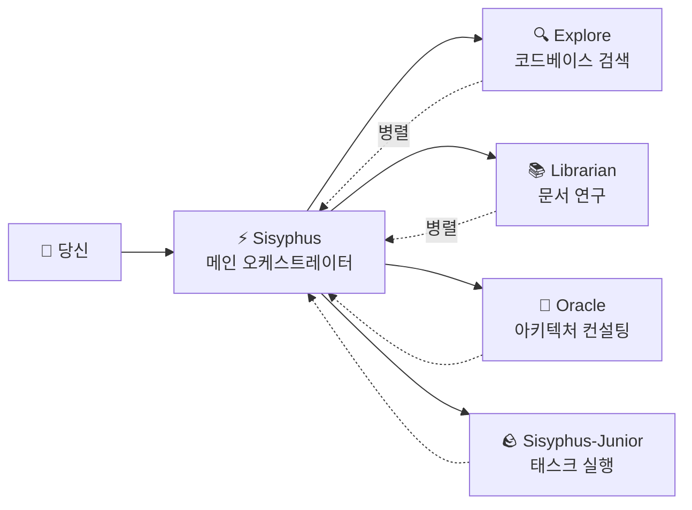

# 메인 오케스트레이터: 시니어 엔지니어처럼 생각하고 실행하기

## 학습 목표

- Sisyphus가 실제 개발팀처럼 작업을 조율하는 방법 이해하기
- 다양한 전문 에이전트가 복잡한 태스크를 협업할 수 있도록 태스크 위임의 모범 사례 마스터하기
- 병렬 백그라운드 태스크를 통해 개발 효율성을 크게 향상시키는 방법 배우기
- 에이전트가 자율적으로 작업할 것과 전문가에게 위임할 것을 구분하는 타이밍 파악하기

## 현재의 문제 상황

이러한 문제들을 경험한 적이 있나요?

- AI 에이전트가 "중간에 포기"하여 목표를 잊어버림
- 동일한 파일을 반복해서 수정할 때마다 컨텍스트를 다시 읽어야 함
- AI에게 여러 작업을 시키고 싶지만, 하나씩 순서대로 기다려야 함
- 에이전트가 코드를 작성했지만, 직접 검증하고 다른 기능이 깨지지 않았는지 확인해야 함

**근본 원인**: "만능 도우미"에게 모든 작업을 맡겼지만, 전문가만이 전문 분야를 안다.

## 언제 이 방식을 사용할 것인가

Sisyphus는 메인 오케스트레이터로, 다음과 같은 상황에 적합합니다:

| 상황 | 적합 여부 | 대안 |
|---|---|---|
| 복잡한 기능 개발 (3단계 이상) | ✅ 강력 추천 | Prometheus + Atlas (상세 계획 필요) |
| 알려진 버그 빠른 수정 | ✅ 적합 | Sisyphus에 직접 맡기기 |
| 여러 저장소/문서 조사 필요 | ✅ 강력 추천 | Sisyphus로 병렬 위임 사용 |
| 단일 파일 간단 수정 | ✅ 가능 | 직접 편집 (더 간단) |
| 상세 프로젝트 계획 필요 | ⚠️ 비추천 | 먼저 Prometheus로 계획 생성 |

## 핵심 개념

**Sisyphus**는 메인 오케스트레이터 에이전트로, 실제 개발팀처럼 여러 AI 전문가를 조율합니다. 책임 분리와 병렬 위임 메커니즘을 통해 전문 서브 에이전트가 각자의 강점을 발휘하여 효율적인 협업을 실현합니다.

Sisyphus는 "더 똑똑한 AI"가 아니라 **오케스트레이션 시스템**입니다.

### 책임 분리



**Sisyphus는 코드를 작성하지 않습니다**. 다음을 담당합니다:

1. **당신의 실제 요구사항 이해** (표면적 의미뿐 아니라)
2. **누가 이 일을 가장 잘하는지 판단** (모든 것을 직접 하지 않음)
3. **병렬 태스크 위임** (여러 전문가가 동시에 작업)
4. **결과 검증** ("완료했습니다"를 믿지 않음)

### 왜 Sisyphus라는 이름인가?

그리스 신화에서 Sisyphus는 영원히 바위를 산꼭대기로 굴리는 형벌을 받았습니다.

이 시스템의 설계 철학: **에이전트는 모든 TODO를 완료할 때까지 멈출 수 없습니다**.

::: info
이것은 형벌이 아니라 품질 보증 메커니즘입니다. AI가 중간에 포기해서 뒷감당을 남기는 상황은 원하지 않을 것입니다.
:::

### 32k Thinking Budget

Sisyphus는 **Claude Opus 4.5 + 32k thinking budget**을 사용합니다.

이것의 장점은 무엇인가요?

| 낮은 예산 (thinking 없음) | 32k thinking budget |
|---|---|
| 바로 코드 작성 시작 | 먼저 요구사항 깊이 분석, 복잡도 평가, 태스크 분해 |
| 경계 조건 누락하기 쉬움 | 잠재적 문제와 리스크 사전 발견 |
| 중간에 길 잃음 | 처음부터 최적의 방식 선택 |

::: tip
Sisyphus에 **Opus 4.5** 모델 구성을 강력히 권장합니다. 다른 모델을 사용하면 경험 품질이 크게 저하될 수 있습니다.
:::

## 따라하기

### 1단계: 테스트 프로젝트 생성

**이유**
Sisyphus의 동작을 관찰하려면 실행 가능한 프로젝트가 필요합니다.

```bash
mkdir my-app && cd my-app
npm create next-app@latest . -- --typescript --tailwind --eslint --no-src-dir
npm install
```

**확인 사항**: 프로젝트 초기화 완료, `npm run dev`로 실행 가능.

### 2단계: Sisyphus에 복잡한 태스크 부여

OpenCode에서 프로젝트를 열고 다음을 입력하세요:

```
사용자 로그인 기능을 추가해주세요:
- 이메일 비밀번호 로그인
- JWT 토큰 저장
- 보호된 라우트
- 로그인 상태 확인
```

Sisyphus의 반응을 관찰하세요.

**확인 사항**:

1. Sisyphus가 바로 코드 작성을 시작하지 않음
2. 먼저 TODO 목록 생성 (태스크 상세 분해)
3. 코드베이스 패턴 평가 (설정, 파일 구조 확인)
4. 몇 가지 명확화 질문을 할 수 있음

**체크포인트 ✅**: OpenCode의 TODO 패널을 확인하면 다음과 유사한 내용이 보여야 합니다:

```
□ 필요한 의존성 설치 (bcrypt, jsonwebtoken)
□ 사용자 모델 및 타입 정의 생성
□ 로그인 API 엔드포인트 구현
□ JWT 서명 및 검증 유틸리티 생성
□ 보호된 라우트 미들웨어 추가
□ 프론트엔드 로그인 폼 구현
□ 로그인 상태 관리 추가
```

### 3단계: 병렬 위임 관찰 (핵심 순간)

Sisyphus는 구현 과정에서 다음과 같이 할 수 있습니다:

```
[Background Task Started]
- Task ID: bg_abc123
- Agent: explore
- Prompt: "이 코드베이스에서 기존 인증 패턴 찾기..."

[Background Task Started]
- Task ID: bg_def456
- Agent: librarian
- Prompt: "Next.js용 JWT 모범 사례 연구..."
```

**이것이 핵심**: Sisyphus는 이 태스크들이 완료되기를 **기다리지 않습니다**, 계속 작업합니다.

결과가 필요할 때 `background_output(task_id="...")`를 호출하여 가져옵니다.

**왜 이렇게 빠른가요?**

| 직렬 방식 (전통적) | 병렬 방식 (Sisyphus) |
|---|---|
| 코드베이스 검색 (2분) | ⏳ 코드베이스 검색 (2분) |
| 대기... | ⏳ 문서 연구 (2분, 동시 진행) |
| 문서 연구 (2분) | 구현 시작 (총 2분 소요) |
| 구현 시작 (2분) |  |
| **총 소요 6분** | **총 소요 4분 (33% 절약)** |

### 4단계: 검증 메커니즘

Sisyphus가 "태스크 완료"라고 주장할 때, 다음을 수행합니다:

1. `lsp_diagnostics`를 실행하여 오류 확인
2. `npm run build`를 실행하여 빌드 통과 확인
3. 테스트가 있다면 테스트 스위트 실행
4. TODO를 `completed`로 표시

**체크포인트 ✅**: 터미널 출력을 확인하면 다음과 유사한 내용이 보여야 합니다:

```
✓ 변경된 파일에 대해 진단 실행 중...
✓ 오류 없음
✓ 빌드 통과 (종료 코드 0)
✓ 모든 테스트 통과
```

검증에 실패하면 Sisyphus는 즉시 수정하고, 절대로 뒷감당을 남기지 않습니다.

### 5단계: 함정 피하기

#### ❌ 잘못된 방법: Sisyphus의 TODO 추적 중단

Sisyphus가 태스크를 수행하는 것을 보고, 급하게 재촉합니다:

```
빨리 코드 작성해! 계획하지 마!
```

**문제**: Sisyphus가 TODO를 건너뛰고 바로 코드를 작성하지만, 경계 조건을 놓칠 수 있습니다.

**올바른 방법**:

```
Sisyphus가 계획을 완료할 때까지 기다리세요. 계획이 부적절하다고 생각되면 구체적인 개선 제안을 하세요:
"3단계 TODO는 먼저 데이터베이스 마이그레이션 계획을 고려해야 합니다."
```

#### ❌ 잘못된 방법: Sisyphus 위임 금지

설정에서 모든 전문 에이전트를 비활성화하고 Sisyphus만 남겨두었습니다.

**문제**: Sisyphus가 모든 일을 직접 하려 하지만, 전문적이지 않을 수 있습니다.

**올바른 방법**:

기본 구성을 유지하고 Sisyphus가 자동으로 전문가에게 위임하도록 하세요:

| 태스크 | Sisyphus 직접 실행 | 전문가 위임 |
|---|---|---|
| 단일 파일 간단 수정 | ✅ 가능 | 필요 없음 |
| 코드베이스 검색 | ⚠️ 느림 | ✅ Explore (더 빠름) |
| 문서 연구 | ⚠️ 부정확할 수 있음 | ✅ Librarian (더 전문적) |
| 아키텍처 결정 | ❌ 권장하지 않음 | ✅ Oracle (더 권위적) |

## 수업 요약

Sisyphus의 강력함은 "더 똑똑함"에 있는 것이 아니라:

1. **책임 분리**: 메인 오케스트레이터 + 전문 팀, 혼자가 아닌 팀워크
2. **깊은 사고**: 32k thinking budget으로 세부사항을 놓치지 않음
3. **병렬 실행**: 백그라운드 태스크로 여러 전문가가 동시에 작업
4. **강제 검증**: 증거 없음 = 태스크 미완료
5. **TODO 추적**: 중간에 포기하는 것은 허용되지 않음

**핵심 원칙**:

::: tip
**기본 위임**: 태스크가 극도로 단순하지 않은 한(단일 파일, 알려진 위치), 전문가 위임 또는 Category+Skill 사용을 우선적으로 고려하세요.
:::

## 다음 수업 예고

> 다음 수업에서는 **[Ultrawork 모드](../ultrawork-mode/)**를 배워서, 단 한 번의 명령으로 모든 기능을 활성화하고 Sisyphus가 복잡한 태스크를 전력 질주하도록 합니다.
>
> 학습 내용:
> - `ultrawork` 키워드로 빠르게 태스크 시작하는 방법
> - Ultrawork 모드가 활성화하는 추가 기능들
> - 언제 Ultrawork를 사용하고 언제 Prometheus를 사용해야 하는지

---

## 부록: 소스 코드 참조

<details>
<summary><strong>클릭하여 소스 코드 위치 보기</strong></summary>

> 업데이트 시간: 2026-01-26

| 기능 | 파일 경로 | 라인 번호 |
|---|---|---|
| Sisyphus 에이전트 팩토리 | [`src/agents/sisyphus.ts`](https://github.com/code-yeongyu/oh-my-opencode/blob/main/src/agents/sisyphus.ts) | 419-450 |
| Sisyphus 핵심 프롬프트 | [`src/agents/sisyphus.ts`](https://github.com/code-yeongyu/oh-my-opencode/blob/main/src/agents/sisyphus.ts) | 17-416 |
| 에이전트 메타데이터 및 모델 구성 | [`src/agents/AGENTS.md`](https://github.com/code-yeongyu/oh-my-opencode/blob/main/src/agents/AGENTS.md) | 24-36 |
| 도구 권한 제한 | [`src/agents/AGENTS.md`](https://github.com/code-yeongyu/oh-my-opencode/blob/main/src/agents/AGENTS.md) | 44-51 |

**핵심 구성**:
- **Thinking Budget**: 32k 토큰 (Anthropic 모델만)
- **Temperature**: 0.1 (코드 에이전트 고정 저온)
- **Max Tokens**: 64000
- **권장 모델**: anthropic/claude-opus-4-5

**핵심 워크플로우** (소스에서):
- **Phase 0**: Intent Gate (의도 분류, 53-103 라인)
- **Phase 1**: Codebase Assessment (코드베이스 평가, 107-130 라인)
- **Phase 2A**: Exploration & Research (탐색 및 연구, 132-172 라인)
- **Phase 2B**: Implementation (구현, 176-263 라인)
- **Phase 2C**: Failure Recovery (실패 복구, 266-283 라인)
- **Phase 3**: Completion (완료, 286-302 라인)

**핵심 제약**:
- **비평범한 태스크는 TODO 필수 생성** (311 라인)
- **백그라운드 태스크는 반드시 병렬** (144-162 라인)
- **결과 반드시 검증** (254-262 라인)

</details>
