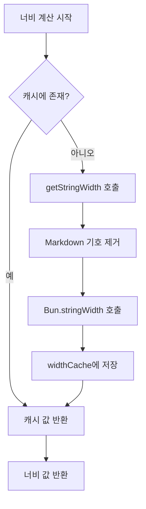

# 기술 세부사항: 캐싱 메커니즘과 성능 최적화

## 이 과정을 마치면 할 수 있는 것

- 플러그인의 캐싱 메커니즘이 성능을 향상시키는 방법 이해
- widthCache의 데이터 구조와 사용 방법 마스터
- 캐시 자동 정리의 트리거 조건 이해
- 성능 최적화 효과를 분석하는 방법 습득

## 현재 겪고 있는 문제

다음과 같은 궁금증이 있을 수 있습니다:

> 플러그인은 어떻게 테이블 너비를 빠르게 계산할까? 큰 테이블을 처리할 때도 왜 원활할까? 캐싱 메커니즘은 어떻게 설계되었을까?

이 과정에서는 플러그인의 내부 구현을 깊이 분석하여, 캐싱 메커니즘의 설계 아이디어와 성능 최적화 전략을 이해합니다.

## 핵심 아이디어

### 왜 캐시를 사용할까?

Markdown 테이블을 포맷할 때, 플러그인은 각 셀의 **표시 너비**(display width)를 계산해야 합니다. 이 계산은 다음을 포함합니다:

1. **Markdown 기호 제거**: `**굵게**`, `*기울임*`, `~~취소선~~`
2. **인라인 코드 보호**: `` `코드` `` 내의 Markdown 기호는 그대로 유지
3. **`Bun.stringWidth()` 호출**: 유니코드 문자의 표시 너비 계산(이모지, 한글 포함)

**문제점**: 동일한 셀 내용이 여러 번 반복될 수 있습니다(예: 테이블 헤더 열 이름). 매번 이 로직을 다시 계산하면 느려집니다.

**해결책**: 캐시(Map)를 사용하여 "텍스트 내용 → 표시 너비" 매핑을 저장하고, 중복 계산을 피합니다.

## 캐시 데이터 구조

플러그인은 두 개의 전역 변수로 캐시를 관리합니다:

### widthCache

```typescript
const widthCache = new Map<string, number>()
```

**용도**: 문자열의 표시 너비 계산 결과를 캐싱

**구조**:
- **Key**: 셀의 원본 텍스트 내용(모든 Markdown 구문 포함)
- **Value**: 계산된 표시 너비(문자 수)

**예시**:

| 원본 텍스트(Key) | 표시 너비(Value) | 설명 |
| --------------- | ---------------- | ---- |
| `**이름**` | 4 | `**` 제거 후 너비가 4 |
| `*나이*` | 4 | `*` 제거 후 너비가 4 |
| `` `status` `` | 8 | 코드 블록 기호도 너비에 포함 |
| `홍길동` | 4 | 한글 문자 너비가 1 |

### cacheOperationCount

```typescript
let cacheOperationCount = 0
```

**용도**: 캐시 작업 횟수를 기록하여 자동 정리 트리거

**정리 임계값**:
- 작업 수 > 100회 또는
- 캐시 항목 > 1000개

## 캐시 조회 프로세스

### calculateDisplayWidth 함수

셀 너비를 계산해야 할 때, 플러그인은 `calculateDisplayWidth()` 함수를 호출하여 다음 프로세스를 실행합니다:

<details>
<summary><strong>📖 전체 코드 보기</strong></summary>

```typescript
function calculateDisplayWidth(text: string): number {
  if (widthCache.has(text)) {
    return widthCache.get(text)!  // 캐시 적중, 즉시 반환
  }

  const width = getStringWidth(text)  // 실제 너비 계산
  widthCache.set(text, width)          // 캐시에 저장
  return width
}
```

</details>

**프로세스 다이어그램**:



**단계 분석**:

| 단계 | 작업 | 시간 복잡도 |
| ---- | ---- | ---------- |
| 1 | `widthCache.has(text)` 확인 | O(1) |
| 2 | 캐시 적중 → 즉시 반환 | O(1) |
| 3 | 캐시 미스 → 너비 계산 | O(n) |
| 4 | 캐시에 저장 | O(1) |

**핵심 포인트**:
- **캐시 적중 시**: 즉시 반환, 계산 불필요(O(1))
- **캐시 미스 시**: 완전한 너비 계산 로직 실행(O(n))
- **원본 텍스트 저장**: Key는 완전한 Markdown 텍스트로, 정확한 일치 보장

## 캐시 정리 메커니즘

### 왜 캐시를 정리할까?

캐시는 성능을 향상시키지만 메모리를 차지합니다. 정리하지 않으면:
- **메모리 사용량 지속 증가**: 새로운 셀 내용이 매번 캐싱됨
- **무용 데이터 포함 가능**: 오래된 테이블 내용은 더 이상 필요하지 않을 수 있음

### 자동 정리 트리거 조건

플러그인은 포맷팅 완료 후마다 `incrementOperationCount()`를 호출하여 작업 카운트를 업데이트합니다:

<details>
<summary><strong>📖 정리 코드 보기</strong></summary>

```typescript
function incrementOperationCount() {
  cacheOperationCount++

  if (cacheOperationCount > 100 || widthCache.size > 1000) {
    cleanupCache()
  }
}

function cleanupCache() {
  widthCache.clear()
  cacheOperationCount = 0
}
```

</details>

**트리거 조건**(하나라도 충족하면 트리거):

| 조건 | 임계값 | 설명 |
| ---- | ---- | ---- |
| 작업 횟수 | > 100회 포맷팅 작업 | 빈번한 정리 트리거 방지 |
| 캐시 항목 | > 1000개 셀 | 메모리 사용량 과도 증가 방지 |

**정리 전략**:
- **완전 비우기**: `widthCache.clear()`로 모든 캐시 삭제
- **카운트 리셋**: `cacheOperationCount = 0`

::: info 정리 타이밍

캐시 정리는 **포맷팅 완료 후마다** 발생하며, 포맷팅 중에는 발생하지 않습니다. 이렇게 하면 진행 중인 포맷팅 작업이 중단되지 않습니다.

:::

## 성능 최적화 효과

### 캐시 적중률 분석

5열 × 10행 테이블을 가정해 봅시다:

- **반복 내용**: 테이블 헤더 열 이름이 구분 행과 데이터 행에서 11번 반복
- **고유 내용**: 각 셀의 내용이 모두 다름

**캐시 효과**:

| 시나리오 | 캐시 미사용 | 캐시 사용 | 성능 향상 |
| ---- | ---------- | -------- | -------- |
| 5열 × 10행(반복 없음) | 50회 계산 | 50회 계산 | 없음 |
| 5열 × 10행(헤더 반복) | 50회 계산 | 10회 계산 + 40회 캐시 적중 | ~80% |

### 실제 영향

**캐시가 가져오는 이점**:

1. **계산 오버헤드 감소**: 중복된 Markdown 기호 제거와 `Bun.stringWidth()` 호출 방지
2. **CPU 사용량 감소**: `getStringWidth()`는 정규식 치환과 유니코드 계산을 포함하여 오버헤드가 큼
3. **응답 속도 향상**: 많은 반복 셀을 포함한 테이블에서 효과가 더 명확

**예시 시나리오**:

| 시나리오 | 캐시 효과 |
| ---- | -------- |
| AI 생성 비교 테이블 | ✅ 효과 현저(다열 반복 내용) |
| 간단한 단행 테이블 | ⚪ 효과 보통(내용 고유) |
| 테이블 내 Markdown 중첩 | ✅ 효과 현저(기호 제거 오버헤드 큼) |

## 성능 최적화 제안

::: tip 개발자를 위한 제안

성능을 더 최적화해야 한다면 다음을 고려할 수 있습니다:

1. **캐시 임계값 조정**: 실제 테이블 크기에 따라 `100`회와 `1000` 항목 임계값 조정
2. **LRU 캐시**: 최소 최근 사용(LRU) 알고리즘으로 완전 비우기 전략 대체
3. **성능 모니터링**: 캐시 적중률을 통계하는 로그 추가, 실제 효과 분석

:::

## 이 과정 요약

플러그인은 `widthCache` 캐싱 메커니즘으로 성능을 최적화합니다:

- **저장 구조**: `Map<string, number>`으로 원본 텍스트를 표시 너비에 매핑
- **조회 프로세스**: 캐시 확인 → 미스 시 계산 후 저장
- **정리 메커니즘**: 작업 수 > 100 또는 항목 > 1000 시 자동 정리
- **성능 향상**: 중복 계산 감소, CPU 사용량 감소

이 메커니즘은 플러그인이 복잡한 테이블을 처리할 때도 원활하게 유지되도록 하며, 성능 최적화의 핵심 구현입니다.

## 다음 과정 예고

> 다음 과정에서는 **[업데이트 로그: 버전 기록 및 변경 사항](../../changelog/release-notes/)**을 학습합니다.
>
> 배우게 될 내용:
> - 플러그인의 버전 진화 기록
> - 새로운 기능 및 수정 기록
> - 플러그인 업데이트 추적 방법

---

## 부록: 소스코드 참조

<details>
<summary><strong>클릭하여 소스코드 위치 보기</strong></summary>

> 업데이트 시간: 2026-01-26

| 기능 | 파일 경로 | 행 번호 |
| --- | --- | --- |
| widthCache 정의 | [`source/franlol/opencode-md-table-formatter/index.ts`](https://github.com/franlol/opencode-md-table-formatter/blob/main/index.ts#L6) | 6 |
| cacheOperationCount 정의 | [`source/franlol/opencode-md-table-formatter/index.ts`](https://github.com/franlol/opencode-md-table-formatter/blob/main/index.ts#L7) | 7 |
| calculateDisplayWidth 함수 | [`source/franlol/opencode-md-table-formatter/index.ts`](https://github.com/franlol/opencode-md-table-formatter/blob/main/index.ts#L151-L159) | 151-159 |
| incrementOperationCount 함수 | [`source/franlol/opencode-md-table-formatter/index.ts`](https://github.com/franlol/opencode-md-table-formatter/blob/main/index.ts#L219-L225) | 219-225 |
| cleanupCache 함수 | [`source/franlol/opencode-md-table-formatter/index.ts`](https://github.com/franlol/opencode-md-table-formatter/blob/main/index.ts#L227-L230) | 227-230 |

**핵심 상수**:
- `widthCache = new Map<string, number>()`: 문자열 표시 너비를 캐싱하는 Map 구조
- `cacheOperationCount = 0`: 캐시 작업 카운터

**핵심 함수**:
- `calculateDisplayWidth(text: string): number`: 표시 너비 계산(캐시 포함), 캐시 확인 후 계산
- `incrementOperationCount(): void`: 작업 카운트 증가, 조건부 정리 트리거
- `cleanupCache(): void`: widthCache 비우기 및 카운터 리셋

</details>
