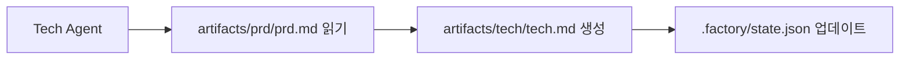

# 컨텍스트 최적화: 분할 세션 실행

## 학습 완료 후 할 수 있는 것

- `factory continue` 명령어를 사용하여 새 세션에서 파이프라인 계속 실행
- 각 단계가 깨끗한 컨텍스트를 독점적으로 사용하는 이점 이해
- 토큰 소비를 크게 줄이는 방법 습득
- 중단 복구 지원, 언제든지 일시 중지 및 계속 가능

## 현재 직면한 문제점

AI 어시스턴트(예: Claude Code)에서 전체 7단계 파이프라인을 실행할 때 다음과 같은 문제가 발생할 수 있습니다:

- **토큰 사용량 증가**: 대화가 누적됨에 따라 컨텍스트가 점점 길어지고, 각 단계는 이전 모든 단계의 내용을 로드해야 함
- **비용 상승**: 긴 대화는 더 많은 입력 토큰을 의미하며 비용이 급증함
- **응답 지연**: 컨텍스트가 너무 길면 응답 시간이 증가할 수 있음
- **복구 어려움**: 특정 단계가 실패하면 다시 시작할 때 많은 컨텍스트를 다시 로드해야 함

::: tip 핵심 문제
긴 대화의 컨텍스트 누적은 AI 어시스턴트의 고유한 특성이지만, "분할 세션 실행"을 통해 이 문제를 회피할 수 있습니다.
:::

## 언제 이 기법을 사용할 것인가

| 시나리오 | 분할 세션 사용 여부 | 이유 |
| --- | --- | --- |
| 전체 7단계 파이프라인 실행 | ✅ 강력 권장 | 모든 토큰이 귀중함 |
| 1-2단계만 실행 | ⚠️ 선택적 | 컨텍스트가 짧아 반드시 필요하지 않음 |
| 특정 단계 디버깅 | ⚠️ 선택적 | 빈번한 재시도가 세션 전환 비용을 증가시킬 수 있음 |
| 장시간 중단 후 복구 | ✅ 반드시 사용 | 오래된 컨텍스트 로드 방지 |

## 핵심 개념

Agent App Factory는 **분할 세션 실행**을 지원하며, 핵심 아이디어는:

**각 단계가 끝나면 새로운 세션에서 다음 단계를 실행합니다.**

이렇게 하는 이점:

1. **깨끗한 컨텍스트**: 각 단계는 필요한 입력 파일만 로드하고 대화 기록에 의존하지 않음
2. **토큰 절약**: 이전 모든 단계의 내용을 AI에 반복적으로 전달하는 것을 방지
3. **복구 가능성**: 언제든지 중단하고 나중에 새 세션으로 계속할 수 있으며 진행 상황이 손실되지 않음
4. **크로스 플랫폼 호환성**: 모든 AI 어시스턴트(Claude Code, OpenCode, Cursor 등)에 적용 가능

### 컨텍스트 격리 전략

분할 세션 실행을 구현하기 위해 Agent App Factory는 **컨텍스트 격리 전략**을 채택했습니다:

::: info 컨텍스트 격리란?
컨텍스트 격리는 각 Agent가 파일 입력에만 의존하고 대화 기록에 의존하지 않는 것을 의미합니다. 이전에 무슨 일이 있었든 Agent는 지정된 입력 파일에서만 정보를 읽습니다.
:::

각 Agent가 실행될 때:

- ✅ **읽기만** `pipeline.yaml`에 정의된 `inputs` 파일
- ❌ **사용하지 않음** 대화 기록의 어떤 "기억"도
- ❌ **가정하지 않음** 이전 단계에서 무슨 일이 있었는지 알고 있다고

예를 들어, Tech Agent가 실행될 때:



Tech Agent는 `artifacts/prd/prd.md`만 신경 쓰며, "사용자가 이전에 어떤 앱을 만들고 싶어 했다"고 생각하지 않습니다. 모든 정보는 입력 파일에서 옵니다.

### 상태 복구 메커니즘

`factory continue`를 실행하면 시스템은:

1. `.factory/state.json`을 읽어 현재 진행 상황 확인
2. `.factory/pipeline.yaml`을 읽어 다음 단계 결정
3. **해당 단계에 필요한 입력 파일만 로드**
4. 새로운 AI 어시스턴트 창을 열어 계속 실행

상태 파일(`.factory/state.json`)은 전체 시스템의 "기억 중심"입니다:

```json
{
  "version": 1,
  "status": "waiting_for_confirmation",
  "current_stage": "tech",
  "completed_stages": ["bootstrap", "prd"],
  "last_updated": "2026-01-29T12:00:00Z"
}
```

각 단계가 완료되면 상태가 이 파일에 업데이트됩니다. 새 세션이 시작될 때 이 파일만 읽으면 현재 위치를 알 수 있습니다.

## 🎒 시작 전 준비사항

::: warning 전제 조건 확인
이 튜토리얼을 시작하기 전에 다음을 확인하세요:

- [ ] [빠른 시작](../../start/getting-started/)을 완료하고 Factory 프로젝트를 초기화했습니다
- [ ] [7단계 파이프라인 개요](../../start/pipeline-overview/)를 이해했습니다
- [ ] Claude Code(또는 다른 AI 어시스턴트)가 설치되어 있습니다

아직 완료하지 않았다면 먼저 이러한 전제 과정을 완료하세요.
:::

## 따라하기

실제 시나리오를 통해 `factory continue` 명령어 사용 방법을 학습해 보겠습니다.

### 시나리오 설정

7단계 파이프라인을 실행 중이며, 현재 `bootstrap` 및 `prd` 단계를 완료하고 `ui` 단계에서 확인을 기다리고 있다고 가정합니다.

### 1단계: 체크포인트에서 "새 세션으로 계속" 선택

특정 단계가 완료되면 Sisyphus 스케줄러가 옵션 테이블을 표시합니다:

```
✓ ui 완료!

생성된 산출물:
- artifacts/ui/ui.schema.yaml
- artifacts/ui/preview.web/index.html
- artifacts/ui/preview.web/styles.css
- artifacts/ui/preview.web/app.js

┌─────────────────────────────────────────────────────────────┐
│  📋 다음 단계를 선택하세요                                    │
│  옵션 번호(1-5)를 입력하고 Enter 키를 눌러 확인하세요         │
└─────────────────────────────────────────────────────────────┘

┌──────┬──────────────────────────────────────────────────────┐
│ 옵션 │ 설명                                                  │
├──────┼──────────────────────────────────────────────────────┤
│  1   │ 다음 단계 계속(동일 세션)                             │
│      │ tech 단계를 계속 실행하겠습니다                       │
├──────┼──────────────────────────────────────────────────────┤
│  2   │ 새 세션으로 계속 ⭐ 권장 옵션, 토큰 절약               │
│      │ 새 명령줄 창에서 실행: factory continue               │
│      │ (자동으로 새 Claude Code 창을 열고 파이프라인 계속)   │
├──────┼──────────────────────────────────────────────────────┤
│  3   │ 이 단계 재실행                                        │
│      │ ui 단계를 다시 실행합니다                             │
├──────┼──────────────────────────────────────────────────────┤
│  4   │ 산출물 수정 후 재실행                                 │
│      │ artifacts/prd/prd.md 수정 후 다시 실행합니다          │
├──────┼──────────────────────────────────────────────────────┤
│  5   │ 파이프라인 일시 중지                                  │
│      │ 현재 진행 상황을 저장하고 나중에 계속합니다           │
└──────┴──────────────────────────────────────────────────────┘

💡 팁: 1-5 사이의 숫자를 입력하고 Enter 키를 눌러 선택을 확인하세요
```

**확인해야 할 사항**:
- 옵션 2가 "⭐ 권장 옵션, 토큰 절약"으로 표시되어 있음

현재 세션에서 옵션 5(파이프라인 일시 중지)를 선택한 다음 새 명령줄 창에서 `factory continue`를 실행할 수 있습니다.

**이유**
- 옵션 1은 "다음 단계 계속(동일 세션)"으로, 현재 세션에서 계속하므로 컨텍스트가 누적됨
- 옵션 2는 "새 세션으로 계속"으로, 새로운 깨끗한 컨텍스트로 다음 단계를 실행하여 **토큰 절약**
- 옵션 5는 "파이프라인 일시 중지"로, 현재 진행 상황을 저장하고 나중에 `factory continue`로 복구 가능

### 2단계: 새 명령줄 창에서 `factory continue` 실행

새 터미널 창(또는 탭)을 열고 프로젝트 디렉토리로 이동한 다음 실행:

```bash
factory continue
```

**확인해야 할 사항**:

```
Agent Factory - 새 세션에서 계속

파이프라인 상태:
────────────────────────────────────────
프로젝트: my-awesome-app
상태: 대기 중
현재 단계: tech
완료됨: bootstrap, prd

새 Claude Code 세션 시작 중...
✓ 새 Claude Code 창이 시작됨
  (창이 열릴 때까지 기다려 주세요)
```

**발생한 일**:

1. `factory continue` 명령어가 `.factory/state.json`을 읽어 현재 상태 확인
2. 현재 프로젝트의 상태 정보 표시
3. 자동으로 새 Claude Code 창을 열고 "파이프라인 계속 실행" 명령 전달
4. 새 창이 자동으로 `tech` 단계부터 계속 실행

### 3단계: 새 창에서 계속 실행

새 Claude Code 창이 시작되면 새로운 대화가 표시되지만 상태는 이전에 저장된 체크포인트에서 복구됩니다.

새 세션에서 Agent는:

1. `.factory/state.json`을 읽어 현재 단계 확인
2. `.factory/pipeline.yaml`을 읽어 해당 단계의 입력 및 출력 결정
3. **해당 단계에 필요한 입력 파일만 로드**(예: `artifacts/prd/prd.md`)
4. 해당 단계의 작업 실행

**핵심 포인트**:
- 새 세션에는 이전 단계의 대화 기록이 없음
- Agent는 입력 파일에서만 정보를 읽고 "기억"에 의존하지 않음
- 이것이 **컨텍스트 격리**의 구현임

### 4단계: 컨텍스트 격리 확인

컨텍스트 격리가 작동하는지 확인하려면 새 세션에서 Agent에게 다음과 같이 물어볼 수 있습니다:

"bootstrap 단계에서 무슨 일이 있었는지 알고 있나요?"

컨텍스트 격리가 작동하면 Agent는 다음과 같이 말할 것입니다:

"이전 작업을 이해하려면 관련 파일을 확인해야 합니다. 읽어 보겠습니다..."

그런 다음 `input/idea.md` 또는 다른 파일을 읽어 정보를 얻으려고 시도하며, 대화 기록에서 직접 "회상"하지 않습니다.

**체크포인트 ✅**
- 새 세션 시작 성공
- 올바른 프로젝트 상태 표시
- Agent는 입력 파일에만 의존하고 대화 기록에 의존하지 않음

### 5단계: 남은 단계 계속 실행

각 단계가 완료되면 다음 중 선택할 수 있습니다:

- 현재 세션에서 계속(옵션 1) - 짧은 프로세스에 적합
- **새 세션으로 계속(옵션 2)** - **권장, 토큰 절약**
- 파이프라인 일시 중지(옵션 5) - 나중에 `factory continue` 실행

전체 7단계 파이프라인의 경우 각 단계마다 "새 세션으로 계속"을 사용하는 것이 좋습니다:

```
bootstrap (세션 1) → prd (세션 2) → ui (세션 3) → tech (세션 4)
→ code (세션 5) → validation (세션 6) → preview (세션 7)
```

각 세션은 깨끗하며 이전 모든 단계의 내용을 로드할 필요가 없습니다.

## 함정 경고

### 함정 1: `factory continue` 실행을 잊음

**잘못된 방법**:
- 이전 세션에서 직접 다음 단계 시작
- 또는 새 창에서 `factory continue` 없이 직접 Claude Code 열기

**올바른 방법**:
- 항상 `factory continue` 명령어를 사용하여 새 세션 시작
- 이 명령어는 자동으로 상태를 읽고 올바른 명령을 전달함

### 함정 2: 새 세션에서 기록 파일을 중복 로드

**잘못된 방법**:
- 새 세션에서 AI에게 이전 단계의 산출물을 수동으로 읽도록 요청
- AI가 이전에 무슨 일이 있었는지 "알아야 한다"고 생각

**올바른 방법**:
- 컨텍스트 격리 메커니즘을 신뢰하고 Agent가 자동으로 입력 파일에서 정보를 읽도록 함
- 해당 단계에 필요한 입력 파일만 제공

### 함정 3: `factory continue`를 프로젝트 간 사용

**잘못된 방법**:
- 프로젝트 A에서 `factory continue`를 실행하지만 현재 디렉토리는 프로젝트 B

**올바른 방법**:
- `factory continue`는 현재 디렉토리가 Factory 프로젝트인지 확인함
- 그렇지 않으면 먼저 `factory init`을 실행하라는 메시지가 표시됨

### 함정 4: 산출물 수정 후 `factory continue`를 사용하지 않음

**시나리오**:
- 특정 단계가 완료된 후 수동으로 산출물을 수정함(예: PRD 수정)
- 다음 단계를 계속 실행하려고 함

**올바른 방법**:
- `factory run` 실행(지정된 단계부터 다시 시작)
- 또는 `factory continue` 실행(현재 체크포인트에서 계속)
- 이전 세션에서 직접 계속하지 마세요. 컨텍스트가 일치하지 않을 수 있음

## 수업 요약

이 수업에서는 `factory continue` 명령어를 사용하여 분할 세션 실행을 수행하는 방법을 학습했습니다:

### 핵심 요점

1. **분할 세션 실행**: 각 단계가 완료되면 새 세션에서 다음 단계 실행
2. **컨텍스트 격리**: Agent는 입력 파일에만 의존하고 대화 기록에 의존하지 않음
3. **상태 복구**: `.factory/state.json`이 현재 진행 상황을 기록하며 새 세션에서 복구 가능
4. **토큰 절약**: 너무 긴 컨텍스트 로드를 방지하여 비용을 크게 절감

### 명령어 빠른 참조

| 명령어 | 기능 | 사용 시나리오 |
| --- | --- | --- |
| `factory continue` | 새 세션에서 파이프라인 계속 실행 | 각 단계 완료 후 |
| `factory run` | 현재 세션에서 파이프라인 실행 | 처음 실행 또는 디버깅 시 |
| `factory status` | 현재 프로젝트 상태 확인 | 진행 상황 파악 시 |

### 모범 사례

- ✅ 전체 7단계 파이프라인 실행 시 각 단계마다 `factory continue` 사용
- ✅ 체크포인트에서 "새 세션으로 계속"(옵션 2) 선택
- ✅ 컨텍스트 격리 메커니즘을 신뢰하고 기록 파일을 수동으로 로드하지 않음
- ✅ `factory status`를 사용하여 프로젝트 진행 상황 확인

## 다음 수업 예고

> 다음 수업에서는 **[권한 및 보안 메커니즘](../security-permissions/)**을 학습합니다.
>
> 학습할 내용:
> - 능력 경계 매트릭스가 Agent의 권한 초과를 방지하는 방법
> - 권한 초과 처리 메커니즘 및 신뢰할 수 없는 산출물 격리
> - 보안 체크포인트 및 권한 검증 프로세스
> - Claude Code의 권한 파일 구성 방법

이 수업은 Agent App Factory의 보안 메커니즘을 이해하는 데 도움이 되며, 각 Agent가 승인된 디렉토리에서만 파일을 읽고 쓰도록 보장합니다.

---

## 부록: 소스 코드 참조

<details>
<summary><strong>소스 코드 위치 보기</strong></summary>

> 업데이트 날짜: 2026-01-29

| 기능 | 파일 경로 | 라인 번호 |
| --- | --- | --- |
| factory continue 명령어 | [`cli/commands/continue.js`](https://github.com/hyz1992/agent-app-factory/blob/main/cli/commands/continue.js) | 1-144 |
| 스케줄러 컨텍스트 최적화 | [`agents/orchestrator.checkpoint.md`](https://github.com/hyz1992/agent-app-factory/blob/main/agents/orchestrator.checkpoint.md) | 113-154 |
| 컨텍스트 격리 전략 | [`policies/context-isolation.md`](https://github.com/hyz1992/agent-app-factory/blob/main/policies/context-isolation.md) | 1-64 |

**핵심 함수**:
- `launchClaudeCode(projectDir, nextStage, completedStages)`: 새 Claude Code 창 시작
- `commandExists(cmd)`: 명령어 사용 가능 여부 확인
- `module.exports(projectDir)`: `factory continue` 명령어의 주 함수

**핵심 상수**:
- `state.json`: 상태 파일 경로(`.factory/state.json`)
- `pipeline.yaml`: 파이프라인 정의 파일 경로(`.factory/pipeline.yaml`)
- `config.yaml`: 프로젝트 구성 파일 경로(`.factory/config.yaml`)

**핵심 비즈니스 규칙**:
- BR-6-1: 각 단계는 깨끗한 컨텍스트를 독점적으로 사용
- BR-6-2: `factory continue` 명령어를 사용하여 계속
- BR-6-3: 현재 단계에 필요한 파일만 로드

</details>
