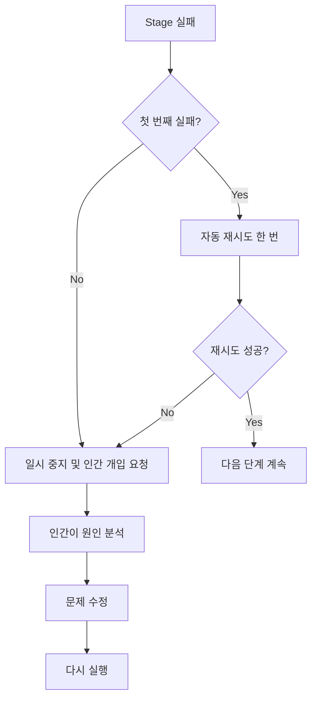
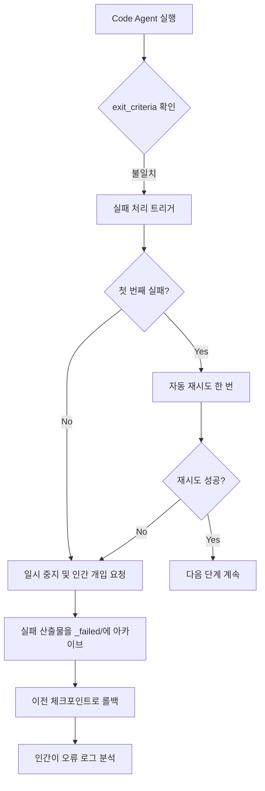
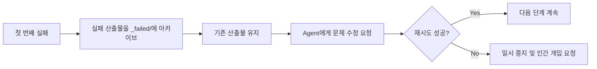
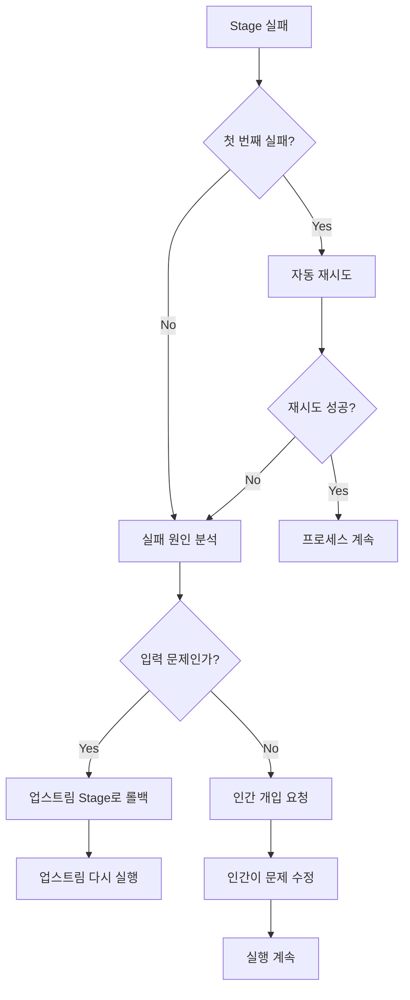

# 실패 처리 및 롤백: 지능형 내결함성 및 오류 복구

## 학습 완료 후 할 수 있는 것

- **실패 유형 식별**: 출력 누락, 내용 불일치, 권한 초과 쓰기 등 실패 원인을 빠르게 판단
- **재시도 메커니즘 이해**: 자동 재시도 한 번의 전략과 실패 아카이브 규칙 마스터
- **롤백 작업 실행**: 최근 성공한 체크포인트로 롤백하여 안정적인 상태 복구
- **인간 개입 처리**: 언제 인간 개입이 필요한지, 실패 원인을 분석하고 수정하는 방법
- **오류 로그 해석**: `pipeline/error.log`의 오류 보고서를 읽고 문제를 빠르게 찾음

## 현재 당신의 딜레마

파이프라인을 실행할 때 가장 걱정하는 것은:

- **실패하면 어떡하지**: 어떤 단계에서 오류가 발생하면, 재시도할까 처음부터 다시 시작할까?
- **데이터가 오염되면**: 실패한 산출물이 후속 단계에 영향을 주나? 정리되나?
- **롤백하는 법**: 이전 성공 상태로 돌아가려면 어떻게 해?
- **인간 개입**: 연속으로 실패하면 내가 무엇을 해야 할까? 로그를 어떻게 보나?

실패 처리 메커니즘은 바로 이러한 문제를 해결하기 위해 존재합니다 - 실패 식별, 자동 재시도, 실패 산출물 아카이브, 체크포인트로의 롤백, 인간 개입의 완전한 프로세스를 정의합니다.

## 언제 이 방법을 사용하는가

파이프라인에서 다음 상황이 발생할 때:

- **단계 실패**: Agent 실행 실패, 출력 파일 누락 또는 기대치 미달
- **권한 초과 작업**: Agent가 승인되지 않은 디렉터리에 쓰기를 시도하여 보안 검사가 트리거됨
- **연속 실패**: 동일한 단계가 두 번 실패하여 인간 개입 분석이 필요함
- **롤백 필요**: 이전 성공 상태로 돌아가서 다시 시작하고 싶을 때
- **로그 분석**: 상세한 오류 보고서와 스택 정보를 확인해야 할 때

## 핵심 개념

실패 처리 전략은 Sisyphus 스케줄러에 의해 통일적으로 실행되며, 파이프라인 오류 발생 시 자동으로 처리하거나 인간 개입을 요청하는 **내결함성 엔지니어**와 같습니다.

### 실패 정의

다음 상황은 Stage 실패로 간주됩니다:

| 실패 유형 | 증상 | 코드 위치 |
|---------|------|----------|
| **출력 누락** | `pipeline.yaml`에 지정된 출력 파일이 없거나 이름이 다름 | `failure.policy.md:9` |
| **exit_criteria 불일치** | 출력 내용이 `pipeline.yaml`의 종료 조건을 충족하지 않음 | `failure.policy.md:10` |
| **권한 초과 쓰기** | Agent가 승인되지 않은 디렉터리나 파일에 내용을 작성함 | `failure.policy.md:11` |
| **기타 예외** | 스크립트 오류, 입력을 읽을 수 없음 등으로 인해 작업 완료 불가 | `failure.policy.md:12` |

### 재시도 메커니즘



**재시도 규칙**(`failure.policy.md:16-18`):

- 각 Stage는 기본적으로 **자동 재시도 한 번** 허용
- 재시도 시 스케줄러는 Agent가 기존 산출물을 유지한 채로 문제를 수정하도록 요청하며, 완전히 다시 수행하지 않음
- 두 번째 시도도 실패하면 스케줄러는 파이프라인을 일시 중지하고 인간 개입 프로세스로 진행해야 함

### 롤백 및 아카이브

**실패 아카이브**(`failure.policy.md:22-23`):

```bash
# 실패 산출물을 _failed/ 디렉터리로 이동
mv artifacts/<stage>/ artifacts/_failed/<stage-id>/attempt-1/
mv artifacts/<stage>/ artifacts/_failed/<stage-id>/attempt-2/
```

**롤백 전략**(`failure.policy.md:23`):

- 스케줄러는 가장 최근 성공한 체크포인트로 롤백
- 해당 Stage에서 다시 실행을 시작
- 상하위 산출물의 일관성을 보장하여 데이터 오염 방지

### 인간 개입

**개입 시점**(`failure.policy.md:27`):

- 동일 Stage가 연속으로 두 번 실패한 후
- 권한 초과 쓰기가 감지되었을 때

**개입 프로세스**(`failure.policy.md:27-29`):

1. 스케줄러가 실행을 일시 중지하고 실패 원인을 보고
2. 인간이 입력, 구성 또는 스킬에 문제가 있는지 확인
3. 인간이 입력 파일을 수정하거나 스킬을 조정하거나 매개변수를 변경
4. 남은 프로세스 계속 실행

::: warning 스케줄러 제약
스케줄러는 인간의 확인 없이 실패한 단계를 건너뛰거나 출력을 수정해서는 안 됩니다.
:::
## 따라해 보기

### 1단계: 실패 처리 프로세스 이해하기

파이프라인을 실행할 때, 어떤 단계가 실패하면 Sisyphus 스케줄러가 자동으로 실패 처리 프로세스를 시작합니다.

**예시 시나리오**: Code 단계 실패



### 2단계: 오류 로그 확인하기

실패하면 스케줄러는 상세한 오류 정보를 `pipeline/error.log`에 기록합니다.

**오류 로그 형식**(`failure.policy.md:166-200`):

```bash
cat pipeline/error.log
```

**다음 내용이 표시되어야 함**:

```log
============================================
ERROR REPORT
============================================
Timestamp: 2026-01-29T10:30:00Z
Stage: code
Attempt: 2/2
Status: FAILED

Error Type: TypeScript Compilation Error
Error Message: Cannot find module '@prisma/client'

Stack Trace:
  at Object.<anonymous> (src/lib/prisma.ts:1:1)
  at Module._compile (node:internal/modules/cjs/loader:1198:14)

Exit Criteria Failed:
  - [ ] 백엔드가 시작되고 중대한 오류 없음 (FAILED)
  - [x] 클라이언트가 렌더링되고 접근 가능
  - [x] 추가 인증이나 무관한 기능이 도입되지 않음

Failed Artifacts Moved To:
  artifacts/_failed/code/attempt-2/

Recommended Action:
  1. package.json에 @prisma/client가 포함되어 있는지 확인
  2. npx prisma generate를 실행하여 클라이언트 생성
  3. Code 단계 재시도

============================================
```

**오류 로그 해석**:

| 필드 | 설명 | 예시 |
|------|------|------|
| **Timestamp** | 실패 발생 시간 | 2026-01-29T10:30:00Z |
| **Stage** | 실패한 단계 | code |
| **Attempt** | 재시도 횟수 | 2/2(두 번째 실패) |
| **Status** | 현재 상태 | FAILED |
| **Error Type** | 오류 유형 | TypeScript Compilation Error |
| **Error Message** | 오류 설명 | Cannot find module '@prisma/client' |
| **Stack Trace** | 스택 정보 | src/lib/prisma.ts:1:1 |
| **Exit Criteria Failed** | 통과하지 못한 종료 조건 | 백엔드가 시작되고 중대한 오류 없음 (FAILED) |
| **Failed Artifacts Moved To** | 실패 산출물 아카이브 위치 | artifacts/_failed/code/attempt-2/ |
| **Recommended Action** | 권장 수정 단계 | 1. package.json 확인... |

### 3단계: 재시도 메커니즘 이해하기

첫 번째 실패 시 Sisyphus는 자동으로 재시도를 트리거합니다.

**재시도 프로세스**(`failure.policy.md:16-18`):



**중요 기능**:

- **증분 수정**: 재시도 시 스케줄러는 Agent가 기존 산출물을 바탕으로 문제를 수정하도록 요청하며, 완전히 다시 수행하지 않음
- **실패 아카이브**: 매번 실패한 산출물은 `artifacts/_failed/<stage-id>/attempt-N/`으로 이동하여 비교 분석에 용이
- **최대 한 번**: 기본적으로 자동 재시도 한 번만 허용하여 무한 루프 방지

### 4단계: 실패 아카이브 확인하기

단계 실패 시 모든 실패 산출물은 `artifacts/_failed/` 디렉터리에 아카이브됩니다.

**디렉터리 구조**:

```bash
artifacts/
├── _failed/
│   ├── code/
│   │   ├── attempt-1/
│   │   │   ├── backend/
│   │   │   └── client/
│   │   └── attempt-2/
│   │       ├── backend/
│   │       └── client/
│   ├── ui/
│   │   └── attempt-1/
│   └── prd/
│       └── attempt-1/
```

**아카이브 디렉터리 명명 규칙**:

- `artifacts/_failed/<stage-id>/attempt-N/`
  - `<stage-id>`: 실패한 단계 이름(예: `code`, `ui`, `prd`)
  - `attempt-N`: 시도 횟수(1은 첫 번째 실패, 2는 두 번째 실패)

**아카이브가 필요한 이유**:

- **오염 방지**: 실패 산출물이 후속 단계에 영향을 주지 않음
- **분석 용이**: 다른 시도의 차이를 비교하여 문제의 원인을 찾을 수 있음
- **증거 보존**: 실패 산출물을 보존하여 후속 디버깅에 활용

### 5단계: 롤백 작업 실행하기

이전 상태로 돌아가야 할 때 롤백 기능을 사용할 수 있습니다.

**롤백 프로세스**(`failure.policy.md:23`):

```bash
# 이전 체크포인트로 수동 롤백
factory run <stage-id>

# 예: tech 단계로 롤백하여 다시 실행
factory run tech
```

**롤백 규칙**:

- **롤백 대상**: 가장 최근 성공한 체크포인트로 롤백
- **상태 재설정**: 현재 단계의 산출물과 실패 아카이브를 비움
- **다시 실행**: 대상 단계에서 다시 실행 시작

**롤백 예시**:

Code 단계에서 두 번 실패하여 Tech 단계로 돌아가 아키텍처를 다시 설계하고 싶다고 가정:

```bash
# 1. tech 단계로 롤백
factory run tech

# 2. AI 어시스턴트가 Tech Agent를 다시 실행
# 3. artifacts/tech/와 artifacts/backend/prisma/를 다시 생성
# 4. 그 다음 Code 단계 계속 실행
```

### 6단계: 인간 개입 처리하기

연속으로 두 번 실패하면 Sisyphus는 파이프라인을 일시 중지하고 인간 개입을 요청합니다.

**개입 의사결정 트리**(`failure.policy.md:204-236`):



**인간 개입 체크리스트**(`failure.policy.md:240-263`):

#### 환경 확인

- [ ] Node.js 버전 >= 18
- [ ] npm 버전 >= 9
- [ ] 디스크 공간 충분
- [ ] 네트워크 연결 정상(npm 다운로드)

#### 상태 확인

- [ ] `.factory/state.json` 상태 정확
- [ ] 업스트림 Stage 산출물 완전
- [ ] 실패 산출물이 `_failed/`에 아카이브됨

#### 수정 확인

- [ ] 실패 원인 명확
- [ ] 수정 계획 시행됨
- [ ] 관련 구성 업데이트됨

#### 복구 실행

- [ ] 실패한 Stage에서 다시 시작
- [ ] 실행 로그 모니터링
- [ ] 출력 산출물 검증
### 7단계: 일반적인 실패 시나리오 처리하기

각 단계마다 고유한 일반적인 실패 시나리오가 있으며, 다음은 처리 방법입니다.

#### 7.1 Bootstrap 단계 실패

**일반적인 오류**(`failure.policy.md:35-48`):

| 오류 유형 | 증상 | 원인 | 처리 방법 |
|---------|------|------|----------|
| **출력 누락** | `input/idea.md`이 존재하지 않음 | Agent가 파일에 올바르게 쓰지 않음 | 재시도, 쓰기 경로 확인 |
| **내용 불완전** | idea.md에 중요한 장절이 빠짐 | 사용자 입력 정보 부족 | 일시 중지, 사용자에게 추가 정보 요청 |
| **형식 오류** | 템플릿 구조를 따르지 않음 | Agent가 템플릿을 따르지 않음 | 재시도, 템플릿 요구사항 강조 |

**처리 프로세스**:

```bash
# 1. input/ 디렉터리가 존재하는지 확인
ls -la input/

# 2. 존재하지 않으면 디렉터리 생성
mkdir -p input/

# 3. Bootstrap 단계 재시도
factory run bootstrap
```

#### 7.2 PRD 단계 실패

**일반적인 오류**(`failure.policy.md:50-65`):

| 오류 유형 | 증상 | 원인 | 처리 방법 |
|---------|------|------|----------|
| **기술 세부사항 포함** | PRD에 기술 스택 설명이 나옴 | Agent가 경계 초과 | 재시도, 역할 경계 강조 |
| **기능 과다** | Must Have > 7개 | 범위 확장 | 재시도, MVP로 단순화 요청 |
| **사용자 설명 모호** | "모든 사용자", "대부분 사용자" | 구체화되지 않음 | 재시도, 구체적인 사용자 페르소나 요청 |
| **비목표 누락** | Non-Goals 비어 있음 | 경계 명확하지 않음 | 재시도, 비목표 나열 요청 |

**처리 프로세스**:

```bash
# 1. PRD에 기술 키워드가 포함되지 않았는지 검증
grep -E "(React|API|데이터베이스)" artifacts/prd/prd.md

# 2. Must Have 기능 수가 7개 이하인지 검증
grep -A 100 "Must Have" artifacts/prd/prd.md | wc -l

# 3. 재시도 시 구체적인 수정 요구사항 제공
factory run prd
```

#### 7.3 UI 단계 실패

**일반적인 오류**(`failure.policy.md:67-82`):

| 오류 유형 | 증상 | 원인 | 처리 방법 |
|---------|------|------|----------|
| **페이지 초과** | 페이지 수 > 8 | 범위 확장 | 재시도, 페이지 단순화 요청 |
| **미리보기 열 수 없음** | HTML 파일 손상됨 | 생성 오류 | 재시도, HTML 문법 확인 |
| **AI 스타일 사용** | Inter 폰트 + 보라색 그라디언트 | 가이드라인 미준수 | 재시도, 뚜렷한 스타일 선택 요청 |
| **Schema 무효** | YAML 구문 분석 실패 | 구문 오류 | 재시도, YAML 구문 검증 |

**처리 프로세스**:

```bash
# 1. ui.schema.yaml의 페이지 수 통계
grep -c "page:" artifacts/ui/ui.schema.yaml

# 2. 브라우저에서 미리보기 열기 시도
open artifacts/ui/preview.web/index.html

# 3. YAML 구문 검증
npx js-yaml artifacts/ui/ui.schema.yaml

# 4. 금지된 AI 스타일 요소 사용 여부 확인
grep -E "(Inter|purple|gradient)" artifacts/ui/ui.schema.yaml
```

#### 7.4 Tech 단계 실패

**일반적인 오류**(`failure.policy.md:84-99`):

| 오류 유형 | 증상 | 원인 | 처리 방법 |
|---------|------|------|----------|
| **Prisma 구문 오류** | schema.prisma 무효 | 구문 문제 | 재시도, prisma validate 실행 |
| **과도한 설계** | 마이크로서비스/캐시 도입 | MVP 원칙 위반 | 재시도, 아키텍처 단순화 요청 |
| **데이터 모델 과다** | 테이블 수 > 10 | 범위 확장 | 재시도, 데이터 모델 단순화 |
| **API 정의 누락** | tech.md에 엔드포인트 목록 없음 | 내용 불완전 | 재시도, API 보완 요청 |

**처리 프로세스**:

```bash
# 1. Prisma 검증 실행
cd artifacts/backend
npx prisma validate

# 2. tech.md에 필수 장절이 포함되어 있는지 확인
grep -E "(API|엔드포인트|라우트)" artifacts/tech/tech.md

# 3. 데이터 모델 수 통계
grep -c "model " artifacts/backend/prisma/schema.prisma

# 4. 불필요한 복잡한 기술 도입 여부 확인
grep -E "(마이크로서비스|캐시|큐)" artifacts/tech/tech.md
```

#### 7.5 Code 단계 실패

**일반적인 오류**(`failure.policy.md:101-131`):

| 오류 유형 | 증상 | 원인 | 처리 방법 |
|---------|------|------|----------|
| **의존성 설치 실패** | npm install 오류 | 패키지 버전 충돌 | package.json 확인, 버전 업데이트 |
| **TypeScript 오류** | tsc 컴파일 실패 | 타입 문제 | 타입 오류 수정, 재시도 |
| **필요한 파일 누락** | 디렉터리 구조 불완전 | 생성 누락 | 재시도, 파일 목록 확인 |
| **테스트 실패** | npm test 실패 | 코드 논리 오류 | 테스트 수정, 재시도 |
| **API 시작 실패** | 포트 리스닝 실패 | 구성 문제 | 환경 변수 구성 확인 |

**처리 프로세스**:

```bash
# 1. 의존성 확인 실행
cd artifacts/backend
npm install --dry-run

# 2. 타입 확인 실행
npx tsc --noEmit

# 3. 파일 목록 대조하여 디렉터리 구조 확인
ls -la src/

# 4. 테스트 실행
npm test

# 5. 위 내용이 모두 통과하면 서비스 시작 시도
npm run dev
```

**일반적인 의존성 문제 수정**(`failure.policy.md:120-131`):

```bash
# 버전 충돌
rm -rf node_modules package-lock.json
npm install

# Prisma 버전 불일치
npm install @prisma/client@latest prisma@latest

# React Native 의존성 문제
cd artifacts/client
npx expo install --fix
```

#### 7.6 Validation 단계 실패

**일반적인 오류**(`failure.policy.md:133-147`):

| 오류 유형 | 증상 | 원인 | 처리 방법 |
|---------|------|------|----------|
| **검증 보고서 불완전** | report.md 장절 누락 | Agent가 완료하지 않음 | 재시도 |
| **심각한 문제 과다** | 오류 수 > 10 | Code 단계 품질 낮음 | Code 단계로 롤백 |
| **보안 문제** | 하드코딩된 키 감지됨 | 보안 위반 | 롤백, 보안 문제 수정 |

**처리 프로세스**:

```bash
# 1. report.md를 분석하여 모든 장절이 존재하는지 확인
grep -E "(## 요약|## 백엔드|## 프론트엔드|## 문제)" artifacts/validation/report.md

# 2. 심각한 문제 수 통계
grep -c "심각한 문제" artifacts/validation/report.md

# 3. 심각한 문제 > 10이면 Code 단계로 롤백 권장
factory run code

# 4. 보안 스캔 결과 확인
grep -E "(키|비밀번호|token)" artifacts/validation/report.md
```

#### 7.7 Preview 단계 실패

**일반적인 오류**(`failure.policy.md:149-162`):

| 오류 유형 | 증상 | 원인 | 처리 방법 |
|---------|------|------|----------|
| **README 불완전** | 설치 단계 누락 | 내용 누락 | 재시도, 단계 보완 |
| **Docker 빌드 실패** | Dockerfile 오류 | 구성 문제 | Dockerfile 수정 |
| **배포 구성 누락** | docker-compose 없음 | 생성되지 않음 | 재시도, 구성 생성 요청 |

**처리 프로세스**:

```bash
# 1. README.md에 필수 장절이 포함되어 있는지 확인
grep -E "(## 빠른 시작|## 설치|## 실행)" artifacts/preview/README.md

# 2. docker build를 시도하여 Dockerfile 검증
cd artifacts/preview
docker build -t test-app .

# 3. 배포 구성 파일이 존재하는지 확인
ls -la docker-compose.yml .github/workflows/
```
## 체크포인트 ✅

이 과정을 완료한 후, 다음을 할 수 있어야 합니다:

- [ ] 실패 처리의 4가지 유형(출력 누락, 내용 불일치, 권한 초과, 예외) 이해
- [ ] 자동 재시도 한 번의 메커니즘 마스터
- [ ] 실패 산출물이 `artifacts/_failed/`에 아카이브됨을 알기
- [ ] `pipeline/error.log` 오류 보고서를 해석할 수 있음
- [ ] 체크포인트로 롤백하는 프로세스 이해
- [ ] 언제 인간 개입이 필요한지 알기
- [ ] 일반적인 실패 시나리오의 처리 방법 마스터

## 피할 함정

### 문제 1: 재시도 시 산출물이 완전히 다시 수행됨

**증상**: 두 번째 재시도 시 모든 산출물이 다시 생성되며, 기존 기반에서 수정되지 않음.

**원인**: Agent가 "기존 산출물 기반에서 수정" 규칙을 따르지 않음.

**해결 방법**:

재시도 시 Agent에게 명확하게 알려줍니다:

```markdown
기존 산출물을 바탕으로 문제를 수정하고, 완전히 다시 수행하지 마세요.
이미 올바른 부분은 유지하고 exit_criteria에 맞지 않는 부분만 수정하세요.
```

### 문제 2: 실패 산출물이 후속 단계에 오염됨

**증상**: 실패 산출물이 아카이브되지 않아 후속 단계 실행에 영향을 줌.

**원인**: 실패 산출물 아카이브 단계가 실행되지 않음.

**해결 방법**:

실패 산출물을 수동으로 아카이브합니다:

```bash
# 실패 산출물을 _failed/ 디렉터리로 이동
mv artifacts/<stage-id> artifacts/_failed/<stage-id>/attempt-1/

# 그 다음 해당 단계 다시 실행
factory run <stage-id>
```

### 문제 3: 롤백 후 산출물 불일치

**증상**: 업스트림 단계로 롤백한 후 산출물이 이전과 다름.

**원인**: 롤백 시 현재 단계만 재설정하고 의존하는 다운스트림 산출물을 비우지 않음.

**해결 방법**:

완전한 롤백 프로세스:

```bash
# 1. 대상 단계로 롤백
factory run <target-stage>

# 2. 모든 다운스트림 단계 산출물 비우기
rm -rf artifacts/<downstream-stage-1>/
rm -rf artifacts/<downstream-stage-2>/

# 3. 다시 실행
factory run
```

### 문제 4: 인간 개입 후 계속 실행 시 실패

**증상**: 문제를 수정한 후 계속 실행해도 여전히 실패함.

**원인**: 수정 계획이 불완전하거나 수정 사항이 저장되지 않음.

**해결 방법**:

인간 개입 체크리스트:

```bash
# 1. 실패 원인이 명확한지 확인
cat pipeline/error.log

# 2. 수정 계획이 시행되었는지 확인
# 수정된 파일 확인

# 3. 관련 구성이 업데이트되었는지 확인
cat .factory/state.json

# 4. 다시 실행
factory run <failed-stage>
```

### 문제 5: 오류 로그 불완전

**증상**: `pipeline/error.log`에 중요한 정보가 누락됨.

**원인**: 스케줄러가 오류 로그를 올바르게 기록하지 않음.

**해결 방법**:

로그 파일이 존재하는지 확인:

```bash
# 존재하지 않으면 수동으로 생성
mkdir -p pipeline
```

그리고 수동으로 오류 로그를 작성합니다.

## 모범 사례

### 1. 조기 실패

**원칙**: 문제를 가능한 한 빨리 발견하여 후속 단계에서 시간을 낭비하지 않도록 함.

**실천**:

- Bootstrap 단계에서 사용자 입력이 완전한지 검증
- PRD 단계에서 기술 세부사항이 포함되어 있는지 확인(역할 경계 위반)
- UI 단계에서 페이지 수가 합리적인지 검증

### 2. 상세 로그

**원칙**: 문제 해결을 위해 충분한 컨텍스트 정보를 기록.

**실천**:

- 오류 로그에 타임스탬프, 단계, 시도 횟수, 오류 유형, 스택 정보 포함
- 권장 수정 단계를 파일명과 행번호로 구체화
- 실패 산출물 아카이브로 비교 분석 용이

### 3. 원자성 작업

**원칙**: 각 단계의 출력은 원자적이어야 롤백에 용이.

**실천**:

- 모든 산출물 파일을 한 번에 생성, 점진적 쓰기 방지
- 도중 실패 시 불완전한 산출물 보존하지 않음
- 전체 단계 산출물을 아카이브, 일부 파일만 아카이브하지 않음

### 4. 증거 보존

**원칙**: 실패 산출물을 아카이브한 후 재시도하여 비교 분석 용이.

**실천**:

- 매번 실패 시 `attempt-N/` 하위 디렉터리에 아카이브
- 여러 번 시도의 산출물 보존으로 차이 비교 용이
- `git diff`를 사용하여 다른 시도의 차이 비교

### 5. 점진적 재시도

**원칙**: 재시도 시 단순 반복이 아닌 더 구체적인 지침 제공.

**실천**:

```markdown
# 첫 번째 실패
PRD 문서를 생성하세요.

# 두 번째 재시도(구체적인 지침 제공)
기존 PRD를 바탕으로 다음 문제를 수정하세요:
1. 모든 기술 세부사항 삭제(예: React, API 등)
2. Must Have 기능 수를 10개에서 7개로 줄이기
3. 대상 사용자에 구체적인 페르소나 추가
4. Non-Goals 장절 보완 및 경계 명확화
```

## 이 과정 요약

실패 처리 메커니즘은 AI App Factory의 내결함성 보장으로, 파이프라인 오류 발생 시 자동 복구하거나 인간 개입을 요청할 수 있게 합니다.

**핵심 요점**:

1. **실패 정의**: 출력 누락, 내용 불일치, 권한 초과 쓰기, 기타 예외
2. **재시도 메커니즘**: 각 단계는 자동 재시도 한 번 허용, 두 번째 실패 후 인간 개입 요청
3. **실패 아카이브**: 실패 산출물을 `artifacts/_failed/<stage-id>/attempt-N/`으로 이동
4. **롤백 전략**: 최근 성공 체크포인트로 롤백, 상하위 산출물 일관성 보장
5. **인간 개입**: 연속 두 번 실패 후 원인 분석, 문제 수정, 다시 실행
6. **오류 로그**: 타임스탬프, 단계, 오류 유형, 스택 정보, 권장 수정 단계를 포함한 상세한 오류 보고서
7. **일반 시나리오**: 각 단계마다 특정한 일반 오류와 처리 방법 존재

## 다음 과정 예고

> 다음 과정에서는 **[일반적인 문제 및 문제 해결](../../faq/troubleshooting/)**을 학습합니다.
>
> 배우게 될 내용:
> - 초기화 단계의 일반적인 문제
> - 실행 과정의 문제 해결
> - 배포 관련 문제 처리

---

## 부록: 소스코드 참조

<details>
<summary><strong>클릭하여 소스코드 위치 보기</strong></summary>

> 업데이트 시간: 2026-01-29

| 기능 | 파일 경로 | 행 번호 |
|------|----------|------|
| 실패 정책 정의 | [`source/hyz1992/agent-app-factory/policies/failure.policy.md`](https://github.com/hyz1992/agent-app-factory/blob/main/policies/failure.policy.md) | 1-276 |
| 스케줄러 실패 처리 | [`source/hyz1992/agent-app-factory/agents/orchestrator.checkpoint.md`](https://github.com/hyz1992/agent-app-factory/blob/main/agents/orchestrator.checkpoint.md) | 38-46 |
| 능력 경계 매트릭스 | [`source/hyz1992/agent-app-factory/policies/capability.matrix.md`](https://github.com/hyz1992/agent-app-factory/blob/main/policies/capability.matrix.md) | 1-40 |

**실패 정의**(`failure.policy.md:5-13`):
- 출력 누락: `pipeline.yaml`에 지정된 출력 파일이 없거나 이름이 다름
- exit_criteria 불일치: 출력 내용이 `pipeline.yaml`의 해당 Stage `exit_criteria`를 충족하지 않음
- 권한 초과 쓰기: Agent가 승인되지 않은 디렉터리나 파일에 쓰기
- 기타 예외: 스크립트 오류, 입력을 읽을 수 없음 등으로 인해 작업 완료 불가

**재시도 메커니즘**(`failure.policy.md:16-18`):
- 각 Stage는 기본적으로 자동 재시도 한 번 허용
- 스케줄러는 Agent가 기존 산출물을 유지한 채로 문제를 수정하도록 요청해야 하며, 완전히 다시 수행하지 않음
- 두 번째 시도도 실패하면 스케줄러는 파이프라인을 일시 중지하고 인간 개입 프로세스로 진행해야 함

**롤백 및 아카이브**(`failure.policy.md:22-23`):
- 실패 산출물을 `artifacts/_failed/<stage-id>/` 디렉터리로 이동
- 가장 최근 성공한 체크포인트로 롤백하여 해당 Stage에서 다시 실행 시작

**인간 개입**(`failure.policy.md:27-29`):
- 동일 Stage가 연속 두 번 실패하면 스케줄러는 실행을 일시 중지하고 실패 원인을 보고해야 함
- 인간 개입 후 입력 파일을 수정하거나 스킬을 조정하거나 매개변수를 변경한 후 남은 프로세스를 계속 실행할 수 있음
- 스케줄러는 인간의 확인 없이 실패한 단계를 건너뛰거나 출력을 수정해서는 안 됨

**오류 로그 형식**(`failure.policy.md:166-200`):
- Timestamp, Stage, Attempt, Status
- Error Type, Error Message, Stack Trace
- Exit Criteria Failed
- Failed Artifacts Moved To
- Recommended Action

**일반적인 실패 시나리오**(`failure.policy.md:33-162`):
- Bootstrap 단계: 출력 누락, 내용 불완전, 형식 오류
- PRD 단계: 기술 세부사항 포함, 기능 과다, 사용자 설명 모호, 비목표 누락
- UI 단계: 페이지 초과, 미리보기 열 수 없음, AI 스타일 사용, Schema 무효
- Tech 단계: Prisma 구문 오류, 과도한 설계, 데이터 모델 과다, API 정의 누락
- Code 단계: 의존성 설치 실패, TypeScript 오류, 필수 파일 누락, 테스트 실패, API 시작 실패
- Validation 단계: 검증 보고서 불완전, 심각한 문제 과다, 보안 문제
- Preview 단계: README 불완전, Docker 빌드 실패, 배포 구성 누락

**스케줄러 실패 처리 프로세스**(`orchestrator.checkpoint.md:38-46`):
- `policies/failure.policy.md`를 읽고 정책에 따라 실행
- Agent가 기존 산출물을 유지한 채로 문제를 수정하고 다시 시도하도록 요청
- 실패 산출물을 `artifacts/_failed/<stage-id>/` 디렉터리로 이동
- 연속 두 번 실패 후 파이프라인 일시 중지, 실패 원인 보고 및 인간 개입 대기

**권한 초과 처리**(`orchestrator.checkpoint.md:48-52`):
- 출력 경로가 승인된 디렉터리로 제한되어 있는지 확인
- 권한 초과 쓰기 발견 시 해당 산출물을 `artifacts/_untrusted/<stage-id>/`로 이동
- 실행 일시 중지 및 보고

**인간 개입 의사결정 트리**(`failure.policy.md:204-236`):
- 첫 번째 실패 → 자동 재시도 → 재시도 성공? → 계속 / 두 번째 실패
- 두 번째 실패 → 실패 원인 분석 → 입력 문제인가? → 업스트림 Stage로 롤백 / 인간 개입 요청

**실패 복구 체크리스트**(`failure.policy.md:240-263`):
- 환경 확인: Node.js 버전, npm 버전, 디스크 공간, 네트워크 연결
- 상태 확인: `.factory/state.json`, 업스트림 Stage 산출물, 실패 산출물 아카이브
- 수정 확인: 실패 원인, 수정 계획, 관련 구성
- 복구 실행: 실패한 Stage에서 다시 시작, 로그 모니터링, 산출물 검증

**모범 사례**(`failure.policy.md:267-274`):
- 조기 실패: 문제를 가능한 한 빨리 발견하여 후속 Stage에서 시간 낭비 방지
- 상세 로그: 문제 해결을 위해 충분한 컨텍스트 정보 기록
- 원자성 작업: 각 Stage의 출력은 원자적이어야 롤백 용이
- 증거 보존: 실패 산출물을 아카이브한 후 재시도하여 비교 분석 용이
- 점진적 재시도: 재시도 시 더 구체적인 지침 제공, 단순 반복 방지

</details>
