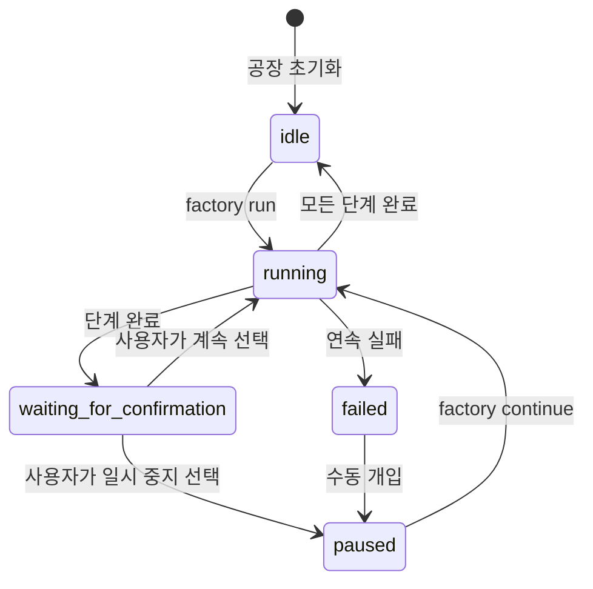
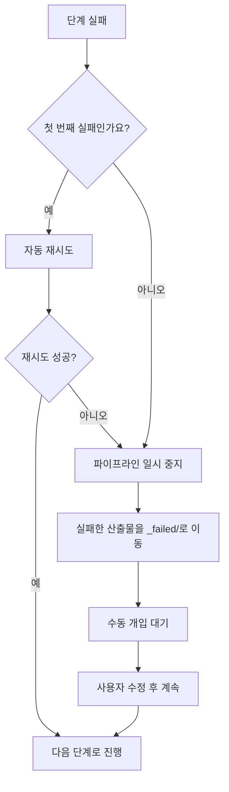

# Sisyphus 스케줄러 상세: 파이프라인 조율 및 상태 관리

## 학습 후 할 수 있는 것

- 스케줄러가 7단계 파이프라인 실행을 어떻게 조율하는지 이해합니다.
- 상태 머신의 작동 원리와 상태 전환 규칙을 이해합니다.
- 능력 경계 행렬의 권한 검사 메커니즘을 익힙니다.
- 실패 시나리오(재시도, 롤백, 수동 개입)를 처리하는 방법을 배웁니다.
- `factory continue` 명령어를 사용하여 Token 소모를 최적화합니다.

## 현재 직면한 문제

이미 여러 파이프라인을 실행해 보았지만, 다음 질문에 대해 명확하지 않을 수 있습니다:

- Sisyphus는 정확히 무엇을 하나요? 다른 Agent와 어떤 차이가 있나요?
- Agent가 특정 디렉터리에서만 읽고 쓸 수 있는 이유는 무엇인가요? 권한 초과 시 어떤 일이 발생하나요?
- 실패 후 스케줄러는 어떻게 처리하나요? 때로는 자동 재시도하고 때로는 수동 개입이 필요한 이유는 무엇인가요?
- `factory continue` 명령어가 왜 Token을 절약할 수 있나요? 그 배후의 메커니즘은 무엇인가요?

이 질문에 궁금하다면, 이 장이 완벽하게 이해하도록 도와드리겠습니다.

## 언제 이 방법을 사용하나요

다음이 필요할 때:

- **파이프라인 문제 디버깅**: 특정 단계에서 스케줄러가 무엇을 했는지, 왜 실패했는지 이해합니다.
- **Token 소모 최적화**: 각 단계마다 새로운 세션에서 `factory continue`를 사용합니다.
- **파이프라인 확장**: 새 Agent를 추가하거나 기존 논리를 수정합니다.
- **실패 시나리오 처리**: 특정 단계가 실패한 이유와 복구 방법을 이해합니다.
- **권한 문제 검사**: Agent가 특정 파일에 액세스할 수 없는 이유를 확인합니다.

## 핵심 아이디어

Sisyphus 스케줄러는 전체 AI App Factory의 "지휘관"입니다.

**이 비유를 기억하세요**:

- 다른 Agent(bootstrap、prd、ui、tech、code、validation、preview)는 작업을 수행하는 근로자와 같습니다.
- Sisyphus는 근로자를 조율하고 작업 품질을 확인하며 예외를 처리하는 감독자입니다.

**Sisyphus의 독특한 점**:

| 특징 | Sisyphus | 다른 Agent |
| --- | --- | --- |
| **책임** | 조율, 검증, 상태 관리 | 구체적인 산출물 생성 |
| **산출물** | state.json 업데이트 | PRD, 코드, 문서 등 생성 |
| **권한** | state.json 읽기/쓰기 | 특정 artifacts/ 하위 디렉터리 읽기/쓰기 |
| **콘텐츠 생성** | 비즈니스 콘텐츠 생성 안 함 | 구체적인 비즈니스 산출물 생성 |

**핵심 원칙**:

1. **엄격한 순서**: pipeline.yaml에 정의된 순서대로 실행하며, 건너뛰거나 병렬로 실행할 수 없습니다.
2. **단일 단계 실행**: 동시에 하나의 Agent만 활성화할 수 있습니다.
3. **책임 분리**: Sisyphus는 비즈니스 산출물을 수정하지 않고, 조율과 검증만 담당합니다.
4. **품질 관문**: 각 단계 완료 후 산출물이 exit_criteria를 충족하는지 검증해야 합니다.

## 상태 머신 모델

Sisyphus는 상태 머신 방식으로 전체 프로세스를 실행합니다. 상태 머신을 이해하는 것이 스케줄러를 마스터하는 핵심입니다.

### 5가지 상태



### 상태 상세 설명

| 상태 | 설명 | 트리거 조건 |
| --- | --- | --- |
| **idle** | 시작 대기 중 | 프로젝트 초기화 완료 또는 파이프라인 전체 완료 |
| **running** | 특정 Stage 실행 중 | factory run 또는 factory continue 시작 후 |
| **waiting_for_confirmation** | 수동 확인 대기 중 | 현재 Stage 완료 후, 사용자가 다음 단계 선택 대기 |
| **paused** | 수동 일시 중지됨 | 사용자가 일시 중지 선택 또는 연속 실패 후 일시 중지 |
| **failed** | 처리되지 않은 실패 감지됨 | Agent 연속 2회 실패 또는 권한 초과 쓰기 |

::: info 상태 파일
모든 상태는 `.factory/state.json` 파일에 저장되며, Sisyphus만 유일하게 업데이트할 수 있습니다.
:::

### 상태 전환 예시

**시나리오 1: 정상 실행**

```
idle → running (factory run)
   ↓
waiting_for_confirmation (bootstrap 완료)
   ↓
running (사용자가 계속 선택)
   ↓
waiting_for_confirmation (prd 완료)
   ↓
... (모든 단계 완료까지 반복)
   ↓
idle
```

**시나리오 2: 실패 복구**

```
running → failed (code 단계 연속 2회 실패)
   ↓
paused (수동 개입으로 코드 수정)
   ↓
running (factory continue로 code 재시도)
   ↓
waiting_for_confirmation
```

## 능력 경계 행렬

### 권한 제어가 필요한 이유는 무엇인가요?

상상해 보세요:

- PRD Agent가 UI Agent가 생성한 파일을 수정하면 어떤 문제가 발생할까요?
- Tech Agent가 Code Agent가 생성한 코드를 읽으면 어떤 결과가 발생할까요?

**답변**: 책임 혼란, 산출물 추적 불가, 품질 보장 불가.

능력 경계 행렬은 각 Agent의 읽기/쓰기 권한을 제한하여 책임 분리를 보장합니다.

### 권한 행렬

| Agent | 읽기 허용 디렉터리 | 쓰기 허용 디렉터리 | 설명 |
| --- | --- | --- | --- |
| **bootstrap** | 없음 | `input/` | `input/` 디렉터리에서만 `idea.md` 생성 또는 수정 |
| **prd** | `input/` | `artifacts/prd/` | 아이디어 파일 읽기, PRD 생성 |
| **ui** | `artifacts/prd/` | `artifacts/ui/` | PRD 읽기, UI Schema 및 미리보기 생성 |
| **tech** | `artifacts/prd/` | `artifacts/tech/`, `artifacts/backend/prisma/` | PRD 읽기, 기술 설계 및 데이터 모델 생성 |
| **code** | `artifacts/ui/`, `artifacts/tech/`, `artifacts/backend/prisma/` | `artifacts/backend/`, `artifacts/client/` | UI 및 기술 설계에 따라 코드 생성 |
| **validation** | `artifacts/backend/`, `artifacts/client/` | `artifacts/validation/` | 코드 품질 검증, 검증 보고서 생성 |
| **preview** | `artifacts/backend/`, `artifacts/client/` | `artifacts/preview/` | 생성된 코드 읽기, 데모 설명 작성 |

### 권한 검사 프로세스

**실행 전**:

1. Sisyphus가 capability.matrix.md를 읽습니다.
2. Agent에 허용된 읽기 및 쓰기 디렉터리를 알려줍니다.
3. Agent는 권한 범위 내에서 작업해야 합니다.

**실행 후**:

1. Sisyphus가 새로 생성되거나 수정된 파일을 스캔합니다.
2. 권한 부여된 디렉터리 범위 내에 있는지 검사합니다.
3. 권한 초과를 발견하면 즉시 처리합니다.

### 권한 초과 처리 메커니즘

Agent가 권한 없는 디렉터리에 쓰면:

1. **산출물 격리**: 권한 초과 파일을 `artifacts/_untrusted/<stage-id>/`로 이동합니다.
2. **실패 기록**: 이벤트를 실패로 표시합니다.
3. **파이프라인 일시 중지**: 수동 개입을 대기합니다.
4. **수정 제안 제공**: 신뢰할 수 없는 파일을 처리하는 방법을 사용자에게 알려줍니다.

**예시**:

```
⚠️  Unauthorized writes detected for stage "prd":
   - artifacts/ui/ui.schema.yaml

Files moved to quarantine: artifacts/_untrusted/prd

Please review these files before proceeding.
```

## 체크포인트 메커니즘

각 단계 완료 후 Sisyphus는 일시 중지하고 수동 확인을 대기합니다. 이것이 체크포인트 메커니즘입니다.

### 체크포인트의 가치

- **품질 제어**: 각 단계의 산출물을 수동으로 검증합니다.
- **유연한 제어**: 언제든 일시 중지, 재시도, 건너뛸 수 있습니다.
- **디버깅 용이성**: 문제를 초기에 발견하여 후기까지 누적되는 것을 방지합니다.

### 체크포인트 출력 템플릿

각 단계 완료 후 Sisyphus는 다음 형식으로 옵션을 표시합니다:

```
✓ prd 완료!

생성된 산출물:
- artifacts/prd/prd.md

┌─────────────────────────────────────────────────────────────┐
│  📋 다음 작업을 선택하세요                                     │
│  옵션 번호(1-5)을 입력하고 확인을 위해 엔터 키를 누르세요      │
└─────────────────────────────────────────────────────────────┘

┌──────┬──────────────────────────────────────────────────────┐
│ 옵션 │ 설명                                                  │
├──────┼──────────────────────────────────────────────────────┤
│  1   │ 다음 단계 계속(동일 세션)                             │
│      │ ui 단계를 계속 실행합니다.                             │
├──────┼──────────────────────────────────────────────────────┤
│  2   │ 새 세션에서 계속 ⭐ 추천 옵션, Token 절약              │
│      │ 새 명령줄 창에서 다음을 실행하세요: factory continue   │
│      │ (새 Claude Code 창을 자동으로 시작하고 파이프라인 계속)│
├──────┼──────────────────────────────────────────────────────┤
│  3   │ 현재 단계 다시 실행                                    │
│      │ prd 단계를 다시 실행합니다.                            │
├──────┼──────────────────────────────────────────────────────┤
│  4   │ 수정 후 다시 실행                                      │
│      │ input/idea.md 수정 후 다시 실행합니다.                │
├──────┼──────────────────────────────────────────────────────┤
│  5   │ 파이프라인 일시 중지                                   │
│      │ 현재 진행 상황을 저장하고 나중에 계속합니다.            │
└──────┴──────────────────────────────────────────────────────┘

💡 팁: 1-5 사이의 숫자를 입력하고 엔터 키를 눌러 선택을 확인하세요
```

::: tip 권장 방법
**옵션 2(새 세션에서 계속)가 모범 사례**입니다. 이유는 다음 섹션 "컨텍스트 최적화"를 참조하세요.
:::

## 실패 처리 전략

특정 단계가 실패하면 Sisyphus는 미리 정의된 전략에 따라 처리합니다.

### 실패 정의

**Sisyphus가 실패로 간주하는 경우**:

- 출력 파일 누락(요청된 파일이 존재하지 않음)
- 출력 내용이 exit_criteria를 충족하지 않음(예: PRD에 사용자 스토리 누락)
- Agent 권한 초과 쓰기(권한 없는 디렉터리에 쓰기)
- Agent 연속 실행 오류(스크립트 오류, 입력을 읽을 수 없음)

### 실패 처리 프로세스



### 자동 재시도 메커니즘

- **기본 규칙**: 각 단계는 자동 재시도 1회 허용
- **재시도 전략**: 기존 산출물을 기반으로 문제를 수정합니다.
- **실패 보관**: 재시도 실패 후 산출물을 `artifacts/_failed/<stage-id>/attempt-2/`로 이동합니다.

### 수동 개입 시나리오

**수동 개입이 필요한 경우**:

1. **연속 2회 실패**: 자동 재시도 후에도 여전히 실패
2. **권한 초과 쓰기**: Agent가 권한 없는 디렉터리에 씀
3. **스크립트 오류**: Agent 실행 중 예외 발생

**수동 개입 프로세스**:

1. Sisyphus가 파이프라인을 일시 중지합니다.
2. 실패 원인과 오류 정보를 표시합니다.
3. 수정 제안을 제공합니다:
   - 입력 파일 수정
   - Agent 정의 조정
   - Skill 파일 업데이트
4. 사용자가 수정한 후 `factory continue`를 실행하여 계속합니다.

## 컨텍스트 최적화(Token 절약)

### 문제 설명

동일한 세션에서 연속으로 7단계를 실행하면 다음 문제에 직면합니다:

- **컨텍스트 누적**: AI가 모든 과거 대화를 기억해야 합니다.
- **Token 낭비**: 과거 산출물을 반복적으로 읽습니다.
- **비용 증가**: 긴 세션은 더 많은 Token을 소모합니다.

### 해결 방법: 세션 분할 실행

**핵심 아이디어**: 각 단계를 새로운 세션에서 실행합니다.

```
세션 1: bootstrap
  ├─ input/idea.md 생성
  ├─ state.json 업데이트
  └─ 세션 종료

세션 2: prd
  ├─ state.json 읽기(현재 상태만 로드)
  ├─ input/idea.md 읽기(입력 파일만 읽기)
  ├─ artifacts/prd/prd.md 생성
  ├─ state.json 업데이트
  └─ 세션 종료

세션 3: ui
  ├─ state.json 읽기
  ├─ artifacts/prd/prd.md 읽기
  ├─ artifacts/ui/ui.schema.yaml 생성
  ├─ state.json 업데이트
  └─ 세션 종료
```

### 사용 방법

**단계 1**: 현재 세션에서 특정 단계를 완료한 후 "새 세션에서 계속"을 선택합니다.

```
┌──────┬──────────────────────────────────────────────────────┐
│ 옵션 │ 설명                                                  │
├──────┼──────────────────────────────────────────────────────┤
│  2   │ 새 세션에서 계속 ⭐ 추천 옵션, Token 절약              │
│      │ 새 명령줄 창에서 다음을 실행하세요: factory continue   │
│      │ (새 Claude Code 창을 자동으로 시작하고 파이프라인 계속)│
└──────┴──────────────────────────────────────────────────────┘
```

**단계 2**: 새 명령줄 창을 열고 다음을 실행합니다:

```bash
factory continue
```

이 명령은 자동으로 다음을 수행합니다:
1. `.factory/state.json`을 읽어 현재 진행 상황을 가져옵니다.
2. 새 Claude Code 창을 시작합니다.
3. 다음 대기 중인 단계부터 계속합니다.

### 컨텍스트 격리의 이점

| 이점 | 설명 |
| --- | --- |
| **Token 절약** | 과거 대화와 산출물을 로드할 필요가 없습니다. |
| **안정성 향상** | 컨텍스트 폭발로 인해 AI가 목표에서 벗어나는 것을 방지합니다. |
| **디버깅 용이성** | 각 단계가 독립적이므로 문제를 쉽게 찾을 수 있습니다. |
| **중단 후 복구** | 모든 체크포인트에서 중단 후 복구할 수 있습니다. |

## 필수 스킬 사용 검증

특정 단계는 출력 품질을 보장하기 위해 특정 스킬 사용을 요구합니다. Sisyphus는 이러한 스킬 사용을 검증합니다.

### bootstrap 단계

**필수 요구사항**: `superpowers:brainstorm` 스킬을 반드시 사용해야 합니다.

**검증 방법**:

1. Agent 출력 메시지에 해당 스킬을 사용했다고 명시되어 있는지 확인합니다.
2. 언급되지 않으면 산출물을 거부합니다.
3. 재실행을 요청하며 해당 스킬을 반드시 사용해야 한다고 명시합니다.

**실패 알림**:

```
❌ superpowers:brainstorm 스킬 사용이 감지되지 않았습니다
idea.md를 생성하기 전에 해당 스킬을 사용하여 사용자 아이디어를 깊이 파악하세요
```

### ui 단계

**필수 요구사항**: `ui-ux-pro-max` 스킬을 반드시 사용해야 합니다.

**검증 방법**:

1. Agent 출력 메시지에 해당 스킬을 사용했다고 명시되어 있는지 확인합니다.
2. `ui.schema.yaml`의 디자인 시스템 구성을 확인합니다.
3. 디자인 시스템 구성이 전문 추천이 아니면 산출물을 거부합니다.

**실패 알림**:

```
❌ ui-ux-pro-max 스킬 사용이 감지되지 않았습니다
해당 스킬을 사용하여 전문적인 디자인 시스템과 UI 프로토타입을 생성하세요
```

### 연속 실패 처리

특정 단계가 스킬 검증 실패로 인해 연속 2회 실패하면:

1. 파이프라인을 일시 중지합니다.
2. 수동 개입을 요청합니다.
3. Agent 정의와 Skill 구성을 확인합니다.

## 실전 연습: 실패한 단계 디버깅

code 단계가 실패했다고 가정하고 디버깅 방법을 살펴보겠습니다.

### 단계 1: state.json 확인

```bash
cat .factory/state.json
```

**출력 예시**:

```json
{
  "version": "1.0",
  "status": "failed",
  "currentStage": "code",
  "completedStages": ["bootstrap", "prd", "ui", "tech"],
  "failedStages": ["code"],
  "stageHistory": [
    {
      "stageId": "code",
      "status": "failed",
      "startTime": "2026-01-29T10:00:00Z",
      "endTime": "2026-01-29T10:15:00Z",
      "attempts": 2,
      "error": "Exit criteria not met: Missing package.json"
    }
  ],
  "lastCheckpoint": "tech",
  "createdAt": "2026-01-29T09:00:00Z",
  "updatedAt": "2026-01-29T10:15:00Z"
}
```

**핵심 정보**:

- `status: failed` - 파이프라인 실패
- `currentStage: code` - 현재 실패한 단계
- `completedStages` - 4개 단계 완료
- `error: "Exit criteria not met: Missing package.json"` - 실패 원인

### 단계 2: 실패한 산출물 확인

```bash
ls -la artifacts/_failed/code/attempt-2/
```

**출력 예시**:

```
drwxr-xr-x  5 user  staff  160 Jan 29 10:15 .
drwxr-xr-x  3 user  staff   96 Jan 29 10:15 ..
-rw-r--r--  1 user  staff 2.1K Jan 29 10:15 server.ts
-rw-r--r--  1 user  staff 1.5K Jan 29 10:15 client.ts
```

**문제 발견**: `package.json` 파일이 누락되었습니다!

### 단계 3: exit_criteria 확인

```bash
cat .factory/pipeline.yaml | grep -A 10 'code:'
```

**출력 예시**:

```yaml
code:
  agent: agents/code.agent.md
  inputs:
    - artifacts/ui/ui.schema.yaml
    - artifacts/tech/tech.md
    - artifacts/backend/prisma/schema.prisma
  outputs:
    - artifacts/backend/package.json
    - artifacts/backend/server.ts
    - artifacts/client/package.json
    - artifacts/client/app.ts
  exit_criteria:
    - package.json 존재
    - 올바른 의존성 포함
    - 코드가 유형 검사를 통과
```

**문제 확인**: Code Agent가 `package.json`을 생성하지 않아 exit_criteria를 위반했습니다.

### 단계 4: 문제 수정

**솔루션 1**: Code Agent 정의 수정

```bash
nano .factory/agents/code.agent.md
```

Agent 정의에서 `package.json` 생성을 명확히 요구합니다:

```markdown
## 반드시 생성해야 하는 파일

다음 파일을 생성해야 합니다:
- artifacts/backend/package.json(올바른 의존성 포함)
- artifacts/backend/server.ts
- artifacts/client/package.json
- artifacts/client/app.ts
```

**솔루션 2**: 입력 파일 수정

문제가 Tech 설계 단계에 있다면 기술 설계를 수정할 수 있습니다:

```bash
nano artifacts/tech/tech.md
```

명확한 의존성 설명을 추가합니다.

### 단계 5: 파이프라인 계속

문제를 수정한 후 다시 실행합니다:

```bash
factory continue
```

Sisyphus는 다음을 수행합니다:
1. state.json을 읽습니다(상태: failed)
2. lastCheckpoint(tech)부터 계속합니다.
3. code 단계를 다시 실행합니다.
4. 산출물이 exit_criteria를 충족하는지 검증합니다.

## 이 장 요약

Sisyphus 스케줄러는 AI App Factory의 "지휘관"으로 다음을 담당합니다:

- **파이프라인 조율**: 7개 단계를 순서대로 실행
- **상태 관리**: state.json을 유지 관리하고 진행 상황을 추적
- **권한 검사**: Agent가 권한 부여된 디렉터리에서만 읽고 쓰도록 보장
- **실패 처리**: 자동 재시도, 실패한 산출물 보관, 수동 개입 대기
- **품질 관문**: 각 단계의 산출물이 exit_criteria를 충족하는지 검증

**핵심 원칙**:

1. 엄격하게 순서대로 실행하며 건너뛰거나 병렬로 실행할 수 없습니다.
2. 동시에 하나의 Agent만 활성화할 수 있습니다.
3. 모든 산출물은 반드시 artifacts/ 디렉터리에 써야 합니다.
4. 각 단계 완료 후 수동으로 확인해야 합니다.
5. `factory continue`를 사용하여 Token을 절약하는 것을 권장합니다.

**이 흐름도를 기억하세요**:

```
factory run → pipeline.yaml 읽기 → 단계 실행 → 산출물 검증 → 체크포인트 확인
     ↑                                                                      │
     └──────────────────── factory continue(새 세션)←──────────────────────┘
```

## 다음 강좌 미리보기

> 다음 강좌에서는 **[컨텍스트 최적화: 세션 분할 실행](../context-optimization/)**를 학습합니다.
>
> 다음을 배울 수 있습니다:
> - `factory continue` 명령어 사용 방법
> - 세션 분할 실행이 왜 Token을 절약할 수 있는지
> - 개발 환경에서 스케줄러 테스트 방법
> - 일반적인 디버깅 팁과 로그 분석

## 부록: 소스 코드 참조

<details>
<summary><strong>클릭하여 소스 코드 위치 펼쳐보기</strong></summary>

> 업데이트: 2026-01-29

| 기능 | 파일 경로 | 행 번호 |
| --- | --- | --- |
| 스케줄러 핵심 정의 | [`source/hyz1992/agent-app-factory/agents/orchestrator.checkpoint.md`](https://github.com/hyz1992/agent-app-factory/blob/main/agents/orchestrator.checkpoint.md) | 전체 |
| 스케줄러 구현 가이드 | [`source/hyz1992/agent-app-factory/agents/orchestrator-implementation.md`](https://github.com/hyz1992/agent-app-factory/blob/main/agents/orchestrator-implementation.md) | 전체 |
| 능력 경계 행렬 | [`source/hyz1992/agent-app-factory/policies/capability.matrix.md`](https://github.com/hyz1992/agent-app-factory/blob/main/policies/capability.matrix.md) | 전체 |
| 실패 처리 전략 | [`source/hyz1992/agent-app-factory/policies/failure.policy.md`](https://github.com/hyz1992/agent-app-factory/blob/main/policies/failure.policy.md) | 전체 |
| 파이프라인 정의 | [`source/hyz1992/agent-app-factory/pipeline.yaml`](https://github.com/hyz1992/agent-app-factory/blob/main/pipeline.yaml) | 전체 |

**핵심 함수**:

- `executeStage()` - 단일 단계 실행(행 117-189)
- `waitForCheckpointConfirmation()` - 체크포인트 확인 대기(행 195-236)
- `handleStageFailure()` - 단계 실패 처리(행 242-289)
- `checkUnauthorizedWrites()` - 권한 초과 쓰기 검사(행 295-315)
- `getPermissions()` - 권한 행렬 가져오기(행 429-467)

**핵심 상수**:

- 상태 열거형: `idle`, `running`, `waiting_for_confirmation`, `paused`, `failed`
- 최대 재시도 횟수: 2회(행 269)
- 경로 확인 우선순위: `.factory/` → 루트 디렉터리(행 31-33)

</details>
