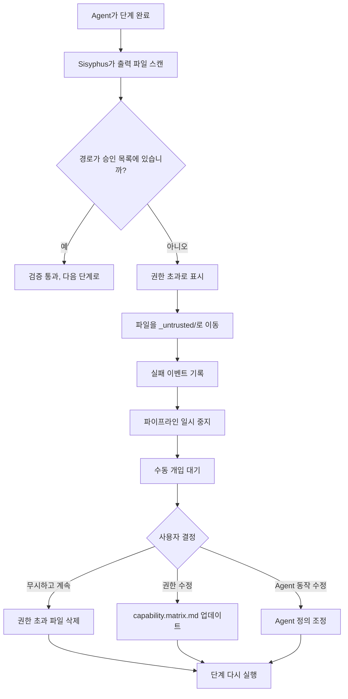

# 권한 및 보안 메커니즘: 능력 경계 매트릭스와 권한 초과 방어

## 이 과정을 마치면 무엇을 할 수 있나요?

- 능력 경계 매트릭스의 설계 원리와 권한 격리 메커니즘 이해
- Claude Code의 권한 파일을 구성하여 `--dangerously-skip-permissions` 사용 방지
- 권한 초과 작업의 처리 프로세스 및 복구 방법 마스터
- 강제 기술 사용 검증 메커니즘 이해
- 권한 관련 보안 문제 식별 및 수정 가능

## 현재 직면한 문제

다음과 같은 상황에 직면해 본 적이 있을 것입니다:

- Agent가 특정 파일에 액세스할 수 없는 이유를 모름
- `factory run` 실행 시 항상 권한이 필요하다는 메시지가 표시되어 `--dangerously-skip-permissions`를 사용하여 건너뜀
- Agent 간의 권한 경계가 불명확하여 권한 초과 작업으로 인한 데이터 오염 우려
- 권한 초과 발생 후 처리 및 복구 방법을 모름

이러한 문제가 당신을 괴롭힌다면, 이 장에서 완전한 권한 및 보안 인지를 구축하는 데 도움을 드립니다.

## 언제 이 방법을 사용하나요?

다음이 필요할 때:

- **Claude Code 구성**: Factory 프로젝트에 올바른 권한 파일 설정
- **권한 문제 디버깅**: Agent가 특정 파일을 읽고 쓸 수 없는 이유 조사
- **권한 초과 예외 처리**: 권한 초과 작업으로 인한 중단된 파이프라인 복구
- **Agent 확장**: 새 Agent 추가 시 권한 경계 정의
- **보안 감사**: 기존 프로젝트의 권한 구성이 합리적인지 확인

## 핵심 아이디어

AI App Factory의 보안 메커니즘은 **능력 경계 매트릭스**(Capability Boundary Matrix)를 기반으로 하며, 각 Agent가 승인된 디렉토리에서만 작동하도록 보장합니다.

**이 비유를 기억하세요**:

- Agent는 공장의 **전문 작업자**와 같습니다
- 능력 경계 매트릭스는 **작업 허가증**과 같아, 각 작업자가 어떤 작업장에 들어갈 수 있고 어떤 장비를 조작할 수 있는지 명확히 규정합니다
- Sisyphus 스케줄러는 **보안 책임자**와 같아, 작업자가 작업장에 출입할 때 허가증을 확인하여 권한 초과 행위가 없도록 보장합니다

**3계층 방어 메커니즘**:

| 계층 | 책임 | 검사 시점 |
| --- | --- | --- |
| **Claude Code 권한** | 파일 시스템 읽기/쓰기 권한 | AI 도우미 시작 시 |
| **능력 경계 매트릭스** | Agent 디렉토리 액세스 권한 | 단계 실행 전후 |
| **강제 기술 검증** | 특정 단계의 기술 사용 요구사항 | bootstrap 및 ui 단계 |

## 능력 경계 매트릭스 상세 설명

### 권한 격리가 필요한 이유는 무엇인가요?

권한 제한이 없으면 어떤 일이 발생할지 상상해 보세요:

- **PRD Agent가 UI 파일 수정**: UI 디자인이 엉망이 되어 추적 불가
- **Tech Agent가 Code 파일 읽기**: 기술 아키텍처가 코드 구현의 영향을 받아 MVP 원칙에서 벗어남
- **Code Agent가 PRD 수정**: 요구사항 문서가 코드 논리로 "오염"되어 책임 혼란

**답변**: 책임 경계가 불명확하고 산출물을 추적할 수 없으며 품질을 보장할 수 없습니다.

능력 경계 매트릭스는 각 Agent의 읽기/쓰기 권한을 제한하여 책임 분리를 보장합니다.

### 권한 매트릭스 테이블

| Agent | 읽기 가능한 디렉토리 | 쓰기 가능한 디렉토리 | 설명 |
| --- | --- | --- | --- |
| **bootstrap** | 없음 | `input/` | `input/` 디렉토리에서만 `idea.md` 생성 또는 수정 |
| **prd** | `input/` | `artifacts/prd/` | 아이디어 파일을 읽고 PRD 생성; 다른 디렉토리에 쓰기 금지 |
| **ui** | `artifacts/prd/` | `artifacts/ui/` | PRD를 읽고 UI 스키마 및 미리보기 생성 |
| **tech** | `artifacts/prd/` | `artifacts/tech/`, `artifacts/backend/prisma/` | PRD를 읽고 기술 설계 및 데이터 모델 생성 |
| **code** | `artifacts/ui/`, `artifacts/tech/`, `artifacts/backend/prisma/` | `artifacts/backend/`, `artifacts/client/` | UI 및 기술 설계에 따라 백엔드 및 클라이언트 코드 생성; 업스트림 산출물 수정 금지 |
| **validation** | `artifacts/backend/`, `artifacts/client/` | `artifacts/validation/` | 코드 품질 검증 및 검증 보고서 생성; 코드는 읽기만 하고 수정하지 않음 |
| **preview** | `artifacts/backend/`, `artifacts/client/` | `artifacts/preview/` | 생성된 서비스 및 클라이언트를 읽고 데모 설명 작성 |

::: tip 핵심 원칙
- **단방향 의존**: Agent는 업스트림 단계의 산출물만 읽을 수 있으며, 다운스트림 또는 동급 산출물을 읽을 수 없음
- **책임 독립**: 각 Agent는 자신의 산출 디렉토리에만 쓸 수 있음
- **권한 초과 금지**: 승인되지 않은 읽기/쓰기 작업은 보안 위반으로 간주됨
:::

### 권한 검사 프로세스

Sisyphus 스케줄러는 각 단계 실행 전후에 권한 검사를 수행합니다:

**실행 전(권한 알림)**:

```
1. Sisyphus가 capability.matrix.md를 읽음
2. 현재 Agent의 읽기 및 쓰기 가능한 디렉토리를 AI 도우미에 전달
3. AI 도우미는 실행 시 이러한 제한을 준수해야 함
```

**실행 후(출력 검증)**:

```
1. Sisyphus가 새로 생성되거나 수정된 파일 스캔
2. 파일 경로가 Agent의 승인된 디렉토리 범위 내에 있는지 확인
3. 권한 초과가 발견되면 즉시 처리(권한 초과 처리 메커니즘 참조)
```

::: info 자동화 vs 수동
권한 검사는 주로 AI 도우미(Claude Code)의 권한 시스템과 Sisyphus의 검증 논리에 의해 자동으로 완료됩니다. 권한 초과 등 예외 상황에서만 수동 개입이 필요합니다.
:::
## Claude Code 권한 구성

### --dangerously-skip-permissions를 추천하지 않는 이유는 무엇인가요?

다음과 같은 명령을 본 적이 있을 것입니다:

```bash
claude --dangerously-skip-permissions
```

**이 옵션의 문제점**:

| 문제 | 설명 | 위험 |
| --- | --- | --- |
| **모든 검사 건너뛰기** | Claude Code가 더 이상 파일 작업을 검증하지 않음 | AI가 시스템 파일을 실수로 삭제하거나 수정할 수 있음 |
| **보안 취약점** | Agent가 임의의 디렉토리를 읽고 쓸 수 있음 | 권한 초과 작업을 차단할 수 없음 |
| **추적 불가** | 권한 경계가 없어 문제 위치 파악 어려움 | 디버깅 및 유지 관리 어려움 |

### Factory 자동 권한 구성 생성

Factory CLI는 프로젝트를 초기화할 때 자동으로 `.claude/settings.local.json`을 생성하여 정확한 권한을 구성합니다:

**생성 시점**: `factory init` 명령 실행 시

**구성 내용**(소스 코드 위치: `cli/utils/claude-settings.js:41-91`):

```json
{
  "permissions": {
    "allow": [
      // ========== 파일 작업 권한 ==========
      "Read(/path/to/project/**)",
      "Write(/path/to/project/**)",
      "Glob(/path/to/project/**)",
      "Edit(/path/to/project/*,**)",
      
      // ========== Git 작업 권한 ==========
      "Bash(git add:*)",
      "Bash(git commit:*)",
      "Bash(git push:*)",
      // ... 더 많은 git 명령
      
      // ========== 빌드 도구 권한 ==========
      "Bash(npm install:*)",
      "Bash(npm run:*)",
      "Bash(npx:*)",
      
      // ========== TypeScript 권한 ==========
      "Bash(tsc:*)",
      "Bash(npx type-check:*)",
      
      // ========== 데이터베이스 (Prisma) 권한 ==========
      "Bash(npx prisma validate:*)",
      "Bash(npx prisma generate:*)",
      "Bash(npx prisma migrate dev:*)",
      
      // ========== Factory CLI 권한 ==========
      "Bash(factory init:*)",
      "Bash(factory run:*)",
      "Bash(factory continue:*)",
      
      // ========== Docker 권한 ==========
      "Bash(docker compose:*)",
      "Bash(docker build:*)",
      
      // ========== 기술 (Plugins) 권한 ==========
      "Skill(superpowers:brainstorming)",
      "Skill(superpowers:writing-plans)",
      "Skill(ui-ux-pro-max)",
      "Skill(*)",
      
      // ========== 웹 작업 권한 ==========
      "WebFetch(domain:github.com)",
      "WebFetch(domain:npmjs.org)",
      
      // ========== 일반 도구 권한 ==========
      "Bash(curl:*)",
      "Bash(grep:*)",
      "Bash(find:*)"
    ]
  },
  "features": {
    "autoSave": true,
    "telemetry": false
  }
}
```

**권한 구성의 특징**:

| 특징 | 설명 | 예시 |
| --- | --- | --- |
| **프로젝트 수준 제한** | 현재 프로젝트 디렉토리만 읽기/쓰기 허용 | `Read(/Users/xxx/my-app/**)` |
| **명령 수준 정밀 제어** | 각 명령에 명확한 권한 패턴이 있음 | `Bash(npm install:*)`는 `npm install --global`을 허용하지 않음 |
| **플랫폼 간 지원** | Windows 및 Unix 경로에 자동 적응 | Windows는 `//d/**` 사용, Unix는 `/path/**` 사용 |
| **기술 화이트리스트** | 사용 허용된 기술을 명확히 나열 | `Skill(superpowers:brainstorming)` |

**구성이 적용되는지 확인**:

```bash
# 생성된 권한 구성 보기
cat .claude/settings.local.json

# 파일 존재 확인
ls -la .claude/settings.local.json
```

::: warning 플랫폼 차이
Windows와 Unix/macOS의 경로 형식이 다릅니다:
- Windows: `//C/**` 또는 `//d/**`(드라이브 문자)
- Unix/macOS: `/Users/username/project/**`

Factory는 현재 플랫폼을 자동 감지하여 올바른 경로 형식을 생성합니다.
:::
## 권한 초과 처리 메커니즘

### 권한 초과 작업이란 무엇인가요?

**권한 초과 정의**: Agent가 승인 목록에 없는 디렉토리에 쓴 경우.

**일반적인 시나리오**:

| Agent | 승인된 쓰기 디렉토리 | 권한 초과 쓰기 디렉토리 | 문제 |
| --- | --- | --- | --- |
| **prd** | `artifacts/prd/` | `artifacts/ui/` | PRD Agent가 UI 파일을 초과하여 수정 |
| **tech** | `artifacts/tech/` | `artifacts/prd/` | Tech Agent가 요구사항 문서 수정 |
| **code** | `artifacts/backend/` | `artifacts/prd/` | Code Agent가 업스트림 산출물을 역방향으로 수정 |

### 권한 초과 처리 프로세스

Sisyphus가 권한 초과 쓰기를 감지하면:



### 권한 초과 산출물 격리

권한 초과 파일은 `artifacts/_untrusted/<stage-id>/` 디렉토리로 이동됩니다:

**예시**: PRD Agent가 `artifacts/ui/`에 권한 초과로 씀

```
artifacts/
├── prd/
│   └── prd.md
├── ui/
│   └── ui.schema.yaml  ← 원래 여기에 있어야 하지만 PRD Agent가 씀
└── _untrusted/
    └── prd/
        └── ui/
            └── ui.schema.yaml  ← 권한 초과 파일이 여기로 이동됨
```

**오류 메시지**:

```
⚠️  Unauthorized writes detected for stage "prd":

Untrusted files:
  - artifacts/ui/ui.schema.yaml

Files moved to quarantine: artifacts/_untrusted/prd/artifacts/ui/ui.schema.yaml

Pipeline paused. Please review these files before proceeding.

Choose action:
  1. Delete untrusted files and retry
  2. Adjust permissions in capability.matrix.md
  3. Modify Agent behavior in .factory/agents/prd.agent.md
  4. Continue (accept untrusted files) - Not recommended
```

### 수동 개입 처리

**옵션 1: 권한 초과 파일 삭제 및 다시 실행**(권장)

```bash
# 권한 초과 파일 보기
ls -la artifacts/_untrusted/prd/

# 권한 초과 파일 삭제
rm -rf artifacts/_untrusted/prd/

# 단계 다시 실행
factory continue
```

**옵션 2: 권한 매트릭스 조정**

권한 초과가 합리적인 경우(예: 특정 Agent가 추가 디렉토리에 쓸 필요가 있는 경우):

```bash
# 권한 매트릭스 편집
nano .factory/policies/capability.matrix.md

# Agent의 쓰기 가능한 디렉토리 수정
# 예: prd Agent에 `artifacts/ui/` 쓰기 권한 추가

# 다시 실행
factory continue
```

**옵션 3: Agent 동작 수정**

권한 초과가 Agent의 실수인 경우:

```bash
# Agent 정의 편집
nano .factory/agents/prd.agent.md

# 승인되지 않은 디렉토리에 쓰는 것을 명확히 금지
# 지침 추가: "artifacts/ui/ 또는 기타 승인되지 않은 디렉토리에 쓰기 금지"

# 다시 실행
factory continue
```

::: danger 경고
옵션 4(권한 초과 파일 수락)은 **매우 추천하지 않는** 방법입니다. 다음과 같은 이유 때문입니다:
- 권한 격리 설계 원칙 위반
- 책임 혼란을 초래하여 추적 어려움
- 잘못된 산출물로 인해 후속 단계가 실패할 수 있음
:::
## 강제 기술 사용 검증

특정 단계에서는 출력 품질을 보장하기 위해 특정 기술을 사용해야 합니다. Sisyphus는 이러한 기술의 사용을 검증합니다.

### bootstrap 단계 검증

**강제 요구사항**: `superpowers:brainstorm` 기술을 반드시 사용해야 함

**왜 그런가요?**

- Brainstorming 기술은 구조화된 사고 프레임워크를 제공
- 제품 아이디어가 깊이 있게 파악되고 얕은 설명이 아님을 보장
- Agent가 핵심 분석 단계를 건너뛰는 것을 방지

**검증 방법**:

1. Agent 출력 메시지에 해당 기술을 사용했다고 명시했는지 확인
2. 언급이 없으면 산출물을 거부
3. 다시 실행하도록 요청하고 해당 기술을 반드시 사용해야 한다고 명확히 강조

**실패 메시지**:

```
❌ superpowers:brainstorm 기술을 사용하지 않았습니다.

Bootstrap Agent는 superpowers:brainstorm 기술을 사용하여 사용자 아이디어를 깊이 있게 파악해야 합니다.

bootstrap 단계를 다시 실행하십시오. 출력에 다음과 같이 명확히 명시하십시오:
"superpowers:brainstorm 기술을 사용하여 사용자 아이디어를 분석했습니다..."
```

**올바른 예시**:

```
superpowers:brainstorm 기술을 사용하여 사용자 아이디어를 깊이 있게 분석했습니다.

brainstorming 기술을 통해 다음과 같은 핵심 요소를 식별했습니다:
- 핵심 문제: [문제 설명]
- 대상 사용자: [사용자 프로필]
- 가치 제안: [가치 포인트]
- 핵심 가정: [가정 목록]

생성된 아이디어 문서: input/idea.md
```

### ui 단계 검증

**강제 요구사항**: `ui-ux-pro-max` 기술을 반드시 사용해야 함

**왜 그런가요?**

- UI/UX Pro Max 기술은 전문적인 디자인 시스템 프레임워크를 제공
- "AI 기본 스타일"(Inter 폰트, 보라색 그라디언트 등) 방지
- 디자인 솔루션의 일관성과 유지 관리 용이성 보장

**검증 방법**:

1. Agent 출력 메시지에 해당 기술을 사용했다고 명시했는지 확인
2. `ui.schema.yaml`의 디자인 시스템 구성이 전문적인지 확인
3. 디자인 시스템 구성이 전문적이지 않으면 산출물을 거부

**실패 메시지**:

```
❌ ui-ux-pro-max 기술을 사용하지 않았습니다.

UI Agent는 ui-ux-pro-max 기술을 사용하여 전문적인 디자인 시스템과 UI 프로토타입을 생성해야 합니다.

ui 단계를 다시 실행하십시오. 출력에 다음과 같이 명확히 명시하십시오:
"ui-ux-pro-max 기술을 사용하여 UI 시스템을 설계했습니다..."
```

**올바른 예시**:

```
ui-ux-pro-max 기술을 사용하여 UI 시스템과 프로토타입을 설계했습니다.

ui-ux-pro-max 기술을 통해 다음을 선택했습니다:
- 디자인 방향: [구체적인 스타일, 예: 미니멀리즘 / 사이버펑크]
- 색상 시스템: [색상 구성표]
- 폰트 시스템: [폰트 선택]
- 컴포넌트 라이브러리: [컴포넌트 사양]

생성된 UI 산출물:
- artifacts/ui/ui.schema.yaml
- artifacts/ui/preview.web/index.html
```

### 연속 실패 처리

특정 단계에서 기술 검증으로 인해 연속으로 두 번 실패하면:

1. 파이프라인 일시 중지
2. 수동 개입 요청
3. 다음과 같은 가능한 문제 확인:
   - AI 도우미에 해당 기술(Plugin)이 설치되어 있는지
   - Agent 정의에 해당 기술을 사용하도록 명시적으로 요구했는지
   - Skill 파일 경로가 올바른지
## 실전 연습: 권한 초과 예외 처리

PRD Agent가 UI 디렉토리에 권한 초과로 쓴다고 가정하고, 완전한 처리 프로세스를 살펴봅시다.

### 단계 1: 권한 초과 식별

PRD 단계가 완료된 후 Sisyphus가 보고합니다:

```
⚠️  Unauthorized writes detected for stage "prd":

Untrusted files:
  - artifacts/ui/ui.schema.yaml

Files moved to quarantine: artifacts/_untrusted/prd/artifacts/ui/ui.schema.yaml

Pipeline paused.
```

### 단계 2: 권한 초과 파일 보기

```bash
# 권한 초과 파일 내용 보기
cat artifacts/_untrusted/prd/artifacts/ui/ui.schema.yaml

# 출력 예시:
```
```yaml
# PRD Agent가 생성한 UI 스키마(권한 초과 산출물)
pages:
  - name: Home
    components:
      - Hero
      - Features
```

### 단계 3: 원인 분석

**가능한 원인**:

| 원인 | 설명 | 증거 |
| --- | --- | --- |
| **Agent 실수** | PRD Agent가 실수로 UI 파일 생성 | 파일 내용에 실제로 UI 구조가 포함됨 |
| **Prompt 불명확** | Agent 정의에 다른 디렉토리에 쓰는 것을 금지하지 않음 | `.factory/agents/prd.agent.md` 확인 필요 |
| **권한 구성 오류** | PRD Agent의 쓰기 권한이 너무 큼 | `capability.matrix.md` 확인 필요 |

**Agent 정의 확인**:

```bash
cat .factory/agents/prd.agent.md
```

**권한 매트릭스 확인**:

```bash
cat .factory/policies/capability.matrix.md | grep -A 1 "prd"
```

**출력**:

```
| **prd** | `input/` | `artifacts/prd/` | 아이디어 파일을 읽고 PRD 생성; 다른 디렉토리에 쓰기 금지 |
```

권한 매트릭스가 올바르므로 문제는 Agent 동작에 있습니다.

### 단계 4: Agent 정의 수정

Agent 정의를 편집하여 명확한 금지 지침을 추가:

```bash
nano .factory/agents/prd.agent.md
```

**추가 내용**:

```markdown
## 금지 사항

- ❌ **`artifacts/ui/` 디렉토리에 쓰기 금지**: UI 디자인은 UI Agent가 담당
- ❌ **`artifacts/tech/` 디렉토리에 쓰기 금지**: 기술 아키텍처는 Tech Agent가 담당
- ❌ **`artifacts/backend/` 또는 `artifacts/client/`에 쓰기 금지**: 코드 생성은 Code Agent가 담당
- ✅ **`artifacts/prd/` 디렉토리에만 쓰기 가능**: PRD 문서 생성
```

### 단계 5: 권한 초과 파일 삭제 및 다시 실행

```bash
# 권한 초과 파일 삭제
rm -rf artifacts/_untrusted/prd/

# PRD 단계 다시 실행
factory continue
```

### 단계 6: 수정 확인

PRD 단계가 다시 권한 초과하는지 확인:

```bash
# 생성된 산출물 보기
ls -la artifacts/prd/

# 다른 디렉토리에 쓰지 않았는지 확인
ls -la artifacts/_untrusted/prd/

# 출력이 비어 있어야 하며, 새로운 권한 초과가 없음을 나타냄
```

**성공 표시**:

```
✓ prd 완료!

생성된 산출물:
- artifacts/prd/prd.md

... (체크포인트 옵션)

권한 초과 경고가 나타나지 않음
```
## 보안 모범 사례

### 1. 초기화 시 권한 구성 확인

```bash
# factory init 실행 후 즉시 확인
cat .claude/settings.local.json

# 다음 내용 확인:
# ✅ permissions.allow 배열이 존재하는지
# ✅ 프로젝트 경로가 올바른지 (Windows는 //d/**, Unix는 /path/**)
# ✅ 필요한 명령 권한이 포함되어 있는지 (npm, git, factory, docker 등)
# ✅ 기술 권한이 포함되어 있는지 (superpowers, ui-ux-pro-max)
```

### 2. 정기적으로 권한 매트릭스 검토

```bash
# 권한 매트릭스 확인
cat .factory/policies/capability.matrix.md

# 다음을 확인:
# ✅ 각 Agent의 읽기/쓰기 권한이 합리적인지
# ✅ 과도한 권한 부여가 없는지 (예: Code Agent가 PRD에 쓰면 안 됨)
# ✅ 권한 초과 처리 메커니즘이 명확한지
```

### 3. 권한 초과 이벤트 모니터링

```bash
# 권한 초과 파일이 있는지 확인
ls -la artifacts/_untrusted/

# 권한 초과 파일이 있는 경우 원인 분석:
# - Agent 실수인가요?
# - 권한 구성이 불합리한가요?
# - Agent 정의를 조정해야 하나요?
```

### 4. 버전 제어로 구성 파일 보호

```bash
# 주요 구성 파일을 Git에 추가
git add .claude/settings.local.json
git add .factory/policies/capability.matrix.md
git commit -m "chore: add security configuration files"
```

**이유**:

- 구성 파일의 실수 삭제나 수정 방지
- 권한 구성의 버전 추적 지원
- 팀 협업 시 권한 일관성 유지

::: warning settings.local.json를 커밋해야 하나요?
이름에 `local`이 포함되어 있지만, Factory가 생성한 `.claude/settings.local.json`은 프로젝트 수준의 권한 구성이므로 버전 제어에 포함해야 합니다. 팀의 모든 구성원은 동일한 권한 구성을 사용해야 합니다.
:::

### 5. 정기적으로 권한 구성 업데이트

다음 상황이 발생하면 권한 구성을 업데이트해야 합니다:

| 트리거 조건 | 업데이트해야 하는 구성 |
| --- | --- |
| 새 Agent 추가 | `capability.matrix.md` 업데이트 |
| 새 빌드 도구 도입 | `settings.local.json`의 Bash 권한 업데이트 |
| 새 기술(Plugin) 추가 | `settings.local.json`의 Skill 권한 업데이트 |
| Agent 책임 조정 | `capability.matrix.md` 업데이트 |

**업데이트 프로세스**:

```bash
# 1. 구성 파일 수정
nano .claude/settings.local.json
# 또는
nano .factory/policies/capability.matrix.md

# 2. 수정 커밋
git add .claude/settings.local.json
git add .factory/policies/capability.matrix.md
git commit -m "security: update permissions for new Agent/Tool"

# 3. 권한 다시 초기화(선택 사항)
# capability.matrix.md를 수정한 경우 추가 작업이 필요 없으며, Sisyphus가 자동으로 읽음
# settings.local.json을 수정한 경우 Claude Code를 다시 시작해야 할 수 있음
```
## 일반적인 보안 문제 해결

### 문제 1: Agent가 파일을 읽을 수 없음

**증상**:

```
❌ Error: Cannot read file: artifacts/prd/prd.md
```

**해결 단계**:

1. 파일이 존재하는지 확인
   ```bash
   ls -la artifacts/prd/prd.md
   ```

2. Agent의 읽기 권한 확인
   ```bash
   cat .factory/policies/capability.matrix.md | grep -A 1 "prd"
   ```
   Agent의 읽기 가능한 디렉토리에 해당 파일이 있는 디렉토리가 포함되어 있는지 확인합니다.

3. Claude Code 권한 구성 확인
   ```bash
   cat .claude/settings.local.json | grep "Read"
   ```
   프로젝트 디렉토리의 Read 권한이 있는지 확인합니다.

### 문제 2: Agent가 파일을 쓸 수 없음

**증상**:

```
❌ Error: Cannot write file: artifacts/prd/prd.md
```

**해결 단계**:

1. Agent의 쓰기 권한 확인
   ```bash
   cat .factory/policies/capability.matrix.md | grep -A 1 "prd"
   ```
   Agent의 쓰기 가능한 디렉토리에 대상 디렉토리가 포함되어 있는지 확인합니다.

2. Claude Code 권한 구성 확인
   ```bash
   cat .claude/settings.local.json | grep "Write"
   ```
   프로젝트 디렉토리의 Write 권한이 있는지 확인합니다.

3. 디렉토리가 존재하는지 확인
   ```bash
   ls -la artifacts/prd/
   ```
   디렉토리가 없으면 Agent가 자동으로 생성하지만, Write 권한이 필요합니다.

### 문제 3: 권한 초과 경고가 자주 발생

**증상**:

동일 Agent가 자주 권한 초과 경고가 발생합니다.

**해결 단계**:

1. 권한 초과 패턴 분석
   ```bash
   ls -la artifacts/_untrusted/<stage-id>/
   ```
   Agent가 항상 어떤 디렉토리에 쓰는지 확인합니다.

2. Agent 정의 확인
   ```bash
   cat .factory/agents/<stage>.agent.md
   ```
   명확한 금지 지침이 있는지 확인합니다.

3. 권한 조정 필요 여부 고려
   - 권한 초과가 합리적이면 → `capability.matrix.md` 업데이트
   - 권한 초과가 실수이면 → Agent 정의 수정

### 문제 4: 기술 검증 실패

**증상**:

```
❌ superpowers:brainstorm 기술을 사용하지 않았습니다
```

**해결 단계**:

1. 기술이 설치되어 있는지 확인
   - AI 도우미에 해당 Plugin이 설치되어 있는지 확인
   - Claude Code: `settings.local.json`의 Skill 권한 확인
   - OpenCode: Plugin 목록 확인

2. Agent 정의 확인
   ```bash
   cat .factory/agents/<stage>.agent.md
   ```
   Agent가 해당 기술을 사용하도록 명확히 요구했는지 확인합니다.

3. Skill 파일 경로 확인
   ```bash
   ls -la .factory/skills/<stage>/skill.md
   ```
   Skill 파일이 존재하고 경로가 올바른지 확인합니다.
## 이 과정 요약

권한 및 보안 메커니즘은 AI App Factory의 핵심 보호 체계로 다음을 포함합니다:

**3계층 방어**:

1. **Claude Code 권한**: 파일 시스템 읽기/쓰기 권한, `settings.local.json`로 구성
2. **능력 경계 매트릭스**: Agent 디렉토리 액세스 권한, `capability.matrix.md`로 정의
3. **강제 기술 검증**: 특정 단계의 기술 사용 요구사항, Sisyphus가 검증

**핵심 원칙**:

- 책임 분리: 각 Agent는 승인된 디렉토리만 읽고 쓸 수 있음
- 단방향 의존: Agent는 업스트림 산출물만 읽을 수 있으며, 다운스트림 또는 동급 산출물을 읽을 수 없음
- 권한 초과 격리: 권한 초과 파일은 자동으로 `_untrusted/`로 이동되며 수동 처리를 대기
- 기술 보장: Bootstrap 및 UI 단계는 지정된 기술을 반드시 사용

**실천 요점**:

- 초기화 시 권한 구성이 올바르게 생성되었는지 확인
- 정기적으로 능력 경계 매트릭스를 검토하여 권한이 합리적인지 확인
- 권한 초과 이벤트를 모니터링하고 즉시 Agent 동작을 수정
- 버전 제어를 사용하여 구성 파일 보호
- 문제가 발생하면 해결 프로세스에 따라 원인 파악

**이 프로세스를 기억하세요**:

```
factory init → 권한 구성 생성 → 파이프라인 실행 → Sisyphus 권한 검사
       ↓                                                      │
       └── 권한 초과? → _untrusted/로 이동 → 수동 개입 → 수정 → 계속 ──┘
```

## 다음 과정 미리보기

> 다음 과정에서는 **[실패 처리 및 롤백](../failure-handling/)**을 학습합니다.
>
> 다음을 배우게 됩니다:
> - 실패 식별 메커니즘(출력 누락, 내용 불일치, 권한 초과)
> - 자동 재시도 전략 및 실패 보관 프로세스
> - 롤백 메커니즘 및 수동 개입 프로세스
> - 실패에서 파이프라인 복구 방법

## 부록: 소스 코드 참조

<details>
<summary><strong>클릭하여 소스 코드 위치 보기</strong></summary>

> 업데이트 시간: 2026-01-29

| 기능 | 파일 경로 | 행 번호 |
| --- | --- | --- |
| 능력 경계 매트릭스 정의 | [`source/hyz1992/agent-app-factory/policies/capability.matrix.md`](https://github.com/hyz1992/agent-app-factory/blob/main/policies/capability.matrix.md) | 전체(1-23 행) |
| Claude Code 권한 생성 | [`source/hyz1992/agent-app-factory/cli/utils/claude-settings.js`](https://github.com/hyz1992/agent-app-factory/blob/main/cli/utils/claude-settings.js) | 38-91 행 |
| 권한 검사 논리 | [`source/hyz1992/agent-app-factory/agents/orchestrator.checkpoint.md`](https://github.com/hyz1992/agent-app-factory/blob/main/agents/orchestrator.checkpoint.md) | 47-53 행 |
| 권한 초과 처리 전략 | [`source/hyz1992/agent-app-factory/agents/orchestrator.checkpoint.md`](https://github.com/hyz1992/agent-app-factory/blob/main/agents/orchestrator.checkpoint.md) | 19-21 행 |
| Bootstrap 기술 검증 | [`source/hyz1992/agent-app-factory/agents/orchestrator.checkpoint.md`](https://github.com/hyz1992/agent-app-factory/blob/main/agents/orchestrator.checkpoint.md) | 58-70 행 |
| UI 기술 검증 | [`source/hyz1992/agent-app-factory/agents/orchestrator.checkpoint.md`](https://github.com/hyz1992/agent-app-factory/blob/main/agents/orchestrator.checkpoint.md) | 72-84 행 |

**핵심 함수**:

- `generatePermissions(projectDir)` - Claude Code 권한 구성 생성(41-91 행)
- `generateClaudeSettings(projectDir)` - `settings.local.json` 생성 및 쓰기(256-275 행)
- `getPathPatterns()` - 플랫폼별 경로 패턴 가져오기(14-36 행)

**핵심 상수**:

- 권한 초과 격리 디렉토리: `artifacts/_untrusted/<stage-id>/`
- 기술 이름:
  - Bootstrap: `superpowers:brainstorm`
  - UI: `ui-ux-pro-max`
- 플랫폼 경로 형식:
  - Windows: `//{drive}/**`
  - Unix/macOS: `/path/to/project/**`

</details>
