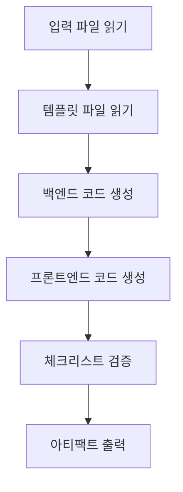

# 단계 5: Code - 실행 가능한 코드 생성

## 학습 후 할 수 있는 것

- **원클릭 풀스택 코드 생성**: UI Schema와 Tech 설계에서 실행 가능한 프론트엔드 및 백엔드 애플리케이션 자동 생성
- **코드 생성 프로세스 이해**: Code Agent가 설계 문서를 프로덕션 준비 완료된 코드로 변환하는 방법 마스터
- **코드 품질 검증**: 생성된 코드의 완전성, 테스트 커버리지 및 보안 기준 검사 방법 학습
- **일반적인 문제 디버그**: 의존성 설치, 타입 검사 및 API 연결 문제 해결

## 현재의 어려움

제품 아이디어의 구조화, PRD 생성, UI 설계 및 기술 아키텍처 설계를 완료했습니다. 다음으로 가장 어려운 부분은:

- **설계를 코드로 어떻게 변환하나요**: UI Schema와 Tech 설계가 문서에 있지만, 어떻게 구현하나요?
- **풀스택 개발이 너무 복잡해요**: 백엔드는 Express + Prisma가 필요하고, 프론트엔드는 React Native가 필요한데, 어디서 시작하나요?
- **코드 품질 보장이 어려워요**: 생성된 코드가 테스트, 문서 및 보안 규격을 충족하는지 어떻게 확인하나요?
- **시간이 부족해요**: MVP를 작성하는 데 며칠이 걸리는데, 더 빠른 방법이 있나요?

Code 단계는 이러한 문제를 해결하기 위해 설계되었습니다. 이전 단계의 설계를 기반으로 프로덕션 준비 완료된 풀스택 코드를 자동으로 생성합니다.

## 이 기술을 사용하는 시기

다음이 필요할 때 사용하세요:

- **아이디어를 빠르게 검증**: 직접 개발에 투입하지 않고 제품 아이디어의 타당성을 코드로 검증
- **애플리케이션 골격 생성**: 처음부터 시작하지 않고 실행 가능한 기반 제공
- **기술 스택 통일**: 프론트엔드 및 백엔드 코드가 일관된 아키텍처와 규격을 따르도록 보장
- **개발 시간 절약**: 설계에서 코드까지 몇 분 만에 MVP 프레임워크 완성

## 핵심 개념

Code Agent는 **풀스택 엔지니어**입니다. 이전 단계의 설계 문서를 실행 가능한 코드로 변환하는 것이 임무입니다. 핵심 특징:

### 입출력

| 타입 | 내용 |
|------|------|
| **입력** | UI Schema(인터페이스 구조), Tech 설계(기술 솔루션), Prisma Schema(데이터 모델) |
| **출력** | `artifacts/backend/`(백엔드 코드), `artifacts/client/`(프론트엔드 코드) |

### 기술 스택

| 부분 | 기술 스택 |
|------|----------|
| **백엔드** | Express + Prisma + TypeScript |
| **프론트엔드** | React Native Web + Expo + TypeScript |
| **데이터베이스** | SQLite(개발) / PostgreSQL(프로덕션) |

### 실행 제약 조건

::: warning 엄격한 범위
Code Agent는 **PRD와 UI Schema에서 확인된 기능만 구현**하며, **추가하지 않음**:
- 인증 및 권한 부여 시스템
- 복잡한 상태 관리(예: Redux)
- 핵심이 아닌 기능 특성
:::

## 따라 해보기

### 1단계: Code 단계 진입

Tech 단계를 완료했다고 가정하고, 코드 생성을 시작하겠습니다.

```bash
# 파이프라인에서 다음 단계로 이동
factory run code

# 또는 특정 단계에서 다시 시작
factory run code
```

**볼 수 있는 것**: CLI는 입력 파일과 예상 출력을 포함한 Code 단계 정보를 표시합니다.

### 2단계: AI 어시스턴트가 Code Agent 실행

AI 어시스턴트는 `agents/code.agent.md`와 `skills/code/skill.md`를 로드하고 실행을 시작합니다.

Code Agent의 실행 흐름:



**AI 어시스턴트가 하는 것**:

1. **템플릿 파일 읽기**(`skills/code/references/backend-template.md`와 `frontend-template.md`)
   - 프로젝트 구조와 코드 조직 방식 이해
   - 디렉토리와 구성 파일 구성 방법 학습

2. **입력 파일 분석**
   - `ui.schema.yaml`에서 페이지 구조와 컴포넌트 이해
   - `tech.md`에서 기술 아키텍처와 API 설계 이해
   - `schema.prisma`에서 데이터 모델 이해

3. **백엔드 코드 생성**
   - Express + Prisma 프로젝트 구조 생성
   - API 라우트 및 컨트롤러 생성
   - 데이터 검증 및 오류 처리 구현
   - 테스트 및 문서 추가

4. **프론트엔드 코드 생성**
   - React Native + Expo 프로젝트 구조 생성
   - 페이지 컴포넌트 및 UI 컴포넌트 생성
   - 데이터 상태 관리 및 API 호출 구현
   - 테스트 및 네비게이션 구성 추가

5. **체크리스트 검증**
   - Code Skill의 체크리스트와 대조
   - 모든 필수 항목 완료 확인

6. **아티팩트 출력**
   - `artifacts/backend/`와 `artifacts/client/` 디렉토리 생성

### 3단계: 생성된 코드 검증

Code Agent가 완료되면 전체 코드 디렉토리 구조가 생성됩니다.

**백엔드 디렉토리 구조**:

```
backend/
├── package.json          # 의존성 및 스크립트
├── tsconfig.json         # TypeScript 구성
├── .env.example          # 환경 변수 템플릿
├── .gitignore            # Git 무시 파일
├── README.md             # 프로젝트 설명
├── GETTING_STARTED.md    # 빠른 시작 가이드
├── prisma/
│   ├── schema.prisma     # 데이터 모델(Tech 단계에서 복사)
│   └── seed.ts           # 시드 데이터
└── src/
    ├── index.ts          # 애플리케이션 진입점
    ├── app.ts            # Express 앱 구성
    ├── config/           # 환경 변수 구성
    ├── lib/              # Prisma 클라이언트
    ├── middleware/       # 오류 처리, 로그
    ├── routes/           # API 라우트
    ├── controllers/      # 컨트롤러
    ├── services/         # 비즈니스 로직
    ├── validators/       # 입력 검증(Zod)
    └── __tests__/        # 테스트 파일
```

**프론트엔드 디렉토리 구조**:

```
client/
├── package.json          # 의존성 및 스크립트
├── tsconfig.json         # TypeScript 구성
├── app.json              # Expo 구성
├── babel.config.js       # Babel 구성
├── .env.example          # 환경 변수 템플릿
├── .gitignore            # Git 무시 파일
├── README.md             # 프로젝트 설명
├── GETTING_STARTED.md    # 빠른 시작 가이드
├── App.tsx               # 애플리케이션 진입점
└── src/
    ├── config/           # 환경 변수 구성
    ├── api/              # API 클라이언트
    ├── components/       # UI 컴포넌트
    ├── hooks/            # 커스텀 Hooks
    ├── navigation/       # 네비게이션 구성
    ├── screens/          # 페이지 컴포넌트
    ├── styles/           # 테마 및 스타일
    └── types/            # 타입 정의
```

**체크포인트 ✅**: 다음 파일들이 존재하는지 확인:

| 파일 | 백엔드 | 프론트엔드 |
|------|--------|----------|
| `package.json` | ✅ | ✅ |
| `tsconfig.json` | ✅ | ✅ |
| `.env.example` | ✅ | ✅ |
| `README.md` | ✅ | ✅ |
| `GETTING_STARTED.md` | ✅ | ✅ |
| 테스트 파일 | ✅ | ✅ |
| Prisma Schema | ✅ | - |

### 4단계: 백엔드 서비스 시작

`backend/GETTING_STARTED.md`의 안내에 따라 서비스를 시작합니다.

```bash
# 백엔드 디렉토리로 이동
cd artifacts/backend

# 의존성 설치
npm install

# 환경 변수 구성
cp .env.example .env

# 데이터베이스 초기화
npx prisma generate
npx prisma migrate dev
npm run db:seed

# 개발 서버 시작
npm run dev
```

**볼 수 있는 것**:

```
Server running on http://localhost:3000
Environment: development
Database connected
```

**체크포인트 ✅**: 헬스 체크 엔드포인트를 방문하여 서비스가 정상 작동하는지 확인합니다.

```bash
curl http://localhost:3000/health
```

다음이 반환되어야 합니다:

```json
{
  "status": "ok",
  "timestamp": "2024-01-29T12:00:00.000Z"
}
```

### 5단계: 프론트엔드 애플리케이션 시작

`client/GETTING_STARTED.md`의 안내에 따라 애플리케이션을 시작합니다.

```bash
# 새 터미널을 열고 프론트엔드 디렉토리로 이동
cd artifacts/client

# 의존성 설치
npm install

# 환경 변수 구성
cp .env.example .env

# 개발 서버 시작
npm start
```

**볼 수 있는 것**: Metro Bundler가 시작되고 실행 옵션이 표시됩니다.

```
› Metro waiting on exp://192.168.x.x:19000
› Scan the QR code above with Expo Go (Android) or the Camera app (iOS)
› Press a │ open Android
› Press i │ open iOS simulator
› Press w │ open web

Logs for your project will appear below.
```

실행 플랫폼 선택:
- `w` 누르기 - 브라우저에서 열기(테스트하기 가장 편리)

**체크포인트 ✅**: 애플리케이션이 브라우저에서 열리고 프론트엔드 인터페이스가 표시됩니다.

### 6단계: 프론트엔드-백엔드 통합 테스트

1. **API 문서 접근**: http://localhost:3000/api-docs
   - Swagger UI 문서 보기
   - 모든 엔드포인트가 정의되어 있는지 확인

2. **프론트엔드 기능 테스트**:
   - 새 데이터 생성
   - 데이터 편집
   - 데이터 삭제
   - 목록 새로고침

3. **콘솔 로그 확인**:
   - 프론트엔드에 API 호출 오류가 있는지
   - 백엔드에 요청 로그가 있는지
   - 처리되지 않은 예외가 있는지

### 7단계: 체크포인트 확인

AI 어시스턴트가 Code 단계 완료를 확인할 때 다음을 볼 수 있습니다:

```
✅ Code 단계 완료

생성된 파일:
- 백엔드: artifacts/backend/ (Express + Prisma + TypeScript)
- 프론트엔드: artifacts/client/ (React Native + Expo + TypeScript)

체크포인트 옵션:
[1] 계속 - Validation 단계로 진입
[2] 재시도 - 코드 다시 생성
[3] 일시 정지 - 현재 상태 저장
```

**계속**을 선택하여 다음 단계로 진행합니다.

## 체크포인트 ✅

Code 단계 완료 후 다음을 확인해야 합니다:

- [ ] 백엔드 코드가 정상적으로 시작됨(`npm run dev`)
- [ ] 프론트엔드 애플리케이션이 브라우저에서 열림
- [ ] 헬스 체크 엔드포인트가 정상 반환
- [ ] API 문서에 접근 가능(`/api-docs`)
- [ ] 프론트엔드가 백엔드 API를 호출할 수 있음
- [ ] 프론트엔드가 Loading 및 Error 상태를 처리함
- [ ] 테스트 파일이 존재하고 실행 가능(`npm test`)

## 함정 경고

### 문제 1: 의존성 설치 실패

**증상**: `npm install` 오류

**해결책**:

```bash
# 캐시를 지우고 재시도
rm -rf node_modules package-lock.json
npm cache clean --force
npm install
```

### 문제 2: Prisma 마이그레이션 실패

**증상**: `npx prisma migrate dev` 오류

**해결책**:

```bash
# 데이터베이스 재설정
npx prisma migrate reset

# 또는 데이터베이스 파일을 수동으로 삭제
rm prisma/dev.db
npx prisma migrate dev
```

### 문제 3: 프론트엔드가 백엔드에 연결할 수 없음

**증상**: 프론트엔드가 `Network Error` 또는 `ECONNREFUSED` 오류를 보여줌

**확인 목록**:

1. 백엔드가 시작되었는지 확인: `curl http://localhost:3000/health`
2. 프론트엔드의 `.env` 구성 확인: `EXPO_PUBLIC_API_URL=http://localhost:3000/api`
3. 실제 기기에서 테스트하는 경우 LAN IP로 변경(예: `http://192.168.1.100:3000/api`)

### 문제 4: 테스트 실패

**증상**: `npm test` 오류

**해결책**:

- 테스트 파일이 존재하는지 확인: `src/__tests__/`
- 테스트 의존성이 설치되었는지 확인: `npm install --save-dev vitest @testing-library/react-native`
- 오류 메시지를 확인하고 코드의 문제를 수정

## Code Agent 특수 요구사항

Code Agent에는 특별한 제약 조건과 요구사항이 있어 주의가 필요합니다:

### 1. 템플릿 파일을 반드시 읽어야 함

코드 생성 전에 Code Agent는 **반드시 완전히 읽어야 함**:
- `skills/code/references/backend-template.md`
- `skills/code/references/frontend-template.md`

이 두 템플릿 파일은 프로덕션 준비 완료된 프로젝트 구조와 예제 코드를 보여줍니다.

### 2. 인증 및 권한 부여 추가 금지

::: warning 범위 제한
Code Agent는 **절대 추가하지 않음**:
- 로그인/등록 기능
- 토큰 인증
- 권한 제어
- 복잡한 상태 관리(예: Redux)
:::

이러한 기능은 후속 반복에서 추가되며, MVP 단계에서는 핵심 비즈니스 로직에만 집중합니다.

### 3. 코드 품질 요구사항

생성된 코드는 다음을 충족해야 합니다:

| 요구사항 | 설명 |
|----------|------|
| **TypeScript** | 엄격 모드, `any` 타입 없음 |
| **테스트** | 헬스 체크, CRUD 엔드포인트, 입력 검증 테스트 |
| **API 문서** | Swagger/OpenAPI 사양(`/api-docs`) |
| **오류 처리** | 통합 오류 처리 미들웨어 |
| **로그** | 구조화된 로그(winston/pino) |
| **보안** | Zod 검증, helmet, CORS 화이트리스트 |
| **문서** | README 및 빠른 시작 가이드 |

## 코드 생성 체크리스트

Code Agent는 다음 체크리스트를 참조하여 코드를 생성합니다.

### 백엔드 필수 항목

- [ ] 환경 변수 지원(dotenv)
- [ ] 의존성 버전 잠금(Prisma 5.x)
- [ ] 타입 정의(JSON 필드 처리)
- [ ] 핵심 의존성: Express + Prisma + Zod + Helmet
- [ ] API 엔드포인트: 헬스 체크 + CRUD
- [ ] 통일된 응답 형식
- [ ] 입력 검증(Zod Schema)
- [ ] 오류 처리 미들웨어
- [ ] 테스트 파일(헬스 체크 + CRUD + 검증)
- [ ] Swagger API 문서
- [ ] 시드 데이터(`prisma/seed.ts`)

### 프론트엔드 필수 항목

- [ ] 핵심 의존성: React Native Web + Expo + React Navigation
- [ ] 영구 저장(AsyncStorage)
- [ ] 네비게이션 구성(React Navigation 6+)
- [ ] 안전 영역(SafeAreaView)
- [ ] API Client(Axios + 인터셉터)
- [ ] 커스텀 Hooks(데이터 관리)
- [ ] 기본 UI 컴포넌트(Button, Input, Card, Loading)
- [ ] 페이지 컴포넌트(최소한 홈 및 상세 페이지)
- [ ] Loading 및 Error 상태 처리
- [ ] 당겨서 새로고침(RefreshControl)
- [ ] 테스트 파일(페이지 렌더링 + 컴포넌트 + Hooks)

## 테스트 및 품질 보증

MVP 단계에서도 Code Agent는 기본 테스트 코드를 생성합니다.

### 백엔드 테스트 예제

```typescript
// src/__tests__/items.test.ts
import { describe, it, expect } from 'vitest';
import request from 'supertest';
import app from '../app';

describe('Items API', () => {
  it('should return health check', async () => {
    const res = await request(app).get('/health');
    expect(res.status).toBe(200);
  });

  it('should create a new item', async () => {
    const res = await request(app)
      .post('/api/items')
      .send({ title: 'Test Item', amount: 100 });

    expect(res.status).toBe(201);
    expect(res.body.data).toHaveProperty('id');
  });

  it('should reject invalid item', async () => {
    const res = await request(app)
      .post('/api/items')
      .send({ title: '' }); // 필수 필드 누락

    expect(res.status).toBe(400);
  });
});
```

### 프론트엔드 테스트 예제

```typescript
// src/screens/__tests__/HomeScreen.test.tsx
import React from 'react';
import { render, screen } from '@testing-library/react-native';
import HomeScreen from '../HomeScreen';

describe('HomeScreen', () => {
  it('should render without crashing', () => {
    render(<HomeScreen />);
    expect(screen.getByText(/home/i)).toBeTruthy();
  });

  it('should show loading state initially', () => {
    render(<HomeScreen />);
    expect(screen.getByTestId('loading-indicator')).toBeTruthy();
  });
});
```

## 빠른 시작 가이드

생성된 각 프로젝트에는 5분 안에 프로젝트를 실행하는 데 도움이 되는 `GETTING_STARTED.md`가 포함됩니다.

### 백엔드 빠른 시작

```bash
# 1. 프로젝트 복제
cd artifacts/backend

# 2. 의존성 설치
npm install

# 3. 환경 변수 구성
cp .env.example .env

# 4. 데이터베이스 초기화
npx prisma generate
npx prisma migrate dev
npm run db:seed

# 5. 서비스 시작
npm run dev
```

### 프론트엔드 빠른 시작

```bash
# 1. 프로젝트 복제
cd artifacts/client

# 2. 의존성 설치
npm install

# 3. 환경 변수 구성
cp .env.example .env

# 4. 애플리케이션 시작
npm start
```

**참고**: 백엔드가 시작되었는지 확인하세요. 그렇지 않으면 프론트엔드가 API에 연결할 수 없습니다.

## 이 강의 요약

Code 단계는 파이프라인의 핵심 단계 중 하나로, 이전 단계의 설계를 실행 가능한 코드로 변환합니다.

**핵심 요점**:

1. **입출력**: Code Agent는 UI Schema, Tech 설계, Prisma Schema를 기반으로 백엔드 및 프론트엔드 코드 생성
2. **기술 스택**: 백엔드는 Express + Prisma 사용, 프론트엔드는 React Native Web + Expo 사용
3. **범위 제어**: PRD와 UI Schema의 기능만 구현하며, 인증 및 권한 부여 추가 없음
4. **품질 보증**: 테스트, API 문서 및 빠른 시작 가이드 생성
5. **검증 기준**: 백엔드 시작 가능, 프론트엔드 렌더링 가능, API 호출 가능

## 다음 강의 예고

> 다음 강의에서는 **[Validation 단계](../stage-validation/)**를 배웁니다.
>
> 배울 내용:
> - 생성된 코드 품질을 검증하는 방법
> - 의존성 설치 및 타입 검사
> - Prisma Schema 검증
> - 검증 보고서 생성

---

## 부록: 소스 코드 참조

<details>
<summary><strong>소스 코드 위치 보기</strong></summary>

> 업데이트 시간: 2026-01-29

| 기능 | 파일 경로 | 라인 |
|------|----------|------|
| Code Agent 정의 | [`agents/code.agent.md`](https://github.com/hyz1992/agent-app-factory/blob/main/agents/code.agent.md) | 1-82 |
| Code Skill | [`skills/code/skill.md`](https://github.com/hyz1992/agent-app-factory/blob/main/skills/code/skill.md) | 1-1488 |
| 백엔드 템플릿 | [`skills/code/references/backend-template.md`](https://github.com/hyz1992/agent-app-factory/blob/main/skills/code/references/backend-template.md) | 1-670 |
| 프론트엔드 템플릿 | [`skills/code/references/frontend-template.md`](https://github.com/hyz1992/agent-app-factory/blob/main/skills/code/references/frontend-template.md) | 1-1231 |
| 파이프라인 정의 | [`pipeline.yaml`](https://github.com/hyz1992/agent-app-factory/blob/main/pipeline.yaml) | 63-77 |

**핵심 제약 조건**:
- PRD와 UI Schema의 기능만 구현(`code.agent.md:25`)
- 인증, 권한 부여 또는 복잡한 상태 관리 추가 금지(`code.agent.md:28`)
- 템플릿 파일을 반드시 완전히 읽어야 함(`code/skill.md:1476`)
- 모든 데이터베이스 작업은 Service 레이어를 통해(`backend-template.md:665`)
- 모든 입력은 반드시 Zod를 통해 검증(`backend-template.md:666`)

**핵심 체크리스트**:
- 백엔드 필수 항목: 환경 변수, 의존성 잠금, 타입 정의(`code.agent.md:37-47`)
- 프론트엔드 필수 항목: 핵심 의존성, 가져오기 경로, 구성 파일(`code.agent.md:50-64`)
- 일반적인 오류 예방(`code.agent.md:65-74`)

</details>
