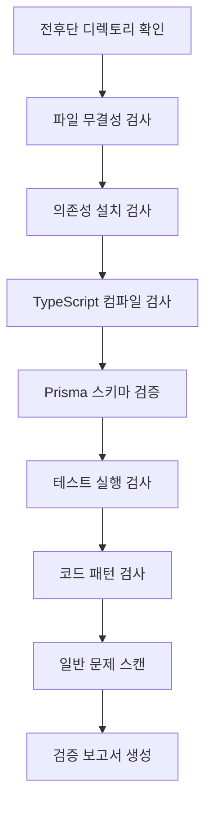

# 단계 6: Validation - 코드 품질 검증

## 학습 완료 후 할 수 있는 것

- **자동화된 코드 검증**: 전후단 코드의 의존성 설치, 타입 검사, 기본 테스트를 원클릭으로 확인
- **검증 보고서 해석**: Validation Agent가 생성한 상세 보고서와 문제 분류 이해
- **신속한 문제 위치 파악**: 보고서의 구체적인 위치와 제안에 따라 코드 오류 수정
- **코드 품질 보장**: 생성된 코드가 프로덕션 준비 기준을 충족하도록 검증

## 현재 당신의 곤경

Code 단계를 완료하여 전후단 코드를 생성했지만, 가장 골치 아픈 것은:

- **코드가 실행 가능한가**: 의존성이 모두 올바르게 설치되었는가? 타입 검사를 통과하는가?
- **Prisma가 올바른가**: 스키마 구문에 문제가 있는가? 클라이언트를 생성할 수 있는가?
- **테스트가 신뢰할 수 있는가**: 테스트가 있는가? 통과하는가?
- **함정이 있는가**: 환경 변수 설정이 올바른가? 임포트 경로가 정확한가?

이러한 문제들을 하나씩 수동으로 확인하는 데는 오랜 시간이 걸리며, 쉽게 누락될 수 있습니다. Validation 단계는 바로 이러한 문제들을 해결하기 위해 설계되었습니다—자동으로 코드 품질을 검증하고 상세한 보고서를 생성합니다.

## 이 방법을 사용해야 할 때

다음이 필요할 때:

- **신속한 코드 검증**: 생성된 코드가 기본적인 품질 기준을 충족하는지 확인
- **잠재적 문제 발견**: 배포 전 의존성, 타입, 테스트 등의 문제 파악
- **코드 품질 보장**: 전후단 코드가 기본 검사를 통과하도록 확인
- **배포 실패 방지**: 사전에 문제를 발견하여 재작업 비용 감소

## 핵심 개념

Validation Agent는 **품질 검사원**입니다. Code Agent가 생성한 코드가 품질 기준에 부합하는지 확인하는 것이 그 임무입니다. 핵심 특징:

### 입출력

| 유형 | 내용 |
|------|------|
| **입력** | `artifacts/backend/` (백엔드 코드), `artifacts/client/` (프론트엔드 코드) |
| **출력** | `artifacts/validation/report.md` (검증 보고서) |

### 검증 항목

Validation Agent는 8대 분류의 검사를 실행합니다:

| 검사 항목 | 설명 |
|-----------|------|
| **파일 무결성** | 모든 필수 파일이 존재하는지 확인 |
| **의존성 설치** | `package.json` 의존성이 정상적으로 해결되는지 검증 |
| **TypeScript 컴파일** | 코드가 타입 검사를 통과하는지 확인 |
| **Prisma 스키마** | 데이터 모델 구문이 올바른지 검증 |
| **테스트 실행** | 테스트가 존재하고 통과하는지 확인 |
| **코드 규격** | lint 스크립트 설정 확인 |
| **핵심 패턴** | 코드에서 핵심 패턴(오류 처리, 헬스 체크 등) 스캔 |
| **일반 문제** | 알려진 오류 패턴 식별 |

### 실행 제약

::: warning 읽기 전용 모드
Validation Agent는 **검증만 하고 수정하지 않습니다**:
- 어떤 코드 파일도 수정할 수 없음
- 실제 의존성 설치 금지 (`--dry-run` 사용)
- 부작용이 있는 명령 실행 금지
:::

## 함께 해보기

### 1단계: Validation 단계 진입

Code 단계를 완료했다고 가정하고, 이제 코드 품질 검증을 시작하려고 합니다.

```bash
# 파이프라인에서라면, 다음 단계로 바로 진입
factory run validation

# 또는 특정 단계부터 다시 시작
factory run validation
```

**확인해야 할 사항**: CLI가 Validation 단계 정보(입력 파일 및 예상 출력 포함)를 표시합니다.

### 2단계: AI 어시스턴트가 Validation Agent 실행

AI 어시스턴트가 `agents/validation.agent.md`를 로드한 후 실행을 시작합니다.

Validation Agent의 실행 플로우:



**AI 어시스턴트가 하는 일**:

1. **백엔드 디렉토리 확인**
   - `artifacts/backend/` 존재 확인
   - 필수 파일 확인: `package.json`, `tsconfig.json`, `.env.example`, `prisma/schema.prisma`

2. **프론트엔드 디렉토리 확인**
   - `artifacts/client/` 존재 확인
   - 필수 파일 확인: `package.json`, `tsconfig.json`, `app.json`, `App.tsx`

3. **의존성 설치 확인**
   - 백엔드: `cd artifacts/backend && npm install --dry-run`
   - 프론트엔드: `cd artifacts/client && npm install --dry-run`
   - 의존성이 정상적으로 해결되는지 검증

4. **TypeScript 컴파일 확인**
   - 백엔드: `cd artifacts/backend && npx tsc --noEmit`
   - 프론트엔드: `cd artifacts/client && npx tsc --noEmit`
   - 코드가 타입 검사를 통과하는지 확인

5. **Prisma 스키마 검증**
   - `cd artifacts/backend && npx prisma validate`
   - 데이터 모델 구문이 올바른지 검증

6. **테스트 실행 확인**
   - 백엔드: `cd artifacts/backend && npm test`
   - 프론트엔드: `cd artifacts/client && npm test`
   - 테스트가 존재하고 통과하는지 확인

7. **코드 패턴 확인**
   - 핵심 패턴 스캔: 오류 처리, 헬스 체크, SafeAreaView 등
   - 의존성 설정 확인: dotenv, React Native Web 등

8. **일반 문제 스캔**
   - SQLite에서 `type` 사용으로 정의
   - 환경 변수 값에 인용 부호
   - 잘못된 임포트 경로
   - 누락된 필수 임포트

9. **검증 보고서 생성**
   - 모든 확인 결과를 요약
   - 발견된 문제 나열
   - 수정 제안 제공
   - `artifacts/validation/report.md`에 저장

### 3단계: 검증 보고서 확인

Validation Agent가 완료되면 상세한 검증 보고서가 생성됩니다.

`artifacts/validation/report.md`를 열어보세요:

```bash
cat artifacts/validation/report.md
```

**확인해야 할 사항**:

```markdown
# 코드 검증 보고서

**생성 시간**: 2026-01-29 12:00:00
**검증 결과**: ✅ 통과

## 요약

- 백엔드 검증: ✅
- 프론트엔드 검증: ✅
- 전체 평가: 코드 품질이 MVP 기준을 충족하며, Preview 단계로 진입할 수 있음

---

## 백엔드 검증 상세

### 파일 무결성
| 파일 | 상태 |
|------|------|
| package.json | ✅ |
| tsconfig.json | ✅ |
| .env.example | ✅ |
| prisma/schema.prisma | ✅ |
| src/index.ts | ✅ |
| src/app.ts | ✅ |

### 의존성 설치
- 상태: ✅
- 상세: 모든 의존성이 정상적으로 해결됨

### TypeScript 컴파일
- 상태: ✅
- 오류 수: 0

### Prisma 검증
- 상태: ✅
- 상세: Prisma 스키마 구문이 올바름

### 테스트 실행
- 상태: ✅
- 테스트 수: 12
- 통과 수: 12
- 실패 수: 0

### 코드 패턴 확인
| 확인 항목 | 상태 |
|--------|------|
| 오류 처리 미들웨어 | ✅ |
| 헬스 체크 엔드포인트 | ✅ |
| 환경 변수 사용 | ✅ |
| Prisma Client 임포트 | ✅ |
| 테스트 파일 존재 | ✅ |
| dotenv 첫 행 임포트 | ✅ |

---

## 프론트엔드 검증 상세

### 파일 무결성
| 파일 | 상태 |
|------|------|
| package.json | ✅ |
| tsconfig.json | ✅ |
| app.json | ✅ |
| App.tsx | ✅ |
| src/navigation/index.tsx | ✅ |

### 의존성 설치
- 상태: ✅
- 상세: 모든 의존성이 정상적으로 해결됨

### TypeScript 컴파일
- 상태: ✅
- 오류 수: 0

### 테스트 실행
- 상태: ✅
- 테스트 수: 8
- 통과 수: 8
- 실패 수: 0

### 코드 패턴 확인
| 확인 항목 | 상태 |
|--------|------|
| SafeAreaView 사용 | ✅ |
| 로딩 컴포넌트 | ✅ |
| 오류 처리 | ✅ |
| API 호출 래핑 | ✅ |
| React Native Web 의존성 | ✅ |
| async-storage 의존성 | ✅ |

---

## 발견된 문제

심각한 문제 또는 경고 없음

---

## 수정 제안

수정 불필요

---

## 결론

코드 품질이 MVP 기준을 충족하며, Preview 단계 진입을 권장합니다.
```

### 4단계: 검증 실패 상황 처리

검증이 실패하면 보고서에 구체적인 문제와 수정 제안이 나열됩니다.

**예시: 부분 통과 검증 보고서**

```markdown
**검증 결과**: ⚠️ 부분 통과

## 발견된 문제

### 심각한 문제 (반드시 수정)

1. TypeScript 컴파일 오류
   - 위치: src/controllers/items.ts:15
   - 오류: Property 'title' does not exist on type 'any'
   - 제안: 타입 정의 추가 `const item: Item = req.body;`

2. Prisma 스키마 검증 실패
   - 위치: prisma/schema.prisma:10
   - 오류: Invalid datasource provider 'sqlite'
   - 제안: `provider = "sqlite"`를 `provider = "postgresql"`로 변경

### 경고 (수정 권장)

1. 테스트 파일 누락
   - 위치: src/controllers/
   - 제안: 각 컨트롤러에 테스트 파일 추가

2. 환경 변수 설정 불완전
   - 위치: .env.example
   - 제안: `DATABASE_URL` 예시 추가

## 수정 제안

1. TypeScript 오류 수정: `src/controllers/items.ts`에 타입 정의 추가
2. Prisma 스키마 업데이트: 데이터 소스 provider 수정
3. 오류 처리 미들웨어 생성: `src/middleware/error.ts` 추가
4. 프론트엔드 테스트 수정: 실패한 테스트 케이스 확인 및 수정
5. 로딩 컴포넌트 생성: `src/components/Loading.tsx` 추가
```

**수정 절차**:

1. **문제 파일 위치 파악**
   ```bash
   # 문제 파일 열기
   vim artifacts/backend/src/controllers/items.ts
   ```

2. **코드 수정**
   ```typescript
   // 타입 정의 추가
   const item: Item = req.body;
   ```

3. **Prisma 스키마 업데이트**
   ```prisma
   datasource db {
     provider = "postgresql"  // postgresql로 수정
     url      = env("DATABASE_URL")
   }
   ```

4. **재검증**
   ```bash
   # Validation 단계 재실행
   factory run validation
   ```

### 5단계: 체크포인트 확인

AI 어시스턴트가 Validation 단계 완료를 확인하면 다음을 확인할 수 있습니다:

```
✅ Validation 단계 완료

생성된 파일:
- 검증 보고서: artifacts/validation/report.md

검증 결과: ✅ 통과 / ⚠️ 부분 통과 / ❌ 실패

체크포인트 옵션:
[1] 계속 - Preview 단계로 진입
[2] 재시도 - 코드 재검증
[3] 일시 정지 - 현재 상태 저장
```

- 검증이 통과되면 **계속**을 선택하여 다음 단계로 진행
- 문제가 있으면 수정한 후 **재시도**를 선택하여 재검증
- 수정에 시간이 필요하면 **일시 정지**를 선택하여 현재 상태 저장

## 체크포인트 ✅

Validation 단계를 완료한 후 확인해야 할 사항:

- [ ] 백엔드와 프론트엔드의 모든 필수 파일이 존재함
- [ ] 의존성이 정상적으로 해결됨 (`npm install --dry-run`)
- [ ] TypeScript 컴파일에 오류 없음 (`npx tsc --noEmit`)
- [ ] Prisma 스키마 검증 통과 (`npx prisma validate`)
- [ ] 테스트 파일이 존재하고 통과함 (`npm test`)
- [ ] 핵심 패턴 확인이 모두 통과함
- [ ] 검증 보고서가 생성됨 (`artifacts/validation/report.md`)

## 함정 주의사항

### 문제 1: 의존성 설치 실패

**증상**: `npm install --dry-run` 오류

**해결 방법**:

```bash
# package.json 구문 확인
cat artifacts/backend/package.json

# 일반적인 문제:
# - 인용 부호 누락
# - 의존성 이름 오류
# - 버전 형식 불일치

# 수정 후 재검증
factory run validation
```

### 문제 2: TypeScript 컴파일 오류

**증상**: `npx tsc --noEmit` 오류

**일반적인 오류 유형**:

| 오류 | 원인 | 해결 방법 |
|------|------|----------|
| `Property does not exist` | 타입이 정의되지 않음 | 타입 정의 추가 |
| `Module not found` | 임포트 경로 오류 | 임포트 경로 확인 |
| `Implicit any` | 암시적 any 타입 | 엄격 모드 활성화 및 타입 추가 |

### 문제 3: Prisma 스키마 검증 실패

**증상**: `npx prisma validate` 오류

**일반적인 오류**:

| 오류 | 원인 | 해결 방법 |
|------|------|----------|
| `Invalid datasource provider` | provider 오류 | `postgresql` 또는 `sqlite` 사용 |
| `Error parsing` | 구문 오류 | model 정의 확인 |
| `Relation error` | 관계 정의 오류 | `@relation` 필드 확인 |

### 문제 4: 테스트 실패

**증상**: `npm test` 오류

**해결 방법**:

```bash
# 테스트 파일 존재 여부 확인
find artifacts/backend -name "*.test.ts"

# 테스트 의존성 설치 여부 확인
cat artifacts/backend/package.json | grep -A 5 "devDependencies"

# 테스트 의존성 누락 시 수동 설치
cd artifacts/backend
npm install --save-dev vitest @testing-library/react-native
```

### 문제 5: 핵심 패턴 확인 실패

**증상**: 보고서에 핵심 패턴 누락 표시

**일반적인 누락 패턴**:

| 패턴 | 위치 | 수정 방법 |
|------|------|----------|
| 오류 처리 미들웨어 | `src/middleware/error.ts` | 오류 처리 미들웨어 추가 |
| 헬스 체크 엔드포인트 | `src/routes/health.ts` | `/health` 라우트 추가 |
| dotenv 첫 행 임포트 | `src/index.ts:1` | `import 'dotenv/config';` 추가 |
| SafeAreaView | `src/screens/Home.tsx` | SafeAreaView로 콘텐츠 감싸기 |

## Validation Agent 특별 요구사항

Validation Agent에는 특별한 제약과 요구사항이 있어 주의가 필요합니다:

### 1. 읽기 전용 모드

::: warning 코드 수정 금지
Validation Agent는 **어떤 코드 파일도 절대 수정해서는 안 됩니다**. 검증과 보고서 생성만 수행합니다.
:::

### 2. Dry-run 설치

의존성 설치 확인은 `--dry-run` 매개변수를 사용하여 실제로 의존성을 설치하지 않습니다:

```bash
npm install --dry-run  # 의존성이 해결 가능한지만 확인
```

### 3. 완전한 보고서

Validation Agent는 **반드시** 완전한 검증 보고서를 생성해야 합니다. 포함 내용:

| 섹션 | 내용 |
|------|------|
| **요약** | 백엔드/프론트엔드 검증 상태 및 전체 평가 |
| **백엔드 상세** | 파일 무결성, 의존성, 컴파일, Prisma, 테스트, 패턴 확인 |
| **프론트엔드 상세** | 파일 무결성, 의존성, 컴파일, 테스트, 패턴 확인 |
| **발견된 문제** | 심각한 문제 및 경고 목록 |
| **수정 제안** | 문제에 대한 구체적인 수정 단계 |
| **결론** | 전체 평가 및 다음 단계 제안 |

### 4. 문제 등급 분류

Validation Agent는 문제를 세 등급으로 분류합니다:

| 등급 | 기준 | 처리 방법 |
|------|------|----------|
| **심각한 문제** | 반드시 수정해야 통과 가능 | 보고서에서 "반드시 수정"으로 표시 |
| **경고** | 수정 권장하지만 치명적이지 않음 | 보고서에서 "수정 권장"으로 표시 |
| **정보** | 참고용 | 검증 결과에 영향 없음 |

## 검증 결과 판정

Validation Agent는 확인 결과에 따라 검증 상태를 판정합니다.

### 통과 조건 (✅ 통과)

- 모든 필수 파일이 존재함
- 의존성 설치에 오류 없음
- TypeScript 컴파일에 오류 없음
- Prisma 스키마 검증 통과
- 기본 테스트가 존재하고 모두 통과함
- 핵심 패턴 확인이 모두 통과함

### 부분 통과 조건 (⚠️ 부분 통과)

- 필수 파일이 존재함
- 의존성 설치에 오류 없음
- TypeScript 컴파일에 경고가 있지만 오류 없음
- 테스트가 존재하지만 일부 실패 (< 30% 실패율)
- 비핵심 문제가 존재함

### 실패 조건 (❌ 실패)

- 필수 파일이 누락됨
- 의존성 설치 실패
- TypeScript 컴파일에 오류 있음
- Prisma 스키마 검증 실패
- 테스트가 누락되거나 대량 실패 (≥ 30% 실패율)

## 코드 품질 확인 목록

Validation Agent는 다음 확인 목록에 따라 검증을 수행합니다.

### 백엔드 필수 항목

- [ ] `package.json` 존재
- [ ] `tsconfig.json` 존재
- [ ] `.env.example` 존재
- [ ] `prisma/schema.prisma` 존재
- [ ] `src/index.ts` 존재
- [ ] `src/app.ts` 존재
- [ ] `src/index.ts` 첫 행에 dotenv 임포트
- [ ] dotenv가 dependencies에 있음
- [ ] 오류 처리 미들웨어 존재
- [ ] 헬스 체크 엔드포인트 존재 (`/health`)
- [ ] 환경 변수가 `process.env` 사용
- [ ] Prisma Client 임포트가 올바름
- [ ] 최소 하나의 테스트 파일 존재
- [ ] package.json에 `test` 스크립트 포함

### 프론트엔드 필수 항목

- [ ] `package.json` 존재
- [ ] `tsconfig.json` 존재
- [ ] `app.json` 존재
- [ ] `App.tsx` 존재
- [ ] `src/navigation/index.tsx` 존재
- [ ] SafeAreaView 사용 존재
- [ ] 로딩 컴포넌트 존재
- [ ] 오류 처리 존재
- [ ] API 호출이 래핑 계층을 통해 이루어짐
- [ ] React Native Web 의존성 포함
- [ ] async-storage 의존성 포함
- [ ] `app.json`이 존재하지 않는 이미지 파일을 참조하지 않음

## 일반 문제 스캔

Validation Agent는 다음 알려진 문제 패턴을 스캔합니다:

| 확인 항목 | 탐지 방법 | 수정 제안 |
|-----------|-----------|----------|
| SQLite에서 `type` 사용으로 정의 | schema.prisma에 `type Xxx`가 포함되어 있는지 확인 | `type` 정의 제거 |
| 환경 변수 값에 인용 부호 | .env에 `="xxx"` 또는 `='xxx'`가 포함되어 있는지 확인 | 인용 부호 제거 |
| Prisma 버전이 7.x | package.json에서 prisma 버전이 ^7인지 확인 | Prisma 5.x 사용 권장 |
| 잘못된 임포트 경로 | screens에 `from './ui/'`가 있는지 확인 | `from '../components/ui/'`로 변경 |
| View 임포트 누락 | 컴포넌트가 View를 사용하지만 임포트하지 않았는지 확인 | `import { View } from 'react-native'` 추가 |
| 문자열 종료되지 않음 | .tsx 파일에 연속된 인용 부호가 있는지 확인 | 누락된 인용 부호 추가 |

## 검증 보고서 예시

### 통과된 검증 보고서

```markdown
# 코드 검증 보고서

**생성 시간**: 2026-01-29 12:00:00
**검증 결과**: ✅ 통과

## 요약

- 백엔드 검증: ✅
- 프론트엔드 검증: ✅
- 전체 평가: 코드 품질이 MVP 기준을 충족하며, Preview 단계로 진입할 수 있음

---

## 백엔드 검증 상세

### 파일 무결성
| 파일 | 상태 |
|------|------|
| package.json | ✅ |
| tsconfig.json | ✅ |
| .env.example | ✅ |
| prisma/schema.prisma | ✅ |
| src/index.ts | ✅ |
| src/app.ts | ✅ |

### 의존성 설치
- 상태: ✅
- 상세: 모든 의존성이 정상적으로 해결됨

### TypeScript 컴파일
- 상태: ✅
- 오류 수: 0

### Prisma 검증
- 상태: ✅
- 상세: Prisma 스키마 구문이 올바름

### 테스트 실행
- 상태: ✅
- 테스트 수: 12
- 통과 수: 12
- 실패 수: 0

### 코드 패턴 확인
| 확인 항목 | 상태 |
|--------|------|
| 오류 처리 미들웨어 | ✅ |
| 헬스 체크 엔드포인트 | ✅ |
| 환경 변수 사용 | ✅ |
| Prisma Client 임포트 | ✅ |
| 테스트 파일 존재 | ✅ |
| dotenv 첫 행 임포트 | ✅ |

---

## 프론트엔드 검증 상세

### 파일 무결성
| 파일 | 상태 |
|------|------|
| package.json | ✅ |
| tsconfig.json | ✅ |
| app.json | ✅ |
| App.tsx | ✅ |
| src/navigation/index.tsx | ✅ |

### 의존성 설치
- 상태: ✅
- 상세: 모든 의존성이 정상적으로 해결됨

### TypeScript 컴파일
- 상태: ✅
- 오류 수: 0

### 테스트 실행
- 상태: ✅
- 테스트 수: 8
- 통과 수: 8
- 실패 수: 0

### 코드 패턴 확인
| 확인 항목 | 상태 |
|--------|------|
| SafeAreaView 사용 | ✅ |
| 로딩 컴포넌트 | ✅ |
| 오류 처리 | ✅ |
| API 호출 래핑 | ✅ |
| React Native Web 의존성 | ✅ |
| async-storage 의존성 | ✅ |

---

## 발견된 문제

심각한 문제 또는 경고 없음

---

## 수정 제안

수정 불필요

---

## 결론

코드 품질이 MVP 기준을 충족하며, Preview 단계 진입을 권장합니다.
```

### 실패한 검증 보고서

```markdown
# 코드 검증 보고서

**생성 시간**: 2026-01-29 12:00:00
**검증 결과**: ❌ 실패

## 요약

- 백엔드 검증: ❌
- 프론트엔드 검증: ⚠️
- 전체 평가: 백엔드에 심각한 문제가 있어 계속하기 전에 반드시 수정해야 함

---

## 발견된 문제

### 심각한 문제 (반드시 수정)

1. TypeScript 컴파일 오류
   - 위치: src/controllers/items.ts:15
   - 오류: Property 'title' does not exist on type 'any'
   - 제안: 타입 정의 추가 `const item: Item = req.body;`

2. Prisma 스키마 검증 실패
   - 위치: prisma/schema.prisma:10
   - 오류: Invalid datasource provider 'sqlite'
   - 제안: `provider = "sqlite"`를 `provider = "postgresql"`로 변경

3. 필수 파일 누락
   - 위치: src/
   - 파일: src/middleware/error.ts
   - 제안: 오류 처리 미들웨어 생성

### 경고 (수정 권장)

1. 프론트엔드 테스트 실패
   - 위치: src/screens/__tests__/HomeScreen.test.tsx
   - 실패: 2/8 테스트 실패
   - 제안: 테스트 케이스 수정

2. 로딩 컴포넌트 누락
   - 위치: src/components/
   - 제안: 로딩 컴포넌트 생성 및 올바르게 사용

---

## 수정 제안

1. TypeScript 오류 수정: `src/controllers/items.ts`에 타입 정의 추가
2. Prisma 스키마 업데이트: 데이터 소스 provider를 postgresql로 수정
3. 오류 처리 미들웨어 생성: `src/middleware/error.ts` 추가
4. 프론트엔드 테스트 수정: 실패한 테스트 케이스 확인 및 수정
5. 로딩 컴포넌트 생성: `src/components/Loading.tsx` 추가

---

## 결론

백엔드에 심각한 문제가 있어 계속하기 전에 반드시 수정해야 합니다. 권장사항:
1. TypeScript 컴파일 오류 수정
2. Prisma 스키마 업데이트
3. 누락된 파일 추가
4. Validation 단계 재실행
```

## 본 수업 요약

Validation 단계는 파이프라인의 품질 보증 단계로, 생성된 코드가 기본적인 품질 기준을 충족하도록 합니다.

**핵심 포인트**:

1. **검증 프로세스**: Validation Agent가 파일 무결성, 의존성, 컴파일, 테스트 등을 자동으로 검사
2. **읽기 전용 모드**: `--dry-run`을 사용하여 검증만 하고 수정하지 않음, 부작용 방지
3. **문제 분류**: 문제를 심각, 경고, 정보 세 등급으로 분류
4. **상세 보고서**: 구체적인 위치와 수정 제안이 포함된 검증 보고서 생성
5. **결과 판정**: 검사 결과에 따라 통과/부분 통과/실패 판정

## 다음 수업 예고

> 다음 수업에서는 **[Preview 단계](../stage-preview/)**를 학습합니다.
>
> 배울 내용:
> - 실행 설명 문서 생성 방법
> - 빠른 시작 가이드
> - 배포 설정 (Docker, CI/CD)

---

## 부록: 소스 코드 참조

<details>
<summary><strong>클릭하여 소스 코드 위치 보기</strong></summary>

> 업데이트 시간: 2026-01-29

| 기능 | 파일 경로 | 라인 번호 |
|------|----------|------|
| Validation Agent 정의 | [`agents/validation.agent.md`](https://github.com/hyz1992/agent-app-factory/blob/main/agents/validation.agent.md) | 1-320 |
| 파이프라인 정의 | [`pipeline.yaml`](https://github.com/hyz1992/agent-app-factory/blob/main/pipeline.yaml) | 79-96 |

**핵심 제약**:
- 모든 코드 파일 수정 금지 (`validation.agent.md:293`)
- 실제 의존성 설치 금지, `--dry-run` 사용 (`validation.agent.md:294`)
- 완전한 검증 보고서 생성 필수 (`validation.agent.md:296`)
- 구체적인 수정 제안 제공 필수 (`validation.agent.md:298`)

**검증 항목**:
- 파일 무결성 검사 (`validation.agent.md:24-42`)
- 의존성 설치 검사 (`validation.agent.md:43-53`)
- TypeScript 컴파일 검사 (`validation.agent.md:55-65`)
- Prisma Schema 검증 (`validation.agent.md:67-73`)
- 테스트 실행 검사 (`validation.agent.md:75-85`)
- 코드 규격 검사 (`validation.agent.md:87-97`)
- 핵심 패턴 검사 (`validation.agent.md:99-122`)
- 일반 문제 스캔 (`validation.agent.md:124-136`)

**검증 결과 판정**:
- 통과 조건 (`validation.agent.md:268-274`)
- 부분 통과 조건 (`validation.agent.md:276-281`)
- 실패 조건 (`validation.agent.md:283-288`)

**실행 플로우**:
- 조작 단계 (`validation.agent.md:303-313`)
- 출력 형식 (`validation.agent.md:139-262`)

</details>
