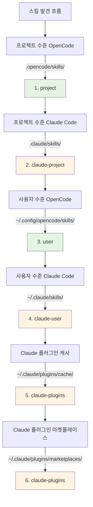

# Claude Code 스킬 호환성

## 이 수업을 마치면 할 수 있는 것

- 플러그인이 Claude Code 스킬 형식을 자동으로 호환하는 방식 이해
- 도구 매핑 메커니즘을 마스터하여 Claude 스킬이 OpenCode에서 올바르게 작동하도록 함
- 스킬 발견의 전체 우선순위 규칙 이해
- Claude 플러그인 마켓플레이스의 기존 스킬을 다시 작성하지 않고 재사용

## 현재의 어려움

Claude Code 스킬이 이미 있거나 Claude 플러그인 마켓플레이스의 스킬을 사용하려고 하지만, 이러한 스킬은 Claude Code용으로 작성되었습니다. OpenCode에서 직접 사용하면 문제가 발생합니다:

- Claude 스킬의 도구 호출(예: `TodoWrite`, `Task`)이 OpenCode에 존재하지 않음
- OpenCode가 설치된 Claude 플러그인 스킬을 어떻게 찾는지 불분명
- 스킬 형식이 호환되지 않을까 걱정하여 모든 내용을 다시 작성해야 함

## 핵심 아이디어

OpenCode Agent Skills 플러그인은 **3단계 호환 메커니즘**을 통해 수정 없이 Claude Code 스킬을 사용할 수 있게 해줍니다:

1. **자동 발견** - Claude Code의 표준 디렉터리(`.claude/skills/`, `~/.claude/plugins/`)에서 스킬 스캔
2. **도구 매핑** - 스킬 로드 시 자동으로 도구 매핑 가이드를 주입하여 Claude 도구명을 OpenCode 도구명으로 변환
3. **형식 지원** - Claude 플러그인의 v1 및 v2 두 가지 설치 형식 모두 지원

::: info 핵심 개념
**Claude Code 스킬 형식** - Anthropic이 정의한 스킬 사양으로, `SKILL.md` 파일을 사용하여 스킬을 설명하며, YAML frontmatter(메타데이터)와 Markdown 콘텐츠(지침)를 포함합니다.
:::

### 도구 매핑 원리

플러그인이 Claude Code로 작성된 스킬을 감지하면 자동으로 도구 매핑 가이드를 주입합니다:

| Claude Code 도구 | OpenCode 도구 | 매핑 규칙 |
| --- | --- | ---|
| `TodoWrite/TodoRead` | `todowrite/todoread` | 소문자 |
| `Task` (하위 에이전트) | `task` (subagent_type 파라미터 사용) | 파라미터 변경 |
| `Skill` | `use_skill` | 도구명 교체 |
| `Read/Write/Edit/Bash/Glob/Grep/WebFetch` | `read/write/edit/bash/glob/grep/webfetch` | 소문자 |

**매핑 방식**: 플러그인은 스킬을 로드할 때 매핑 가이드를 XML 형식으로 세션 컨텍스트에 주입하고, AI는 이에 따라 올바른 도구를 호출합니다.

::: tip 매핑이 필요한 이유는?
Claude Code와 OpenCode의 도구 명명 규칙이 다릅니다. Claude는 PascalCase(예: `TodoWrite`)를 사용하고, OpenCode는 소문자(예: `todowrite`)를 사용합니다. 도구 매핑을 통해 AI가 호출을 변환하는 방법을 알 수 있게 해줍니다.
:::

### 스킬 발견 우선순위

플러그인은 다음 순서로 스킬을 발견하며, **첫 번째로 매칭된 스킬이 적용**됩니다(동일 이름의 스킬은 중복되지 않음):



**우선순위 규칙**:
- 프로젝트 수준 스킬이 사용자 수준 스킬을 덮어씀(프로젝트 맞춤화 용이)
- OpenCode 스킬이 Claude 스킬보다 우선(혼란 방지)
- 동일 이름의 스킬은 처음 발견된 버전만 유지

::: details 예시: 동일 이름 스킬 덮어쓰기
두 위치에 모두 `git-helper`라는 이름의 스킬이 있다고 가정:
- `.claude/skills/git-helper/SKILL.md` (Claude 버전)
- `.opencode/skills/git-helper/SKILL.md` (OpenCode 버전)

**결과**: OpenCode 버전이 적용됨(우선순위가 더 높음)
:::

## 🎒 시작 전 준비 사항

- OpenCode Agent Skills 플러그인이 설치 및 설정됨
- 기본 스킬 개념 이해(권장: [OpenCode Agent Skills란?](../../start/what-is-opencode-agent-skills/) 먼저 읽기)
- (선택사항) Claude Code에 설치된 플러그인이나 스킬 있음

## 따라 하기

### 1단계: Claude 스킬이 발견되는지 확인

**이유**
플러그인이 Claude Code 스킬 디렉터리를 올바르게 스캔할 수 있는지 확인합니다.

OpenCode에서 도구 호출:

```
get_available_skills()
```

**볼 수 있는 내용**: 반환된 스킬 목록에 `.claude/skills/`, `~/.claude/skills/`, `~/.claude/plugins/`의 스킬이 포함되어 있으며, 각 스킬의 `source` 필드에 소스가 표시됨(예: `claude-project`, `claude-user`, `claude-plugins`).

**체크포인트 ✅**: 목록에 예상된 Claude 스킬이 포함되어 있는지 확인.

### 2단계: Claude 스킬 로드

**이유**
도구 매핑 메커니즘이 정상적으로 작동하는지 검증합니다.

Claude 스킬을 로드하려면 도구 호출:

```
use_skill(skill="your-skill-name")
```

**볼 수 있는 내용**: `Skill "xxx" loaded.`와 같은 성공 메시지가 반환됨.

**체크포인트 ✅**: 이제 AI가 해당 스킬의 지침을 사용할 수 있음.

### 3단계: 도구 매핑이 적용되는지 확인

**이유**
AI가 OpenCode의 도구를 Claude의 도구 대신 올바르게 호출하는지 확인합니다.

AI에 해당 스킬 도구가 필요한 작업을 요청합니다. 예:

```
스킬의 todo 기능을 사용하여 작업 목록을 만들어주세요.
```

**볼 수 있는 내용**: AI가 Claude의 `TodoWrite` 도구 대신 OpenCode의 `todowrite` 도구를 올바르게 호출함.

::: tip 매핑이 적용되는지 어떻게 확인하나요?
디버그 모드가 활성화된 경우 AI의 도구 호출 로그를 확인하면, `todowrite`를 호출하는 것을 볼 수 있고 `TodoWrite`는 호출하지 않습니다.
:::

**체크포인트 ✅**: 도구 호출이 성공하고 작업이 완료됨.

## 문제 해결 팁

### 1. 플러그인 형식 불일치

**문제**: 이전 버전의 Claude 플러그인이 v1 형식을 사용하고 최신 버전이 v2 형식을 사용하여 일부 스킬을 발견할 수 없음.

**원인**: v1과 v2의 `installed_plugins.json` 구조가 다름.

**해결**: 플러그인은 두 형식을 모두 지원하며 수동 변환이 필요하지 않음. 그럼에도 스킬을 발견할 수 없는 경우, `~/.claude/plugins/installed_plugins.json`이 존재하고 형식이 올바른지 확인.

### 2. 도구 매핑이 적용되지 않음

**문제**: AI가 여전히 Claude 도구명을 호출하여 오류가 발생함.

**원인**: 스킬 콘텐츠가 도구 매핑 가이드를 우회하거나 하드코딩된 도구 호출을 사용했을 수 있음.

**해결**:
- 스킬이 로드된 후에 사용하는지, 도구를 직접 호출하는 것이 아닌지 확인
- 스킬에 코드 예시가 있는 경우, 도구명을 OpenCode 형식으로 수동으로 변경

### 3. 스킬 이름 충돌

**문제**: 같은 이름의 스킬이 서로 다른 위치에 있을 때 잘못된 버전이 로드됨.

**원인**: 스킬 발견 우선순위로 인한 덮어쓰기.

**해결**:
- 스킬의 `source` 필드를 확인하여 출처 확인
- 네임스페이스 형식을 사용하여 출처를 명확히 지정: `use_skill(skill="user:skill-name")` 또는 `use_skill(skill="claude-plugins:skill-name")`

::: details 네임스페이스 구문
플러그인은 `namespace:skill-name` 형식을 지원합니다:
- `project:skill-name` - 프로젝트 수준 OpenCode 스킬
- `claude-project:skill-name` - 프로젝트 수준 Claude 스킬
- `user:skill-name` - 사용자 수준 OpenCode 스킬
- `claude-user:skill-name` - 사용자 수준 Claude 스킬
- `claude-plugins:skill-name` - Claude 플러그인 마켓플레이스 스킬
:::

## 수업 요약

OpenCode Agent Skills 플러그인은 3단계 호환 메커니즘을 통해 Claude Code 스킬을 원활하게 재사용할 수 있게 해줍니다:

- **자동 발견** - 6개 위치에서 스킬을 스캔하여 프로젝트 수준, 사용자 수준, 플러그인 수준을 모두 커버
- **도구 매핑** - Claude 도구명을 자동으로 OpenCode 도구명으로 변환
- **형식 지원** - v1과 v2 두 가지 Claude 플러그인 형식을 모두 지원

스킬을 다시 작성할 필요 없이 바로 설치하여 사용하면 플러그인이 자동으로 호환성 문제를 처리합니다.

## 다음 수업 예고

> 다음 수업에서는 **[Superpowers 워크플로 통합](../superpowers-integration/)**을 배웁니다.
>
> 배울 내용:
> - Superpowers 모드를 활성화하는 방법
> - Superpowers 스킬의 자동 감지 및 로드
> - 엄격한 워크플로가 개발 효율성을 높이는 방법

---

## 부록: 소스 코드 참조

<details>
<summary><strong>클릭하여 소스 코드 위치 보기</strong></summary>

> 업데이트 시간: 2026-01-24

| 기능 | 파일 경로 | 행 번호 |
| --- | --- | ---|
| 도구 매핑 정의 | [`src/claude.ts`](https://github.com/joshuadavidthomas/opencode-agent-skills/blob/main/src/claude.ts#L19-L25) | 19-25 |
| v1/v2 형식 타입 정의 | [`src/claude.ts`](https://github.com/joshuadavidthomas/opencode-agent-skills/blob/main/src/claude.ts#L35-L61) | 35-61 |
| 플러그인 설치 경로 추출 | [`src/claude.ts`](https://github.com/joshuadavidthomas/opencode-agent-skills/blob/main/src/claude.ts#L68-L77) | 68-77 |
| 플러그인 스킬 발견 | [`src/claude.ts`](https://github.com/joshuadavidthomas/opencode-agent-skills/blob/main/src/claude.ts#L82-L105) | 82-105 |
| 마켓플레이스 스킬 발견 | [`src/claude.ts`](https://github.com/joshuadavidthomas/opencode-agent-skills/blob/main/src/claude.ts#L115-L180) | 115-180 |
| 캐시 스킬 발견 | [`src/claude.ts`](https://github.com/joshuadavidthomas/opencode-agent-skills/blob/main/src/claude.ts#L193-L253) | 193-253 |
| 스킬 발견 우선순위 목록 | [`src/skills.ts`](https://github.com/joshuadavidthomas/opencode-agent-skills/blob/main/src/skills.ts#L241-L254) | 241-254 |
| 동일 이름 스킬 중복 제거 로직 | [`src/skills.ts`](https://github.com/joshuadavidthomas/opencode-agent-skills/blob/main/src/skills.ts#L256-L260) | 256-260 |
| toolTranslation 가져오기 | [`src/tools.ts`](https://github.com/joshuadavidthomas/opencode-agent-skills/blob/main/src/tools.ts#L15) | 15 |
| 도구 매핑 주입 | [`src/tools.ts`](https://github.com/joshuadavidthomas/opencode-agent-skills/blob/main/src/tools.ts#L238-L249) | 238-249 |

**주요 상수**:
- `toolTranslation`: 스킬 로드 시 세션 컨텍스트에 주입되는 도구 매핑 가이드 XML 문자열. `src/claude.ts:19-25`에서 정의되고 `src/tools.ts:15`에서 가져옴

**주요 함수**:
- `getPluginInstallPaths()`: v1/v2 형식에서 플러그인 설치 경로 추출
- `discoverSkillsFromPluginDir()`: 플러그인 디렉터리의 skills/ 하위 디렉터리 스캔
- `discoverMarketplaceSkills()`: `~/.claude/plugins/marketplaces/`에서 스킬 발견(우선)
- `discoverPluginCacheSkills()`: `~/.claude/plugins/cache/`에서 스킬 발견(폴백)
- `findFile()`: 지정된 파일명을 재귀적으로 검색(유틸리티 함수)

**중요한 흐름**:
1. 플러그인 초기화 시 `discoverAllSkills()` 호출 → 6개 발견 경로 순회
2. Claude 플러그인 스킬 발견 시 `discoverMarketplaceSkills()` 또는 `discoverPluginCacheSkills()` 호출
3. 스킬 로드 시 `use_skill` 도구가 XML 콘텐츠에 `toolTranslation` 삽입(244행)

</details>
