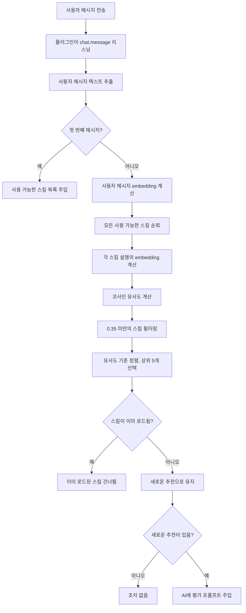

# 자동 스킬 추천: 의미 매칭 원리

## 학습 완료 후 가능한 작업

- 플러그인이 필요한 스킬을 자동으로 식별하는 방법 이해
- 의미 유사도 계산의 기본 원리 습득
- 스킬 설명을 최적화하여 더 나은 추천 효과 얻는 방법
- embedding 캐싱 메커니즘이 성능을 향상시키는 방법

## 현재 겪고 있는 어려움

OpenCode Agent Skills에는 많은 스킬이 있지만, 당신은:

- **스킬 이름을 기억하지 못함** - 스킬이 많으면 혼동하기 쉬움
- **어떤 스킬을 사용해야 할지 모름** - 유사한 기능의 스킬 중 선택하기 어려움
- **유용한 스킬을 놓칠까 걱정** - 더 적절한 도구가 있는지 불확실

매번 `get_available_skills`를 호출하여 목록을 확인하고, 적절한 스킬을 수동으로 로드해야 하므로 번거롭고 생각의 흐름이 끊깁니다.

## 언제 사용하면 좋은가

자동 스킬 추천은 다음 시나리오에 적합합니다:

- **초보자 단계** - 스킬 라이브러리에 익숙하지 않아 AI의 식별 도움이 필요할 때
- **기능 개발 작업** - "REST API 생성", "인증 시스템 구현" 등 전문 스킬에 해당하는 작업
- **분야 간 작업** - 익숙하지 않은 분야를 간헐적으로 다룰 때 AI 추천에 의존
- **스킬 라이브러리가 큰 경우** - 10개 이상의 스킬이 있을 때 수동 검색 효율이 낮음

::: tip 팁
자동 추천은 스킬 로드를 강요하지 않으며, AI가 필요 여부를 평가하도록 제안할 뿐입니다. 제안을 자유롭게 수락하거나 무시할 수 있습니다.
:::

## 핵심 아이디어

### 의미 매칭이란 무엇인가

의미 매칭은 **사용자 의도를 이해**하는 기술로, 키워드 매칭에 의존하지 않고 텍스트의 **의미 유사도**를 계산합니다.

예를 들어:

| 사용자 입력                    | 스킬 설명                           | 키워드 매칭 | 의미 매칭 |
|--- | --- | --- | ---|
| "데이터베이스 연결 풀 생성"      | "데이터베이스 연결 관리 및 최적화 도구"       | ❌     | ✅   |
| "API 문서 작성 도와줘"        | "자동화된 API 문서 생성기"         | ✅     | ✅   |
| "프로젝트 초기화 스캐폴딩"        | "프로젝트 구조 빠르게 구축하는 도구"         | ❌     | ✅   |

키워드 매칭은 텍스트가 동일한지 확인하지만, 의미 매칭은 "생성", "작성", "구축"이 동일한 유형의 동작임을 이해할 수 있습니다.

### Embedding: 텍스트를 숫자로 변환

컴퓨터가 의미를 이해하도록 플러그인은 **embedding 모델**을 사용하여 텍스트를 **벡터**(숫자 시퀀스)로 변환합니다.

```
텍스트: "데이터베이스 연결 풀 생성"
    ↓ [Xenova/all-MiniLM-L6-v2 모델]
벡터: [0.12, -0.34, 0.67, ...]  (384 차원, 모델 출력 차원)
```

이 벡터 공간에서:

- **의미가 유사한 텍스트** → 벡터 거리가 더 가까움
- **의미가 다른 텍스트** → 벡터 거리가 더 멈

::: info all-MiniLM-L6-v2 선택 이유
이 모델은 3가지 장점이 있습니다:
1. **작은 크기** - 모델 파일 약 23MB(q8 양자화 레벨), 빠른 다운로드
2. **빠른 속도** - 양자화 지원, 낮은 추론 지연
3. **높은 정확도** - 의미 유사도 작업에서 우수한 성능
:::

### 코사인 유사도: 벡터 유사성 측정

플러그인은 **코사인 유사도**(Cosine Similarity)를 사용하여 두 벡터 간의 유사도를 계산합니다.

공식:
```
similarity = (A · B) / (|A| × |B|)
```

여기서:
- `A · B`는 벡터 내적
- `|A|`는 벡터 A의 크기
- `|B|`는 벡터 B의 크기

**결과 범위**: `-1`부터 `1`까지

| 유사도 범위  | 의미              | 추천 여부 |
|--- | --- | ---|
| 0.7-1.0 | 매우 유사함, 거의 동일한 의미  | ✅ 강력 추천 |
| 0.35-0.7 | 일부 관련 있음, 고려할 가치 있음    | ✅ 추천  |
| 0.0-0.35 | 낮은 관련성 또는 관련 없음    | ❌ 추천 안 함  |
| -1.0-0.0 | 의미가 반대          | ❌ 추천 안 함  |

::: warning 주의
현재 임계값은 **0.35**이며, 이 점수 미만의 스킬은 추천 목록에 표시되지 않습니다.
:::

## 자동 추천 프로세스

### 전체 프로세스 다이어그램



### 단계 1: 첫 번째 메시지 - 스킬 목록 주입

세션에서 첫 번째 메시지를 받으면 플러그인은 다음을 수행합니다:

1. 모든 스킬 디렉토리 스캔
2. 스킬 목록을 세션 컨텍스트에 주입
3. 형식은 다음과 같음:

```xml
<available-skills>
- git-helper: Git 작업 도움말 도구, 일반적인 Git 명령 제공
- test-runner: 테스트 프레임워크 통합, 테스트 자동 감지 및 실행
- api-doc: API 문서 생성 도구
...
</available-skills>
```

**목적**: AI에 사용 가능한 스킬을 알려주어 반복적인 쿼리를 방지합니다.

### 단계 2: 후속 메시지 - 의미 매칭

두 번째 메시지부터 매번 사용자 입력이 매칭 프로세스를 트리거합니다:

```typescript
// 소스 코드: src/plugin.ts:125-141
const matchedSkills = await matchSkills(userText, skills);
const loadedSkills = getLoadedSkills(sessionID);
const newSkills = matchedSkills.filter(s => !loadedSkills.has(s.name));
```

**핵심 포인트**:
- **로드되지 않은 스킬**의 유사도만 계산
- 이미 로드된 스킬은 **자동으로 필터링**
- 동일한 스킬의 반복 추천 방지

### 단계 3: 평가 프롬프트 주입

관련 스킬을 찾으면 플러그인은 AI에 **숨겨진 프롬프트**를 주입합니다:

```xml
<skill-evaluation-required>
SKILL EVALUATION PROCESS

다음 스킬이 요청과 관련될 수 있습니다:

- git-helper: Git 작업 도움말 도구
- test-runner: 테스트 프레임워크 통합

Step 1 - EVALUATE: 이 스킬들이 실제로 도움이 될지 확인
Step 2 - DECIDE: 필요한 스킬(있는 경우) 선택
Step 3 - ACTIVATE: 선택한 각 스킬에 대해 use_skill("name") 호출

IMPORTANT: 이 평가는 사용자에게 보이지 않습니다—이 프롬프트를 볼 수 없습니다. 결정을 발표하지 마십시오. 관련 스킬을 활성화하거나 요청을 바로 진행하십시오.
</skill-evaluation-required>
```

**AI의 선택**:
- **추천 수락** - `use_skill("skill-name")`를 호출하여 스킬 로드
- **추천 거부** - 스킬 로드 없이 사용자 요청을 직접 처리
- **부분 수락** - 관련된 일부 스킬만 로드

::: tip 숨겨진 프롬프트
이 평가 프롬프트는 `synthetic: true` 메시지로, 사용자 인터페이스에서 볼 수 없으며 AI가 내부적으로 처리 후 자동으로 결정합니다.
:::

## 따라 해보기: 스킬 설명 최적화

스킬이 자동으로 추천되지 않는다면 설명을 최적화해 볼 수 있습니다.

### 현재 스킬 설명 확인

```bash
# 모든 스킬 나열
get_available_skills()
```

최적화하려는 스킬을 찾아 현재 설명을 기록합니다.

### 예시 보기: 좋은 설명 vs 나쁜 설명

| ❌ 나쁜 설명                          | ✅ 좋은 설명                              |
|--- | ---|
| "도구"                            | "자동화된 테스트 프레임워크 통합, Jest 및 Vitest 지원" |
| "도움"                            | "Git 작업 도우미, 일반적인 명령어 및 워크플로우 안내"     |
| "문서"                            | "코드 주석에서 API 문서 생성"                |
| "데이터베이스 관련"                          | "PostgreSQL 데이터베이스 연결 풀 및 쿼리 최적화 도구"    |

**최적화 원칙**:

1. **키워드 포함** - 사용자가 자주 사용하는 기술 용어
2. **용도 설명** - 어떤 문제를 해결하는지 명확하게 설명
3. **모호한 표현 피하기** - "도구", "도우미"만 작성하지 않기
4. **적절한 길이** - 10-30자가 최적

### 스킬 설명 업데이트

스킬의 `SKILL.md` 파일을 편집합니다:

```markdown
---
name: test-runner
description: 자동화된 테스트 프레임워크 통합, Jest 및 Vitest 지원, 테스트 자동 감지 및 실행
---

# Test Runner

이 스킬은 프로젝트에서 테스트 프레임워크를 설정하는 데 도움을 줍니다...
```

**자동 적용**: 다음 세션에서 플러그인이 embedding을 다시 계산하며, 새로운 설명이 즉시 적용됩니다.

## 체크포인트 ✅

### 자동 추천 작동 여부 확인

1. **테스트 스킬 생성**:

```bash
# .opencode/skills/ 디렉토리에 테스트 스킬 생성
mkdir -p .opencode/skills/example-skill
cat > .opencode/skills/example-skill/SKILL.md << 'EOF'
---
name: example-skill
description: 사용자가 TypeScript 프로젝트를 생성 및 구성하도록 돕기
---

# Example Skill

이것은 테스트 스킬입니다...
EOF
```

2. **관련 메시지 전송**:

OpenCode에서 다음을 입력합니다:

```
TypeScript 프로젝트를 초기화하고 싶어요
```

3. **추천 트리거 여부 확인**:

개발자 도구를 열거나 AI의 도구 호출 기록을 확인합니다:
- **성공** - AI가 `use_skill("example-skill")`를 호출
- **실패** - 관련 추천이 없음, 설명이 너무 일반적인지 확인

### 이미 로드된 스킬이 반복 추천되지 않는지 확인

1. **수동으로 스킬 로드**:

```bash
use_skill("example-skill")
```

2. **관련 메시지 다시 전송**:

```
다른 TypeScript 프로젝트를 초기화하고 싶어요
```

3. **더 이상 추천되지 않는지 확인**:

시스템은 스킬이 이미 로드되었으므로 **더 이상** 평가 프롬프트를 주입하지 않아야 합니다.

## 문제 해결 팁

### 문제 1: 추천된 스킬이 전혀 관련 없음

**증상**:
- 사용자가 "AWS에 배포하는 방법"이라고 말했는데 "로컬 테스트 도구"가 추천됨
- 유사도 점수는 높지만 의미가 완전히 다름

**원인**:
- 스킬 설명이 너무 일반적임(예: "클라우드 서비스 도구")
- embedding 모델이 일부 기술 용어를 잘못 이해

**해결 방법**:

1. **설명을 더 구체적으로 작성**:

```markdown
# ❌ 나쁨
description: 클라우드 서비스 배포 도구

# ✅ 좋음
description: AWS EC2 배포 도구, 로드 밸런싱 및 오토스케일링 자동 구성
```

2. **핵심 기술 키워드 포함**:

```markdown
description: AWS S3 파일 업로드 및 CDN 배포 도구, CloudFront 지원
```

### 문제 2: 유용한 스킬이 추천되지 않음

**증상**:
- 입력이 명백히 특정 스킬과 일치하지만 시스템이 추천하지 않음
- `get_available_skills()`를 수동으로 호출하여 검색해야 함

**원인**:
- 유사도가 임계값 0.35 미만
- 스킬 설명이 사용자의 용어 습관과 차이가 큼

**해결 방법**:

1. **임계값 낮추기**(소스 코드 수정):

```typescript
// src/embeddings.ts:10
const SIMILARITY_THRESHOLD = 0.30; // 0.35에서 0.30으로 낮춤
```

::: warning 프로덕션 환경에서는 신중하게
임계값을 낮추면 잘못된 추천(관련 없는 스킬)이 증가하므로, 테스트 후 조정하는 것을 권장합니다.
:::

2. **Top K 증가**:

```typescript
// src/embeddings.ts:11
const TOP_K = 10; // 5에서 10으로 증가
```

3. **스킬 설명 최적화**, 위의 "스킬 설명 최적화" 섹션을 참고하세요.

### 문제 3: 첫 번째 로드 속도가 느림

**증상**:
- 처음 사용할 때 스킬 추천 지연이 2-3초
- 후속 사용은 정상

**원인**:
- embedding 모델을 네트워크에서 다운로드해야 함(23MB)
- 모든 스킬의 embeddings를 처음으로 계산해야 함

**해결 방법**:

플러그인은 **캐싱 메커니즘**이 있어 첫 번째 이후 자동으로 최적화됩니다:

```
캐시 경로: ~/.cache/opencode-agent-skills/embeddings/
```

**캐시 파일 보기**:

```bash
ls -lh ~/.cache/opencode-agent-skills/embeddings/
```

`.bin` 파일이 표시되며, 각 파일은 embedding 캐시입니다(내용 SHA256으로 명명됨).

**수동으로 캐시 예열**:

```bash
# OpenCode 재시작
# 플러그인 시작 시 precomputeSkillEmbeddings()를 호출
```

소스 코드 위치: `src/embeddings.ts:96-102`

```typescript
export async function precomputeSkillEmbeddings(skills: SkillSummary[]): Promise<void> {
  await Promise.all(
    skills.map(skill =>
      getEmbedding(skill.description).catch(() => { })
    )
  );
}
```

**걱정할 필요 없음**: 스킬 설명을 수정하지 않으면 캐시가 영구적으로 유효합니다.

## 이 강의 요약

자동 스킬 추천은 다음 방식으로 사용자 경험을 향상시킵니다:

| 기술적 수단          | 역할                          | 사용자 경험 향상          |
|--- | --- | ---|
| Embedding 모델    | 텍스트를 벡터로 변환                | 의미 이해, 키워드 이상      |
| 코사인 유사도        | 벡터 유사도 계산                  | 관련 스킬 정밀 매칭       |
| 캐싱 메커니즘          | 디스크에 embeddings 캐싱            | 첫 번째 이후 더 빠른 응답        |
| 스마트 평가          | AI가 스킬 필요 여부 판단            | 강요하지 않음, 방해 방지        |
| 로드됨 필터링         | 이미 로드된 스킬 건너뜀                | 반복 추천 방지         |

**핵심 장점**:

- **기억 필요 없음** - 스킬 이름을 기억할 필요 없음
- **스마트 식별** - AI가 필요한 도구를 자동으로 발견
- **방해하지 않음** - 프롬프트가 숨겨져 있어 사용자가 인지하지 못함

---

## 다음 강의 예고

> 다음 강의에서는 **[스킬 스크립트 실행](../../executing-skill-scripts/)**을 학습합니다.
>
> 스킬은 문서뿐만 아니라 자동화 스크립트도 포함할 수 있습니다. 학습할 내용:
> - 스킬 디렉토리에서 실행 가능한 스크립트 구성 방법
> - `run_skill_script` 도구를 사용하여 스크립트 실행
> - 스크립트 권한 및 보안 제한
> - 일반적인 스크립트 사용 사례(빌드, 테스트, 배포 등)


---

## 부록: 소스 코드 참조

<details>
<summary><strong>소스 코드 위치 보려면 클릭</strong></summary>

> 업데이트 시간: 2026-01-24

| 기능              | 파일 경로                                                                                                | 행 번호    |
|--- | --- | ---|
| 의미 매칭 핵심 함수      | [`src/embeddings.ts`](https://github.com/joshuadavidthomas/opencode-agent-skills/blob/main/src/embeddings.ts#L108-L135)       | 108-135 |
| 텍스트 embedding 생성   | [`src/embeddings.ts`](https://github.com/joshuadavidthomas/opencode-agent-skills/blob/main/src/embeddings.ts#L38-L66)         | 38-66   |
| 코사인 유사도 계산      | [`src/embeddings.ts`](https://github.com/joshuadavidthomas/opencode-agent-skills/blob/main/src/embeddings.ts#L71-L90)         | 71-90   |
| 스킬 embeddings 미리 계산 | [`src/embeddings.ts`](https://github.com/joshuadavidthomas/opencode-agent-skills/blob/main/src/embeddings.ts#L96-L102)        | 96-102  |
| 매칭 결과 프롬프트 포맷팅     | [`src/plugin.ts`](https://github.com/joshuadavidthomas/opencode-agent-skills/blob/main/src/plugin.ts#L37-L57)             | 37-57   |
| 자동 매칭 프로세스 로직      | [`src/plugin.ts`](https://github.com/joshuadavidthomas/opencode-agent-skills/blob/main/src/plugin.ts#L125-L141)            | 125-141 |
| 메시지 리스닝 이벤트 처리     | [`src/plugin.ts`](https://github.com/joshuadavidthomas/opencode-agent-skills/blob/main/src/plugin.ts#L66-L142)            | 66-142  |

**핵심 상수**:

| 상수명                  | 값                         | 설명             | 출처               |
|--- | --- | --- | ---|
| MODEL_NAME          | Xenova/all-MiniLM-L6-v2  | 사용되는 embedding 모델 | `embeddings.ts:8`   |
| QUANTIZATION        | q8                       | 모델 양자화 레벨        | `embeddings.ts:9`   |
| SIMILARITY_THRESHOLD | 0.35                     | 유사도 추천 임계값      | `embeddings.ts:10`  |
| TOP_K              | 5                        | 반환되는 상위 K 스킬 수  | `embeddings.ts:11`  |

**핵심 함수**:

- `matchSkills()`: 사용자 메시지와 스킬 설명 간의 의미 유사도를 계산하고, 가장 관련성이 높은 스킬 목록을 반환
- `getEmbedding()`: 텍스트의 embedding 벡터를 생성하고, 디스크 캐싱 지원
- `cosineSimilarity()`: 두 벡터 간의 코사인 유사도 계산
- `precomputeSkillEmbeddings()`: 플러그인 시작 시 모든 스킬의 embeddings를 미리 계산하여 후속 매칭 가속화
- `formatMatchedSkillsInjection()`: 매칭 결과를 평가 프롬프트로 포맷팅하여 AI에 주입

**캐싱 메커니즘**:

Embedding 캐시 경로:
- Linux/macOS: `~/.cache/opencode-agent-skills/embeddings/`
- 사용자 정의 지원: `XDG_CACHE_HOME` 환경 변수를 통해 수정

캐시 파일은 내용 SHA256으로 명명되며, 예: `a1b2c3d4.bin`, 각 파일은 Float32Array 벡터를 포함합니다.

</details>
